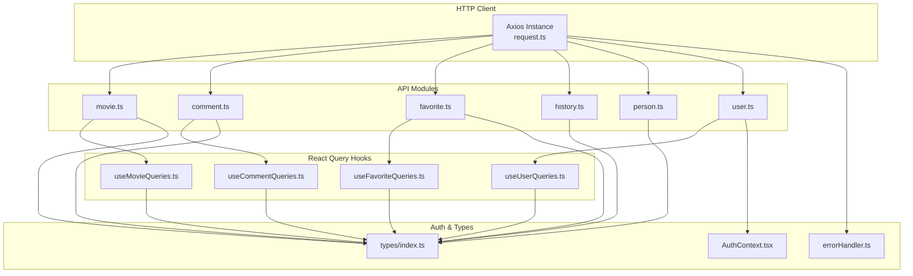
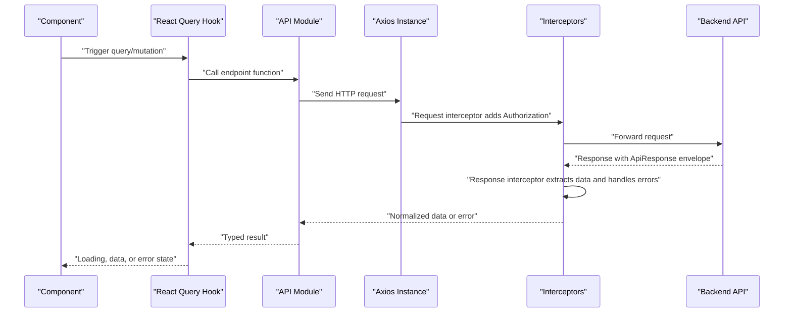
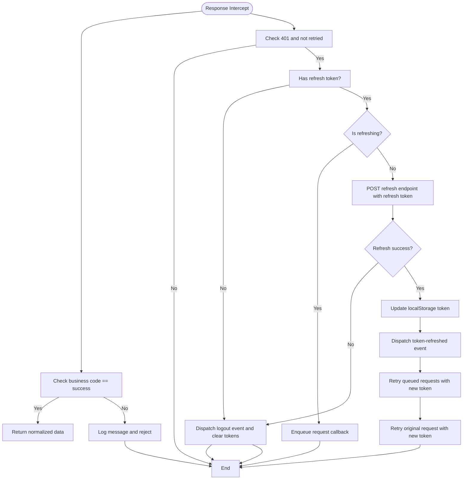
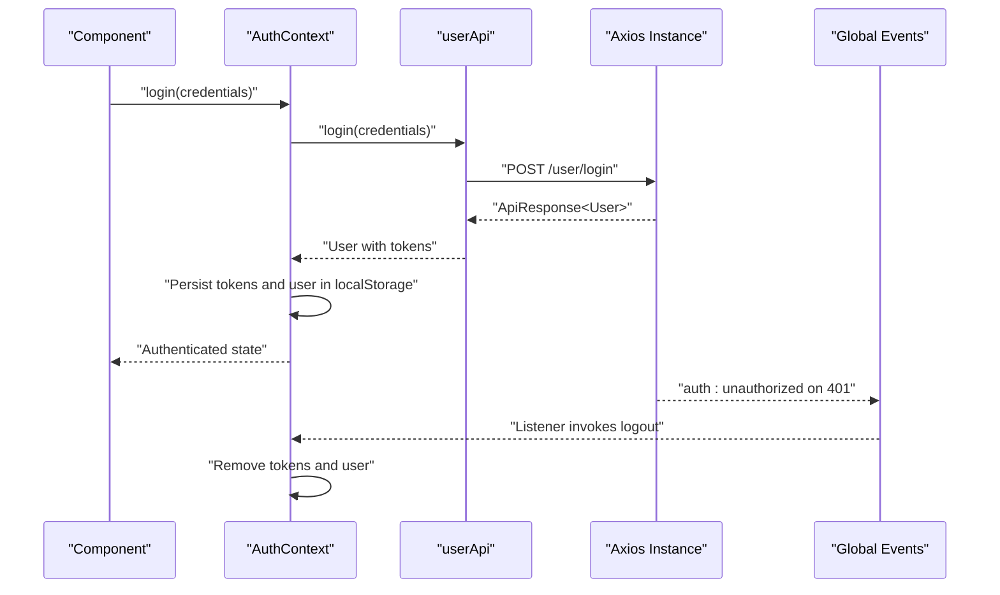
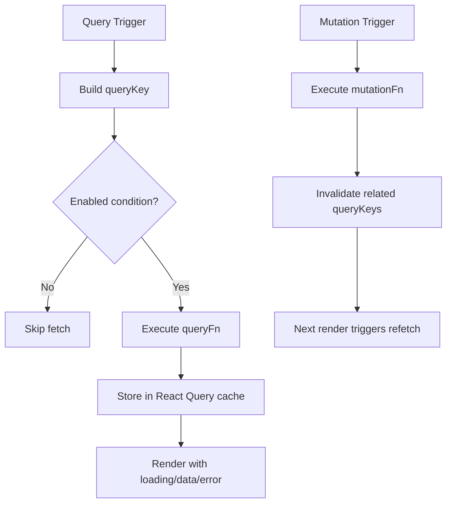
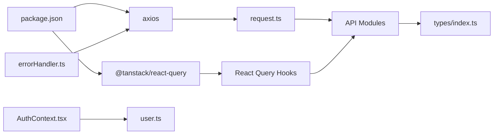

# API Integration Layer

<cite>
**Referenced Files in This Document**
- [request.ts](file://movie-review-web/src/api/request.ts)
- [movie.ts](file://movie-review-web/src/api/movie.ts)
- [comment.ts](file://movie-review-web/src/api/comment.ts)
- [favorite.ts](file://movie-review-web/src/api/favorite.ts)
- [history.ts](file://movie-review-web/src/api/history.ts)
- [person.ts](file://movie-review-web/src/api/person.ts)
- [user.ts](file://movie-review-web/src/api/user.ts)
- [useMovieQueries.ts](file://movie-review-web/src/hooks/useMovieQueries.ts)
- [useCommentQueries.ts](file://movie-review-web/src/hooks/useCommentQueries.ts)
- [useFavoriteQueries.ts](file://movie-review-web/src/hooks/useFavoriteQueries.ts)
- [useUserQueries.ts](file://movie-review-web/src/hooks/useUserQueries.ts)
- [AuthContext.tsx](file://movie-review-web/src/context/AuthContext.tsx)
- [errorHandler.ts](file://movie-review-web/src/utils/errorHandler.ts)
- [index.ts](file://movie-review-web/src/types/index.ts)
- [package.json](file://movie-review-web/package.json)
- [vite.config.ts](file://movie-review-web/vite.config.ts)
</cite>

## Table of Contents
1. [Introduction](#introduction)
2. [Project Structure](#project-structure)
3. [Core Components](#core-components)
4. [Architecture Overview](#architecture-overview)
5. [Detailed Component Analysis](#detailed-component-analysis)
6. [Dependency Analysis](#dependency-analysis)
7. [Performance Considerations](#performance-considerations)
8. [Troubleshooting Guide](#troubleshooting-guide)
9. [Conclusion](#conclusion)
10. [Appendices](#appendices)

## Introduction
This document describes the API integration layer and HTTP client configuration for the frontend application. It covers the Axios instance setup, request/response interceptors, and authentication integration. It also explains React Query configuration, caching strategies, and data synchronization patterns, along with custom hooks for data fetching, error handling, and state management. Examples of API client usage, request formatting, and response processing are included, alongside strategies for error handling, loading states, offline behavior, API versioning, rate limiting, and performance optimization.

## Project Structure
The API integration layer is organized around a shared Axios instance and domain-specific API modules. React Query custom hooks encapsulate queries and mutations, while a centralized authentication context manages tokens and user state. Shared types define the API response envelope and domain entities.

**Diagram sources**
- [request.ts](file://movie-review-web/src/api/request.ts#L8-L11)
- [movie.ts](file://movie-review-web/src/api/movie.ts#L1-L65)
- [comment.ts](file://movie-review-web/src/api/comment.ts#L1-L49)
- [favorite.ts](file://movie-review-web/src/api/favorite.ts#L1-L97)
- [history.ts](file://movie-review-web/src/api/history.ts#L1-L38)
- [person.ts](file://movie-review-web/src/api/person.ts#L1-L18)
- [user.ts](file://movie-review-web/src/api/user.ts#L1-L36)
- [useMovieQueries.ts](file://movie-review-web/src/hooks/useMovieQueries.ts#L1-L95)
- [useCommentQueries.ts](file://movie-review-web/src/hooks/useCommentQueries.ts#L1-L102)
- [useFavoriteQueries.ts](file://movie-review-web/src/hooks/useFavoriteQueries.ts#L1-L174)
- [useUserQueries.ts](file://movie-review-web/src/hooks/useUserQueries.ts#L1-L36)
- [AuthContext.tsx](file://movie-review-web/src/context/AuthContext.tsx#L20-L123)
- [index.ts](file://movie-review-web/src/types/index.ts#L1-L204)
- [errorHandler.ts](file://movie-review-web/src/utils/errorHandler.ts#L1-L60)

**Section sources**
- [request.ts](file://movie-review-web/src/api/request.ts#L8-L11)
- [movie.ts](file://movie-review-web/src/api/movie.ts#L1-L65)
- [comment.ts](file://movie-review-web/src/api/comment.ts#L1-L49)
- [favorite.ts](file://movie-review-web/src/api/favorite.ts#L1-L97)
- [history.ts](file://movie-review-web/src/api/history.ts#L1-L38)
- [person.ts](file://movie-review-web/src/api/person.ts#L1-L18)
- [user.ts](file://movie-review-web/src/api/user.ts#L1-L36)
- [useMovieQueries.ts](file://movie-review-web/src/hooks/useMovieQueries.ts#L1-L95)
- [useCommentQueries.ts](file://movie-review-web/src/hooks/useCommentQueries.ts#L1-L102)
- [useFavoriteQueries.ts](file://movie-review-web/src/hooks/useFavoriteQueries.ts#L1-L174)
- [useUserQueries.ts](file://movie-review-web/src/hooks/useUserQueries.ts#L1-L36)
- [AuthContext.tsx](file://movie-review-web/src/context/AuthContext.tsx#L20-L123)
- [index.ts](file://movie-review-web/src/types/index.ts#L1-L204)
- [errorHandler.ts](file://movie-review-web/src/utils/errorHandler.ts#L1-L60)

## Core Components
- Axios instance with base URL and timeout
- Request interceptor adding Authorization header from localStorage
- Response interceptor extracting data and handling business errors
- Centralized 401 handling with silent refresh and queueing pending requests
- Domain API modules exposing typed endpoints
- React Query hooks with explicit query keys and cache invalidation
- Authentication context managing tokens and user state with global events
- Shared types defining ApiResponse envelope and domain entities
- Unified error extraction utility

**Section sources**
- [request.ts](file://movie-review-web/src/api/request.ts#L8-L11)
- [request.ts](file://movie-review-web/src/api/request.ts#L13-L19)
- [request.ts](file://movie-review-web/src/api/request.ts#L21-L106)
- [user.ts](file://movie-review-web/src/api/user.ts#L27-L32)
- [AuthContext.tsx](file://movie-review-web/src/context/AuthContext.tsx#L88-L110)
- [index.ts](file://movie-review-web/src/types/index.ts#L1-L6)
- [errorHandler.ts](file://movie-review-web/src/utils/errorHandler.ts#L17-L60)

## Architecture Overview
The integration layer follows a layered pattern:
- HTTP client layer: Axios instance with interceptors
- API module layer: Typed endpoints per domain
- React Query layer: Queries and mutations with cache keys and invalidation
- Authentication layer: Context and global events for token lifecycle
- Utilities and types: Shared response envelope and domain models

**Diagram sources**
- [request.ts](file://movie-review-web/src/api/request.ts#L13-L19)
- [request.ts](file://movie-review-web/src/api/request.ts#L21-L106)
- [movie.ts](file://movie-review-web/src/api/movie.ts#L19-L20)
- [useMovieQueries.ts](file://movie-review-web/src/hooks/useMovieQueries.ts#L19-L24)

## Detailed Component Analysis

### Axios Instance and Interceptors
- Base URL and timeout configured centrally
- Request interceptor reads token from localStorage and attaches Authorization header
- Response interceptor:
  - Extracts data from ApiResponse envelope when code equals success
  - Logs and rejects with user-friendly messages when business code indicates failure
- 401 handling:
  - Prevents concurrent refresh attempts using a flag and request queue
  - Attempts silent refresh via a dedicated endpoint
  - On success, updates localStorage, dispatches a global event to update AuthContext, retries queued requests with new token
  - On failure, dispatches a global logout event and clears tokens

**Diagram sources**
- [request.ts](file://movie-review-web/src/api/request.ts#L21-L106)

**Section sources**
- [request.ts](file://movie-review-web/src/api/request.ts#L8-L11)
- [request.ts](file://movie-review-web/src/api/request.ts#L13-L19)
- [request.ts](file://movie-review-web/src/api/request.ts#L21-L106)

### Authentication Integration
- AuthContext initializes token and user from localStorage synchronously
- Provides login, register, and logout functions
- Listens for global events:
  - Unauthorized event triggers logout
  - Token refreshed event updates token in context
- userApi exposes login, register, current user info, public user info, and refresh endpoint

**Diagram sources**
- [AuthContext.tsx](file://movie-review-web/src/context/AuthContext.tsx#L44-L86)
- [AuthContext.tsx](file://movie-review-web/src/context/AuthContext.tsx#L88-L110)
- [user.ts](file://movie-review-web/src/api/user.ts#L5-L20)
- [request.ts](file://movie-review-web/src/api/request.ts#L34-L101)

**Section sources**
- [AuthContext.tsx](file://movie-review-web/src/context/AuthContext.tsx#L20-L123)
- [user.ts](file://movie-review-web/src/api/user.ts#L1-L36)

### React Query Configuration and Caching Strategies
- Explicit query keys for movies, comments, favorites, and users
- Enabled queries only when preconditions are met (e.g., valid IDs or keywords)
- Stale-time configuration for user info
- Mutation success handlers invalidate related caches to keep UI synchronized
- Batch operations use array-based invalidations

**Diagram sources**
- [useMovieQueries.ts](file://movie-review-web/src/hooks/useMovieQueries.ts#L14-L25)
- [useCommentQueries.ts](file://movie-review-web/src/hooks/useCommentQueries.ts#L15-L22)
- [useFavoriteQueries.ts](file://movie-review-web/src/hooks/useFavoriteQueries.ts#L20-L26)
- [useUserQueries.ts](file://movie-review-web/src/hooks/useUserQueries.ts#L12-L22)

**Section sources**
- [useMovieQueries.ts](file://movie-review-web/src/hooks/useMovieQueries.ts#L1-L95)
- [useCommentQueries.ts](file://movie-review-web/src/hooks/useCommentQueries.ts#L1-L102)
- [useFavoriteQueries.ts](file://movie-review-web/src/hooks/useFavoriteQueries.ts#L1-L174)
- [useUserQueries.ts](file://movie-review-web/src/hooks/useUserQueries.ts#L1-L36)

### Domain API Modules
- movieApi: hot, latest, recommended, detail, search, ratings (submit, get, update, list, batch delete, clear)
- commentApi: comments list (with or without ratings), submit, like toggle, update content, user comment, my comments
- favoriteApi: add/remove, status, favorites list, count, folder CRUD, folder movies, batch operations
- historyApi: history list, delete, batch delete, clear, count
- personApi: person detail, movies, list
- userApi: login, register, current info, public info, refresh

Each module uses the shared Axios instance and returns typed data extracted by interceptors.

**Section sources**
- [movie.ts](file://movie-review-web/src/api/movie.ts#L1-L65)
- [comment.ts](file://movie-review-web/src/api/comment.ts#L1-L49)
- [favorite.ts](file://movie-review-web/src/api/favorite.ts#L1-L97)
- [history.ts](file://movie-review-web/src/api/history.ts#L1-L38)
- [person.ts](file://movie-review-web/src/api/person.ts#L1-L18)
- [user.ts](file://movie-review-web/src/api/user.ts#L1-L36)

### Custom Hooks for Data Fetching, Error Handling, and State Management
- useMovieQueries: movie detail, my ratings, search, latest; mutations for rating and batch/clear
- useCommentQueries: comments list, my comments, user comment; mutations for submit, update, like
- useFavoriteQueries: favorites list, count, status, folders CRUD, folder movies; mutations for add/remove, batch, folders
- useUserQueries: current user info (staleTime), public user info
- errorHandler: unified extraction of user-friendly messages from Axios errors and ApiResponse envelopes

**Section sources**
- [useMovieQueries.ts](file://movie-review-web/src/hooks/useMovieQueries.ts#L1-L95)
- [useCommentQueries.ts](file://movie-review-web/src/hooks/useCommentQueries.ts#L1-L102)
- [useFavoriteQueries.ts](file://movie-review-web/src/hooks/useFavoriteQueries.ts#L1-L174)
- [useUserQueries.ts](file://movie-review-web/src/hooks/useUserQueries.ts#L1-L36)
- [errorHandler.ts](file://movie-review-web/src/utils/errorHandler.ts#L1-L60)

### API Client Usage, Request Formatting, and Response Processing
- Request formatting:
  - GET/POST/DELETE with typed ApiResponse envelope
  - Query parameters passed via config.params
  - DELETE body placed in config.data
- Response processing:
  - Interceptor returns data field when business code indicates success
  - Business failures are rejected with user-friendly messages
- Example usage patterns:
  - movieApi.getDetail(movieId)
  - commentApi.getComments(movieId, page, size)
  - favoriteApi.addFavorite(movieId, folderId)
  - userApi.login(credentials)

**Section sources**
- [movie.ts](file://movie-review-web/src/api/movie.ts#L19-L32)
- [comment.ts](file://movie-review-web/src/api/comment.ts#L5-L14)
- [favorite.ts](file://movie-review-web/src/api/favorite.ts#L6-L9)
- [user.ts](file://movie-review-web/src/api/user.ts#L6-L9)
- [request.ts](file://movie-review-web/src/api/request.ts#L21-L29)

## Dependency Analysis
- Axios and React Query are declared dependencies
- Vite plugin stack includes React and Tailwind
- API modules depend on the shared Axios instance
- React Query hooks depend on API modules and types
- AuthContext depends on userApi and localStorage
- errorHandler depends on AxiosError

**Diagram sources**
- [package.json](file://movie-review-web/package.json#L12-L23)
- [vite.config.ts](file://movie-review-web/vite.config.ts#L6-L11)
- [request.ts](file://movie-review-web/src/api/request.ts#L1-L1)
- [useMovieQueries.ts](file://movie-review-web/src/hooks/useMovieQueries.ts#L1-L1)
- [useCommentQueries.ts](file://movie-review-web/src/hooks/useCommentQueries.ts#L1-L1)
- [useFavoriteQueries.ts](file://movie-review-web/src/hooks/useFavoriteQueries.ts#L1-L1)
- [useUserQueries.ts](file://movie-review-web/src/hooks/useUserQueries.ts#L1-L1)
- [user.ts](file://movie-review-web/src/api/user.ts#L1-L1)
- [index.ts](file://movie-review-web/src/types/index.ts#L1-L1)
- [AuthContext.tsx](file://movie-review-web/src/context/AuthContext.tsx#L1-L1)
- [errorHandler.ts](file://movie-review-web/src/utils/errorHandler.ts#L1-L1)

**Section sources**
- [package.json](file://movie-review-web/package.json#L12-L23)
- [vite.config.ts](file://movie-review-web/vite.config.ts#L6-L11)
- [request.ts](file://movie-review-web/src/api/request.ts#L1-L1)
- [useMovieQueries.ts](file://movie-review-web/src/hooks/useMovieQueries.ts#L1-L1)
- [useCommentQueries.ts](file://movie-review-web/src/hooks/useCommentQueries.ts#L1-L1)
- [useFavoriteQueries.ts](file://movie-review-web/src/hooks/useFavoriteQueries.ts#L1-L1)
- [useUserQueries.ts](file://movie-review-web/src/hooks/useUserQueries.ts#L1-L1)
- [user.ts](file://movie-review-web/src/api/user.ts#L1-L1)
- [index.ts](file://movie-review-web/src/types/index.ts#L1-L1)
- [AuthContext.tsx](file://movie-review-web/src/context/AuthContext.tsx#L1-L1)
- [errorHandler.ts](file://movie-review-web/src/utils/errorHandler.ts#L1-L1)

## Performance Considerations
- Timeout configured on Axios instance to prevent hanging requests
- Stale-time configured for user info to reduce unnecessary network calls
- Query keys designed to enable precise cache invalidation and minimize refetches
- Batch operations leverage Promise.all where appropriate to reduce round trips
- Local storage usage avoids repeated server calls for tokens and user data during initialization

[No sources needed since this section provides general guidance]

## Troubleshooting Guide
- 401 Unauthorized:
  - Silent refresh is attempted automatically; if it fails, the app logs out globally
  - Ensure refresh token exists and is valid
- Business errors:
  - Interceptor rejects with message extracted from ApiResponse; use errorHandler to present friendly messages
- Network errors:
  - AxiosError is handled with status-based defaults; inspect error.response.status and error.message
- Loading states:
  - React Query provides loading, error, and data states; ensure enabled conditions prevent premature fetches
- Offline behavior:
  - No explicit offline persistence is implemented; consider integrating a service worker or local caching strategy if needed

**Section sources**
- [request.ts](file://movie-review-web/src/api/request.ts#L34-L101)
- [errorHandler.ts](file://movie-review-web/src/utils/errorHandler.ts#L17-L60)
- [useUserQueries.ts](file://movie-review-web/src/hooks/useUserQueries.ts#L19-L21)

## Conclusion
The API integration layer centers on a robust Axios instance with interceptors for authentication and standardized response handling, complemented by domain-specific API modules and React Query hooks for efficient caching and synchronization. Authentication is managed via a context that listens for global events to maintain consistency across the app. The design emphasizes predictable cache keys, precise invalidation, and user-friendly error handling, providing a solid foundation for scalable frontend data management.

[No sources needed since this section summarizes without analyzing specific files]

## Appendices

### API Versioning
- No explicit version prefix is applied in the base URL; consider adding a version segment to the baseURL if backend versioning is introduced.

**Section sources**
- [request.ts](file://movie-review-web/src/api/request.ts#L9-L9)

### Rate Limiting
- No client-side rate limiting is implemented; consider adding retry with exponential backoff or request queuing if backend enforces strict limits.

[No sources needed since this section provides general guidance]

### Offline Behavior
- No offline persistence is implemented; consider integrating a caching strategy (e.g., React Query offline mode, IndexedDB) if offline support is required.

[No sources needed since this section provides general guidance]