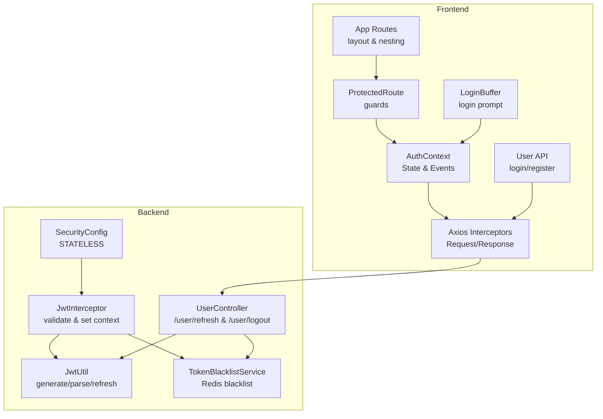
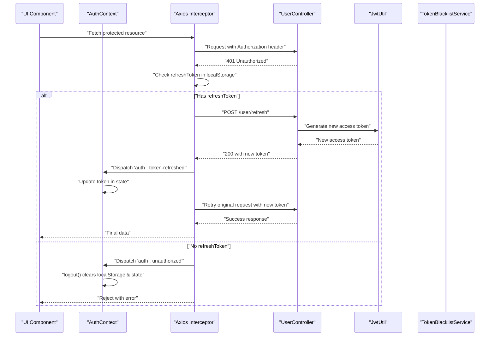
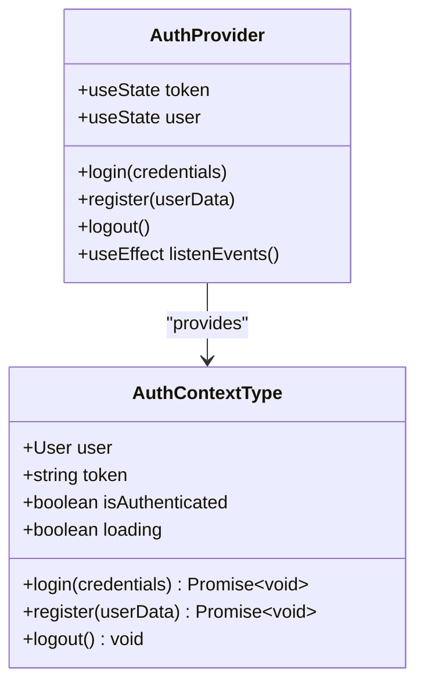
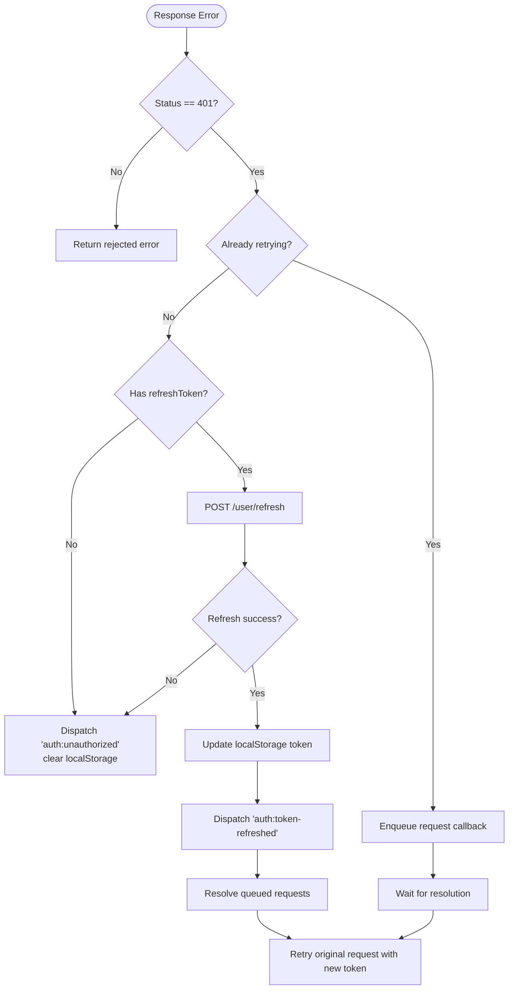
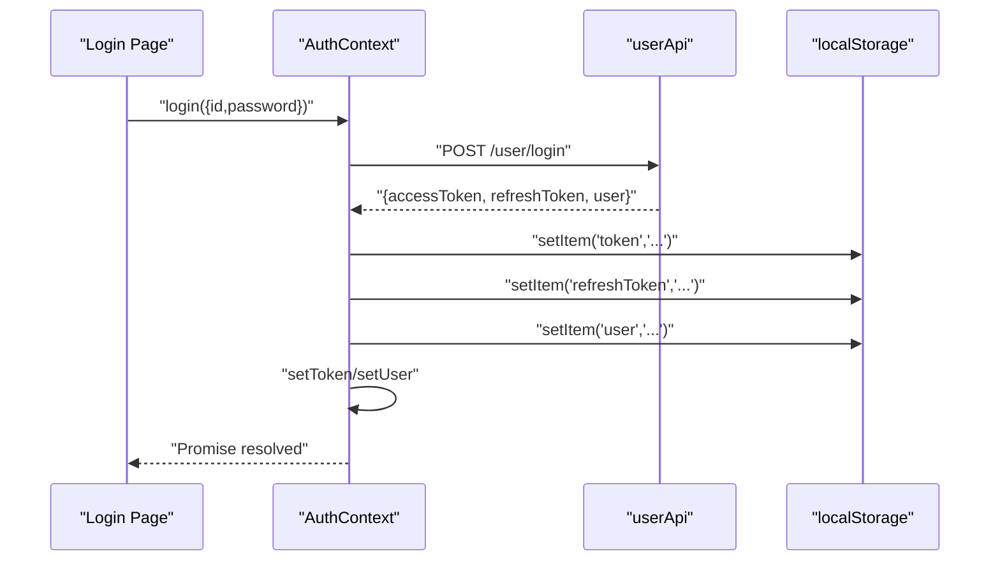
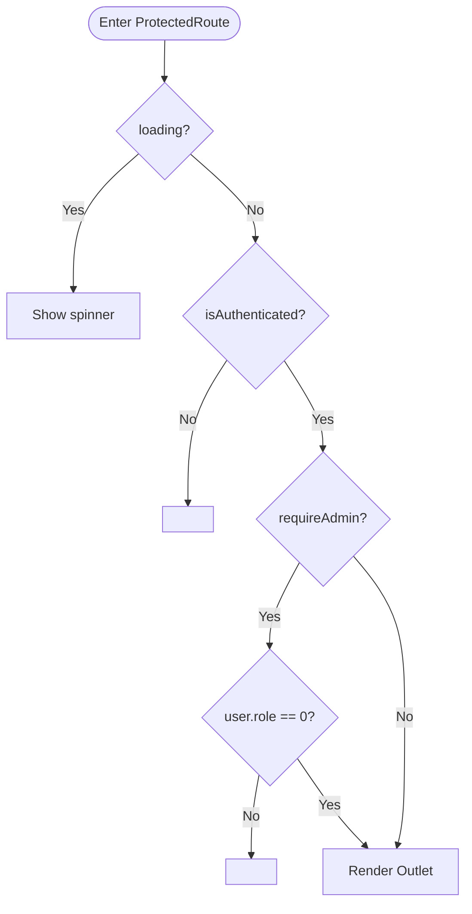
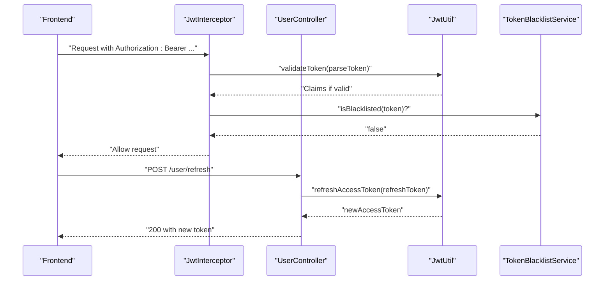
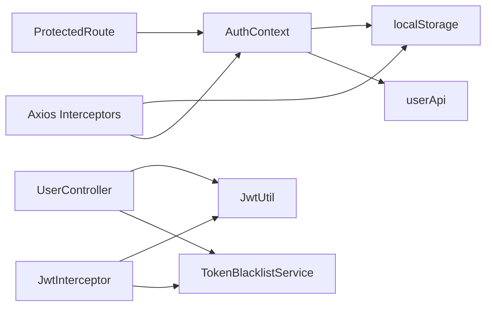

# Authentication Integration

<cite>
**Referenced Files in This Document**
- [AuthContext.tsx](file://movie-review-web/src/context/AuthContext.tsx)
- [request.ts](file://movie-review-web/src/api/request.ts)
- [user.ts](file://movie-review-web/src/api/user.ts)
- [Login.tsx](file://movie-review-web/src/pages/Login.tsx)
- [ProtectedRoute.tsx](file://movie-review-web/src/components/ProtectedRoute.tsx)
- [LoginBuffer.tsx](file://movie-review-web/src/components/LoginBuffer.tsx)
- [App.tsx](file://movie-review-web/src/App.tsx)
- [main.tsx](file://movie-review-web/src/main.tsx)
- [index.ts](file://movie-review-web/src/types/index.ts)
- [JwtInterceptor.java](file://backend/src/main/java/com/movie/backend/config/JwtInterceptor.java)
- [JwtUtil.java](file://backend/src/main/java/com/movie/backend/utils/JwtUtil.java)
- [TokenBlacklistService.java](file://backend/src/main/java/com/movie/backend/service/TokenBlacklistService.java)
- [TokenBlacklistServiceImpl.java](file://backend/src/main/java/com/movie/backend/service/impl/TokenBlacklistServiceImpl.java)
- [UserController.java](file://backend/src/main/java/com/movie/backend/controller/UserController.java)
- [SecurityConfig.java](file://backend/src/main/java/com/movie/backend/config/SecurityConfig.java)
- [application-dev.yml](file://backend/src/main/resources/application-dev.yml)
</cite>

## Table of Contents
1. [Introduction](#introduction)
2. [Project Structure](#project-structure)
3. [Core Components](#core-components)
4. [Architecture Overview](#architecture-overview)
5. [Detailed Component Analysis](#detailed-component-analysis)
6. [Dependency Analysis](#dependency-analysis)
7. [Performance Considerations](#performance-considerations)
8. [Troubleshooting Guide](#troubleshooting-guide)
9. [Conclusion](#conclusion)

## Introduction
This document explains the authentication integration between the React frontend and the backend REST API. It covers how the HTTP client manages tokens, how the React context maintains user state, and how the system handles token refresh and logout events. It also documents protected routes, authentication guards, session management, and security considerations including token persistence and cross-tab synchronization.

## Project Structure
The authentication system spans two applications:
- Frontend (React): Context, HTTP client, and routing
- Backend (Spring Boot): JWT validation, token refresh, and blacklist management

**Diagram sources**
- [AuthContext.tsx](file://movie-review-web/src/context/AuthContext.tsx#L1-L123)
- [request.ts](file://movie-review-web/src/api/request.ts#L1-L108)
- [user.ts](file://movie-review-web/src/api/user.ts#L1-L36)
- [ProtectedRoute.tsx](file://movie-review-web/src/components/ProtectedRoute.tsx#L1-L36)
- [LoginBuffer.tsx](file://movie-review-web/src/components/LoginBuffer.tsx#L1-L74)
- [App.tsx](file://movie-review-web/src/App.tsx#L1-L50)
- [SecurityConfig.java](file://backend/src/main/java/com/movie/backend/config/SecurityConfig.java#L1-L51)
- [JwtInterceptor.java](file://backend/src/main/java/com/movie/backend/config/JwtInterceptor.java#L1-L105)
- [JwtUtil.java](file://backend/src/main/java/com/movie/backend/utils/JwtUtil.java#L1-L76)
- [TokenBlacklistService.java](file://backend/src/main/java/com/movie/backend/service/TokenBlacklistService.java#L1-L29)
- [TokenBlacklistServiceImpl.java](file://backend/src/main/java/com/movie/backend/service/impl/TokenBlacklistServiceImpl.java#L1-L80)
- [UserController.java](file://backend/src/main/java/com/movie/backend/controller/UserController.java#L77-L104)

**Section sources**
- [main.tsx](file://movie-review-web/src/main.tsx#L1-L41)
- [App.tsx](file://movie-review-web/src/App.tsx#L1-L50)

## Core Components
- AuthContext: Centralizes user state, login/logout, and event listeners for token refresh/unauthorized events.
- Axios interceptors: Attach Authorization headers, handle 401 errors, and coordinate silent token refresh.
- User API: Encapsulates login/register calls and exposes refresh endpoint.
- ProtectedRoute: Guards routes based on authentication and role.
- LoginBuffer: Presents a friendly login prompt for restricted content.
- Backend JWT stack: Validates tokens, sets Spring Security context, and manages blacklists.

**Section sources**
- [AuthContext.tsx](file://movie-review-web/src/context/AuthContext.tsx#L1-L123)
- [request.ts](file://movie-review-web/src/api/request.ts#L1-L108)
- [user.ts](file://movie-review-web/src/api/user.ts#L1-L36)
- [ProtectedRoute.tsx](file://movie-review-web/src/components/ProtectedRoute.tsx#L1-L36)
- [LoginBuffer.tsx](file://movie-review-web/src/components/LoginBuffer.tsx#L1-L74)
- [JwtInterceptor.java](file://backend/src/main/java/com/movie/backend/config/JwtInterceptor.java#L1-L105)
- [JwtUtil.java](file://backend/src/main/java/com/movie/backend/utils/JwtUtil.java#L1-L76)
- [TokenBlacklistService.java](file://backend/src/main/java/com/movie/backend/service/TokenBlacklistService.java#L1-L29)
- [TokenBlacklistServiceImpl.java](file://backend/src/main/java/com/movie/backend/service/impl/TokenBlacklistServiceImpl.java#L1-L80)
- [UserController.java](file://backend/src/main/java/com/movie/backend/controller/UserController.java#L77-L104)

## Architecture Overview
The authentication flow integrates React context state, HTTP interceptors, and backend JWT validation. On 401 responses, the frontend attempts a silent refresh using a refresh token, updates local storage, and notifies the context via a custom event. The backend validates tokens, enforces access control, and supports token revocation via a blacklist.

**Diagram sources**
- [request.ts](file://movie-review-web/src/api/request.ts#L33-L105)
- [AuthContext.tsx](file://movie-review-web/src/context/AuthContext.tsx#L88-L110)
- [UserController.java](file://backend/src/main/java/com/movie/backend/controller/UserController.java#L77-L86)
- [JwtUtil.java](file://backend/src/main/java/com/movie/backend/utils/JwtUtil.java#L52-L61)
- [TokenBlacklistService.java](file://backend/src/main/java/com/movie/backend/service/TokenBlacklistService.java#L1-L29)

## Detailed Component Analysis

### AuthContext Implementation
AuthContext manages user state and authentication actions:
- Initializes token and user from localStorage using lazy initialization to avoid hydration mismatches.
- Provides login, register, and logout functions that persist to localStorage and update state.
- Listens for global events:
  - auth:unauthorized triggers logout.
  - auth:token-refreshed updates the token in state.
- Exposes isAuthenticated and loading flags for guards and UI.

**Diagram sources**
- [AuthContext.tsx](file://movie-review-web/src/context/AuthContext.tsx#L106-L120)

**Section sources**
- [AuthContext.tsx](file://movie-review-web/src/context/AuthContext.tsx#L20-L123)
- [index.ts](file://movie-review-web/src/types/index.ts#L105-L114)

### HTTP Client and Interceptors
The Axios instance attaches Authorization headers and centralizes error handling:
- Request interceptor reads token from localStorage and adds Authorization header.
- Response interceptor:
  - Transforms successful responses by extracting data.
  - Handles 401 errors by attempting silent refresh with refreshToken.
  - Prevents concurrent refreshes with a flag and queues pending requests.
  - Dispatches auth:token-refreshed to notify the context.
  - On refresh failure, dispatches auth:unauthorized and clears tokens.

**Diagram sources**
- [request.ts](file://movie-review-web/src/api/request.ts#L21-L106)

**Section sources**
- [request.ts](file://movie-review-web/src/api/request.ts#L1-L108)
- [user.ts](file://movie-review-web/src/api/user.ts#L27-L32)

### Login and Registration Flow
- Login form validates input, calls AuthContext.login, and navigates to the intended destination.
- AuthContext.login persists tokens and user data to localStorage and updates state.
- Registration calls userApi.register and then performs login with the new credentials.

**Diagram sources**
- [Login.tsx](file://movie-review-web/src/pages/Login.tsx#L36-L61)
- [AuthContext.tsx](file://movie-review-web/src/context/AuthContext.tsx#L44-L77)
- [user.ts](file://movie-review-web/src/api/user.ts#L6-L15)

**Section sources**
- [Login.tsx](file://movie-review-web/src/pages/Login.tsx#L1-L148)
- [AuthContext.tsx](file://movie-review-web/src/context/AuthContext.tsx#L44-L77)
- [user.ts](file://movie-review-web/src/api/user.ts#L1-L36)

### Protected Routes and Guards
- ProtectedRoute checks isAuthenticated and user role, redirects unauthenticated users to login with state preservation, and supports requireAdmin.
- LoginBuffer provides a user-friendly prompt to log in for restricted content.

**Diagram sources**
- [ProtectedRoute.tsx](file://movie-review-web/src/components/ProtectedRoute.tsx#L11-L36)
- [LoginBuffer.tsx](file://movie-review-web/src/components/LoginBuffer.tsx#L11-L74)

**Section sources**
- [ProtectedRoute.tsx](file://movie-review-web/src/components/ProtectedRoute.tsx#L1-L36)
- [LoginBuffer.tsx](file://movie-review-web/src/components/LoginBuffer.tsx#L1-L74)
- [App.tsx](file://movie-review-web/src/App.tsx#L34-L43)

### Backend JWT Validation and Token Refresh
- JwtInterceptor extracts Bearer tokens, validates them, checks blacklist, and sets Spring Security context and thread-local user.
- UserController exposes /user/refresh to generate a new access token from a refresh token.
- TokenBlacklistService stores revoked tokens in Redis with TTL equal to remaining validity.

**Diagram sources**
- [JwtInterceptor.java](file://backend/src/main/java/com/movie/backend/config/JwtInterceptor.java#L33-L95)
- [UserController.java](file://backend/src/main/java/com/movie/backend/controller/UserController.java#L77-L86)
- [JwtUtil.java](file://backend/src/main/java/com/movie/backend/utils/JwtUtil.java#L52-L61)
- [TokenBlacklistServiceImpl.java](file://backend/src/main/java/com/movie/backend/service/impl/TokenBlacklistServiceImpl.java#L36-L44)

**Section sources**
- [JwtInterceptor.java](file://backend/src/main/java/com/movie/backend/config/JwtInterceptor.java#L1-L105)
- [JwtUtil.java](file://backend/src/main/java/com/movie/backend/utils/JwtUtil.java#L1-L76)
- [TokenBlacklistService.java](file://backend/src/main/java/com/movie/backend/service/TokenBlacklistService.java#L1-L29)
- [TokenBlacklistServiceImpl.java](file://backend/src/main/java/com/movie/backend/service/impl/TokenBlacklistServiceImpl.java#L1-L80)
- [UserController.java](file://backend/src/main/java/com/movie/backend/controller/UserController.java#L77-L104)

## Dependency Analysis
- Frontend dependencies:
  - AuthContext depends on localStorage and userApi.
  - Axios interceptors depend on localStorage and AuthContext events.
  - ProtectedRoute depends on AuthContext state.
- Backend dependencies:
  - JwtInterceptor depends on JwtUtil and TokenBlacklistService.
  - UserController depends on JwtUtil and TokenBlacklistService.

**Diagram sources**
- [AuthContext.tsx](file://movie-review-web/src/context/AuthContext.tsx#L1-L123)
- [request.ts](file://movie-review-web/src/api/request.ts#L1-L108)
- [user.ts](file://movie-review-web/src/api/user.ts#L1-L36)
- [ProtectedRoute.tsx](file://movie-review-web/src/components/ProtectedRoute.tsx#L1-L36)
- [JwtInterceptor.java](file://backend/src/main/java/com/movie/backend/config/JwtInterceptor.java#L1-L105)
- [JwtUtil.java](file://backend/src/main/java/com/movie/backend/utils/JwtUtil.java#L1-L76)
- [TokenBlacklistService.java](file://backend/src/main/java/com/movie/backend/service/TokenBlacklistService.java#L1-L29)
- [UserController.java](file://backend/src/main/java/com/movie/backend/controller/UserController.java#L77-L104)

**Section sources**
- [AuthContext.tsx](file://movie-review-web/src/context/AuthContext.tsx#L1-L123)
- [request.ts](file://movie-review-web/src/api/request.ts#L1-L108)
- [JwtInterceptor.java](file://backend/src/main/java/com/movie/backend/config/JwtInterceptor.java#L1-L105)

## Performance Considerations
- Token refresh concurrency: The interceptor prevents multiple simultaneous refresh attempts and queues requests, minimizing redundant network calls.
- Lazy initialization: AuthContext initializes state from localStorage synchronously to avoid unnecessary re-renders and loading states.
- Axios defaults: Timeout and retry policies are configured to balance responsiveness and resilience.

[No sources needed since this section provides general guidance]

## Troubleshooting Guide
Common issues and resolutions:
- Silent refresh fails:
  - Verify refreshToken exists in localStorage and is valid.
  - Check backend /user/refresh endpoint availability and JWT secret configuration.
  - Confirm Redis connectivity for blacklist service.
- Unauthorized after refresh:
  - Ensure auth:token-refreshed event is dispatched and handled by AuthContext.
  - Confirm localStorage token is updated and AuthContext state reflects the new token.
- Cross-tab synchronization:
  - The system relies on window events; ensure tabs share localStorage and are not blocked by browser policies.
- Protected route redirect loops:
  - Verify ProtectedRoute requireAdmin logic aligns with user role values.
  - Ensure state.from is preserved when navigating to /login.

**Section sources**
- [request.ts](file://movie-review-web/src/api/request.ts#L33-L105)
- [AuthContext.tsx](file://movie-review-web/src/context/AuthContext.tsx#L88-L110)
- [ProtectedRoute.tsx](file://movie-review-web/src/components/ProtectedRoute.tsx#L11-L36)
- [application-dev.yml](file://backend/src/main/resources/application-dev.yml#L62-L67)

## Conclusion
The authentication integration combines a React context for state management, Axios interceptors for transparent token handling, and a backend JWT pipeline for secure validation and refresh. The design emphasizes resilience with silent refresh, robust guards for protected routes, and clear separation of concerns between frontend and backend responsibilities.