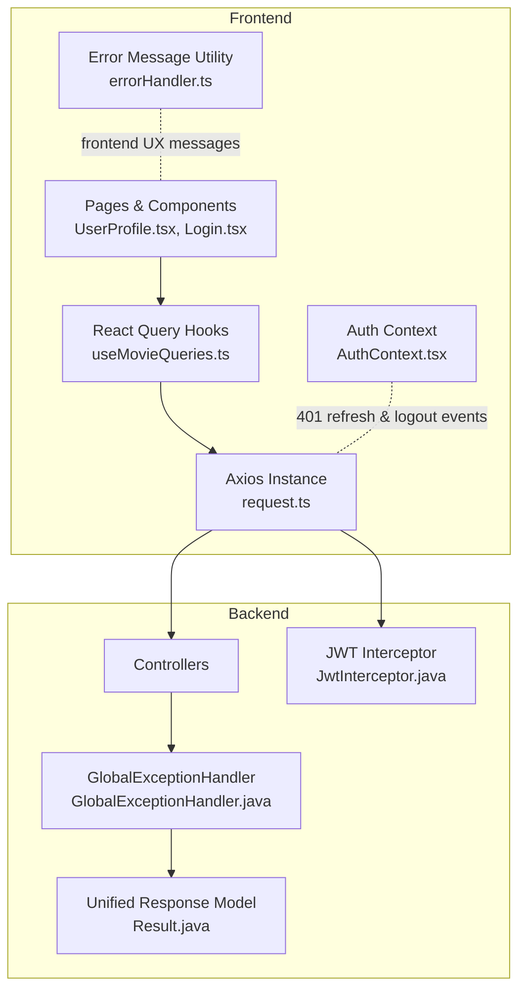
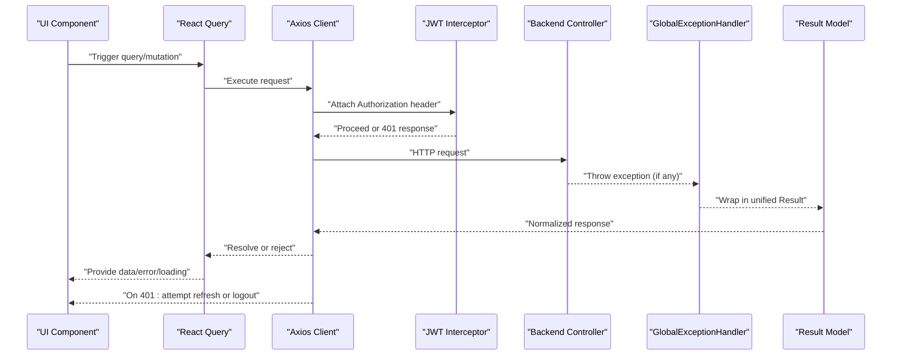
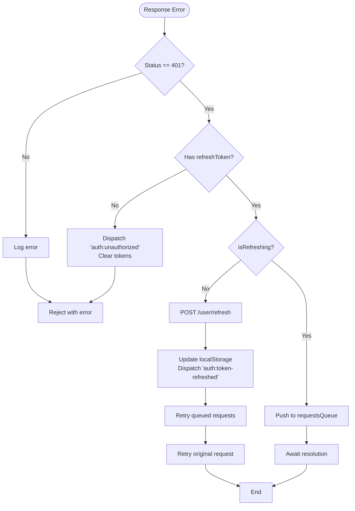
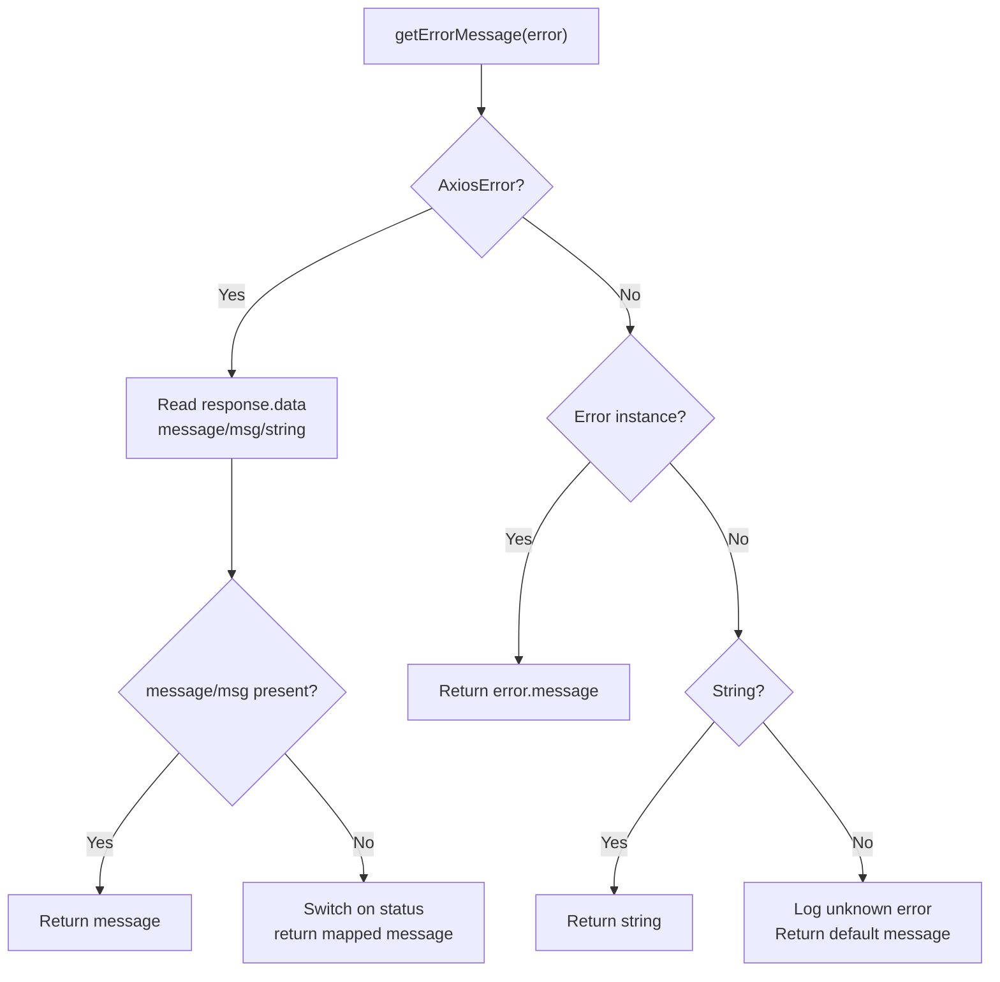
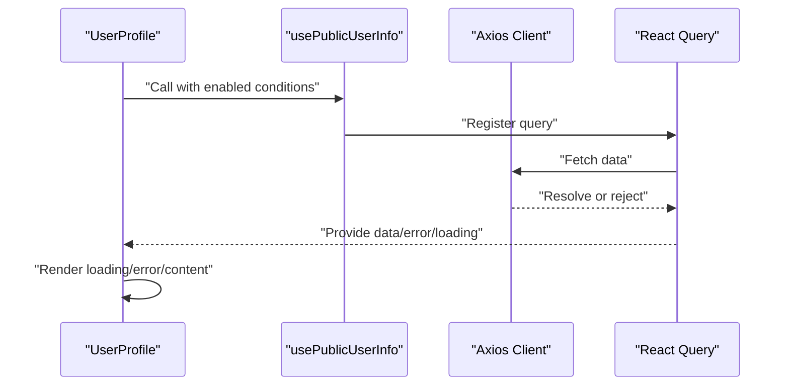
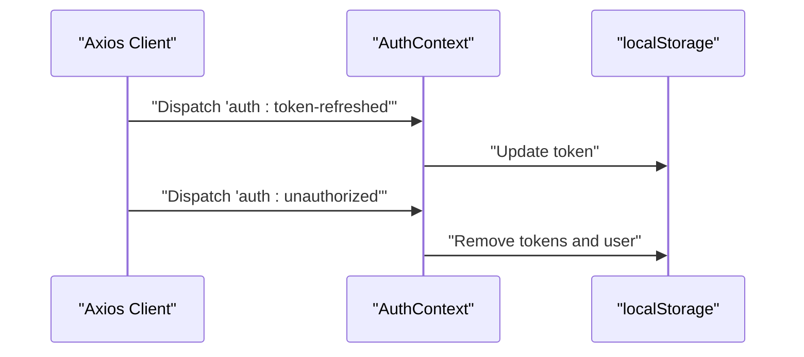
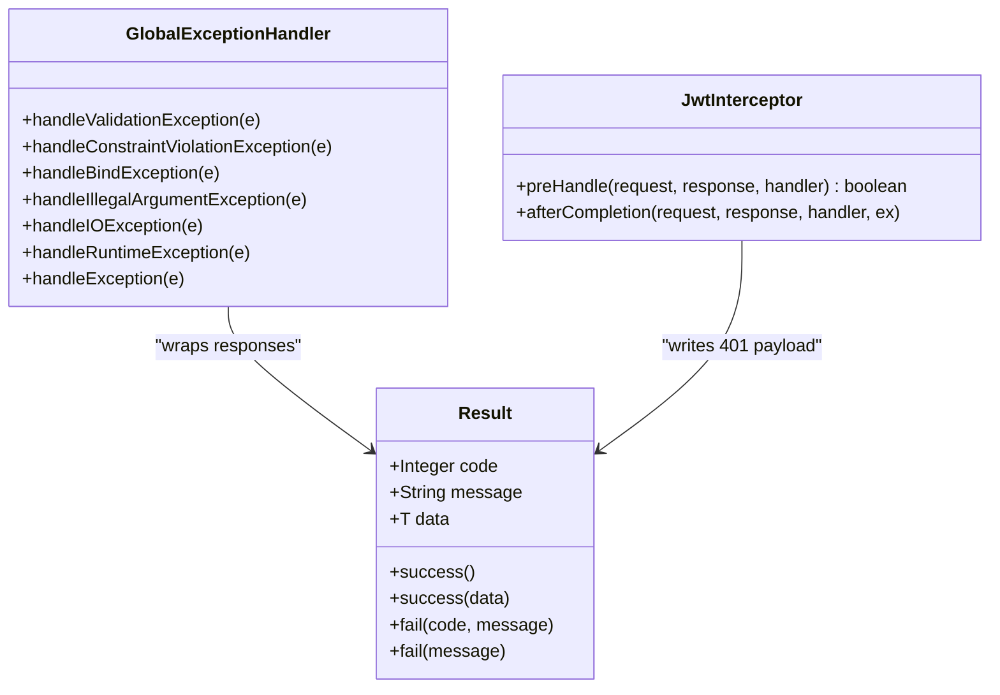
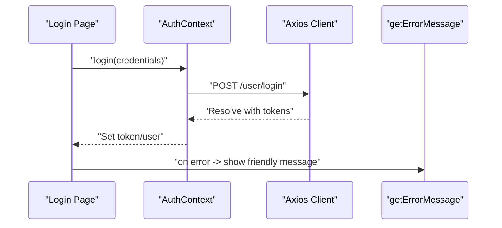
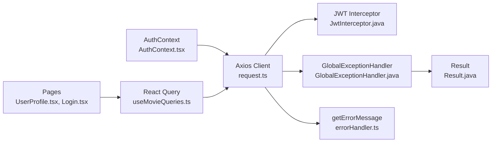

# Error Handling Strategies

<cite>
**Referenced Files in This Document**
- [errorHandler.ts](file://movie-review-web/src/utils/errorHandler.ts)
- [request.ts](file://movie-review-web/src/api/request.ts)
- [AuthContext.tsx](file://movie-review-web/src/context/AuthContext.tsx)
- [movie.ts](file://movie-review-web/src/api/movie.ts)
- [useMovieQueries.ts](file://movie-review-web/src/hooks/useMovieQueries.ts)
- [UserProfile.tsx](file://movie-review-web/src/pages/UserProfile.tsx)
- [Login.tsx](file://movie-review-web/src/pages/Login.tsx)
- [GlobalExceptionHandler.java](file://backend/src/main/java/com/movie/backend/exception/GlobalExceptionHandler.java)
- [JwtInterceptor.java](file://backend/src/main/java/com/movie/backend/config/JwtInterceptor.java)
- [Result.java](file://backend/src/main/java/com/movie/backend/common/Result.java)
</cite>

## Table of Contents
1. [Introduction](#introduction)
2. [Project Structure](#project-structure)
3. [Core Components](#core-components)
4. [Architecture Overview](#architecture-overview)
5. [Detailed Component Analysis](#detailed-component-analysis)
6. [Dependency Analysis](#dependency-analysis)
7. [Performance Considerations](#performance-considerations)
8. [Troubleshooting Guide](#troubleshooting-guide)
9. [Conclusion](#conclusion)

## Introduction
This document provides comprehensive error handling strategies across the API integration layer of the movie review web application. It covers centralized HTTP interceptors, authentication error handling (401), network failures, server-side errors, error propagation patterns, user-friendly messaging, retry and refresh mechanisms, integration with React Query error states and loading indicators, error boundaries, offline handling, timeouts, fallback UI patterns, debugging techniques, logging, and monitoring integration.

## Project Structure
The error handling spans three layers:
- Frontend HTTP client and interceptors
- Frontend React components and React Query integration
- Backend REST controllers and global exception handling

**Diagram sources**
- [request.ts](file://movie-review-web/src/api/request.ts#L1-L108)
- [errorHandler.ts](file://movie-review-web/src/utils/errorHandler.ts#L1-L60)
- [AuthContext.tsx](file://movie-review-web/src/context/AuthContext.tsx#L1-L123)
- [useMovieQueries.ts](file://movie-review-web/src/hooks/useMovieQueries.ts#L1-L95)
- [UserProfile.tsx](file://movie-review-web/src/pages/UserProfile.tsx#L1-L68)
- [Login.tsx](file://movie-review-web/src/pages/Login.tsx#L37-L91)
- [GlobalExceptionHandler.java](file://backend/src/main/java/com/movie/backend/exception/GlobalExceptionHandler.java#L1-L102)
- [JwtInterceptor.java](file://backend/src/main/java/com/movie/backend/config/JwtInterceptor.java#L1-L105)
- [Result.java](file://backend/src/main/java/com/movie/backend/common/Result.java#L1-L43)

**Section sources**
- [request.ts](file://movie-review-web/src/api/request.ts#L1-L108)
- [errorHandler.ts](file://movie-review-web/src/utils/errorHandler.ts#L1-L60)
- [AuthContext.tsx](file://movie-review-web/src/context/AuthContext.tsx#L1-L123)
- [useMovieQueries.ts](file://movie-review-web/src/hooks/useMovieQueries.ts#L1-L95)
- [UserProfile.tsx](file://movie-review-web/src/pages/UserProfile.tsx#L1-L68)
- [Login.tsx](file://movie-review-web/src/pages/Login.tsx#L37-L91)
- [GlobalExceptionHandler.java](file://backend/src/main/java/com/movie/backend/exception/GlobalExceptionHandler.java#L1-L102)
- [JwtInterceptor.java](file://backend/src/main/java/com/movie/backend/config/JwtInterceptor.java#L1-L105)
- [Result.java](file://backend/src/main/java/com/movie/backend/common/Result.java#L1-L43)

## Core Components
- Centralized HTTP client with interceptors for authentication, response normalization, and 401 refresh logic
- Unified error message extraction utility for user-friendly feedback
- React Query integration for error states, loading indicators, and cache invalidation
- Backend global exception handler and JWT interceptor for server-side error normalization and authentication gating
- Auth context listening to global 401 events to trigger logout and token refresh updates

Key responsibilities:
- Normalize backend responses and propagate meaningful errors to UI
- Provide user-friendly messages derived from backend payload or HTTP status
- Manage token refresh on 401 and queue pending requests during refresh
- Integrate with React Query for robust error and loading UX
- Surface server-side exceptions consistently using a unified response model

**Section sources**
- [request.ts](file://movie-review-web/src/api/request.ts#L1-L108)
- [errorHandler.ts](file://movie-review-web/src/utils/errorHandler.ts#L1-L60)
- [useMovieQueries.ts](file://movie-review-web/src/hooks/useMovieQueries.ts#L1-L95)
- [GlobalExceptionHandler.java](file://backend/src/main/java/com/movie/backend/exception/GlobalExceptionHandler.java#L1-L102)
- [JwtInterceptor.java](file://backend/src/main/java/com/movie/backend/config/JwtInterceptor.java#L1-L105)
- [Result.java](file://backend/src/main/java/com/movie/backend/common/Result.java#L1-L43)

## Architecture Overview
End-to-end error handling flow from UI to backend and back:

**Diagram sources**
- [request.ts](file://movie-review-web/src/api/request.ts#L1-L108)
- [JwtInterceptor.java](file://backend/src/main/java/com/movie/backend/config/JwtInterceptor.java#L1-L105)
- [GlobalExceptionHandler.java](file://backend/src/main/java/com/movie/backend/exception/GlobalExceptionHandler.java#L1-L102)
- [Result.java](file://backend/src/main/java/com/movie/backend/common/Result.java#L1-L43)

## Detailed Component Analysis

### Frontend HTTP Client and Interceptors
- Request interceptor attaches Authorization header from localStorage
- Response interceptor normalizes backend responses and rejects non-success codes
- Response interceptor handles 401:
  - Attempts silent token refresh using refreshToken
  - Queues concurrent requests while refreshing
  - Dispatches global events to update AuthContext and trigger logout on failure
  - Applies exponential backoff and timeout policies

**Diagram sources**
- [request.ts](file://movie-review-web/src/api/request.ts#L30-L106)

**Section sources**
- [request.ts](file://movie-review-web/src/api/request.ts#L1-L108)

### Error Message Extraction Utility
- Extracts user-friendly messages from Axios errors
- Prefers backend-provided message/msg fields
- Falls back to HTTP status-based messages
- Handles standard Error and string errors gracefully

**Diagram sources**
- [errorHandler.ts](file://movie-review-web/src/utils/errorHandler.ts#L17-L60)

**Section sources**
- [errorHandler.ts](file://movie-review-web/src/utils/errorHandler.ts#L1-L60)

### React Query Integration and Error States
- Queries expose isLoading, isError, and error fields
- Mutations support onSuccess/onError callbacks for cache invalidation and user feedback
- Pages conditionally render loading, error, or success UI based on query states
- Example: UserProfile uses query error to display a friendly message and navigation controls

**Diagram sources**
- [useMovieQueries.ts](file://movie-review-web/src/hooks/useMovieQueries.ts#L14-L25)
- [UserProfile.tsx](file://movie-review-web/src/pages/UserProfile.tsx#L14-L22)

**Section sources**
- [useMovieQueries.ts](file://movie-review-web/src/hooks/useMovieQueries.ts#L1-L95)
- [UserProfile.tsx](file://movie-review-web/src/pages/UserProfile.tsx#L1-L68)

### Authentication Context and Global Events
- Listens for 'auth:unauthorized' to clear tokens and reset state
- Listens for 'auth:token-refreshed' to update token in memory
- Coordinates with HTTP interceptors to maintain consistent auth state

**Diagram sources**
- [AuthContext.tsx](file://movie-review-web/src/context/AuthContext.tsx#L88-L110)
- [request.ts](file://movie-review-web/src/api/request.ts#L57-L78)

**Section sources**
- [AuthContext.tsx](file://movie-review-web/src/context/AuthContext.tsx#L1-L123)
- [request.ts](file://movie-review-web/src/api/request.ts#L1-L108)

### Backend: Global Exception Handling and JWT Interceptor
- GlobalExceptionHandler converts exceptions to unified Result with appropriate HTTP status
- JWT Interceptor validates tokens and sets Spring Security context; returns 401 with unified payload on failure
- Controllers return Result<T> consistently

**Diagram sources**
- [GlobalExceptionHandler.java](file://backend/src/main/java/com/movie/backend/exception/GlobalExceptionHandler.java#L1-L102)
- [JwtInterceptor.java](file://backend/src/main/java/com/movie/backend/config/JwtInterceptor.java#L1-L105)
- [Result.java](file://backend/src/main/java/com/movie/backend/common/Result.java#L1-L43)

**Section sources**
- [GlobalExceptionHandler.java](file://backend/src/main/java/com/movie/backend/exception/GlobalExceptionHandler.java#L1-L102)
- [JwtInterceptor.java](file://backend/src/main/java/com/movie/backend/config/JwtInterceptor.java#L1-L105)
- [Result.java](file://backend/src/main/java/com/movie/backend/common/Result.java#L1-L43)

### API Layer Integration Examples
- movieApi exposes typed endpoints returning Result-wrapped data
- Components consume these APIs and apply getErrorMessage for user-facing messages
- Login page demonstrates combining form validation, API calls, and error display

**Diagram sources**
- [movie.ts](file://movie-review-web/src/api/movie.ts#L15-L65)
- [Login.tsx](file://movie-review-web/src/pages/Login.tsx#L37-L91)
- [errorHandler.ts](file://movie-review-web/src/utils/errorHandler.ts#L17-L60)

**Section sources**
- [movie.ts](file://movie-review-web/src/api/movie.ts#L1-L65)
- [Login.tsx](file://movie-review-web/src/pages/Login.tsx#L37-L91)
- [errorHandler.ts](file://movie-review-web/src/utils/errorHandler.ts#L1-L60)

## Dependency Analysis
- Frontend depends on Axios interceptors for auth and normalization
- AuthContext coordinates with interceptors via global events
- React Query orchestrates error and loading states for UI
- Backend depends on GlobalExceptionHandler and Result for consistent error responses
- JWT Interceptor enforces auth at the HTTP boundary

**Diagram sources**
- [request.ts](file://movie-review-web/src/api/request.ts#L1-L108)
- [AuthContext.tsx](file://movie-review-web/src/context/AuthContext.tsx#L1-L123)
- [useMovieQueries.ts](file://movie-review-web/src/hooks/useMovieQueries.ts#L1-L95)
- [UserProfile.tsx](file://movie-review-web/src/pages/UserProfile.tsx#L1-L68)
- [Login.tsx](file://movie-review-web/src/pages/Login.tsx#L37-L91)
- [GlobalExceptionHandler.java](file://backend/src/main/java/com/movie/backend/exception/GlobalExceptionHandler.java#L1-L102)
- [JwtInterceptor.java](file://backend/src/main/java/com/movie/backend/config/JwtInterceptor.java#L1-L105)
- [Result.java](file://backend/src/main/java/com/movie/backend/common/Result.java#L1-L43)

**Section sources**
- [request.ts](file://movie-review-web/src/api/request.ts#L1-L108)
- [AuthContext.tsx](file://movie-review-web/src/context/AuthContext.tsx#L1-L123)
- [useMovieQueries.ts](file://movie-review-web/src/hooks/useMovieQueries.ts#L1-L95)
- [UserProfile.tsx](file://movie-review-web/src/pages/UserProfile.tsx#L1-L68)
- [Login.tsx](file://movie-review-web/src/pages/Login.tsx#L37-L91)
- [GlobalExceptionHandler.java](file://backend/src/main/java/com/movie/backend/exception/GlobalExceptionHandler.java#L1-L102)
- [JwtInterceptor.java](file://backend/src/main/java/com/movie/backend/config/JwtInterceptor.java#L1-L105)
- [Result.java](file://backend/src/main/java/com/movie/backend/common/Result.java#L1-L43)

## Performance Considerations
- Timeout configuration in Axios prevents hanging requests
- Request queuing during token refresh avoids redundant refresh attempts
- React Query caching reduces repeated network calls and improves perceived performance
- Prefer enabling queries only when inputs are valid to avoid unnecessary requests

[No sources needed since this section provides general guidance]

## Troubleshooting Guide
Common scenarios and remedies:
- 401 Unauthorized
  - Verify refreshToken availability and validity
  - Confirm AuthContext listens for 'auth:unauthorized' and clears tokens
  - Ensure the interceptor dispatches 'auth:token-refreshed' on success
- Network failures
  - Inspect timeout and retry behavior; adjust baseURL and timeout as needed
  - Check console logs for Axios errors
- Server errors
  - Review GlobalExceptionHandler mappings and ensure controllers return Result
  - Confirm unified Result structure is respected by the frontend
- User-facing messages
  - Use getErrorMessage to derive friendly messages from backend or status codes
- Debugging and logging
  - Enable browser network logs and backend logs
  - Add structured logging around interceptors and exception handlers
- Monitoring integration
  - Report 401, 5xx, and timeout events to analytics
  - Track token refresh success/failure rates

**Section sources**
- [request.ts](file://movie-review-web/src/api/request.ts#L30-L106)
- [AuthContext.tsx](file://movie-review-web/src/context/AuthContext.tsx#L88-L110)
- [GlobalExceptionHandler.java](file://backend/src/main/java/com/movie/backend/exception/GlobalExceptionHandler.java#L62-L99)
- [errorHandler.ts](file://movie-review-web/src/utils/errorHandler.ts#L17-L60)

## Conclusion
The application implements a robust, layered error handling strategy:
- Frontend: centralized Axios interceptors manage auth, normalization, and 401 refresh; React Query provides consistent error and loading states; user-friendly messages improve UX.
- Backend: unified Result model and GlobalExceptionHandler ensure consistent error responses; JWT Interceptor secures endpoints and returns normalized 401 payloads.
This design enables predictable error propagation, graceful degradation, and maintainable debugging and monitoring.