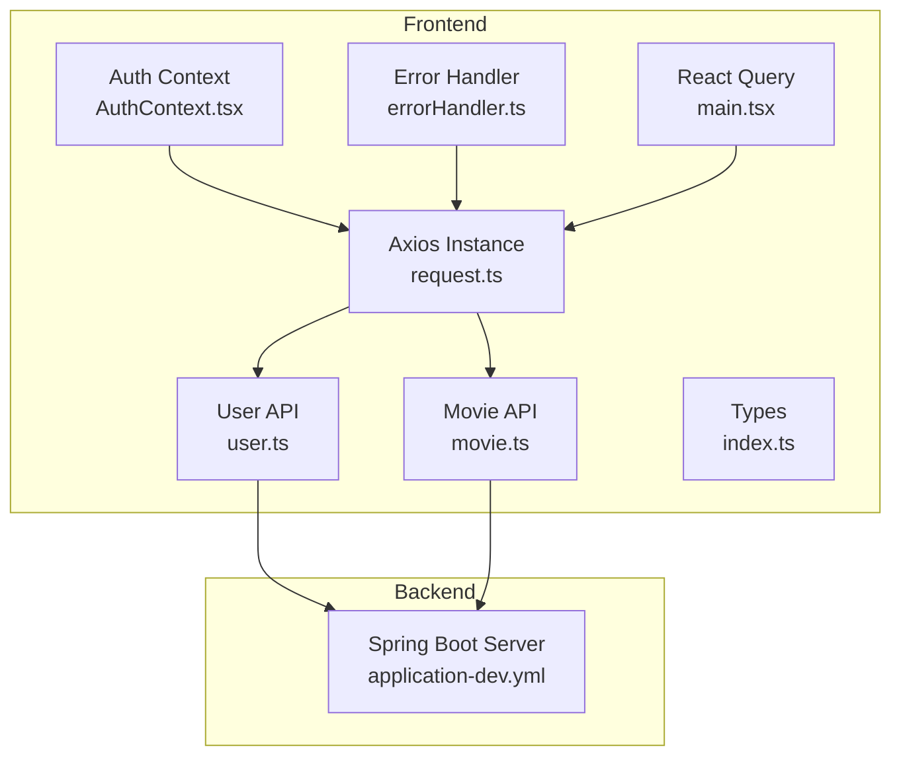
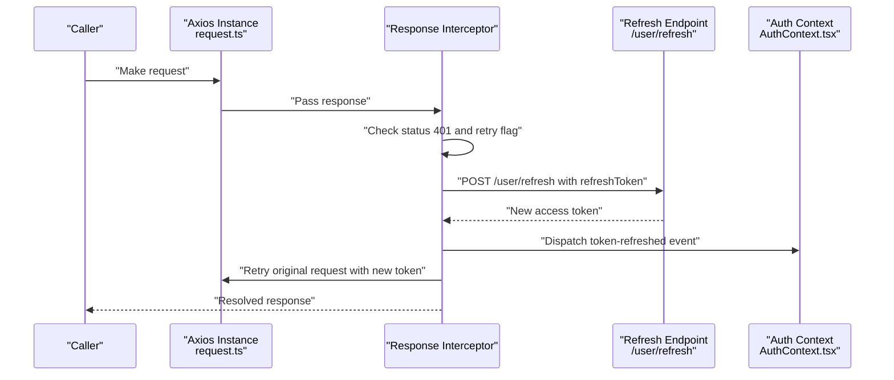
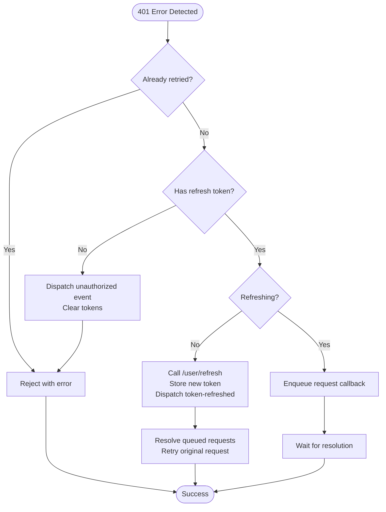
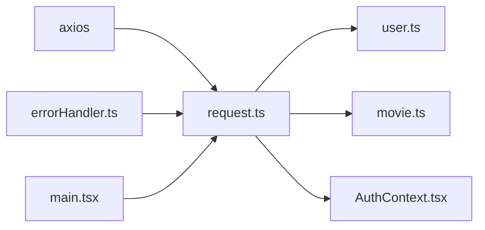

# HTTP Client Configuration

<cite>
**Referenced Files in This Document**
- [request.ts](file://movie-review-web/src/api/request.ts)
- [movie.ts](file://movie-review-web/src/api/movie.ts)
- [user.ts](file://movie-review-web/src/api/user.ts)
- [AuthContext.tsx](file://movie-review-web/src/context/AuthContext.tsx)
- [index.ts](file://movie-review-web/src/types/index.ts)
- [errorHandler.ts](file://movie-review-web/src/utils/errorHandler.ts)
- [main.tsx](file://movie-review-web/src/main.tsx)
- [package.json](file://movie-review-web/package.json)
- [application-dev.yml](file://backend/src/main/resources/application-dev.yml)
</cite>

## Table of Contents
1. [Introduction](#introduction)
2. [Project Structure](#project-structure)
3. [Core Components](#core-components)
4. [Architecture Overview](#architecture-overview)
5. [Detailed Component Analysis](#detailed-component-analysis)
6. [Dependency Analysis](#dependency-analysis)
7. [Performance Considerations](#performance-considerations)
8. [Troubleshooting Guide](#troubleshooting-guide)
9. [Conclusion](#conclusion)

## Introduction
This document explains the HTTP client configuration and Axios setup used by the frontend application. It covers base URL configuration, timeout settings, and interceptor implementations. It details the request interceptor for automatic token injection and the response interceptor for standardized response handling. It also documents the token refresh mechanism, including retry logic, queue management for concurrent requests, and error handling strategies. Finally, it provides usage patterns, configuration options, best practices, security considerations, CORS handling, and performance optimization techniques.

## Project Structure
The HTTP client is implemented in a dedicated module and consumed by API modules. Authentication state is managed via a React context that coordinates token refresh events. Supporting utilities provide standardized error extraction.

**Diagram sources**
- [request.ts](file://movie-review-web/src/api/request.ts#L1-L108)
- [user.ts](file://movie-review-web/src/api/user.ts#L1-L36)
- [movie.ts](file://movie-review-web/src/api/movie.ts#L1-L65)
- [AuthContext.tsx](file://movie-review-web/src/context/AuthContext.tsx#L1-L123)
- [errorHandler.ts](file://movie-review-web/src/utils/errorHandler.ts#L1-L60)
- [main.tsx](file://movie-review-web/src/main.tsx#L1-L41)
- [application-dev.yml](file://backend/src/main/resources/application-dev.yml#L1-L67)

**Section sources**
- [request.ts](file://movie-review-web/src/api/request.ts#L1-L108)
- [user.ts](file://movie-review-web/src/api/user.ts#L1-L36)
- [movie.ts](file://movie-review-web/src/api/movie.ts#L1-L65)
- [AuthContext.tsx](file://movie-review-web/src/context/AuthContext.tsx#L1-L123)
- [errorHandler.ts](file://movie-review-web/src/utils/errorHandler.ts#L1-L60)
- [main.tsx](file://movie-review-web/src/main.tsx#L1-L41)
- [application-dev.yml](file://backend/src/main/resources/application-dev.yml#L1-L67)

## Core Components
- Axios instance with base URL and timeout
- Request interceptor for Authorization header injection
- Response interceptor for standardized response handling and token refresh
- Token refresh mechanism with concurrency control and queue management
- API modules that consume the configured Axios instance
- Authentication context coordinating token lifecycle and global events
- Error handling utility for consistent error messaging

**Section sources**
- [request.ts](file://movie-review-web/src/api/request.ts#L8-L11)
- [request.ts](file://movie-review-web/src/api/request.ts#L13-L19)
- [request.ts](file://movie-review-web/src/api/request.ts#L21-L106)
- [user.ts](file://movie-review-web/src/api/user.ts#L27-L32)
- [AuthContext.tsx](file://movie-review-web/src/context/AuthContext.tsx#L88-L110)
- [errorHandler.ts](file://movie-review-web/src/utils/errorHandler.ts#L17-L60)

## Architecture Overview
The HTTP client is a singleton Axios instance configured with interceptors. API modules call this instance, which injects tokens and normalizes responses. On 401 errors, the client attempts silent refresh using a dedicated endpoint, updates local storage, dispatches global events, retries queued requests, and reissues the original request. Authentication context listens for these events to synchronize UI state.

**Diagram sources**
- [request.ts](file://movie-review-web/src/api/request.ts#L30-L106)
- [AuthContext.tsx](file://movie-review-web/src/context/AuthContext.tsx#L95-L110)

## Detailed Component Analysis

### Axios Instance and Base Configuration
- Base URL: Configured to the backend server address.
- Timeout: Set to a fixed duration suitable for the current network conditions.
- Exported as a singleton for reuse across API modules.

Best practices:
- Centralize baseURL and timeout in a single place for maintainability.
- Consider environment-specific overrides for baseURL and timeout.

**Section sources**
- [request.ts](file://movie-review-web/src/api/request.ts#L8-L11)

### Request Interceptor: Automatic Token Injection
- Reads the access token from local storage.
- Adds an Authorization header with Bearer token to outgoing requests.
- Returns the modified config to continue the request lifecycle.

Security considerations:
- Store tokens securely; avoid exposing sensitive tokens in logs.
- Prefer secure, same-site cookies for production environments when backend supports it.

**Section sources**
- [request.ts](file://movie-review-web/src/api/request.ts#L13-L19)

### Response Interceptor: Standardized Response Handling and Token Refresh
Responsibilities:
- Normalize responses by extracting the data payload when the code indicates success.
- Log and reject non-success responses with a standardized error.
- Handle 401 Unauthorized:
  - Prevent infinite retry loops using a retry flag.
  - Attempt silent refresh using a dedicated endpoint with refresh token.
  - Coordinate refresh state with a concurrency guard to prevent multiple refresh attempts.
  - Queue concurrent requests during refresh and replay them after success.
  - On successful refresh, update local storage, dispatch a global event, and retry the original request.
  - On refresh failure, dispatch a global unauthorized event, clear tokens, and reject the promise.
  - For non-401 errors, log and propagate the error.

Concurrency and queue management:
- A shared flag prevents multiple simultaneous refresh attempts.
- Pending requests are enqueued and resolved with the new token upon success.

**Section sources**
- [request.ts](file://movie-review-web/src/api/request.ts#L21-L106)

### Token Refresh Mechanism
- Silent refresh endpoint: Invoked with the refresh token to obtain a new access token.
- Local storage update: New access token is persisted.
- Global event dispatch: A custom event notifies the application of the refreshed token.
- Auth context listeners:
  - Listen for token-refreshed to update in-memory state.
  - Listen for unauthorized to trigger logout and clear tokens.

**Diagram sources**
- [request.ts](file://movie-review-web/src/api/request.ts#L30-L106)
- [AuthContext.tsx](file://movie-review-web/src/context/AuthContext.tsx#L95-L110)

**Section sources**
- [request.ts](file://movie-review-web/src/api/request.ts#L30-L106)
- [AuthContext.tsx](file://movie-review-web/src/context/AuthContext.tsx#L95-L110)

### API Modules Usage Patterns
- Movie API module demonstrates typed endpoints returning normalized data.
- User API module shows login, registration, info retrieval, and explicit refresh endpoint usage.
- Both rely on the shared Axios instance for consistent behavior.

Usage examples (paths):
- Get hot movies: [movieApi.getHot](file://movie-review-web/src/api/movie.ts#L19-L20)
- Submit rating: [movieApi.submitRating](file://movie-review-web/src/api/movie.ts#L39-L40)
- Login: [userApi.login](file://movie-review-web/src/api/user.ts#L6-L9)
- Refresh token: [userApi.refreshToken](file://movie-review-web/src/api/user.ts#L28-L32)

**Section sources**
- [movie.ts](file://movie-review-web/src/api/movie.ts#L15-L65)
- [user.ts](file://movie-review-web/src/api/user.ts#L4-L36)

### Types and Response Normalization
- ApiResponse defines a consistent shape for server responses.
- Response interceptor extracts data when the code indicates success, simplifying consumer code.

**Section sources**
- [index.ts](file://movie-review-web/src/types/index.ts#L2-L6)
- [request.ts](file://movie-review-web/src/api/request.ts#L22-L28)

### Error Handling Utility
- Extracts user-friendly messages from Axios errors, falling back to generic messages based on status codes.
- Supports both HTTP errors and business logic errors.

**Section sources**
- [errorHandler.ts](file://movie-review-web/src/utils/errorHandler.ts#L17-L60)

## Dependency Analysis
- Axios is a direct dependency of the HTTP client module.
- API modules depend on the Axios instance.
- Auth context depends on the Axios instance indirectly via global events.
- React Query is configured globally and integrates with the HTTP client.

**Diagram sources**
- [package.json](file://movie-review-web/package.json#L12-L23)
- [request.ts](file://movie-review-web/src/api/request.ts#L1-L1)
- [user.ts](file://movie-review-web/src/api/user.ts#L1-L1)
- [movie.ts](file://movie-review-web/src/api/movie.ts#L1-L1)
- [AuthContext.tsx](file://movie-review-web/src/context/AuthContext.tsx#L1-L1)
- [errorHandler.ts](file://movie-review-web/src/utils/errorHandler.ts#L1-L1)
- [main.tsx](file://movie-review-web/src/main.tsx#L1-L1)

**Section sources**
- [package.json](file://movie-review-web/package.json#L12-L23)
- [request.ts](file://movie-review-web/src/api/request.ts#L1-L1)
- [user.ts](file://movie-review-web/src/api/user.ts#L1-L1)
- [movie.ts](file://movie-review-web/src/api/movie.ts#L1-L1)
- [AuthContext.tsx](file://movie-review-web/src/context/AuthContext.tsx#L1-L1)
- [errorHandler.ts](file://movie-review-web/src/utils/errorHandler.ts#L1-L1)
- [main.tsx](file://movie-review-web/src/main.tsx#L1-L1)

## Performance Considerations
- Timeout tuning: Adjust the Axios timeout to match backend SLAs and network conditions.
- Retry strategy: Configure React Query retry policies to balance resilience and resource usage.
- Caching: Use React Query’s caching and staleTime to minimize redundant requests.
- Concurrency control: The built-in refresh guard prevents excessive refresh calls.

[No sources needed since this section provides general guidance]

## Troubleshooting Guide
Common issues and resolutions:
- 401 Unauthorized:
  - Verify tokens in local storage and ensure Authorization header is present.
  - Confirm the refresh endpoint is reachable and returns a new access token.
  - Check that global events are dispatched and handled by the Auth context.
- Infinite retry loop:
  - Ensure the retry flag is set on the original request after refresh.
- Queued requests not resolving:
  - Confirm callbacks in the queue are invoked with the new token and the original request is retried.
- Error messages:
  - Use the unified error handler to extract meaningful messages from Axios errors.

**Section sources**
- [request.ts](file://movie-review-web/src/api/request.ts#L30-L106)
- [AuthContext.tsx](file://movie-review-web/src/context/AuthContext.tsx#L95-L110)
- [errorHandler.ts](file://movie-review-web/src/utils/errorHandler.ts#L17-L60)

## Conclusion
The HTTP client configuration centralizes base URL, timeout, token injection, and response normalization. The response interceptor implements robust token refresh with concurrency control and queue management, ensuring resilient and seamless user experiences. Combined with typed APIs, an Auth context, and a unified error handler, the system provides a solid foundation for secure, maintainable HTTP communication.