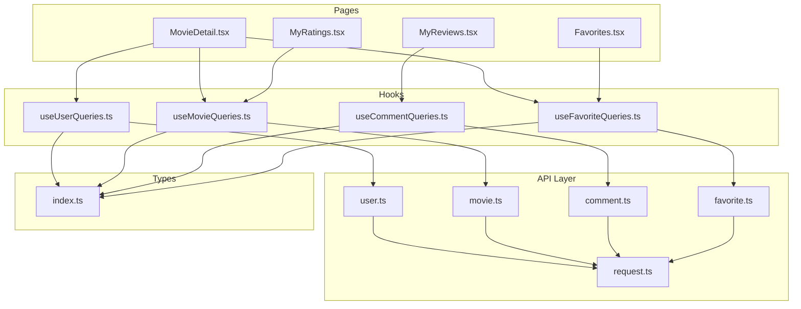
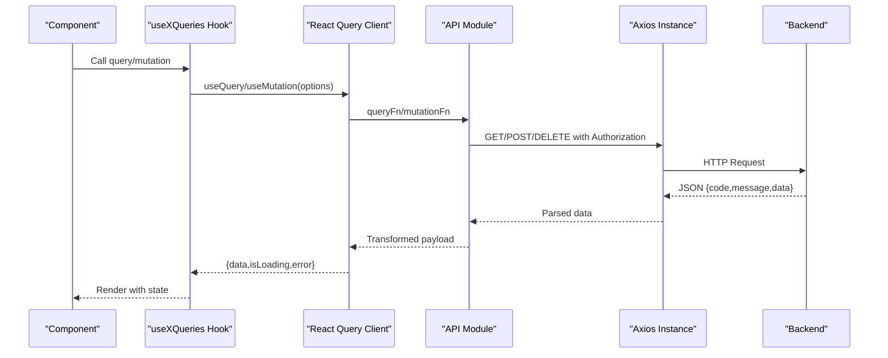
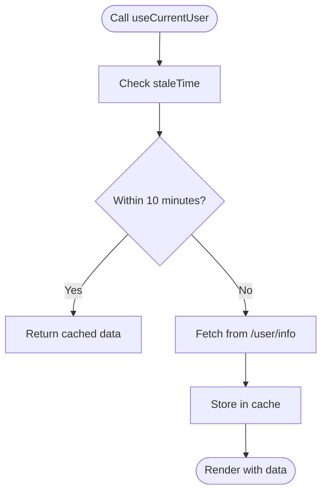
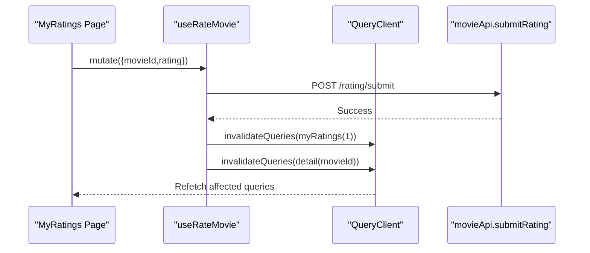
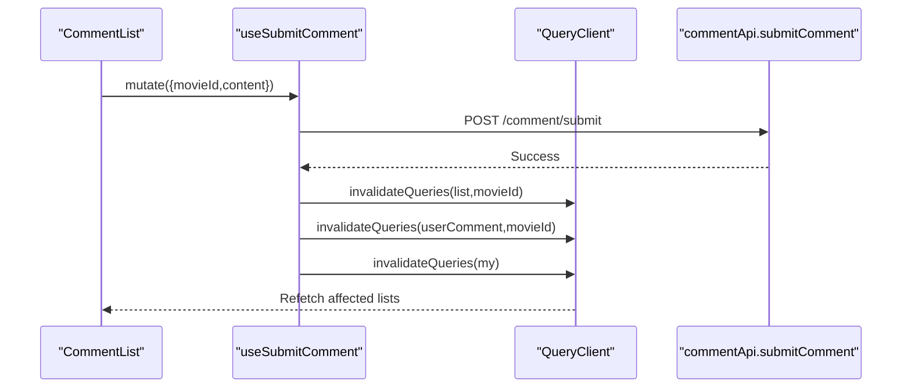
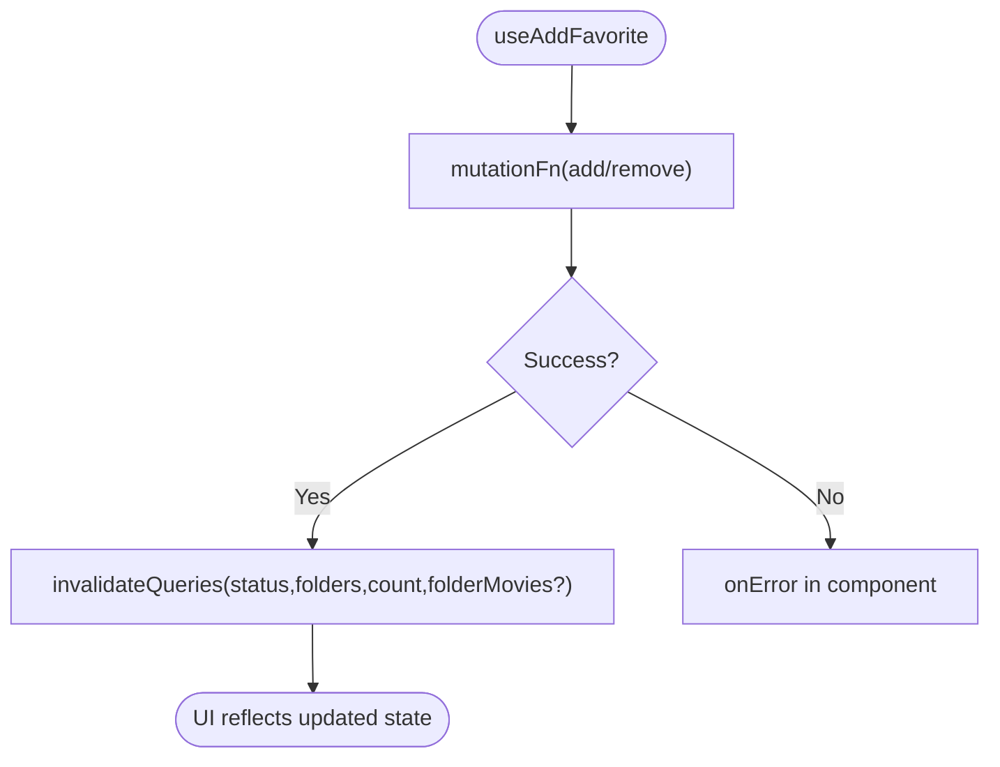
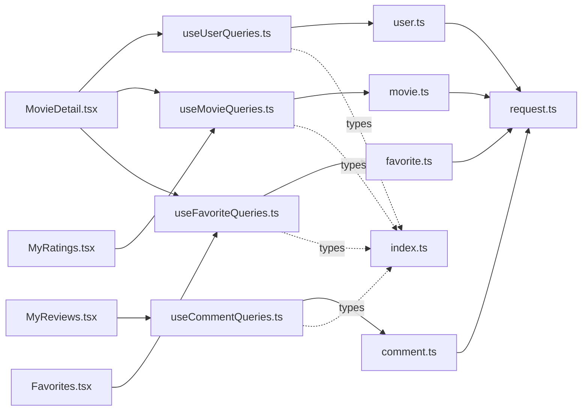

# React Query Data Fetching Hooks

<cite>
**Referenced Files in This Document**
- [useUserQueries.ts](file://movie-review-web/src/hooks/useUserQueries.ts)
- [useMovieQueries.ts](file://movie-review-web/src/hooks/useMovieQueries.ts)
- [useCommentQueries.ts](file://movie-review-web/src/hooks/useCommentQueries.ts)
- [useFavoriteQueries.ts](file://movie-review-web/src/hooks/useFavoriteQueries.ts)
- [user.ts](file://movie-review-web/src/api/user.ts)
- [movie.ts](file://movie-review-web/src/api/movie.ts)
- [comment.ts](file://movie-review-web/src/api/comment.ts)
- [favorite.ts](file://movie-review-web/src/api/favorite.ts)
- [request.ts](file://movie-review-web/src/api/request.ts)
- [index.ts](file://movie-review-web/src/types/index.ts)
- [MovieDetail.tsx](file://movie-review-web/src/pages/MovieDetail.tsx)
- [MyRatings.tsx](file://movie-review-web/src/pages/MyRatings.tsx)
- [MyReviews.tsx](file://movie-review-web/src/pages/MyReviews.tsx)
- [Favorites.tsx](file://movie-review-web/src/pages/Favorites.tsx)
</cite>

## Table of Contents
1. [Introduction](#introduction)
2. [Project Structure](#project-structure)
3. [Core Components](#core-components)
4. [Architecture Overview](#architecture-overview)
5. [Detailed Component Analysis](#detailed-component-analysis)
6. [Dependency Analysis](#dependency-analysis)
7. [Performance Considerations](#performance-considerations)
8. [Troubleshooting Guide](#troubleshooting-guide)
9. [Conclusion](#conclusion)
10. [Appendices](#appendices)

## Introduction
This document explains the React Query custom hooks used for data fetching and state management across the movie review web application. It covers query hooks for users, movies, comments, and favorites, detailing query configurations, caching strategies, data transformation patterns, mutation hooks for CRUD operations, optimistic updates, error handling, usage examples in components, parameter passing, result handling, query invalidation and refetching strategies, performance optimization techniques, and pagination/filtering patterns.

## Project Structure
The hooks are organized under a dedicated hooks directory and integrate with API modules and shared types. Components consume these hooks to manage UI state and interactions.

**Diagram sources**
- [useUserQueries.ts](file://movie-review-web/src/hooks/useUserQueries.ts#L1-L36)
- [useMovieQueries.ts](file://movie-review-web/src/hooks/useMovieQueries.ts#L1-L95)
- [useCommentQueries.ts](file://movie-review-web/src/hooks/useCommentQueries.ts#L1-L102)
- [useFavoriteQueries.ts](file://movie-review-web/src/hooks/useFavoriteQueries.ts#L1-L174)
- [user.ts](file://movie-review-web/src/api/user.ts#L1-L36)
- [movie.ts](file://movie-review-web/src/api/movie.ts#L1-L65)
- [comment.ts](file://movie-review-web/src/api/comment.ts#L1-L49)
- [favorite.ts](file://movie-review-web/src/api/favorite.ts#L1-L97)
- [request.ts](file://movie-review-web/src/api/request.ts#L1-L108)
- [index.ts](file://movie-review-web/src/types/index.ts#L1-L204)
- [MovieDetail.tsx](file://movie-review-web/src/pages/MovieDetail.tsx#L1-L343)
- [MyRatings.tsx](file://movie-review-web/src/pages/MyRatings.tsx#L1-L270)
- [MyReviews.tsx](file://movie-review-web/src/pages/MyReviews.tsx#L1-L141)
- [Favorites.tsx](file://movie-review-web/src/pages/Favorites.tsx#L1-L803)

**Section sources**
- [useUserQueries.ts](file://movie-review-web/src/hooks/useUserQueries.ts#L1-L36)
- [useMovieQueries.ts](file://movie-review-web/src/hooks/useMovieQueries.ts#L1-L95)
- [useCommentQueries.ts](file://movie-review-web/src/hooks/useCommentQueries.ts#L1-L102)
- [useFavoriteQueries.ts](file://movie-review-web/src/hooks/useFavoriteQueries.ts#L1-L174)
- [user.ts](file://movie-review-web/src/api/user.ts#L1-L36)
- [movie.ts](file://movie-review-web/src/api/movie.ts#L1-L65)
- [comment.ts](file://movie-review-web/src/api/comment.ts#L1-L49)
- [favorite.ts](file://movie-review-web/src/api/favorite.ts#L1-L97)
- [request.ts](file://movie-review-web/src/api/request.ts#L1-L108)
- [index.ts](file://movie-review-web/src/types/index.ts#L1-L204)
- [MovieDetail.tsx](file://movie-review-web/src/pages/MovieDetail.tsx#L1-L343)
- [MyRatings.tsx](file://movie-review-web/src/pages/MyRatings.tsx#L1-L270)
- [MyReviews.tsx](file://movie-review-web/src/pages/MyReviews.tsx#L1-L141)
- [Favorites.tsx](file://movie-review-web/src/pages/Favorites.tsx#L1-L803)

## Core Components
- useUserQueries: Provides queries for current user info and public user info, with caching and conditional enabling.
- useMovieQueries: Provides movie detail, search, latest, and personal ratings queries; includes mutations for rating submission and clearing.
- useCommentQueries: Provides comment list, user’s comment per movie, and personal comment history; includes mutations for submit/update comment and toggling likes.
- useFavoriteQueries: Provides favorites list, counts, status, folders, and folder movies; includes mutations for add/remove favorites, batch operations, and folder management.

Each hook exports a query keys namespace to standardize cache keys and enable precise invalidation.

**Section sources**
- [useUserQueries.ts](file://movie-review-web/src/hooks/useUserQueries.ts#L5-L10)
- [useMovieQueries.ts](file://movie-review-web/src/hooks/useMovieQueries.ts#L5-L12)
- [useCommentQueries.ts](file://movie-review-web/src/hooks/useCommentQueries.ts#L4-L11)
- [useFavoriteQueries.ts](file://movie-review-web/src/hooks/useFavoriteQueries.ts#L5-L16)

## Architecture Overview
React Query integrates with a typed API layer that encapsulates HTTP requests and response parsing. Interceptors handle authentication and automatic token refresh, while hooks centralize caching and invalidation strategies.

**Diagram sources**
- [request.ts](file://movie-review-web/src/api/request.ts#L13-L106)
- [user.ts](file://movie-review-web/src/api/user.ts#L18-L25)
- [movie.ts](file://movie-review-web/src/api/movie.ts#L39-L64)
- [comment.ts](file://movie-review-web/src/api/comment.ts#L17-L32)
- [favorite.ts](file://movie-review-web/src/api/favorite.ts#L6-L24)

## Detailed Component Analysis

### useUserQueries
- Query keys:
  - all: base key for users
  - current: derived key for logged-in user info
  - public(userId): derived key for viewing another user’s public profile
- Queries:
  - useCurrentUser: fetches current user info with a freshness window to avoid frequent re-fetches.
  - usePublicUserInfo: fetches public user info with conditional enabling based on userId.
- Usage patterns:
  - Conditional enabling prevents unnecessary network calls when userId is missing.
  - Stale time improves perceived performance for frequently accessed user data.

**Diagram sources**
- [useUserQueries.ts](file://movie-review-web/src/hooks/useUserQueries.ts#L13-L22)

**Section sources**
- [useUserQueries.ts](file://movie-review-web/src/hooks/useUserQueries.ts#L5-L36)
- [user.ts](file://movie-review-web/src/api/user.ts#L17-L25)

### useMovieQueries
- Query keys:
  - all, detail(id), myRatings(page), search(params), latest(page,size)
- Queries:
  - useMovie: fetches movie detail with enabled guard.
  - useMyRatings: paginated personal ratings.
  - useMovieSearch: search with enabled guard for non-empty keywords.
  - useLatestMovies: paginated latest movies.
- Mutations:
  - useRateMovie: submits rating; invalidates my ratings and movie detail caches.
  - useDeleteRatingsBatch: batch delete ratings; invalidates all my ratings pages.
  - useClearMyRatings: clears all ratings; invalidates all my ratings pages.
- Error handling:
  - Components receive error via hook and display user-friendly messages.
- Pagination:
  - Uses page and size parameters; components drive navigation.

**Diagram sources**
- [useMovieQueries.ts](file://movie-review-web/src/hooks/useMovieQueries.ts#L54-L68)
- [movie.ts](file://movie-review-web/src/api/movie.ts#L39-L40)

**Section sources**
- [useMovieQueries.ts](file://movie-review-web/src/hooks/useMovieQueries.ts#L5-L95)
- [movie.ts](file://movie-review-web/src/api/movie.ts#L15-L65)
- [MyRatings.tsx](file://movie-review-web/src/pages/MyRatings.tsx#L1-L270)

### useCommentQueries
- Query keys:
  - all, lists(), list(movieId,page,size), myComments(page,size), userComment(movieId)
- Queries:
  - useMovieComments: paginated comments per movie with enabled guard.
  - useMyComments: paginated personal comment history.
  - useUserComment: fetches user’s comment for a specific movie.
- Mutations:
  - useSubmitComment: invalidates comment list, user comment, and my comments caches.
  - useUpdateComment: similar invalidation as submit.
  - useToggleLike: invalidates all comment lists because likes affect list data.
- Authentication-aware list endpoint:
  - Selects authenticated or public list endpoint based on token presence.

**Diagram sources**
- [useCommentQueries.ts](file://movie-review-web/src/hooks/useCommentQueries.ts#L43-L65)
- [comment.ts](file://movie-review-web/src/api/comment.ts#L17-L18)

**Section sources**
- [useCommentQueries.ts](file://movie-review-web/src/hooks/useCommentQueries.ts#L4-L102)
- [comment.ts](file://movie-review-web/src/api/comment.ts#L4-L49)
- [MyReviews.tsx](file://movie-review-web/src/pages/MyReviews.tsx#L1-L141)

### useFavoriteQueries
- Query keys:
  - all, lists(), list(page,size), count(), status(movieId), folders(), folder(folderId), folderMovies(folderId,page,size)
- Queries:
  - useMyFavorites: paginated favorites list.
  - useFavoritesCount: total count.
  - useFavoriteStatus: checks if a movie is favorited.
  - useMyFolders: lists user’s folders.
  - useFolderDetail and useFolderMovies: folder-centric queries with enabled guards.
- Mutations:
  - useAddFavorite: invalidates status, lists, count, and optionally folder movies.
  - useRemoveFavorite: similar invalidation to add.
  - useBatchDeleteFavorites: invalidates all favorites-related caches.
  - useCreateFolder, useUpdateFolder, useDeleteFolder: manage folders with targeted invalidations.

**Diagram sources**
- [useFavoriteQueries.ts](file://movie-review-web/src/hooks/useFavoriteQueries.ts#L79-L101)
- [favorite.ts](file://movie-review-web/src/api/favorite.ts#L6-L10)

**Section sources**
- [useFavoriteQueries.ts](file://movie-review-web/src/hooks/useFavoriteQueries.ts#L5-L174)
- [favorite.ts](file://movie-review-web/src/api/favorite.ts#L4-L97)
- [Favorites.tsx](file://movie-review-web/src/pages/Favorites.tsx#L1-L803)

## Dependency Analysis
- Hooks depend on API modules for network calls and on shared types for typing.
- API module depends on a centralized Axios instance with interceptors for auth and response parsing.
- Components depend on hooks for data and mutation callbacks.

**Diagram sources**
- [MovieDetail.tsx](file://movie-review-web/src/pages/MovieDetail.tsx#L8-L21)
- [MyRatings.tsx](file://movie-review-web/src/pages/MyRatings.tsx#L6-L14)
- [MyReviews.tsx](file://movie-review-web/src/pages/MyReviews.tsx#L5-L11)
- [Favorites.tsx](file://movie-review-web/src/pages/Favorites.tsx#L1-L8)
- [useUserQueries.ts](file://movie-review-web/src/hooks/useUserQueries.ts#L1-L3)
- [useMovieQueries.ts](file://movie-review-web/src/hooks/useMovieQueries.ts#L1-L3)
- [useCommentQueries.ts](file://movie-review-web/src/hooks/useCommentQueries.ts#L1-L2)
- [useFavoriteQueries.ts](file://movie-review-web/src/hooks/useFavoriteQueries.ts#L1-L3)
- [user.ts](file://movie-review-web/src/api/user.ts#L1-L2)
- [movie.ts](file://movie-review-web/src/api/movie.ts#L1-L3)
- [comment.ts](file://movie-review-web/src/api/comment.ts#L1-L2)
- [favorite.ts](file://movie-review-web/src/api/favorite.ts#L1-L2)
- [request.ts](file://movie-review-web/src/api/request.ts#L1-L11)
- [index.ts](file://movie-review-web/src/types/index.ts#L1-L6)

**Section sources**
- [MovieDetail.tsx](file://movie-review-web/src/pages/MovieDetail.tsx#L1-L343)
- [MyRatings.tsx](file://movie-review-web/src/pages/MyRatings.tsx#L1-L270)
- [MyReviews.tsx](file://movie-review-web/src/pages/MyReviews.tsx#L1-L141)
- [Favorites.tsx](file://movie-review-web/src/pages/Favorites.tsx#L1-L803)
- [useUserQueries.ts](file://movie-review-web/src/hooks/useUserQueries.ts#L1-L36)
- [useMovieQueries.ts](file://movie-review-web/src/hooks/useMovieQueries.ts#L1-L95)
- [useCommentQueries.ts](file://movie-review-web/src/hooks/useCommentQueries.ts#L1-L102)
- [useFavoriteQueries.ts](file://movie-review-web/src/hooks/useFavoriteQueries.ts#L1-L174)
- [user.ts](file://movie-review-web/src/api/user.ts#L1-L36)
- [movie.ts](file://movie-review-web/src/api/movie.ts#L1-L65)
- [comment.ts](file://movie-review-web/src/api/comment.ts#L1-L49)
- [favorite.ts](file://movie-review-web/src/api/favorite.ts#L1-L97)
- [request.ts](file://movie-review-web/src/api/request.ts#L1-L108)
- [index.ts](file://movie-review-web/src/types/index.ts#L1-L204)

## Performance Considerations
- Caching strategies:
  - Stale time reduces redundant network calls for current user data.
  - Precise query keys enable targeted invalidation, minimizing unnecessary refetches.
- Conditional enabling:
  - Prevents queries when parameters are invalid (e.g., non-positive movieId).
- Pagination:
  - Controlled by page and size parameters; components manage navigation.
- Token refresh:
  - Silent refresh avoids repeated manual logins and maintains session continuity.

[No sources needed since this section provides general guidance]

## Troubleshooting Guide
- Unauthorized errors:
  - Interceptor attempts silent token refresh; if refresh fails, logs out globally and clears tokens.
- Error propagation:
  - Components receive error from hooks and display user-friendly messages.
- Common pitfalls:
  - Forgetting to pass required parameters (e.g., movieId) causing disabled queries.
  - Not invalidating dependent caches after mutations, leading to stale UI.

**Section sources**
- [request.ts](file://movie-review-web/src/api/request.ts#L30-L106)
- [MovieDetail.tsx](file://movie-review-web/src/pages/MovieDetail.tsx#L23-L118)

## Conclusion
These hooks provide a cohesive, type-safe, and efficient data fetching layer. They leverage React Query’s caching and invalidation mechanisms, integrate seamlessly with the typed API layer, and offer robust error handling and pagination support. Components remain declarative and maintainable by relying on these hooks for state and side effects.

[No sources needed since this section summarizes without analyzing specific files]

## Appendices

### Hook Usage Examples in Components
- Movie detail page:
  - Uses movie detail, favorite status, and folders; triggers add/remove favorite mutations with success/error callbacks.
- My ratings page:
  - Uses paginated ratings; triggers batch delete and clear mutations with feedback.
- My reviews page:
  - Uses paginated personal comments; displays list with pagination controls.
- Favorites page:
  - Uses favorites list and folder APIs; supports batch operations and folder management.

**Section sources**
- [MovieDetail.tsx](file://movie-review-web/src/pages/MovieDetail.tsx#L16-L89)
- [MyRatings.tsx](file://movie-review-web/src/pages/MyRatings.tsx#L12-L79)
- [MyReviews.tsx](file://movie-review-web/src/pages/MyReviews.tsx#L11-L69)
- [Favorites.tsx](file://movie-review-web/src/pages/Favorites.tsx#L47-L62)