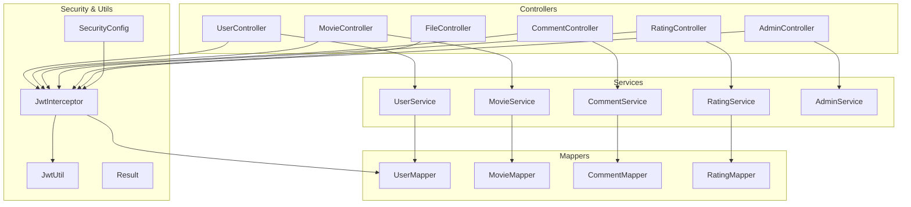
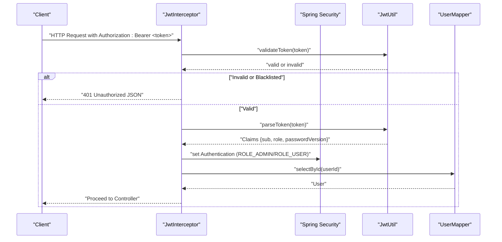
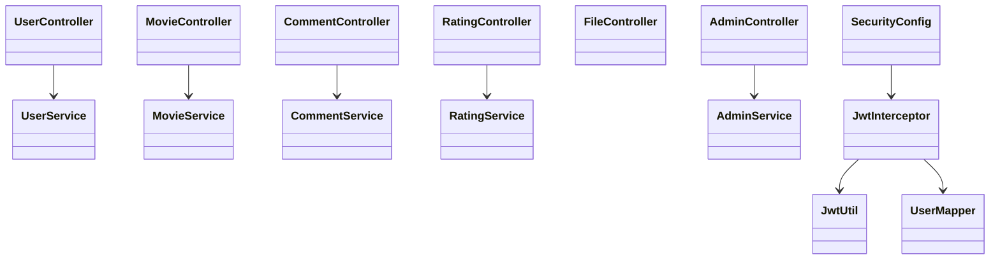

# API Reference

<cite>
**Referenced Files in This Document**
- [UserController.java](file://backend/src/main/java/com/movie/backend/controller/UserController.java)
- [LoginDTO.java](file://backend/src/main/java/com/movie/backend/dto/LoginDTO.java)
- [RegisterDTO.java](file://backend/src/main/java/com/movie/backend/dto/RegisterDTO.java)
- [MovieController.java](file://backend/src/main/java/com/movie/backend/controller/MovieController.java)
- [MovieSearchDTO.java](file://backend/src/main/java/com/movie/backend/dto/MovieSearchDTO.java)
- [CommentController.java](file://backend/src/main/java/com/movie/backend/controller/CommentController.java)
- [RatingController.java](file://backend/src/main/java/com/movie/backend/controller/RatingController.java)
- [FileController.java](file://backend/src/main/java/com/movie/backend/controller/FileController.java)
- [AdminController.java](file://backend/src/main/java/com/movie/backend/controller/admin/AdminController.java)
- [SecurityConfig.java](file://backend/src/main/java/com/movie/backend/config/SecurityConfig.java)
- [JwtInterceptor.java](file://backend/src/main/java/com/movie/backend/config/JwtInterceptor.java)
- [JwtUtil.java](file://backend/src/main/java/com/movie/backend/utils/JwtUtil.java)
- [Result.java](file://backend/src/main/java/com/movie/backend/common/Result.java)
- [User.java](file://backend/src/main/java/com/movie/backend/entity/User.java)
- [Movie.java](file://backend/src/main/java/com/movie/backend/entity/Movie.java)
- [application.yml](file://backend/src/main/resources/application.yml)
</cite>

## Table of Contents
1. [Introduction](#introduction)
2. [Project Structure](#project-structure)
3. [Core Components](#core-components)
4. [Architecture Overview](#architecture-overview)
5. [Detailed Component Analysis](#detailed-component-analysis)
6. [Dependency Analysis](#dependency-analysis)
7. [Performance Considerations](#performance-considerations)
8. [Troubleshooting Guide](#troubleshooting-guide)
9. [Conclusion](#conclusion)
10. [Appendices](#appendices)

## Introduction
This document provides a comprehensive API reference for the Movie System REST endpoints. It covers user management, movie catalog, reviews and ratings, file uploads, and admin panel operations. For each endpoint group, you will find HTTP methods, URL patterns, request/response schemas, authentication requirements, pagination/filtering/sorting capabilities, error codes, and example requests/responses. It also documents rate limiting considerations, API versioning strategy, and integration guidelines for client applications.

## Project Structure
The backend is a Spring Boot application organized by feature packages under the controller, service, mapper, dto, entity, and config layers. Controllers expose REST endpoints grouped by domain (user, movie, comment, rating, file, admin). Responses are standardized via a generic Result wrapper. Authentication is JWT-based with a global interceptor and method-level security for admin endpoints.

**Diagram sources**
- [UserController.java](file://backend/src/main/java/com/movie/backend/controller/UserController.java#L23-L129)
- [MovieController.java](file://backend/src/main/java/com/movie/backend/controller/MovieController.java#L31-L209)
- [CommentController.java](file://backend/src/main/java/com/movie/backend/controller/CommentController.java#L19-L113)
- [RatingController.java](file://backend/src/main/java/com/movie/backend/controller/RatingController.java#L18-L82)
- [FileController.java](file://backend/src/main/java/com/movie/backend/controller/FileController.java#L22-L72)
- [AdminController.java](file://backend/src/main/java/com/movie/backend/controller/admin/AdminController.java#L21-L135)
- [SecurityConfig.java](file://backend/src/main/java/com/movie/backend/config/SecurityConfig.java#L16-L51)
- [JwtInterceptor.java](file://backend/src/main/java/com/movie/backend/config/JwtInterceptor.java#L25-L105)
- [JwtUtil.java](file://backend/src/main/java/com/movie/backend/utils/JwtUtil.java#L21-L179)
- [Result.java](file://backend/src/main/java/com/movie/backend/common/Result.java#L8-L43)

**Section sources**
- [application.yml](file://backend/src/main/resources/application.yml#L1-L4)

## Core Components
- Unified response envelope: All endpoints return a Result<T> carrying code, message, and data. Success responses use code 200.
- Authentication: JWT tokens passed in Authorization header as Bearer <token>. Access tokens are short-lived; refresh tokens are long-lived and validated server-side.
- Pagination: Many endpoints accept page and size parameters with sensible defaults and bounds.
- Filtering and sorting: Movie search supports keyword, genre, score range, year filters, and sort by score/year/votes with direction.
- Rate limiting: Not configured in code; clients should implement client-side throttling and handle 429/503 gracefully if encountered.

**Section sources**
- [Result.java](file://backend/src/main/java/com/movie/backend/common/Result.java#L8-L43)
- [JwtInterceptor.java](file://backend/src/main/java/com/movie/backend/config/JwtInterceptor.java#L34-L95)
- [JwtUtil.java](file://backend/src/main/java/com/movie/backend/utils/JwtUtil.java#L24-L32)
- [MovieController.java](file://backend/src/main/java/com/movie/backend/controller/MovieController.java#L72-L75)
- [MovieSearchDTO.java](file://backend/src/main/java/com/movie/backend/dto/MovieSearchDTO.java#L18-L59)

## Architecture Overview
The API follows a layered architecture:
- Controllers expose endpoints and delegate to services.
- Services orchestrate business logic and coordinate mappers.
- Security interceptors validate JWT and populate user context.
- Global exception handling and method-level security guard admin endpoints.

**Diagram sources**
- [JwtInterceptor.java](file://backend/src/main/java/com/movie/backend/config/JwtInterceptor.java#L34-L95)
- [JwtUtil.java](file://backend/src/main/java/com/movie/backend/utils/JwtUtil.java#L99-L117)
- [SecurityConfig.java](file://backend/src/main/java/com/movie/backend/config/SecurityConfig.java#L24-L46)

## Detailed Component Analysis

### User Management Endpoints
- Base path: /user
- Authentication: Required for protected operations; login/register are public.

Endpoints:
- POST /user/login
  - Description: Authenticate user by credentials; returns access and refresh tokens and user info.
  - Request body: LoginDTO
    - Fields: id (string, required), password (string, required)
  - Response: Result<UserVO>
  - Example request:
    - POST /user/login
    - Body: {"id":"demo","password":"pass"}
  - Example response:
    - 200 OK, data: { "id": "...", "nickname": "...", "avatar": "...", roles, stats... }

- POST /user/register
  - Description: Register a new user account.
  - Request body: RegisterDTO
    - Fields: id (4–20 chars), password (≥6), nickname (required), email (optional), url (optional)
  - Response: Result<string> ("Registration successful")

- GET /user/info
  - Description: Get current user’s profile with stats.
  - Response: Result<UserVO>
  - Requires: Authorization Bearer <access_token>

- GET /user/public/{userId}
  - Description: Get public profile of another user.
  - Path param: userId (string, required)
  - Response: Result<PublicUserVO>

- PUT /user/avatar
  - Description: Update avatar image URL.
  - Query param: avatarUrl (string, required)
  - Response: Result<string>

- POST /user/refresh
  - Description: Exchange refresh token for a new access token.
  - Query param: refreshToken (string, required)
  - Response: Result<string> (new access token)

- POST /user/logout
  - Description: Logout; blacklist access and optional refresh tokens.
  - Query param: refreshToken (string, optional)
  - Response: Result<string>

- POST /user/change-password
  - Description: Change password; invalidates existing tokens.
  - Query params: oldPassword, newPassword, refreshToken (optional)
  - Response: Result<string>

Notes:
- User entity fields include id, nickname, avatar, url, email, role, status, passwordVersion, timestamps.
- Password updates increment passwordVersion; tokens with mismatched versions are rejected.

**Section sources**
- [UserController.java](file://backend/src/main/java/com/movie/backend/controller/UserController.java#L32-L104)
- [LoginDTO.java](file://backend/src/main/java/com/movie/backend/dto/LoginDTO.java#L10-L19)
- [RegisterDTO.java](file://backend/src/main/java/com/movie/backend/dto/RegisterDTO.java#L12-L34)
- [User.java](file://backend/src/main/java/com/movie/backend/entity/User.java#L11-L46)

### Movie Catalog Endpoints
- Base path: /movie
- Pagination: page (default 1, min 1), size (default 10, min 1, max 100)

Endpoints:
- GET /movie/detail/{id}
  - Description: Retrieve movie details; records view history for logged-in users.
  - Path param: id (long, >0)
  - Response: Result<Movie>

- POST /movie/search
  - Description: Advanced search with filters and sorting.
  - Request body: MovieSearchDTO
    - Fields: keyword, genre, minScore, maxScore, year, startYear, endYear, region, sortBy (score|year|votes), sortOrder (desc|asc, default desc)
  - Response: Result<PageInfo<Movie>>

- GET /movie/hot?limit=N
  - Description: Top N most popular movies by votes.
  - Query param: limit (1–100)

- GET /movie/recommended?limit=N
  - Description: Top N recommended by score.
  - Query param: limit (1–100)

- GET /movie/genre/{genre}
  - Description: Filter by genre; paginated.
  - Path param: genre (string)
  - Query params: page, size

- GET /movie/year/{year}
  - Description: Filter by release year; paginated.
  - Path param: year (int, ≥1900)
  - Query params: page, size

- GET /movie/latest
  - Description: Newest releases; paginated.

- GET /movie/genres
  - Description: List all distinct genres.

- GET /movie/regions
  - Description: List all distinct regions.

- GET /movie/years
  - Description: List all distinct years (desc).

- GET /movie/filter/metadata
  - Description: Segmentation metadata for scores and eras.

Example request (search):
- POST /movie/search
- Body: {"keyword":"inception","genre":"sci-fi","minScore":8.0,"maxScore":10.0,"sortBy":"score","sortOrder":"desc","page":1,"size":10}

Response envelope:
- 200 OK, data: PageInfo<Movie> with list, pageNum, pageSize, total, etc.

**Section sources**
- [MovieController.java](file://backend/src/main/java/com/movie/backend/controller/MovieController.java#L41-L198)
- [MovieSearchDTO.java](file://backend/src/main/java/com/movie/backend/dto/MovieSearchDTO.java#L18-L59)
- [Movie.java](file://backend/src/main/java/com/movie/backend/entity/Movie.java#L11-L65)

### Review and Rating Endpoints
- Base path: /comment and /rating

Comment endpoints:
- GET /comment/list?movieId=&page=&size=
  - Description: Paginated comments for a movie (basic).
- GET /comment/list-with-rating?movieId=&page=&size=
  - Description: Paginated comments with user info, ratings, and current user’s like status.
- POST /comment/submit?movieId=&content=
  - Description: Submit a single comment per movie.
- GET /comment/get?movieId=
  - Description: Fetch current user’s comment for a movie.
- POST /comment/update?movieId=&content=&rating=
  - Description: Update both content and rating.
- POST /comment/update-content?movieId=&content=
  - Description: Update only content.
- POST /comment/like?commentId=
  - Description: Toggle like/unlike; returns current liked state.
- GET /comment/my?page=&size=
  - Description: Paginated list of current user’s comments.

Rating endpoints:
- POST /rating/submit?movieId=&rating=
- POST /rating/update?movieId=&rating=
- GET /rating/get?movieId=
- GET /rating/my?page=&size=
- DELETE /rating/clear
- DELETE /rating/batch (body: [movieIds])

Notes:
- Ratings are integers; comments support content and numeric rating updates.
- Like toggling returns a boolean indicating current like state.

**Section sources**
- [CommentController.java](file://backend/src/main/java/com/movie/backend/controller/CommentController.java#L25-L113)
- [RatingController.java](file://backend/src/main/java/com/movie/backend/controller/RatingController.java#L24-L81)

### File Upload Endpoints
- Base path: /common
- POST /common/upload (multipart/form-data)
  - Description: Upload images (JPG, JPEG, PNG, GIF, WEBP), max 5MB.
  - Form field: file (required)
  - Response: Result<string> (relative URL path like /images/<uuid.ext>)
  - Example response: 200 OK, data: "/images/abcd1234.png"

Constraints:
- Allowed extensions: .jpg, .jpeg, .png, .gif, .webp
- Max file size: 5 MB
- Upload directory is configurable via file.upload-path

**Section sources**
- [FileController.java](file://backend/src/main/java/com/movie/backend/controller/FileController.java#L31-L72)

### Admin Panel Endpoints
- Base path: /admin
- Authentication: Requires ROLE_ADMIN via @PreAuthorize
- Dashboard:
  - GET /admin/dashboard/stats
- User management:
  - GET /admin/user/list?keyword=&page=&size=
  - DELETE /admin/user/delete/{id}
- Movie management:
  - POST /admin/movie/add (body: Movie)
  - PUT /admin/movie/update (body: Movie)
  - DELETE /admin/movie/delete/{id}
  - GET /admin/movie/list?keyword=&page=&size=
- Person management:
  - GET /admin/person/list?keyword=&page=&size=
  - POST /admin/person/add (body: Person)
  - PUT /admin/person/update (body: Person)
  - DELETE /admin/person/delete/{id}
- Comment management:
  - GET /admin/comment/list?keyword=&page=&size=
  - DELETE /admin/comment/delete/{id}

Notes:
- All admin endpoints are protected by method-level security and require ADMIN role.

**Section sources**
- [AdminController.java](file://backend/src/main/java/com/movie/backend/controller/admin/AdminController.java#L29-L134)
- [SecurityConfig.java](file://backend/src/main/java/com/movie/backend/config/SecurityConfig.java#L18-L22)

## Dependency Analysis
- Controllers depend on services; services depend on mappers and utilities.
- JwtInterceptor integrates JwtUtil and UserMapper to validate tokens and set SecurityContext.
- SecurityConfig disables form/basic auth, CSRF, and sets stateless session policy; delegates authorization to JwtInterceptor and @PreAuthorize.

**Diagram sources**
- [UserController.java](file://backend/src/main/java/com/movie/backend/controller/UserController.java#L26-L30)
- [MovieController.java](file://backend/src/main/java/com/movie/backend/controller/MovieController.java#L35-L39)
- [CommentController.java](file://backend/src/main/java/com/movie/backend/controller/CommentController.java#L22-L23)
- [RatingController.java](file://backend/src/main/java/com/movie/backend/controller/RatingController.java#L21-L22)
- [AdminController.java](file://backend/src/main/java/com/movie/backend/controller/admin/AdminController.java#L26-L27)
- [JwtInterceptor.java](file://backend/src/main/java/com/movie/backend/config/JwtInterceptor.java#L25-L31)
- [JwtUtil.java](file://backend/src/main/java/com/movie/backend/utils/JwtUtil.java#L21-L47)
- [SecurityConfig.java](file://backend/src/main/java/com/movie/backend/config/SecurityConfig.java#L16-L22)

**Section sources**
- [JwtInterceptor.java](file://backend/src/main/java/com/movie/backend/config/JwtInterceptor.java#L34-L95)
- [SecurityConfig.java](file://backend/src/main/java/com/movie/backend/config/SecurityConfig.java#L24-L46)

## Performance Considerations
- Pagination: Use page and size consistently to avoid large payloads. Defaults enforce minimums and caps to prevent abuse.
- Filtering: Prefer precise filters (e.g., year, genre) to reduce result sets.
- Sorting: Limit sortBy to supported fields; default descending order reduces scanning overhead.
- Token reuse: Access tokens are short-lived; rely on refresh tokens judiciously to minimize re-auth attempts.
- File uploads: Respect max size and allowed formats to avoid server overload.

[No sources needed since this section provides general guidance]

## Troubleshooting Guide
Common errors and resolutions:
- 401 Unauthorized
  - Cause: Missing or invalid Authorization header; token parsing failed; token in blacklist.
  - Resolution: Re-authenticate; ensure Bearer <token>; check token validity and blacklist status.
- 403 Forbidden
  - Cause: Insufficient privileges (e.g., accessing admin endpoints without ADMIN role).
  - Resolution: Obtain proper role or avoid admin endpoints.
- 404 Not Found
  - Cause: Resource does not exist (user, movie, comment).
  - Resolution: Verify identifiers; confirm existence before requesting.
- 400 Bad Request
  - Cause: Validation failures (missing fields, invalid ranges, unsupported file types).
  - Resolution: Align request with DTO constraints and allowed file formats/sizes.
- 500 Internal Server Error
  - Cause: Unexpected server-side failure during processing.
  - Resolution: Retry with reduced load; inspect server logs.

**Section sources**
- [JwtInterceptor.java](file://backend/src/main/java/com/movie/backend/config/JwtInterceptor.java#L47-L91)
- [FileController.java](file://backend/src/main/java/com/movie/backend/controller/FileController.java#L37-L54)
- [MovieController.java](file://backend/src/main/java/com/movie/backend/controller/MovieController.java#L51-L53)

## Conclusion
The Movie System API provides a cohesive set of endpoints for user management, movie discovery, reviews/ratings, file uploads, and administrative operations. It enforces JWT-based authentication, offers robust pagination and filtering, and standardizes responses via a unified envelope. Clients should integrate with Authorization headers, respect pagination limits, and handle error codes appropriately.

[No sources needed since this section summarizes without analyzing specific files]

## Appendices

### Authentication and Authorization
- Header: Authorization: Bearer <access_token>
- Access tokens are short-lived; use refresh tokens to obtain new access tokens.
- Admin endpoints require ROLE_ADMIN.

**Section sources**
- [JwtInterceptor.java](file://backend/src/main/java/com/movie/backend/config/JwtInterceptor.java#L40-L52)
- [JwtUtil.java](file://backend/src/main/java/com/movie/backend/utils/JwtUtil.java#L123-L155)
- [SecurityConfig.java](file://backend/src/main/java/com/movie/backend/config/SecurityConfig.java#L18-L22)

### Response Envelope
- Structure: { "code": number, "message": string, "data": any }
- Success: code 200
- Failure: code varies (e.g., 400, 401, 403, 404, 500)

**Section sources**
- [Result.java](file://backend/src/main/java/com/movie/backend/common/Result.java#L8-L43)

### API Versioning Strategy
- No explicit version prefix in URLs observed.
- Recommendations:
  - Use path versioning (/v1/resource) or header versioning (Accept: application/vnd.api.v1+json).
  - Maintain backward compatibility or introduce deprecation notices.

[No sources needed since this section provides general guidance]

### Integration Guidelines
- Set Authorization header for protected endpoints.
- Use pagination parameters to manage payload sizes.
- Validate inputs against DTO constraints before sending requests.
- Implement retry/backoff for transient failures; throttle requests to avoid rate limits.

[No sources needed since this section provides general guidance]