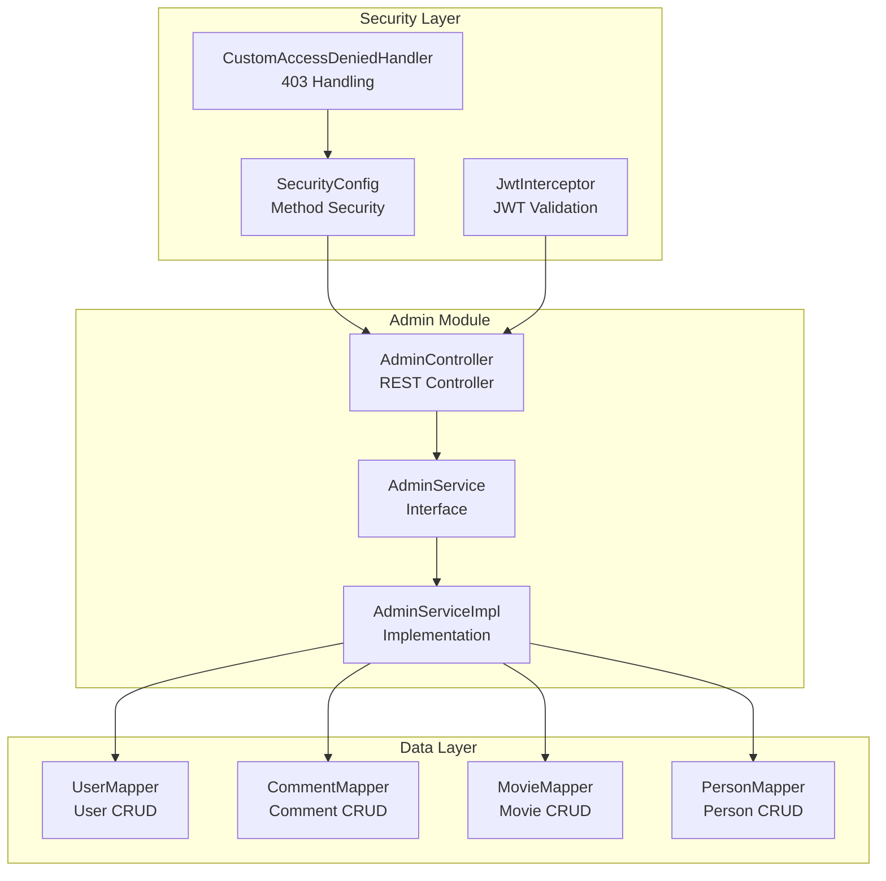
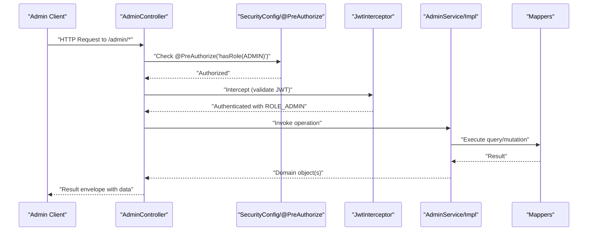
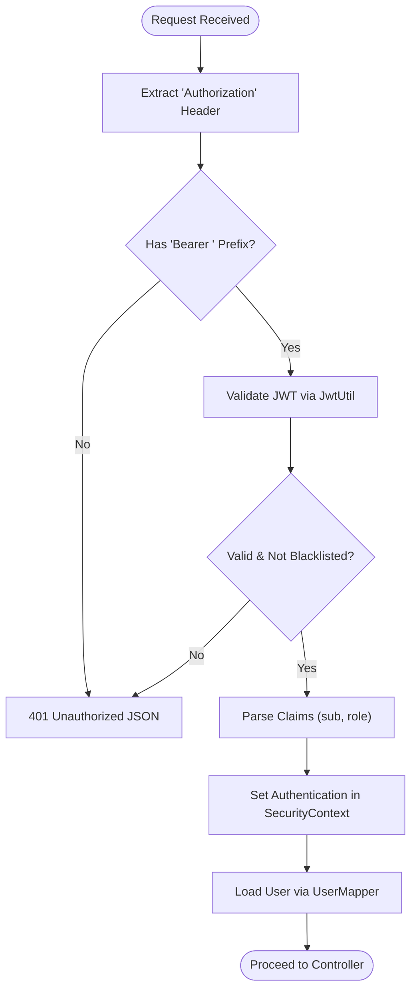
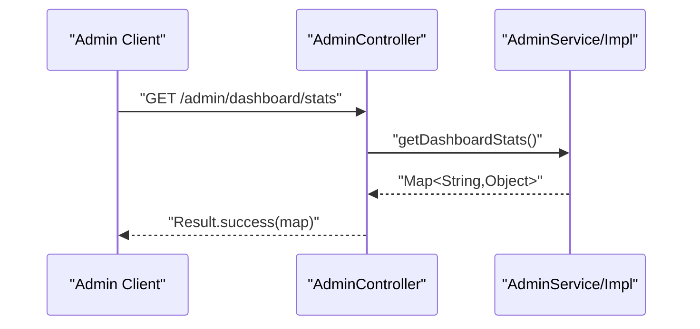
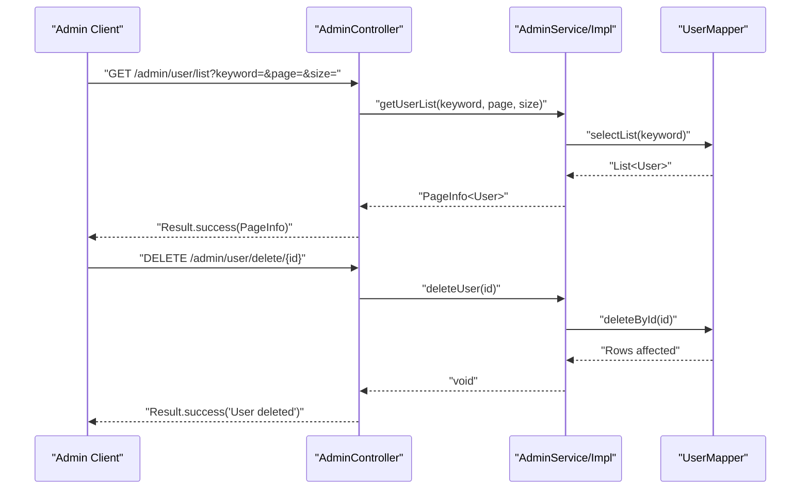
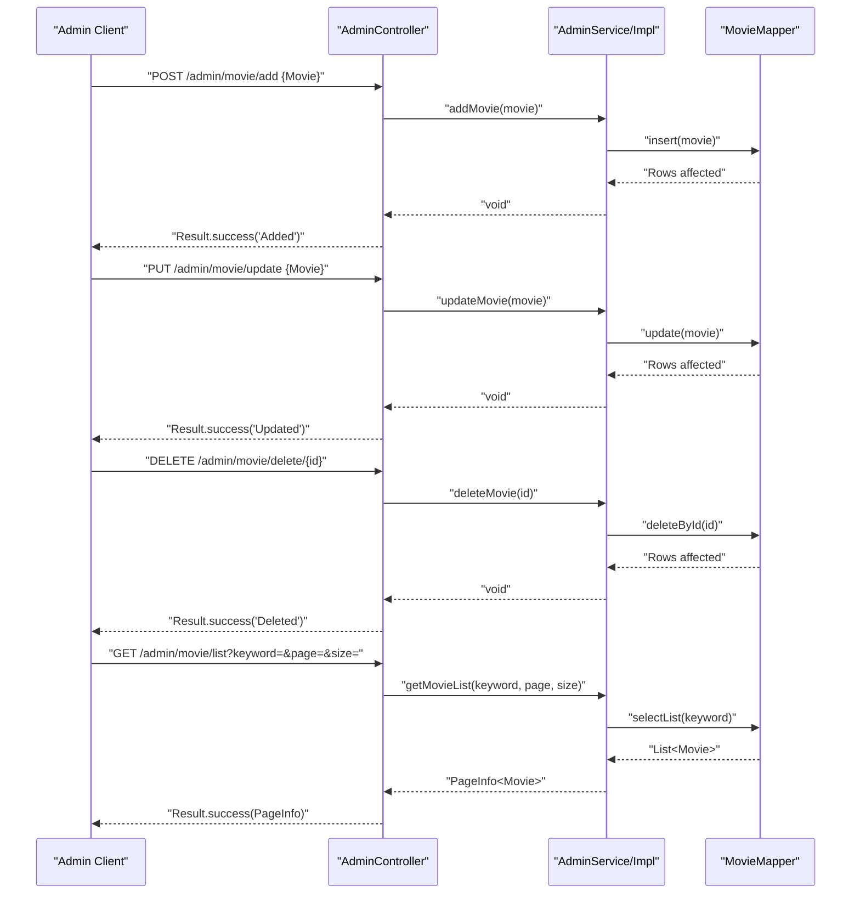
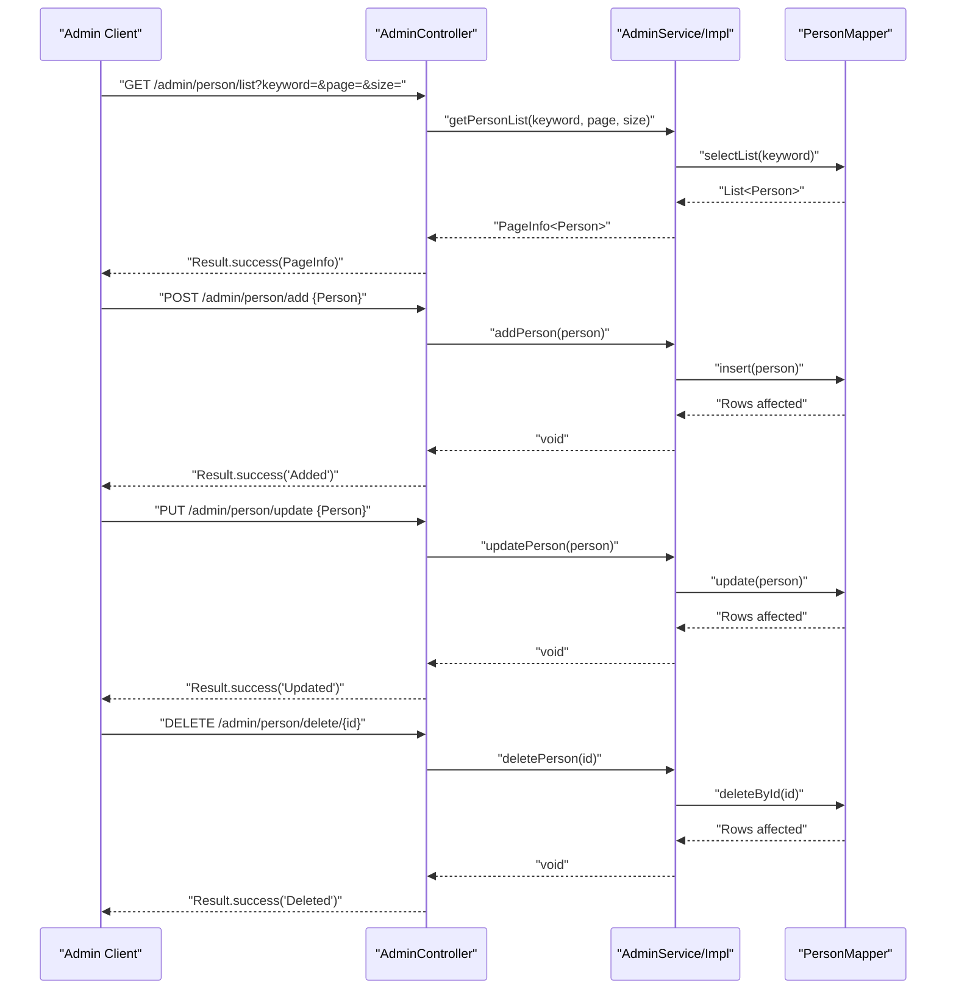
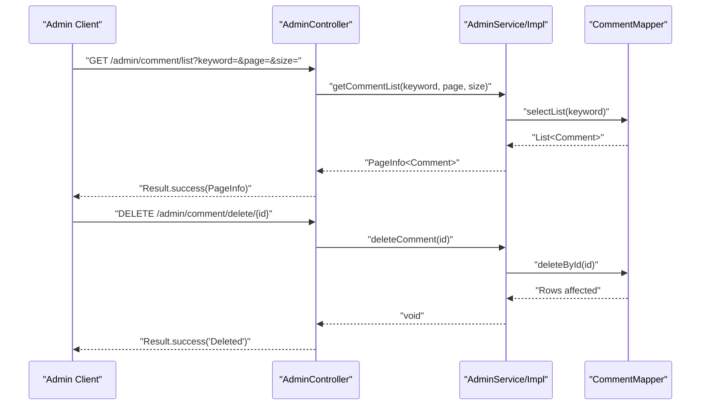
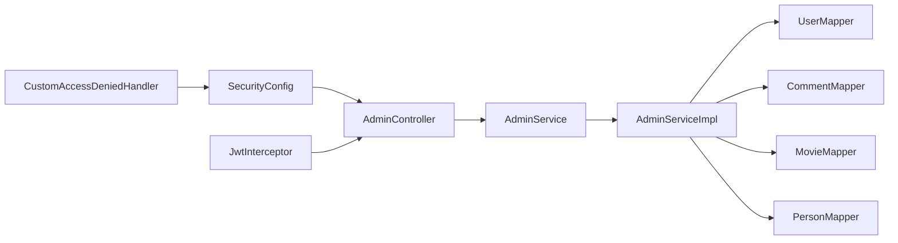

# Admin Panel API

<cite>
**Referenced Files in This Document**
- [AdminController.java](file://backend/src/main/java/com/movie/backend/controller/admin/AdminController.java)
- [AdminService.java](file://backend/src/main/java/com/movie/backend/service/AdminService.java)
- [AdminServiceImpl.java](file://backend/src/main/java/com/movie/backend/service/impl/AdminServiceImpl.java)
- [SecurityConfig.java](file://backend/src/main/java/com/movie/backend/config/SecurityConfig.java)
- [JwtInterceptor.java](file://backend/src/main/java/com/movie/backend/config/JwtInterceptor.java)
- [CustomAccessDeniedHandler.java](file://backend/src/main/java/com/movie/backend/config/CustomAccessDeniedHandler.java)
- [Result.java](file://backend/src/main/java/com/movie/backend/common/Result.java)
- [User.java](file://backend/src/main/java/com/movie/backend/entity/User.java)
- [Comment.java](file://backend/src/main/java/com/movie/backend/entity/Comment.java)
- [Movie.java](file://backend/src/main/java/com/movie/backend/entity/Movie.java)
- [UserMapper.java](file://backend/src/main/java/com/movie/backend/mapper/UserMapper.java)
- [application.yml](file://backend/src/main/resources/application.yml)
</cite>

## Table of Contents
1. [Introduction](#introduction)
2. [Project Structure](#project-structure)
3. [Core Components](#core-components)
4. [Architecture Overview](#architecture-overview)
5. [Detailed Component Analysis](#detailed-component-analysis)
6. [Dependency Analysis](#dependency-analysis)
7. [Performance Considerations](#performance-considerations)
8. [Troubleshooting Guide](#troubleshooting-guide)
9. [Conclusion](#conclusion)
10. [Appendices](#appendices)

## Introduction
This document provides comprehensive API documentation for administrative endpoints. It covers:
- Admin-only endpoints for user management (listing, deletion)
- Content moderation endpoints (comment review and removal)
- System administration endpoints (dashboard statistics, resource management)
- Authentication and authorization requirements
- Role-based access patterns and security considerations
- Administrative workflows and examples

All endpoints under the admin module are protected and require an authenticated administrator.

## Project Structure
The admin functionality is implemented as a dedicated controller with a service layer and data access layer. Security is enforced via method-level authorization and a JWT interceptor.

**Diagram sources**
- [AdminController.java](file://backend/src/main/java/com/movie/backend/controller/admin/AdminController.java#L1-L135)
- [AdminService.java](file://backend/src/main/java/com/movie/backend/service/AdminService.java#L1-L35)
- [AdminServiceImpl.java](file://backend/src/main/java/com/movie/backend/service/impl/AdminServiceImpl.java#L1-L123)
- [SecurityConfig.java](file://backend/src/main/java/com/movie/backend/config/SecurityConfig.java#L1-L51)
- [JwtInterceptor.java](file://backend/src/main/java/com/movie/backend/config/JwtInterceptor.java#L1-L105)
- [CustomAccessDeniedHandler.java](file://backend/src/main/java/com/movie/backend/config/CustomAccessDeniedHandler.java#L1-L27)
- [UserMapper.java](file://backend/src/main/java/com/movie/backend/mapper/UserMapper.java#L1-L41)

**Section sources**
- [AdminController.java](file://backend/src/main/java/com/movie/backend/controller/admin/AdminController.java#L1-L135)
- [application.yml](file://backend/src/main/resources/application.yml#L1-L4)

## Core Components
- AdminController: Exposes admin endpoints under /admin with method-level authorization.
- AdminService and AdminServiceImpl: Define and implement admin operations including dashboard stats, user management, content moderation, and resource management.
- SecurityConfig: Enables method security and delegates access control to annotations and interceptors.
- JwtInterceptor: Validates JWT tokens, sets authorities, and populates current user context.
- CustomAccessDeniedHandler: Returns standardized 403 responses for insufficient privileges.
- Result: Standardized API response envelope.

Key roles and authorities:
- Roles are encoded in JWT claims with 0 representing ADMIN and 1 representing USER.
- Method-level protection uses @PreAuthorize("hasRole('ADMIN')").

**Section sources**
- [AdminController.java](file://backend/src/main/java/com/movie/backend/controller/admin/AdminController.java#L19-L23)
- [SecurityConfig.java](file://backend/src/main/java/com/movie/backend/config/SecurityConfig.java#L16-L18)
- [JwtInterceptor.java](file://backend/src/main/java/com/movie/backend/config/JwtInterceptor.java#L62-L86)
- [Result.java](file://backend/src/main/java/com/movie/backend/common/Result.java#L6-L43)

## Architecture Overview
The admin APIs follow a layered architecture:
- Presentation: AdminController exposes REST endpoints.
- Application: AdminService defines admin operations; AdminServiceImpl implements them.
- Persistence: Mappers encapsulate database operations.
- Security: JwtInterceptor validates tokens and sets authorities; SecurityConfig enables method security; CustomAccessDeniedHandler handles access denials.

**Diagram sources**
- [AdminController.java](file://backend/src/main/java/com/movie/backend/controller/admin/AdminController.java#L22-L135)
- [SecurityConfig.java](file://backend/src/main/java/com/movie/backend/config/SecurityConfig.java#L16-L18)
- [JwtInterceptor.java](file://backend/src/main/java/com/movie/backend/config/JwtInterceptor.java#L34-L95)
- [AdminServiceImpl.java](file://backend/src/main/java/com/movie/backend/service/impl/AdminServiceImpl.java#L21-L123)

## Detailed Component Analysis

### Authentication and Authorization
- JWT-based authentication: Tokens are extracted from the Authorization header and validated by the interceptor.
- Authorities: Role claim determines authority (ROLE_ADMIN vs ROLE_USER).
- Method-level protection: @PreAuthorize("hasRole('ADMIN')") guards all admin endpoints.
- Access denied: CustomAccessDeniedHandler returns a JSON 403 response.

**Diagram sources**
- [JwtInterceptor.java](file://backend/src/main/java/com/movie/backend/config/JwtInterceptor.java#L40-L92)
- [CustomAccessDeniedHandler.java](file://backend/src/main/java/com/movie/backend/config/CustomAccessDeniedHandler.java#L19-L25)

**Section sources**
- [JwtInterceptor.java](file://backend/src/main/java/com/movie/backend/config/JwtInterceptor.java#L34-L95)
- [SecurityConfig.java](file://backend/src/main/java/com/movie/backend/config/SecurityConfig.java#L24-L46)
- [CustomAccessDeniedHandler.java](file://backend/src/main/java/com/movie/backend/config/CustomAccessDeniedHandler.java#L16-L26)

### Admin Dashboard Statistics
- Endpoint: GET /admin/dashboard/stats
- Description: Returns system metrics such as total user count and total movie count.
- Response: Result wrapper containing a map of statistics.

**Diagram sources**
- [AdminController.java](file://backend/src/main/java/com/movie/backend/controller/admin/AdminController.java#L29-L33)
- [AdminServiceImpl.java](file://backend/src/main/java/com/movie/backend/service/impl/AdminServiceImpl.java#L36-L43)

**Section sources**
- [AdminController.java](file://backend/src/main/java/com/movie/backend/controller/admin/AdminController.java#L29-L33)
- [AdminService.java](file://backend/src/main/java/com/movie/backend/service/AdminService.java#L12-L13)
- [AdminServiceImpl.java](file://backend/src/main/java/com/movie/backend/service/impl/AdminServiceImpl.java#L36-L43)

### User Management
- User Listing
  - Endpoint: GET /admin/user/list
  - Query params: keyword (optional), page (default 1), size (default 10)
  - Response: Paginated list of users
- User Deletion
  - Endpoint: DELETE /admin/user/delete/{id}
  - Path param: id (user identifier)
  - Response: Success message

**Diagram sources**
- [AdminController.java](file://backend/src/main/java/com/movie/backend/controller/admin/AdminController.java#L36-L51)
- [AdminService.java](file://backend/src/main/java/com/movie/backend/service/AdminService.java#L15-L17)
- [AdminServiceImpl.java](file://backend/src/main/java/com/movie/backend/service/impl/AdminServiceImpl.java#L46-L56)
- [UserMapper.java](file://backend/src/main/java/com/movie/backend/mapper/UserMapper.java#L27-L34)

**Section sources**
- [AdminController.java](file://backend/src/main/java/com/movie/backend/controller/admin/AdminController.java#L36-L51)
- [AdminService.java](file://backend/src/main/java/com/movie/backend/service/AdminService.java#L15-L17)
- [AdminServiceImpl.java](file://backend/src/main/java/com/movie/backend/service/impl/AdminServiceImpl.java#L46-L56)
- [UserMapper.java](file://backend/src/main/java/com/movie/backend/mapper/UserMapper.java#L27-L34)
- [User.java](file://backend/src/main/java/com/movie/backend/entity/User.java#L11-L45)

### Movie Management
- Add Movie
  - Endpoint: POST /admin/movie/add
  - Body: Movie entity
  - Behavior: Assigns an ID if missing, inserts record
- Update Movie
  - Endpoint: PUT /admin/movie/update
  - Body: Movie entity
  - Behavior: Updates existing record
- Delete Movie
  - Endpoint: DELETE /admin/movie/delete/{id}
  - Path param: id (movie identifier)
- Movie Listing
  - Endpoint: GET /admin/movie/list
  - Query params: keyword (optional), page (default 1), size (default 10)

**Diagram sources**
- [AdminController.java](file://backend/src/main/java/com/movie/backend/controller/admin/AdminController.java#L54-L83)
- [AdminService.java](file://backend/src/main/java/com/movie/backend/service/AdminService.java#L19-L23)
- [AdminServiceImpl.java](file://backend/src/main/java/com/movie/backend/service/impl/AdminServiceImpl.java#L58-L82)
- [Movie.java](file://backend/src/main/java/com/movie/backend/entity/Movie.java#L13-L65)

**Section sources**
- [AdminController.java](file://backend/src/main/java/com/movie/backend/controller/admin/AdminController.java#L54-L83)
- [AdminService.java](file://backend/src/main/java/com/movie/backend/service/AdminService.java#L19-L23)
- [AdminServiceImpl.java](file://backend/src/main/java/com/movie/backend/service/impl/AdminServiceImpl.java#L58-L82)
- [Movie.java](file://backend/src/main/java/com/movie/backend/entity/Movie.java#L13-L65)

### Person Management
- Person Listing
  - Endpoint: GET /admin/person/list
  - Query params: keyword (optional), page (default 1), size (default 10)
- Add Person
  - Endpoint: POST /admin/person/add
  - Body: Person entity
- Update Person
  - Endpoint: PUT /admin/person/update
  - Body: Person entity
- Delete Person
  - Endpoint: DELETE /admin/person/delete/{id}
  - Path param: id (person identifier)

**Diagram sources**
- [AdminController.java](file://backend/src/main/java/com/movie/backend/controller/admin/AdminController.java#L85-L115)
- [AdminService.java](file://backend/src/main/java/com/movie/backend/service/AdminService.java#L25-L29)
- [AdminServiceImpl.java](file://backend/src/main/java/com/movie/backend/service/impl/AdminServiceImpl.java#L84-L108)

**Section sources**
- [AdminController.java](file://backend/src/main/java/com/movie/backend/controller/admin/AdminController.java#L85-L115)
- [AdminService.java](file://backend/src/main/java/com/movie/backend/service/AdminService.java#L25-L29)
- [AdminServiceImpl.java](file://backend/src/main/java/com/movie/backend/service/impl/AdminServiceImpl.java#L84-L108)

### Comment Moderation
- Comment Listing
  - Endpoint: GET /admin/comment/list
  - Query params: keyword (optional), page (default 1), size (default 10)
- Delete Comment
  - Endpoint: DELETE /admin/comment/delete/{id}
  - Path param: id (comment identifier)

**Diagram sources**
- [AdminController.java](file://backend/src/main/java/com/movie/backend/controller/admin/AdminController.java#L117-L133)
- [AdminService.java](file://backend/src/main/java/com/movie/backend/service/AdminService.java#L31-L33)
- [AdminServiceImpl.java](file://backend/src/main/java/com/movie/backend/service/impl/AdminServiceImpl.java#L110-L121)
- [Comment.java](file://backend/src/main/java/com/movie/backend/entity/Comment.java#L9-L27)

**Section sources**
- [AdminController.java](file://backend/src/main/java/com/movie/backend/controller/admin/AdminController.java#L117-L133)
- [AdminService.java](file://backend/src/main/java/com/movie/backend/service/AdminService.java#L31-L33)
- [AdminServiceImpl.java](file://backend/src/main/java/com/movie/backend/service/impl/AdminServiceImpl.java#L110-L121)
- [Comment.java](file://backend/src/main/java/com/movie/backend/entity/Comment.java#L9-L27)

### System Administration Endpoints
- Dashboard Stats
  - Endpoint: GET /admin/dashboard/stats
  - Purpose: Retrieve system metrics (placeholder implementation returns fixed counts)
- Resource Management
  - Movies: Add, update, delete, list
  - Persons: Add, update, delete, list
  - Comments: List, delete
  - Users: List, delete

Note: The dashboard stats currently return placeholder values. Production deployments should replace these with actual database queries.

**Section sources**
- [AdminController.java](file://backend/src/main/java/com/movie/backend/controller/admin/AdminController.java#L29-L33)
- [AdminServiceImpl.java](file://backend/src/main/java/com/movie/backend/service/impl/AdminServiceImpl.java#L36-L43)

## Dependency Analysis
Admin endpoints depend on the service layer, which in turn depends on mappers for persistence. Security is enforced at both the web layer (interceptor) and method level (annotations).

**Diagram sources**
- [AdminController.java](file://backend/src/main/java/com/movie/backend/controller/admin/AdminController.java#L22-L135)
- [AdminService.java](file://backend/src/main/java/com/movie/backend/service/AdminService.java#L11-L34)
- [AdminServiceImpl.java](file://backend/src/main/java/com/movie/backend/service/impl/AdminServiceImpl.java#L21-L123)
- [SecurityConfig.java](file://backend/src/main/java/com/movie/backend/config/SecurityConfig.java#L16-L18)
- [JwtInterceptor.java](file://backend/src/main/java/com/movie/backend/config/JwtInterceptor.java#L34-L95)
- [CustomAccessDeniedHandler.java](file://backend/src/main/java/com/movie/backend/config/CustomAccessDeniedHandler.java#L16-L26)

**Section sources**
- [AdminController.java](file://backend/src/main/java/com/movie/backend/controller/admin/AdminController.java#L22-L135)
- [AdminServiceImpl.java](file://backend/src/main/java/com/movie/backend/service/impl/AdminServiceImpl.java#L21-L123)
- [SecurityConfig.java](file://backend/src/main/java/com/movie/backend/config/SecurityConfig.java#L16-L18)

## Performance Considerations
- Pagination: All list endpoints support pagination via page and size parameters. Use appropriate page sizes to balance responsiveness and payload size.
- Database queries: The service layer uses a paging helper to avoid loading entire datasets. Ensure database indexes exist on frequently filtered columns (e.g., user identifiers, movie identifiers, comment content).
- Token validation: JWT validation and blacklist checks occur per request. Keep token lifetimes reasonable and leverage blacklisting for compromised tokens.
- Caching: Consider caching dashboard metrics if real-time updates are not required.

## Troubleshooting Guide
Common issues and resolutions:
- 401 Unauthorized
  - Cause: Missing or invalid Authorization header, malformed Bearer token, token in blacklist.
  - Resolution: Ensure the client sends a valid Bearer token; verify token is not revoked.
- 403 Forbidden
  - Cause: Insufficient privileges; user lacks ADMIN role.
  - Resolution: Authenticate with an admin account; verify role claim in JWT.
- 404 Not Found
  - Cause: Non-existent resource ID in delete operations.
  - Resolution: Verify IDs before invoking delete endpoints.
- 5xx Internal Errors
  - Cause: Database errors or unhandled exceptions.
  - Resolution: Check server logs; confirm mapper operations succeed.

Operational tips:
- Use the dashboard endpoint to verify connectivity and admin privileges.
- Test list endpoints with small page sizes during development.
- Monitor access denied responses to diagnose role-related issues.

**Section sources**
- [JwtInterceptor.java](file://backend/src/main/java/com/movie/backend/config/JwtInterceptor.java#L47-L92)
- [CustomAccessDeniedHandler.java](file://backend/src/main/java/com/movie/backend/config/CustomAccessDeniedHandler.java#L20-L25)
- [Result.java](file://backend/src/main/java/com/movie/backend/common/Result.java#L35-L41)

## Conclusion
The admin panel API provides a secure, method-protected set of endpoints for system administration tasks. Authentication relies on JWT with role-based authorization, while the service layer abstracts persistence concerns. Administrators can manage users, content, and system resources efficiently, with standardized response envelopes and pagination support.

## Appendices

### API Reference Summary
- Authentication
  - Header: Authorization: Bearer <token>
  - Roles: ADMIN (0), USER (1)
- Endpoints
  - GET /admin/dashboard/stats
  - GET /admin/user/list?keyword=&page=&size=
  - DELETE /admin/user/delete/{id}
  - POST /admin/movie/add
  - PUT /admin/movie/update
  - DELETE /admin/movie/delete/{id}
  - GET /admin/movie/list?keyword=&page=&size=
  - GET /admin/person/list?keyword=&page=&size=
  - POST /admin/person/add
  - PUT /admin/person/update
  - DELETE /admin/person/delete/{id}
  - GET /admin/comment/list?keyword=&page=&size=
  - DELETE /admin/comment/delete/{id}

**Section sources**
- [AdminController.java](file://backend/src/main/java/com/movie/backend/controller/admin/AdminController.java#L29-L133)
- [JwtInterceptor.java](file://backend/src/main/java/com/movie/backend/config/JwtInterceptor.java#L40-L92)