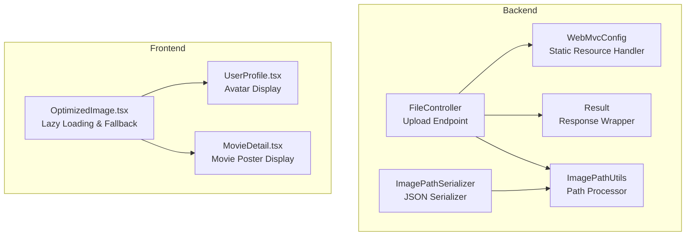
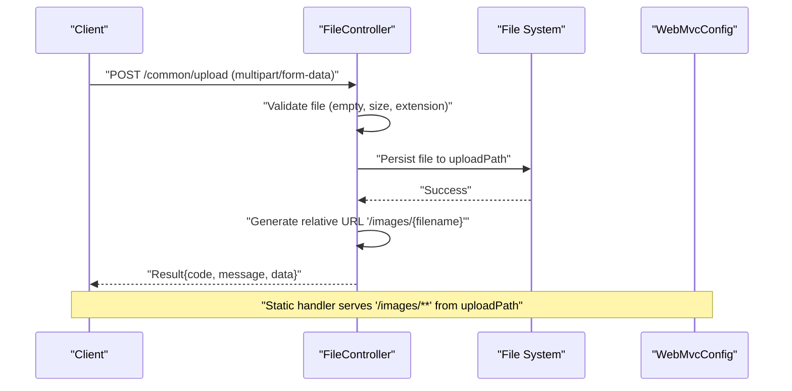
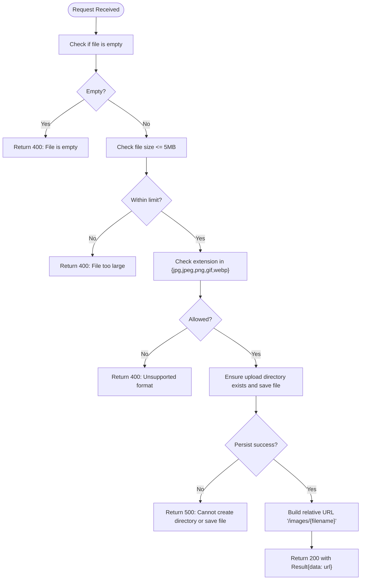
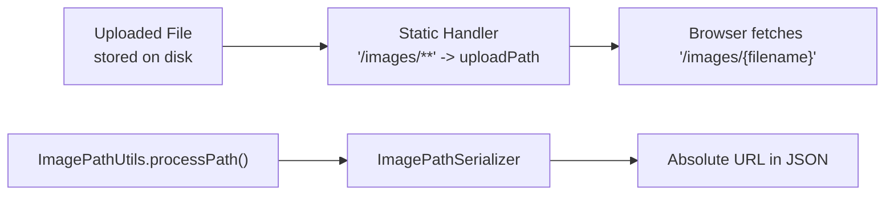
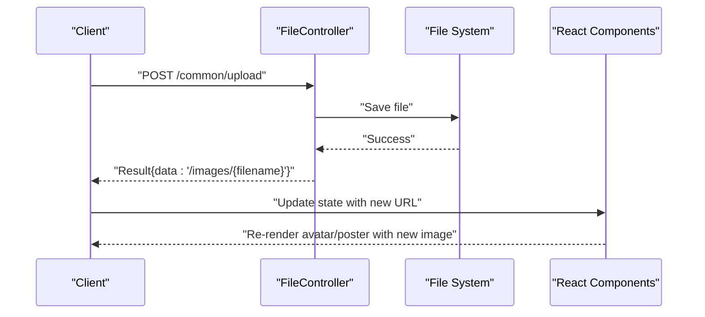
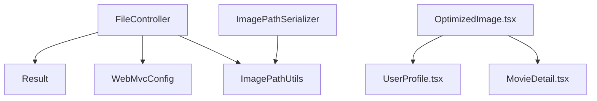

# File Upload API

<cite>
**Referenced Files in This Document**
- [FileController.java](file://backend/src/main/java/com/movie/backend/controller/FileController.java)
- [Result.java](file://backend/src/main/java/com/movie/backend/common/Result.java)
- [WebMvcConfig.java](file://backend/src/main/java/com/movie/backend/config/WebMvcConfig.java)
- [ImagePathUtils.java](file://backend/src/main/java/com/movie/backend/utils/ImagePathUtils.java)
- [ImagePathSerializer.java](file://backend/src/main/java/com/movie/backend/config/ImagePathSerializer.java)
- [application-dev.yml](file://backend/src/main/resources/application-dev.yml)
- [api-docs.json](file://movie-review-web/backend_api_doc/api-docs.json)
- [OptimizedImage.tsx](file://movie-review-web/src/components/OptimizedImage.tsx)
- [UserProfile.tsx](file://movie-review-web/src/pages/UserProfile.tsx)
- [MovieDetail.tsx](file://movie-review-web/src/pages/MovieDetail.tsx)
</cite>

## Table of Contents
1. [Introduction](#introduction)
2. [Project Structure](#project-structure)
3. [Core Components](#core-components)
4. [Architecture Overview](#architecture-overview)
5. [Detailed Component Analysis](#detailed-component-analysis)
6. [Dependency Analysis](#dependency-analysis)
7. [Performance Considerations](#performance-considerations)
8. [Troubleshooting Guide](#troubleshooting-guide)
9. [Conclusion](#conclusion)

## Introduction
This document provides comprehensive API documentation for file upload and media management endpoints in the movie system. It focuses on the POST `/common/upload` endpoint for image uploads, covering supported file types, size limits, validation rules, response schemas, error handling, and integration patterns for avatar and movie image management. It also documents URL generation, access control, and cleanup procedures, along with best practices for media handling.

## Project Structure
The file upload and media management functionality spans backend controllers, configuration, utilities, and frontend components:

- Backend:
  - Controller: handles multipart form data uploads and validates file metadata
  - Configuration: static resource mapping for serving uploaded images
  - Utilities: path processing and serialization for consistent image URLs
  - Common response wrapper: standardized API response structure
- Frontend:
  - Components for optimized image display and lazy loading
  - Pages integrating avatar and movie poster images

**Diagram sources**
- [FileController.java](file://backend/src/main/java/com/movie/backend/controller/FileController.java#L23-L72)
- [WebMvcConfig.java](file://backend/src/main/java/com/movie/backend/config/WebMvcConfig.java#L55-L63)
- [ImagePathUtils.java](file://backend/src/main/java/com/movie/backend/utils/ImagePathUtils.java#L27-L37)
- [ImagePathSerializer.java](file://backend/src/main/java/com/movie/backend/config/ImagePathSerializer.java#L13-L18)
- [Result.java](file://backend/src/main/java/com/movie/backend/common/Result.java#L8-L42)
- [OptimizedImage.tsx](file://movie-review-web/src/components/OptimizedImage.tsx#L17-L126)
- [UserProfile.tsx](file://movie-review-web/src/pages/UserProfile.tsx#L80-L87)
- [MovieDetail.tsx](file://movie-review-web/src/pages/MovieDetail.tsx#L140-L144)

**Section sources**
- [FileController.java](file://backend/src/main/java/com/movie/backend/controller/FileController.java#L1-L72)
- [WebMvcConfig.java](file://backend/src/main/java/com/movie/backend/config/WebMvcConfig.java#L1-L65)
- [application-dev.yml](file://backend/src/main/resources/application-dev.yml#L58-L60)

## Core Components
- FileController: Implements the `/common/upload` endpoint for image uploads with multipart form data. Validates file emptiness, size, and extension, persists files to disk, and returns a relative URL path.
- WebMvcConfig: Registers a static resource handler to serve uploaded images from the configured upload path under `/images/**`.
- ImagePathUtils: Processes image paths by appending the configured domain for absolute URLs.
- ImagePathSerializer: Serializes image paths to absolute URLs during JSON serialization.
- Result: Provides a unified response structure with code, message, and data fields.

**Section sources**
- [FileController.java](file://backend/src/main/java/com/movie/backend/controller/FileController.java#L23-L72)
- [WebMvcConfig.java](file://backend/src/main/java/com/movie/backend/config/WebMvcConfig.java#L55-L63)
- [ImagePathUtils.java](file://backend/src/main/java/com/movie/backend/utils/ImagePathUtils.java#L27-L37)
- [ImagePathSerializer.java](file://backend/src/main/java/com/movie/backend/config/ImagePathSerializer.java#L13-L18)
- [Result.java](file://backend/src/main/java/com/movie/backend/common/Result.java#L8-L42)

## Architecture Overview
The upload flow integrates client-side multipart requests, server-side validation, persistence, and URL generation. Uploaded files are stored on disk and served via a static resource handler. Path serialization ensures consistent absolute URLs in API responses.

**Diagram sources**
- [FileController.java](file://backend/src/main/java/com/movie/backend/controller/FileController.java#L32-L71)
- [WebMvcConfig.java](file://backend/src/main/java/com/movie/backend/config/WebMvcConfig.java#L55-L63)

## Detailed Component Analysis

### POST /common/upload (Image Upload)
- Endpoint: `POST /common/upload`
- Consumes: `multipart/form-data`
- Request body:
  - `file` (binary): Required image file
- Validation rules:
  - File must not be empty
  - File size must not exceed 5 MB
  - Supported extensions: `.jpg`, `.jpeg`, `.png`, `.gif`, `.webp`
- Response:
  - Success: `Result<String>` containing a relative URL path (e.g., `/images/{filename}`)
  - Failure: `Result` with appropriate error code and message

**Diagram sources**
- [FileController.java](file://backend/src/main/java/com/movie/backend/controller/FileController.java#L37-L70)

**Section sources**
- [FileController.java](file://backend/src/main/java/com/movie/backend/controller/FileController.java#L31-L71)
- [api-docs.json](file://movie-review-web/backend_api_doc/api-docs.json#L464-L495)

### Static Resource Serving and URL Generation
- Static handler: `/images/**` mapped to the configured upload path via `WebMvcConfig`
- Domain prefixing: `ImagePathUtils.processPath()` appends the configured domain to relative paths
- JSON serialization: `ImagePathSerializer` ensures serialized image URLs are absolute

**Diagram sources**
- [WebMvcConfig.java](file://backend/src/main/java/com/movie/backend/config/WebMvcConfig.java#L55-L63)
- [ImagePathUtils.java](file://backend/src/main/java/com/movie/backend/utils/ImagePathUtils.java#L27-L37)
- [ImagePathSerializer.java](file://backend/src/main/java/com/movie/backend/config/ImagePathSerializer.java#L13-L18)

**Section sources**
- [WebMvcConfig.java](file://backend/src/main/java/com/movie/backend/config/WebMvcConfig.java#L55-L63)
- [ImagePathUtils.java](file://backend/src/main/java/com/movie/backend/utils/ImagePathUtils.java#L27-L37)
- [ImagePathSerializer.java](file://backend/src/main/java/com/movie/backend/config/ImagePathSerializer.java#L13-L18)
- [application-dev.yml](file://backend/src/main/resources/application-dev.yml#L58-L60)

### Frontend Integration Patterns
- Avatar uploads: The frontend displays user avatars using optimized image components. After successful upload, update the user profile state with the returned URL and re-render the avatar.
- Movie image management: Movie posters and backdrops are rendered using optimized image components. When updating a movie's cover image, replace the existing URL with the newly uploaded URL and trigger re-render.

**Diagram sources**
- [FileController.java](file://backend/src/main/java/com/movie/backend/controller/FileController.java#L62-L66)
- [OptimizedImage.tsx](file://movie-review-web/src/components/OptimizedImage.tsx#L17-L126)
- [UserProfile.tsx](file://movie-review-web/src/pages/UserProfile.tsx#L82-L87)
- [MovieDetail.tsx](file://movie-review-web/src/pages/MovieDetail.tsx#L140-L144)

**Section sources**
- [OptimizedImage.tsx](file://movie-review-web/src/components/OptimizedImage.tsx#L17-L126)
- [UserProfile.tsx](file://movie-review-web/src/pages/UserProfile.tsx#L80-L87)
- [MovieDetail.tsx](file://movie-review-web/src/pages/MovieDetail.tsx#L140-L144)

## Dependency Analysis
The upload pipeline depends on configuration for static resource serving, path processing utilities, and a unified response wrapper. The frontend components depend on the backend's URL generation and lazy-loading utilities.

**Diagram sources**
- [FileController.java](file://backend/src/main/java/com/movie/backend/controller/FileController.java#L23-L72)
- [Result.java](file://backend/src/main/java/com/movie/backend/common/Result.java#L8-L42)
- [WebMvcConfig.java](file://backend/src/main/java/com/movie/backend/config/WebMvcConfig.java#L55-L63)
- [ImagePathUtils.java](file://backend/src/main/java/com/movie/backend/utils/ImagePathUtils.java#L27-L37)
- [ImagePathSerializer.java](file://backend/src/main/java/com/movie/backend/config/ImagePathSerializer.java#L13-L18)
- [OptimizedImage.tsx](file://movie-review-web/src/components/OptimizedImage.tsx#L17-L126)
- [UserProfile.tsx](file://movie-review-web/src/pages/UserProfile.tsx#L80-L87)
- [MovieDetail.tsx](file://movie-review-web/src/pages/MovieDetail.tsx#L140-L144)

**Section sources**
- [FileController.java](file://backend/src/main/java/com/movie/backend/controller/FileController.java#L23-L72)
- [WebMvcConfig.java](file://backend/src/main/java/com/movie/backend/config/WebMvcConfig.java#L55-L63)
- [Result.java](file://backend/src/main/java/com/movie/backend/common/Result.java#L8-L42)
- [ImagePathUtils.java](file://backend/src/main/java/com/movie/backend/utils/ImagePathUtils.java#L27-L37)
- [ImagePathSerializer.java](file://backend/src/main/java/com/movie/backend/config/ImagePathSerializer.java#L13-L18)
- [OptimizedImage.tsx](file://movie-review-web/src/components/OptimizedImage.tsx#L17-L126)

## Performance Considerations
- File size limits: Enforced at both client and server levels to prevent large payload overhead.
- Lazy loading: Frontend components use lazy loading and intersection observers to improve initial page performance.
- Static serving: Using a dedicated static resource handler reduces application server load for media delivery.
- Path serialization: Ensures efficient URL generation without redundant concatenation.

[No sources needed since this section provides general guidance]

## Troubleshooting Guide
Common error scenarios and resolutions:
- Empty file: Ensure the multipart request includes a valid file part.
- File too large: Reduce image size or resolution to under 5 MB.
- Unsupported format: Convert images to `.jpg`, `.jpeg`, `.png`, `.gif`, or `.webp`.
- Directory creation failure: Verify write permissions for the configured upload path.
- URL not accessible: Confirm the static resource handler is active and the upload path is correctly configured.

**Section sources**
- [FileController.java](file://backend/src/main/java/com/movie/backend/controller/FileController.java#L37-L70)
- [application-dev.yml](file://backend/src/main/resources/application-dev.yml#L58-L60)

## Conclusion
The file upload and media management system provides a robust foundation for handling image uploads, validating inputs, persisting files, and serving them efficiently. By leveraging static resource serving, path processing utilities, and frontend optimization components, the system supports scalable avatar and movie image workflows while maintaining consistent URL generation and responsive user experiences.