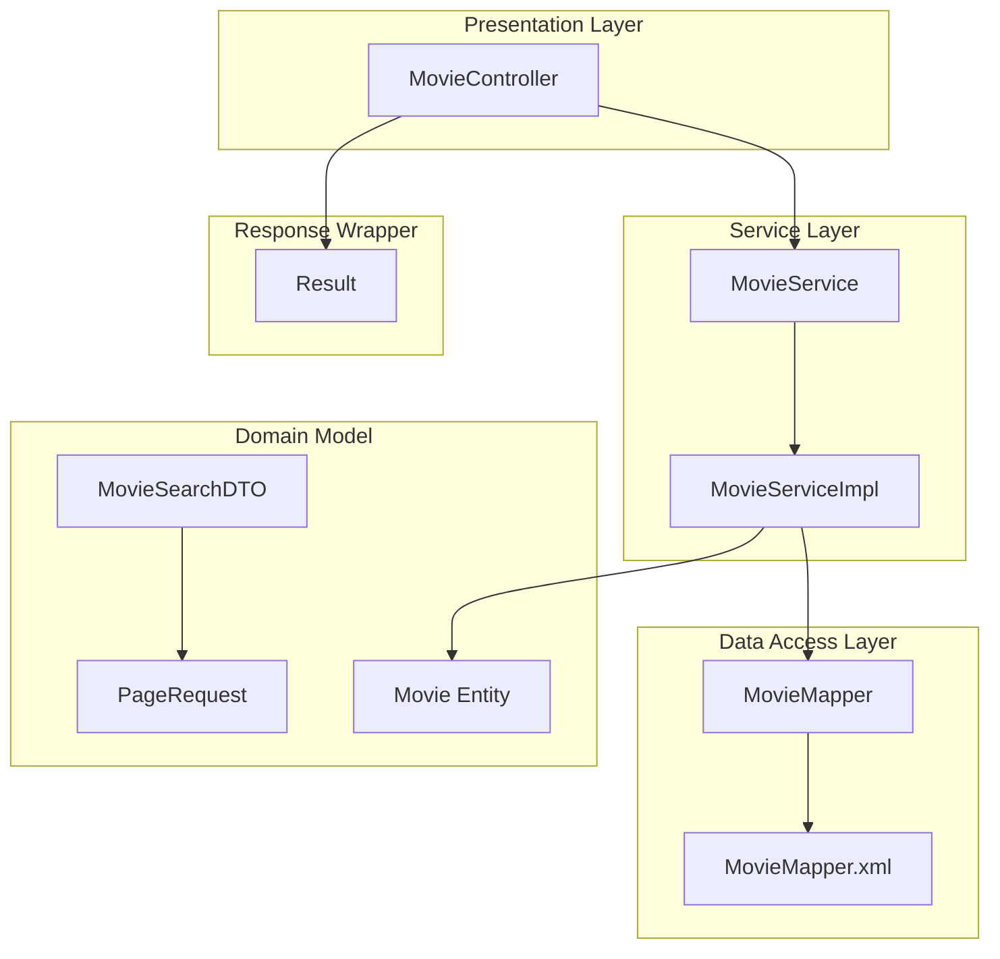
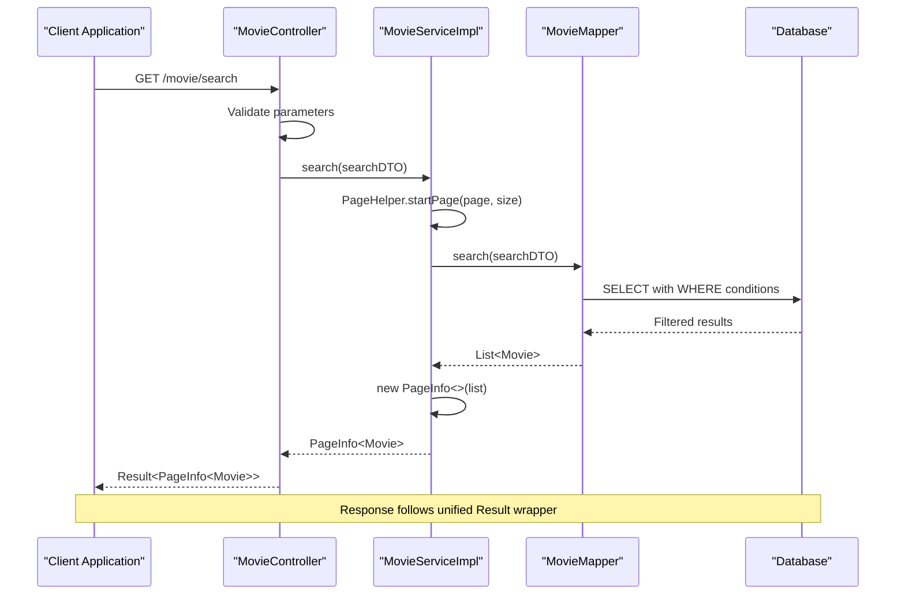
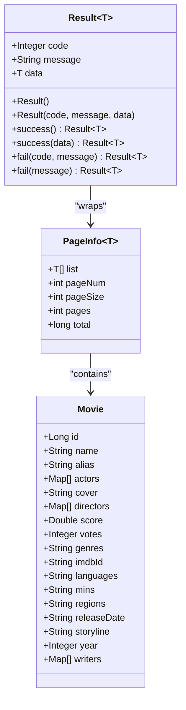
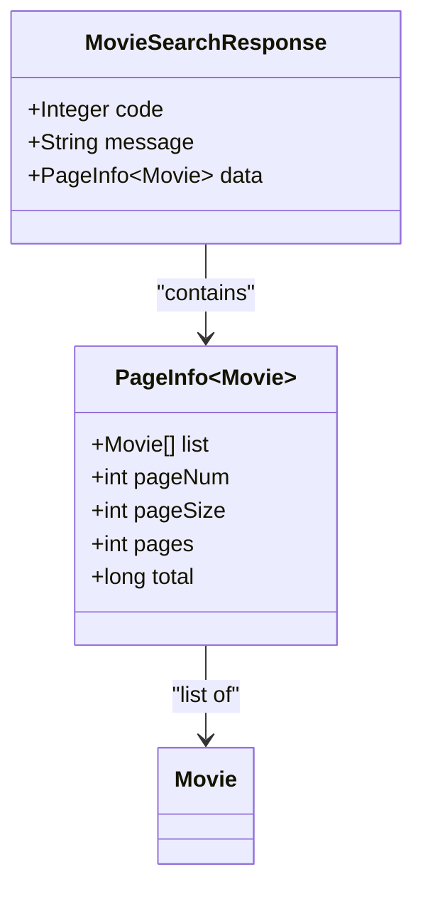
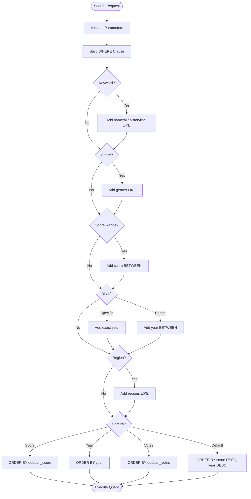
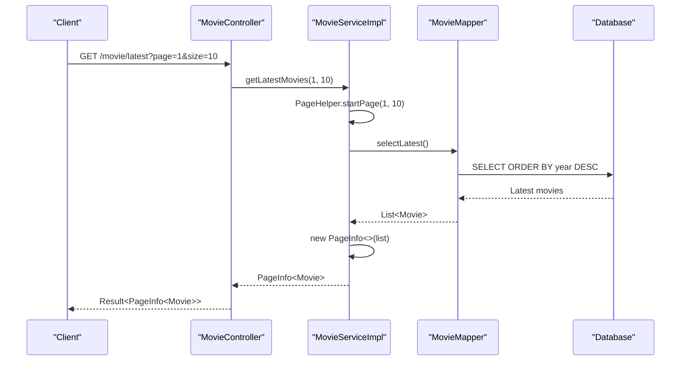
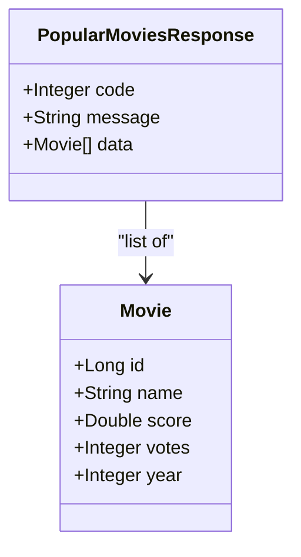
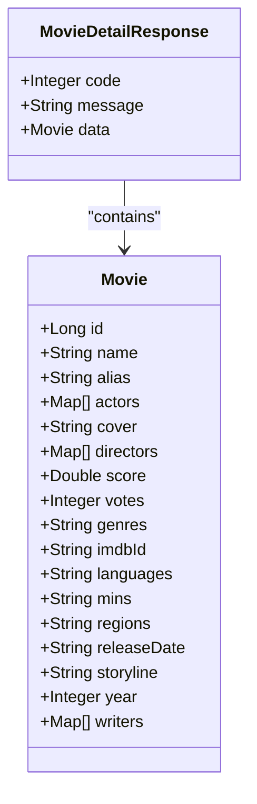
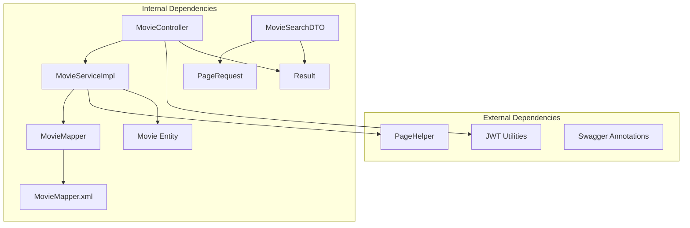
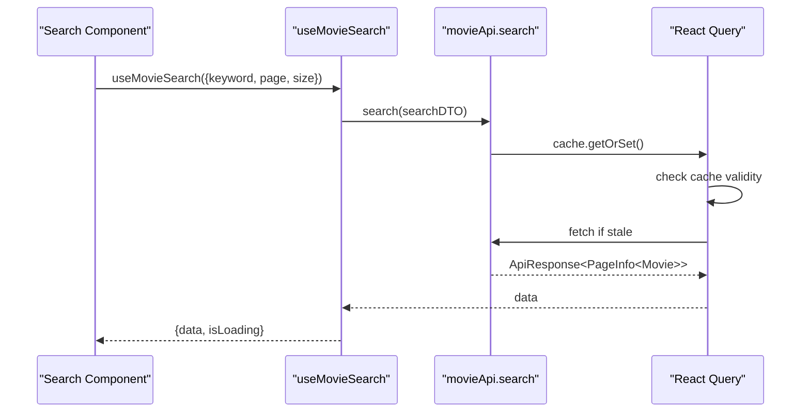

# Movie Catalog API

<cite>
**Referenced Files in This Document**
- [MovieController.java](file://backend/src/main/java/com/movie/backend/controller/MovieController.java)
- [MovieService.java](file://backend/src/main/java/com/movie/backend/service/MovieService.java)
- [MovieServiceImpl.java](file://backend/src/main/java/com/movie/backend/service/impl/MovieServiceImpl.java)
- [MovieSearchDTO.java](file://backend/src/main/java/com/movie/backend/dto/MovieSearchDTO.java)
- [PageRequest.java](file://backend/src/main/java/com/movie/backend/dto/PageRequest.java)
- [Movie.java](file://backend/src/main/java/com/movie/backend/entity/Movie.java)
- [MovieMapper.xml](file://backend/src/main/resources/mapper/MovieMapper.xml)
- [Result.java](file://backend/src/main/java/com/movie/backend/common/Result.java)
- [movie.ts](file://movie-review-web/src/api/movie.ts)
- [useMovieQueries.ts](file://movie-review-web/src/hooks/useMovieQueries.ts)
- [Search.tsx](file://movie-review-web/src/pages/Search.tsx)
- [Latest.tsx](file://movie-review-web/src/pages/Latest.tsx)
- [MovieControllerIntegrationTest.java](file://backend/src/test/java/com/movie/backend/controller/MovieControllerIntegrationTest.java)
</cite>

## Table of Contents
1. [Introduction](#introduction)
2. [Project Structure](#project-structure)
3. [Core Components](#core-components)
4. [Architecture Overview](#architecture-overview)
5. [Detailed Component Analysis](#detailed-component-analysis)
6. [Dependency Analysis](#dependency-analysis)
7. [Performance Considerations](#performance-considerations)
8. [Troubleshooting Guide](#troubleshooting-guide)
9. [Conclusion](#conclusion)

## Introduction
This document provides comprehensive API documentation for the movie catalog endpoints. It covers the search functionality, latest movies, popular movies, and individual movie details. The documentation includes parameter specifications, response schemas, examples of complex queries, and integration patterns for building movie discovery features.

## Project Structure
The movie catalog API follows a layered architecture with clear separation between presentation, business logic, data access, and DTOs:



**Diagram sources**
- [MovieController.java](file://backend/src/main/java/com/movie/backend/controller/MovieController.java#L30-L33)
- [MovieService.java](file://backend/src/main/java/com/movie/backend/service/MovieService.java#L9-L59)
- [MovieServiceImpl.java](file://backend/src/main/java/com/movie/backend/service/impl/MovieServiceImpl.java#L18-L23)
- [MovieMapper.xml](file://backend/src/main/resources/mapper/MovieMapper.xml#L4-L24)

**Section sources**
- [MovieController.java](file://backend/src/main/java/com/movie/backend/controller/MovieController.java#L26-L33)
- [MovieService.java](file://backend/src/main/java/com/movie/backend/service/MovieService.java#L9-L59)
- [MovieServiceImpl.java](file://backend/src/main/java/com/movie/backend/service/impl/MovieServiceImpl.java#L18-L23)

## Core Components
The movie catalog API consists of several key components:

### Controller Layer
The MovieController exposes REST endpoints for movie operations with comprehensive parameter validation and Swagger documentation.

### Service Layer
The MovieService interface defines the contract for movie operations, while MovieServiceImpl implements the business logic with pagination support.

### Data Access Layer
The MovieMapper interface and MovieMapper.xml provide database access with dynamic SQL queries supporting advanced filtering and sorting.

### Domain Models
Movie entity represents movie data with comprehensive fields, while MovieSearchDTO encapsulates search parameters with validation constraints.

**Section sources**
- [MovieController.java](file://backend/src/main/java/com/movie/backend/controller/MovieController.java#L29-L33)
- [MovieService.java](file://backend/src/main/java/com/movie/backend/service/MovieService.java#L9-L59)
- [MovieServiceImpl.java](file://backend/src/main/java/com/movie/backend/service/impl/MovieServiceImpl.java#L18-L23)
- [Movie.java](file://backend/src/main/java/com/movie/backend/entity/Movie.java#L11-L65)

## Architecture Overview
The API follows a clean architecture pattern with clear separation of concerns:



**Diagram sources**
- [MovieController.java](file://backend/src/main/java/com/movie/backend/controller/MovieController.java#L68-L75)
- [MovieServiceImpl.java](file://backend/src/main/java/com/movie/backend/service/impl/MovieServiceImpl.java#L33-L44)
- [MovieMapper.xml](file://backend/src/main/resources/mapper/MovieMapper.xml#L35-L80)

## Detailed Component Analysis

### Unified Response Structure
All API responses follow a consistent structure using the Result wrapper:



**Diagram sources**
- [Result.java](file://backend/src/main/java/com/movie/backend/common/Result.java#L6-L17)
- [Movie.java](file://backend/src/main/java/com/movie/backend/entity/Movie.java#L11-L65)

**Section sources**
- [Result.java](file://backend/src/main/java/com/movie/backend/common/Result.java#L6-L17)
- [Movie.java](file://backend/src/main/java/com/movie/backend/entity/Movie.java#L11-L65)

### Search Endpoint (/movie/search)
The search endpoint provides comprehensive filtering capabilities with pagination support.

#### Request Parameters
The search endpoint accepts a JSON body with the following structure:

| Parameter | Type | Required | Description | Validation |
|-----------|------|----------|-------------|------------|
| keyword | String | No | Search term for movie name, alias, or storyline | Max 100 characters |
| genre | String | No | Exact genre match | Max 50 characters |
| minScore | Number | No | Minimum rating threshold (0.0-10.0) | Decimal validation |
| maxScore | Number | No | Maximum rating threshold (0.0-10.0) | Decimal validation |
| year | String | No | Specific year (YYYY format) | Pattern validation |
| startYear | Number | No | Start of year range | Integer validation |
| endYear | Number | No | End of year range | Integer validation |
| region | String | No | Production region | Max 50 characters |
| sortBy | String | No | Sort field: score, year, votes | Enum validation |
| sortOrder | String | No | Sort direction: desc, asc | Enum validation, defaults to desc |
| page | Number | No | Page number (default: 1) | Min 1 |
| size | Number | No | Results per page (default: 10) | Min 1, Max 100 |

#### Response Schema
The response follows the unified Result structure containing a PageInfo object:



**Diagram sources**
- [Result.java](file://backend/src/main/java/com/movie/backend/common/Result.java#L6-L17)
- [MovieServiceImpl.java](file://backend/src/main/java/com/movie/backend/service/impl/MovieServiceImpl.java#L33-L44)

#### Advanced Filtering Logic
The search query supports multiple filter combinations with dynamic SQL construction:



**Diagram sources**
- [MovieMapper.xml](file://backend/src/main/resources/mapper/MovieMapper.xml#L35-L80)
- [MovieSearchDTO.java](file://backend/src/main/java/com/movie/backend/dto/MovieSearchDTO.java#L18-L59)

#### Example Search Queries
Complex search scenarios supported by the API:

1. **Multi-criteria search with pagination**:
   ```json
   {
     "keyword": "space",
     "genre": "science fiction",
     "minScore": 8.0,
     "startYear": 2000,
     "endYear": 2023,
     "sortBy": "score",
     "sortOrder": "desc",
     "page": 1,
     "size": 20
   }
   ```

2. **Regional content filtering**:
   ```json
   {
     "region": "United States",
     "maxScore": 9.5,
     "sortBy": "year",
     "sortOrder": "desc",
     "page": 1,
     "size": 15
   }
   ```

3. **Year-range specific search**:
   ```json
   {
     "keyword": "war",
     "startYear": 1900,
     "endYear": 1950,
     "sortBy": "votes",
     "sortOrder": "desc",
     "page": 1,
     "size": 25
   }
   ```

**Section sources**
- [MovieSearchDTO.java](file://backend/src/main/java/com/movie/backend/dto/MovieSearchDTO.java#L18-L59)
- [MovieMapper.xml](file://backend/src/main/resources/mapper/MovieMapper.xml#L35-L80)
- [MovieControllerIntegrationTest.java](file://backend/src/test/java/com/movie/backend/controller/MovieControllerIntegrationTest.java#L117-L135)

### Latest Movies Endpoint (/movie/latest)
Retrieves the newest movies based on release year with pagination support.

#### Request Parameters
| Parameter | Type | Required | Description | Default | Validation |
|-----------|------|----------|-------------|---------|------------|
| page | Number | No | Page number | 1 | Min 1 |
| size | Number | No | Results per page | 10 | Min 1, Max 100 |

#### Response Schema
Returns a paginated list of movies ordered by release year (newest first):



**Diagram sources**
- [MovieController.java](file://backend/src/main/java/com/movie/backend/controller/MovieController.java#L139-L153)
- [MovieServiceImpl.java](file://backend/src/main/java/com/movie/backend/service/impl/MovieServiceImpl.java#L72-L78)
- [MovieMapper.xml](file://backend/src/main/resources/mapper/MovieMapper.xml#L160-L165)

**Section sources**
- [MovieController.java](file://backend/src/main/java/com/movie/backend/controller/MovieController.java#L139-L153)
- [MovieServiceImpl.java](file://backend/src/main/java/com/movie/backend/service/impl/MovieServiceImpl.java#L72-L78)
- [MovieMapper.xml](file://backend/src/main/resources/mapper/MovieMapper.xml#L160-L165)

### Popular Movies Endpoint (/movie/hot)
Returns movies sorted by popularity (number of votes) with configurable limit.

#### Request Parameters
| Parameter | Type | Required | Description | Default | Validation |
|-----------|------|----------|-------------|---------|------------|
| limit | Number | No | Number of movies to return | 10 | Min 1, Max 100 |

#### Response Schema
Returns a simple list of movies ordered by vote count:



**Diagram sources**
- [Result.java](file://backend/src/main/java/com/movie/backend/common/Result.java#L6-L17)
- [MovieMapper.xml](file://backend/src/main/resources/mapper/MovieMapper.xml#L82-L87)

**Section sources**
- [MovieController.java](file://backend/src/main/java/com/movie/backend/controller/MovieController.java#L77-L88)
- [MovieServiceImpl.java](file://backend/src/main/java/com/movie/backend/service/impl/MovieServiceImpl.java#L46-L49)
- [MovieMapper.xml](file://backend/src/main/resources/mapper/MovieMapper.xml#L82-L87)

### Recommended Movies Endpoint (/movie/recommended)
Provides high-rated movies with configurable limit.

#### Request Parameters
| Parameter | Type | Required | Description | Default | Validation |
|-----------|------|----------|-------------|---------|------------|
| limit | Number | No | Number of movies to return | 10 | Min 1, Max 100 |

#### Response Schema
Returns movies ordered by rating and popularity:

**Section sources**
- [MovieController.java](file://backend/src/main/java/com/movie/backend/controller/MovieController.java#L89-L101)
- [MovieServiceImpl.java](file://backend/src/main/java/com/movie/backend/service/impl/MovieServiceImpl.java#L51-L54)
- [MovieMapper.xml](file://backend/src/main/resources/mapper/MovieMapper.xml#L138-L144)

### Individual Movie Details (/movie/detail/{id})
Retrieves comprehensive movie information with view history tracking.

#### Request Parameters
| Parameter | Type | Required | Description | Validation |
|-----------|------|----------|-------------|------------|
| id | Number | Yes | Movie identifier | Min 1 |

#### Response Schema
Returns complete movie details including cast, crew, and metadata:



**Diagram sources**
- [Result.java](file://backend/src/main/java/com/movie/backend/common/Result.java#L6-L17)
- [Movie.java](file://backend/src/main/java/com/movie/backend/entity/Movie.java#L11-L65)

**Section sources**
- [MovieController.java](file://backend/src/main/java/com/movie/backend/controller/MovieController.java#L41-L66)
- [MovieServiceImpl.java](file://backend/src/main/java/com/movie/backend/service/impl/MovieServiceImpl.java#L24-L31)
- [Movie.java](file://backend/src/main/java/com/movie/backend/entity/Movie.java#L11-L65)

## Dependency Analysis
The API demonstrates clean dependency management with clear interfaces and implementations:



**Diagram sources**
- [MovieController.java](file://backend/src/main/java/com/movie/backend/controller/MovieController.java#L3-L9)
- [MovieServiceImpl.java](file://backend/src/main/java/com/movie/backend/service/impl/MovieServiceImpl.java#L3-L10)
- [MovieSearchDTO.java](file://backend/src/main/java/com/movie/backend/dto/MovieSearchDTO.java#L18-L18)

**Section sources**
- [MovieController.java](file://backend/src/main/java/com/movie/backend/controller/MovieController.java#L3-L9)
- [MovieServiceImpl.java](file://backend/src/main/java/com/movie/backend/service/impl/MovieServiceImpl.java#L3-L10)
- [MovieSearchDTO.java](file://backend/src/main/java/com/movie/backend/dto/MovieSearchDTO.java#L18-L18)

## Performance Considerations
The API implements several performance optimizations:

### Pagination Strategy
- **PageHelper Integration**: Efficient pagination with configurable page sizes (1-100)
- **Lazy Loading**: Results loaded only when requested
- **Index Optimization**: Database queries optimized with appropriate indexes

### Caching Opportunities
- **View History Tracking**: Automatic caching of user browsing patterns
- **Popular Content**: Pre-computed popularity metrics for hot movies
- **Search Results**: Potential for Redis caching of frequent search queries

### Query Optimization
- **Dynamic SQL**: Only included WHERE clauses for provided filters
- **Selective Columns**: Uses base column lists to minimize data transfer
- **Efficient Sorting**: Database-level sorting with appropriate indexes

## Troubleshooting Guide

### Common Error Scenarios
The API provides comprehensive error handling with specific validation messages:

#### Parameter Validation Errors
- **Invalid Page Numbers**: Returns 400 with "页码必须大于0" (Page must be greater than 0)
- **Excessive Page Sizes**: Returns 400 with "每页数量不能超过100" (Page size cannot exceed 100)
- **Invalid Movie IDs**: Returns 400 with "电影ID必须大于0" (Movie ID must be greater than 0)

#### Search Validation Errors
- **Keyword Too Long**: Returns 400 with "关键词长度不能超过100" (Keyword length cannot exceed 100)
- **Score Range Violations**: Returns 400 with score validation messages
- **Invalid Year Format**: Returns 400 with "年份格式不正确，应为4位数字" (Year format invalid)

#### Business Logic Errors
- **Movie Not Found**: Returns 404 with "电影不存在" (Movie not found)
- **Empty Search Results**: Returns 200 with empty list (no error)

### Frontend Integration Patterns
The frontend demonstrates robust integration patterns:

#### React Query Implementation


**Diagram sources**
- [useMovieQueries.ts](file://movie-review-web/src/hooks/useMovieQueries.ts#L35-L42)
- [movie.ts](file://movie-review-web/src/api/movie.ts#L34-L36)

#### Error Handling Examples
- **Loading States**: Graceful handling during API requests
- **Empty Results**: User-friendly empty state messaging
- **Network Failures**: Proper error boundary handling

**Section sources**
- [MovieControllerIntegrationTest.java](file://backend/src/test/java/com/movie/backend/controller/MovieControllerIntegrationTest.java#L137-L221)
- [useMovieQueries.ts](file://movie-review-web/src/hooks/useMovieQueries.ts#L35-L42)
- [Search.tsx](file://movie-review-web/src/pages/Search.tsx#L38-L64)

## Conclusion
The movie catalog API provides a comprehensive, well-structured solution for movie discovery with robust search capabilities, efficient pagination, and consistent response formatting. The implementation demonstrates clean architecture principles with clear separation of concerns, comprehensive validation, and thoughtful error handling. The frontend integration patterns show best practices for React Query usage, caching strategies, and user experience optimization.

Key strengths of the implementation include:
- **Flexible Search**: Multi-criteria filtering with dynamic SQL
- **Performance**: Efficient pagination and query optimization
- **Developer Experience**: Comprehensive Swagger documentation and validation
- **User Experience**: Responsive frontend with proper error handling
- **Maintainability**: Clean architecture with clear interfaces

The API is production-ready and provides a solid foundation for building movie discovery features with scalable search and filtering capabilities.