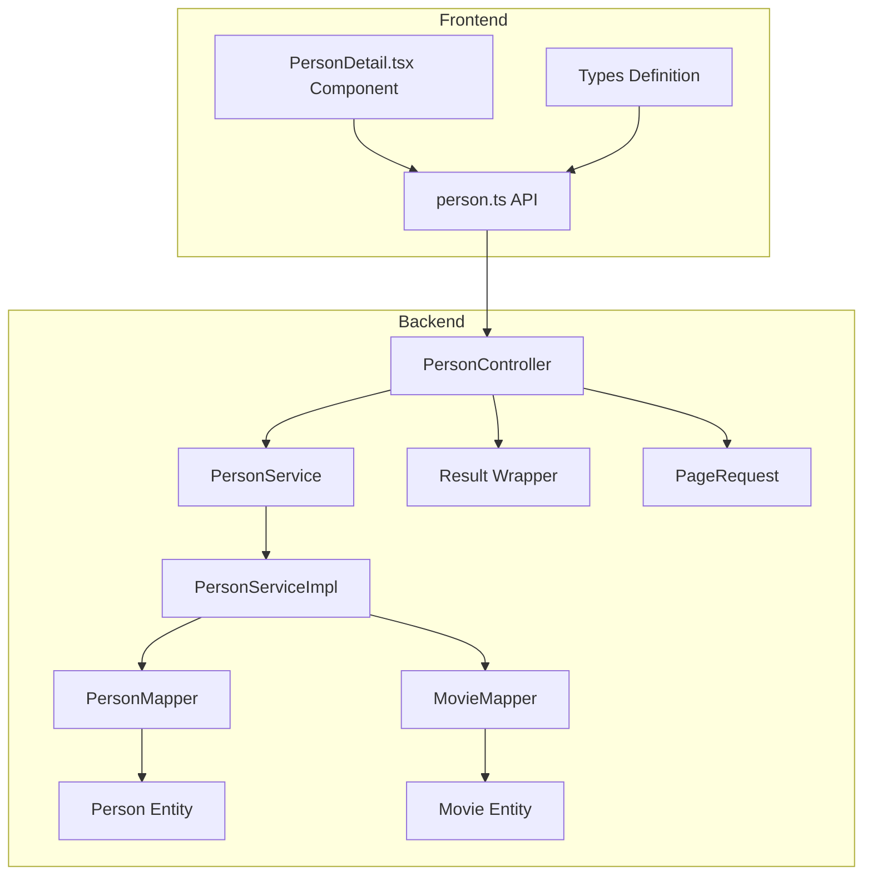
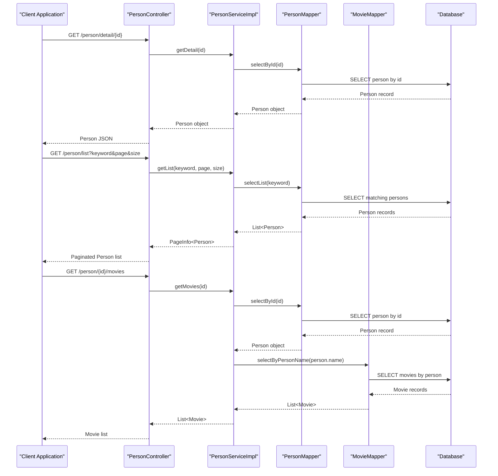

# Person Lookup API

<cite>
**Referenced Files in This Document**
- [PersonController.java](file://backend/src/main/java/com/movie/backend/controller/PersonController.java)
- [PersonService.java](file://backend/src/main/java/com/movie/backend/service/PersonService.java)
- [PersonServiceImpl.java](file://backend/src/main/java/com/movie/backend/service/impl/PersonServiceImpl.java)
- [PersonMapper.java](file://backend/src/main/java/com/movie/backend/mapper/PersonMapper.java)
- [PersonMapper.xml](file://backend/src/main/resources/mapper/PersonMapper.xml)
- [MovieMapper.java](file://backend/src/main/java/com/movie/backend/mapper/MovieMapper.java)
- [MovieMapper.xml](file://backend/src/main/resources/mapper/MovieMapper.xml)
- [Person.java](file://backend/src/main/java/com/movie/backend/entity/Person.java)
- [Movie.java](file://backend/src/main/java/com/movie/backend/entity/Movie.java)
- [Result.java](file://backend/src/main/java/com/movie/backend/common/Result.java)
- [PageRequest.java](file://backend/src/main/java/com/movie/backend/dto/PageRequest.java)
- [person.ts](file://movie-review-web/src/api/person.ts)
- [PersonDetail.tsx](file://movie-review-web/src/pages/PersonDetail.tsx)
- [index.ts](file://movie-review-web/src/types/index.ts)
- [SwaggerConfig.java](file://backend/src/main/java/com/movie/backend/config/SwaggerConfig.java)
</cite>

## Table of Contents
1. [Introduction](#introduction)
2. [Project Structure](#project-structure)
3. [Core Components](#core-components)
4. [Architecture Overview](#architecture-overview)
5. [Detailed Component Analysis](#detailed-component-analysis)
6. [API Reference](#api-reference)
7. [Response Schemas](#response-schemas)
8. [Usage Examples](#usage-examples)
9. [Performance Considerations](#performance-considerations)
10. [Troubleshooting Guide](#troubleshooting-guide)
11. [Conclusion](#conclusion)

## Introduction
This document provides comprehensive API documentation for the Person Lookup API, covering endpoints for searching actors, directors, and crew members, retrieving detailed person information, and exploring filmography data. The API follows REST conventions and returns standardized JSON responses with pagination support for search results.

## Project Structure
The Person Lookup API is implemented using a Spring Boot backend with MyBatis for database operations and a React frontend for consumption.



**Diagram sources**
- [PersonController.java](file://backend/src/main/java/com/movie/backend/controller/PersonController.java#L16-L51)
- [PersonServiceImpl.java](file://backend/src/main/java/com/movie/backend/service/impl/PersonServiceImpl.java#L16-L45)
- [PersonMapper.java](file://backend/src/main/java/com/movie/backend/mapper/PersonMapper.java#L9-L20)
- [MovieMapper.java](file://backend/src/main/java/com/movie/backend/mapper/MovieMapper.java#L10-L91)

**Section sources**
- [PersonController.java](file://backend/src/main/java/com/movie/backend/controller/PersonController.java#L1-L52)
- [PersonServiceImpl.java](file://backend/src/main/java/com/movie/backend/service/impl/PersonServiceImpl.java#L1-L46)

## Core Components
The Person Lookup API consists of several key components working together to provide person search, detail retrieval, and filmography exploration capabilities.

### Controller Layer
The PersonController handles HTTP requests and responses for person-related operations, implementing three primary endpoints:
- GET `/person/detail/{id}` - Retrieve detailed person information
- GET `/person/list` - Search and paginate person listings
- GET `/person/{id}/movies` - Retrieve all movies associated with a person

### Service Layer
The PersonService interface defines the business logic contracts, implemented by PersonServiceImpl which coordinates between mappers and handles data transformations.

### Data Access Layer
PersonMapper and MovieMapper provide database operations using MyBatis, supporting person search with name-based filtering and movie retrieval by person associations.

### Entity Models
Person and Movie entities define the data structures returned by the API, with proper serialization handling for image URLs and JSON arrays.

**Section sources**
- [PersonController.java](file://backend/src/main/java/com/movie/backend/controller/PersonController.java#L16-L51)
- [PersonService.java](file://backend/src/main/java/com/movie/backend/service/PersonService.java#L6-L29)
- [PersonServiceImpl.java](file://backend/src/main/java/com/movie/backend/service/impl/PersonServiceImpl.java#L16-L45)

## Architecture Overview
The Person Lookup API follows a layered architecture pattern with clear separation of concerns between presentation, business logic, and data access layers.



**Diagram sources**
- [PersonController.java](file://backend/src/main/java/com/movie/backend/controller/PersonController.java#L24-L50)
- [PersonServiceImpl.java](file://backend/src/main/java/com/movie/backend/service/impl/PersonServiceImpl.java#L25-L44)
- [PersonMapper.xml](file://backend/src/main/resources/mapper/PersonMapper.xml#L48-L59)
- [MovieMapper.xml](file://backend/src/main/resources/mapper/MovieMapper.xml#L167-L173)

## Detailed Component Analysis

### PersonController Implementation
The PersonController provides three main endpoints with proper Swagger documentation and error handling:

#### Detail Endpoint (`/person/detail/{id}`)
- Accepts a Long ID parameter
- Returns 404 if person not found
- Uses standardized Result wrapper for consistent responses

#### List Endpoint (`/person/list`)
- Supports keyword-based fuzzy search across Chinese and English names
- Implements pagination with configurable page size (default 10, max 100)
- Returns paginated results using PageInfo wrapper

#### Movies Endpoint (`/person/{id}/movies`)
- Retrieves all movies where person appears as actor or director
- Sorts results by release year (newest first)
- Handles missing person gracefully by returning empty list

**Section sources**
- [PersonController.java](file://backend/src/main/java/com/movie/backend/controller/PersonController.java#L24-L50)

### PersonServiceImpl Business Logic
The service implementation coordinates between mappers and applies business rules:

#### Search Implementation
- Uses PageHelper for efficient pagination
- Applies LIKE operators for both Chinese and English name fields
- Returns complete PageInfo with metadata for frontend consumption

#### Filmography Retrieval
- First validates person existence
- Queries movies using person's name across actors and directors fields
- Returns ordered results by year for chronological presentation

**Section sources**
- [PersonServiceImpl.java](file://backend/src/main/java/com/movie/backend/service/impl/PersonServiceImpl.java#L30-L44)

### Database Mapping Strategy
MyBatis mappers handle database operations with proper result mapping:

#### PersonMapper XML
- Defines comprehensive result mapping for Person entity
- Supports flexible WHERE clauses with optional keyword filtering
- Handles dynamic SQL generation for search conditions

#### MovieMapper XML  
- Implements person-name-based movie search across actors and directors
- Provides ordered results by release year for chronological display
- Supports JSON type handlers for complex array fields

**Section sources**
- [PersonMapper.xml](file://backend/src/main/resources/mapper/PersonMapper.xml#L48-L59)
- [MovieMapper.xml](file://backend/src/main/resources/mapper/MovieMapper.xml#L167-L173)

## API Reference

### Base URL
`/person`

### Authentication
No authentication required for person lookup endpoints.

### Response Format
All responses follow the standardized Result wrapper structure:
```json
{
  "code": 200,
  "message": "Success",
  "data": {}
}
```

### Error Responses
- 404 Not Found: Person does not exist
- 500 Internal Server Error: Unexpected server errors

### Endpoint Definitions

#### GET /person/detail/{id}
**Description**: Retrieve detailed person information including biographical data and professional details.

**Path Parameters**:
- `id` (Long, required): Person identifier

**Response**: Person object wrapped in Result structure

**Example Request**:
```
GET /person/detail/1054521
```

**Example Response**:
```json
{
  "code": 200,
  "message": "Success", 
  "data": {
    "id": 1054521,
    "name": "蒂姆·罗宾斯",
    "nameEn": "Tim Robbins",
    "sex": "男",
    "birth": "1958-10-16",
    "birthplace": "美国,加利福ania,西柯芬",
    "profession": "演员,导演,编剧",
    "biography": "蒂姆·罗宾斯于1958年10月16日生于美国加州...",
    "avatar": "http://localhost:8080/images/person_1054521.jpg"
  }
}
```

#### GET /person/list
**Description**: Search and paginate person listings by name (supports both Chinese and English names).

**Query Parameters**:
- `keyword` (String, optional): Search term for person names
- `page` (Integer, optional): Page number (default: 1, minimum: 1)
- `size` (Integer, optional): Page size (default: 10, minimum: 1, maximum: 100)

**Response**: Paginated list of Person objects wrapped in Result structure

**Example Request**:
```
GET /person/list?keyword=robin&page=1&size=10
```

**Example Response**:
```json
{
  "code": 200,
  "message": "Success",
  "data": {
    "list": [
      {
        "id": 1054521,
        "name": "蒂姆·罗宾斯",
        "nameEn": "Tim Robbins",
        "sex": "男",
        "birth": "1958-10-16",
        "birthplace": "美国,加利福尼亚,西柯芬",
        "profession": "演员,导演,编剧",
        "biography": "蒂姆·罗宾斯于1958年10月16日生于美国加州...",
        "avatar": "http://localhost:8080/images/person_1054521.jpg"
      }
    ],
    "total": 1,
    "pageNum": 1,
    "pageSize": 10,
    "pages": 1,
    "hasNextPage": false
  }
}
```

#### GET /person/{id}/movies
**Description**: Retrieve all movies associated with a person (both as actor and director).

**Path Parameters**:
- `id` (Long, required): Person identifier

**Response**: Array of Movie objects wrapped in Result structure

**Example Request**:
```
GET /person/1054521/movies
```

**Example Response**:
```json
{
  "code": 200,
  "message": "Success",
  "data": [
    {
      "id": 1292052,
      "name": "肖申克的救赎",
      "alias": "The Shawshank Redemption / 月黑高飞(港) / 刺激1995(台)",
      "cover": "http://localhost:8080/images/p480747492.jpg",
      "score": 9.7,
      "votes": 2956885,
      "genres": "犯罪,剧情",
      "mins": "142分钟",
      "releaseDate": "1994-09-10(多伦多电影节)",
      "year": 1994,
      "directors": [{"name": "弗兰克·德拉邦特", "id": "15615"}],
      "actors": [{"name": "蒂姆·罗宾斯", "id": "12345"}],
      "writers": [{"name": "斯蒂芬·金", "id": "12345"}]
    }
  ]
}
```

**Section sources**
- [PersonController.java](file://backend/src/main/java/com/movie/backend/controller/PersonController.java#L24-L50)
- [PageRequest.java](file://backend/src/main/java/com/movie/backend/dto/PageRequest.java#L14-L24)

## Response Schemas

### Person Entity Schema
The Person entity contains comprehensive biographical and professional information:

| Field | Type | Description | Example |
|-------|------|-------------|---------|
| id | Long | Unique person identifier | 1054521 |
| name | String | Chinese name | "蒂姆·罗宾斯" |
| sex | String | Gender | "男" |
| nameEn | String | English name | "Tim Robbins" |
| nameZh | String | Alternative Chinese name | "蒂姆·罗宾斯" |
| birth | String | Birth date | "1958-10-16" |
| birthplace | String | Birth location | "美国,加利福尼亚,西柯芬" |
| profession | String | Professional roles | "演员,导演,编剧" |
| biography | String | Personal biography | "蒂姆·罗宾斯于1958年10月16日生于美国加州..." |
| avatar | String | Avatar image URL | "http://localhost:8080/images/person_1054521.jpg" |

### Movie Entity Schema
The Movie entity contains detailed filmography information:

| Field | Type | Description | Example |
|-------|------|-------------|---------|
| id | Long | Unique movie identifier | 1292052 |
| name | String | Movie title | "肖申克的救赎" |
| alias | String | Alternative titles | "The Shawshank Redemption..." |
| actors | Array | Cast members with roles | `[{"name":"蒂姆·罗宾斯","id":"12345"}]` |
| cover | String | Cover image URL | "http://localhost:8080/images/p480747492.jpg" |
| directors | Array | Director list | `[{"name":"弗兰克·德拉邦特","id":"15615"}]` |
| score | Double | Douban rating (0-10) | 9.7 |
| votes | Integer | Number of ratings | 2956885 |
| genres | String | Comma-separated genres | "犯罪,剧情" |
| imdbId | String | IMDB identifier | "tt0111161" |
| languages | String | Languages spoken | "英语" |
| mins | String | Duration | "142分钟" |
| regions | String | Production regions | "美国" |
| releaseDate | String | Release date information | "1994-09-10(多伦多电影节)" |
| storyline | String | Plot summary | "20世纪40年代末，小有成就的青年银行家安迪..." |
| year | Integer | Release year | 1994 |
| writers | Array | Writer list | `[{"name":"斯蒂芬·金","id":"12345"}]` |

### Pagination Response Schema
The search endpoint returns paginated results with comprehensive metadata:

| Field | Type | Description |
|-------|------|-------------|
| list | Array | Current page results |
| total | Long | Total number of records |
| pageNum | Integer | Current page number |
| pageSize | Integer | Number of items per page |
| pages | Integer | Total number of pages |
| hasNextPage | Boolean | Whether more pages exist |

**Section sources**
- [Person.java](file://backend/src/main/java/com/movie/backend/entity/Person.java#L10-L41)
- [Movie.java](file://backend/src/main/java/com/movie/backend/entity/Movie.java#L13-L65)

## Usage Examples

### Frontend Integration Patterns

#### Person Detail Page Loading
The frontend implements concurrent loading of person details and filmography:

```typescript
const fetchData = async () => {
  setLoading(true);
  setError('');
  
  try {
    const [p, page] = await Promise.all([
      personApi.getDetail(personId),
      personApi.getMovies(personId, 1, 24)
    ]);
    setPerson(p);
    if (page?.list) setMovies(page.list);
  } catch (err) {
    setError(getErrorMessage(err, '获取影人信息失败'));
  } finally {
    setLoading(false);
  }
};
```

#### Person Search Implementation
The search functionality supports real-time filtering with debouncing:

```typescript
const searchPersons = (keyword: string, page: number = 1, size: number = 10) => {
  return api.get<ApiResponse<PageInfo<Person>>, PageInfo<Person>>(
    '/person/list', 
    { params: { keyword, page, size } }
  );
};
```

#### Filmography Exploration
Users can browse a person's complete filmography with pagination:

```typescript
const loadMoreMovies = (id: number, page: number, size: number) => {
  return api.get<ApiResponse<PageInfo<Movie>>, PageInfo<Movie>>(
    `/person/${id}/movies`,
    { params: { page, size } }
  );
};
```

### Common Usage Patterns

#### Basic Person Search
```
GET /person/list?keyword=张译&page=1&size=20
```

#### Advanced Filtering (conceptual)
While the current API doesn't expose additional filters, the underlying database supports:
- Name variations (Chinese/English)
- Professional roles
- Birthplace information
- Biographical keywords

#### Filmography Browsing
```
GET /person/1054521/movies?page=1&size=12
```

**Section sources**
- [PersonDetail.tsx](file://movie-review-web/src/pages/PersonDetail.tsx#L20-L47)
- [person.ts](file://movie-review-web/src/api/person.ts#L4-L15)

## Performance Considerations

### Database Optimization
- Person search uses LIKE operators with wildcards, which can be optimized with proper indexing
- Filmography queries search across actors and directors JSON fields
- Pagination limits prevent excessive data transfer

### Caching Strategy
Consider implementing caching for:
- Popular person details
- Frequently accessed filmography data
- Search result caches with TTL for recent queries

### Frontend Optimization
- Concurrent loading of person details and movies reduces total loading time
- Proper error boundaries prevent UI crashes
- Skeleton loaders improve perceived performance

## Troubleshooting Guide

### Common Issues and Solutions

#### 404 Not Found Errors
**Cause**: Person ID doesn't exist in database
**Solution**: Verify person ID or check database records
**Response**: Standardized error response with 404 status

#### Empty Search Results
**Cause**: No persons match the search criteria
**Solution**: Try broader search terms or different spelling
**Response**: Empty list with valid pagination metadata

#### Database Connection Issues
**Cause**: Database connectivity problems
**Solution**: Check database status and connection parameters
**Response**: 500 Internal Server Error with error message

#### Performance Issues
**Cause**: Large result sets or complex queries
**Solution**: Implement proper indexing and optimize queries
**Response**: Consider adding database indexes on name fields

### Error Handling Implementation
The API implements consistent error handling:
- Validation errors return 400 status with descriptive messages
- Resource not found returns 404 status
- Server errors return 500 status with generic error message
- All responses follow the standardized Result wrapper format

**Section sources**
- [PersonController.java](file://backend/src/main/java/com/movie/backend/controller/PersonController.java#L30-L33)

## Conclusion
The Person Lookup API provides a comprehensive solution for movie application developers to search actors, directors, and crew members, retrieve detailed biographical information, and explore filmography data. The API follows REST conventions, implements proper pagination, and provides consistent response formats suitable for modern web applications. The layered architecture ensures maintainability and scalability while the standardized error handling provides robust operation in production environments.