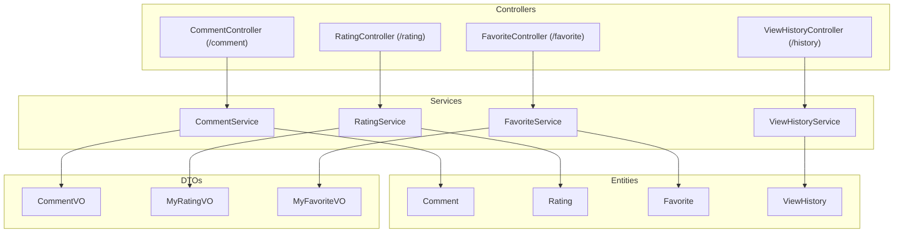
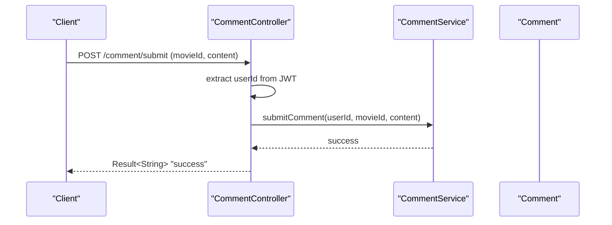
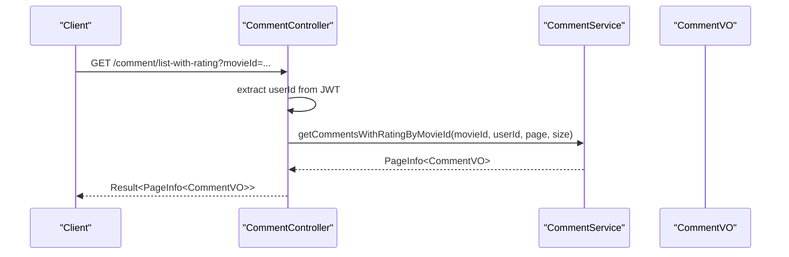
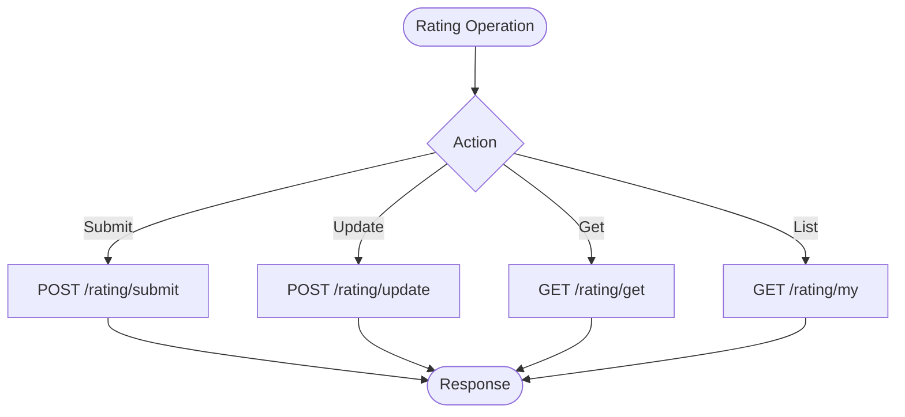
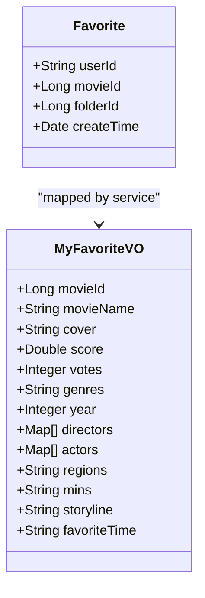
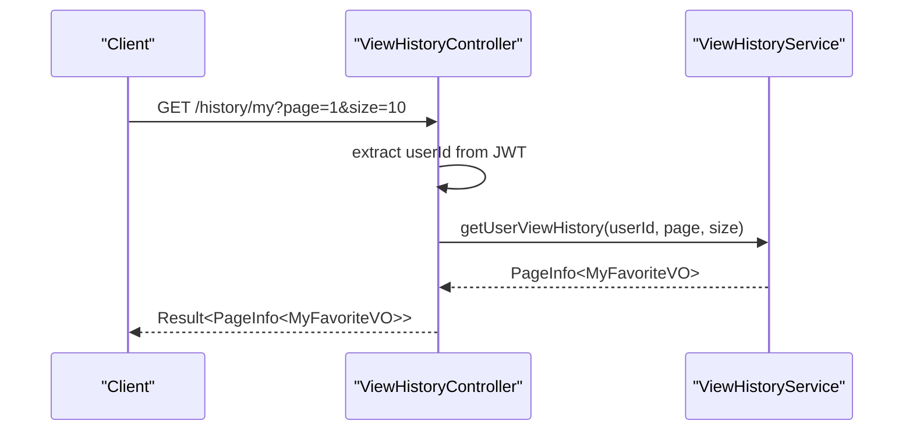
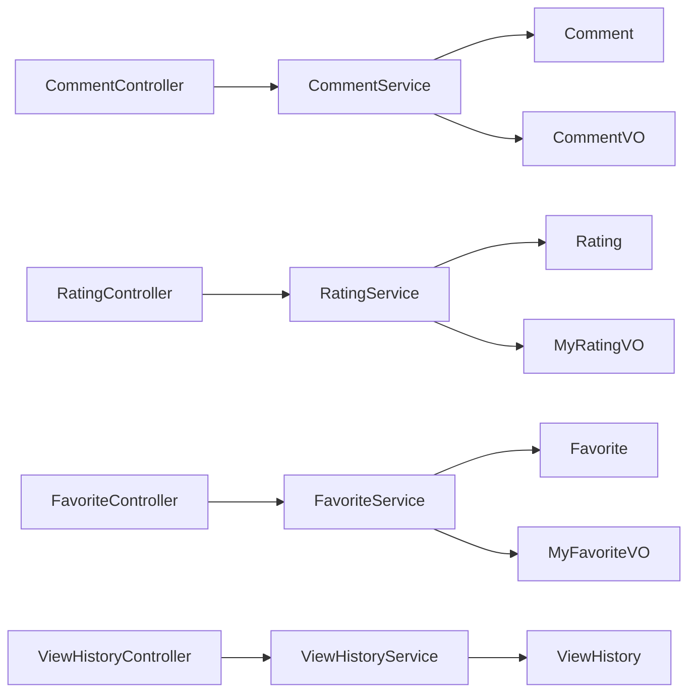

# Review & Rating API

<cite>
**Referenced Files in This Document**
- [CommentController.java](file://backend/src/main/java/com/movie/backend/controller/CommentController.java)
- [RatingController.java](file://backend/src/main/java/com/movie/backend/controller/RatingController.java)
- [FavoriteController.java](file://backend/src/main/java/com/movie/backend/controller/FavoriteController.java)
- [ViewHistoryController.java](file://backend/src/main/java/com/movie/backend/controller/ViewHistoryController.java)
- [CommentService.java](file://backend/src/main/java/com/movie/backend/service/CommentService.java)
- [RatingService.java](file://backend/src/main/java/com/movie/backend/service/RatingService.java)
- [FavoriteService.java](file://backend/src/main/java/com/movie/backend/service/FavoriteService.java)
- [ViewHistoryService.java](file://backend/src/main/java/com/movie/backend/service/ViewHistoryService.java)
- [Comment.java](file://backend/src/main/java/com/movie/backend/entity/Comment.java)
- [Rating.java](file://backend/src/main/java/com/movie/backend/entity/Rating.java)
- [Favorite.java](file://backend/src/main/java/com/movie/backend/entity/Favorite.java)
- [ViewHistory.java](file://backend/src/main/java/com/movie/backend/entity/ViewHistory.java)
- [CommentVO.java](file://backend/src/main/java/com/movie/backend/dto/CommentVO.java)
- [MyFavoriteVO.java](file://backend/src/main/java/com/movie/backend/dto/MyFavoriteVO.java)
- [MyRatingVO.java](file://backend/src/main/java/com/movie/backend/dto/MyRatingVO.java)
</cite>

## Table of Contents
1. [Introduction](#introduction)
2. [Project Structure](#project-structure)
3. [Core Components](#core-components)
4. [Architecture Overview](#architecture-overview)
5. [Detailed Component Analysis](#detailed-component-analysis)
6. [Dependency Analysis](#dependency-analysis)
7. [Performance Considerations](#performance-considerations)
8. [Troubleshooting Guide](#troubleshooting-guide)
9. [Conclusion](#conclusion)
10. [Appendices](#appendices)

## Introduction
This document provides comprehensive API documentation for review and rating endpoints, including comment management, rating management, favorite collection management, and view history tracking. It covers endpoint definitions, request/response schemas, pagination behavior, and practical usage patterns for social interactions such as posting reviews, rating movies, managing favorites, and tracking viewing history.

## Project Structure
The relevant APIs are implemented as Spring REST controllers with supporting services, entities, and DTOs:
- Controllers expose HTTP endpoints under base paths /comment, /rating, /favorite, and /history
- Services encapsulate business logic for each domain
- Entities represent persisted data models
- DTOs shape response payloads for richer client experiences

**Diagram sources**
- [CommentController.java](file://backend/src/main/java/com/movie/backend/controller/CommentController.java#L17-L113)
- [RatingController.java](file://backend/src/main/java/com/movie/backend/controller/RatingController.java#L16-L82)
- [FavoriteController.java](file://backend/src/main/java/com/movie/backend/controller/FavoriteController.java#L19-L109)
- [ViewHistoryController.java](file://backend/src/main/java/com/movie/backend/controller/ViewHistoryController.java#L17-L70)
- [CommentService.java](file://backend/src/main/java/com/movie/backend/service/CommentService.java#L7-L53)
- [RatingService.java](file://backend/src/main/java/com/movie/backend/service/RatingService.java#L8-L43)
- [FavoriteService.java](file://backend/src/main/java/com/movie/backend/service/FavoriteService.java#L7-L35)
- [ViewHistoryService.java](file://backend/src/main/java/com/movie/backend/service/ViewHistoryService.java#L8-L38)
- [Comment.java](file://backend/src/main/java/com/movie/backend/entity/Comment.java#L7-L27)
- [Rating.java](file://backend/src/main/java/com/movie/backend/entity/Rating.java#L6-L23)
- [Favorite.java](file://backend/src/main/java/com/movie/backend/entity/Favorite.java#L7-L21)
- [ViewHistory.java](file://backend/src/main/java/com/movie/backend/entity/ViewHistory.java#L7-L21)
- [CommentVO.java](file://backend/src/main/java/com/movie/backend/dto/CommentVO.java#L10-L30)
- [MyRatingVO.java](file://backend/src/main/java/com/movie/backend/dto/MyRatingVO.java#L8-L33)
- [MyFavoriteVO.java](file://backend/src/main/java/com/movie/backend/dto/MyFavoriteVO.java#L11-L54)

**Section sources**
- [CommentController.java](file://backend/src/main/java/com/movie/backend/controller/CommentController.java#L17-L113)
- [RatingController.java](file://backend/src/main/java/com/movie/backend/controller/RatingController.java#L16-L82)
- [FavoriteController.java](file://backend/src/main/java/com/movie/backend/controller/FavoriteController.java#L19-L109)
- [ViewHistoryController.java](file://backend/src/main/java/com/movie/backend/controller/ViewHistoryController.java#L17-L70)

## Core Components
This section summarizes the primary endpoints for reviews/comments, ratings, favorites, and view history, along with their typical request/response patterns.

- Reviews/Comments
  - POST /comment/submit: Submit a review for a movie
  - GET /comment/list: Paginate movie reviews (basic)
  - GET /comment/list-with-rating: Paginate reviews with user info, rating, and like status
  - GET /comment/get: Retrieve your review for a movie
  - POST /comment/update: Update review content and rating
  - POST /comment/update-content: Update only review content
  - POST /comment/like: Toggle like on a review
  - GET /comment/my: Paginate your reviews

- Ratings
  - POST /rating/submit: Submit a rating for a movie
  - POST /rating/update: Update an existing rating
  - GET /rating/get: Retrieve your rating for a movie
  - GET /rating/my: Paginate your ratings
  - DELETE /rating/clear: Clear all your ratings
  - DELETE /rating/batch: Batch delete selected ratings

- Favorites
  - POST /favorite/add: Add a movie to favorites (default or specific folder)
  - DELETE /favorite/remove: Remove a movie from favorites (default or specific folder)
  - GET /favorite/status: Check if a movie is favorited
  - GET /favorite/my: Paginate your favorites
  - GET /favorite/folder/{folderId}: Paginate movies in a specific folder
  - DELETE /favorite/batch: Batch remove favorites
  - DELETE /favorite/clear: Clear all favorites
  - GET /favorite/count: Get total number of favorites

- View History
  - GET /history/my: Paginate your view history
  - DELETE /history/delete: Delete a single history item
  - DELETE /history/batch: Batch delete history items
  - DELETE /history/clear: Clear all history
  - GET /history/count: Get total number of history entries

Pagination defaults:
- Page: 1
- Size: 10

Authentication:
- All endpoints require a valid JWT token (via Authorization header or cookie) to identify the current user.

**Section sources**
- [CommentController.java](file://backend/src/main/java/com/movie/backend/controller/CommentController.java#L25-L112)
- [RatingController.java](file://backend/src/main/java/com/movie/backend/controller/RatingController.java#L24-L80)
- [FavoriteController.java](file://backend/src/main/java/com/movie/backend/controller/FavoriteController.java#L27-L108)
- [ViewHistoryController.java](file://backend/src/main/java/com/movie/backend/controller/ViewHistoryController.java#L25-L68)

## Architecture Overview
The API follows a layered architecture:
- Controllers handle HTTP requests and responses, extracting user identity from JWT
- Services implement business logic and coordinate persistence
- Entities represent database records
- DTOs enrich responses with related data (e.g., user info, movie metadata)

**Diagram sources**
- [CommentController.java](file://backend/src/main/java/com/movie/backend/controller/CommentController.java#L50-L59)
- [CommentService.java](file://backend/src/main/java/com/movie/backend/service/CommentService.java#L21)

**Section sources**
- [CommentController.java](file://backend/src/main/java/com/movie/backend/controller/CommentController.java#L17-L113)
- [CommentService.java](file://backend/src/main/java/com/movie/backend/service/CommentService.java#L7-L53)

## Detailed Component Analysis

### Reviews/Comments API
Endpoints for publishing, retrieving, updating, and interacting with movie reviews.

- POST /comment/submit
  - Purpose: Submit a review for a movie
  - Request: movieId (Long), content (String)
  - Response: Result<String> message
  - Notes: Users can only have one review per movie

- GET /comment/list
  - Purpose: Paginate movie reviews (basic)
  - Request: movieId (Long), page (int, default 1), size (int, default 10)
  - Response: Result<PageInfo<Comment>>

- GET /comment/list-with-rating
  - Purpose: Paginate reviews with user info, rating, and like status
  - Request: movieId (Long), page (int, default 1), size (int, default 10)
  - Response: Result<PageInfo<CommentVO>>
  - Notes: Includes isLiked flag for the current user

- GET /comment/get
  - Purpose: Retrieve your review for a movie
  - Request: movieId (Long)
  - Response: Result<Comment>

- POST /comment/update
  - Purpose: Update review content and rating
  - Request: movieId (Long), content (String), rating (Integer, 10-50)
  - Response: Result<String> message

- POST /comment/update-content
  - Purpose: Update only review content
  - Request: movieId (Long), content (String)
  - Response: Result<String> message

- POST /comment/like
  - Purpose: Toggle like/unlike a review
  - Request: commentId (Long)
  - Response: Result<Boolean> current like status

- GET /comment/my
  - Purpose: Paginate your reviews
  - Request: page (int, default 1), size (int, default 10)
  - Response: Result<PageInfo<Comment>>

Data Models and Schemas
- Comment
  - Fields: id, userId, movieId, content, votes, commentTime
- CommentVO (enriched)
  - Fields: id, userId, movieId, content, votes, commentTime, userNickname, userId, userAvatar, rating, isLiked

Example Workflows
- Posting a review
  - Call POST /comment/submit with movieId and content
  - On success, optionally fetch with GET /comment/get to confirm
- Updating a review
  - Call POST /comment/update or POST /comment/update-content depending on whether rating needs changing
- Liking a review
  - Call POST /comment/like with commentId; server returns new like status

**Diagram sources**
- [CommentController.java](file://backend/src/main/java/com/movie/backend/controller/CommentController.java#L34-L48)
- [CommentService.java](file://backend/src/main/java/com/movie/backend/service/CommentService.java#L14-L16)
- [CommentVO.java](file://backend/src/main/java/com/movie/backend/dto/CommentVO.java#L10-L30)

**Section sources**
- [CommentController.java](file://backend/src/main/java/com/movie/backend/controller/CommentController.java#L25-L112)
- [CommentService.java](file://backend/src/main/java/com/movie/backend/service/CommentService.java#L7-L53)
- [Comment.java](file://backend/src/main/java/com/movie/backend/entity/Comment.java#L7-L27)
- [CommentVO.java](file://backend/src/main/java/com/movie/backend/dto/CommentVO.java#L10-L30)

### Ratings API
Endpoints for submitting, updating, retrieving, and managing user ratings.

- POST /rating/submit
  - Purpose: Submit a rating for a movie
  - Request: movieId (Long), rating (Integer, 10-50)
  - Response: Result<String> message

- POST /rating/update
  - Purpose: Update an existing rating
  - Request: movieId (Long), rating (Integer, 10-50)
  - Response: Result<String> message

- GET /rating/get
  - Purpose: Retrieve your rating for a movie
  - Request: movieId (Long)
  - Response: Result<Rating>

- GET /rating/my
  - Purpose: Paginate your ratings
  - Request: page (int, default 1), size (int, default 10)
  - Response: Result<PageInfo<MyRatingVO>>

- DELETE /rating/clear
  - Purpose: Clear all your ratings
  - Response: Result<String> message

- DELETE /rating/batch
  - Purpose: Batch delete selected ratings
  - Request: movieIds (List<Long>)
  - Response: Result<String> message

Data Models and Schemas
- Rating
  - Fields: id (userId_movieId), userId, movieId, rating (10-50), ratingTime
- MyRatingVO
  - Fields: id, movieId, movieName, posterUrl, rating, ratingTime, description

Usage Patterns
- Submitting a rating
  - Call POST /rating/submit with movieId and rating value
- Retrieving your rating
  - Call GET /rating/get with movieId
- Managing ratings
  - Use GET /rating/my to list ratings
  - Use DELETE /rating/batch to remove specific ratings
  - Use DELETE /rating/clear to reset all ratings

**Diagram sources**
- [RatingController.java](file://backend/src/main/java/com/movie/backend/controller/RatingController.java#L24-L80)
- [Rating.java](file://backend/src/main/java/com/movie/backend/entity/Rating.java#L6-L23)
- [MyRatingVO.java](file://backend/src/main/java/com/movie/backend/dto/MyRatingVO.java#L8-L33)

**Section sources**
- [RatingController.java](file://backend/src/main/java/com/movie/backend/controller/RatingController.java#L24-L80)
- [RatingService.java](file://backend/src/main/java/com/movie/backend/service/RatingService.java#L8-L43)
- [Rating.java](file://backend/src/main/java/com/movie/backend/entity/Rating.java#L6-L23)
- [MyRatingVO.java](file://backend/src/main/java/com/movie/backend/dto/MyRatingVO.java#L8-L33)

### Favorites API
Endpoints for managing user movie collections, including folders and batch operations.

- POST /favorite/add
  - Purpose: Add a movie to favorites
  - Request: movieId (Long), folderId (Long, optional)
  - Response: Result<String> message
  - Notes: If folderId is omitted, adds to default folder

- DELETE /favorite/remove
  - Purpose: Remove a movie from favorites
  - Request: movieId (Long), folderId (Long, optional)
  - Response: Result<String> message
  - Notes: If folderId is omitted, removes from all folders

- GET /favorite/status
  - Purpose: Check if a movie is favorited
  - Request: movieId (Long)
  - Response: Result<Boolean>

- GET /favorite/my
  - Purpose: Paginate your favorites
  - Request: page (int, default 1), size (int, default 10)
  - Response: Result<PageInfo<MyFavoriteVO>>

- GET /favorite/folder/{folderId}
  - Purpose: Paginate movies in a specific folder
  - Request: folderId (Long), page (int, default 1), size (int, default 10)
  - Response: Result<PageInfo<MyFavoriteVO>>

- DELETE /favorite/batch
  - Purpose: Batch remove favorites
  - Request: movieIds (List<Long>)
  - Response: Result<String> message

- DELETE /favorite/clear
  - Purpose: Clear all favorites
  - Response: Result<String> message

- GET /favorite/count
  - Purpose: Get total number of favorites
  - Response: Result<Integer>

Data Models and Schemas
- Favorite
  - Fields: userId, movieId, folderId (nullable), createTime
- MyFavoriteVO
  - Fields: movieId, movieName, cover, score, votes, genres, year, directors, actors, regions, mins, storyline, favoriteTime

**Diagram sources**
- [Favorite.java](file://backend/src/main/java/com/movie/backend/entity/Favorite.java#L7-L21)
- [MyFavoriteVO.java](file://backend/src/main/java/com/movie/backend/dto/MyFavoriteVO.java#L11-L54)

**Section sources**
- [FavoriteController.java](file://backend/src/main/java/com/movie/backend/controller/FavoriteController.java#L27-L108)
- [FavoriteService.java](file://backend/src/main/java/com/movie/backend/service/FavoriteService.java#L7-L35)
- [Favorite.java](file://backend/src/main/java/com/movie/backend/entity/Favorite.java#L7-L21)
- [MyFavoriteVO.java](file://backend/src/main/java/com/movie/backend/dto/MyFavoriteVO.java#L11-L54)

### View History API
Endpoints for tracking and managing user browsing history.

- GET /history/my
  - Purpose: Paginate your view history
  - Request: page (int, default 1), size (int, default 10)
  - Response: Result<PageInfo<MyFavoriteVO>>

- DELETE /history/delete
  - Purpose: Delete a single history item
  - Request: historyId (Long)
  - Response: Result<String> message

- DELETE /history/batch
  - Purpose: Batch delete history items
  - Request: historyIds (List<Long>)
  - Response: Result<String> message

- DELETE /history/clear
  - Purpose: Clear all history
  - Response: Result<String> message

- GET /history/count
  - Purpose: Get total number of history entries
  - Response: Result<Integer>

Data Model and Schema
- ViewHistory
  - Fields: id, userId, movieId, viewTime
- MyFavoriteVO (used for paginated history items)
  - Reuses fields from MyFavoriteVO to present movie details alongside history timestamps

**Diagram sources**
- [ViewHistoryController.java](file://backend/src/main/java/com/movie/backend/controller/ViewHistoryController.java#L25-L33)
- [ViewHistoryService.java](file://backend/src/main/java/com/movie/backend/service/ViewHistoryService.java#L14-L17)
- [MyFavoriteVO.java](file://backend/src/main/java/com/movie/backend/dto/MyFavoriteVO.java#L11-L54)

**Section sources**
- [ViewHistoryController.java](file://backend/src/main/java/com/movie/backend/controller/ViewHistoryController.java#L25-L68)
- [ViewHistoryService.java](file://backend/src/main/java/com/movie/backend/service/ViewHistoryService.java#L8-L38)
- [ViewHistory.java](file://backend/src/main/java/com/movie/backend/entity/ViewHistory.java#L7-L21)
- [MyFavoriteVO.java](file://backend/src/main/java/com/movie/backend/dto/MyFavoriteVO.java#L11-L54)

## Dependency Analysis
The controllers depend on services, which in turn operate on entities and DTOs. Pagination is handled via PageInfo, and JWT is used to resolve the current user.

**Diagram sources**
- [CommentController.java](file://backend/src/main/java/com/movie/backend/controller/CommentController.java#L17-L113)
- [RatingController.java](file://backend/src/main/java/com/movie/backend/controller/RatingController.java#L16-L82)
- [FavoriteController.java](file://backend/src/main/java/com/movie/backend/controller/FavoriteController.java#L19-L109)
- [ViewHistoryController.java](file://backend/src/main/java/com/movie/backend/controller/ViewHistoryController.java#L17-L70)
- [CommentService.java](file://backend/src/main/java/com/movie/backend/service/CommentService.java#L7-L53)
- [RatingService.java](file://backend/src/main/java/com/movie/backend/service/RatingService.java#L8-L43)
- [FavoriteService.java](file://backend/src/main/java/com/movie/backend/service/FavoriteService.java#L7-L35)
- [ViewHistoryService.java](file://backend/src/main/java/com/movie/backend/service/ViewHistoryService.java#L8-L38)
- [Comment.java](file://backend/src/main/java/com/movie/backend/entity/Comment.java#L7-L27)
- [Rating.java](file://backend/src/main/java/com/movie/backend/entity/Rating.java#L6-L23)
- [Favorite.java](file://backend/src/main/java/com/movie/backend/entity/Favorite.java#L7-L21)
- [ViewHistory.java](file://backend/src/main/java/com/movie/backend/entity/ViewHistory.java#L7-L21)
- [CommentVO.java](file://backend/src/main/java/com/movie/backend/dto/CommentVO.java#L10-L30)
- [MyRatingVO.java](file://backend/src/main/java/com/movie/backend/dto/MyRatingVO.java#L8-L33)
- [MyFavoriteVO.java](file://backend/src/main/java/com/movie/backend/dto/MyFavoriteVO.java#L11-L54)

**Section sources**
- [CommentController.java](file://backend/src/main/java/com/movie/backend/controller/CommentController.java#L17-L113)
- [RatingController.java](file://backend/src/main/java/com/movie/backend/controller/RatingController.java#L16-L82)
- [FavoriteController.java](file://backend/src/main/java/com/movie/backend/controller/FavoriteController.java#L19-L109)
- [ViewHistoryController.java](file://backend/src/main/java/com/movie/backend/controller/ViewHistoryController.java#L17-L70)

## Performance Considerations
- Pagination: All list endpoints support page and size parameters with defaults to prevent large payloads. Tune size according to client needs.
- Enriched responses: GET /comment/list-with-rating returns additional user and rating data; consider using basic list endpoint when enriched data is not required.
- Batch operations: Use batch endpoints for favorites and ratings to minimize round trips.
- JWT overhead: Authentication is required for most endpoints; ensure efficient token validation and avoid redundant user resolution.

## Troubleshooting Guide
Common issues and resolutions:
- Unauthorized access: Ensure a valid JWT token is included in requests. Controllers extract userId from the token and return errors if missing or invalid.
- Duplicate review submission: Only one review per movie is permitted; use update endpoints instead of re-submitting.
- Rating range: Ratings must be within 10-50; values outside this range will cause validation errors.
- Favorites not persisting: Verify folderId is correct when adding/removing from specific folders; omit folderId to use the default folder.
- History not recorded: View history requires explicit recording via the service method; ensure the appropriate controller action triggers history logging.

**Section sources**
- [CommentController.java](file://backend/src/main/java/com/movie/backend/controller/CommentController.java#L41-L47)
- [RatingController.java](file://backend/src/main/java/com/movie/backend/controller/RatingController.java#L24-L33)
- [FavoriteController.java](file://backend/src/main/java/com/movie/backend/controller/FavoriteController.java#L27-L39)
- [ViewHistoryController.java](file://backend/src/main/java/com/movie/backend/controller/ViewHistoryController.java#L25-L33)

## Conclusion
The review and rating APIs provide a robust foundation for social engagement around movies, including posting and managing reviews, assigning star ratings, organizing favorites, and tracking viewing history. By leveraging pagination, batch operations, and enriched DTOs, clients can build responsive and feature-rich experiences while maintaining efficient server-side operations.

## Appendices

### Endpoint Reference Summary
- Reviews/Comments
  - POST /comment/submit
  - GET /comment/list
  - GET /comment/list-with-rating
  - GET /comment/get
  - POST /comment/update
  - POST /comment/update-content
  - POST /comment/like
  - GET /comment/my

- Ratings
  - POST /rating/submit
  - POST /rating/update
  - GET /rating/get
  - GET /rating/my
  - DELETE /rating/clear
  - DELETE /rating/batch

- Favorites
  - POST /favorite/add
  - DELETE /favorite/remove
  - GET /favorite/status
  - GET /favorite/my
  - GET /favorite/folder/{folderId}
  - DELETE /favorite/batch
  - DELETE /favorite/clear
  - GET /favorite/count

- View History
  - GET /history/my
  - DELETE /history/delete
  - DELETE /history/batch
  - DELETE /history/clear
  - GET /history/count

### Data Model Schemas
- Comment
  - id: Long
  - userId: String
  - movieId: Long
  - content: String
  - votes: Integer
  - commentTime: Date

- Rating
  - id: String (userId_movieId)
  - userId: String
  - movieId: Long
  - rating: Integer (10-50)
  - ratingTime: String

- Favorite
  - userId: String
  - movieId: Long
  - folderId: Long (nullable)
  - createTime: Date

- ViewHistory
  - id: Long
  - userId: String
  - movieId: Long
  - viewTime: Date

- CommentVO
  - Extends Comment
  - userNickname: String
  - userId: String
  - userAvatar: String
  - rating: Integer (nullable)
  - isLiked: Boolean

- MyRatingVO
  - id: String
  - movieId: Long
  - movieName: String
  - posterUrl: String
  - rating: Integer
  - ratingTime: String
  - description: String

- MyFavoriteVO
  - movieId: Long
  - movieName: String
  - cover: String
  - score: Double
  - votes: Integer
  - genres: String
  - year: Integer
  - directors: List<Map<String, Object>>
  - actors: List<Map<String, Object>>
  - regions: String
  - mins: String
  - storyline: String
  - favoriteTime: String