# User Management API

<cite>
**Referenced Files in This Document**
- [UserController.java](file://backend/src/main/java/com/movie/backend/controller/UserController.java)
- [UserService.java](file://backend/src/main/java/com/movie/backend/service/UserService.java)
- [UserServiceImpl.java](file://backend/src/main/java/com/movie/backend/service/impl/UserServiceImpl.java)
- [LoginDTO.java](file://backend/src/main/java/com/movie/backend/dto/LoginDTO.java)
- [RegisterDTO.java](file://backend/src/main/java/com/movie/backend/dto/RegisterDTO.java)
- [UserVO.java](file://backend/src/main/java/com/movie/backend/dto/UserVO.java)
- [PublicUserVO.java](file://backend/src/main/java/com/movie/backend/dto/PublicUserVO.java)
- [User.java](file://backend/src/main/java/com/movie/backend/entity/User.java)
- [Result.java](file://backend/src/main/java/com/movie/backend/common/Result.java)
- [JwtUtil.java](file://backend/src/main/java/com/movie/backend/utils/JwtUtil.java)
- [SecurityConfig.java](file://backend/src/main/java/com/movie/backend/config/SecurityConfig.java)
- [JwtInterceptor.java](file://backend/src/main/java/com/movie/backend/config/JwtInterceptor.java)
- [UserMapper.java](file://backend/src/main/java/com/movie/backend/mapper/UserMapper.java)
- [application-dev.yml](file://backend/src/main/resources/application-dev.yml)
</cite>

## Table of Contents
1. [Introduction](#introduction)
2. [Project Structure](#project-structure)
3. [Core Components](#core-components)
4. [Architecture Overview](#architecture-overview)
5. [Detailed Component Analysis](#detailed-component-analysis)
6. [Dependency Analysis](#dependency-analysis)
7. [Performance Considerations](#performance-considerations)
8. [Troubleshooting Guide](#troubleshooting-guide)
9. [Conclusion](#conclusion)

## Introduction
This document provides comprehensive API documentation for user management endpoints in the movie system backend. It covers authentication endpoints (login, registration, token refresh), profile management endpoints (current user info, public user data, avatar updates, logout, password change), and details the unified response format, JWT-based authentication requirements, parameter descriptions, success/error responses, and practical usage examples.

## Project Structure
The user management APIs are implemented as REST endpoints under the `/user` base path. The controller delegates to a service layer, which interacts with mappers and utilities for persistence and JWT operations. Security is configured to be stateless with JWT interception and blacklist validation.

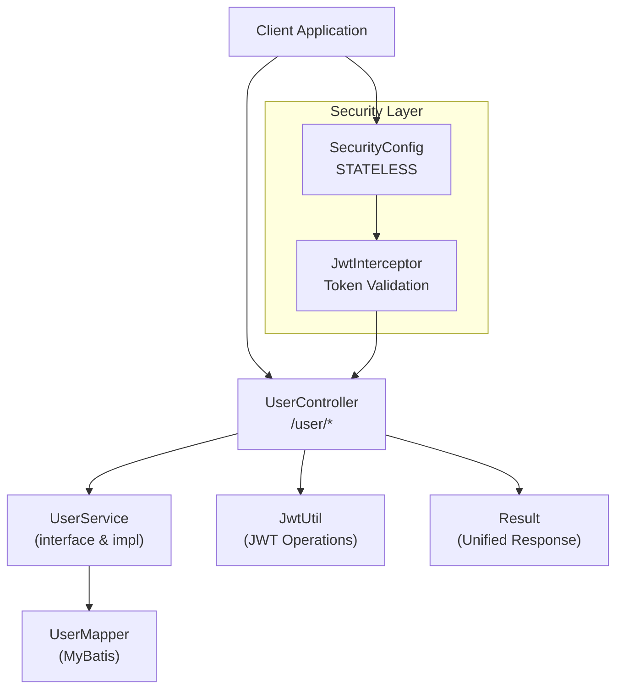

**Diagram sources**
- [UserController.java](file://backend/src/main/java/com/movie/backend/controller/UserController.java#L21-L129)
- [UserService.java](file://backend/src/main/java/com/movie/backend/service/UserService.java#L8-L28)
- [UserServiceImpl.java](file://backend/src/main/java/com/movie/backend/service/impl/UserServiceImpl.java#L19-L175)
- [UserMapper.java](file://backend/src/main/java/com/movie/backend/mapper/UserMapper.java#L9-L40)
- [JwtUtil.java](file://backend/src/main/java/com/movie/backend/utils/JwtUtil.java#L20-L178)
- [Result.java](file://backend/src/main/java/com/movie/backend/common/Result.java#L6-L42)
- [SecurityConfig.java](file://backend/src/main/java/com/movie/backend/config/SecurityConfig.java#L16-L49)
- [JwtInterceptor.java](file://backend/src/main/java/com/movie/backend/config/JwtInterceptor.java#L24-L104)

**Section sources**
- [UserController.java](file://backend/src/main/java/com/movie/backend/controller/UserController.java#L21-L129)
- [SecurityConfig.java](file://backend/src/main/java/com/movie/backend/config/SecurityConfig.java#L16-L49)

## Core Components
- Controller: Exposes REST endpoints for user management under `/user`.
- Service: Implements business logic for authentication, registration, profile operations, and password changes.
- DTOs: Define request/response schemas for login, registration, user info, and public user info.
- Entity: Represents the user model persisted in the database.
- JWT Utilities: Generate, validate, and refresh tokens; extract tokens from requests.
- Security: Stateless configuration with JWT interceptor for token validation and blacklist checks.

**Section sources**
- [UserController.java](file://backend/src/main/java/com/movie/backend/controller/UserController.java#L21-L129)
- [UserService.java](file://backend/src/main/java/com/movie/backend/service/UserService.java#L8-L28)
- [UserServiceImpl.java](file://backend/src/main/java/com/movie/backend/service/impl/UserServiceImpl.java#L19-L175)
- [User.java](file://backend/src/main/java/com/movie/backend/entity/User.java#L9-L45)
- [JwtUtil.java](file://backend/src/main/java/com/movie/backend/utils/JwtUtil.java#L20-L178)

## Architecture Overview
The system uses a stateless JWT-based authentication mechanism. Requests are intercepted to validate tokens and populate the security context. Controllers return unified responses via the `Result` wrapper.

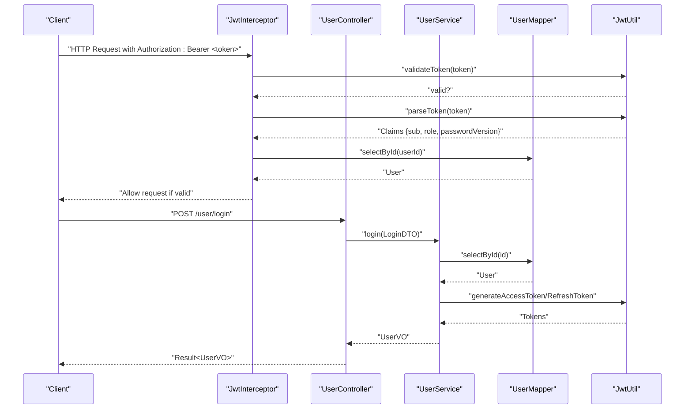

**Diagram sources**
- [JwtInterceptor.java](file://backend/src/main/java/com/movie/backend/config/JwtInterceptor.java#L33-L95)
- [UserController.java](file://backend/src/main/java/com/movie/backend/controller/UserController.java#L32-L36)
- [UserServiceImpl.java](file://backend/src/main/java/com/movie/backend/service/impl/UserServiceImpl.java#L28-L56)
- [JwtUtil.java](file://backend/src/main/java/com/movie/backend/utils/JwtUtil.java#L99-L155)
- [UserMapper.java](file://backend/src/main/java/com/movie/backend/mapper/UserMapper.java#L10-L14)

## Detailed Component Analysis

### Unified Response Format
All endpoints return a unified response structure with status code, message, and optional data payload.

- Fields:
  - code: Numeric status code (200 indicates success)
  - message: Human-readable status message
  - data: Optional business payload

- Success example: code 200 with data payload
- Error example: Non-200 code with error message

**Section sources**
- [Result.java](file://backend/src/main/java/com/movie/backend/common/Result.java#L6-L42)

### Authentication Endpoints

#### POST /user/login
- Purpose: Authenticate user and return access/refresh tokens along with user info.
- Request body: LoginDTO
  - id: Unique user identifier (required)
  - password: User password (required)
- Response: Result<UserVO>
  - UserVO fields include id, nickname, avatar, url, email, role, accessToken, refreshToken, receivedLikes, commentCount
- Authentication requirement: None (login endpoint)
- Success response: code 200 with UserVO payload
- Error responses:
  - 404: User not found
  - 403: Account disabled
  - 401: Invalid credentials

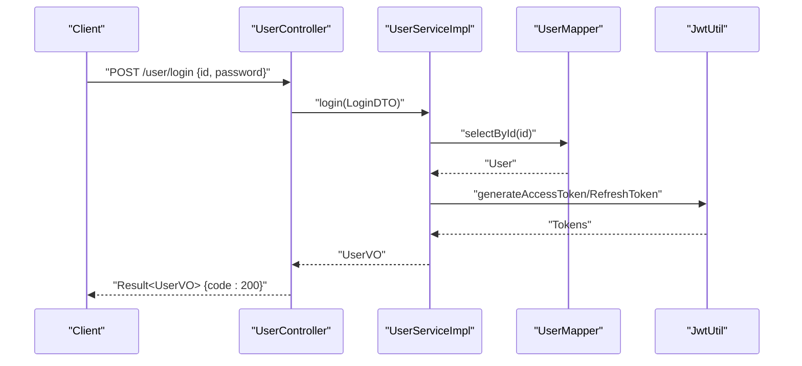

**Diagram sources**
- [UserController.java](file://backend/src/main/java/com/movie/backend/controller/UserController.java#L32-L36)
- [UserServiceImpl.java](file://backend/src/main/java/com/movie/backend/service/impl/UserServiceImpl.java#L28-L56)
- [JwtUtil.java](file://backend/src/main/java/com/movie/backend/utils/JwtUtil.java#L49-L81)

**Section sources**
- [UserController.java](file://backend/src/main/java/com/movie/backend/controller/UserController.java#L32-L36)
- [LoginDTO.java](file://backend/src/main/java/com/movie/backend/dto/LoginDTO.java#L8-L18)
- [UserVO.java](file://backend/src/main/java/com/movie/backend/dto/UserVO.java#L8-L42)
- [UserServiceImpl.java](file://backend/src/main/java/com/movie/backend/service/impl/UserServiceImpl.java#L28-L56)

#### POST /user/register
- Purpose: Register a new user account.
- Request body: RegisterDTO
  - id: Unique user identifier (required, length 4-20)
  - password: User password (required, minimum 6 characters)
  - nickname: User display name (required)
  - email: User email (optional, must be valid)
  - url: Personal/Douban page link (optional)
- Response: Result<String> with success message
- Authentication requirement: None (registration endpoint)
- Success response: code 200 with message "Registration successful"
- Error responses:
  - 500: User ID already exists

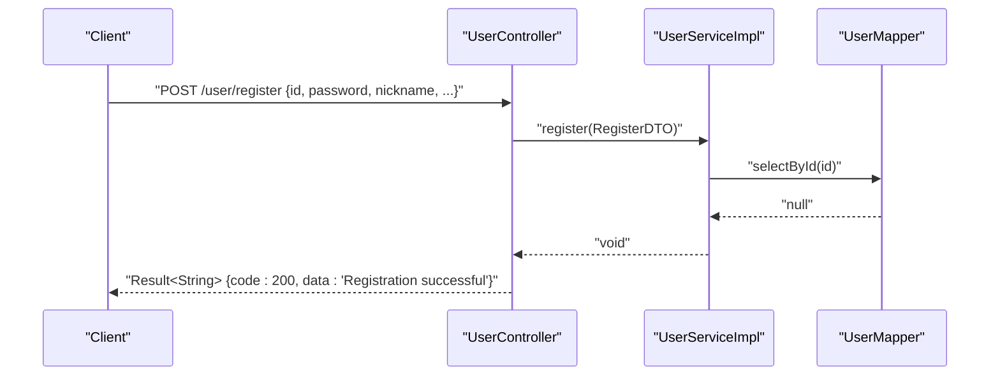

**Diagram sources**
- [UserController.java](file://backend/src/main/java/com/movie/backend/controller/UserController.java#L38-L43)
- [UserServiceImpl.java](file://backend/src/main/java/com/movie/backend/service/impl/UserServiceImpl.java#L58-L76)
- [RegisterDTO.java](file://backend/src/main/java/com/movie/backend/dto/RegisterDTO.java#L10-L33)

**Section sources**
- [UserController.java](file://backend/src/main/java/com/movie/backend/controller/UserController.java#L38-L43)
- [RegisterDTO.java](file://backend/src/main/java/com/movie/backend/dto/RegisterDTO.java#L10-L33)
- [UserServiceImpl.java](file://backend/src/main/java/com/movie/backend/service/impl/UserServiceImpl.java#L58-L76)

#### POST /user/refresh
- Purpose: Exchange a valid refresh token for a new access token.
- Query parameter: refreshToken (required)
- Response: Result<String> containing new access token
- Authentication requirement: None (refresh endpoint)
- Success response: code 200 with new access token
- Error responses:
  - 401: Invalid refresh token type, user not found, account disabled, or password changed requiring re-login

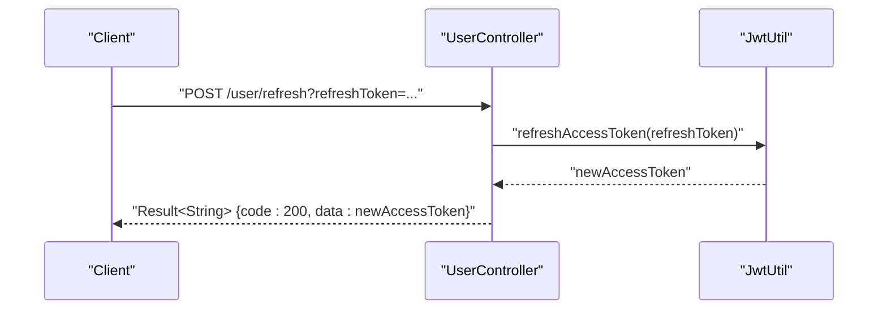

**Diagram sources**
- [UserController.java](file://backend/src/main/java/com/movie/backend/controller/UserController.java#L77-L86)
- [JwtUtil.java](file://backend/src/main/java/com/movie/backend/utils/JwtUtil.java#L123-L155)

**Section sources**
- [UserController.java](file://backend/src/main/java/com/movie/backend/controller/UserController.java#L77-L86)
- [JwtUtil.java](file://backend/src/main/java/com/movie/backend/utils/JwtUtil.java#L123-L155)

### Profile Management Endpoints

#### GET /user/info
- Purpose: Retrieve current user's detailed information (including stats).
- Path: None
- Headers: Authorization: Bearer <access_token>
- Response: Result<UserVO>
- Authentication requirement: JWT required
- Success response: code 200 with UserVO payload
- Error responses:
  - 404: User not found
  - 401: Unauthorized or token invalid

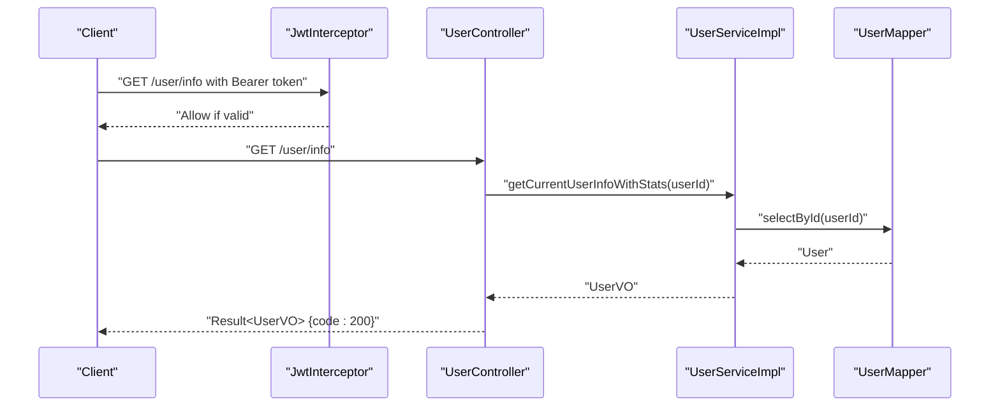

**Diagram sources**
- [UserController.java](file://backend/src/main/java/com/movie/backend/controller/UserController.java#L45-L53)
- [JwtInterceptor.java](file://backend/src/main/java/com/movie/backend/config/JwtInterceptor.java#L33-L95)
- [UserServiceImpl.java](file://backend/src/main/java/com/movie/backend/service/impl/UserServiceImpl.java#L129-L149)

**Section sources**
- [UserController.java](file://backend/src/main/java/com/movie/backend/controller/UserController.java#L45-L53)
- [UserServiceImpl.java](file://backend/src/main/java/com/movie/backend/service/impl/UserServiceImpl.java#L129-L149)
- [JwtInterceptor.java](file://backend/src/main/java/com/movie/backend/config/JwtInterceptor.java#L33-L95)

#### GET /user/public/{userId}
- Purpose: Retrieve public user information (excluding sensitive fields) with statistics.
- Path parameters:
  - userId: Target user ID (required)
- Response: Result<PublicUserVO>
  - Fields: id, nickname, avatar, url, receivedLikes, commentCount
- Authentication requirement: None
- Success response: code 200 with PublicUserVO payload
- Error responses:
  - 404: User not found

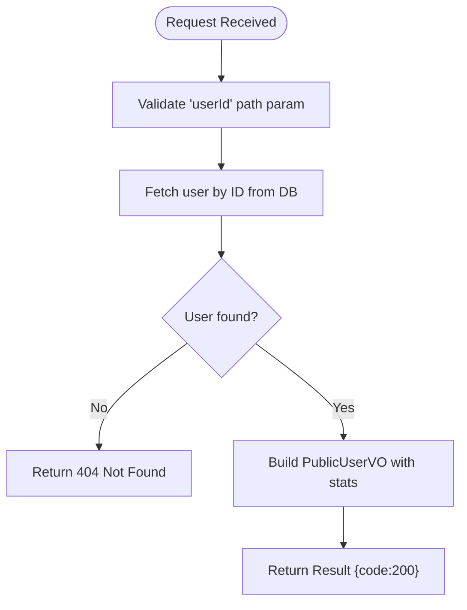

**Diagram sources**
- [UserController.java](file://backend/src/main/java/com/movie/backend/controller/UserController.java#L55-L65)
- [UserServiceImpl.java](file://backend/src/main/java/com/movie/backend/service/impl/UserServiceImpl.java#L104-L127)

**Section sources**
- [UserController.java](file://backend/src/main/java/com/movie/backend/controller/UserController.java#L55-L65)
- [PublicUserVO.java](file://backend/src/main/java/com/movie/backend/dto/PublicUserVO.java#L8-L30)
- [UserServiceImpl.java](file://backend/src/main/java/com/movie/backend/service/impl/UserServiceImpl.java#L104-L127)

#### PUT /user/avatar
- Purpose: Update the current user's avatar URL.
- Path: None
- Headers: Authorization: Bearer <access_token>
- Query parameters:
  - avatarUrl: Avatar image URL (required)
- Response: Result<String> with success message
- Authentication requirement: JWT required
- Success response: code 200 with message "Avatar updated successfully"
- Error responses:
  - 401: Unauthorized or token invalid

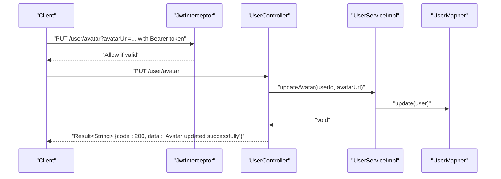

**Diagram sources**
- [UserController.java](file://backend/src/main/java/com/movie/backend/controller/UserController.java#L67-L75)
- [JwtInterceptor.java](file://backend/src/main/java/com/movie/backend/config/JwtInterceptor.java#L33-L95)
- [UserServiceImpl.java](file://backend/src/main/java/com/movie/backend/service/impl/UserServiceImpl.java#L78-L85)

**Section sources**
- [UserController.java](file://backend/src/main/java/com/movie/backend/controller/UserController.java#L67-L75)
- [UserServiceImpl.java](file://backend/src/main/java/com/movie/backend/service/impl/UserServiceImpl.java#L78-L85)

#### POST /user/logout
- Purpose: Logout the current user by blacklisting access and refresh tokens.
- Path: None
- Headers: Authorization: Bearer <access_token>
- Query parameters:
  - refreshToken: Refresh token (optional)
- Response: Result<String> with success message
- Authentication requirement: JWT required
- Success response: code 200 with message "Logout successful"
- Error responses:
  - 500: Logout failure

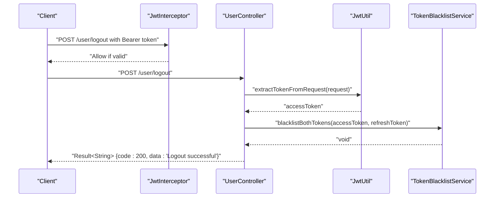

**Diagram sources**
- [UserController.java](file://backend/src/main/java/com/movie/backend/controller/UserController.java#L88-L104)
- [JwtInterceptor.java](file://backend/src/main/java/com/movie/backend/config/JwtInterceptor.java#L33-L95)
- [JwtUtil.java](file://backend/src/main/java/com/movie/backend/utils/JwtUtil.java#L171-L178)

**Section sources**
- [UserController.java](file://backend/src/main/java/com/movie/backend/controller/UserController.java#L88-L104)
- [JwtUtil.java](file://backend/src/main/java/com/movie/backend/utils/JwtUtil.java#L171-L178)

#### POST /user/change-password
- Purpose: Change the current user's password; invalidates all previous tokens.
- Path: None
- Headers: Authorization: Bearer <access_token>
- Query parameters:
  - oldPassword: Current password (required)
  - newPassword: New password (required)
  - refreshToken: Refresh token (optional)
- Response: Result<String> with success message
- Authentication requirement: JWT required
- Success response: code 200 with message "Password changed successfully, please log in again"
- Error responses:
  - 400: Old password incorrect or other validation errors

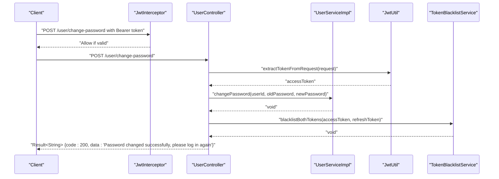

**Diagram sources**
- [UserController.java](file://backend/src/main/java/com/movie/backend/controller/UserController.java#L106-L128)
- [JwtInterceptor.java](file://backend/src/main/java/com/movie/backend/config/JwtInterceptor.java#L33-L95)
- [UserServiceImpl.java](file://backend/src/main/java/com/movie/backend/service/impl/UserServiceImpl.java#L151-L174)
- [JwtUtil.java](file://backend/src/main/java/com/movie/backend/utils/JwtUtil.java#L171-L178)

**Section sources**
- [UserController.java](file://backend/src/main/java/com/movie/backend/controller/UserController.java#L106-L128)
- [UserServiceImpl.java](file://backend/src/main/java/com/movie/backend/service/impl/UserServiceImpl.java#L151-L174)

## Dependency Analysis
The following diagram shows key dependencies among components involved in user management and JWT handling.

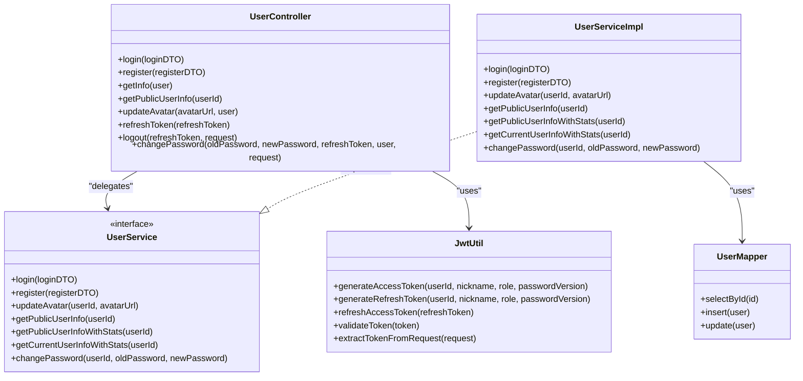

**Diagram sources**
- [UserController.java](file://backend/src/main/java/com/movie/backend/controller/UserController.java#L21-L129)
- [UserService.java](file://backend/src/main/java/com/movie/backend/service/UserService.java#L8-L28)
- [UserServiceImpl.java](file://backend/src/main/java/com/movie/backend/service/impl/UserServiceImpl.java#L19-L175)
- [UserMapper.java](file://backend/src/main/java/com/movie/backend/mapper/UserMapper.java#L9-L40)
- [JwtUtil.java](file://backend/src/main/java/com/movie/backend/utils/JwtUtil.java#L20-L178)

**Section sources**
- [UserController.java](file://backend/src/main/java/com/movie/backend/controller/UserController.java#L21-L129)
- [UserService.java](file://backend/src/main/java/com/movie/backend/service/UserService.java#L8-L28)
- [UserServiceImpl.java](file://backend/src/main/java/com/movie/backend/service/impl/UserServiceImpl.java#L19-L175)
- [UserMapper.java](file://backend/src/main/java/com/movie/backend/mapper/UserMapper.java#L9-L40)
- [JwtUtil.java](file://backend/src/main/java/com/movie/backend/utils/JwtUtil.java#L20-L178)

## Performance Considerations
- Token expiration: Access tokens are short-lived; refresh tokens are long-lived. Adjust expiration settings in the configuration as needed.
- Password versioning: Changing passwords increments the password version, invalidating old tokens and reducing replay risk.
- Stateless design: No server-side session storage improves scalability but requires robust client-side token management.
- Interceptor overhead: JWT validation and blacklist checks occur per request; ensure efficient blacklist storage and lookup.

[No sources needed since this section provides general guidance]

## Troubleshooting Guide
- 401 Unauthorized:
  - Missing or malformed Authorization header
  - Invalid or expired token
  - Token present but blacklisted
- 403 Forbidden:
  - Insufficient permissions (role-based checks)
- 404 Not Found:
  - User does not exist for requested operations
- 500 Internal Server Error:
  - Server-side failures during logout or other operations

Common fixes:
- Ensure Authorization header format: Bearer <access_token>
- Verify token validity and expiration
- Confirm user account status is active
- After password change, clients must re-authenticate and obtain new tokens

**Section sources**
- [JwtInterceptor.java](file://backend/src/main/java/com/movie/backend/config/JwtInterceptor.java#L46-L92)
- [UserController.java](file://backend/src/main/java/com/movie/backend/controller/UserController.java#L88-L104)
- [UserServiceImpl.java](file://backend/src/main/java/com/movie/backend/service/impl/UserServiceImpl.java#L151-L174)

## Conclusion
The user management API provides a secure, stateless authentication model using JWT with clear separation of concerns across controller, service, and persistence layers. The unified response format simplifies client integration, while token refresh and blacklist mechanisms enhance security and usability. Proper client-side token handling and adherence to request/response schemas are essential for reliable operation.