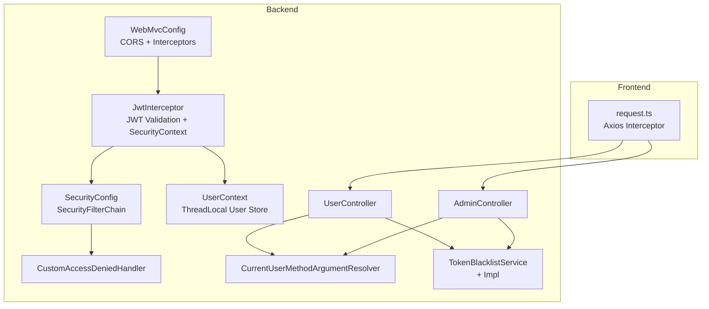
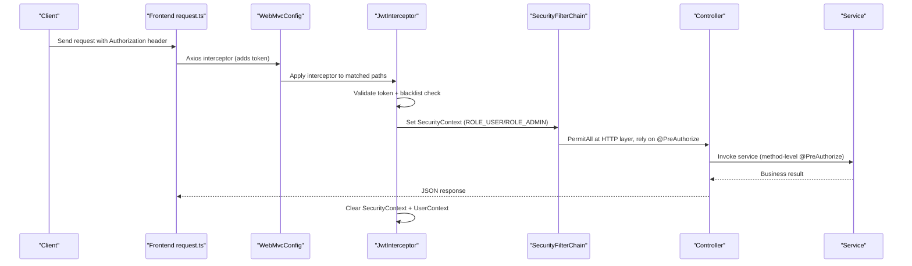
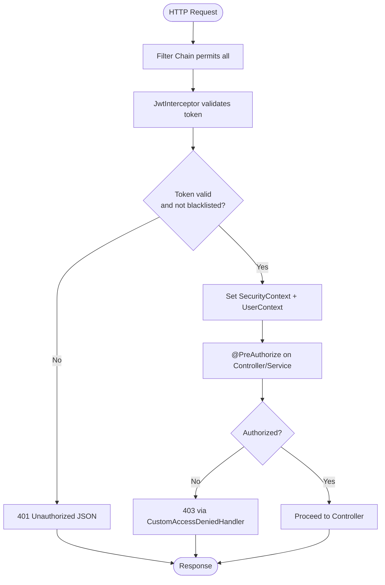
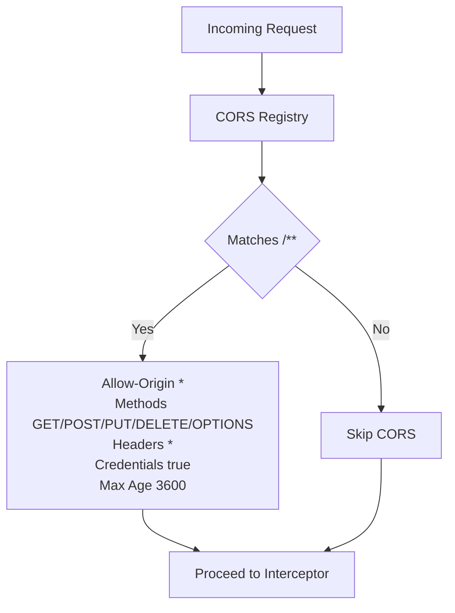
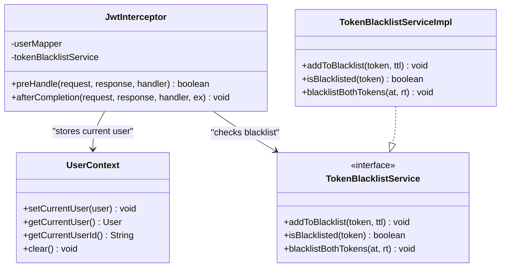
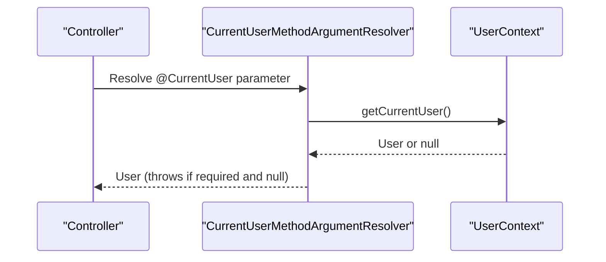
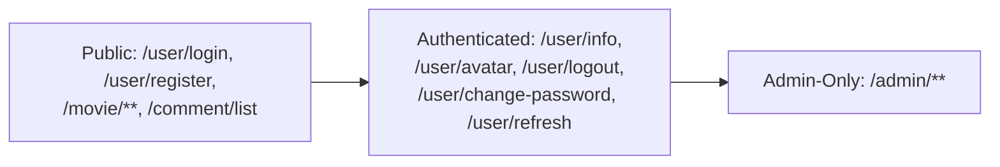
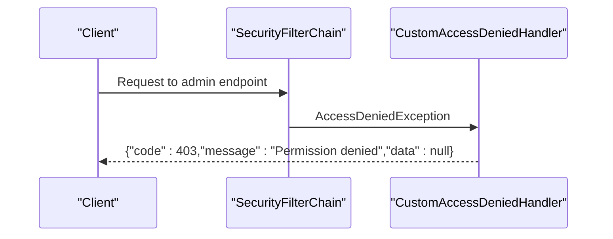
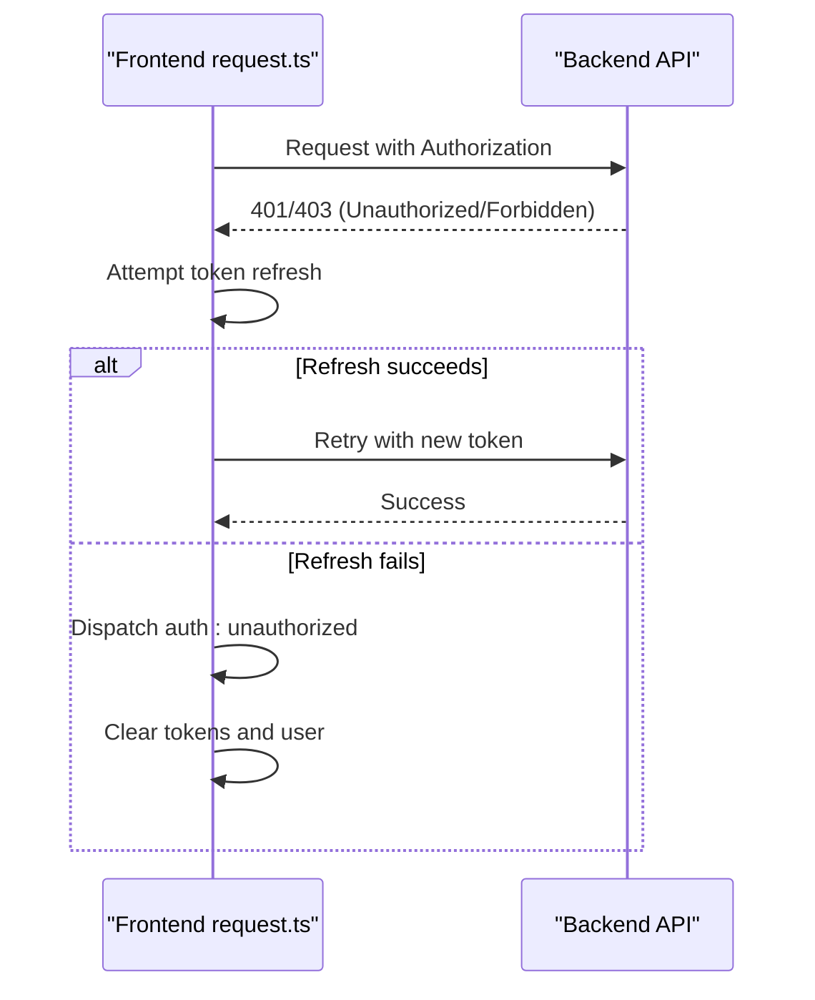
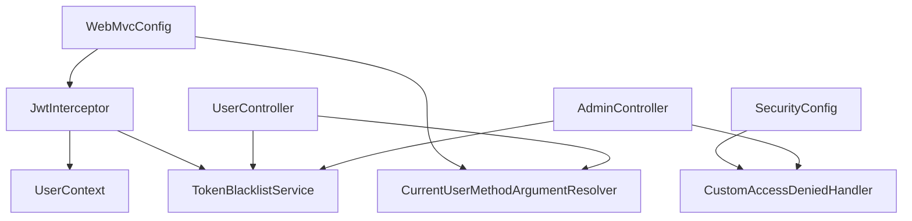

# Access Control & Authorization

<cite>
**Referenced Files in This Document**
- [SecurityConfig.java](file://backend/src/main/java/com/movie/backend/config/SecurityConfig.java)
- [CustomAccessDeniedHandler.java](file://backend/src/main/java/com/movie/backend/config/CustomAccessDeniedHandler.java)
- [JwtInterceptor.java](file://backend/src/main/java/com/movie/backend/config/JwtInterceptor.java)
- [WebMvcConfig.java](file://backend/src/main/java/com/movie/backend/config/WebMvcConfig.java)
- [CurrentUser.java](file://backend/src/main/java/com/movie/backend/annotation/CurrentUser.java)
- [CurrentUserMethodArgumentResolver.java](file://backend/src/main/java/com/movie/backend/config/CurrentUserMethodArgumentResolver.java)
- [UserContext.java](file://backend/src/main/java/com/movie/backend/context/UserContext.java)
- [UserController.java](file://backend/src/main/java/com/movie/backend/controller/UserController.java)
- [AdminController.java](file://backend/src/main/java/com/movie/backend/controller/admin/AdminController.java)
- [TokenBlacklistService.java](file://backend/src/main/java/com/movie/backend/service/TokenBlacklistService.java)
- [TokenBlacklistServiceImpl.java](file://backend/src/main/java/com/movie/backend/service/impl/TokenBlacklistServiceImpl.java)
- [application-dev.yml](file://backend/src/main/resources/application-dev.yml)
- [request.ts](file://movie-review-web/src/api/request.ts)
</cite>

## Table of Contents
1. [Introduction](#introduction)
2. [Project Structure](#project-structure)
3. [Core Components](#core-components)
4. [Architecture Overview](#architecture-overview)
5. [Detailed Component Analysis](#detailed-component-analysis)
6. [Dependency Analysis](#dependency-analysis)
7. [Performance Considerations](#performance-considerations)
8. [Troubleshooting Guide](#troubleshooting-guide)
9. [Conclusion](#conclusion)
10. [Appendices](#appendices)

## Introduction
This document explains the access control and authorization configuration for the Movie System. It covers the Spring Security setup, URL pattern matching, method-level security, role-based access control, the security filter chain, CORS configuration, CSRF protection, access denied handling, and custom error responses. It also provides examples of securing different endpoint categories (public, authenticated, admin-only), along with best practices, common vulnerabilities, and mitigation strategies.

## Project Structure
The access control stack is implemented primarily in the backend module under the config package, with supporting components in annotation, context, controller, service, and resource packages. The frontend client handles token refresh and logout via a shared request interceptor.

**Diagram sources**
- [SecurityConfig.java](file://backend/src/main/java/com/movie/backend/config/SecurityConfig.java#L24-L49)
- [CustomAccessDeniedHandler.java](file://backend/src/main/java/com/movie/backend/config/CustomAccessDeniedHandler.java#L17-L26)
- [WebMvcConfig.java](file://backend/src/main/java/com/movie/backend/config/WebMvcConfig.java#L25-L49)
- [JwtInterceptor.java](file://backend/src/main/java/com/movie/backend/config/JwtInterceptor.java#L24-L104)
- [CurrentUserMethodArgumentResolver.java](file://backend/src/main/java/com/movie/backend/config/CurrentUserMethodArgumentResolver.java#L17-L50)
- [UserContext.java](file://backend/src/main/java/com/movie/backend/context/UserContext.java#L10-L44)
- [UserController.java](file://backend/src/main/java/com/movie/backend/controller/UserController.java#L24-L130)
- [AdminController.java](file://backend/src/main/java/com/movie/backend/controller/admin/AdminController.java#L22-L35)
- [TokenBlacklistService.java](file://backend/src/main/java/com/movie/backend/service/TokenBlacklistService.java#L1-L29)
- [TokenBlacklistServiceImpl.java](file://backend/src/main/java/com/movie/backend/service/impl/TokenBlacklistServiceImpl.java#L17-L80)
- [request.ts](file://movie-review-web/src/api/request.ts#L70-L108)

**Section sources**
- [SecurityConfig.java](file://backend/src/main/java/com/movie/backend/config/SecurityConfig.java#L16-L50)
- [WebMvcConfig.java](file://backend/src/main/java/com/movie/backend/config/WebMvcConfig.java#L14-L65)
- [JwtInterceptor.java](file://backend/src/main/java/com/movie/backend/config/JwtInterceptor.java#L24-L104)
- [CurrentUserMethodArgumentResolver.java](file://backend/src/main/java/com/movie/backend/config/CurrentUserMethodArgumentResolver.java#L17-L50)
- [UserContext.java](file://backend/src/main/java/com/movie/backend/context/UserContext.java#L10-L44)
- [application-dev.yml](file://backend/src/main/resources/application-dev.yml#L62-L67)
- [request.ts](file://movie-review-web/src/api/request.ts#L70-L108)

## Core Components
- SecurityConfig: Defines the global security filter chain, disables CSRF and form/basic auth, sets stateless session policy, permits all requests at the HTTP layer, and registers a custom access denied handler.
- CustomAccessDeniedHandler: Returns a JSON 403 response when method-level or interceptor-level authorization fails.
- JwtInterceptor: Extracts and validates JWT tokens from Authorization headers, checks blacklist, populates Spring SecurityContext and UserContext, and clears contexts after completion.
- WebMvcConfig: Registers CORS for all routes, applies JwtInterceptor globally except for excluded paths, and registers CurrentUser argument resolver.
- CurrentUser annotation and CurrentUserMethodArgumentResolver: Enable automatic injection of the current user into controller methods.
- UserContext: ThreadLocal storage for the current user during a request.
- TokenBlacklistService/Impl: Stores revoked tokens in Redis with TTL to enforce immediate revocation.
- Controllers: UserController exposes public endpoints (login/register) and authenticated endpoints (profile, avatar, logout, change password). AdminController restricts all endpoints to ADMIN role via @PreAuthorize.

**Section sources**
- [SecurityConfig.java](file://backend/src/main/java/com/movie/backend/config/SecurityConfig.java#L24-L49)
- [CustomAccessDeniedHandler.java](file://backend/src/main/java/com/movie/backend/config/CustomAccessDeniedHandler.java#L17-L26)
- [JwtInterceptor.java](file://backend/src/main/java/com/movie/backend/config/JwtInterceptor.java#L33-L104)
- [WebMvcConfig.java](file://backend/src/main/java/com/movie/backend/config/WebMvcConfig.java#L25-L49)
- [CurrentUser.java](file://backend/src/main/java/com/movie/backend/annotation/CurrentUser.java#L18-L28)
- [CurrentUserMethodArgumentResolver.java](file://backend/src/main/java/com/movie/backend/config/CurrentUserMethodArgumentResolver.java#L24-L50)
- [UserContext.java](file://backend/src/main/java/com/movie/backend/context/UserContext.java#L17-L42)
- [TokenBlacklistService.java](file://backend/src/main/java/com/movie/backend/service/TokenBlacklistService.java#L7-L29)
- [TokenBlacklistServiceImpl.java](file://backend/src/main/java/com/movie/backend/service/impl/TokenBlacklistServiceImpl.java#L25-L80)
- [UserController.java](file://backend/src/main/java/com/movie/backend/controller/UserController.java#L32-L130)
- [AdminController.java](file://backend/src/main/java/com/movie/backend/controller/admin/AdminController.java#L22-L35)

## Architecture Overview
The system uses a JWT-based stateless authentication model. Requests pass through a global interceptor that validates tokens and sets authorities, while Spring Security’s method-level annotations enforce role-based access control. CORS is configured centrally, and CSRF is disabled because JWT eliminates the need for CSRF protection.

**Diagram sources**
- [WebMvcConfig.java](file://backend/src/main/java/com/movie/backend/config/WebMvcConfig.java#L35-L40)
- [JwtInterceptor.java](file://backend/src/main/java/com/movie/backend/config/JwtInterceptor.java#L33-L104)
- [SecurityConfig.java](file://backend/src/main/java/com/movie/backend/config/SecurityConfig.java#L24-L49)
- [UserController.java](file://backend/src/main/java/com/movie/backend/controller/UserController.java#L32-L130)
- [AdminController.java](file://backend/src/main/java/com/movie/backend/controller/admin/AdminController.java#L22-L35)

## Detailed Component Analysis

### Security Filter Chain and Method-Level Security
- URL Pattern Matching: All HTTP requests are permitted at the filter chain level; fine-grained access control is enforced by @PreAuthorize annotations on controllers/services and by JwtInterceptor.
- Method-Level Security: Enabled globally via @EnableGlobalMethodSecurity(prePostEnabled = true). Controllers use @PreAuthorize("hasRole('ADMIN')") to restrict admin endpoints.
- Role-Based Access Control: JwtInterceptor maps token roles to Spring authorities (ROLE_ADMIN/ROLE_USER). Controllers enforce roles using @PreAuthorize.
- CSRF Protection: Disabled because JWT is stateless and CSRF is not applicable.
- Session Management: Stateless session policy prevents server-side session creation.
- Access Denied Handling: CustomAccessDeniedHandler returns a JSON 403 response when authorization fails.

**Diagram sources**
- [SecurityConfig.java](file://backend/src/main/java/com/movie/backend/config/SecurityConfig.java#L24-L49)
- [CustomAccessDeniedHandler.java](file://backend/src/main/java/com/movie/backend/config/CustomAccessDeniedHandler.java#L17-L26)
- [JwtInterceptor.java](file://backend/src/main/java/com/movie/backend/config/JwtInterceptor.java#L33-L104)
- [AdminController.java](file://backend/src/main/java/com/movie/backend/controller/admin/AdminController.java#L22-L35)

**Section sources**
- [SecurityConfig.java](file://backend/src/main/java/com/movie/backend/config/SecurityConfig.java#L24-L49)
- [CustomAccessDeniedHandler.java](file://backend/src/main/java/com/movie/backend/config/CustomAccessDeniedHandler.java#L17-L26)
- [AdminController.java](file://backend/src/main/java/com/movie/backend/controller/admin/AdminController.java#L22-L35)

### CORS Configuration
- Global CORS: Applied to all paths with permissive settings, allowing credentials and common methods/headers.
- Exclusions: Swagger UI and image serving paths are excluded from CORS to avoid conflicts.

**Diagram sources**
- [WebMvcConfig.java](file://backend/src/main/java/com/movie/backend/config/WebMvcConfig.java#L25-L33)

**Section sources**
- [WebMvcConfig.java](file://backend/src/main/java/com/movie/backend/config/WebMvcConfig.java#L25-L33)

### JWT Interceptor and User Context
- Token Extraction: Reads Authorization header and strips "Bearer " prefix.
- Validation: Uses JwtUtil to validate token signature and expiry.
- Blacklist Check: Queries TokenBlacklistService to detect revoked tokens.
- SecurityContext: Creates an Authentication object with ROLE_ADMIN or ROLE_USER and sets it in SecurityContextHolder.
- UserContext: Loads full user from UserMapper and stores in ThreadLocal for @CurrentUser injection.
- Cleanup: Clears SecurityContext and UserContext after request completion to prevent leaks.

**Diagram sources**
- [JwtInterceptor.java](file://backend/src/main/java/com/movie/backend/config/JwtInterceptor.java#L24-L104)
- [UserContext.java](file://backend/src/main/java/com/movie/backend/context/UserContext.java#L10-L44)
- [TokenBlacklistService.java](file://backend/src/main/java/com/movie/backend/service/TokenBlacklistService.java#L7-L29)
- [TokenBlacklistServiceImpl.java](file://backend/src/main/java/com/movie/backend/service/impl/TokenBlacklistServiceImpl.java#L17-L80)

**Section sources**
- [JwtInterceptor.java](file://backend/src/main/java/com/movie/backend/config/JwtInterceptor.java#L33-L104)
- [UserContext.java](file://backend/src/main/java/com/movie/backend/context/UserContext.java#L17-L42)
- [TokenBlacklistService.java](file://backend/src/main/java/com/movie/backend/service/TokenBlacklistService.java#L7-L29)
- [TokenBlacklistServiceImpl.java](file://backend/src/main/java/com/movie/backend/service/impl/TokenBlacklistServiceImpl.java#L25-L80)

### Current User Injection
- Annotation: @CurrentUser marks method parameters to receive the current user.
- Resolver: CurrentUserMethodArgumentResolver resolves the parameter from UserContext and enforces required flag.
- Usage: Controllers inject the current user directly without manual token parsing.

**Diagram sources**
- [CurrentUser.java](file://backend/src/main/java/com/movie/backend/annotation/CurrentUser.java#L18-L28)
- [CurrentUserMethodArgumentResolver.java](file://backend/src/main/java/com/movie/backend/config/CurrentUserMethodArgumentResolver.java#L24-L50)
- [UserContext.java](file://backend/src/main/java/com/movie/backend/context/UserContext.java#L24-L34)

**Section sources**
- [CurrentUser.java](file://backend/src/main/java/com/movie/backend/annotation/CurrentUser.java#L18-L28)
- [CurrentUserMethodArgumentResolver.java](file://backend/src/main/java/com/movie/backend/config/CurrentUserMethodArgumentResolver.java#L24-L50)
- [UserContext.java](file://backend/src/main/java/com/movie/backend/context/UserContext.java#L24-L34)

### Endpoint Categories and Examples
- Public Endpoints (no auth required):
  - /user/login: User login returns token and user info.
  - /user/register: New user registration.
  - /movie/**: Public movie browsing endpoints (no explicit @PreAuthorize implies permitAll).
  - /comment/list: Public comments listing.
- Authenticated Endpoints (requires valid, non-blacklisted token):
  - /user/info: Get current user profile.
  - /user/avatar: Update avatar URL.
  - /user/logout: Invalidate tokens by adding to blacklist.
  - /user/change-password: Change password and invalidate tokens.
  - /user/refresh: Refresh access token using refresh token.
- Admin-Only Endpoints (requires ADMIN role):
  - /admin/**: All admin endpoints are protected by @PreAuthorize("hasRole('ADMIN')").

**Diagram sources**
- [UserController.java](file://backend/src/main/java/com/movie/backend/controller/UserController.java#L32-L130)
- [AdminController.java](file://backend/src/main/java/com/movie/backend/controller/admin/AdminController.java#L22-L35)

**Section sources**
- [UserController.java](file://backend/src/main/java/com/movie/backend/controller/UserController.java#L32-L130)
- [AdminController.java](file://backend/src/main/java/com/movie/backend/controller/admin/AdminController.java#L22-L35)

### Access Denied Handling and Custom Error Responses
- When a user lacks sufficient privileges, method-level @PreAuthorize denies access and triggers the custom access denied handler.
- The handler returns a JSON payload with HTTP 403 and a localized message indicating insufficient permissions.

**Diagram sources**
- [SecurityConfig.java](file://backend/src/main/java/com/movie/backend/config/SecurityConfig.java#L44-L46)
- [CustomAccessDeniedHandler.java](file://backend/src/main/java/com/movie/backend/config/CustomAccessDeniedHandler.java#L17-L26)

**Section sources**
- [SecurityConfig.java](file://backend/src/main/java/com/movie/backend/config/SecurityConfig.java#L44-L46)
- [CustomAccessDeniedHandler.java](file://backend/src/main/java/com/movie/backend/config/CustomAccessDeniedHandler.java#L17-L26)

### Frontend Token Refresh and Logout Flow
- The frontend interceptor detects 401/403 responses and attempts to refresh the access token using the stored refresh token.
- If refresh fails, it dispatches a global logout event and clears local storage.

**Diagram sources**
- [request.ts](file://movie-review-web/src/api/request.ts#L70-L108)

**Section sources**
- [request.ts](file://movie-review-web/src/api/request.ts#L70-L108)

## Dependency Analysis
The following diagram shows key dependencies among security components and their relationships to controllers and services.

**Diagram sources**
- [SecurityConfig.java](file://backend/src/main/java/com/movie/backend/config/SecurityConfig.java#L21-L22)
- [CustomAccessDeniedHandler.java](file://backend/src/main/java/com/movie/backend/config/CustomAccessDeniedHandler.java#L17-L26)
- [WebMvcConfig.java](file://backend/src/main/java/com/movie/backend/config/WebMvcConfig.java#L20-L23)
- [JwtInterceptor.java](file://backend/src/main/java/com/movie/backend/config/JwtInterceptor.java#L27-L31)
- [CurrentUserMethodArgumentResolver.java](file://backend/src/main/java/com/movie/backend/config/CurrentUserMethodArgumentResolver.java#L17-L18)
- [UserContext.java](file://backend/src/main/java/com/movie/backend/context/UserContext.java#L10-L12)
- [TokenBlacklistService.java](file://backend/src/main/java/com/movie/backend/service/TokenBlacklistService.java#L7-L29)
- [UserController.java](file://backend/src/main/java/com/movie/backend/controller/UserController.java#L26-L30)
- [AdminController.java](file://backend/src/main/java/com/movie/backend/controller/admin/AdminController.java#L22-L26)

**Section sources**
- [SecurityConfig.java](file://backend/src/main/java/com/movie/backend/config/SecurityConfig.java#L21-L22)
- [WebMvcConfig.java](file://backend/src/main/java/com/movie/backend/config/WebMvcConfig.java#L20-L23)
- [JwtInterceptor.java](file://backend/src/main/java/com/movie/backend/config/JwtInterceptor.java#L27-L31)
- [CurrentUserMethodArgumentResolver.java](file://backend/src/main/java/com/movie/backend/config/CurrentUserMethodArgumentResolver.java#L17-L18)
- [TokenBlacklistService.java](file://backend/src/main/java/com/movie/backend/service/TokenBlacklistService.java#L7-L29)
- [UserController.java](file://backend/src/main/java/com/movie/backend/controller/UserController.java#L26-L30)
- [AdminController.java](file://backend/src/main/java/com/movie/backend/controller/admin/AdminController.java#L22-L26)

## Performance Considerations
- Stateless Design: No server-side sessions reduce memory footprint and improve scalability.
- Minimal Interceptor Work: Token validation and blacklist checks are lightweight; caching or rate limiting can be considered at the network/proxy layer if needed.
- CORS Overhead: Permissive CORS is convenient but can increase preflight overhead; consider narrowing allowed origins/headers in production.
- Redis Blacklist: Using TTL avoids manual cleanup and leverages Redis’ efficient key expiration.

[No sources needed since this section provides general guidance]

## Troubleshooting Guide
- 401 Unauthorized:
  - Cause: Missing or invalid Authorization header, token parsing failure, or token in blacklist.
  - Resolution: Ensure the client sends a valid Bearer token; verify token validity and blacklist status; re-authenticate if necessary.
- 403 Forbidden:
  - Cause: Insufficient privileges (missing ADMIN role) for admin endpoints.
  - Resolution: Verify user role; ensure @PreAuthorize("hasRole('ADMIN')") is applied correctly.
- CORS Issues:
  - Cause: Origin not allowed or missing credentials.
  - Resolution: Confirm allowed origin patterns and credentials setting in CORS registry.
- Token Revocation Not Working:
  - Cause: Blacklist not updated or expired entries.
  - Resolution: Verify Redis connectivity and TTL calculation; ensure blacklistBothTokens is invoked on logout/change-password.

**Section sources**
- [JwtInterceptor.java](file://backend/src/main/java/com/movie/backend/config/JwtInterceptor.java#L47-L92)
- [CustomAccessDeniedHandler.java](file://backend/src/main/java/com/movie/backend/config/CustomAccessDeniedHandler.java#L17-L26)
- [WebMvcConfig.java](file://backend/src/main/java/com/movie/backend/config/WebMvcConfig.java#L25-L33)
- [TokenBlacklistServiceImpl.java](file://backend/src/main/java/com/movie/backend/service/impl/TokenBlacklistServiceImpl.java#L47-L80)

## Conclusion
The Movie System employs a robust, stateless JWT-based access control model. SecurityFilterChain permits all requests at the HTTP layer, delegating enforcement to JwtInterceptor and @PreAuthorize annotations. Role-based access control is enforced via method-level security and interceptor-provided authorities. CORS is configured broadly for convenience, CSRF is disabled for JWT, and access denied scenarios return consistent JSON errors. The frontend integrates token refresh and logout flows to maintain secure user sessions.

[No sources needed since this section summarizes without analyzing specific files]

## Appendices

### Security Best Practices
- Prefer HTTPS in production to protect tokens in transit.
- Enforce short-lived access tokens and rotate secrets regularly.
- Limit CORS origins to trusted domains in production.
- Monitor and log unauthorized access attempts.
- Use HTTPS and HSTS headers at the reverse proxy or gateway.

### Common Vulnerabilities and Mitigations
- JWT Exposure: Mitigation: Use HttpOnly/Secure cookies if employing cookie-based JWT; otherwise ensure clients store tokens securely and avoid logging tokens.
- CSRF: Mitigation: Already disabled in filter chain for JWT; do not reintroduce form-based auth without CSRF protection.
- Insecure Direct Object Reference (IDOR): Mitigation: Always verify ownership or permissions inside controllers/services before mutating data.
- Token Replay: Mitigation: Use short-lived tokens and maintain a blacklist for revoked tokens; enforce blacklist checks in interceptors.
- Misconfigured CORS: Mitigation: Restrict allowed origins/methods/headers; avoid wildcard credentials in production.

[No sources needed since this section provides general guidance]