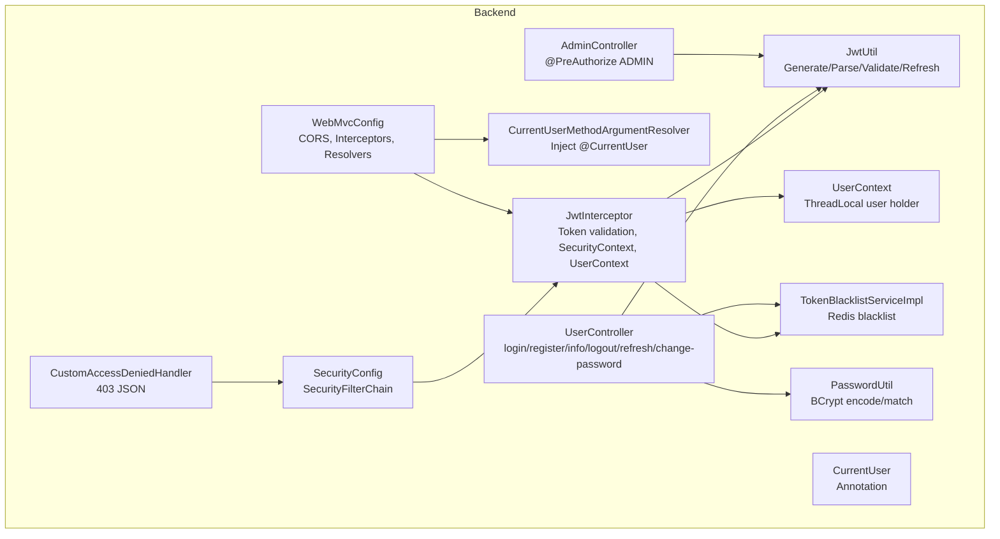
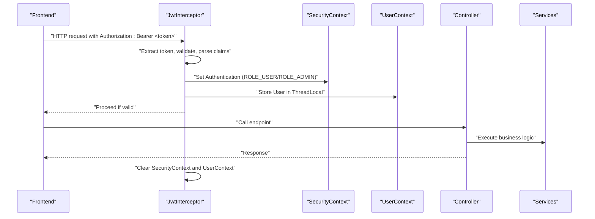
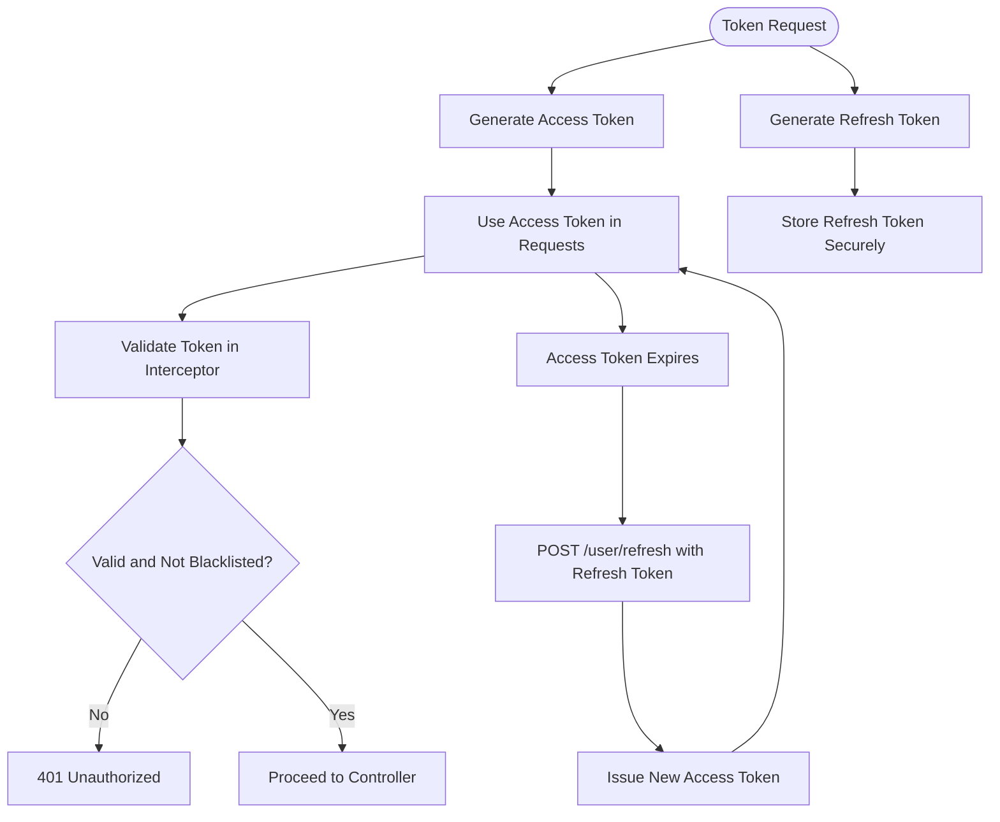
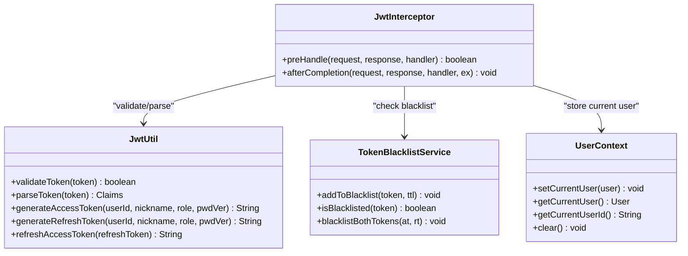
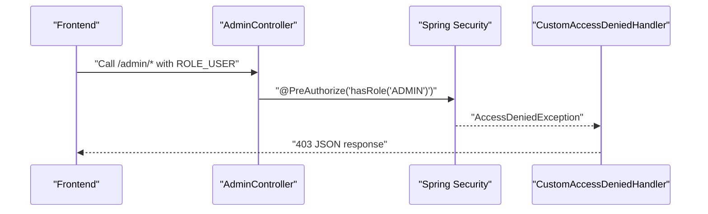
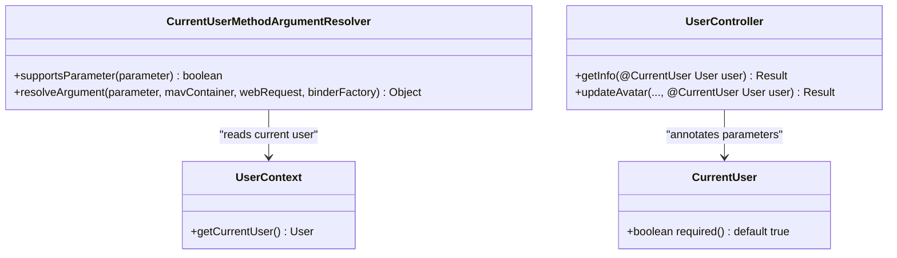
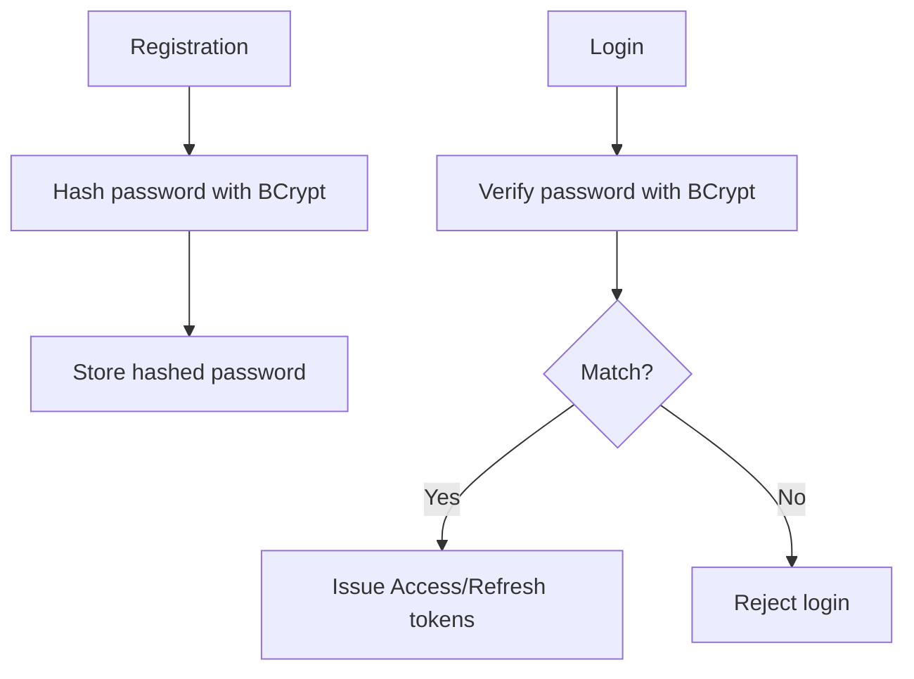
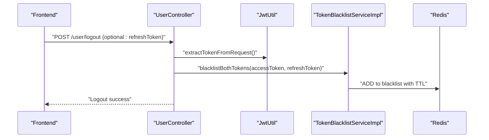
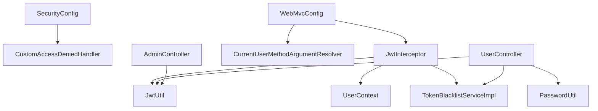

# Authentication & Security

<cite>
**Referenced Files in This Document**
- [SecurityConfig.java](file://backend/src/main/java/com/movie/backend/config/SecurityConfig.java)
- [JwtInterceptor.java](file://backend/src/main/java/com/movie/backend/config/JwtInterceptor.java)
- [WebMvcConfig.java](file://backend/src/main/java/com/movie/backend/config/WebMvcConfig.java)
- [CurrentUser.java](file://backend/src/main/java/com/movie/backend/annotation/CurrentUser.java)
- [CurrentUserMethodArgumentResolver.java](file://backend/src/main/java/com/movie/backend/config/CurrentUserMethodArgumentResolver.java)
- [UserContext.java](file://backend/src/main/java/com/movie/backend/context/UserContext.java)
- [JwtUtil.java](file://backend/src/main/java/com/movie/backend/utils/JwtUtil.java)
- [TokenBlacklistServiceImpl.java](file://backend/src/main/java/com/movie/backend/service/impl/TokenBlacklistServiceImpl.java)
- [PasswordUtil.java](file://backend/src/main/java/com/movie/backend/utils/PasswordUtil.java)
- [CustomAccessDeniedHandler.java](file://backend/src/main/java/com/movie/backend/config/CustomAccessDeniedHandler.java)
- [UserController.java](file://backend/src/main/java/com/movie/backend/controller/UserController.java)
- [AdminController.java](file://backend/src/main/java/com/movie/backend/controller/admin/AdminController.java)
- [application-dev.yml](file://backend/src/main/resources/application-dev.yml)
- [application.yml](file://backend/src/main/resources/application.yml)
</cite>

## Table of Contents
1. [Introduction](#introduction)
2. [Project Structure](#project-structure)
3. [Core Components](#core-components)
4. [Architecture Overview](#architecture-overview)
5. [Detailed Component Analysis](#detailed-component-analysis)
6. [Dependency Analysis](#dependency-analysis)
7. [Performance Considerations](#performance-considerations)
8. [Troubleshooting Guide](#troubleshooting-guide)
9. [Conclusion](#conclusion)
10. [Appendices](#appendices)

## Introduction
This document provides comprehensive authentication and security documentation for the Movie System. It explains JWT token-based authentication, including token generation, validation, refresh, and revocation. It documents the security interceptor configuration, role-based access control (RBAC), and method-level authorization using Spring Security’s @PreAuthorize. It also covers user context resolution, current user injection via @CurrentUser, and security annotations. Practical examples of protected endpoints, token handling in the frontend, and security best practices are included. Additionally, it documents password hashing, session management, and security configurations, along with common security vulnerabilities and mitigation strategies.

## Project Structure
The authentication and security subsystem is implemented primarily in the backend module under the config, annotation, context, utils, controller, and service packages. The frontend integrates with the backend via HTTP requests carrying Authorization headers with Bearer tokens.

**Diagram sources**
- [SecurityConfig.java](file://backend/src/main/java/com/movie/backend/config/SecurityConfig.java#L24-L49)
- [WebMvcConfig.java](file://backend/src/main/java/com/movie/backend/config/WebMvcConfig.java#L35-L49)
- [JwtInterceptor.java](file://backend/src/main/java/com/movie/backend/config/JwtInterceptor.java#L33-L95)
- [UserContext.java](file://backend/src/main/java/com/movie/backend/context/UserContext.java#L10-L43)
- [CurrentUser.java](file://backend/src/main/java/com/movie/backend/annotation/CurrentUser.java#L18-L28)
- [CurrentUserMethodArgumentResolver.java](file://backend/src/main/java/com/movie/backend/config/CurrentUserMethodArgumentResolver.java#L17-L50)
- [JwtUtil.java](file://backend/src/main/java/com/movie/backend/utils/JwtUtil.java#L20-L179)
- [TokenBlacklistServiceImpl.java](file://backend/src/main/java/com/movie/backend/service/impl/TokenBlacklistServiceImpl.java#L17-L81)
- [PasswordUtil.java](file://backend/src/main/java/com/movie/backend/utils/PasswordUtil.java#L9-L32)
- [CustomAccessDeniedHandler.java](file://backend/src/main/java/com/movie/backend/config/CustomAccessDeniedHandler.java#L16-L26)
- [UserController.java](file://backend/src/main/java/com/movie/backend/controller/UserController.java#L24-L130)
- [AdminController.java](file://backend/src/main/java/com/movie/backend/controller/admin/AdminController.java#L22-L135)

**Section sources**
- [SecurityConfig.java](file://backend/src/main/java/com/movie/backend/config/SecurityConfig.java#L16-L51)
- [WebMvcConfig.java](file://backend/src/main/java/com/movie/backend/config/WebMvcConfig.java#L14-L65)
- [application-dev.yml](file://backend/src/main/resources/application-dev.yml#L62-L67)

## Core Components
- Security filter chain: Stateless JWT-based configuration with CSRF disabled, form login and HTTP Basic disabled, permit-all for requests, and custom access denied handler.
- JWT interceptor: Extracts Authorization header, validates token, checks blacklist, sets Spring Security context, and stores user in ThreadLocal via UserContext.
- User context and injection: ThreadLocal-based UserContext and a method argument resolver that injects the current user into controller methods annotated with @CurrentUser.
- Token utilities: JWT generation, parsing, validation, refresh flow, and extraction helpers.
- Token blacklist: Redis-backed storage of revoked tokens with TTL derived from token expiration.
- Password hashing: BCrypt-based encoding and matching.
- Method-level authorization: @PreAuthorize("hasRole('ADMIN')") on admin endpoints.
- Controllers: User endpoints for login, registration, info, refresh, logout, change-password; admin endpoints protected by RBAC.

**Section sources**
- [SecurityConfig.java](file://backend/src/main/java/com/movie/backend/config/SecurityConfig.java#L24-L49)
- [JwtInterceptor.java](file://backend/src/main/java/com/movie/backend/config/JwtInterceptor.java#L33-L103)
- [UserContext.java](file://backend/src/main/java/com/movie/backend/context/UserContext.java#L10-L43)
- [CurrentUserMethodArgumentResolver.java](file://backend/src/main/java/com/movie/backend/config/CurrentUserMethodArgumentResolver.java#L17-L50)
- [JwtUtil.java](file://backend/src/main/java/com/movie/backend/utils/JwtUtil.java#L49-L179)
- [TokenBlacklistServiceImpl.java](file://backend/src/main/java/com/movie/backend/service/impl/TokenBlacklistServiceImpl.java#L17-L81)
- [PasswordUtil.java](file://backend/src/main/java/com/movie/backend/utils/PasswordUtil.java#L9-L32)
- [AdminController.java](file://backend/src/main/java/com/movie/backend/controller/admin/AdminController.java#L22-L135)
- [UserController.java](file://backend/src/main/java/com/movie/backend/controller/UserController.java#L32-L130)

## Architecture Overview
The authentication and authorization pipeline combines Spring Security configuration, a custom interceptor, and method-level authorization. Requests pass through the interceptor for token validation and user context population, while method-level annotations enforce role-based access.

**Diagram sources**
- [JwtInterceptor.java](file://backend/src/main/java/com/movie/backend/config/JwtInterceptor.java#L33-L103)
- [UserContext.java](file://backend/src/main/java/com/movie/backend/context/UserContext.java#L10-L43)
- [SecurityConfig.java](file://backend/src/main/java/com/movie/backend/config/SecurityConfig.java#L24-L49)
- [WebMvcConfig.java](file://backend/src/main/java/com/movie/backend/config/WebMvcConfig.java#L35-L49)

## Detailed Component Analysis

### JWT Token Utilities and Flow
- Generation: Access tokens and refresh tokens are generated with subject (user ID), role, nickname, password version, and type. Access tokens expire in hours; refresh tokens expire in days.
- Validation: Tokens are validated by parsing and verifying signature; failures return false to the interceptor.
- Parsing: Claims are extracted for user identity and role; exceptions propagate to be handled upstream.
- Refresh: Refresh tokens are validated for type and password version; on success, a new access token is issued.
- Extraction: Helpers extract token from Authorization header and user ID from token.

**Diagram sources**
- [JwtUtil.java](file://backend/src/main/java/com/movie/backend/utils/JwtUtil.java#L49-L179)
- [UserController.java](file://backend/src/main/java/com/movie/backend/controller/UserController.java#L77-L86)

**Section sources**
- [JwtUtil.java](file://backend/src/main/java/com/movie/backend/utils/JwtUtil.java#L49-L179)
- [UserController.java](file://backend/src/main/java/com/movie/backend/controller/UserController.java#L77-L104)

### Security Interceptor and User Context
- Interceptor responsibilities:
  - Skip OPTIONS preflight.
  - Extract Bearer token from Authorization header.
  - Validate token via JwtUtil.
  - Check blacklist via TokenBlacklistService.
  - Parse claims and set Spring Security context with ROLE_USER or ROLE_ADMIN.
  - Load full user from database and store in UserContext.
  - Clear SecurityContext and UserContext after completion to prevent leaks.
- UserContext provides static accessors for current user and ID and requires cleanup.

**Diagram sources**
- [JwtInterceptor.java](file://backend/src/main/java/com/movie/backend/config/JwtInterceptor.java#L24-L105)
- [UserContext.java](file://backend/src/main/java/com/movie/backend/context/UserContext.java#L10-L43)
- [JwtUtil.java](file://backend/src/main/java/com/movie/backend/utils/JwtUtil.java#L49-L179)
- [TokenBlacklistServiceImpl.java](file://backend/src/main/java/com/movie/backend/service/impl/TokenBlacklistServiceImpl.java#L17-L81)

**Section sources**
- [JwtInterceptor.java](file://backend/src/main/java/com/movie/backend/config/JwtInterceptor.java#L33-L103)
- [UserContext.java](file://backend/src/main/java/com/movie/backend/context/UserContext.java#L10-L43)

### Method-Level Authorization and RBAC
- Global method security is enabled to support @PreAuthorize.
- Admin endpoints are protected with @PreAuthorize("hasRole('ADMIN')").
- Custom access denied handler returns JSON 403 responses for insufficient privileges.

**Diagram sources**
- [AdminController.java](file://backend/src/main/java/com/movie/backend/controller/admin/AdminController.java#L22-L135)
- [CustomAccessDeniedHandler.java](file://backend/src/main/java/com/movie/backend/config/CustomAccessDeniedHandler.java#L16-L26)
- [SecurityConfig.java](file://backend/src/main/java/com/movie/backend/config/SecurityConfig.java#L16-L51)

**Section sources**
- [SecurityConfig.java](file://backend/src/main/java/com/movie/backend/config/SecurityConfig.java#L16-L51)
- [AdminController.java](file://backend/src/main/java/com/movie/backend/controller/admin/AdminController.java#L22-L135)
- [CustomAccessDeniedHandler.java](file://backend/src/main/java/com/movie/backend/config/CustomAccessDeniedHandler.java#L16-L26)

### Current User Injection and Annotation
- @CurrentUser annotation marks method parameters to receive the current user.
- CurrentUserMethodArgumentResolver resolves the parameter from UserContext and enforces required behavior.
- UserController demonstrates injecting @CurrentUser into endpoints.

**Diagram sources**
- [CurrentUser.java](file://backend/src/main/java/com/movie/backend/annotation/CurrentUser.java#L18-L28)
- [CurrentUserMethodArgumentResolver.java](file://backend/src/main/java/com/movie/backend/config/CurrentUserMethodArgumentResolver.java#L17-L50)
- [UserContext.java](file://backend/src/main/java/com/movie/backend/context/UserContext.java#L10-L43)
- [UserController.java](file://backend/src/main/java/com/movie/backend/controller/UserController.java#L46-L75)

**Section sources**
- [CurrentUser.java](file://backend/src/main/java/com/movie/backend/annotation/CurrentUser.java#L18-L28)
- [CurrentUserMethodArgumentResolver.java](file://backend/src/main/java/com/movie/backend/config/CurrentUserMethodArgumentResolver.java#L17-L50)
- [UserContext.java](file://backend/src/main/java/com/movie/backend/context/UserContext.java#L10-L43)
- [UserController.java](file://backend/src/main/java/com/movie/backend/controller/UserController.java#L46-L75)

### Password Hashing and Session Management
- Password hashing uses BCrypt for secure password encoding and verification.
- Session management is stateless (STATELESS), relying on JWT tokens instead of server-side sessions.

**Diagram sources**
- [PasswordUtil.java](file://backend/src/main/java/com/movie/backend/utils/PasswordUtil.java#L9-L32)
- [SecurityConfig.java](file://backend/src/main/java/com/movie/backend/config/SecurityConfig.java#L34-L36)

**Section sources**
- [PasswordUtil.java](file://backend/src/main/java/com/movie/backend/utils/PasswordUtil.java#L9-L32)
- [SecurityConfig.java](file://backend/src/main/java/com/movie/backend/config/SecurityConfig.java#L34-L36)

### Token Revocation and Logout
- Logout endpoint extracts the current access token and blacklists both access and refresh tokens.
- TokenBlacklistServiceImpl stores tokens in Redis with TTL equal to remaining lifetime.
- Change password increments password version; existing tokens become invalid after refresh.

**Diagram sources**
- [UserController.java](file://backend/src/main/java/com/movie/backend/controller/UserController.java#L88-L104)
- [TokenBlacklistServiceImpl.java](file://backend/src/main/java/com/movie/backend/service/impl/TokenBlacklistServiceImpl.java#L47-L79)
- [JwtUtil.java](file://backend/src/main/java/com/movie/backend/utils/JwtUtil.java#L169-L179)

**Section sources**
- [UserController.java](file://backend/src/main/java/com/movie/backend/controller/UserController.java#L88-L128)
- [TokenBlacklistServiceImpl.java](file://backend/src/main/java/com/movie/backend/service/impl/TokenBlacklistServiceImpl.java#L17-L81)
- [JwtUtil.java](file://backend/src/main/java/com/movie/backend/utils/JwtUtil.java#L120-L155)

### Protected Endpoints and Frontend Integration
- Protected endpoints:
  - GET /user/info: Requires login; returns current user stats.
  - PUT /user/avatar: Updates avatar for logged-in user.
  - POST /user/refresh: Exchanges refresh token for new access token.
  - POST /user/logout: Revokes tokens and logs out.
  - POST /user/change-password: Changes password and revokes tokens.
  - Admin endpoints under /admin/* require ADMIN role.
- Frontend token handling:
  - Send Authorization: Bearer <access_token> header on protected requests.
  - Persist refresh token securely (e.g., httpOnly cookie or secure storage).
  - On 401/403, redirect to login or trigger token refresh flow.

**Section sources**
- [UserController.java](file://backend/src/main/java/com/movie/backend/controller/UserController.java#L32-L130)
- [AdminController.java](file://backend/src/main/java/com/movie/backend/controller/admin/AdminController.java#L22-L135)

## Dependency Analysis
The following diagram shows key dependencies among security components:

**Diagram sources**
- [SecurityConfig.java](file://backend/src/main/java/com/movie/backend/config/SecurityConfig.java#L24-L49)
- [WebMvcConfig.java](file://backend/src/main/java/com/movie/backend/config/WebMvcConfig.java#L35-L49)
- [JwtInterceptor.java](file://backend/src/main/java/com/movie/backend/config/JwtInterceptor.java#L24-L105)
- [CurrentUserMethodArgumentResolver.java](file://backend/src/main/java/com/movie/backend/config/CurrentUserMethodArgumentResolver.java#L17-L50)
- [UserContext.java](file://backend/src/main/java/com/movie/backend/context/UserContext.java#L10-L43)
- [JwtUtil.java](file://backend/src/main/java/com/movie/backend/utils/JwtUtil.java#L49-L179)
- [TokenBlacklistServiceImpl.java](file://backend/src/main/java/com/movie/backend/service/impl/TokenBlacklistServiceImpl.java#L17-L81)
- [PasswordUtil.java](file://backend/src/main/java/com/movie/backend/utils/PasswordUtil.java#L9-L32)
- [UserController.java](file://backend/src/main/java/com/movie/backend/controller/UserController.java#L24-L130)
- [AdminController.java](file://backend/src/main/java/com/movie/backend/controller/admin/AdminController.java#L22-L135)

**Section sources**
- [SecurityConfig.java](file://backend/src/main/java/com/movie/backend/config/SecurityConfig.java#L24-L49)
- [WebMvcConfig.java](file://backend/src/main/java/com/movie/backend/config/WebMvcConfig.java#L35-L49)
- [JwtInterceptor.java](file://backend/src/main/java/com/movie/backend/config/JwtInterceptor.java#L24-L105)
- [JwtUtil.java](file://backend/src/main/java/com/movie/backend/utils/JwtUtil.java#L49-L179)
- [TokenBlacklistServiceImpl.java](file://backend/src/main/java/com/movie/backend/service/impl/TokenBlacklistServiceImpl.java#L17-L81)
- [PasswordUtil.java](file://backend/src/main/java/com/movie/backend/utils/PasswordUtil.java#L9-L32)
- [UserController.java](file://backend/src/main/java/com/movie/backend/controller/UserController.java#L24-L130)
- [AdminController.java](file://backend/src/main/java/com/movie/backend/controller/admin/AdminController.java#L22-L135)

## Performance Considerations
- Stateless design: No server-side session storage reduces memory footprint and simplifies scaling.
- Redis blacklist: Efficient O(1) lookup and automatic TTL eviction minimize overhead.
- Minimal parsing: Token validation short-circuits on missing/invalid headers; blacklist check avoids unnecessary DB queries.
- Caching: Consider caching frequently accessed user roles/permissions per request if needed.
- CORS: Broad origin patterns and credentials enabled; restrict origins in production environments.

[No sources needed since this section provides general guidance]

## Troubleshooting Guide
Common issues and resolutions:
- 401 Unauthorized on protected endpoints:
  - Ensure Authorization header is present and prefixed with Bearer.
  - Confirm token is not expired or revoked.
  - Verify token is not in blacklist.
- 403 Forbidden on admin endpoints:
  - Confirm user role is ADMIN; @PreAuthorize guards these endpoints.
- Token refresh failure:
  - Ensure refresh token type is correct and password version matches current user.
- Logout does not take effect:
  - Confirm both access and refresh tokens were added to blacklist.
- Password change not enforced:
  - After changing password, old tokens become invalid upon refresh due to password version mismatch.

**Section sources**
- [JwtInterceptor.java](file://backend/src/main/java/com/movie/backend/config/JwtInterceptor.java#L47-L60)
- [JwtUtil.java](file://backend/src/main/java/com/movie/backend/utils/JwtUtil.java#L120-L155)
- [TokenBlacklistServiceImpl.java](file://backend/src/main/java/com/movie/backend/service/impl/TokenBlacklistServiceImpl.java#L36-L44)
- [CustomAccessDeniedHandler.java](file://backend/src/main/java/com/movie/backend/config/CustomAccessDeniedHandler.java#L16-L26)

## Conclusion
The Movie System employs a robust, stateless JWT-based authentication and authorization model. Spring Security’s method-level protection, a custom interceptor, and thread-local user context combine to deliver secure, scalable access control. Token lifecycle management includes generation, validation, refresh, and revocation via Redis. Passwords are hashed with BCrypt, and CORS/session policies are configured appropriately. Following the best practices outlined here will help maintain a secure and maintainable authentication layer.

[No sources needed since this section summarizes without analyzing specific files]

## Appendices

### Security Configurations
- JWT secret, access token expiration, and refresh token expiration are configured in the development profile.
- Application profile activation is controlled via application.yml.

**Section sources**
- [application-dev.yml](file://backend/src/main/resources/application-dev.yml#L62-L67)
- [application.yml](file://backend/src/main/resources/application.yml#L1-L4)

### Security Annotations and Best Practices
- Use @PreAuthorize("hasRole('ADMIN')") for admin-only endpoints.
- Prefer @CurrentUser for concise user injection; mark required=true when login is mandatory.
- Always send Authorization: Bearer <access_token> for protected requests.
- Store refresh tokens securely; avoid exposing them client-side unnecessarily.
- Implement token refresh on 401 responses and logout on sensitive actions.
- Regularly rotate JWT secrets and monitor token revocation patterns.

[No sources needed since this section provides general guidance]