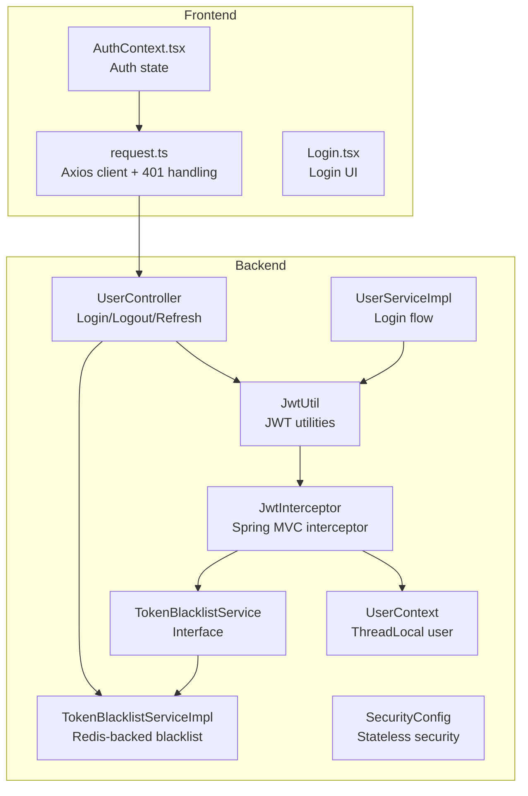
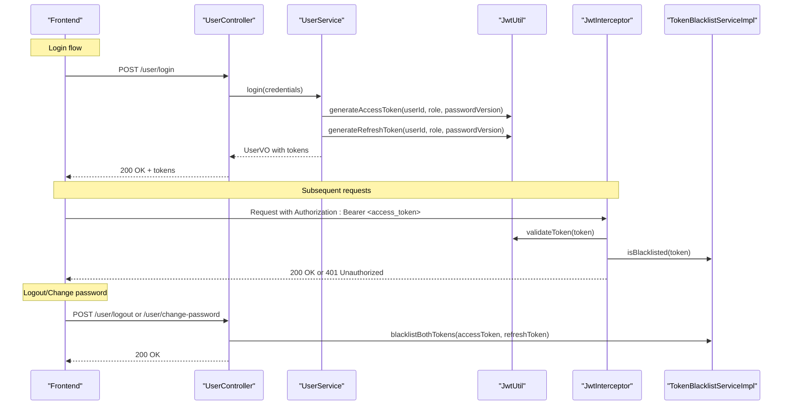
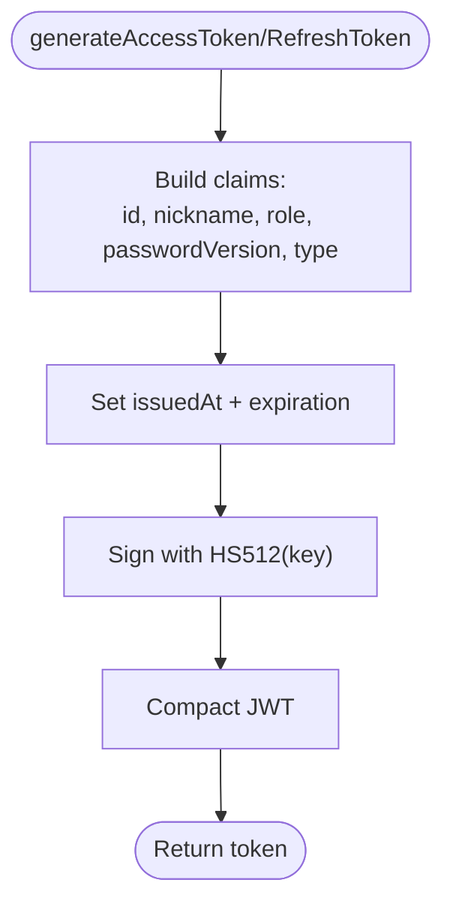
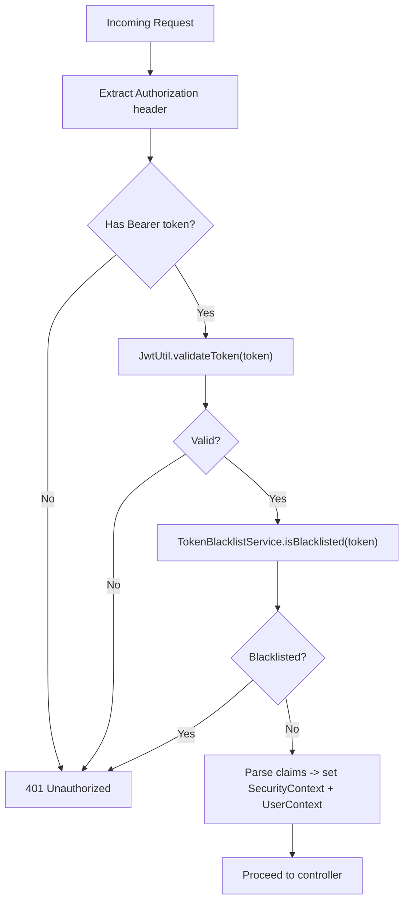
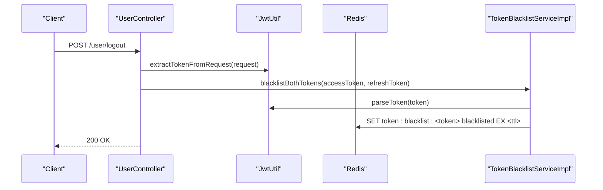
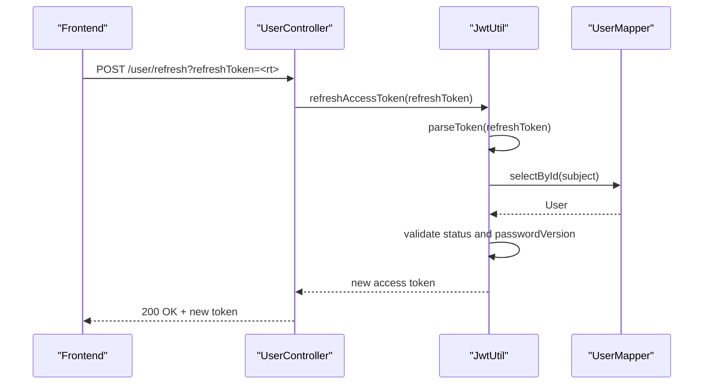
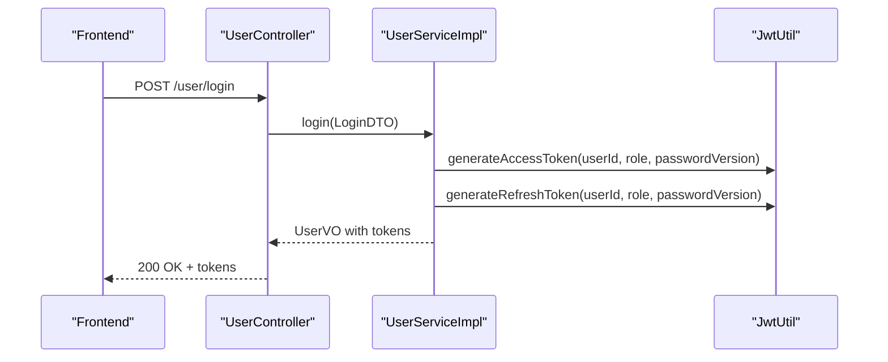
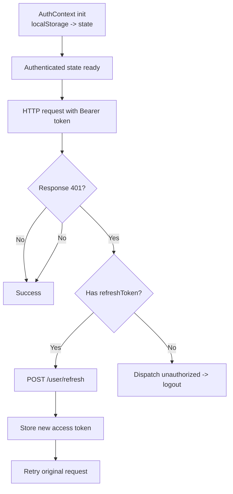
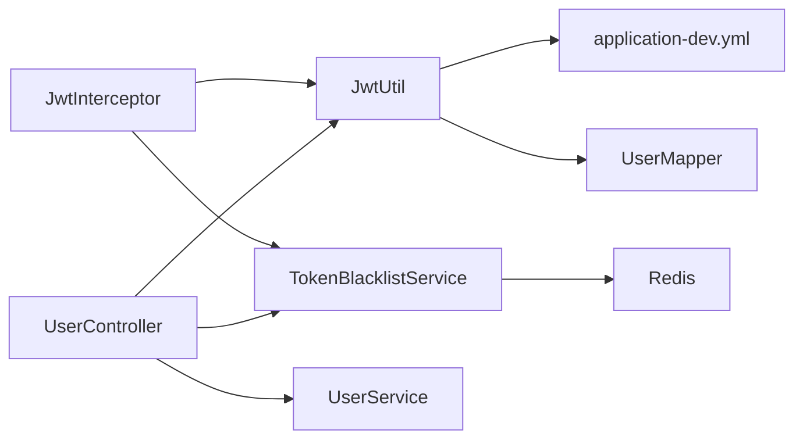

# JWT Token Implementation

<cite>
**Referenced Files in This Document**
- [JwtUtil.java](file://backend/src/main/java/com/movie/backend/utils/JwtUtil.java)
- [TokenBlacklistService.java](file://backend/src/main/java/com/movie/backend/service/TokenBlacklistService.java)
- [TokenBlacklistServiceImpl.java](file://backend/src/main/java/com/movie/backend/service/impl/TokenBlacklistServiceImpl.java)
- [JwtInterceptor.java](file://backend/src/main/java/com/movie/backend/config/JwtInterceptor.java)
- [SecurityConfig.java](file://backend/src/main/java/com/movie/backend/config/SecurityConfig.java)
- [UserContext.java](file://backend/src/main/java/com/movie/backend/context/UserContext.java)
- [CurrentUser.java](file://backend/src/main/java/com/movie/backend/annotation/CurrentUser.java)
- [UserController.java](file://backend/src/main/java/com/movie/backend/controller/UserController.java)
- [UserService.java](file://backend/src/main/java/com/movie/backend/service/UserService.java)
- [UserServiceImpl.java](file://backend/src/main/java/com/movie/backend/service/impl/UserServiceImpl.java)
- [application-dev.yml](file://backend/src/main/resources/application-dev.yml)
- [RedisConfig.java](file://backend/src/main/java/com/movie/backend/config/RedisConfig.java)
- [AuthContext.tsx](file://movie-review-web/src/context/AuthContext.tsx)
- [request.ts](file://movie-review-web/src/api/request.ts)
- [Login.tsx](file://movie-review-web/src/pages/Login.tsx)
</cite>

## Table of Contents
1. [Introduction](#introduction)
2. [Project Structure](#project-structure)
3. [Core Components](#core-components)
4. [Architecture Overview](#architecture-overview)
5. [Detailed Component Analysis](#detailed-component-analysis)
6. [Dependency Analysis](#dependency-analysis)
7. [Performance Considerations](#performance-considerations)
8. [Troubleshooting Guide](#troubleshooting-guide)
9. [Conclusion](#conclusion)
10. [Appendices](#appendices)

## Introduction
This document provides comprehensive documentation for the JWT token implementation in the Movie System. It covers token generation, payload structure, validation, expiration handling, signature verification, blacklist-based logout and revocation, lifecycle management, refresh strategies, and secure storage recommendations for frontend applications. Practical examples illustrate end-to-end workflows for creating, parsing, and validating tokens.

## Project Structure
The JWT implementation spans backend utilities, interceptors, services, controllers, and frontend integration:
- Backend core utilities: JWT utilities, blacklist service, security configuration, and user context.
- Frontend integration: authentication context and HTTP client with automatic refresh logic.

**Diagram sources**
- [JwtUtil.java](file://backend/src/main/java/com/movie/backend/utils/JwtUtil.java#L1-L179)
- [JwtInterceptor.java](file://backend/src/main/java/com/movie/backend/config/JwtInterceptor.java#L1-L105)
- [TokenBlacklistService.java](file://backend/src/main/java/com/movie/backend/service/TokenBlacklistService.java#L1-L30)
- [TokenBlacklistServiceImpl.java](file://backend/src/main/java/com/movie/backend/service/impl/TokenBlacklistServiceImpl.java#L1-L81)
- [SecurityConfig.java](file://backend/src/main/java/com/movie/backend/config/SecurityConfig.java#L1-L51)
- [UserContext.java](file://backend/src/main/java/com/movie/backend/context/UserContext.java#L1-L44)
- [UserController.java](file://backend/src/main/java/com/movie/backend/controller/UserController.java#L1-L130)
- [UserServiceImpl.java](file://backend/src/main/java/com/movie/backend/service/impl/UserServiceImpl.java#L1-L176)
- [AuthContext.tsx](file://movie-review-web/src/context/AuthContext.tsx#L1-L123)
- [request.ts](file://movie-review-web/src/api/request.ts#L1-L108)

**Section sources**
- [JwtUtil.java](file://backend/src/main/java/com/movie/backend/utils/JwtUtil.java#L1-L179)
- [JwtInterceptor.java](file://backend/src/main/java/com/movie/backend/config/JwtInterceptor.java#L1-L105)
- [TokenBlacklistService.java](file://backend/src/main/java/com/movie/backend/service/TokenBlacklistService.java#L1-L30)
- [TokenBlacklistServiceImpl.java](file://backend/src/main/java/com/movie/backend/service/impl/TokenBlacklistServiceImpl.java#L1-L81)
- [SecurityConfig.java](file://backend/src/main/java/com/movie/backend/config/SecurityConfig.java#L1-L51)
- [UserContext.java](file://backend/src/main/java/com/movie/backend/context/UserContext.java#L1-L44)
- [UserController.java](file://backend/src/main/java/com/movie/backend/controller/UserController.java#L1-L130)
- [UserServiceImpl.java](file://backend/src/main/java/com/movie/backend/service/impl/UserServiceImpl.java#L1-L176)
- [AuthContext.tsx](file://movie-review-web/src/context/AuthContext.tsx#L1-L123)
- [request.ts](file://movie-review-web/src/api/request.ts#L1-L108)

## Core Components
- JwtUtil: Generates access and refresh tokens with HS512 signature, sets expiration, and parses/validates tokens. Provides extraction helpers for Authorization headers.
- JwtInterceptor: Validates tokens on each request, checks blacklist, sets Spring Security context, and injects user via ThreadLocal.
- TokenBlacklistService and TokenBlacklistServiceImpl: Manages revoked tokens in Redis with TTL matching remaining validity.
- SecurityConfig: Stateless session policy enabling method-level security and JWT-based authentication.
- UserContext and @CurrentUser: ThreadLocal-based user injection for controllers.
- UserController and UserService: Login generates both access and refresh tokens; logout and password change revoke tokens; refresh endpoint regenerates access tokens.

**Section sources**
- [JwtUtil.java](file://backend/src/main/java/com/movie/backend/utils/JwtUtil.java#L1-L179)
- [JwtInterceptor.java](file://backend/src/main/java/com/movie/backend/config/JwtInterceptor.java#L1-L105)
- [TokenBlacklistService.java](file://backend/src/main/java/com/movie/backend/service/TokenBlacklistService.java#L1-L30)
- [TokenBlacklistServiceImpl.java](file://backend/src/main/java/com/movie/backend/service/impl/TokenBlacklistServiceImpl.java#L1-L81)
- [SecurityConfig.java](file://backend/src/main/java/com/movie/backend/config/SecurityConfig.java#L1-L51)
- [UserContext.java](file://backend/src/main/java/com/movie/backend/context/UserContext.java#L1-L44)
- [CurrentUser.java](file://backend/src/main/java/com/movie/backend/annotation/CurrentUser.java#L1-L29)
- [UserController.java](file://backend/src/main/java/com/movie/backend/controller/UserController.java#L1-L130)
- [UserServiceImpl.java](file://backend/src/main/java/com/movie/backend/service/impl/UserServiceImpl.java#L1-L176)

## Architecture Overview
The system enforces stateless authentication using JWT:
- Clients send Authorization: Bearer <access_token> with requests.
- JwtInterceptor validates the token signature and expiration, checks blacklist, and populates Spring Security context and UserContext.
- Controllers use @PreAuthorize and @CurrentUser to enforce authorization and access user info.
- Logout and password change revoke tokens by adding them to Redis with TTL equal to remaining validity.

**Diagram sources**
- [UserController.java](file://backend/src/main/java/com/movie/backend/controller/UserController.java#L1-L130)
- [UserServiceImpl.java](file://backend/src/main/java/com/movie/backend/service/impl/UserServiceImpl.java#L1-L176)
- [JwtUtil.java](file://backend/src/main/java/com/movie/backend/utils/JwtUtil.java#L1-L179)
- [JwtInterceptor.java](file://backend/src/main/java/com/movie/backend/config/JwtInterceptor.java#L1-L105)
- [TokenBlacklistServiceImpl.java](file://backend/src/main/java/com/movie/backend/service/impl/TokenBlacklistServiceImpl.java#L1-L81)

## Detailed Component Analysis

### JWT Utilities and Token Payload
- Payload fields:
  - Subject: user ID
  - Claims: id, nickname, role, passwordVersion, type ("access" or "refresh")
- Expiration:
  - Access token TTL configured in application-dev.yml
  - Refresh token TTL configured in application-dev.yml
- Signature:
  - HS512 using a symmetric key derived from the configured secret
- Methods:
  - generateAccessToken/generateRefreshToken: create signed JWT with expiration
  - parseToken/validateToken: signature verification and expiration check
  - refreshAccessToken: validates refresh token, checks user status and passwordVersion, returns new access token
  - extractTokenFromRequest/getUserIdFromRequest: convenience helpers for Authorization header

**Diagram sources**
- [JwtUtil.java](file://backend/src/main/java/com/movie/backend/utils/JwtUtil.java#L66-L81)
- [application-dev.yml](file://backend/src/main/resources/application-dev.yml#L62-L67)

**Section sources**
- [JwtUtil.java](file://backend/src/main/java/com/movie/backend/utils/JwtUtil.java#L49-L81)
- [application-dev.yml](file://backend/src/main/resources/application-dev.yml#L62-L67)

### Token Validation and Interceptor Flow
- JwtInterceptor extracts Authorization header, validates token via JwtUtil, checks blacklist, sets Spring Security context, and loads full user into UserContext.
- On failure, responds with 401 and JSON body indicating unauthorized or token invalid.

**Diagram sources**
- [JwtInterceptor.java](file://backend/src/main/java/com/movie/backend/config/JwtInterceptor.java#L33-L95)
- [JwtUtil.java](file://backend/src/main/java/com/movie/backend/utils/JwtUtil.java#L99-L107)
- [TokenBlacklistServiceImpl.java](file://backend/src/main/java/com/movie/backend/service/impl/TokenBlacklistServiceImpl.java#L36-L44)

**Section sources**
- [JwtInterceptor.java](file://backend/src/main/java/com/movie/backend/config/JwtInterceptor.java#L33-L95)
- [JwtUtil.java](file://backend/src/main/java/com/movie/backend/utils/JwtUtil.java#L87-L107)
- [TokenBlacklistServiceImpl.java](file://backend/src/main/java/com/movie/backend/service/impl/TokenBlacklistServiceImpl.java#L36-L44)

### Token Blacklist Service (Logout and Revocation)
- addToBlacklist(token, ttl): stores token in Redis under a prefixed key with TTL equal to remaining validity.
- isBlacklisted(token): checks presence of token key.
- blacklistBothTokens(accessToken, refreshToken): computes TTL from parsed claims and adds both tokens to blacklist.
- Used by UserController logout and change-password endpoints.

**Diagram sources**
- [UserController.java](file://backend/src/main/java/com/movie/backend/controller/UserController.java#L88-L104)
- [TokenBlacklistServiceImpl.java](file://backend/src/main/java/com/movie/backend/service/impl/TokenBlacklistServiceImpl.java#L46-L79)
- [JwtUtil.java](file://backend/src/main/java/com/movie/backend/utils/JwtUtil.java#L172-L178)

**Section sources**
- [TokenBlacklistService.java](file://backend/src/main/java/com/movie/backend/service/TokenBlacklistService.java#L1-L30)
- [TokenBlacklistServiceImpl.java](file://backend/src/main/java/com/movie/backend/service/impl/TokenBlacklistServiceImpl.java#L1-L81)
- [UserController.java](file://backend/src/main/java/com/movie/backend/controller/UserController.java#L88-L104)

### Refresh Token Workflow
- UserController exposes POST /user/refresh accepting refreshToken.
- JwtUtil.refreshAccessToken validates type is "refresh", verifies user existence and status, compares passwordVersion, and issues a new access token.
- Frontend automatically attempts silent refresh on 401 using stored refreshToken.

**Diagram sources**
- [UserController.java](file://backend/src/main/java/com/movie/backend/controller/UserController.java#L77-L86)
- [JwtUtil.java](file://backend/src/main/java/com/movie/backend/utils/JwtUtil.java#L123-L155)
- [UserServiceImpl.java](file://backend/src/main/java/com/movie/backend/service/impl/UserServiceImpl.java#L151-L174)

**Section sources**
- [UserController.java](file://backend/src/main/java/com/movie/backend/controller/UserController.java#L77-L86)
- [JwtUtil.java](file://backend/src/main/java/com/movie/backend/utils/JwtUtil.java#L123-L155)
- [request.ts](file://movie-review-web/src/api/request.ts#L33-L92)

### Login and Token Issuance
- UserServiceImpl.login fetches user, validates status and password, copies to VO, and generates access and refresh tokens embedding role and passwordVersion.
- Tokens are returned to the client alongside user data.

**Diagram sources**
- [UserController.java](file://backend/src/main/java/com/movie/backend/controller/UserController.java#L32-L36)
- [UserServiceImpl.java](file://backend/src/main/java/com/movie/backend/service/impl/UserServiceImpl.java#L28-L56)
- [JwtUtil.java](file://backend/src/main/java/com/movie/backend/utils/JwtUtil.java#L52-L61)

**Section sources**
- [UserServiceImpl.java](file://backend/src/main/java/com/movie/backend/service/impl/UserServiceImpl.java#L28-L56)
- [JwtUtil.java](file://backend/src/main/java/com/movie/backend/utils/JwtUtil.java#L52-L61)

### Frontend Token Lifecycle and Storage
- AuthContext initializes token and user from localStorage synchronously and manages logout by clearing localStorage and state.
- request.ts attaches Authorization header, handles 401 by attempting silent refresh with refreshToken, and dispatches events to update state.
- Login page triggers login flow and navigates after successful authentication.

**Diagram sources**
- [AuthContext.tsx](file://movie-review-web/src/context/AuthContext.tsx#L20-L123)
- [request.ts](file://movie-review-web/src/api/request.ts#L13-L106)
- [Login.tsx](file://movie-review-web/src/pages/Login.tsx#L36-L61)

**Section sources**
- [AuthContext.tsx](file://movie-review-web/src/context/AuthContext.tsx#L20-L123)
- [request.ts](file://movie-review-web/src/api/request.ts#L13-L106)
- [Login.tsx](file://movie-review-web/src/pages/Login.tsx#L36-L61)

## Dependency Analysis
- JwtUtil depends on:
  - Symmetric key from application-dev.yml
  - UserMapper for refresh validation
- JwtInterceptor depends on:
  - JwtUtil for token validation
  - TokenBlacklistService for revocation checks
  - UserMapper for loading user details
- TokenBlacklistServiceImpl depends on:
  - StringRedisTemplate for Redis operations
- UserController depends on:
  - JwtUtil for token extraction and refresh
  - TokenBlacklistService for revocation
  - UserService for login/refresh/change-password

**Diagram sources**
- [JwtUtil.java](file://backend/src/main/java/com/movie/backend/utils/JwtUtil.java#L24-L46)
- [JwtInterceptor.java](file://backend/src/main/java/com/movie/backend/config/JwtInterceptor.java#L27-L31)
- [TokenBlacklistServiceImpl.java](file://backend/src/main/java/com/movie/backend/service/impl/TokenBlacklistServiceImpl.java#L22-L33)
- [UserController.java](file://backend/src/main/java/com/movie/backend/controller/UserController.java#L26-L30)
- [application-dev.yml](file://backend/src/main/resources/application-dev.yml#L62-L67)

**Section sources**
- [JwtUtil.java](file://backend/src/main/java/com/movie/backend/utils/JwtUtil.java#L1-L179)
- [JwtInterceptor.java](file://backend/src/main/java/com/movie/backend/config/JwtInterceptor.java#L1-L105)
- [TokenBlacklistServiceImpl.java](file://backend/src/main/java/com/movie/backend/service/impl/TokenBlacklistServiceImpl.java#L1-L81)
- [UserController.java](file://backend/src/main/java/com/movie/backend/controller/UserController.java#L1-L130)
- [application-dev.yml](file://backend/src/main/resources/application-dev.yml#L62-L67)

## Performance Considerations
- Stateless design: No server-side session storage improves scalability.
- Redis-backed blacklist: Efficient O(1) lookup with TTL-based auto-expiry.
- Minimal CPU overhead: HS512 signature verification is fast; avoid unnecessary re-parsing by caching claims in UserContext.
- Request queue during refresh: Prevents redundant refresh calls and ensures pending requests succeed after renewal.

[No sources needed since this section provides general guidance]

## Troubleshooting Guide
Common issues and resolutions:
- 401 Unauthorized on requests:
  - Verify Authorization header format and token validity.
  - Confirm token is not blacklisted.
  - Check server logs for validation failures.
- Token parsing failures:
  - Ensure secret key matches backend configuration.
  - Validate token was signed with HS512 and not tampered.
- Refresh token invalid:
  - Confirm token type is "refresh".
  - Check user status and passwordVersion alignment.
  - Re-login if password changed.
- Frontend stuck on 401:
  - Ensure refreshToken is present and valid.
  - Confirm silent refresh logic executes and updates localStorage.

**Section sources**
- [JwtInterceptor.java](file://backend/src/main/java/com/movie/backend/config/JwtInterceptor.java#L46-L92)
- [JwtUtil.java](file://backend/src/main/java/com/movie/backend/utils/JwtUtil.java#L99-L107)
- [TokenBlacklistServiceImpl.java](file://backend/src/main/java/com/movie/backend/service/impl/TokenBlacklistServiceImpl.java#L36-L44)
- [request.ts](file://movie-review-web/src/api/request.ts#L33-L92)

## Conclusion
The Movie System implements robust JWT-based authentication with clear separation of concerns:
- Secure token generation and validation with HS512.
- Stateless operation enforced by SecurityConfig.
- Comprehensive blacklist service for logout and revocation.
- Practical refresh strategy protecting against password changes and compromised tokens.
- Frontend integrates seamlessly with silent refresh and secure local storage practices.

[No sources needed since this section summarizes without analyzing specific files]

## Appendices

### Token Payload Reference
- Fields:
  - sub: user ID
  - id: user ID
  - nickname: user nickname
  - role: integer role (0=admin, 1=user)
  - passwordVersion: integer version incremented on password change
  - type: "access" or "refresh"
- Expirations:
  - Access token TTL configured in application-dev.yml
  - Refresh token TTL configured in application-dev.yml

**Section sources**
- [JwtUtil.java](file://backend/src/main/java/com/movie/backend/utils/JwtUtil.java#L66-L72)
- [application-dev.yml](file://backend/src/main/resources/application-dev.yml#L62-L67)

### Security Configuration Highlights
- Stateless session policy.
- Method-level security enabled with @PreAuthorize.
- CSRF disabled (appropriate for token-based APIs).
- Custom access denied handling.

**Section sources**
- [SecurityConfig.java](file://backend/src/main/java/com/movie/backend/config/SecurityConfig.java#L24-L46)

### Frontend Storage Recommendations
- Store access token in secure HTTP-only cookies or in-memory state; avoid localStorage for tokens.
- Store refresh token in secure HTTP-only cookies if feasible; otherwise, keep in memory and clear on logout.
- Always transmit tokens over HTTPS/TLS to prevent interception.
- Implement SameSite cookies and secure flags to mitigate CSRF and XSS risks.

[No sources needed since this section provides general guidance]