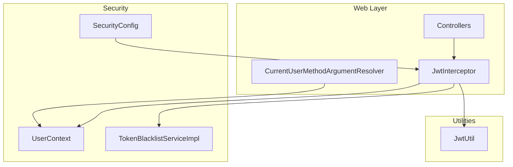
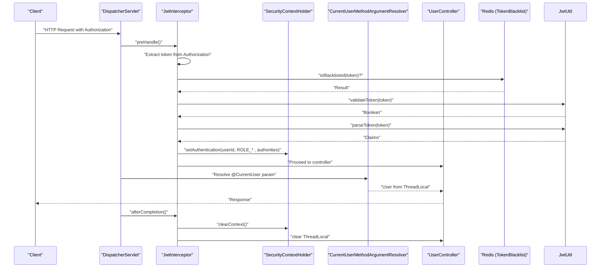
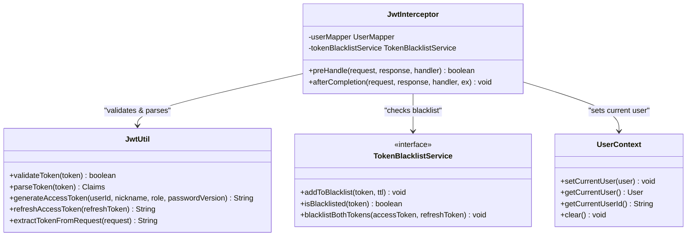
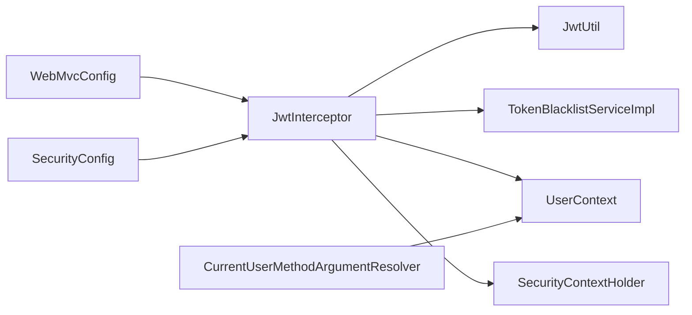

# Security Interceptor

<cite>
**Referenced Files in This Document**
- [JwtInterceptor.java](file://backend/src/main/java/com/movie/backend/config/JwtInterceptor.java)
- [UserContext.java](file://backend/src/main/java/com/movie/backend/context/UserContext.java)
- [WebMvcConfig.java](file://backend/src/main/java/com/movie/backend/config/WebMvcConfig.java)
- [SecurityConfig.java](file://backend/src/main/java/com/movie/backend/config/SecurityConfig.java)
- [JwtUtil.java](file://backend/src/main/java/com/movie/backend/utils/JwtUtil.java)
- [CurrentUserMethodArgumentResolver.java](file://backend/src/main/java/com/movie/backend/config/CurrentUserMethodArgumentResolver.java)
- [CurrentUser.java](file://backend/src/main/java/com/movie/backend/annotation/CurrentUser.java)
- [TokenBlacklistServiceImpl.java](file://backend/src/main/java/com/movie/backend/service/impl/TokenBlacklistServiceImpl.java)
- [UserController.java](file://backend/src/main/java/com/movie/backend/controller/UserController.java)
- [application-dev.yml](file://backend/src/main/resources/application-dev.yml)
</cite>

## Table of Contents
1. [Introduction](#introduction)
2. [Project Structure](#project-structure)
3. [Core Components](#core-components)
4. [Architecture Overview](#architecture-overview)
5. [Detailed Component Analysis](#detailed-component-analysis)
6. [Dependency Analysis](#dependency-analysis)
7. [Performance Considerations](#performance-considerations)
8. [Troubleshooting Guide](#troubleshooting-guide)
9. [Conclusion](#conclusion)

## Introduction
This document explains the JWT security interceptor implementation that validates tokens on each request, sets up the Spring Security context, and manages user context through ThreadLocal. It covers the interceptor lifecycle, request filtering, token extraction, authentication integration, authority establishment, configuration, customization, and troubleshooting.

## Project Structure
The security stack is organized around a Spring MVC interceptor, a ThreadLocal-based user context, Spring Security configuration, and JWT utilities. The interceptor is registered globally and excludes specific endpoints (e.g., login, registration, public APIs).

**Diagram sources**
- [JwtInterceptor.java](file://backend/src/main/java/com/movie/backend/config/JwtInterceptor.java#L24-L105)
- [WebMvcConfig.java](file://backend/src/main/java/com/movie/backend/config/WebMvcConfig.java#L35-L40)
- [SecurityConfig.java](file://backend/src/main/java/com/movie/backend/config/SecurityConfig.java#L16-L51)
- [JwtUtil.java](file://backend/src/main/java/com/movie/backend/utils/JwtUtil.java#L20-L179)
- [UserContext.java](file://backend/src/main/java/com/movie/backend/context/UserContext.java#L10-L44)
- [CurrentUserMethodArgumentResolver.java](file://backend/src/main/java/com/movie/backend/config/CurrentUserMethodArgumentResolver.java#L17-L51)
- [TokenBlacklistServiceImpl.java](file://backend/src/main/java/com/movie/backend/service/impl/TokenBlacklistServiceImpl.java#L17-L81)

**Section sources**
- [WebMvcConfig.java](file://backend/src/main/java/com/movie/backend/config/WebMvcConfig.java#L35-L40)
- [SecurityConfig.java](file://backend/src/main/java/com/movie/backend/config/SecurityConfig.java#L16-L51)

## Core Components
- JwtInterceptor: Validates Authorization header tokens, checks blacklist, sets Spring Security context, loads user into ThreadLocal, and clears context after completion.
- UserContext: ThreadLocal holder for the current request’s user.
- JwtUtil: JWT creation, parsing, validation, and token extraction helpers.
- CurrentUserMethodArgumentResolver: Resolves @CurrentUser parameters from ThreadLocal.
- TokenBlacklistServiceImpl: Stores revoked tokens in Redis with TTL.
- SecurityConfig: Stateless session policy and global permit-all for request-level authorization.
- WebMvcConfig: Registers the interceptor globally and excludes specific paths.

**Section sources**
- [JwtInterceptor.java](file://backend/src/main/java/com/movie/backend/config/JwtInterceptor.java#L24-L105)
- [UserContext.java](file://backend/src/main/java/com/movie/backend/context/UserContext.java#L10-L44)
- [JwtUtil.java](file://backend/src/main/java/com/movie/backend/utils/JwtUtil.java#L20-L179)
- [CurrentUserMethodArgumentResolver.java](file://backend/src/main/java/com/movie/backend/config/CurrentUserMethodArgumentResolver.java#L17-L51)
- [TokenBlacklistServiceImpl.java](file://backend/src/main/java/com/movie/backend/service/impl/TokenBlacklistServiceImpl.java#L17-L81)
- [SecurityConfig.java](file://backend/src/main/java/com/movie/backend/config/SecurityConfig.java#L16-L51)
- [WebMvcConfig.java](file://backend/src/main/java/com/movie/backend/config/WebMvcConfig.java#L35-L40)

## Architecture Overview
The interceptor runs before controller execution to validate tokens and populate the security context. Spring Security remains stateless, delegating authorization decisions to method-level annotations and the interceptor. ThreadLocal provides convenient access to the current user within the request scope.

**Diagram sources**
- [JwtInterceptor.java](file://backend/src/main/java/com/movie/backend/config/JwtInterceptor.java#L33-L103)
- [JwtUtil.java](file://backend/src/main/java/com/movie/backend/utils/JwtUtil.java#L87-L107)
- [CurrentUserMethodArgumentResolver.java](file://backend/src/main/java/com/movie/backend/config/CurrentUserMethodArgumentResolver.java#L34-L49)
- [TokenBlacklistServiceImpl.java](file://backend/src/main/java/com/movie/backend/service/impl/TokenBlacklistServiceImpl.java#L36-L44)
- [UserController.java](file://backend/src/main/java/com/movie/backend/controller/UserController.java#L46-L53)

## Detailed Component Analysis

### JwtInterceptor
Responsibilities:
- Filter OPTIONS requests.
- Extract Bearer token from Authorization header.
- Validate token via JwtUtil.
- Check blacklist via TokenBlacklistServiceImpl.
- Parse claims to derive user ID and role.
- Build SimpleGrantedAuthority and set UsernamePasswordAuthenticationToken in SecurityContextHolder.
- Load full User from UserMapper and store in UserContext.
- Clear Security context and UserContext in afterCompletion.

Lifecycle:
- preHandle: request filtering, token extraction, validation, blacklist check, authentication setup, ThreadLocal population.
- afterCompletion: cleanup of Security context and ThreadLocal.

Thread safety and cleanup:
- SecurityContextHolder.clearContext() prevents cross-request contamination in thread pools.
- UserContext.clear() removes ThreadLocal entries to prevent memory leaks.

Authorization model:
- Role 0 maps to ROLE_ADMIN, otherwise ROLE_USER.
- Authorities are attached to the Authentication object for downstream method-level checks.

Exclusions:
- The interceptor is registered for all paths except login, registration, swagger, movie/public endpoints, comments list, and images.

**Section sources**
- [JwtInterceptor.java](file://backend/src/main/java/com/movie/backend/config/JwtInterceptor.java#L33-L103)
- [WebMvcConfig.java](file://backend/src/main/java/com/movie/backend/config/WebMvcConfig.java#L35-L40)

#### Class Diagram

**Diagram sources**
- [JwtInterceptor.java](file://backend/src/main/java/com/movie/backend/config/JwtInterceptor.java#L24-L105)
- [UserContext.java](file://backend/src/main/java/com/movie/backend/context/UserContext.java#L10-L44)
- [JwtUtil.java](file://backend/src/main/java/com/movie/backend/utils/JwtUtil.java#L20-L179)
- [TokenBlacklistServiceImpl.java](file://backend/src/main/java/com/movie/backend/service/impl/TokenBlacklistServiceImpl.java#L17-L81)

### UserContext
Purpose:
- Store the current request’s User in a ThreadLocal to avoid repeated database lookups.
- Provide safe accessors and a clear method to remove the value.

Thread safety:
- Each request runs on a separate thread; ThreadLocal ensures isolation.
- Must be cleared in afterCompletion to avoid leaks.

**Section sources**
- [UserContext.java](file://backend/src/main/java/com/movie/backend/context/UserContext.java#L10-L44)
- [JwtInterceptor.java](file://backend/src/main/java/com/movie/backend/config/JwtInterceptor.java#L97-L103)

### CurrentUser Method Argument Resolver
Behavior:
- Supports only User parameters annotated with @CurrentUser.
- Retrieves User from UserContext.
- Enforces required flag: throws if user is null and required is true.

Integration:
- Works seamlessly with the interceptor’s ThreadLocal population.

**Section sources**
- [CurrentUserMethodArgumentResolver.java](file://backend/src/main/java/com/movie/backend/config/CurrentUserMethodArgumentResolver.java#L17-L51)
- [CurrentUser.java](file://backend/src/main/java/com/movie/backend/annotation/CurrentUser.java#L18-L29)

### TokenBlacklistServiceImpl
Behavior:
- Stores revoked tokens in Redis under a prefixed key with TTL equal to remaining validity.
- Provides isBlacklisted check during interceptor validation.
- Supports blacklisting both access and refresh tokens together.

Redis integration:
- Uses StringRedisTemplate for atomic operations and TTL-based auto-expiry.

**Section sources**
- [TokenBlacklistServiceImpl.java](file://backend/src/main/java/com/movie/backend/service/impl/TokenBlacklistServiceImpl.java#L17-L81)

### SecurityConfig
Configuration highlights:
- Disables CSRF, form login, and HTTP basic.
- Sets session creation policy to stateless.
- Permits all requests at the HTTP filter level.
- Enables method-level security with @PreAuthorize.

Implication:
- Authorization enforcement occurs in interceptors and method annotations rather than Spring Security filters.

**Section sources**
- [SecurityConfig.java](file://backend/src/main/java/com/movie/backend/config/SecurityConfig.java#L16-L51)

### WebMvcConfig
Registration:
- Adds JwtInterceptor globally with path patterns and exclusions.
- Registers CurrentUserMethodArgumentResolver for @CurrentUser injection.

Exclusions rationale:
- Public endpoints (login, register, swagger docs, movie/public routes, comments list, images) bypass JWT validation.

**Section sources**
- [WebMvcConfig.java](file://backend/src/main/java/com/movie/backend/config/WebMvcConfig.java#L35-L49)

### JwtUtil
Capabilities:
- Generates access and refresh tokens with claims (id, nickname, role, passwordVersion, type).
- Validates tokens and parses claims.
- Extracts token from Authorization header.
- Refreshes access tokens with robust user state checks.

JWT configuration:
- Secret key and expiration durations configured in application-dev.yml.

**Section sources**
- [JwtUtil.java](file://backend/src/main/java/com/movie/backend/utils/JwtUtil.java#L20-L179)
- [application-dev.yml](file://backend/src/main/resources/application-dev.yml#L62-L67)

### Example Usage in Controllers
- @GetMapping("/info") resolves @CurrentUser User automatically.
- @PutMapping("/avatar") demonstrates parameter injection and method-level authorization via @PreAuthorize.
- Logout and password change endpoints revoke tokens by adding them to the blacklist.

**Section sources**
- [UserController.java](file://backend/src/main/java/com/movie/backend/controller/UserController.java#L46-L53)
- [UserController.java](file://backend/src/main/java/com/movie/backend/controller/UserController.java#L68-L75)
- [UserController.java](file://backend/src/main/java/com/movie/backend/controller/UserController.java#L88-L104)
- [UserController.java](file://backend/src/main/java/com/movie/backend/controller/UserController.java#L106-L128)

## Dependency Analysis
The interceptor depends on:
- JwtUtil for token validation and parsing.
- TokenBlacklistServiceImpl for blacklist checks.
- UserMapper for loading full user details.
- SecurityContextHolder for authentication context.
- UserContext for request-scoped user storage.

**Diagram sources**
- [JwtInterceptor.java](file://backend/src/main/java/com/movie/backend/config/JwtInterceptor.java#L24-L105)
- [WebMvcConfig.java](file://backend/src/main/java/com/movie/backend/config/WebMvcConfig.java#L35-L40)
- [SecurityConfig.java](file://backend/src/main/java/com/movie/backend/config/SecurityConfig.java#L16-L51)
- [CurrentUserMethodArgumentResolver.java](file://backend/src/main/java/com/movie/backend/config/CurrentUserMethodArgumentResolver.java#L17-L51)

**Section sources**
- [JwtInterceptor.java](file://backend/src/main/java/com/movie/backend/config/JwtInterceptor.java#L24-L105)
- [WebMvcConfig.java](file://backend/src/main/java/com/movie/backend/config/WebMvcConfig.java#L35-L40)
- [SecurityConfig.java](file://backend/src/main/java/com/movie/backend/config/SecurityConfig.java#L16-L51)

## Performance Considerations
- Token parsing and blacklist checks occur per request; ensure Redis latency is low.
- Avoid heavy operations in preHandle; the interceptor is synchronous and affects every request.
- Consider caching frequently accessed user roles or permissions if needed.
- Keep blacklist TTL aligned with token expiration to minimize stale entries.

## Troubleshooting Guide
Common issues and resolutions:
- Context not cleared leading to cross-request contamination:
  - Ensure afterCompletion clears SecurityContextHolder and UserContext.
  - Verify interceptor is registered and invoked for all intended paths.
- ThreadLocal leaks:
  - Confirm UserContext.clear() is called in afterCompletion.
  - Avoid storing non-request-scoped objects in ThreadLocal.
- Unauthorized responses:
  - Verify Authorization header format and Bearer prefix.
  - Check token validity and blacklist status.
  - Confirm role claim mapping aligns with expected authorities.
- @CurrentUser returns null unexpectedly:
  - Ensure interceptor populated UserContext before controller execution.
  - Verify CurrentUserMethodArgumentResolver is registered.
  - Check required flag and that user exists in database.

**Section sources**
- [JwtInterceptor.java](file://backend/src/main/java/com/movie/backend/config/JwtInterceptor.java#L97-L103)
- [WebMvcConfig.java](file://backend/src/main/java/com/movie/backend/config/WebMvcConfig.java#L35-L40)
- [CurrentUserMethodArgumentResolver.java](file://backend/src/main/java/com/movie/backend/config/CurrentUserMethodArgumentResolver.java#L34-L49)

## Conclusion
The JWT security interceptor provides a clean, request-scoped authentication mechanism that integrates with Spring Security and enables convenient user access via ThreadLocal. By validating tokens, checking blacklist status, and establishing authorities, it delegates authorization decisions to method-level annotations while maintaining a stateless architecture. Proper configuration and lifecycle cleanup ensure thread safety and prevent resource leaks.