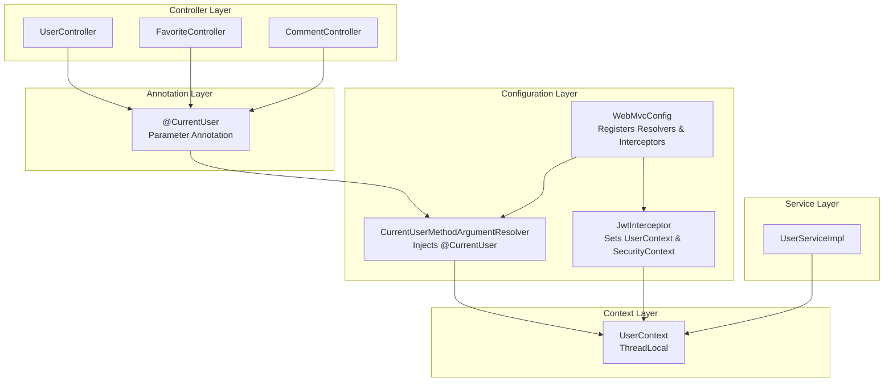
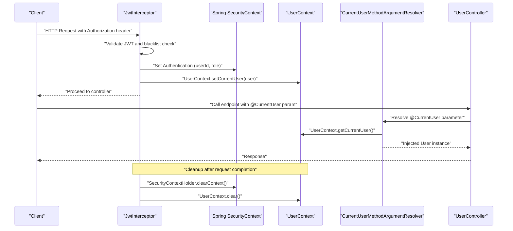
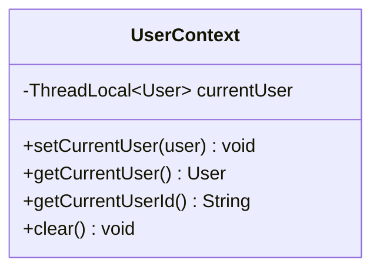
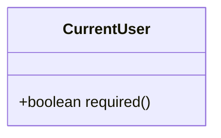
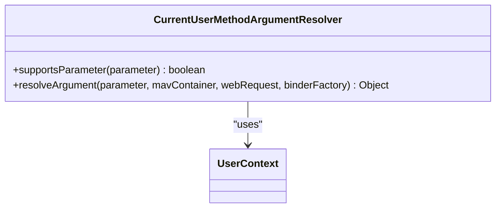
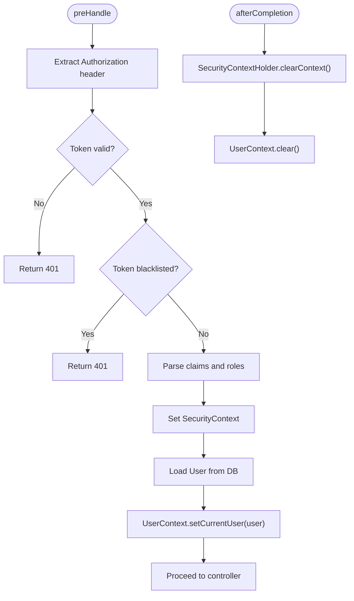
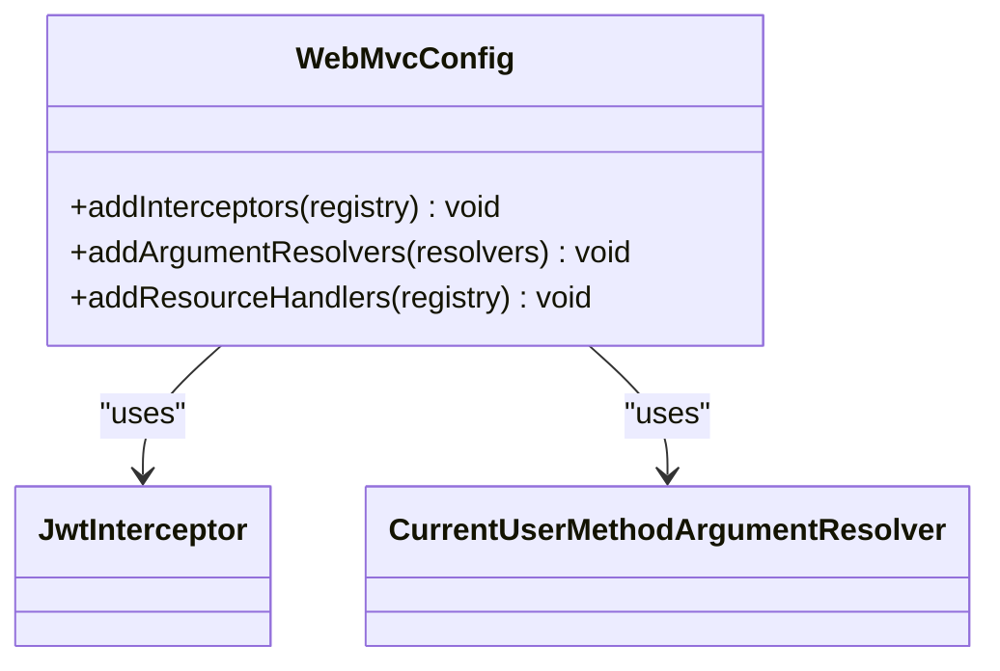
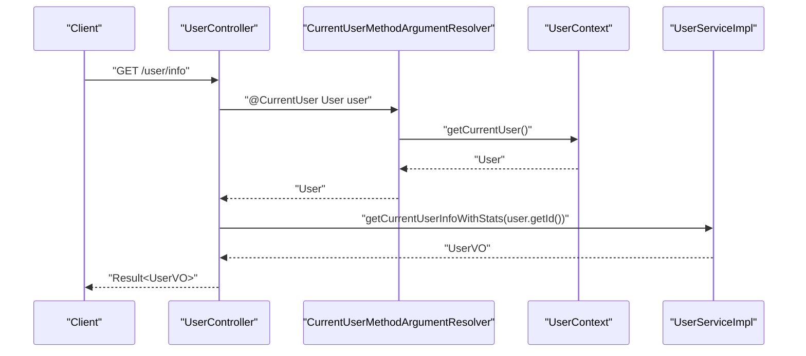
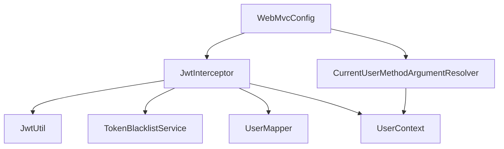

# User Context Management

<cite>
**Referenced Files in This Document**
- [UserContext.java](file://backend/src/main/java/com/movie/backend/context/UserContext.java)
- [CurrentUser.java](file://backend/src/main/java/com/movie/backend/annotation/CurrentUser.java)
- [CurrentUserMethodArgumentResolver.java](file://backend/src/main/java/com/movie/backend/config/CurrentUserMethodArgumentResolver.java)
- [WebMvcConfig.java](file://backend/src/main/java/com/movie/backend/config/WebMvcConfig.java)
- [JwtInterceptor.java](file://backend/src/main/java/com/movie/backend/config/JwtInterceptor.java)
- [UserController.java](file://backend/src/main/java/com/movie/backend/controller/UserController.java)
- [FavoriteController.java](file://backend/src/main/java/com/movie/backend/controller/FavoriteController.java)
- [CommentController.java](file://backend/src/main/java/com/movie/backend/controller/CommentController.java)
- [UserServiceImpl.java](file://backend/src/main/java/com/movie/backend/service/impl/UserServiceImpl.java)
- [application-dev.yml](file://backend/src/main/resources/application-dev.yml)
</cite>

## Table of Contents
1. [Introduction](#introduction)
2. [Project Structure](#project-structure)
3. [Core Components](#core-components)
4. [Architecture Overview](#architecture-overview)
5. [Detailed Component Analysis](#detailed-component-analysis)
6. [Dependency Analysis](#dependency-analysis)
7. [Performance Considerations](#performance-considerations)
8. [Troubleshooting Guide](#troubleshooting-guide)
9. [Conclusion](#conclusion)

## Introduction
This document explains the user context management system in the Movie System, focusing on the ThreadLocal-based UserContext implementation that stores current user information across request processing. It covers the @CurrentUser annotation usage, the MethodArgumentResolver that injects current users into controller methods, the user context lifecycle, thread safety considerations, and practical examples of accessing current user data in controllers, services, and other components. It also addresses memory leak prevention and best practices for user context usage.

## Project Structure
The user context management spans several packages:
- context: Contains the ThreadLocal-based UserContext for storing current user information
- annotation: Defines the @CurrentUser annotation for controller parameter injection
- config: Registers the CurrentUserMethodArgumentResolver and JwtInterceptor, and configures WebMvc
- controller: Demonstrates usage of @CurrentUser in REST endpoints
- service: Implements business logic that can access the current user via UserContext
- resources: Application configuration including JWT settings

**Diagram sources**
- [UserContext.java](file://backend/src/main/java/com/movie/backend/context/UserContext.java#L10-L42)
- [CurrentUser.java](file://backend/src/main/java/com/movie/backend/annotation/CurrentUser.java#L18-L28)
- [CurrentUserMethodArgumentResolver.java](file://backend/src/main/java/com/movie/backend/config/CurrentUserMethodArgumentResolver.java#L17-L49)
- [WebMvcConfig.java](file://backend/src/main/java/com/movie/backend/config/WebMvcConfig.java#L14-L49)
- [JwtInterceptor.java](file://backend/src/main/java/com/movie/backend/config/JwtInterceptor.java#L24-L103)
- [UserController.java](file://backend/src/main/java/com/movie/backend/controller/UserController.java#L24-L129)
- [FavoriteController.java](file://backend/src/main/java/com/movie/backend/controller/FavoriteController.java#L22-L108)
- [CommentController.java](file://backend/src/main/java/com/movie/backend/controller/CommentController.java#L18-L112)
- [UserServiceImpl.java](file://backend/src/main/java/com/movie/backend/service/impl/UserServiceImpl.java#L19-L175)

**Section sources**
- [UserContext.java](file://backend/src/main/java/com/movie/backend/context/UserContext.java#L1-L44)
- [CurrentUser.java](file://backend/src/main/java/com/movie/backend/annotation/CurrentUser.java#L1-L29)
- [CurrentUserMethodArgumentResolver.java](file://backend/src/main/java/com/movie/backend/config/CurrentUserMethodArgumentResolver.java#L1-L51)
- [WebMvcConfig.java](file://backend/src/main/java/com/movie/backend/config/WebMvcConfig.java#L1-L65)
- [JwtInterceptor.java](file://backend/src/main/java/com/movie/backend/config/JwtInterceptor.java#L1-L105)
- [UserController.java](file://backend/src/main/java/com/movie/backend/controller/UserController.java#L1-L130)
- [FavoriteController.java](file://backend/src/main/java/com/movie/backend/controller/FavoriteController.java#L1-L109)
- [CommentController.java](file://backend/src/main/java/com/movie/backend/controller/CommentController.java#L1-L113)
- [UserServiceImpl.java](file://backend/src/main/java/com/movie/backend/service/impl/UserServiceImpl.java#L1-L176)

## Core Components
- UserContext: ThreadLocal-based storage for the current user during a request. Provides methods to set, get, get current user ID, and clear the context.
- @CurrentUser: Annotation placed on controller method parameters to automatically inject the current user resolved from ThreadLocal.
- CurrentUserMethodArgumentResolver: Spring MVC argument resolver that recognizes @CurrentUser parameters and injects the current user from UserContext, with support for required flag.
- JwtInterceptor: Spring MVC interceptor that validates JWT tokens, sets Spring Security context, loads the full User entity, and stores it in UserContext. Also clears contexts after completion to prevent leaks.
- WebMvcConfig: Registers the JwtInterceptor and CurrentUserMethodArgumentResolver, and configures CORS and resource handlers.

**Section sources**
- [UserContext.java](file://backend/src/main/java/com/movie/backend/context/UserContext.java#L10-L42)
- [CurrentUser.java](file://backend/src/main/java/com/movie/backend/annotation/CurrentUser.java#L18-L28)
- [CurrentUserMethodArgumentResolver.java](file://backend/src/main/java/com/movie/backend/config/CurrentUserMethodArgumentResolver.java#L17-L49)
- [JwtInterceptor.java](file://backend/src/main/java/com/movie/backend/config/JwtInterceptor.java#L24-L103)
- [WebMvcConfig.java](file://backend/src/main/java/com/movie/backend/config/WebMvcConfig.java#L14-L49)

## Architecture Overview
The user context lifecycle is orchestrated by the JwtInterceptor and cleaned up by the afterCompletion hook. The CurrentUserMethodArgumentResolver enables automatic injection of the current user into controller methods annotated with @CurrentUser.

**Diagram sources**
- [JwtInterceptor.java](file://backend/src/main/java/com/movie/backend/config/JwtInterceptor.java#L34-L103)
- [CurrentUserMethodArgumentResolver.java](file://backend/src/main/java/com/movie/backend/config/CurrentUserMethodArgumentResolver.java#L24-L49)
- [UserContext.java](file://backend/src/main/java/com/movie/backend/context/UserContext.java#L17-L42)
- [UserController.java](file://backend/src/main/java/com/movie/backend/controller/UserController.java#L46-L53)

## Detailed Component Analysis

### UserContext
- Purpose: Store the current user for the duration of a request using ThreadLocal.
- Methods:
  - setCurrentUser(User): Sets the current user for the current thread.
  - getCurrentUser(): Retrieves the current user.
  - getCurrentUserId(): Safely retrieves the current user ID or null.
  - clear(): Removes the current user to prevent memory leaks.
- Thread Safety: ThreadLocal ensures isolation per thread; however, it must be cleared after each request to avoid leaking references in pooled threads.

**Diagram sources**
- [UserContext.java](file://backend/src/main/java/com/movie/backend/context/UserContext.java#L10-L42)

**Section sources**
- [UserContext.java](file://backend/src/main/java/com/movie/backend/context/UserContext.java#L10-L42)

### @CurrentUser Annotation
- Purpose: Mark controller method parameters to receive the current user automatically injected by the argument resolver.
- Attributes:
  - required: Boolean indicating whether the user must be present; if true and user is null, an exception is thrown by the resolver.

**Diagram sources**
- [CurrentUser.java](file://backend/src/main/java/com/movie/backend/annotation/CurrentUser.java#L18-L28)

**Section sources**
- [CurrentUser.java](file://backend/src/main/java/com/movie/backend/annotation/CurrentUser.java#L18-L28)

### CurrentUserMethodArgumentResolver
- Purpose: Resolve @CurrentUser parameters by fetching the current user from UserContext.
- Behavior:
  - supportsParameter: Checks for @CurrentUser annotation and User parameter type.
  - resolveArgument: Returns the current user from UserContext; throws an exception if required is true and user is null.

**Diagram sources**
- [CurrentUserMethodArgumentResolver.java](file://backend/src/main/java/com/movie/backend/config/CurrentUserMethodArgumentResolver.java#L17-L49)
- [UserContext.java](file://backend/src/main/java/com/movie/backend/context/UserContext.java#L24-L26)

**Section sources**
- [CurrentUserMethodArgumentResolver.java](file://backend/src/main/java/com/movie/backend/config/CurrentUserMethodArgumentResolver.java#L17-L49)

### JwtInterceptor
- Purpose: Validate JWT tokens, set Spring Security context, load the full User entity, and store it in UserContext.
- Lifecycle:
  - preHandle: Extracts token, validates it, checks blacklist, sets SecurityContext, loads User from database, and stores in UserContext.
  - afterCompletion: Clears SecurityContext and UserContext to prevent memory leaks in thread pools.

**Diagram sources**
- [JwtInterceptor.java](file://backend/src/main/java/com/movie/backend/config/JwtInterceptor.java#L34-L103)
- [UserContext.java](file://backend/src/main/java/com/movie/backend/context/UserContext.java#L17-L42)

**Section sources**
- [JwtInterceptor.java](file://backend/src/main/java/com/movie/backend/config/JwtInterceptor.java#L24-L103)

### WebMvcConfig
- Purpose: Registers the JwtInterceptor and CurrentUserMethodArgumentResolver with Spring MVC.
- CORS: Configured for development.
- Resource Handlers: Maps /images/** to a local file system path for uploads.

**Diagram sources**
- [WebMvcConfig.java](file://backend/src/main/java/com/movie/backend/config/WebMvcConfig.java#L14-L63)
- [JwtInterceptor.java](file://backend/src/main/java/com/movie/backend/config/JwtInterceptor.java#L24-L103)
- [CurrentUserMethodArgumentResolver.java](file://backend/src/main/java/com/movie/backend/config/CurrentUserMethodArgumentResolver.java#L17-L49)

**Section sources**
- [WebMvcConfig.java](file://backend/src/main/java/com/movie/backend/config/WebMvcConfig.java#L14-L63)

### Practical Usage Examples

#### Controllers
- UserController demonstrates @CurrentUser usage in endpoints like retrieving current user info and updating avatar.
- FavoriteController and CommentController show mixed usage: some endpoints use @CurrentUser while others extract userId from JWT directly.

**Diagram sources**
- [UserController.java](file://backend/src/main/java/com/movie/backend/controller/UserController.java#L46-L53)
- [CurrentUserMethodArgumentResolver.java](file://backend/src/main/java/com/movie/backend/config/CurrentUserMethodArgumentResolver.java#L34-L49)
- [UserContext.java](file://backend/src/main/java/com/movie/backend/context/UserContext.java#L24-L26)
- [UserServiceImpl.java](file://backend/src/main/java/com/movie/backend/service/impl/UserServiceImpl.java#L130-L149)

**Section sources**
- [UserController.java](file://backend/src/main/java/com/movie/backend/controller/UserController.java#L46-L75)
- [FavoriteController.java](file://backend/src/main/java/com/movie/backend/controller/FavoriteController.java#L28-L53)
- [CommentController.java](file://backend/src/main/java/com/movie/backend/controller/CommentController.java#L50-L69)
- [UserServiceImpl.java](file://backend/src/main/java/com/movie/backend/service/impl/UserServiceImpl.java#L130-L149)

#### Services
- Services can access the current user via UserContext.getCurrentUserId() or UserContext.getCurrentUser() when needed, complementing controller injection.

**Section sources**
- [UserContext.java](file://backend/src/main/java/com/movie/backend/context/UserContext.java#L24-L34)

## Dependency Analysis
- JwtInterceptor depends on:
  - JwtUtil for token validation and parsing
  - TokenBlacklistService for blacklist checks
  - UserMapper for loading the full User entity
  - UserContext for storing the current user
- CurrentUserMethodArgumentResolver depends on:
  - UserContext for retrieving the current user
  - @CurrentUser annotation metadata
- WebMvcConfig registers:
  - JwtInterceptor for all paths except excluded ones
  - CurrentUserMethodArgumentResolver for parameter resolution

**Diagram sources**
- [JwtInterceptor.java](file://backend/src/main/java/com/movie/backend/config/JwtInterceptor.java#L27-L86)
- [CurrentUserMethodArgumentResolver.java](file://backend/src/main/java/com/movie/backend/config/CurrentUserMethodArgumentResolver.java#L17-L49)
- [WebMvcConfig.java](file://backend/src/main/java/com/movie/backend/config/WebMvcConfig.java#L20-L49)

**Section sources**
- [JwtInterceptor.java](file://backend/src/main/java/com/movie/backend/config/JwtInterceptor.java#L27-L86)
- [CurrentUserMethodArgumentResolver.java](file://backend/src/main/java/com/movie/backend/config/CurrentUserMethodArgumentResolver.java#L17-L49)
- [WebMvcConfig.java](file://backend/src/main/java/com/movie/backend/config/WebMvcConfig.java#L20-L49)

## Performance Considerations
- ThreadLocal overhead is minimal compared to repeated JWT parsing and database lookups.
- Ensure UserContext.clear() is always executed after each request to prevent memory leaks in thread pools.
- Keep User objects lightweight; only load necessary fields from the database in JwtInterceptor.
- Consider caching frequently accessed user data at the service layer if appropriate, but invalidate on sensitive changes (e.g., password updates).

## Troubleshooting Guide
Common issues and resolutions:
- 401 Unauthorized on protected endpoints:
  - Verify Authorization header format and token validity.
  - Confirm token is not blacklisted.
  - Check JwtInterceptor preHandle logic for early exits.
- @CurrentUser parameter resolves to null unexpectedly:
  - Ensure the endpoint is covered by JwtInterceptor (not excluded).
  - Confirm the @CurrentUser parameter type is User and annotation presence.
  - Verify the resolver is registered in WebMvcConfig.
- Memory leaks or stale user data:
  - Ensure afterCompletion clears both SecurityContext and UserContext.
  - Avoid manual manipulation of ThreadLocal outside the interceptor lifecycle.
- Token expiration and refresh:
  - Use refresh endpoints to obtain new access tokens when needed.
  - Application configuration defines JWT expiration settings.

**Section sources**
- [JwtInterceptor.java](file://backend/src/main/java/com/movie/backend/config/JwtInterceptor.java#L47-L92)
- [CurrentUserMethodArgumentResolver.java](file://backend/src/main/java/com/movie/backend/config/CurrentUserMethodArgumentResolver.java#L43-L46)
- [WebMvcConfig.java](file://backend/src/main/java/com/movie/backend/config/WebMvcConfig.java#L36-L40)
- [application-dev.yml](file://backend/src/main/resources/application-dev.yml#L62-L67)

## Conclusion
The Movie System’s user context management leverages a clean separation of concerns:
- JwtInterceptor handles authentication and populates UserContext.
- CurrentUserMethodArgumentResolver enables seamless injection of the current user into controllers.
- WebMvcConfig centralizes registration of interceptors and resolvers.
- Best practices include strict lifecycle management (set at request start, clear at completion) and careful use of @CurrentUser to avoid unnecessary coupling.