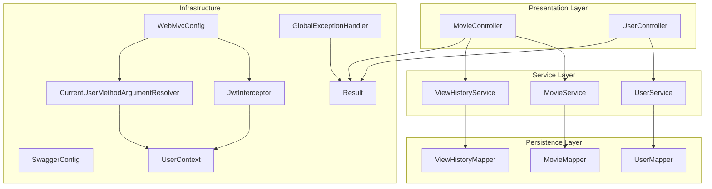
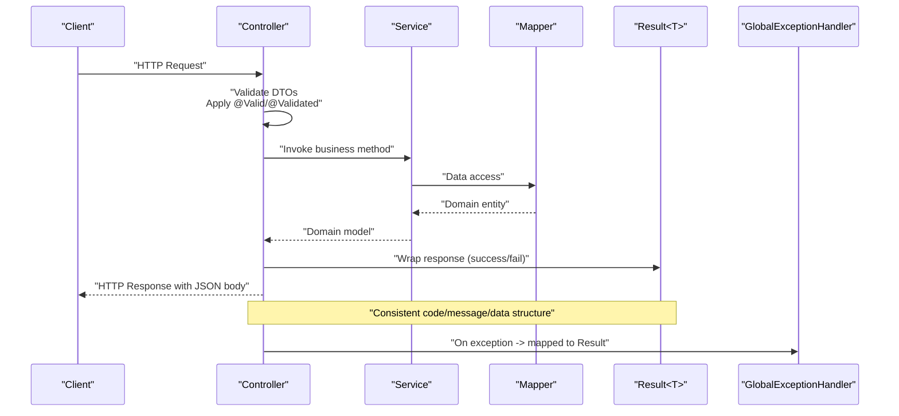
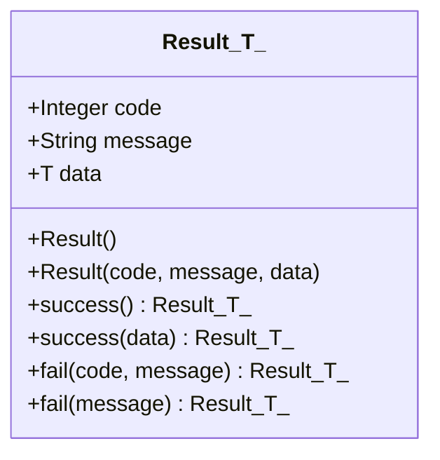
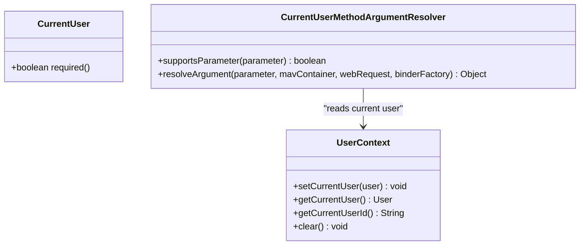
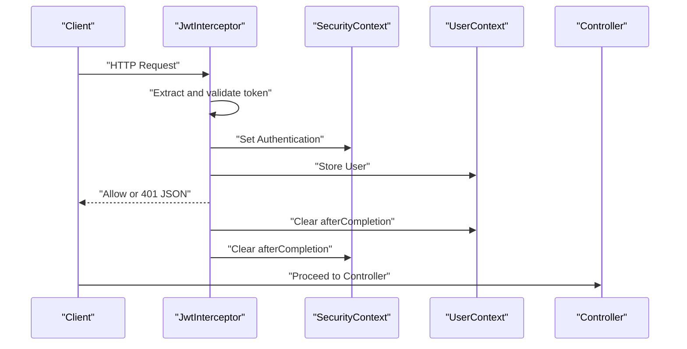
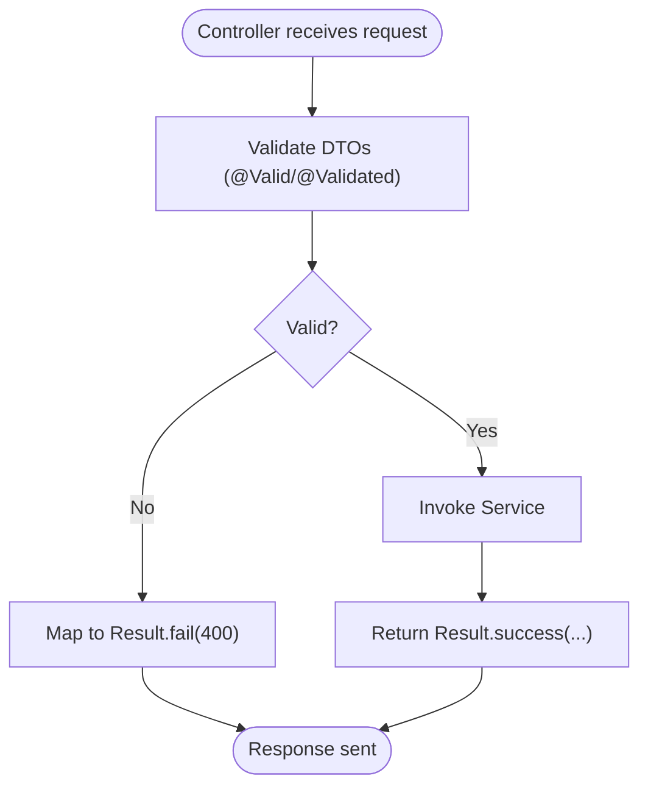
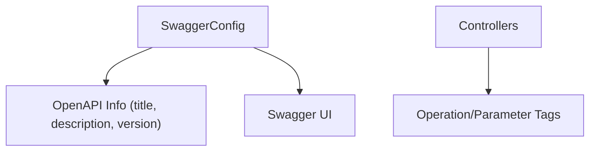
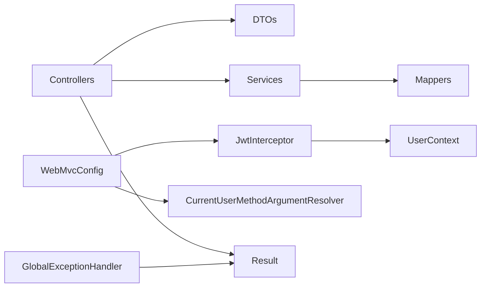

# API Design Patterns

<cite>
**Referenced Files in This Document**
- [Result.java](file://backend/src/main/java/com/movie/backend/common/Result.java)
- [CurrentUser.java](file://backend/src/main/java/com/movie/backend/annotation/CurrentUser.java)
- [CurrentUserMethodArgumentResolver.java](file://backend/src/main/java/com/movie/backend/config/CurrentUserMethodArgumentResolver.java)
- [GlobalExceptionHandler.java](file://backend/src/main/java/com/movie/backend/exception/GlobalExceptionHandler.java)
- [WebMvcConfig.java](file://backend/src/main/java/com/movie/backend/config/WebMvcConfig.java)
- [JwtInterceptor.java](file://backend/src/main/java/com/movie/backend/config/JwtInterceptor.java)
- [UserContext.java](file://backend/src/main/java/com/movie/backend/context/UserContext.java)
- [SwaggerConfig.java](file://backend/src/main/java/com/movie/backend/config/SwaggerConfig.java)
- [MovieController.java](file://backend/src/main/java/com/movie/backend/controller/MovieController.java)
- [UserController.java](file://backend/src/main/java/com/movie/backend/controller/UserController.java)
- [PageRequest.java](file://backend/src/main/java/com/movie/backend/dto/PageRequest.java)
- [LoginDTO.java](file://backend/src/main/java/com/movie/backend/dto/LoginDTO.java)
- [RegisterDTO.java](file://backend/src/main/java/com/movie/backend/dto/RegisterDTO.java)
- [application.yml](file://backend/src/main/resources/application.yml)
- [pom.xml](file://backend/pom.xml)
</cite>

## Table of Contents
1. [Introduction](#introduction)
2. [Project Structure](#project-structure)
3. [Core Components](#core-components)
4. [Architecture Overview](#architecture-overview)
5. [Detailed Component Analysis](#detailed-component-analysis)
6. [Dependency Analysis](#dependency-analysis)
7. [Performance Considerations](#performance-considerations)
8. [Troubleshooting Guide](#troubleshooting-guide)
9. [Conclusion](#conclusion)
10. [Appendices](#appendices)

## Introduction
This document describes the RESTful API design patterns and conventions implemented in the backend service. It focuses on the controller layer architecture, request/response handling, parameter binding strategies, the unified result wrapper pattern, custom annotations, and global request processing. It also documents API versioning, error response formatting, status code conventions, validation and input sanitization strategies, and API documentation practices. Examples of CRUD operations, batch processing, and resource linking patterns are included to illustrate practical usage.

## Project Structure
The backend follows a layered architecture with clear separation of concerns:
- Controllers expose REST endpoints under a base path and use DTOs for request payloads.
- Services encapsulate business logic and coordinate with mappers and external systems.
- Configuration integrates interceptors, CORS, argument resolvers, and Swagger/OpenAPI.
- Common utilities provide a unified response wrapper and shared validation helpers.
- Exceptions are centrally handled via a global exception handler.

**Diagram sources**
- [MovieController.java](file://backend/src/main/java/com/movie/backend/controller/MovieController.java#L1-L209)
- [UserController.java](file://backend/src/main/java/com/movie/backend/controller/UserController.java#L1-L130)
- [WebMvcConfig.java](file://backend/src/main/java/com/movie/backend/config/WebMvcConfig.java#L1-L65)
- [JwtInterceptor.java](file://backend/src/main/java/com/movie/backend/config/JwtInterceptor.java#L1-L105)
- [CurrentUserMethodArgumentResolver.java](file://backend/src/main/java/com/movie/backend/config/CurrentUserMethodArgumentResolver.java#L1-L51)
- [UserContext.java](file://backend/src/main/java/com/movie/backend/context/UserContext.java#L1-L44)
- [GlobalExceptionHandler.java](file://backend/src/main/java/com/movie/backend/exception/GlobalExceptionHandler.java#L1-L102)
- [Result.java](file://backend/src/main/java/com/movie/backend/common/Result.java#L1-L43)

**Section sources**
- [MovieController.java](file://backend/src/main/java/com/movie/backend/controller/MovieController.java#L1-L209)
- [UserController.java](file://backend/src/main/java/com/movie/backend/controller/UserController.java#L1-L130)
- [WebMvcConfig.java](file://backend/src/main/java/com/movie/backend/config/WebMvcConfig.java#L1-L65)
- [JwtInterceptor.java](file://backend/src/main/java/com/movie/backend/config/JwtInterceptor.java#L1-L105)
- [CurrentUserMethodArgumentResolver.java](file://backend/src/main/java/com/movie/backend/config/CurrentUserMethodArgumentResolver.java#L1-L51)
- [UserContext.java](file://backend/src/main/java/com/movie/backend/context/UserContext.java#L1-L44)
- [GlobalExceptionHandler.java](file://backend/src/main/java/com/movie/backend/exception/GlobalExceptionHandler.java#L1-L102)
- [Result.java](file://backend/src/main/java/com/movie/backend/common/Result.java#L1-L43)
- [SwaggerConfig.java](file://backend/src/main/java/com/movie/backend/config/SwaggerConfig.java#L1-L19)
- [application.yml](file://backend/src/main/resources/application.yml#L1-L4)

## Core Components
- Unified Result Wrapper: A generic response envelope standardizes success and failure responses with code, message, and data payload. Convenience factory methods enforce a 200 success code for successful outcomes and allow custom codes for errors.
- Global Exception Handling: Centralized handling of validation, binding, runtime, and IO exceptions, returning consistent error responses with appropriate HTTP codes.
- Parameter Binding and Validation: DTOs define validation constraints; Spring’s validation triggers automatically for request bodies and path/query parameters. Custom argument resolver injects the current user into controller method parameters via a custom annotation.
- Interceptor and Security Context: A JWT interceptor validates tokens, sets Spring Security context, and stores user info in a thread-local context for easy access.
- API Documentation: OpenAPI/Swagger is configured to publish API metadata with versioning information.

Key implementation references:
- Unified result wrapper: [Result.java](file://backend/src/main/java/com/movie/backend/common/Result.java#L1-L43)
- Global exception handling: [GlobalExceptionHandler.java](file://backend/src/main/java/com/movie/backend/exception/GlobalExceptionHandler.java#L1-L102)
- Custom annotation and argument resolver: [CurrentUser.java](file://backend/src/main/java/com/movie/backend/annotation/CurrentUser.java#L1-L29), [CurrentUserMethodArgumentResolver.java](file://backend/src/main/java/com/movie/backend/config/CurrentUserMethodArgumentResolver.java#L1-L51)
- JWT interceptor and user context: [JwtInterceptor.java](file://backend/src/main/java/com/movie/backend/config/JwtInterceptor.java#L1-L105), [UserContext.java](file://backend/src/main/java/com/movie/backend/context/UserContext.java#L1-L44)
- Web MVC configuration: [WebMvcConfig.java](file://backend/src/main/java/com/movie/backend/config/WebMvcConfig.java#L1-L65)
- Swagger configuration: [SwaggerConfig.java](file://backend/src/main/java/com/movie/backend/config/SwaggerConfig.java#L1-L19)

**Section sources**
- [Result.java](file://backend/src/main/java/com/movie/backend/common/Result.java#L1-L43)
- [GlobalExceptionHandler.java](file://backend/src/main/java/com/movie/backend/exception/GlobalExceptionHandler.java#L1-L102)
- [CurrentUser.java](file://backend/src/main/java/com/movie/backend/annotation/CurrentUser.java#L1-L29)
- [CurrentUserMethodArgumentResolver.java](file://backend/src/main/java/com/movie/backend/config/CurrentUserMethodArgumentResolver.java#L1-L51)
- [JwtInterceptor.java](file://backend/src/main/java/com/movie/backend/config/JwtInterceptor.java#L1-L105)
- [UserContext.java](file://backend/src/main/java/com/movie/backend/context/UserContext.java#L1-L44)
- [WebMvcConfig.java](file://backend/src/main/java/com/movie/backend/config/WebMvcConfig.java#L1-L65)
- [SwaggerConfig.java](file://backend/src/main/java/com/movie/backend/config/SwaggerConfig.java#L1-L19)

## Architecture Overview
The API architecture enforces a clean separation between presentation, business logic, persistence, and infrastructure concerns. Controllers focus on routing and response shaping, while services encapsulate domain logic. Validation and security are enforced at the edges (interceptor and DTO constraints), and responses are standardized through the unified result wrapper.

**Diagram sources**
- [MovieController.java](file://backend/src/main/java/com/movie/backend/controller/MovieController.java#L1-L209)
- [UserController.java](file://backend/src/main/java/com/movie/backend/controller/UserController.java#L1-L130)
- [GlobalExceptionHandler.java](file://backend/src/main/java/com/movie/backend/exception/GlobalExceptionHandler.java#L1-L102)
- [Result.java](file://backend/src/main/java/com/movie/backend/common/Result.java#L1-L43)

## Detailed Component Analysis

### Unified Result Wrapper Pattern
- Purpose: Provide a consistent response contract across all endpoints.
- Structure: code, message, data.
- Conventions:
  - Success: code 200 with optional data payload.
  - Failure: explicit code and message; 500 for unexpected server errors.
- Usage: Controllers wrap results using factory methods; global exception handler ensures failures are consistently formatted.

**Diagram sources**
- [Result.java](file://backend/src/main/java/com/movie/backend/common/Result.java#L1-L43)

**Section sources**
- [Result.java](file://backend/src/main/java/com/movie/backend/common/Result.java#L1-L43)

### Custom Annotation and Argument Resolver
- @CurrentUser: Marks a User parameter to be auto-injected from the current request’s user context.
- CurrentUserMethodArgumentResolver: Resolves the parameter by fetching the user from UserContext, honoring the required flag.
- Integration: Registered in WebMvcConfig and used in controllers to avoid manual token parsing.

**Diagram sources**
- [CurrentUser.java](file://backend/src/main/java/com/movie/backend/annotation/CurrentUser.java#L1-L29)
- [CurrentUserMethodArgumentResolver.java](file://backend/src/main/java/com/movie/backend/config/CurrentUserMethodArgumentResolver.java#L1-L51)
- [UserContext.java](file://backend/src/main/java/com/movie/backend/context/UserContext.java#L1-L44)

**Section sources**
- [CurrentUser.java](file://backend/src/main/java/com/movie/backend/annotation/CurrentUser.java#L1-L29)
- [CurrentUserMethodArgumentResolver.java](file://backend/src/main/java/com/movie/backend/config/CurrentUserMethodArgumentResolver.java#L1-L51)
- [UserContext.java](file://backend/src/main/java/com/movie/backend/context/UserContext.java#L1-L44)
- [WebMvcConfig.java](file://backend/src/main/java/com/movie/backend/config/WebMvcConfig.java#L1-L65)

### Global Request Processing and Security
- JWT Interceptor:
  - Extracts Authorization header, validates token, checks blacklist, parses claims, sets Spring Security context, and stores user in UserContext.
  - Returns 401 with JSON body on failures.
- After completion cleanup clears SecurityContext and UserContext to prevent leaks.
- WebMvcConfig:
  - Registers JwtInterceptor globally except for public endpoints.
  - Adds CORS, custom argument resolvers, and static resource mapping for images.

**Diagram sources**
- [JwtInterceptor.java](file://backend/src/main/java/com/movie/backend/config/JwtInterceptor.java#L1-L105)
- [UserContext.java](file://backend/src/main/java/com/movie/backend/context/UserContext.java#L1-L44)
- [WebMvcConfig.java](file://backend/src/main/java/com/movie/backend/config/WebMvcConfig.java#L1-L65)

**Section sources**
- [JwtInterceptor.java](file://backend/src/main/java/com/movie/backend/config/JwtInterceptor.java#L1-L105)
- [UserContext.java](file://backend/src/main/java/com/movie/backend/context/UserContext.java#L1-L44)
- [WebMvcConfig.java](file://backend/src/main/java/com/movie/backend/config/WebMvcConfig.java#L1-L65)

### Request/Response Handling and Validation
- DTOs define validation constraints for request payloads and parameters.
- Controllers apply @Valid/@Validated to trigger validation for request bodies and path/query parameters.
- GlobalExceptionHandler maps validation and binding errors to consistent Result.fail responses with 400.

**Diagram sources**
- [GlobalExceptionHandler.java](file://backend/src/main/java/com/movie/backend/exception/GlobalExceptionHandler.java#L1-L102)
- [MovieController.java](file://backend/src/main/java/com/movie/backend/controller/MovieController.java#L1-L209)
- [UserController.java](file://backend/src/main/java/com/movie/backend/controller/UserController.java#L1-L130)

**Section sources**
- [LoginDTO.java](file://backend/src/main/java/com/movie/backend/dto/LoginDTO.java#L1-L19)
- [RegisterDTO.java](file://backend/src/main/java/com/movie/backend/dto/RegisterDTO.java#L1-L34)
- [PageRequest.java](file://backend/src/main/java/com/movie/backend/dto/PageRequest.java#L1-L25)
- [GlobalExceptionHandler.java](file://backend/src/main/java/com/movie/backend/exception/GlobalExceptionHandler.java#L1-L102)
- [MovieController.java](file://backend/src/main/java/com/movie/backend/controller/MovieController.java#L1-L209)
- [UserController.java](file://backend/src/main/java/com/movie/backend/controller/UserController.java#L1-L130)

### API Versioning and Documentation
- Versioning: OpenAPI info includes a version field for discoverability.
- Documentation: Swagger UI and OpenAPI are enabled via springdoc-openapi.
- Controller-level documentation: Tags and operation summaries describe endpoint purpose and parameters.

**Diagram sources**
- [SwaggerConfig.java](file://backend/src/main/java/com/movie/backend/config/SwaggerConfig.java#L1-L19)
- [MovieController.java](file://backend/src/main/java/com/movie/backend/controller/MovieController.java#L1-L209)
- [UserController.java](file://backend/src/main/java/com/movie/backend/controller/UserController.java#L1-L130)

**Section sources**
- [SwaggerConfig.java](file://backend/src/main/java/com/movie/backend/config/SwaggerConfig.java#L1-L19)
- [MovieController.java](file://backend/src/main/java/com/movie/backend/controller/MovieController.java#L1-L209)
- [UserController.java](file://backend/src/main/java/com/movie/backend/controller/UserController.java#L1-L130)

### Status Codes and Error Formatting
- Success: 200 with Result.success.
- Client errors: 400 via GlobalExceptionHandler for validation/binding/constraint violations.
- Unauthorized: 401 via JwtInterceptor and GlobalExceptionHandler for invalid/unauthorized requests.
- Server errors: 500 via GlobalExceptionHandler for unhandled runtime/system errors.
- Not found: Controllers return Result.fail with 404 when resources are missing.

**Section sources**
- [GlobalExceptionHandler.java](file://backend/src/main/java/com/movie/backend/exception/GlobalExceptionHandler.java#L1-L102)
- [JwtInterceptor.java](file://backend/src/main/java/com/movie/backend/config/JwtInterceptor.java#L1-L105)
- [MovieController.java](file://backend/src/main/java/com/movie/backend/controller/MovieController.java#L1-L209)
- [UserController.java](file://backend/src/main/java/com/movie/backend/controller/UserController.java#L1-L130)

### CRUD Operations, Batch Processing, and Resource Linking
- CRUD examples:
  - Retrieve details: GET endpoints with path variables and Result wrapping.
  - Search/filter: POST with DTOs and pagination support.
  - Lists with paging: GET with page/size parameters and Result wrapping.
- Batch processing: Not explicitly implemented in the examined controllers; consider adding bulk endpoints with explicit batch DTOs and Result wrappers.
- Resource linking: Controllers return domain entities or DTOs; navigation between related resources can be achieved via hypermedia links or separate endpoints as needed.

Examples by reference:
- Movie retrieval and search: [MovieController.java](file://backend/src/main/java/com/movie/backend/controller/MovieController.java#L1-L209)
- User registration/login/info: [UserController.java](file://backend/src/main/java/com/movie/backend/controller/UserController.java#L1-L130)
- Pagination DTO: [PageRequest.java](file://backend/src/main/java/com/movie/backend/dto/PageRequest.java#L1-L25)

**Section sources**
- [MovieController.java](file://backend/src/main/java/com/movie/backend/controller/MovieController.java#L1-L209)
- [UserController.java](file://backend/src/main/java/com/movie/backend/controller/UserController.java#L1-L130)
- [PageRequest.java](file://backend/src/main/java/com/movie/backend/dto/PageRequest.java#L1-L25)

## Dependency Analysis
The system exhibits low coupling and high cohesion:
- Controllers depend on services and DTOs; services depend on mappers.
- Infrastructure components (interceptor, resolver, context, exception handler) are registered centrally and reused across controllers.
- Validation is enforced at the boundaries via DTO constraints and Spring validation.

**Diagram sources**
- [WebMvcConfig.java](file://backend/src/main/java/com/movie/backend/config/WebMvcConfig.java#L1-L65)
- [JwtInterceptor.java](file://backend/src/main/java/com/movie/backend/config/JwtInterceptor.java#L1-L105)
- [CurrentUserMethodArgumentResolver.java](file://backend/src/main/java/com/movie/backend/config/CurrentUserMethodArgumentResolver.java#L1-L51)
- [UserContext.java](file://backend/src/main/java/com/movie/backend/context/UserContext.java#L1-L44)
- [GlobalExceptionHandler.java](file://backend/src/main/java/com/movie/backend/exception/GlobalExceptionHandler.java#L1-L102)
- [Result.java](file://backend/src/main/java/com/movie/backend/common/Result.java#L1-L43)

**Section sources**
- [WebMvcConfig.java](file://backend/src/main/java/com/movie/backend/config/WebMvcConfig.java#L1-L65)
- [JwtInterceptor.java](file://backend/src/main/java/com/movie/backend/config/JwtInterceptor.java#L1-L105)
- [CurrentUserMethodArgumentResolver.java](file://backend/src/main/java/com/movie/backend/config/CurrentUserMethodArgumentResolver.java#L1-L51)
- [UserContext.java](file://backend/src/main/java/com/movie/backend/context/UserContext.java#L1-L44)
- [GlobalExceptionHandler.java](file://backend/src/main/java/com/movie/backend/exception/GlobalExceptionHandler.java#L1-L102)
- [Result.java](file://backend/src/main/java/com/movie/backend/common/Result.java#L1-L43)

## Performance Considerations
- Validation overhead: Keep DTO constraints concise; avoid overly complex nested validations.
- Pagination: Prefer PageRequest defaults aligned with database indexing to minimize scan costs.
- Interceptor efficiency: Ensure token parsing and blacklist checks are fast; cache frequently accessed user roles if needed.
- Static resources: Serving images from local disk is straightforward; consider CDN or optimized storage for production scale.

## Troubleshooting Guide
- 401 Unauthorized:
  - Verify Authorization header format and token validity.
  - Confirm token is not blacklisted.
  - Check interceptor logs for parse/validation failures.
- 400 Bad Request:
  - Inspect validation messages returned in the error response.
  - Ensure DTO fields meet constraints (min/max sizes, required fields).
- 500 Internal Server Error:
  - Review global exception handler logs for unhandled exceptions.
  - Confirm proper Result wrapping in controllers.
- CORS issues:
  - Validate allowed origins/methods/headers in WebMvcConfig.

**Section sources**
- [JwtInterceptor.java](file://backend/src/main/java/com/movie/backend/config/JwtInterceptor.java#L1-L105)
- [GlobalExceptionHandler.java](file://backend/src/main/java/com/movie/backend/exception/GlobalExceptionHandler.java#L1-L102)
- [WebMvcConfig.java](file://backend/src/main/java/com/movie/backend/config/WebMvcConfig.java#L1-L65)

## Conclusion
The backend implements robust RESTful API design patterns with a unified response wrapper, centralized validation and exception handling, secure JWT-based authentication, and comprehensive API documentation. Controllers adhere to clear conventions for request/response handling, parameter binding, and pagination. The architecture supports scalable enhancements such as batch processing and advanced resource linking while maintaining consistent error handling and status code conventions.

## Appendices

### API Documentation Practices
- Use OpenAPI/Swagger to document endpoints, parameters, and responses.
- Annotate controllers with tags and operation descriptions.
- Include example values for request/response fields.

**Section sources**
- [SwaggerConfig.java](file://backend/src/main/java/com/movie/backend/config/SwaggerConfig.java#L1-L19)
- [MovieController.java](file://backend/src/main/java/com/movie/backend/controller/MovieController.java#L1-L209)
- [UserController.java](file://backend/src/main/java/com/movie/backend/controller/UserController.java#L1-L130)

### Environment and Dependencies
- Application profile activation and dependency management are defined in Maven and Spring configuration files.

**Section sources**
- [application.yml](file://backend/src/main/resources/application.yml#L1-L4)
- [pom.xml](file://backend/pom.xml#L1-L300)