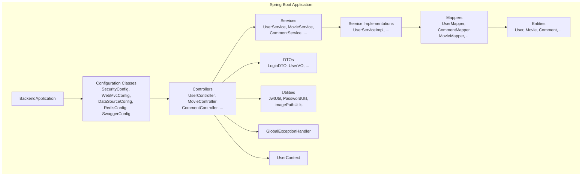
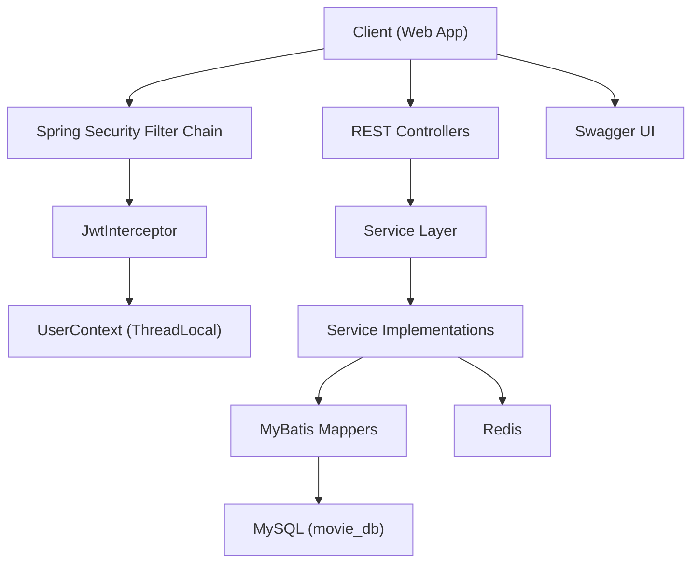
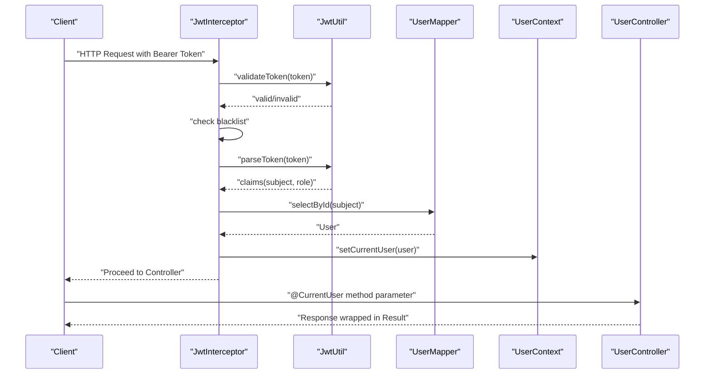
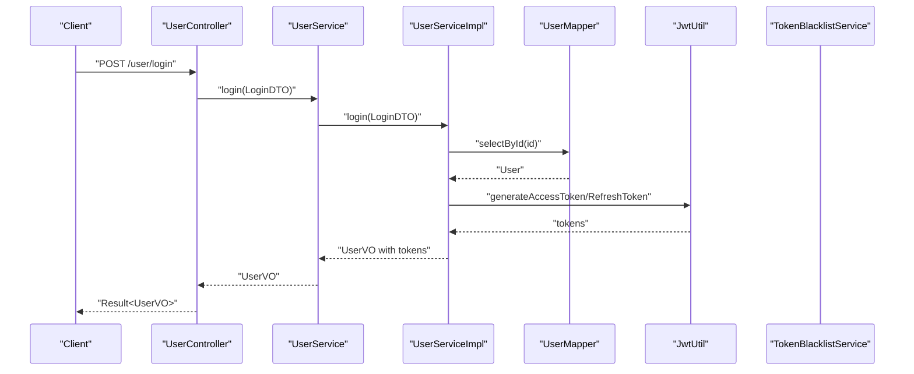
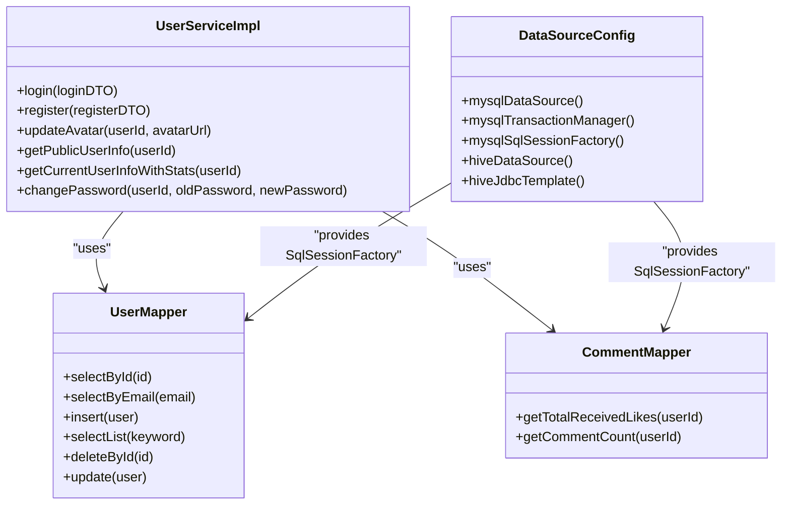
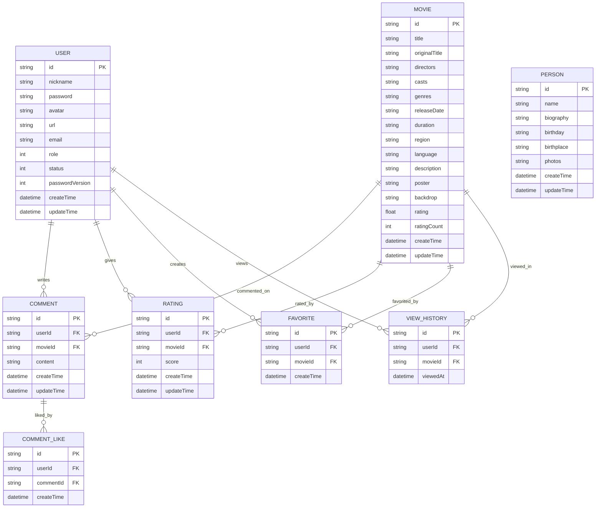

# Backend Architecture

<cite>
**Referenced Files in This Document**
- [BackendApplication.java](file://backend/src/main/java/com/movie/backend/BackendApplication.java)
- [pom.xml](file://backend/pom.xml)
- [application.yml](file://backend/src/main/resources/application.yml)
- [application-dev.yml](file://backend/src/main/resources/application-dev.yml)
- [SecurityConfig.java](file://backend/src/main/java/com/movie/backend/config/SecurityConfig.java)
- [JwtInterceptor.java](file://backend/src/main/java/com/movie/backend/config/JwtInterceptor.java)
- [WebMvcConfig.java](file://backend/src/main/java/com/movie/backend/config/WebMvcConfig.java)
- [RedisConfig.java](file://backend/src/main/java/com/movie/backend/config/RedisConfig.java)
- [DataSourceConfig.java](file://backend/src/main/java/com/movie/backend/config/DataSourceConfig.java)
- [SwaggerConfig.java](file://backend/src/main/java/com/movie/backend/config/SwaggerConfig.java)
- [UserController.java](file://backend/src/main/java/com/movie/backend/controller/UserController.java)
- [UserServiceImpl.java](file://backend/src/main/java/com/movie/backend/service/impl/UserServiceImpl.java)
- [UserMapper.java](file://backend/src/main/java/com/movie/backend/mapper/UserMapper.java)
- [User.java](file://backend/src/main/java/com/movie/backend/entity/User.java)
- [LoginDTO.java](file://backend/src/main/java/com/movie/backend/dto/LoginDTO.java)
- [GlobalExceptionHandler.java](file://backend/src/main/java/com/movie/backend/exception/GlobalExceptionHandler.java)
- [TokenBlacklistServiceImpl.java](file://backend/src/main/java/com/movie/backend/service/impl/TokenBlacklistServiceImpl.java)
- [TokenBlacklistService.java](file://backend/src/main/java/com/movie/backend/service/TokenBlacklistService.java)
- [UserContext.java](file://backend/src/main/java/com/movie/backend/context/UserContext.java)
- [CurrentUser.java](file://backend/src/main/java/com/movie/backend/annotation/CurrentUser.java)
- [CurrentUserMethodArgumentResolver.java](file://backend/src/main/java/com/movie/backend/config/CurrentUserMethodArgumentResolver.java)
- [JwtUtil.java](file://backend/src/main/java/com/movie/backend/utils/JwtUtil.java)
- [PasswordUtil.java](file://backend/src/main/java/com/movie/backend/utils/PasswordUtil.java)
- [ImagePathUtils.java](file://backend/src/main/java/com/movie/backend/utils/ImagePathUtils.java)
- [ImagePathSerializer.java](file://backend/src/main/java/com/movie/backend/config/ImagePathSerializer.java)
- [CommentMapper.java](file://backend/src/main/java/com/movie/backend/mapper/CommentMapper.java)
- [CommentMapper.xml](file://backend/src/main/resources/mapper/CommentMapper.xml)
- [UserMapper.xml](file://backend/src/main/resources/mapper/UserMapper.xml)
- [movie_db.sql](file://backend/sql/movie_db.sql)
</cite>

## Table of Contents
1. [Introduction](#introduction)
2. [Project Structure](#project-structure)
3. [Core Components](#core-components)
4. [Architecture Overview](#architecture-overview)
5. [Detailed Component Analysis](#detailed-component-analysis)
6. [Dependency Analysis](#dependency-analysis)
7. [Performance Considerations](#performance-considerations)
8. [Troubleshooting Guide](#troubleshooting-guide)
9. [Conclusion](#conclusion)
10. [Appendices](#appendices)

## Introduction
This document describes the backend architecture of a Spring Boot-based movie review system. It focuses on high-level design patterns (layered architecture, Model-View-Controller, and dependency injection), component interactions across controllers, services, mappers, and database layers, and technical decisions around MyBatis ORM, JWT authentication, and RESTful API design. It also covers infrastructure requirements, security considerations, integration patterns, cross-cutting concerns (logging, error handling, performance), technology stack, third-party dependencies, and configuration management.

## Project Structure
The backend follows a conventional Spring Boot layout with layered packages:
- config: Spring Security, Web MVC, MyBatis, Redis, and Swagger configurations
- controller: REST endpoints grouped by feature (e.g., user, movie, comment)
- service: business logic with service interfaces and implementations
- mapper: MyBatis mappers and XML SQL mappings
- entity: JPA-style entities (MyBatis POJOs)
- dto: request/response transfer objects
- utils: JWT, password hashing, image path utilities
- exception: global exception handling
- context: thread-local user context
- annotation: custom argument resolver support

**Diagram sources**
- [BackendApplication.java](file://backend/src/main/java/com/movie/backend/BackendApplication.java#L1-L17)
- [SecurityConfig.java](file://backend/src/main/java/com/movie/backend/config/SecurityConfig.java#L1-L51)
- [WebMvcConfig.java](file://backend/src/main/java/com/movie/backend/config/WebMvcConfig.java#L1-L65)
- [DataSourceConfig.java](file://backend/src/main/java/com/movie/backend/config/DataSourceConfig.java#L1-L62)
- [RedisConfig.java](file://backend/src/main/java/com/movie/backend/config/RedisConfig.java#L1-L42)
- [SwaggerConfig.java](file://backend/src/main/java/com/movie/backend/config/SwaggerConfig.java#L1-L19)
- [UserController.java](file://backend/src/main/java/com/movie/backend/controller/UserController.java#L1-L130)
- [UserServiceImpl.java](file://backend/src/main/java/com/movie/backend/service/impl/UserServiceImpl.java#L1-L176)
- [UserMapper.java](file://backend/src/main/java/com/movie/backend/mapper/UserMapper.java#L1-L41)
- [User.java](file://backend/src/main/java/com/movie/backend/entity/User.java#L1-L46)
- [LoginDTO.java](file://backend/src/main/java/com/movie/backend/dto/LoginDTO.java#L1-L19)
- [GlobalExceptionHandler.java](file://backend/src/main/java/com/movie/backend/exception/GlobalExceptionHandler.java#L1-L200)
- [UserContext.java](file://backend/src/main/java/com/movie/backend/context/UserContext.java#L1-L200)

**Section sources**
- [BackendApplication.java](file://backend/src/main/java/com/movie/backend/BackendApplication.java#L1-L17)
- [pom.xml](file://backend/pom.xml#L1-L300)
- [application.yml](file://backend/src/main/resources/application.yml#L1-L4)
- [application-dev.yml](file://backend/src/main/resources/application-dev.yml#L1-L67)

## Core Components
- Layered Architecture: Clear separation between presentation (controllers), business logic (services), persistence (mappers), and data models (entities).
- MVC Pattern: REST controllers handle HTTP requests, delegate to services, and return standardized Result envelopes.
- Dependency Injection: Spring manages beans via @Service, @Repository, @Autowired, and configuration classes.
- MyBatis ORM: XML mappers and DAO-like interfaces for SQL operations; CamelCase mapping enabled.
- JWT Authentication: Interceptor validates tokens, sets Spring Security context, and exposes current user via @CurrentUser.
- RESTful API Design: Resource-oriented endpoints under /{resource} with CRUD semantics and consistent Result wrapper.

**Section sources**
- [WebMvcConfig.java](file://backend/src/main/java/com/movie/backend/config/WebMvcConfig.java#L1-L65)
- [JwtInterceptor.java](file://backend/src/main/java/com/movie/backend/config/JwtInterceptor.java#L1-L105)
- [UserController.java](file://backend/src/main/java/com/movie/backend/controller/UserController.java#L1-L130)
- [UserServiceImpl.java](file://backend/src/main/java/com/movie/backend/service/impl/UserServiceImpl.java#L1-L176)
- [UserMapper.java](file://backend/src/main/java/com/movie/backend/mapper/UserMapper.java#L1-L41)
- [application-dev.yml](file://backend/src/main/resources/application-dev.yml#L46-L51)

## Architecture Overview
The system uses a stateless JWT flow with Spring Security configured for stateless session management. Controllers are protected by a global interceptor that validates tokens and populates the Spring Security context and a thread-local user context. Services encapsulate business logic and coordinate with mappers for persistence. MyBatis handles SQL mapping, while Redis and MySQL are configured for caching and primary data storage. Swagger provides API documentation.

**Diagram sources**
- [SecurityConfig.java](file://backend/src/main/java/com/movie/backend/config/SecurityConfig.java#L24-L49)
- [JwtInterceptor.java](file://backend/src/main/java/com/movie/backend/config/JwtInterceptor.java#L33-L95)
- [WebMvcConfig.java](file://backend/src/main/java/com/movie/backend/config/WebMvcConfig.java#L35-L40)
- [UserController.java](file://backend/src/main/java/com/movie/backend/controller/UserController.java#L22-L130)
- [UserServiceImpl.java](file://backend/src/main/java/com/movie/backend/service/impl/UserServiceImpl.java#L19-L176)
- [DataSourceConfig.java](file://backend/src/main/java/com/movie/backend/config/DataSourceConfig.java#L18-L61)
- [RedisConfig.java](file://backend/src/main/java/com/movie/backend/config/RedisConfig.java#L14-L42)
- [SwaggerConfig.java](file://backend/src/main/java/com/movie/backend/config/SwaggerConfig.java#L8-L19)

## Detailed Component Analysis

### JWT Authentication Flow
The JWT flow integrates with Spring Security and a custom interceptor:
- Interceptor extracts Authorization header, validates token, checks blacklist, parses claims, sets SecurityContext, and stores user in UserContext.
- Controllers can inject the current user via @CurrentUser.
- Token refresh and logout invalidate tokens by adding to blacklist.

**Diagram sources**
- [JwtInterceptor.java](file://backend/src/main/java/com/movie/backend/config/JwtInterceptor.java#L33-L95)
- [JwtUtil.java](file://backend/src/main/java/com/movie/backend/utils/JwtUtil.java#L1-L200)
- [UserMapper.java](file://backend/src/main/java/com/movie/backend/mapper/UserMapper.java#L1-L41)
- [UserContext.java](file://backend/src/main/java/com/movie/backend/context/UserContext.java#L1-L200)
- [UserController.java](file://backend/src/main/java/com/movie/backend/controller/UserController.java#L46-L53)

**Section sources**
- [JwtInterceptor.java](file://backend/src/main/java/com/movie/backend/config/JwtInterceptor.java#L1-L105)
- [SecurityConfig.java](file://backend/src/main/java/com/movie/backend/config/SecurityConfig.java#L16-L51)
- [CurrentUser.java](file://backend/src/main/java/com/movie/backend/annotation/CurrentUser.java#L1-L200)
- [CurrentUserMethodArgumentResolver.java](file://backend/src/main/java/com/movie/backend/config/CurrentUserMethodArgumentResolver.java#L1-L200)
- [TokenBlacklistService.java](file://backend/src/main/java/com/movie/backend/service/TokenBlacklistService.java#L1-L200)
- [TokenBlacklistServiceImpl.java](file://backend/src/main/java/com/movie/backend/service/impl/TokenBlacklistServiceImpl.java#L1-L200)

### User Management Endpoints
The UserController exposes REST endpoints for login, registration, profile retrieval, avatar update, token refresh, logout, and password change. Responses are wrapped in a unified Result envelope.

**Diagram sources**
- [UserController.java](file://backend/src/main/java/com/movie/backend/controller/UserController.java#L32-L43)
- [UserServiceImpl.java](file://backend/src/main/java/com/movie/backend/service/impl/UserServiceImpl.java#L28-L56)
- [UserMapper.java](file://backend/src/main/java/com/movie/backend/mapper/UserMapper.java#L14-L14)
- [JwtUtil.java](file://backend/src/main/java/com/movie/backend/utils/JwtUtil.java#L1-L200)

**Section sources**
- [UserController.java](file://backend/src/main/java/com/movie/backend/controller/UserController.java#L1-L130)
- [UserServiceImpl.java](file://backend/src/main/java/com/movie/backend/service/impl/UserServiceImpl.java#L1-L176)
- [UserMapper.java](file://backend/src/main/java/com/movie/backend/mapper/UserMapper.java#L1-L41)
- [LoginDTO.java](file://backend/src/main/java/com/movie/backend/dto/LoginDTO.java#L1-L19)

### MyBatis Data Access Layer
- DataSourceConfig defines two data sources: MySQL (primary) and Hive (secondary).
- SqlSessionFactory is configured with underscore-to-camel mapping and mapper XML locations.
- UserMapper and other mappers define CRUD operations; XML files contain SQL statements.
- CommentMapper is used by UserService to compute statistics for user profiles.

**Diagram sources**
- [DataSourceConfig.java](file://backend/src/main/java/com/movie/backend/config/DataSourceConfig.java#L18-L61)
- [UserMapper.java](file://backend/src/main/java/com/movie/backend/mapper/UserMapper.java#L9-L41)
- [CommentMapper.java](file://backend/src/main/java/com/movie/backend/mapper/CommentMapper.java#L1-L200)
- [UserServiceImpl.java](file://backend/src/main/java/com/movie/backend/service/impl/UserServiceImpl.java#L19-L176)

**Section sources**
- [DataSourceConfig.java](file://backend/src/main/java/com/movie/backend/config/DataSourceConfig.java#L1-L62)
- [UserMapper.java](file://backend/src/main/java/com/movie/backend/mapper/UserMapper.java#L1-L41)
- [CommentMapper.java](file://backend/src/main/java/com/movie/backend/mapper/CommentMapper.java#L1-L200)
- [CommentMapper.xml](file://backend/src/main/resources/mapper/CommentMapper.xml#L1-L200)
- [UserMapper.xml](file://backend/src/main/resources/mapper/UserMapper.xml#L1-L200)

### Cross-Cutting Concerns

#### Logging
- Logging level is configured for the backend package and Spring framework in the development profile.

**Section sources**
- [application-dev.yml](file://backend/src/main/resources/application-dev.yml#L52-L57)

#### Error Handling
- GlobalExceptionHandler centralizes error responses for exceptions thrown across the app.

**Section sources**
- [GlobalExceptionHandler.java](file://backend/src/main/java/com/movie/backend/exception/GlobalExceptionHandler.java#L1-L200)

#### Performance Optimization
- Tomcat thread pool tuning and connection timeouts configured for development.
- Druid connection pool configured for MySQL.
- PageHelper starter included for pagination support.
- Redis configured for caching needs.

**Section sources**
- [application-dev.yml](file://backend/src/main/resources/application-dev.yml#L1-L67)
- [pom.xml](file://backend/pom.xml#L57-L62)
- [pom.xml](file://backend/pom.xml#L236-L241)
- [RedisConfig.java](file://backend/src/main/java/com/movie/backend/config/RedisConfig.java#L1-L42)

### Infrastructure Requirements
- Java 8 runtime.
- MySQL 8+ for primary data storage.
- Redis for caching.
- Optional Hive JDBC for analytics/data warehouse queries.
- Static file hosting for images mapped to a local upload path.

**Section sources**
- [pom.xml](file://backend/pom.xml#L10-L16)
- [application-dev.yml](file://backend/src/main/resources/application-dev.yml#L11-L67)

### Security Considerations
- Stateless JWT with no CSRF protection (expected for token-based APIs).
- Token blacklist service supports logout and password change invalidation.
- Passwords hashed with BCrypt; passwordVersion increments invalidate old tokens.
- CORS enabled broadly for development; adjust origins in production.
- Role-based authorities set from token claims.

**Section sources**
- [SecurityConfig.java](file://backend/src/main/java/com/movie/backend/config/SecurityConfig.java#L24-L49)
- [JwtInterceptor.java](file://backend/src/main/java/com/movie/backend/config/JwtInterceptor.java#L62-L92)
- [TokenBlacklistService.java](file://backend/src/main/java/com/movie/backend/service/TokenBlacklistService.java#L1-L200)
- [PasswordUtil.java](file://backend/src/main/java/com/movie/backend/utils/PasswordUtil.java#L1-L200)
- [User.java](file://backend/src/main/java/com/movie/backend/entity/User.java#L37-L38)

### Integration Patterns
- Swagger/OpenAPI for API documentation.
- Static resource serving for uploaded images.
- Multi-datasource setup supporting MySQL and Hive.

**Section sources**
- [SwaggerConfig.java](file://backend/src/main/java/com/movie/backend/config/SwaggerConfig.java#L8-L19)
- [WebMvcConfig.java](file://backend/src/main/java/com/movie/backend/config/WebMvcConfig.java#L55-L63)
- [DataSourceConfig.java](file://backend/src/main/java/com/movie/backend/config/DataSourceConfig.java#L50-L61)

## Dependency Analysis
The backend leverages Spring Boot starters, MyBatis, Redis, JWT, validation, pagehelper, and Druid. The Maven configuration centralizes dependency versions and excludes problematic transitive dependencies.

```mermaid
graph TB
POM["pom.xml"]
SBW["spring-boot-starter-web"]
SBSec["spring-boot-starter-security"]
SBCrypto["spring-security-crypto"]
MyBatis["mybatis-spring-boot-starter"]
MySQL["mysql-connector-java"]
Druid["druid-spring-boot-starter"]
Redis["spring-boot-starter-data-redis"]
Swagger["springdoc-openapi-ui"]
PageHelper["pagehelper-spring-boot-starter"]
JWT["jjwt-api/jackson/impl"]
Netty["netty-all"]
CommonsCodec["commons-codec"]
CommonsLang["commons-lang3"]
HiveJDBC["hive-jdbc (exclusions & replacements)"]
POM --> SBW
POM --> SBSec
POM --> SBCrypto
POM --> MyBatis
POM --> MySQL
POM --> Druid
POM --> Redis
POM --> Swagger
POM --> PageHelper
POM --> JWT
POM --> Netty
POM --> CommonsCodec
POM --> CommonsLang
POM --> HiveJDBC
```

**Diagram sources**
- [pom.xml](file://backend/pom.xml#L17-L248)

**Section sources**
- [pom.xml](file://backend/pom.xml#L1-L300)

## Performance Considerations
- Connection pooling: Druid configured with initial, min, max, and wait settings.
- Pagination: PageHelper starter included for efficient list queries.
- Caching: Redis configured with JSON serialization for cacheable entities.
- Static assets: Local file system mapping for images with explicit upload path.
- Thread tuning: Tomcat thread pool and timeouts tuned in development profile.

**Section sources**
- [application-dev.yml](file://backend/src/main/resources/application-dev.yml#L11-L67)
- [RedisConfig.java](file://backend/src/main/java/com/movie/backend/config/RedisConfig.java#L17-L40)

## Troubleshooting Guide
- Unauthorized errors: Verify Authorization header format and token validity; check blacklist status.
- CORS issues: Confirm allowed origins and credentials settings in WebMvcConfig.
- Token parsing failures: Validate JWT secret and expiration settings.
- Database connectivity: Check MySQL URL, credentials, and Druid pool configuration.
- Static image access: Ensure upload path exists and is readable; confirm resource handler mapping.
- Global exceptions: Inspect GlobalExceptionHandler for unhandled exceptions.

**Section sources**
- [JwtInterceptor.java](file://backend/src/main/java/com/movie/backend/config/JwtInterceptor.java#L46-L92)
- [WebMvcConfig.java](file://backend/src/main/java/com/movie/backend/config/WebMvcConfig.java#L25-L63)
- [application-dev.yml](file://backend/src/main/resources/application-dev.yml#L11-L67)
- [GlobalExceptionHandler.java](file://backend/src/main/java/com/movie/backend/exception/GlobalExceptionHandler.java#L1-L200)

## Conclusion
The backend employs a clean layered architecture with strong separation of concerns, robust JWT-based authentication, and a pragmatic MyBatis data access layer. The configuration emphasizes developer productivity (Swagger, pagehelper, Druid) while maintaining security (stateless JWT, method-level security, password hashing). The system is designed for scalability with Redis caching and multi-datasource support, and it provides a solid foundation for RESTful operations across user, movie, comment, and rating domains.

## Appendices

### Technology Stack and Dependencies
- Java 8
- Spring Boot 2.7.6
- MyBatis Spring Boot Starter
- MySQL Connector
- Druid Connection Pool
- Redis
- Springdoc OpenAPI
- PageHelper
- JWT (JJWT)
- BCrypt via Spring Security Crypto
- Apache Hive JDBC (with exclusions and safe replacements)

**Section sources**
- [pom.xml](file://backend/pom.xml#L10-L16)
- [pom.xml](file://backend/pom.xml#L17-L248)

### Configuration Management Approach
- Profiles: Active profile set to dev; environment-specific overrides in application-dev.yml.
- Datasource: Primary MySQL configured via spring.datasource; secondary Hive via hive.datasource.
- MyBatis: Mapper locations and underscore-to-camel mapping configured.
- Logging: Package-level logging configured.
- File uploads: Upload path and domain configured for static image serving.

**Section sources**
- [application.yml](file://backend/src/main/resources/application.yml#L1-L4)
- [application-dev.yml](file://backend/src/main/resources/application-dev.yml#L1-L67)

### Data Model Overview
Users, movies, comments, ratings, persons, favorites, and view history are represented as entities. Comments and likes are integrated for user statistics.

**Diagram sources**
- [User.java](file://backend/src/main/java/com/movie/backend/entity/User.java#L11-L46)
- [Comment.java](file://backend/src/main/java/com/movie/backend/entity/Comment.java#L1-L200)
- [CommentLike.java](file://backend/src/main/java/com/movie/backend/entity/CommentLike.java#L1-L200)
- [Movie.java](file://backend/src/main/java/com/movie/backend/entity/Movie.java#L1-L200)
- [Rating.java](file://backend/src/main/java/com/movie/backend/entity/Rating.java#L1-L200)
- [Person.java](file://backend/src/main/java/com/movie/backend/entity/Person.java#L1-L200)
- [Favorite.java](file://backend/src/main/java/com/movie/backend/entity/Favorite.java#L1-L200)
- [ViewHistory.java](file://backend/src/main/java/com/movie/backend/entity/ViewHistory.java#L1-L200)

### Database Initialization
- Initial schema and migrations are provided under sql/. Apply the primary schema and subsequent migration scripts to initialize the database.

**Section sources**
- [movie_db.sql](file://backend/sql/movie_db.sql#L1-L200)