# Data Persistence Layer

<cite>
**Referenced Files in This Document**
- [DataSourceConfig.java](file://backend/src/main/java/com/movie/backend/config/DataSourceConfig.java)
- [JsonTypeHandler.java](file://backend/src/main/java/com/movie/backend/config/JsonTypeHandler.java)
- [ImagePathSerializer.java](file://backend/src/main/java/com/movie/backend/config/ImagePathSerializer.java)
- [ImagePathUtils.java](file://backend/src/main/java/com/movie/backend/utils/ImagePathUtils.java)
- [application-dev.yml](file://backend/src/main/resources/application-dev.yml)
- [application.yml](file://backend/src/main/resources/application.yml)
- [pom.xml](file://backend/pom.xml)
- [MovieMapper.java](file://backend/src/main/java/com/movie/backend/mapper/MovieMapper.java)
- [MovieMapper.xml](file://backend/src/main/resources/mapper/MovieMapper.xml)
- [UserMapper.java](file://backend/src/main/java/com/movie/backend/mapper/UserMapper.java)
- [UserMapper.xml](file://backend/src/main/resources/mapper/UserMapper.xml)
- [FavoriteMapper.xml](file://backend/src/main/resources/mapper/FavoriteMapper.xml)
- [Movie.java](file://backend/src/main/java/com/movie/backend/entity/Movie.java)
- [UserServiceImpl.java](file://backend/src/main/java/com/movie/backend/service/impl/UserServiceImpl.java)
</cite>

## Table of Contents
1. [Introduction](#introduction)
2. [Project Structure](#project-structure)
3. [Core Components](#core-components)
4. [Architecture Overview](#architecture-overview)
5. [Detailed Component Analysis](#detailed-component-analysis)
6. [Dependency Analysis](#dependency-analysis)
7. [Performance Considerations](#performance-considerations)
8. [Troubleshooting Guide](#troubleshooting-guide)
9. [Conclusion](#conclusion)
10. [Appendices](#appendices)

## Introduction
This document explains the data persistence layer architecture of the movie system backend. It covers MyBatis configuration, type handlers, database connectivity setup, the mapper interface pattern, dynamic SQL generation, result mapping strategies, JSON field handling, image path serialization, transaction management, connection pooling, and optimization techniques. It also provides examples of complex queries, batch operations, and performance tuning strategies grounded in the repository’s configuration and mapper definitions.

## Project Structure
The persistence layer is organized around Spring Boot, MyBatis, and Druid connection pooling. Configuration beans define the primary MySQL data source, transaction manager, and SqlSessionFactory. Mapper interfaces and XML files define CRUD operations and dynamic queries. Entity classes model domain objects, and Jackson serializers handle image path normalization during JSON serialization.

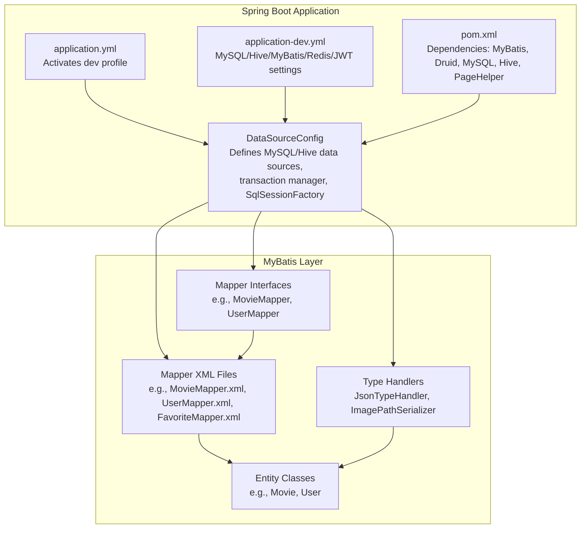

**Diagram sources**
- [DataSourceConfig.java](file://backend/src/main/java/com/movie/backend/config/DataSourceConfig.java#L18-L61)
- [application.yml](file://backend/src/main/resources/application.yml#L1-L4)
- [application-dev.yml](file://backend/src/main/resources/application-dev.yml#L11-L67)
- [pom.xml](file://backend/pom.xml#L17-L248)
- [MovieMapper.java](file://backend/src/main/java/com/movie/backend/mapper/MovieMapper.java#L10-L92)
- [MovieMapper.xml](file://backend/src/main/resources/mapper/MovieMapper.xml#L1-L193)
- [UserMapper.java](file://backend/src/main/java/com/movie/backend/mapper/UserMapper.java#L9-L41)
- [UserMapper.xml](file://backend/src/main/resources/mapper/UserMapper.xml#L1-L62)
- [FavoriteMapper.xml](file://backend/src/main/resources/mapper/FavoriteMapper.xml#L1-L36)
- [JsonTypeHandler.java](file://backend/src/main/java/com/movie/backend/config/JsonTypeHandler.java#L14-L61)
- [ImagePathSerializer.java](file://backend/src/main/java/com/movie/backend/config/ImagePathSerializer.java#L10-L19)
- [Movie.java](file://backend/src/main/java/com/movie/backend/entity/Movie.java#L1-L65)

**Section sources**
- [DataSourceConfig.java](file://backend/src/main/java/com/movie/backend/config/DataSourceConfig.java#L18-L61)
- [application.yml](file://backend/src/main/resources/application.yml#L1-L4)
- [application-dev.yml](file://backend/src/main/resources/application-dev.yml#L11-L67)
- [pom.xml](file://backend/pom.xml#L17-L248)

## Core Components
- Data source configuration and scanning:
  - Primary MySQL data source via Druid, transaction manager, and SqlSessionFactory.
  - Mapper scanning for the com.movie.backend.mapper package.
  - Secondary Hive data source and JdbcTemplate for analytics.
- MyBatis configuration:
  - Mapper XML locations resolved from classpath.
  - Underscore-to-camel case mapping enabled globally.
- Type handlers:
  - JsonTypeHandler for JSON fields stored as VARCHAR.
  - ImagePathSerializer for serializing image paths with domain prefix.
- Entity mapping:
  - Entities annotated with Jackson serialization and MyBatis result maps.
- Dynamic SQL and result mapping:
  - Extensive use of <where>, <if>, <choose>/<when>/<otherwise>, and <include> for flexible queries.
  - Result maps define column-to-property mapping and type handler bindings.

**Section sources**
- [DataSourceConfig.java](file://backend/src/main/java/com/movie/backend/config/DataSourceConfig.java#L18-L61)
- [application-dev.yml](file://backend/src/main/resources/application-dev.yml#L46-L51)
- [JsonTypeHandler.java](file://backend/src/main/java/com/movie/backend/config/JsonTypeHandler.java#L14-L61)
- [ImagePathSerializer.java](file://backend/src/main/java/com/movie/backend/config/ImagePathSerializer.java#L10-L19)
- [Movie.java](file://backend/src/main/java/com/movie/backend/entity/Movie.java#L1-L65)

## Architecture Overview
The persistence layer follows a classic MyBatis pattern:
- Mapper interfaces declare method signatures.
- Mapper XML files define SQL statements, dynamic conditions, and result mappings.
- Type handlers convert between Java types and JDBC types.
- Spring manages data sources, transactions, and SqlSessionFactory.

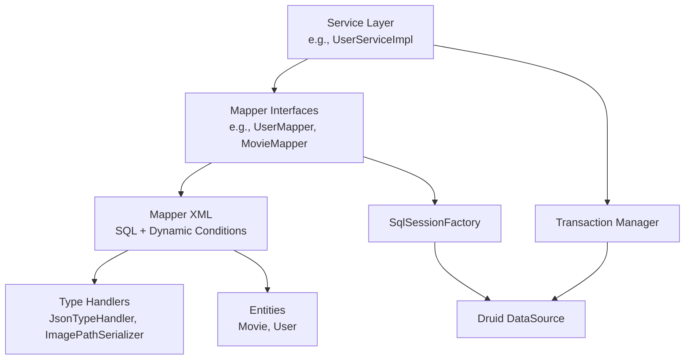

**Diagram sources**
- [UserServiceImpl.java](file://backend/src/main/java/com/movie/backend/service/impl/UserServiceImpl.java#L19-L176)
- [UserMapper.java](file://backend/src/main/java/com/movie/backend/mapper/UserMapper.java#L9-L41)
- [MovieMapper.java](file://backend/src/main/java/com/movie/backend/mapper/MovieMapper.java#L10-L92)
- [MovieMapper.xml](file://backend/src/main/resources/mapper/MovieMapper.xml#L1-L193)
- [UserMapper.xml](file://backend/src/main/resources/mapper/UserMapper.xml#L1-L62)
- [JsonTypeHandler.java](file://backend/src/main/java/com/movie/backend/config/JsonTypeHandler.java#L14-L61)
- [ImagePathSerializer.java](file://backend/src/main/java/com/movie/backend/config/ImagePathSerializer.java#L10-L19)
- [DataSourceConfig.java](file://backend/src/main/java/com/movie/backend/config/DataSourceConfig.java#L30-L48)

## Detailed Component Analysis

### MyBatis Configuration and SqlSessionFactory
- Data source:
  - Primary MySQL configured via spring.datasource properties and bound to Druid.
  - Hive data source configured separately for analytics.
- Transaction manager:
  - DataSourceTransactionManager wired to the MySQL data source.
- SqlSessionFactory:
  - Mapper locations loaded from classpath:mapper/*.xml.
  - Global configuration enables underscore-to-camel case mapping.

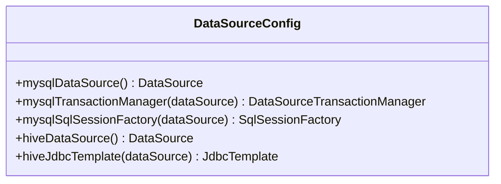

**Diagram sources**
- [DataSourceConfig.java](file://backend/src/main/java/com/movie/backend/config/DataSourceConfig.java#L18-L61)

**Section sources**
- [DataSourceConfig.java](file://backend/src/main/java/com/movie/backend/config/DataSourceConfig.java#L22-L48)
- [application-dev.yml](file://backend/src/main/resources/application-dev.yml#L11-L51)

### Type Handlers and JSON Field Handling
- JsonTypeHandler:
  - Converts Java objects (e.g., lists/maps) to JSON strings for storage and back.
  - Handles nullable results from ResultSet, parameter index, and CallableStatement.
  - Uses ObjectMapper for serialization/deserialization.
- Usage in MovieMapper:
  - actors, directors, writers mapped with typeHandler="...JsonTypeHandler".
  - Applied in insert and update statements.

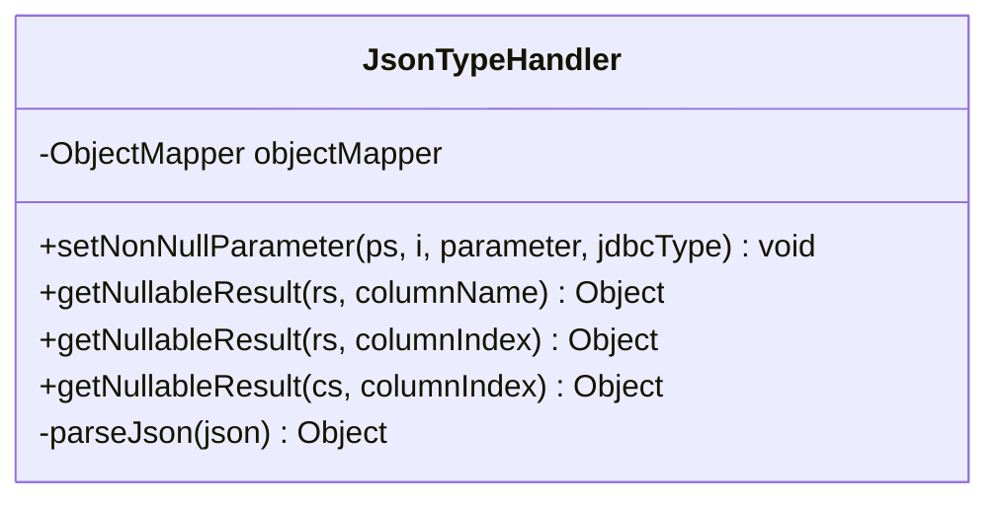

**Diagram sources**
- [JsonTypeHandler.java](file://backend/src/main/java/com/movie/backend/config/JsonTypeHandler.java#L14-L61)
- [MovieMapper.xml](file://backend/src/main/resources/mapper/MovieMapper.xml#L10-L23)
- [MovieMapper.xml](file://backend/src/main/resources/mapper/MovieMapper.xml#L92-L95)
- [MovieMapper.xml](file://backend/src/main/resources/mapper/MovieMapper.xml#L103-L116)

**Section sources**
- [JsonTypeHandler.java](file://backend/src/main/java/com/movie/backend/config/JsonTypeHandler.java#L14-L61)
- [MovieMapper.xml](file://backend/src/main/resources/mapper/MovieMapper.xml#L10-L23)
- [MovieMapper.xml](file://backend/src/main/resources/mapper/MovieMapper.xml#L92-L116)

### Image Path Serialization
- ImagePathSerializer:
  - Serializes image paths by delegating to ImagePathUtils.processPath.
- ImagePathUtils:
  - Reads domain from configuration and ensures paths are absolute with leading slash.
- Usage:
  - Applied via @JsonSerialize on Movie.cover to normalize URLs.

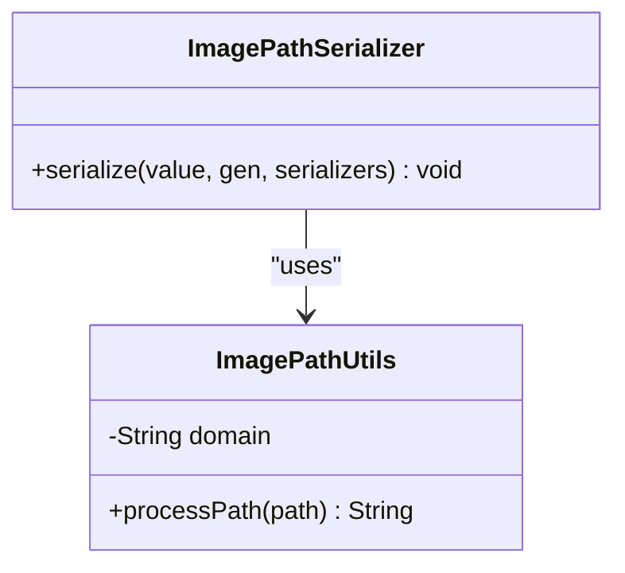

**Diagram sources**
- [ImagePathSerializer.java](file://backend/src/main/java/com/movie/backend/config/ImagePathSerializer.java#L10-L19)
- [ImagePathUtils.java](file://backend/src/main/java/com/movie/backend/utils/ImagePathUtils.java#L8-L39)
- [Movie.java](file://backend/src/main/java/com/movie/backend/entity/Movie.java#L26-L28)

**Section sources**
- [ImagePathSerializer.java](file://backend/src/main/java/com/movie/backend/config/ImagePathSerializer.java#L10-L19)
- [ImagePathUtils.java](file://backend/src/main/java/com/movie/backend/utils/ImagePathUtils.java#L8-L39)
- [Movie.java](file://backend/src/main/java/com/movie/backend/entity/Movie.java#L26-L28)
- [application-dev.yml](file://backend/src/main/resources/application-dev.yml#L58-L60)

### Mapper Interface Pattern and Result Mapping
- MovieMapper:
  - Defines methods for select/search/update/delete with DTO-driven filtering.
  - Result map binds columns to Movie properties; JSON fields use JsonTypeHandler.
- UserMapper:
  - CRUD operations with dynamic <where> and <set> blocks.
- Result maps and type handlers:
  - MovieMapper.xml defines BaseResultMap and binds typeHandler for JSON fields.
  - UserMapper.xml defines BaseResultMap for user entity.

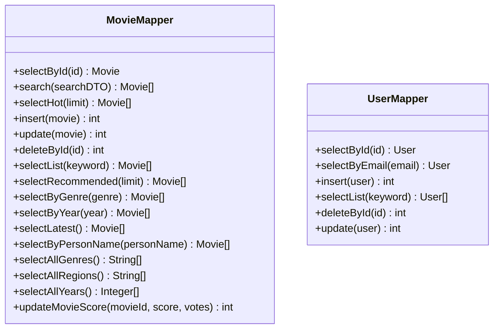

**Diagram sources**
- [MovieMapper.java](file://backend/src/main/java/com/movie/backend/mapper/MovieMapper.java#L10-L92)
- [UserMapper.java](file://backend/src/main/java/com/movie/backend/mapper/UserMapper.java#L9-L41)

**Section sources**
- [MovieMapper.java](file://backend/src/main/java/com/movie/backend/mapper/MovieMapper.java#L10-L92)
- [UserMapper.java](file://backend/src/main/java/com/movie/backend/mapper/UserMapper.java#L9-L41)
- [MovieMapper.xml](file://backend/src/main/resources/mapper/MovieMapper.xml#L6-L24)
- [UserMapper.xml](file://backend/src/main/resources/mapper/UserMapper.xml#L6-L16)

### Dynamic SQL Generation
- MovieMapper.xml demonstrates:
  - <where> with chained <if> conditions for keyword, genre, score range, year range, and region.
  - <choose>/<when>/<otherwise> for flexible ordering by score/year/votes.
  - <include> for reusable column lists.
- UserMapper.xml demonstrates:
  - <where> with LIKE conditions for user search.
  - <set> with conditional setters for updates.

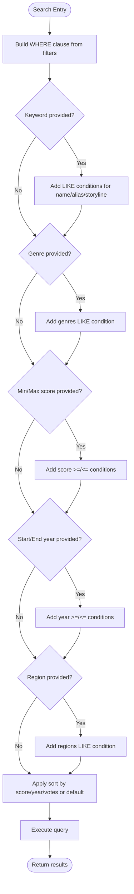

**Diagram sources**
- [MovieMapper.xml](file://backend/src/main/resources/mapper/MovieMapper.xml#L35-L80)

**Section sources**
- [MovieMapper.xml](file://backend/src/main/resources/mapper/MovieMapper.xml#L35-L80)
- [UserMapper.xml](file://backend/src/main/resources/mapper/UserMapper.xml#L35-L42)

### Transaction Management
- DataSourceTransactionManager is configured for the MySQL data source.
- Services orchestrate business operations; exceptions propagate to trigger rollback semantics at the container level.

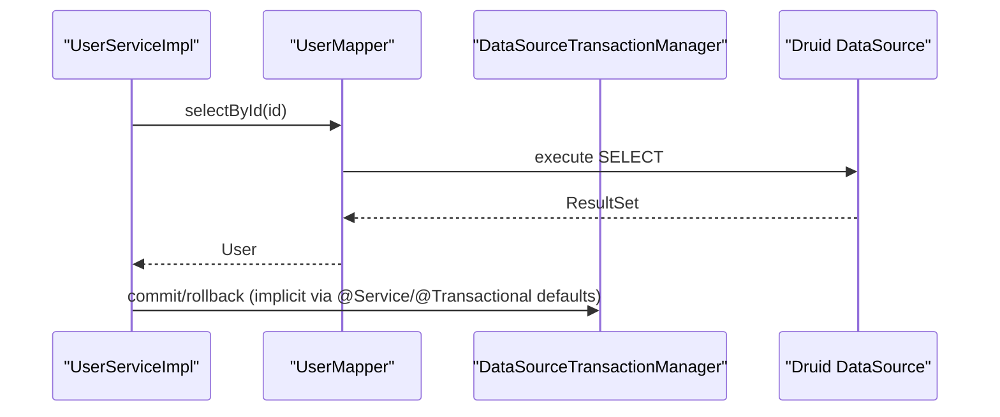

**Diagram sources**
- [DataSourceConfig.java](file://backend/src/main/java/com/movie/backend/config/DataSourceConfig.java#L30-L34)
- [UserServiceImpl.java](file://backend/src/main/java/com/movie/backend/service/impl/UserServiceImpl.java#L28-L56)

**Section sources**
- [DataSourceConfig.java](file://backend/src/main/java/com/movie/backend/config/DataSourceConfig.java#L30-L34)
- [UserServiceImpl.java](file://backend/src/main/java/com/movie/backend/service/impl/UserServiceImpl.java#L28-L56)

### Connection Pooling
- Druid is configured as the primary MySQL data source with:
  - initial-size, min-idle, max-active, max-wait, validation-query.
- Druid starter dependency is declared in pom.xml.

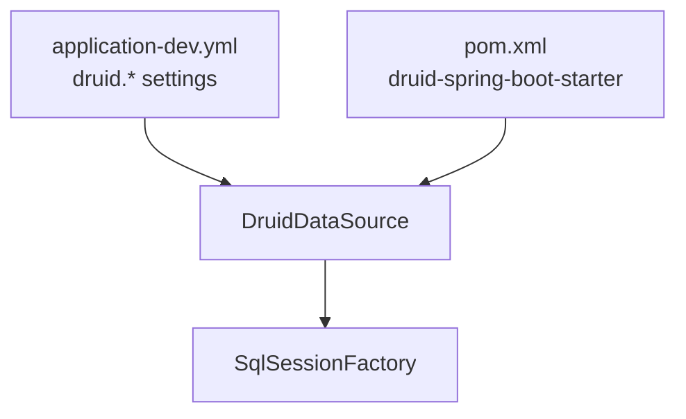

**Diagram sources**
- [application-dev.yml](file://backend/src/main/resources/application-dev.yml#L19-L24)
- [pom.xml](file://backend/pom.xml#L57-L62)
- [DataSourceConfig.java](file://backend/src/main/java/com/movie/backend/config/DataSourceConfig.java#L23-L28)

**Section sources**
- [application-dev.yml](file://backend/src/main/resources/application-dev.yml#L19-L24)
- [pom.xml](file://backend/pom.xml#L57-L62)
- [DataSourceConfig.java](file://backend/src/main/java/com/movie/backend/config/DataSourceConfig.java#L23-L28)

### Batch Operations
- FavoriteMapper.xml includes a batch delete operation using <foreach> to remove multiple records efficiently.

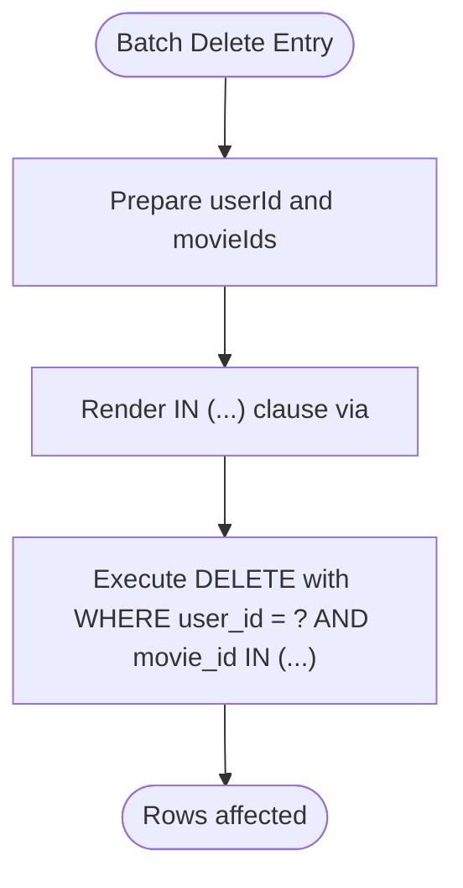

**Diagram sources**
- [FavoriteMapper.xml](file://backend/src/main/resources/mapper/FavoriteMapper.xml#L14-L21)

**Section sources**
- [FavoriteMapper.xml](file://backend/src/main/resources/mapper/FavoriteMapper.xml#L14-L21)

### Complex Queries Example
- Movie.search:
  - Dynamic filter composition with multiple optional criteria.
  - Flexible ordering via choose/when/otherwise.
  - Uses concatenated LIKE expressions for partial matches.

**Section sources**
- [MovieMapper.xml](file://backend/src/main/resources/mapper/MovieMapper.xml#L35-L80)

## Dependency Analysis
External libraries and their roles:
- MyBatis Spring Boot Starter: integrates MyBatis with Spring.
- MySQL Connector/J: JDBC driver for MySQL.
- Druid Spring Boot Starter: connection pooling and monitoring.
- Hive JDBC: secondary data source for analytics.
- PageHelper: pagination support.

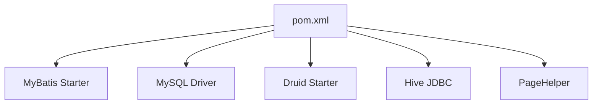

**Diagram sources**
- [pom.xml](file://backend/pom.xml#L38-L241)

**Section sources**
- [pom.xml](file://backend/pom.xml#L38-L241)

## Performance Considerations
- Connection pool sizing:
  - Adjust Druid pool sizes (initial-size, min-idle, max-active) according to workload.
- Prepared statement caching:
  - Enable MyBatis statement caching via configuration if appropriate.
- Indexing:
  - Ensure filtered columns (e.g., name, alias, genres, year, email) are indexed in the database.
- Pagination:
  - Use PageHelper for large datasets to avoid loading entire tables.
- JSON fields:
  - Store only necessary nested data; consider normalizing complex JSON structures for frequent queries.
- Image path handling:
  - Avoid redundant concatenation; rely on ImagePathSerializer to ensure consistent URLs.

[No sources needed since this section provides general guidance]

## Troubleshooting Guide
- JSON conversion errors:
  - JsonTypeHandler wraps conversion exceptions; check input types and ensure compatibility with ObjectMapper.
- Null or empty JSON:
  - Handler returns null for empty strings; validate upstream data.
- Image path anomalies:
  - Verify domain configuration and ensure paths start with “/” after concatenation.
- Transaction failures:
  - Confirm DataSourceTransactionManager is bound to the correct data source and that services are annotated appropriately.

**Section sources**
- [JsonTypeHandler.java](file://backend/src/main/java/com/movie/backend/config/JsonTypeHandler.java#L24-L29)
- [JsonTypeHandler.java](file://backend/src/main/java/com/movie/backend/config/JsonTypeHandler.java#L50-L59)
- [ImagePathUtils.java](file://backend/src/main/java/com/movie/backend/utils/ImagePathUtils.java#L27-L37)
- [DataSourceConfig.java](file://backend/src/main/java/com/movie/backend/config/DataSourceConfig.java#L30-L34)

## Conclusion
The persistence layer leverages a clean separation of concerns: Spring Boot configures data sources and MyBatis, mapper interfaces define contracts, and XML files implement dynamic SQL with robust result mapping. Type handlers enable seamless JSON and URL serialization. With Druid pooling and transaction management, the system balances reliability and performance. Extending the layer involves adding mappers with dynamic SQL and applying type handlers for specialized fields.

[No sources needed since this section summarizes without analyzing specific files]

## Appendices

### Appendix A: MyBatis Configuration Reference
- Mapper locations and camel case mapping are configured centrally.
- Ensure all mapper XML files reside under classpath:mapper.

**Section sources**
- [application-dev.yml](file://backend/src/main/resources/application-dev.yml#L46-L51)
- [DataSourceConfig.java](file://backend/src/main/java/com/movie/backend/config/DataSourceConfig.java#L36-L47)

### Appendix B: JSON Field Handling Reference
- Apply typeHandler on fields mapped as JSON.
- Validate data shapes to prevent deserialization failures.

**Section sources**
- [MovieMapper.xml](file://backend/src/main/resources/mapper/MovieMapper.xml#L10-L23)
- [JsonTypeHandler.java](file://backend/src/main/java/com/movie/backend/config/JsonTypeHandler.java#L14-L61)

### Appendix C: Image Path Serialization Reference
- Configure domain and upload path in application properties.
- Use @JsonSerialize on entity fields requiring normalized URLs.

**Section sources**
- [application-dev.yml](file://backend/src/main/resources/application-dev.yml#L58-L60)
- [Movie.java](file://backend/src/main/java/com/movie/backend/entity/Movie.java#L26-L28)
- [ImagePathSerializer.java](file://backend/src/main/java/com/movie/backend/config/ImagePathSerializer.java#L10-L19)