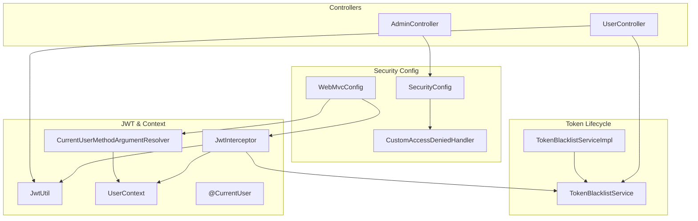
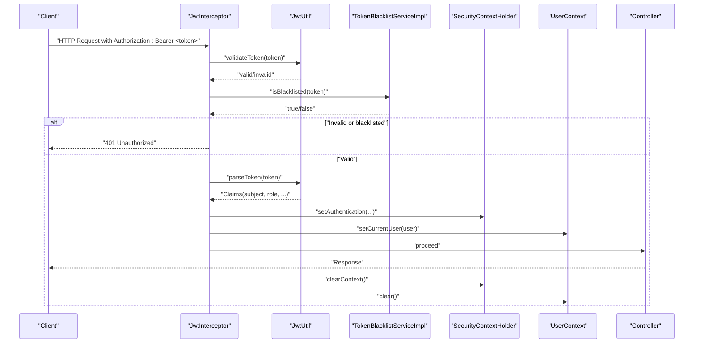
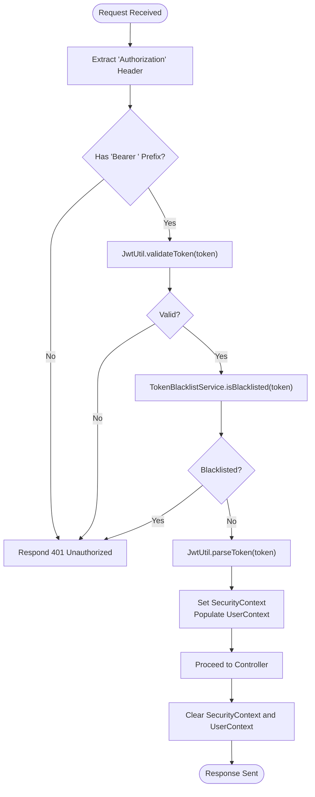
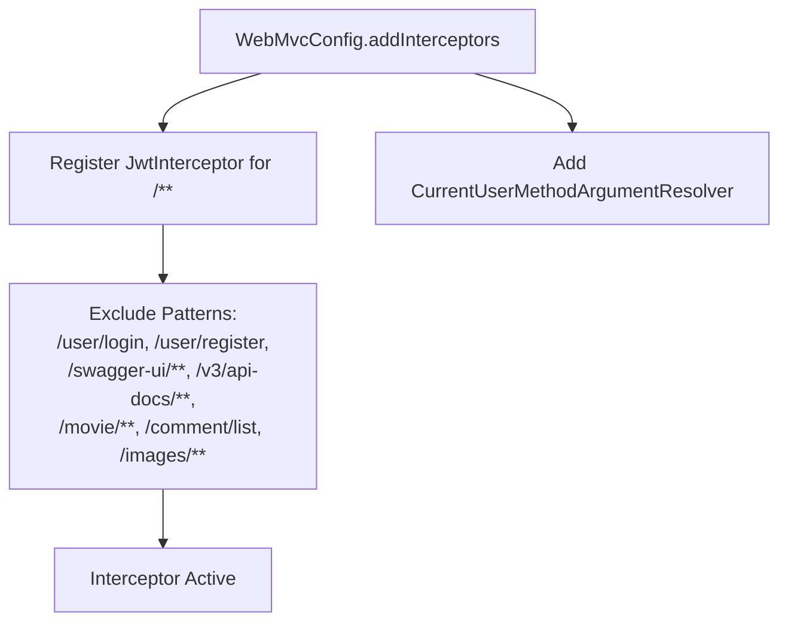
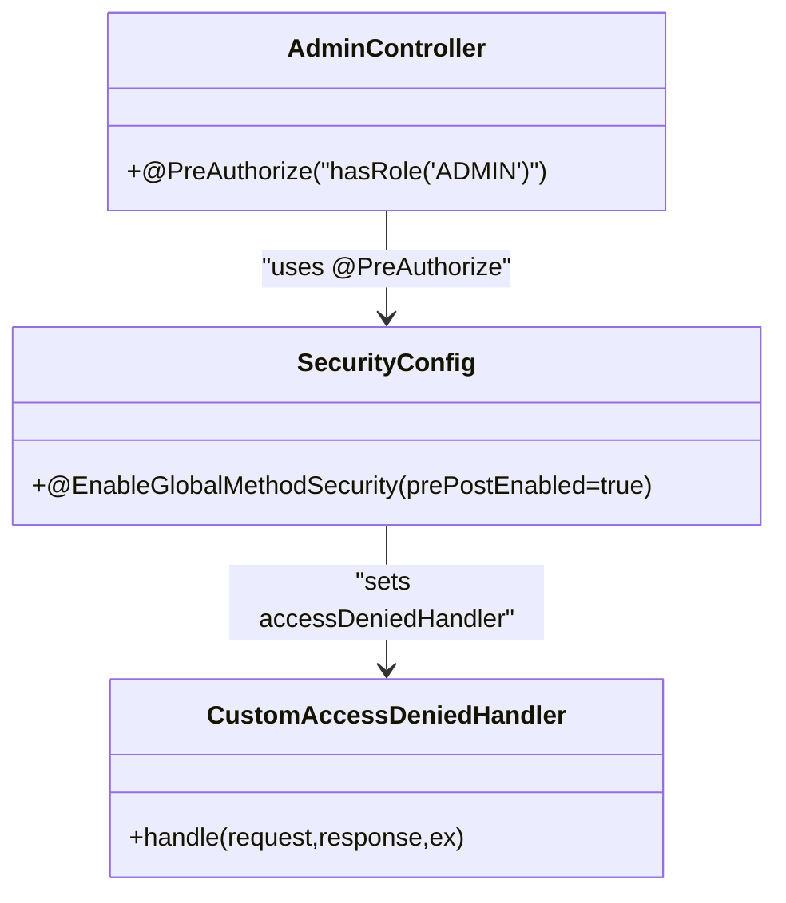
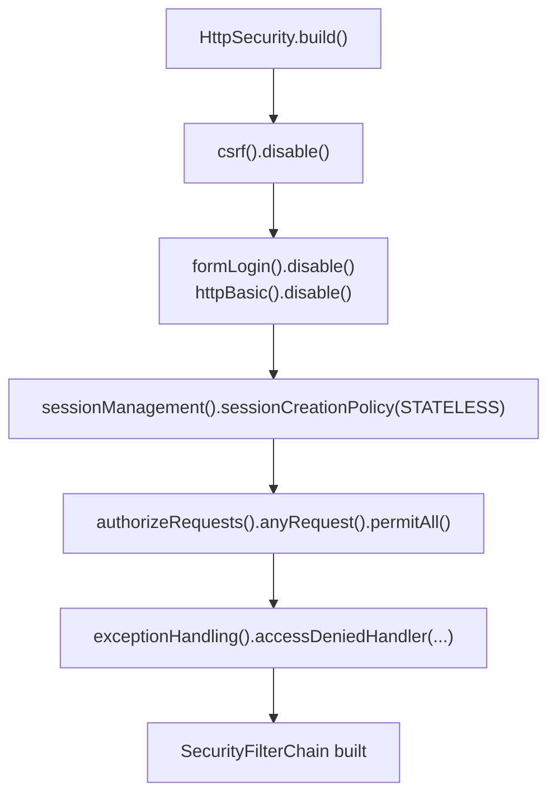
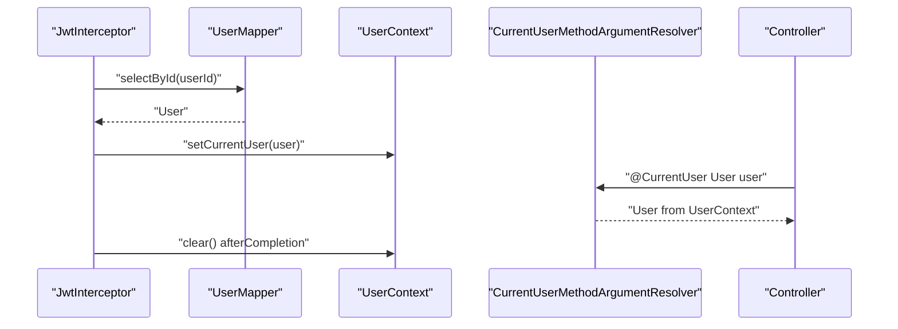
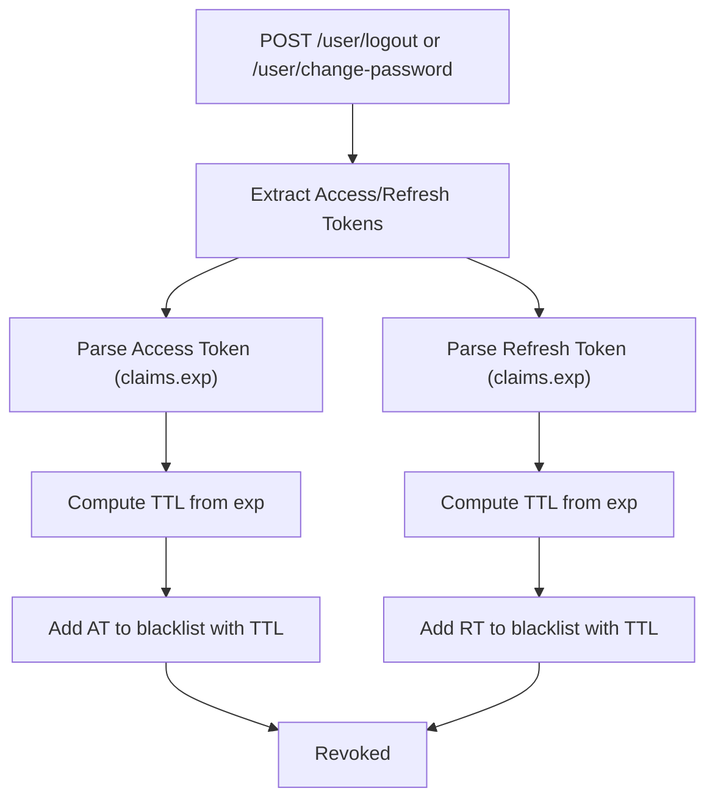
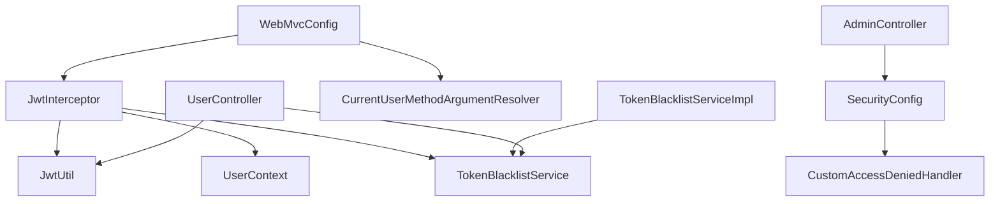

# Security Architecture

<cite>
**Referenced Files in This Document**
- [SecurityConfig.java](file://backend/src/main/java/com/movie/backend/config/SecurityConfig.java)
- [JwtInterceptor.java](file://backend/src/main/java/com/movie/backend/config/JwtInterceptor.java)
- [WebMvcConfig.java](file://backend/src/main/java/com/movie/backend/config/WebMvcConfig.java)
- [CurrentUserMethodArgumentResolver.java](file://backend/src/main/java/com/movie/backend/config/CurrentUserMethodArgumentResolver.java)
- [CurrentUser.java](file://backend/src/main/java/com/movie/backend/annotation/CurrentUser.java)
- [CustomAccessDeniedHandler.java](file://backend/src/main/java/com/movie/backend/config/CustomAccessDeniedHandler.java)
- [JwtUtil.java](file://backend/src/main/java/com/movie/backend/utils/JwtUtil.java)
- [UserContext.java](file://backend/src/main/java/com/movie/backend/context/UserContext.java)
- [TokenBlacklistService.java](file://backend/src/main/java/com/movie/backend/service/TokenBlacklistService.java)
- [TokenBlacklistServiceImpl.java](file://backend/src/main/java/com/movie/backend/service/impl/TokenBlacklistServiceImpl.java)
- [UserController.java](file://backend/src/main/java/com/movie/backend/controller/UserController.java)
- [AdminController.java](file://backend/src/main/java/com/movie/backend/controller/admin/AdminController.java)
- [application-dev.yml](file://backend/src/main/resources/application-dev.yml)
</cite>

## Table of Contents
1. [Introduction](#introduction)
2. [Project Structure](#project-structure)
3. [Core Components](#core-components)
4. [Architecture Overview](#architecture-overview)
5. [Detailed Component Analysis](#detailed-component-analysis)
6. [Dependency Analysis](#dependency-analysis)
7. [Performance Considerations](#performance-considerations)
8. [Troubleshooting Guide](#troubleshooting-guide)
9. [Conclusion](#conclusion)
10. [Appendices](#appendices)

## Introduction
This document explains the security architecture of the movie system backend, focusing on JWT token-based authentication, interceptor configuration, method-level authorization, and supporting infrastructure. It covers the security filter chain, CORS configuration, CSRF protection, user context resolution, role-based access control, and permission management. It also provides security best practices, token lifecycle management, access denied handling, examples of securing endpoints, customization of authentication flows, and fine-grained authorization rules.

## Project Structure
Security-related components are organized under the config, utils, context, controller, service, and annotation packages. The configuration enables JWT-based stateless authentication, registers interceptors and argument resolvers, and sets up CORS. JWT utilities manage token generation, validation, and refresh. Interceptors enforce authentication and populate user context. Method-level authorization is enforced via Spring Security annotations.

**Diagram sources**
- [SecurityConfig.java](file://backend/src/main/java/com/movie/backend/config/SecurityConfig.java#L1-L51)
- [WebMvcConfig.java](file://backend/src/main/java/com/movie/backend/config/WebMvcConfig.java#L1-L65)
- [JwtInterceptor.java](file://backend/src/main/java/com/movie/backend/config/JwtInterceptor.java#L1-L105)
- [JwtUtil.java](file://backend/src/main/java/com/movie/backend/utils/JwtUtil.java#L1-L179)
- [UserContext.java](file://backend/src/main/java/com/movie/backend/context/UserContext.java#L1-L44)
- [CurrentUserMethodArgumentResolver.java](file://backend/src/main/java/com/movie/backend/config/CurrentUserMethodArgumentResolver.java#L1-L51)
- [CurrentUser.java](file://backend/src/main/java/com/movie/backend/annotation/CurrentUser.java#L1-L29)
- [TokenBlacklistService.java](file://backend/src/main/java/com/movie/backend/service/TokenBlacklistService.java#L1-L30)
- [TokenBlacklistServiceImpl.java](file://backend/src/main/java/com/movie/backend/service/impl/TokenBlacklistServiceImpl.java#L1-L81)
- [UserController.java](file://backend/src/main/java/com/movie/backend/controller/UserController.java#L1-L130)
- [AdminController.java](file://backend/src/main/java/com/movie/backend/controller/admin/AdminController.java#L1-L135)

**Section sources**
- [SecurityConfig.java](file://backend/src/main/java/com/movie/backend/config/SecurityConfig.java#L1-L51)
- [WebMvcConfig.java](file://backend/src/main/java/com/movie/backend/config/WebMvcConfig.java#L1-L65)

## Core Components
- JWT Utilities: Generate, validate, parse, and refresh tokens; extract user info from requests.
- JWT Interceptor: Extract Authorization header, validate token, check blacklist, set Spring Security context, and populate thread-local user context.
- User Context: ThreadLocal holder for current user during request processing.
- Method Argument Resolver: Inject @CurrentUser annotated parameters with the resolved user.
- Access Denied Handler: Return structured JSON 403 responses for insufficient permissions.
- Token Blacklist Service: Persist revoked tokens in Redis with TTL matching token expiration.
- Controllers: Expose login, registration, refresh, logout, and change-password endpoints; apply method-level authorization for admin endpoints.

**Section sources**
- [JwtUtil.java](file://backend/src/main/java/com/movie/backend/utils/JwtUtil.java#L1-L179)
- [JwtInterceptor.java](file://backend/src/main/java/com/movie/backend/config/JwtInterceptor.java#L1-L105)
- [UserContext.java](file://backend/src/main/java/com/movie/backend/context/UserContext.java#L1-L44)
- [CurrentUserMethodArgumentResolver.java](file://backend/src/main/java/com/movie/backend/config/CurrentUserMethodArgumentResolver.java#L1-L51)
- [CurrentUser.java](file://backend/src/main/java/com/movie/backend/annotation/CurrentUser.java#L1-L29)
- [CustomAccessDeniedHandler.java](file://backend/src/main/java/com/movie/backend/config/CustomAccessDeniedHandler.java#L1-L27)
- [TokenBlacklistService.java](file://backend/src/main/java/com/movie/backend/service/TokenBlacklistService.java#L1-L30)
- [TokenBlacklistServiceImpl.java](file://backend/src/main/java/com/movie/backend/service/impl/TokenBlacklistServiceImpl.java#L1-L81)
- [UserController.java](file://backend/src/main/java/com/movie/backend/controller/UserController.java#L1-L130)
- [AdminController.java](file://backend/src/main/java/com/movie/backend/controller/admin/AdminController.java#L1-L135)

## Architecture Overview
The security model is stateless and JWT-centric:
- Stateless session policy disables form login and HTTP Basic, and enforces STATELESS.
- All requests are permitted at the filter chain level; enforcement is delegated to the JWT interceptor and method-level annotations.
- CSRF is disabled because JWT eliminates the need for CSRF protection.
- CORS is configured broadly to support frontend integration.
- The JWT interceptor validates tokens, checks blacklist, sets SecurityContext, and stores user in ThreadLocal.
- Method-level authorization uses @PreAuthorize to enforce roles.
- AccessDenied exceptions are handled centrally to return JSON 403.

**Diagram sources**
- [JwtInterceptor.java](file://backend/src/main/java/com/movie/backend/config/JwtInterceptor.java#L33-L103)
- [JwtUtil.java](file://backend/src/main/java/com/movie/backend/utils/JwtUtil.java#L99-L107)
- [TokenBlacklistServiceImpl.java](file://backend/src/main/java/com/movie/backend/service/impl/TokenBlacklistServiceImpl.java#L36-L44)
- [UserContext.java](file://backend/src/main/java/com/movie/backend/context/UserContext.java#L39-L42)

**Section sources**
- [SecurityConfig.java](file://backend/src/main/java/com/movie/backend/config/SecurityConfig.java#L24-L49)
- [WebMvcConfig.java](file://backend/src/main/java/com/movie/backend/config/WebMvcConfig.java#L25-L49)

## Detailed Component Analysis

### JWT Token-Based Authentication
- Token extraction: Reads Authorization header and strips "Bearer " prefix.
- Validation: Uses HS512 with a strong secret to validate signature and expiration.
- Parsing: Extracts subject (user ID), role, and metadata from claims.
- Refresh: Validates refresh token type and user status, then issues a new access token tied to the current password version.
- Logout/change-password: Adds both access and refresh tokens to blacklist with TTL derived from remaining validity.

**Diagram sources**
- [JwtInterceptor.java](file://backend/src/main/java/com/movie/backend/config/JwtInterceptor.java#L40-L103)
- [JwtUtil.java](file://backend/src/main/java/com/movie/backend/utils/JwtUtil.java#L87-L107)
- [TokenBlacklistServiceImpl.java](file://backend/src/main/java/com/movie/backend/service/impl/TokenBlacklistServiceImpl.java#L36-L44)

**Section sources**
- [JwtUtil.java](file://backend/src/main/java/com/movie/backend/utils/JwtUtil.java#L49-L155)
- [JwtInterceptor.java](file://backend/src/main/java/com/movie/backend/config/JwtInterceptor.java#L33-L103)
- [TokenBlacklistServiceImpl.java](file://backend/src/main/java/com/movie/backend/service/impl/TokenBlacklistServiceImpl.java#L25-L79)

### Interceptor Configuration
- Registers JwtInterceptor globally and excludes public endpoints (login, register, swagger, movie/public, images).
- Excludes OPTIONS preflight requests.
- Registers CurrentUserMethodArgumentResolver to inject @CurrentUser parameters.

**Diagram sources**
- [WebMvcConfig.java](file://backend/src/main/java/com/movie/backend/config/WebMvcConfig.java#L35-L49)

**Section sources**
- [WebMvcConfig.java](file://backend/src/main/java/com/movie/backend/config/WebMvcConfig.java#L25-L49)

### Method-Level Authorization
- EnableGlobalMethodSecurity(prePostEnabled = true) allows @PreAuthorize and related annotations.
- Admin endpoints are protected with @PreAuthorize("hasRole('ADMIN')").
- AccessDenied exceptions are handled centrally to return JSON 403.

**Diagram sources**
- [AdminController.java](file://backend/src/main/java/com/movie/backend/controller/admin/AdminController.java#L22-L22)
- [SecurityConfig.java](file://backend/src/main/java/com/movie/backend/config/SecurityConfig.java#L18-L18)
- [CustomAccessDeniedHandler.java](file://backend/src/main/java/com/movie/backend/config/CustomAccessDeniedHandler.java#L17-L26)

**Section sources**
- [SecurityConfig.java](file://backend/src/main/java/com/movie/backend/config/SecurityConfig.java#L16-L49)
- [AdminController.java](file://backend/src/main/java/com/movie/backend/controller/admin/AdminController.java#L22-L22)
- [CustomAccessDeniedHandler.java](file://backend/src/main/java/com/movie/backend/config/CustomAccessDeniedHandler.java#L17-L26)

### Security Filter Chain
- CSRF disabled (JWT-based).
- FormLogin and HttpBasic disabled.
- SessionManagement set to STATELESS.
- authorizeRequests permits all requests; enforcement delegated to interceptor and method security.
- AccessDeniedHandler configured for centralized 403 handling.

**Diagram sources**
- [SecurityConfig.java](file://backend/src/main/java/com/movie/backend/config/SecurityConfig.java#L24-L49)

**Section sources**
- [SecurityConfig.java](file://backend/src/main/java/com/movie/backend/config/SecurityConfig.java#L24-L49)

### CORS Configuration
- Broad CORS policy allowing credentials, wildcard origins, and common methods/headers.
- Max age set to 3600 seconds.

**Section sources**
- [WebMvcConfig.java](file://backend/src/main/java/com/movie/backend/config/WebMvcConfig.java#L25-L33)

### CSRF Protection
- Explicitly disabled in the security filter chain because JWT eliminates CSRF risks.

**Section sources**
- [SecurityConfig.java](file://backend/src/main/java/com/movie/backend/config/SecurityConfig.java#L27-L32)

### User Context Resolution
- JwtInterceptor loads the full User entity and stores it in UserContext.
- CurrentUserMethodArgumentResolver resolves @CurrentUser(User) parameters from UserContext.
- Both SecurityContext and UserContext are cleared in afterCompletion to prevent leaks.

**Diagram sources**
- [JwtInterceptor.java](file://backend/src/main/java/com/movie/backend/config/JwtInterceptor.java#L82-L92)
- [CurrentUserMethodArgumentResolver.java](file://backend/src/main/java/com/movie/backend/config/CurrentUserMethodArgumentResolver.java#L34-L49)
- [UserContext.java](file://backend/src/main/java/com/movie/backend/context/UserContext.java#L17-L42)

**Section sources**
- [JwtInterceptor.java](file://backend/src/main/java/com/movie/backend/config/JwtInterceptor.java#L82-L103)
- [CurrentUserMethodArgumentResolver.java](file://backend/src/main/java/com/movie/backend/config/CurrentUserMethodArgumentResolver.java#L17-L51)
- [UserContext.java](file://backend/src/main/java/com/movie/backend/context/UserContext.java#L10-L44)

### Role-Based Access Control and Permission Management
- Roles are encoded in JWT claims and mapped to authorities (ROLE_ADMIN, ROLE_USER).
- Method-level RBAC uses @PreAuthorize("hasRole('ADMIN')").
- AccessDeniedHandler returns a JSON 403 response for insufficient privileges.

**Section sources**
- [JwtInterceptor.java](file://backend/src/main/java/com/movie/backend/config/JwtInterceptor.java#L68-L70)
- [AdminController.java](file://backend/src/main/java/com/movie/backend/controller/admin/AdminController.java#L22-L22)
- [CustomAccessDeniedHandler.java](file://backend/src/main/java/com/movie/backend/config/CustomAccessDeniedHandler.java#L19-L25)

### Token Lifecycle Management
- Access tokens short-lived; refresh tokens long-lived.
- Refresh endpoint validates refresh token type and user status, then issues a new access token bound to the current password version.
- Logout and change-password revoke tokens by adding them to the blacklist with TTL equal to remaining validity.
- Redis-backed blacklist with automatic expiry.

**Diagram sources**
- [UserController.java](file://backend/src/main/java/com/movie/backend/controller/UserController.java#L90-L104)
- [TokenBlacklistServiceImpl.java](file://backend/src/main/java/com/movie/backend/service/impl/TokenBlacklistServiceImpl.java#L47-L79)
- [JwtUtil.java](file://backend/src/main/java/com/movie/backend/utils/JwtUtil.java#L123-L155)

**Section sources**
- [JwtUtil.java](file://backend/src/main/java/com/movie/backend/utils/JwtUtil.java#L52-L81)
- [JwtUtil.java](file://backend/src/main/java/com/movie/backend/utils/JwtUtil.java#L123-L155)
- [TokenBlacklistServiceImpl.java](file://backend/src/main/java/com/movie/backend/service/impl/TokenBlacklistServiceImpl.java#L25-L79)
- [UserController.java](file://backend/src/main/java/com/movie/backend/controller/UserController.java#L77-L128)

### Access Denied Handling
- CustomAccessDeniedHandler writes a JSON 403 response with standardized structure.

**Section sources**
- [CustomAccessDeniedHandler.java](file://backend/src/main/java/com/movie/backend/config/CustomAccessDeniedHandler.java#L19-L25)
- [SecurityConfig.java](file://backend/src/main/java/com/movie/backend/config/SecurityConfig.java#L44-L46)

### Examples of Securing Endpoints
- Admin-only endpoints: Apply @PreAuthorize("hasRole('ADMIN')") at class or method level.
- Require current user injection: Use @CurrentUser User user on controller parameters; optionally mark required() to enforce login.
- Public endpoints: Exclude from interceptor via WebMvcConfig.addInterceptors exclude patterns.

**Section sources**
- [AdminController.java](file://backend/src/main/java/com/movie/backend/controller/admin/AdminController.java#L22-L22)
- [CurrentUserMethodArgumentResolver.java](file://backend/src/main/java/com/movie/backend/config/CurrentUserMethodArgumentResolver.java#L24-L49)
- [WebMvcConfig.java](file://backend/src/main/java/com/movie/backend/config/WebMvcConfig.java#L35-L40)

### Customizing Authentication Flows
- Modify JwtInterceptor to add extra validations (e.g., IP binding, device fingerprint).
- Extend TokenBlacklistService to integrate with distributed cache or database for cross-instance revocation.
- Adjust WebMvcConfig to add path-specific interceptors or modify CORS policies.

**Section sources**
- [JwtInterceptor.java](file://backend/src/main/java/com/movie/backend/config/JwtInterceptor.java#L33-L95)
- [TokenBlacklistService.java](file://backend/src/main/java/com/movie/backend/service/TokenBlacklistService.java#L7-L29)
- [WebMvcConfig.java](file://backend/src/main/java/com/movie/backend/config/WebMvcConfig.java#L25-L49)

### Fine-Grained Authorization Rules
- Combine @PreAuthorize with SpEL expressions for ownership checks (e.g., "hasRole('ADMIN') or #userId == principal.id").
- Use @PostAuthorize for response-scoped checks if needed.
- Centralize deny handling via CustomAccessDeniedHandler.

**Section sources**
- [SecurityConfig.java](file://backend/src/main/java/com/movie/backend/config/SecurityConfig.java#L18-L18)
- [CustomAccessDeniedHandler.java](file://backend/src/main/java/com/movie/backend/config/CustomAccessDeniedHandler.java#L19-L25)

## Dependency Analysis
The following diagram shows key dependencies among security components:

**Diagram sources**
- [SecurityConfig.java](file://backend/src/main/java/com/movie/backend/config/SecurityConfig.java#L21-L22)
- [WebMvcConfig.java](file://backend/src/main/java/com/movie/backend/config/WebMvcConfig.java#L19-L23)
- [JwtInterceptor.java](file://backend/src/main/java/com/movie/backend/config/JwtInterceptor.java#L27-L31)
- [TokenBlacklistServiceImpl.java](file://backend/src/main/java/com/movie/backend/service/impl/TokenBlacklistServiceImpl.java#L17-L23)
- [UserController.java](file://backend/src/main/java/com/movie/backend/controller/UserController.java#L26-L30)
- [AdminController.java](file://backend/src/main/java/com/movie/backend/controller/admin/AdminController.java#L13-L14)

**Section sources**
- [SecurityConfig.java](file://backend/src/main/java/com/movie/backend/config/SecurityConfig.java#L1-L51)
- [WebMvcConfig.java](file://backend/src/main/java/com/movie/backend/config/WebMvcConfig.java#L1-L65)
- [JwtInterceptor.java](file://backend/src/main/java/com/movie/backend/config/JwtInterceptor.java#L1-L105)
- [TokenBlacklistServiceImpl.java](file://backend/src/main/java/com/movie/backend/service/impl/TokenBlacklistServiceImpl.java#L1-L81)
- [UserController.java](file://backend/src/main/java/com/movie/backend/controller/UserController.java#L1-L130)
- [AdminController.java](file://backend/src/main/java/com/movie/backend/controller/admin/AdminController.java#L1-L135)

## Performance Considerations
- Stateless design avoids server-side session storage and improves scalability.
- JWT parsing and Redis blacklist checks are lightweight; cache frequently accessed user data at the service layer if needed.
- Keep blacklist TTL aligned with token expiration to minimize stale entries.
- Avoid heavy operations in JwtInterceptor; defer to service layer for complex validations.

[No sources needed since this section provides general guidance]

## Troubleshooting Guide
- 401 Unauthorized: Indicates missing/expired/blacklisted token or invalid Authorization header format.
- 403 Forbidden: Insufficient permissions; verify role assignment and @PreAuthorize rules.
- Token parsing failures: Confirm JWT secret alignment and token signing algorithm.
- CORS issues: Verify allowed origins, methods, headers, and credentials settings.
- Memory leaks: Ensure afterCompletion clears SecurityContext and UserContext.

**Section sources**
- [JwtInterceptor.java](file://backend/src/main/java/com/movie/backend/config/JwtInterceptor.java#L47-L92)
- [CustomAccessDeniedHandler.java](file://backend/src/main/java/com/movie/backend/config/CustomAccessDeniedHandler.java#L20-L25)
- [WebMvcConfig.java](file://backend/src/main/java/com/movie/backend/config/WebMvcConfig.java#L25-L33)
- [UserContext.java](file://backend/src/main/java/com/movie/backend/context/UserContext.java#L39-L42)

## Conclusion
The backend employs a robust, stateless JWT-based security model with interceptor-driven authentication, method-level authorization, and centralized access denied handling. Token lifecycle management leverages Redis for efficient revocation. The architecture balances security, performance, and developer ergonomics while remaining extensible for advanced use cases.

[No sources needed since this section summarizes without analyzing specific files]

## Appendices

### JWT Configuration Reference
- Secret key and token expirations are defined in application-dev.yml.
- Access token expiration is short-lived; refresh token expiration is long-lived.

**Section sources**
- [application-dev.yml](file://backend/src/main/resources/application-dev.yml#L62-L67)