# Service Layer Architecture

<cite>
**Referenced Files in This Document**
- [UserService.java](file://backend/src/main/java/com/movie/backend/service/UserService.java)
- [UserServiceImpl.java](file://backend/src/main/java/com/movie/backend/service/impl/UserServiceImpl.java)
- [MovieService.java](file://backend/src/main/java/com/movie/backend/service/MovieService.java)
- [MovieServiceImpl.java](file://backend/src/main/java/com/movie/backend/service/impl/MovieServiceImpl.java)
- [FavoriteService.java](file://backend/src/main/java/com/movie/backend/service/FavoriteService.java)
- [FavoriteServiceImpl.java](file://backend/src/main/java/com/movie/backend/service/impl/FavoriteServiceImpl.java)
- [RatingService.java](file://backend/src/main/java/com/movie/backend/service/RatingService.java)
- [RatingServiceImpl.java](file://backend/src/main/java/com/movie/backend/service/impl/RatingServiceImpl.java)
- [CommentService.java](file://backend/src/main/java/com/movie/backend/service/CommentService.java)
- [CommentServiceImpl.java](file://backend/src/main/java/com/movie/backend/service/impl/CommentServiceImpl.java)
- [ViewHistoryService.java](file://backend/src/main/java/com/movie/backend/service/ViewHistoryService.java)
- [ViewHistoryServiceImpl.java](file://backend/src/main/java/com/movie/backend/service/impl/ViewHistoryServiceImpl.java)
- [UserController.java](file://backend/src/main/java/com/movie/backend/controller/UserController.java)
- [MovieController.java](file://backend/src/main/java/com/movie/backend/controller/MovieController.java)
- [SecurityConfig.java](file://backend/src/main/java/com/movie/backend/config/SecurityConfig.java)
- [JwtUtil.java](file://backend/src/main/java/com/movie/backend/utils/JwtUtil.java)
- [application.yml](file://backend/src/main/resources/application.yml)
</cite>

## Table of Contents
1. [Introduction](#introduction)
2. [Project Structure](#project-structure)
3. [Core Components](#core-components)
4. [Architecture Overview](#architecture-overview)
5. [Detailed Component Analysis](#detailed-component-analysis)
6. [Dependency Analysis](#dependency-analysis)
7. [Performance Considerations](#performance-considerations)
8. [Troubleshooting Guide](#troubleshooting-guide)
9. [Conclusion](#conclusion)
10. [Appendices](#appendices)

## Introduction
This document explains the service layer architecture and business logic implementation of the movie system backend. It focuses on service interface design, implementation patterns, dependency injection strategies, transaction management, business rule enforcement, service composition, error handling, validation logic, cross-service coordination, testing strategies, and performance optimization. It also illustrates complex business workflows and integration with external systems such as JWT-based authentication and database persistence via MyBatis mappers.

## Project Structure
The service layer follows a clean separation of concerns:
- Interfaces define contracts for domain capabilities (e.g., user management, movie discovery, ratings, comments, favorites, view history).
- Implementation classes encapsulate business logic and coordinate with mappers for persistence.
- Controllers expose REST endpoints and delegate to services.
- Utilities and configuration support cross-cutting concerns like JWT token generation and Spring Security integration.

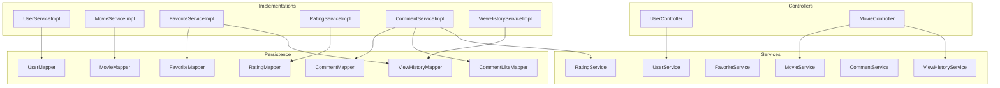

**Diagram sources**
- [UserController.java](file://backend/src/main/java/com/movie/backend/controller/UserController.java#L24-L129)
- [MovieController.java](file://backend/src/main/java/com/movie/backend/controller/MovieController.java#L33-L209)
- [UserService.java](file://backend/src/main/java/com/movie/backend/service/UserService.java#L8-L28)
- [UserServiceImpl.java](file://backend/src/main/java/com/movie/backend/service/impl/UserServiceImpl.java#L19-L176)
- [MovieService.java](file://backend/src/main/java/com/movie/backend/service/MovieService.java#L9-L59)
- [MovieServiceImpl.java](file://backend/src/main/java/com/movie/backend/service/impl/MovieServiceImpl.java#L18-L116)
- [FavoriteService.java](file://backend/src/main/java/com/movie/backend/service/FavoriteService.java#L7-L35)
- [FavoriteServiceImpl.java](file://backend/src/main/java/com/movie/backend/service/impl/FavoriteServiceImpl.java#L19-L155)
- [RatingService.java](file://backend/src/main/java/com/movie/backend/service/RatingService.java#L8-L43)
- [RatingServiceImpl.java](file://backend/src/main/java/com/movie/backend/service/impl/RatingServiceImpl.java#L16-L95)
- [CommentService.java](file://backend/src/main/java/com/movie/backend/service/CommentService.java#L7-L53)
- [CommentServiceImpl.java](file://backend/src/main/java/com/movie/backend/service/impl/CommentServiceImpl.java#L18-L125)
- [ViewHistoryService.java](file://backend/src/main/java/com/movie/backend/service/ViewHistoryService.java#L8-L38)
- [ViewHistoryServiceImpl.java](file://backend/src/main/java/com/movie/backend/service/impl/ViewHistoryServiceImpl.java#L16-L73)

**Section sources**
- [application.yml](file://backend/src/main/resources/application.yml#L1-L4)

## Core Components
- UserService and UserServiceImpl: Authentication, registration, profile updates, password change with token invalidation via password version increments, and statistics enrichment.
- MovieService and MovieServiceImpl: Movie retrieval, search with pagination, hot/recommended lists, filtering by genre/year, latest movies, and metadata extraction with robust parsing of comma-separated lists.
- FavoriteService and FavoriteServiceImpl: Add/remove favorites, folder-based organization, batch operations, and synchronized counts across folders.
- RatingService and RatingServiceImpl: Rating submission/update with strict range validation, uniqueness constraints, and movie score recalculation.
- CommentService and CommentServiceImpl: Comment lifecycle, combined rating/comment updates, likes with toggling, and cross-service collaboration with RatingService.
- ViewHistoryService and ViewHistoryServiceImpl: Record and manage user view history with transactional consistency and batch operations.

**Section sources**
- [UserService.java](file://backend/src/main/java/com/movie/backend/service/UserService.java#L8-L28)
- [UserServiceImpl.java](file://backend/src/main/java/com/movie/backend/service/impl/UserServiceImpl.java#L28-L176)
- [MovieService.java](file://backend/src/main/java/com/movie/backend/service/MovieService.java#L9-L59)
- [MovieServiceImpl.java](file://backend/src/main/java/com/movie/backend/service/impl/MovieServiceImpl.java#L24-L116)
- [FavoriteService.java](file://backend/src/main/java/com/movie/backend/service/FavoriteService.java#L7-L35)
- [FavoriteServiceImpl.java](file://backend/src/main/java/com/movie/backend/service/impl/FavoriteServiceImpl.java#L27-L155)
- [RatingService.java](file://backend/src/main/java/com/movie/backend/service/RatingService.java#L8-L43)
- [RatingServiceImpl.java](file://backend/src/main/java/com/movie/backend/service/impl/RatingServiceImpl.java#L22-L95)
- [CommentService.java](file://backend/src/main/java/com/movie/backend/service/CommentService.java#L7-L53)
- [CommentServiceImpl.java](file://backend/src/main/java/com/movie/backend/service/impl/CommentServiceImpl.java#L30-L125)
- [ViewHistoryService.java](file://backend/src/main/java/com/movie/backend/service/ViewHistoryService.java#L8-L38)
- [ViewHistoryServiceImpl.java](file://backend/src/main/java/com/movie/backend/service/impl/ViewHistoryServiceImpl.java#L23-L73)

## Architecture Overview
The service layer adheres to layered architecture:
- Controllers handle HTTP requests and responses, delegating to services.
- Services encapsulate business rules and orchestrate persistence via mappers.
- Utilities (e.g., JwtUtil) provide cross-cutting concerns like token management.
- Security is configured to be stateless with method-level controls enabled.

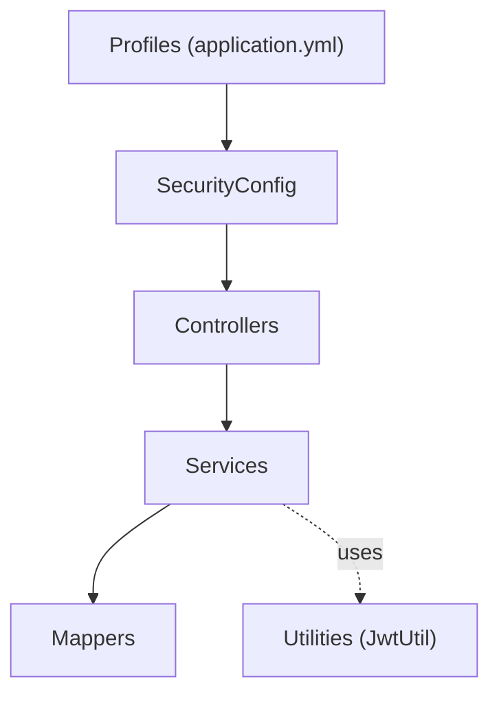

**Diagram sources**
- [SecurityConfig.java](file://backend/src/main/java/com/movie/backend/config/SecurityConfig.java#L16-L51)
- [JwtUtil.java](file://backend/src/main/java/com/movie/backend/utils/JwtUtil.java#L20-L179)
- [application.yml](file://backend/src/main/resources/application.yml#L1-L4)

**Section sources**
- [SecurityConfig.java](file://backend/src/main/java/com/movie/backend/config/SecurityConfig.java#L16-L51)
- [JwtUtil.java](file://backend/src/main/java/com/movie/backend/utils/JwtUtil.java#L20-L179)
- [application.yml](file://backend/src/main/resources/application.yml#L1-L4)

## Detailed Component Analysis

### UserService and UserServiceImpl
- Responsibilities:
  - Authenticate users with status checks and BCrypt verification.
  - Register new users with default roles/status and initial password version.
  - Manage avatars and public/private info exposure.
  - Enforce password changes by incrementing passwordVersion, invalidating tokens.
  - Enrich user info with statistics via comment mapper.
- Patterns:
  - Dependency Injection via @Service and @Autowired.
  - Validation and error handling with runtime exceptions.
  - DTO-to-entity copying and token generation.
- Transactionality:
  - Not transactional in this implementation; password change increments version atomically via mapper update.
- Cross-service coordination:
  - Uses JwtUtil for token generation and PasswordUtil for hashing.

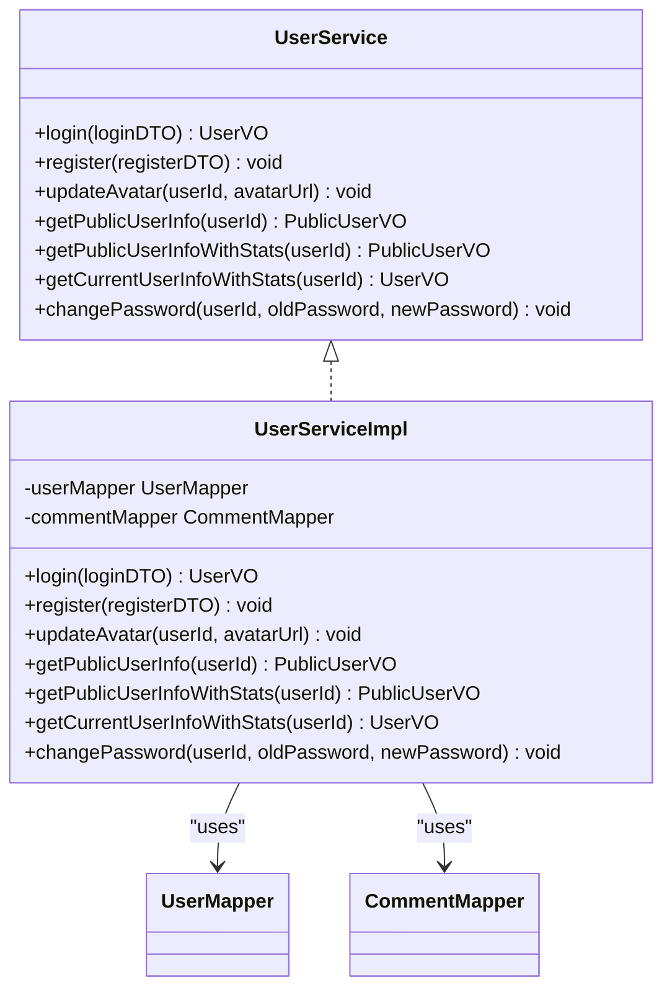

**Diagram sources**
- [UserService.java](file://backend/src/main/java/com/movie/backend/service/UserService.java#L8-L28)
- [UserServiceImpl.java](file://backend/src/main/java/com/movie/backend/service/impl/UserServiceImpl.java#L19-L176)

**Section sources**
- [UserServiceImpl.java](file://backend/src/main/java/com/movie/backend/service/impl/UserServiceImpl.java#L28-L176)

### MovieService and MovieServiceImpl
- Responsibilities:
  - Retrieve movie details, search with pagination, hot/recommended lists, genre/year filters, latest movies.
  - Provide metadata lists (genres, regions, years) with deduplication and normalization.
- Patterns:
  - Pagination via PageHelper.
  - Robust parsing of comma/slash-separated strings into normalized sets.
- Error handling:
  - Throws runtime exception when movie not found.

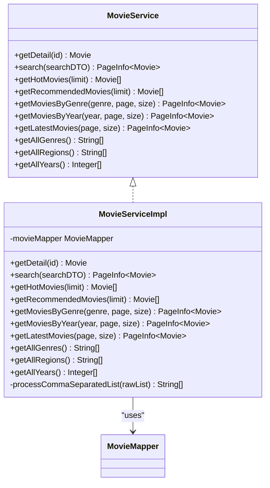

**Diagram sources**
- [MovieService.java](file://backend/src/main/java/com/movie/backend/service/MovieService.java#L9-L59)
- [MovieServiceImpl.java](file://backend/src/main/java/com/movie/backend/service/impl/MovieServiceImpl.java#L18-L116)

**Section sources**
- [MovieServiceImpl.java](file://backend/src/main/java/com/movie/backend/service/impl/MovieServiceImpl.java#L24-L116)

### FavoriteService and FavoriteServiceImpl
- Responsibilities:
  - Add/remove favorites globally or to a specific folder.
  - Batch deletion and clearing user favorites.
  - Count favorites and list paginated favorites and folder contents.
- Transactionality:
  - Uses @Transactional for operations that modify favorites and update folder counts.
- Business rules:
  - Default folder represented as 0; non-default folders update movie counts.
  - Batch operations compute per-folder decrements and apply them efficiently.

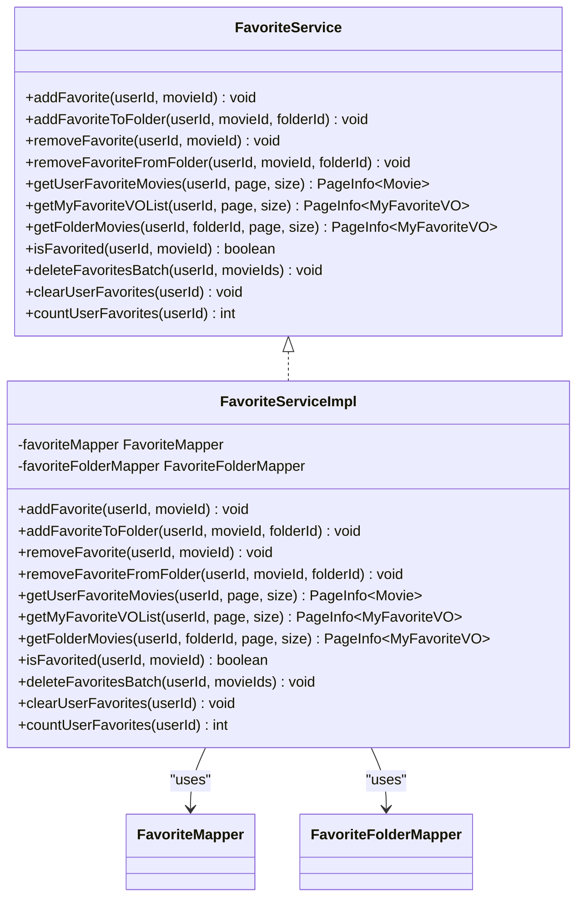

**Diagram sources**
- [FavoriteService.java](file://backend/src/main/java/com/movie/backend/service/FavoriteService.java#L7-L35)
- [FavoriteServiceImpl.java](file://backend/src/main/java/com/movie/backend/service/impl/FavoriteServiceImpl.java#L19-L155)

**Section sources**
- [FavoriteServiceImpl.java](file://backend/src/main/java/com/movie/backend/service/impl/FavoriteServiceImpl.java#L27-L155)

### RatingService and RatingServiceImpl
- Responsibilities:
  - Submit or update ratings with strict validation (range 10–50).
  - Enforce uniqueness per user-movie pair.
  - Recalculate movie scores after rating changes.
  - Paginate user ratings and provide enriched VO lists.
- Error handling:
  - Throws runtime exceptions for invalid inputs and missing records.

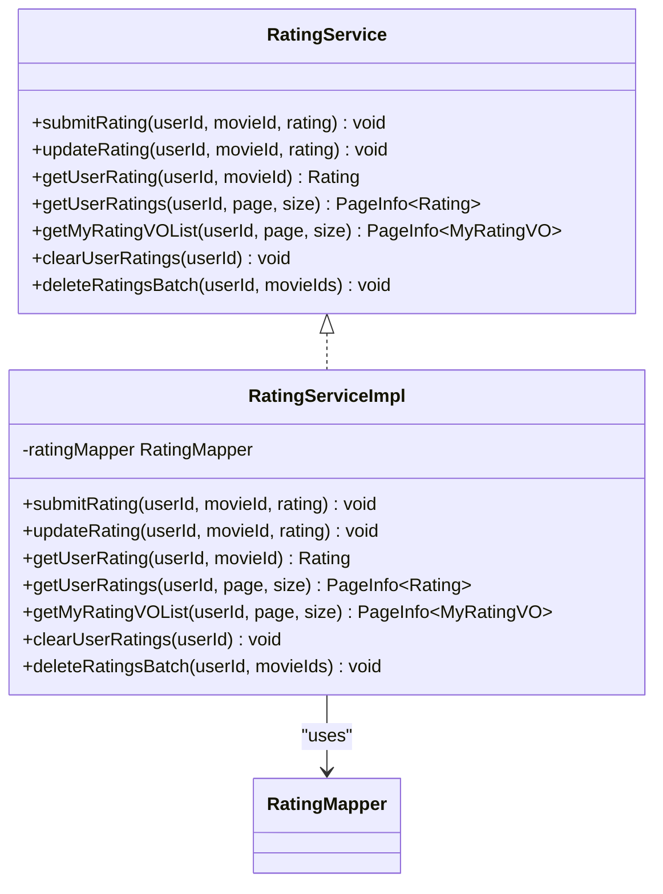

**Diagram sources**
- [RatingService.java](file://backend/src/main/java/com/movie/backend/service/RatingService.java#L8-L43)
- [RatingServiceImpl.java](file://backend/src/main/java/com/movie/backend/service/impl/RatingServiceImpl.java#L16-L95)

**Section sources**
- [RatingServiceImpl.java](file://backend/src/main/java/com/movie/backend/service/impl/RatingServiceImpl.java#L22-L95)

### CommentService and CommentServiceImpl
- Responsibilities:
  - Fetch comments with optional rating context.
  - Submit comments with uniqueness constraints per user-movie.
  - Update comments and optionally update ratings via RatingService.
  - Toggle likes with atomic upvote/downvote and maintain vote counts.
  - Paginate user comments.
- Cross-service coordination:
  - Delegates rating updates to RatingService.
  - Manages comment likes via CommentLikeMapper.

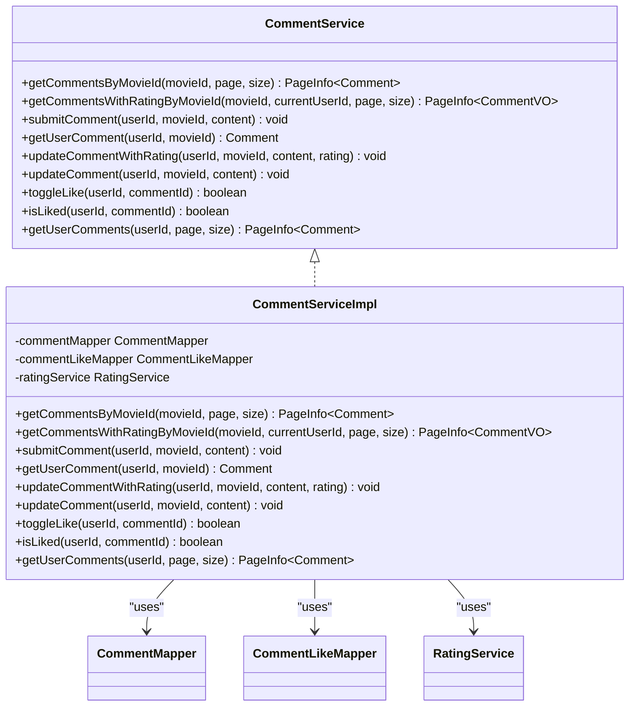

**Diagram sources**
- [CommentService.java](file://backend/src/main/java/com/movie/backend/service/CommentService.java#L7-L53)
- [CommentServiceImpl.java](file://backend/src/main/java/com/movie/backend/service/impl/CommentServiceImpl.java#L18-L125)

**Section sources**
- [CommentServiceImpl.java](file://backend/src/main/java/com/movie/backend/service/impl/CommentServiceImpl.java#L30-L125)

### ViewHistoryService and ViewHistoryServiceImpl
- Responsibilities:
  - Record user view history, updating timestamps for existing entries.
  - Paginate and filter user history, with batch deletion and clearing.
  - Provide counts and typed result lists.
- Transactionality:
  - Uses @Transactional for insert/update and batch operations.

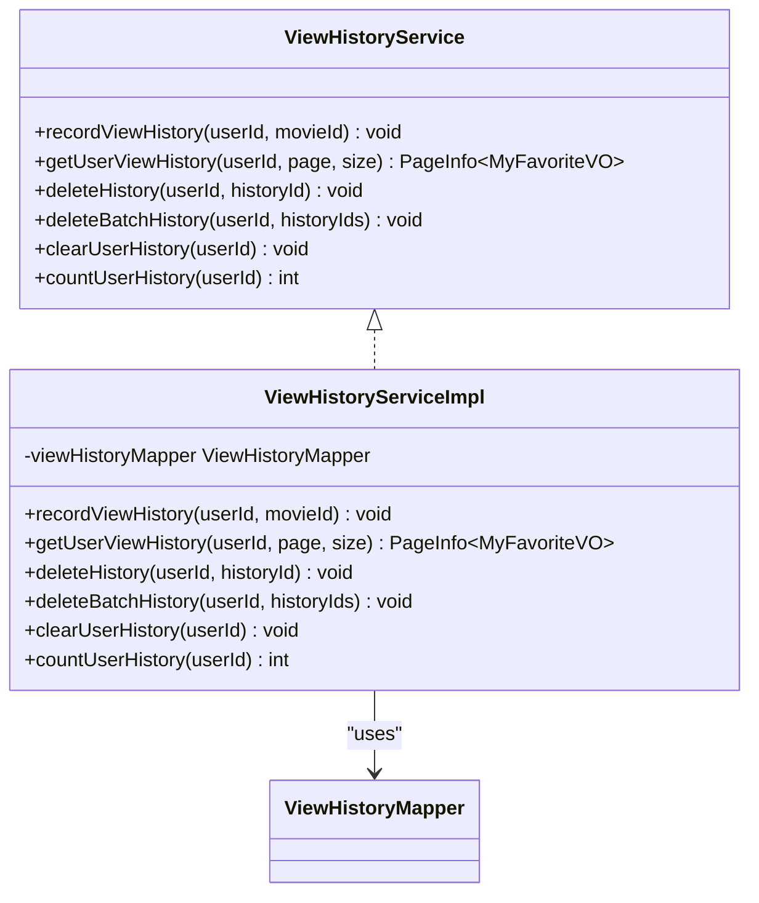

**Diagram sources**
- [ViewHistoryService.java](file://backend/src/main/java/com/movie/backend/service/ViewHistoryService.java#L8-L38)
- [ViewHistoryServiceImpl.java](file://backend/src/main/java/com/movie/backend/service/impl/ViewHistoryServiceImpl.java#L16-L73)

**Section sources**
- [ViewHistoryServiceImpl.java](file://backend/src/main/java/com/movie/backend/service/impl/ViewHistoryServiceImpl.java#L23-L73)

### Controller Integration and Orchestration
- UserController delegates to UserService for authentication, registration, profile operations, token refresh, logout, and password change.
- MovieController delegates to MovieService for queries and ViewHistoryService for recording views.
- Controllers enforce parameter validation and wrap results in a unified response wrapper.

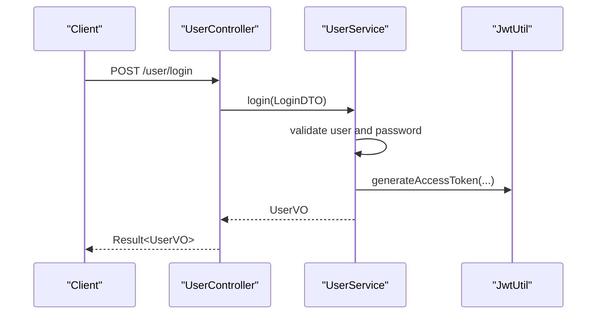

**Diagram sources**
- [UserController.java](file://backend/src/main/java/com/movie/backend/controller/UserController.java#L32-L36)
- [UserServiceImpl.java](file://backend/src/main/java/com/movie/backend/service/impl/UserServiceImpl.java#L28-L56)
- [JwtUtil.java](file://backend/src/main/java/com/movie/backend/utils/JwtUtil.java#L49-L81)

**Section sources**
- [UserController.java](file://backend/src/main/java/com/movie/backend/controller/UserController.java#L32-L128)
- [MovieController.java](file://backend/src/main/java/com/movie/backend/controller/MovieController.java#L41-L66)

## Dependency Analysis
- Coupling:
  - Services depend on mappers for persistence; controllers depend on services.
  - CommentServiceImpl depends on RatingService for rating updates, demonstrating intentional composition.
- Cohesion:
  - Each service encapsulates a cohesive domain capability with clear boundaries.
- Transactions:
  - FavoriteServiceImpl, CommentServiceImpl, and ViewHistoryServiceImpl use @Transactional for atomicity across related writes.
- External integrations:
  - JwtUtil centralizes token creation/validation and integrates with UserMapper for state checks during refresh.
  - SecurityConfig enables stateless JWT-based authentication and method-level security.

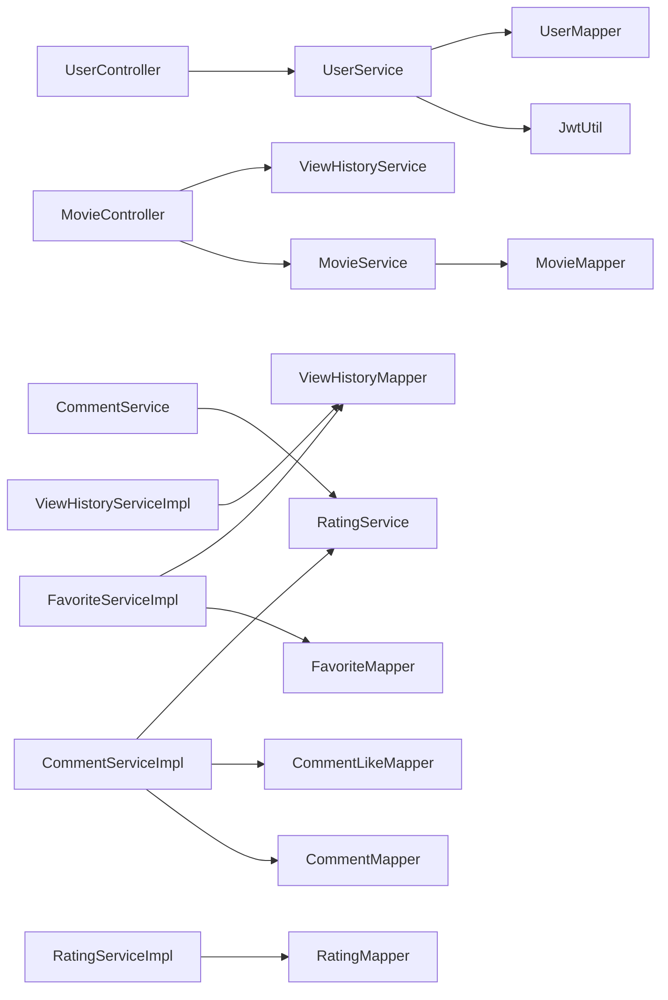

**Diagram sources**
- [UserController.java](file://backend/src/main/java/com/movie/backend/controller/UserController.java#L26-L30)
- [MovieController.java](file://backend/src/main/java/com/movie/backend/controller/MovieController.java#L35-L39)
- [CommentServiceImpl.java](file://backend/src/main/java/com/movie/backend/service/impl/CommentServiceImpl.java#L27-L28)
- [JwtUtil.java](file://backend/src/main/java/com/movie/backend/utils/JwtUtil.java#L40-L41)

**Section sources**
- [SecurityConfig.java](file://backend/src/main/java/com/movie/backend/config/SecurityConfig.java#L16-L51)
- [JwtUtil.java](file://backend/src/main/java/com/movie/backend/utils/JwtUtil.java#L20-L179)

## Performance Considerations
- Pagination:
  - PageHelper is used consistently across MovieService, FavoriteService, RatingService, CommentService, and ViewHistoryService to avoid large result sets.
- Batch operations:
  - FavoriteServiceImpl and RatingServiceImpl implement batch deletion to reduce round-trips.
- Comma-separated parsing:
  - MovieServiceImpl normalizes genres/regions with a sorted set to minimize duplicates and improve downstream filtering.
- Token invalidation:
  - UserService increments passwordVersion on password change, forcing clients to re-authenticate and reducing stale session risks.
- Caching:
  - Consider adding Redis-backed caching for frequently accessed metadata (genres, regions, years) and user stats to reduce DB load.

[No sources needed since this section provides general guidance]

## Troubleshooting Guide
- Authentication failures:
  - Verify user status and password match via UserServiceImpl; check JwtUtil token generation and refresh logic.
- Registration conflicts:
  - UserServiceImpl throws on duplicate IDs; ensure client handles conflict responses.
- Rating errors:
  - RatingServiceImpl validates range and uniqueness; ensure clients provide valid inputs.
- Comment constraints:
  - CommentServiceImpl enforces single comment per user-movie; handle “already rated/commented” scenarios gracefully.
- Transaction anomalies:
  - FavoriteServiceImpl, CommentServiceImpl, and ViewHistoryServiceImpl rely on @Transactional; ensure rollback conditions and consistent mapper usage.

**Section sources**
- [UserServiceImpl.java](file://backend/src/main/java/com/movie/backend/service/impl/UserServiceImpl.java#L28-L76)
- [RatingServiceImpl.java](file://backend/src/main/java/com/movie/backend/service/impl/RatingServiceImpl.java#L22-L58)
- [CommentServiceImpl.java](file://backend/src/main/java/com/movie/backend/service/impl/CommentServiceImpl.java#L46-L90)
- [FavoriteServiceImpl.java](file://backend/src/main/java/com/movie/backend/service/impl/FavoriteServiceImpl.java#L38-L83)
- [ViewHistoryServiceImpl.java](file://backend/src/main/java/com/movie/backend/service/impl/ViewHistoryServiceImpl.java#L23-L61)

## Conclusion
The service layer cleanly separates business logic from presentation and persistence, enabling testability, maintainability, and scalability. It leverages dependency injection, pagination, transactional boundaries, and cross-service composition to deliver robust workflows. JWT utilities and Spring Security integrate seamlessly for stateless authentication. With targeted caching and further modularization, the architecture supports high performance and evolving feature needs.

[No sources needed since this section summarizes without analyzing specific files]

## Appendices

### Example Workflows

#### Workflow: User Login and Token Refresh
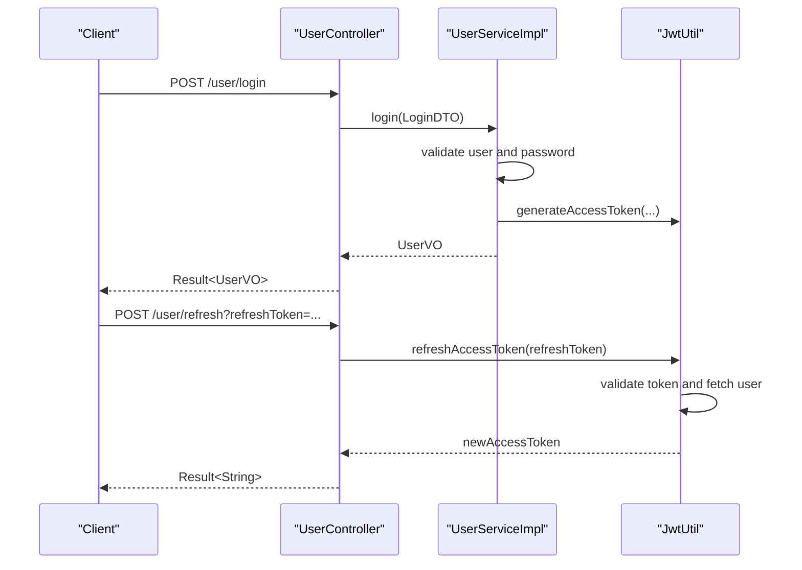

**Diagram sources**
- [UserController.java](file://backend/src/main/java/com/movie/backend/controller/UserController.java#L32-L86)
- [UserServiceImpl.java](file://backend/src/main/java/com/movie/backend/service/impl/UserServiceImpl.java#L28-L56)
- [JwtUtil.java](file://backend/src/main/java/com/movie/backend/utils/JwtUtil.java#L120-L155)

#### Workflow: Submit Rating and Update Comments
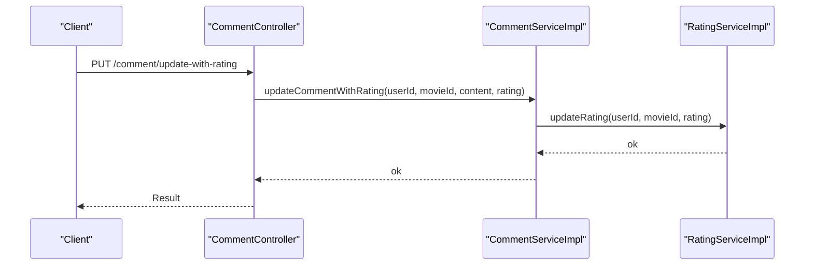

**Diagram sources**
- [CommentServiceImpl.java](file://backend/src/main/java/com/movie/backend/service/impl/CommentServiceImpl.java#L70-L81)
- [RatingServiceImpl.java](file://backend/src/main/java/com/movie/backend/service/impl/RatingServiceImpl.java#L45-L58)

### Testing Strategies and Mocking Patterns
- Unit tests:
  - Mock mappers and utilities (e.g., JwtUtil) to isolate service logic.
  - Use parameterized tests for boundary conditions (rating range, pagination limits).
- Integration tests:
  - Test controller-service boundaries with @MockBean for services.
  - Validate pagination and cross-service interactions (e.g., MovieController + ViewHistoryService).
- Transactional tests:
  - Use @Commit/@Rollback to verify @Transactional semantics for FavoriteServiceImpl and CommentServiceImpl.

[No sources needed since this section provides general guidance]

### Cross-Service Coordination Checklist
- Always validate preconditions (existence, uniqueness) before mutating state.
- Use @Transactional for multi-step writes to maintain consistency.
- Keep DTOs explicit and separate from entities to decouple APIs from persistence.
- Centralize shared utilities (e.g., JwtUtil) to avoid duplication and ensure consistent behavior.

[No sources needed since this section provides general guidance]