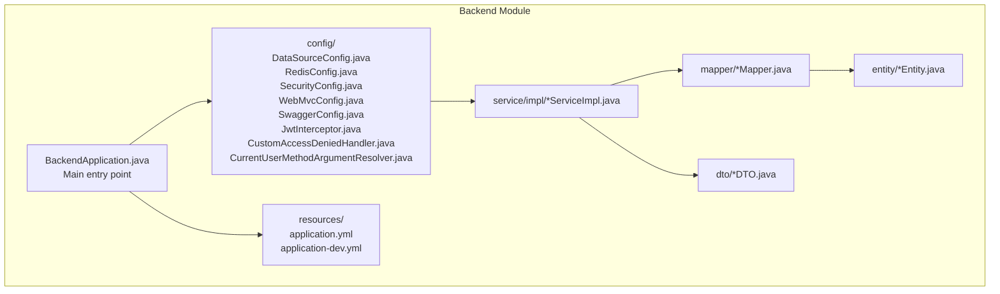
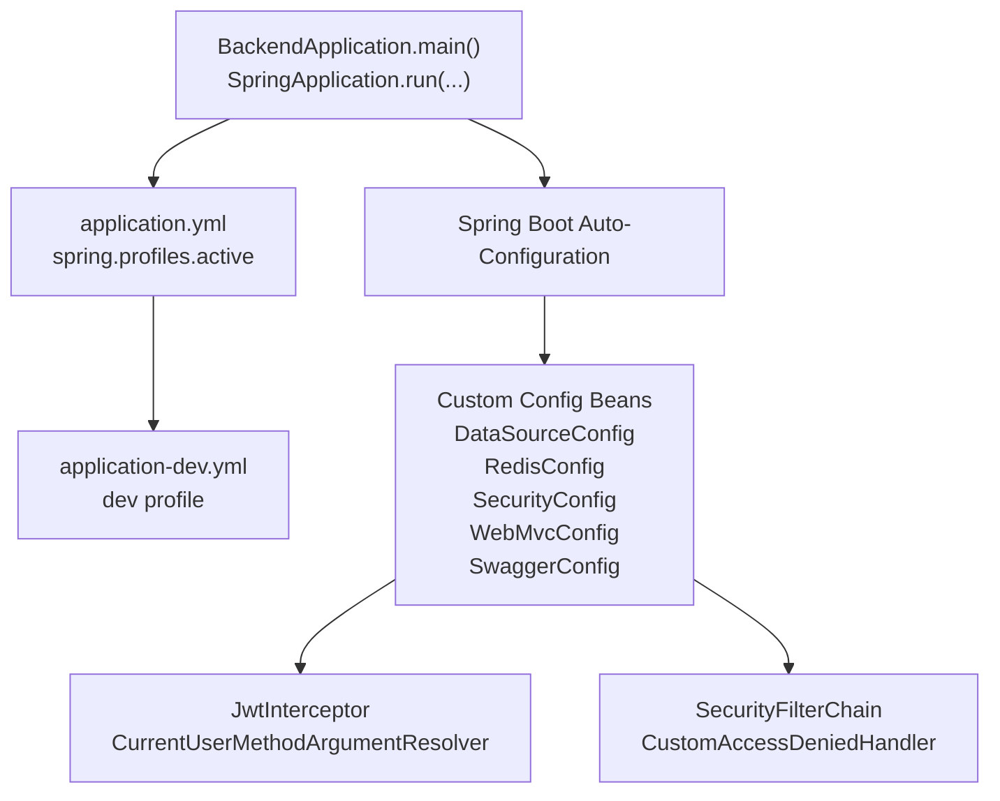
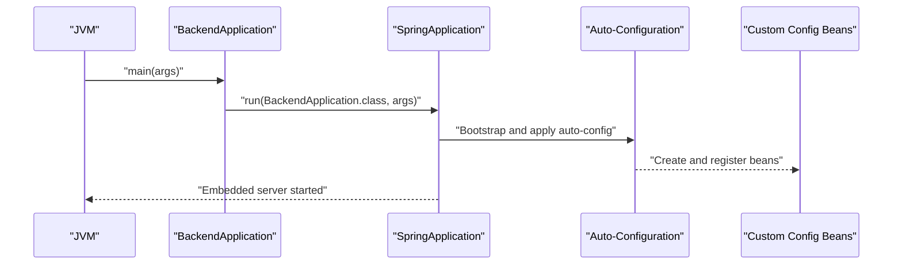
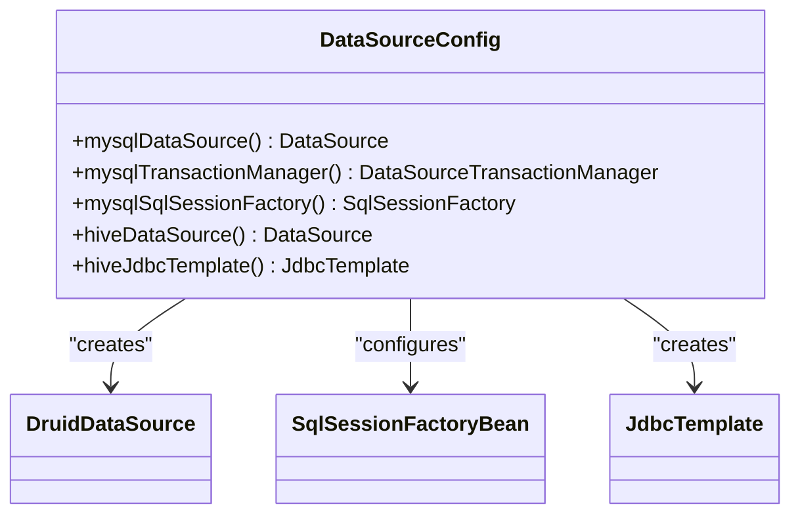
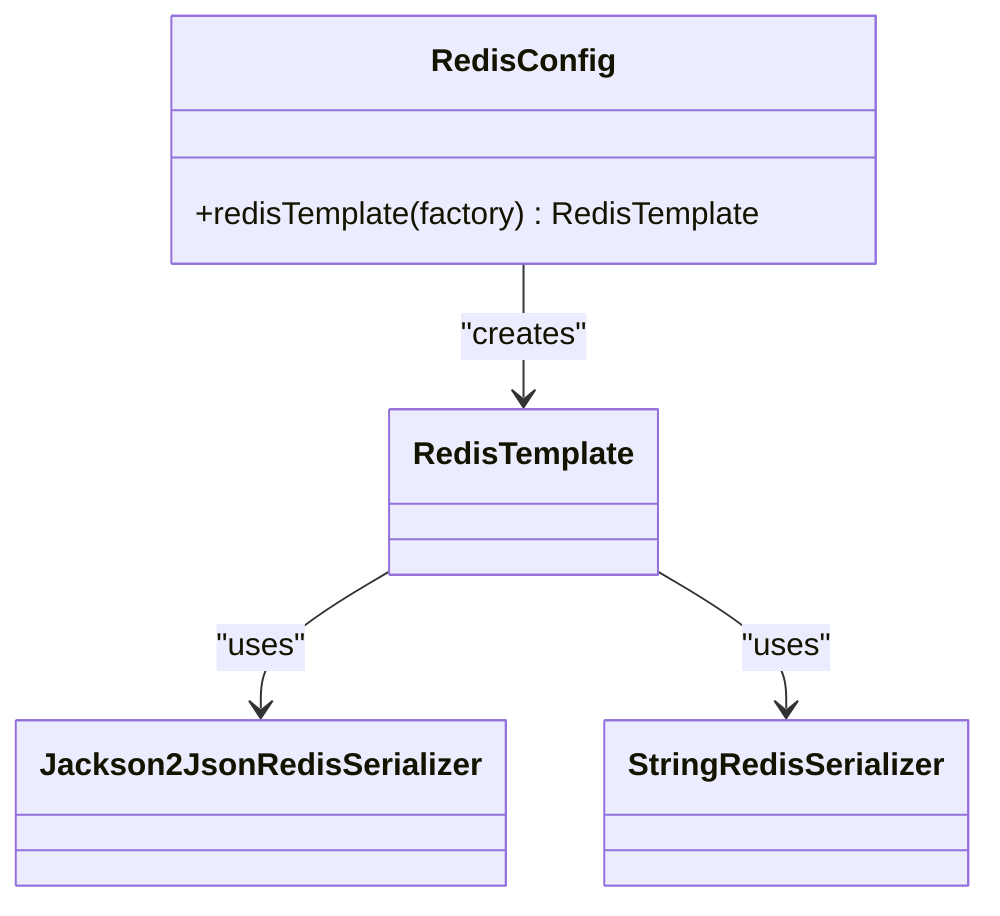
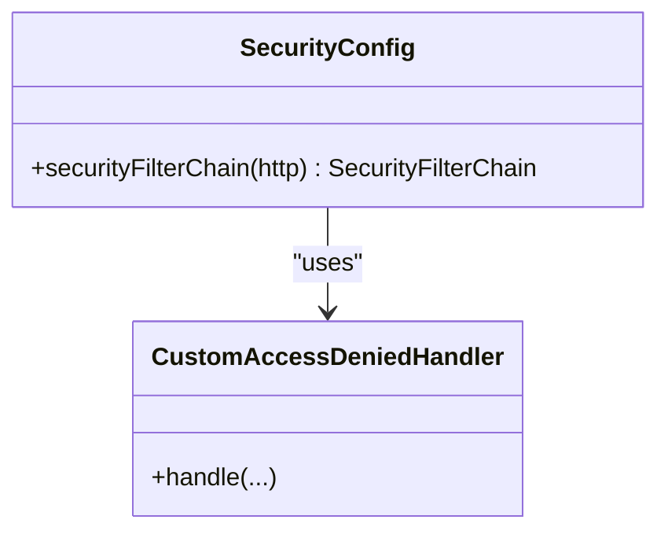
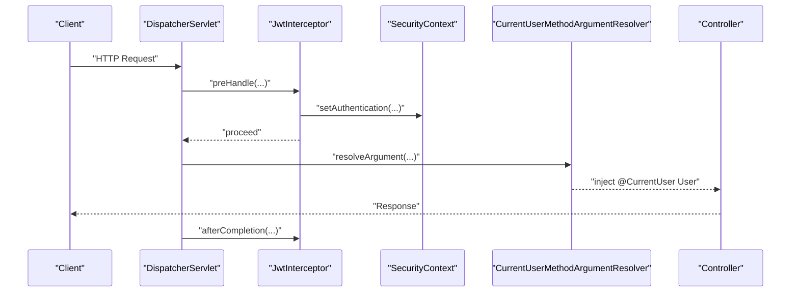

# Spring Boot Configuration

<cite>
**Referenced Files in This Document**
- [BackendApplication.java](file://backend/src/main/java/com/movie/backend/BackendApplication.java)
- [pom.xml](file://backend/pom.xml)
- [application.yml](file://backend/src/main/resources/application.yml)
- [application-dev.yml](file://backend/src/main/resources/application-dev.yml)
- [DataSourceConfig.java](file://backend/src/main/java/com/movie/backend/config/DataSourceConfig.java)
- [RedisConfig.java](file://backend/src/main/java/com/movie/backend/config/RedisConfig.java)
- [SecurityConfig.java](file://backend/src/main/java/com/movie/backend/config/SecurityConfig.java)
- [WebMvcConfig.java](file://backend/src/main/java/com/movie/backend/config/WebMvcConfig.java)
- [SwaggerConfig.java](file://backend/src/main/java/com/movie/backend/config/SwaggerConfig.java)
- [JwtInterceptor.java](file://backend/src/main/java/com/movie/backend/config/JwtInterceptor.java)
- [CustomAccessDeniedHandler.java](file://backend/src/main/java/com/movie/backend/config/CustomAccessDeniedHandler.java)
- [CurrentUserMethodArgumentResolver.java](file://backend/src/main/java/com/movie/backend/config/CurrentUserMethodArgumentResolver.java)
</cite>

## Table of Contents
1. [Introduction](#introduction)
2. [Project Structure](#project-structure)
3. [Core Components](#core-components)
4. [Architecture Overview](#architecture-overview)
5. [Detailed Component Analysis](#detailed-component-analysis)
6. [Dependency Analysis](#dependency-analysis)
7. [Performance Considerations](#performance-considerations)
8. [Troubleshooting Guide](#troubleshooting-guide)
9. [Conclusion](#conclusion)
10. [Appendices](#appendices)

## Introduction
This document explains the Spring Boot configuration for the backend module of the movie review system. It covers the application entry point, component scanning, auto-configuration, environment-specific configuration profiles, Maven dependencies and build setup, configuration management patterns, property binding, externalized configuration strategies, application lifecycle and startup sequence, and practical examples for environment-specific overrides.

## Project Structure
The backend module follows a conventional Spring Boot layout:
- Application entry point under the main Java source tree
- Resources for configuration and MyBatis XML mappers
- Feature-based packages for controllers, services, mappers, DTOs, entities, and configuration
- Tests under the test source tree

**Diagram sources**
- [BackendApplication.java](file://backend/src/main/java/com/movie/backend/BackendApplication.java#L1-L17)
- [application.yml](file://backend/src/main/resources/application.yml#L1-L4)
- [application-dev.yml](file://backend/src/main/resources/application-dev.yml#L1-L67)
- [DataSourceConfig.java](file://backend/src/main/java/com/movie/backend/config/DataSourceConfig.java#L1-L62)
- [RedisConfig.java](file://backend/src/main/java/com/movie/backend/config/RedisConfig.java#L1-L42)
- [SecurityConfig.java](file://backend/src/main/java/com/movie/backend/config/SecurityConfig.java#L1-L51)
- [WebMvcConfig.java](file://backend/src/main/java/com/movie/backend/config/WebMvcConfig.java#L1-L65)
- [SwaggerConfig.java](file://backend/src/main/java/com/movie/backend/config/SwaggerConfig.java#L1-L19)
- [JwtInterceptor.java](file://backend/src/main/java/com/movie/backend/config/JwtInterceptor.java#L1-L105)
- [CustomAccessDeniedHandler.java](file://backend/src/main/java/com/movie/backend/config/CustomAccessDeniedHandler.java#L1-L27)
- [CurrentUserMethodArgumentResolver.java](file://backend/src/main/java/com/movie/backend/config/CurrentUserMethodArgumentResolver.java#L1-L51)

**Section sources**
- [BackendApplication.java](file://backend/src/main/java/com/movie/backend/BackendApplication.java#L1-L17)
- [pom.xml](file://backend/pom.xml#L1-L300)
- [application.yml](file://backend/src/main/resources/application.yml#L1-L4)
- [application-dev.yml](file://backend/src/main/resources/application-dev.yml#L1-L67)

## Core Components
- Application entry point and auto-configuration:
  - The main class is annotated for component scanning and auto-configuration, enabling scheduling support.
  - The application starts via the Spring Boot runner.

- Environment profile activation:
  - The active profile is set in the primary configuration file, selecting the development profile by default.

- Configuration beans:
  - Data source configuration binds properties to a primary MySQL data source and a secondary Hive data source.
  - Redis configuration defines serialization and template wiring.
  - Security configuration enables stateless JWT-based authentication and method-level security.
  - MVC configuration registers CORS, interceptors, argument resolvers, and static resource handlers.
  - Swagger configuration exposes OpenAPI documentation.

- Property binding and externalization:
  - Properties are bound using prefix-based configuration properties.
  - Environment-specific overrides are supported via profile-specific YAML files.

**Section sources**
- [BackendApplication.java](file://backend/src/main/java/com/movie/backend/BackendApplication.java#L8-L14)
- [application.yml](file://backend/src/main/resources/application.yml#L1-L4)
- [application-dev.yml](file://backend/src/main/resources/application-dev.yml#L1-L67)
- [DataSourceConfig.java](file://backend/src/main/java/com/movie/backend/config/DataSourceConfig.java#L18-L61)
- [RedisConfig.java](file://backend/src/main/java/com/movie/backend/config/RedisConfig.java#L14-L41)
- [SecurityConfig.java](file://backend/src/main/java/com/movie/backend/config/SecurityConfig.java#L16-L50)
- [WebMvcConfig.java](file://backend/src/main/java/com/movie/backend/config/WebMvcConfig.java#L13-L64)
- [SwaggerConfig.java](file://backend/src/main/java/com/movie/backend/config/SwaggerConfig.java#L8-L18)

## Architecture Overview
The runtime configuration architecture integrates Spring Boot’s auto-configuration with explicit configuration beans and environment-specific properties.

**Diagram sources**
- [BackendApplication.java](file://backend/src/main/java/com/movie/backend/BackendApplication.java#L12-L14)
- [application.yml](file://backend/src/main/resources/application.yml#L1-L4)
- [application-dev.yml](file://backend/src/main/resources/application-dev.yml#L1-L67)
- [DataSourceConfig.java](file://backend/src/main/java/com/movie/backend/config/DataSourceConfig.java#L18-L61)
- [RedisConfig.java](file://backend/src/main/java/com/movie/backend/config/RedisConfig.java#L14-L41)
- [SecurityConfig.java](file://backend/src/main/java/com/movie/backend/config/SecurityConfig.java#L16-L50)
- [WebMvcConfig.java](file://backend/src/main/java/com/movie/backend/config/WebMvcConfig.java#L13-L64)
- [SwaggerConfig.java](file://backend/src/main/java/com/movie/backend/config/SwaggerConfig.java#L8-L18)
- [JwtInterceptor.java](file://backend/src/main/java/com/movie/backend/config/JwtInterceptor.java#L24-L104)
- [CustomAccessDeniedHandler.java](file://backend/src/main/java/com/movie/backend/config/CustomAccessDeniedHandler.java#L16-L26)

## Detailed Component Analysis

### Application Entry Point and Auto-Configuration
- The main class enables component scanning and auto-configuration, and activates scheduling.
- Spring Boot’s auto-configuration selects starters and creates beans based on classpath and properties.

**Diagram sources**
- [BackendApplication.java](file://backend/src/main/java/com/movie/backend/BackendApplication.java#L12-L14)

**Section sources**
- [BackendApplication.java](file://backend/src/main/java/com/movie/backend/BackendApplication.java#L8-L14)

### Data Source Configuration and Property Binding
- Primary MySQL data source is configured with Druid and bound to properties under the primary prefix.
- Secondary Hive data source is configured separately and bound to a custom prefix.
- MyBatis session factory is created with mapper locations and underscore-to-camel mapping.

**Diagram sources**
- [DataSourceConfig.java](file://backend/src/main/java/com/movie/backend/config/DataSourceConfig.java#L18-L61)

**Section sources**
- [DataSourceConfig.java](file://backend/src/main/java/com/movie/backend/config/DataSourceConfig.java#L18-L61)
- [application-dev.yml](file://backend/src/main/resources/application-dev.yml#L11-L51)

### Redis Configuration and Serialization
- Redis template is configured with JSON serialization for values and string serialization for keys and hash keys.
- Jackson2JsonRedisSerializer and StringRedisSerializer are applied to the template.

**Diagram sources**
- [RedisConfig.java](file://backend/src/main/java/com/movie/backend/config/RedisConfig.java#L14-L41)

**Section sources**
- [RedisConfig.java](file://backend/src/main/java/com/movie/backend/config/RedisConfig.java#L14-L41)
- [application-dev.yml](file://backend/src/main/resources/application-dev.yml#L26-L32)

### Security Configuration and Method-Level Authorization
- Stateless JWT-based security is enabled with CSRF disabled and form/basic login disabled.
- Method-level security is enabled using annotations.
- Access denied requests are handled by a custom handler returning JSON.

**Diagram sources**
- [SecurityConfig.java](file://backend/src/main/java/com/movie/backend/config/SecurityConfig.java#L16-L50)
- [CustomAccessDeniedHandler.java](file://backend/src/main/java/com/movie/backend/config/CustomAccessDeniedHandler.java#L16-L26)

**Section sources**
- [SecurityConfig.java](file://backend/src/main/java/com/movie/backend/config/SecurityConfig.java#L16-L50)
- [CustomAccessDeniedHandler.java](file://backend/src/main/java/com/movie/backend/config/CustomAccessDeniedHandler.java#L16-L26)

### MVC Configuration, Interceptors, and Static Resources
- CORS is enabled globally with credentials allowed.
- A JWT interceptor validates tokens and sets Spring Security context and a thread-local user.
- A custom argument resolver injects the current user into controller methods annotated with a custom annotation.
- Static image resources are mapped to a configurable upload path.

**Diagram sources**
- [WebMvcConfig.java](file://backend/src/main/java/com/movie/backend/config/WebMvcConfig.java#L13-L64)
- [JwtInterceptor.java](file://backend/src/main/java/com/movie/backend/config/JwtInterceptor.java#L24-L104)
- [CurrentUserMethodArgumentResolver.java](file://backend/src/main/java/com/movie/backend/config/CurrentUserMethodArgumentResolver.java#L17-L50)

**Section sources**
- [WebMvcConfig.java](file://backend/src/main/java/com/movie/backend/config/WebMvcConfig.java#L13-L64)
- [JwtInterceptor.java](file://backend/src/main/java/com/movie/backend/config/JwtInterceptor.java#L24-L104)
- [CurrentUserMethodArgumentResolver.java](file://backend/src/main/java/com/movie/backend/config/CurrentUserMethodArgumentResolver.java#L17-L50)
- [application-dev.yml](file://backend/src/main/resources/application-dev.yml#L58-L60)

### Swagger/OpenAPI Configuration
- OpenAPI metadata is exposed via a configuration bean.

**Section sources**
- [SwaggerConfig.java](file://backend/src/main/java/com/movie/backend/config/SwaggerConfig.java#L8-L18)

## Dependency Analysis
The Maven build integrates Spring Boot starters, MyBatis, database drivers, Redis, security, validation, pagehelper, Hive JDBC, and Swagger UI. Dependency management pins Spring Boot and aligns Netty versions.

```mermaid
graph TB
POM["pom.xml"]
SBW["spring-boot-starter-web"]
SBT["spring-boot-starter-test"]
LOMBOK["lombok"]
MB["mybatis-spring-boot-starter"]
MYSQL["mysql-connector-java"]
VALID["spring-boot-starter-validation"]
DRUID["druid-spring-boot-starter"]
REDIS["spring-boot-starter-data-redis"]
SWG["springdoc-openapi-ui"]
HIVE["hive-jdbc (exclusions + safe deps)"]
SEC["spring-boot-starter-security"]
PH["pagehelper-spring-boot-starter"]
NETTY["netty-all (managed)"]
POM --> SBW
POM --> SBT
POM --> LOMBOK
POM --> MB
POM --> MYSQL
POM --> VALID
POM --> DRUID
POM --> REDIS
POM --> SWG
POM --> HIVE
POM --> SEC
POM --> PH
POM --> NETTY
```

**Diagram sources**
- [pom.xml](file://backend/pom.xml#L17-L248)

**Section sources**
- [pom.xml](file://backend/pom.xml#L10-L265)

## Performance Considerations
- Connection pooling: Druid is configured for the primary data source; tune initial size, min idle, max active, and wait timeouts per environment.
- Tomcat thread tuning: Max threads and keep-alive settings are tuned in the development profile; adjust for production load.
- Upload limits: Multipart file and request size limits are set in the development profile; increase appropriately for production.
- Logging: Verbose logging is enabled for the backend package; reduce log levels in production for performance.
- Redis serialization: JSON serialization adds overhead; ensure payload sizes are reasonable and consider compression if needed.

[No sources needed since this section provides general guidance]

## Troubleshooting Guide
- Profile activation: Verify the active profile is correctly set so the intended environment file is loaded.
- Property binding failures: Ensure property prefixes match configuration classes and YAML structure.
- CORS and interceptors: Confirm interceptor paths exclude public endpoints and allow credentials where required.
- Security exceptions: Review custom access denied handler responses and ensure proper JSON error payloads.
- Static resources: Validate the upload path exists and is readable; confirm trailing slash handling for resource mapping.

**Section sources**
- [application.yml](file://backend/src/main/resources/application.yml#L1-L4)
- [application-dev.yml](file://backend/src/main/resources/application-dev.yml#L1-L67)
- [WebMvcConfig.java](file://backend/src/main/java/com/movie/backend/config/WebMvcConfig.java#L25-L63)
- [CustomAccessDeniedHandler.java](file://backend/src/main/java/com/movie/backend/config/CustomAccessDeniedHandler.java#L16-L26)

## Conclusion
The backend module leverages Spring Boot’s auto-configuration while explicitly configuring data sources, Redis, security, MVC, and OpenAPI. Environment-specific settings are externalized via YAML profiles, and property binding is achieved through configuration classes. The application lifecycle is straightforward: the main class boots the embedded server, auto-configuration wires beans, and custom configuration completes the setup. Following the patterns documented here ensures maintainable and environment-aware configuration.

[No sources needed since this section summarizes without analyzing specific files]

## Appendices

### Environment-Specific Configuration Patterns
- Activate a profile via the primary configuration file.
- Override properties in the profile-specific YAML file.
- Bind properties to configuration classes using the appropriate prefixes.
- Use placeholders and defaults in MVC configuration for flexible deployment.

**Section sources**
- [application.yml](file://backend/src/main/resources/application.yml#L1-L4)
- [application-dev.yml](file://backend/src/main/resources/application-dev.yml#L1-L67)
- [WebMvcConfig.java](file://backend/src/main/java/com/movie/backend/config/WebMvcConfig.java#L16-L17)

### Practical Examples
- Switching environments:
  - Change the active profile in the primary configuration file to select a different environment file.
- Customizing data source:
  - Adjust pool sizes and validation query in the profile-specific YAML.
- Tuning Tomcat:
  - Modify thread and timeout settings in the development profile YAML.
- Extending configuration:
  - Add new properties under the appropriate prefix and bind them in a configuration class.

**Section sources**
- [application.yml](file://backend/src/main/resources/application.yml#L1-L4)
- [application-dev.yml](file://backend/src/main/resources/application-dev.yml#L1-L67)
- [DataSourceConfig.java](file://backend/src/main/java/com/movie/backend/config/DataSourceConfig.java#L24-L28)
- [WebMvcConfig.java](file://backend/src/main/java/com/movie/backend/config/WebMvcConfig.java#L26-L32)