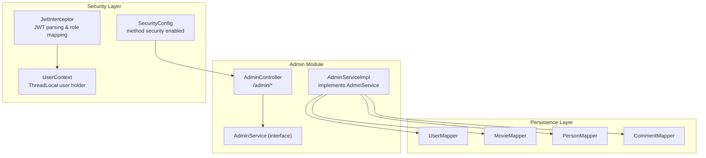
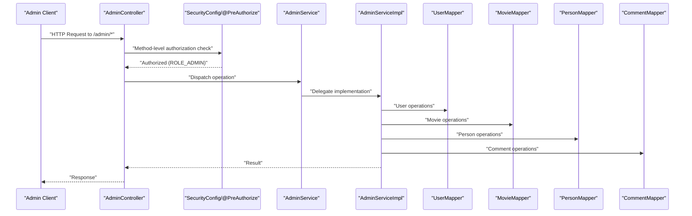
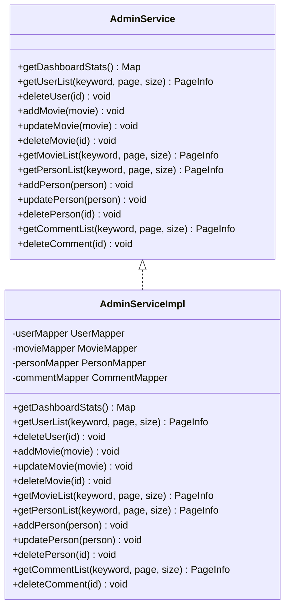
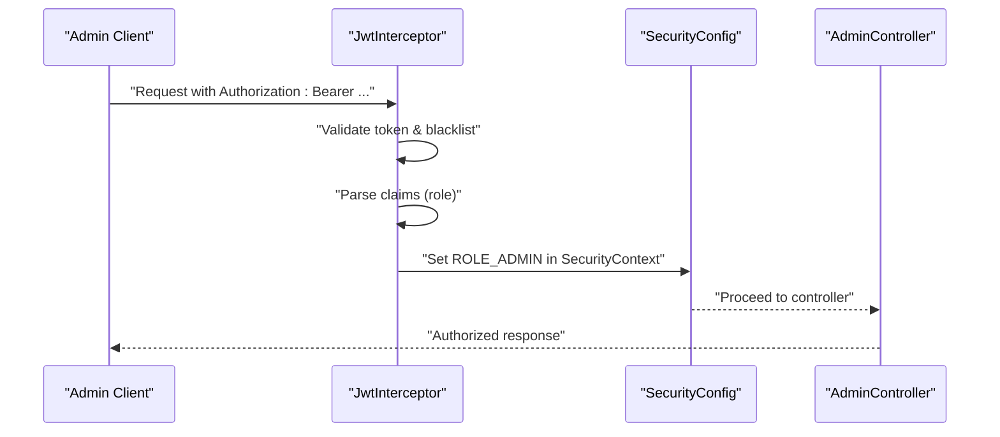
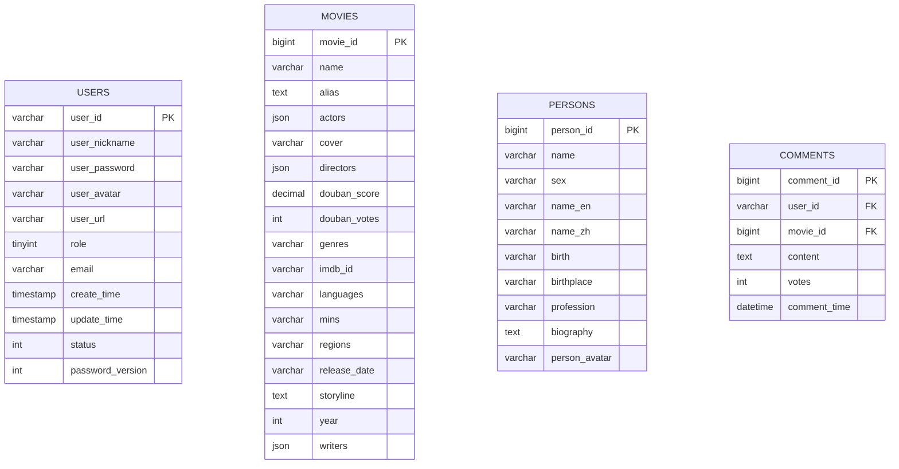
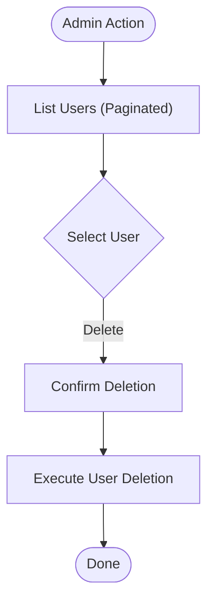
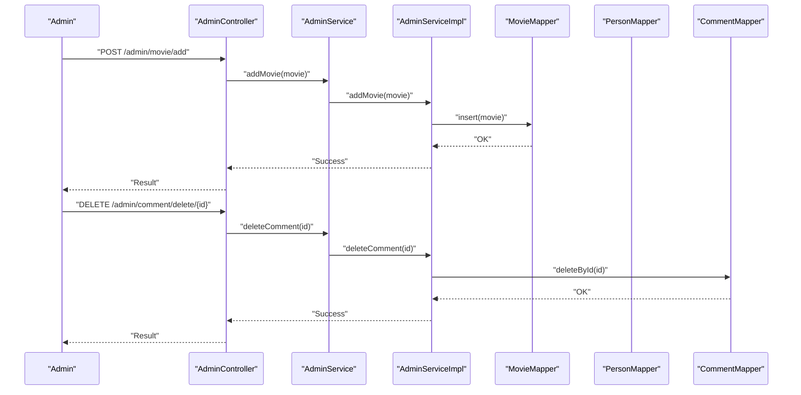
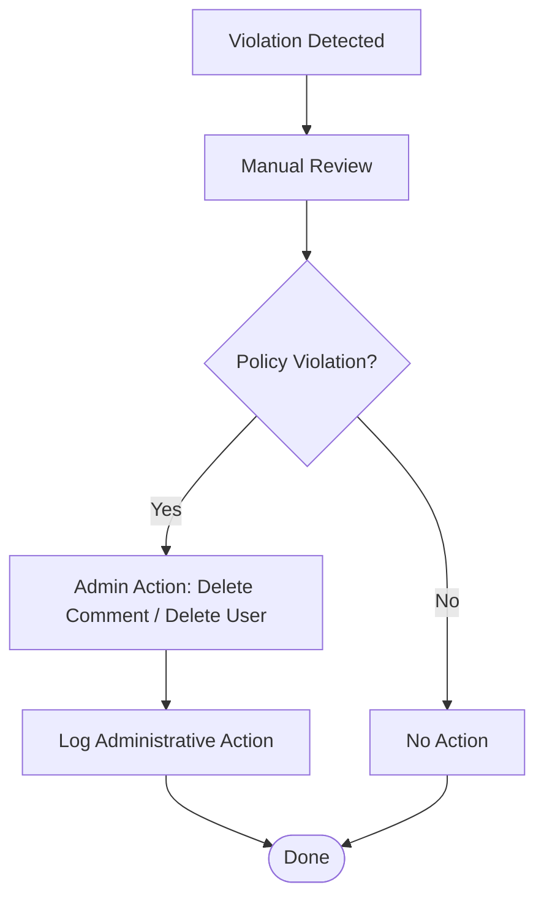
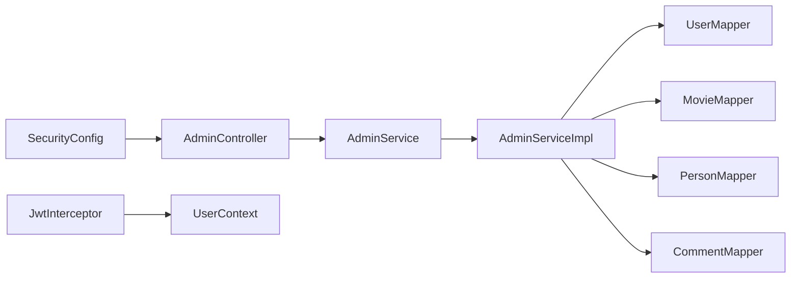

# Admin Services

<cite>
**Referenced Files in This Document**
- [AdminController.java](file://backend/src/main/java/com/movie/backend/controller/admin/AdminController.java)
- [AdminService.java](file://backend/src/main/java/com/movie/backend/service/AdminService.java)
- [AdminServiceImpl.java](file://backend/src/main/java/com/movie/backend/service/impl/AdminServiceImpl.java)
- [SecurityConfig.java](file://backend/src/main/java/com/movie/backend/config/SecurityConfig.java)
- [JwtInterceptor.java](file://backend/src/main/java/com/movie/backend/config/JwtInterceptor.java)
- [UserContext.java](file://backend/src/main/java/com/movie/backend/context/UserContext.java)
- [User.java](file://backend/src/main/java/com/movie/backend/entity/User.java)
- [UserMapper.java](file://backend/src/main/java/com/movie/backend/mapper/UserMapper.java)
- [MovieMapper.java](file://backend/src/main/java/com/movie/backend/mapper/MovieMapper.java)
- [PersonMapper.java](file://backend/src/main/java/com/movie/backend/mapper/PersonMapper.java)
- [CommentMapper.java](file://backend/src/main/java/com/movie/backend/mapper/CommentMapper.java)
- [movie_db.sql](file://backend/sql/movie_db.sql)
- [add_user_status_and_password_version.sql](file://backend/sql/add_user_status_and_password_version.sql)
- [application-dev.yml](file://backend/src/main/resources/application-dev.yml)
</cite>

## Table of Contents
1. [Introduction](#introduction)
2. [Project Structure](#project-structure)
3. [Core Components](#core-components)
4. [Architecture Overview](#architecture-overview)
5. [Detailed Component Analysis](#detailed-component-analysis)
6. [Dependency Analysis](#dependency-analysis)
7. [Performance Considerations](#performance-considerations)
8. [Troubleshooting Guide](#troubleshooting-guide)
9. [Conclusion](#conclusion)
10. [Appendices](#appendices)

## Introduction
This document describes the Admin Service implementation for the movie system. It focuses on administrative workflows including user moderation, content management, and system administration tasks. It documents user account management, content moderation workflows, violation handling procedures, administrative permissions and role-based access control, and outlines audit trail considerations. It also covers integration points with security components, logging systems, and notification mechanisms, along with best practices, security considerations, and compliance requirements.

## Project Structure
The Admin Service is implemented as a REST module under the backend service. Administrative endpoints are exposed via a dedicated controller, backed by a service layer and MyBatis mappers. Security is enforced using Spring Security with method-level authorization and JWT-based authentication.

**Diagram sources**
- [AdminController.java](file://backend/src/main/java/com/movie/backend/controller/admin/AdminController.java#L1-L135)
- [AdminService.java](file://backend/src/main/java/com/movie/backend/service/AdminService.java#L1-L35)
- [AdminServiceImpl.java](file://backend/src/main/java/com/movie/backend/service/impl/AdminServiceImpl.java#L1-L123)
- [SecurityConfig.java](file://backend/src/main/java/com/movie/backend/config/SecurityConfig.java#L1-L51)
- [JwtInterceptor.java](file://backend/src/main/java/com/movie/backend/config/JwtInterceptor.java#L1-L105)
- [UserContext.java](file://backend/src/main/java/com/movie/backend/context/UserContext.java#L1-L44)
- [UserMapper.java](file://backend/src/main/java/com/movie/backend/mapper/UserMapper.java#L1-L41)
- [MovieMapper.java](file://backend/src/main/java/com/movie/backend/mapper/MovieMapper.java#L1-L92)
- [PersonMapper.java](file://backend/src/main/java/com/movie/backend/mapper/PersonMapper.java#L1-L21)
- [CommentMapper.java](file://backend/src/main/java/com/movie/backend/mapper/CommentMapper.java#L1-L68)

**Section sources**
- [AdminController.java](file://backend/src/main/java/com/movie/backend/controller/admin/AdminController.java#L1-L135)
- [AdminService.java](file://backend/src/main/java/com/movie/backend/service/AdminService.java#L1-L35)
- [AdminServiceImpl.java](file://backend/src/main/java/com/movie/backend/service/impl/AdminServiceImpl.java#L1-L123)
- [SecurityConfig.java](file://backend/src/main/java/com/movie/backend/config/SecurityConfig.java#L1-L51)
- [JwtInterceptor.java](file://backend/src/main/java/com/movie/backend/config/JwtInterceptor.java#L1-L105)
- [UserContext.java](file://backend/src/main/java/com/movie/backend/context/UserContext.java#L1-L44)
- [UserMapper.java](file://backend/src/main/java/com/movie/backend/mapper/UserMapper.java#L1-L41)
- [MovieMapper.java](file://backend/src/main/java/com/movie/backend/mapper/MovieMapper.java#L1-L92)
- [PersonMapper.java](file://backend/src/main/java/com/movie/backend/mapper/PersonMapper.java#L1-L21)
- [CommentMapper.java](file://backend/src/main/java/com/movie/backend/mapper/CommentMapper.java#L1-L68)

## Core Components
- AdminController: Exposes administrative endpoints under /admin with method-level authorization requiring ADMIN role.
- AdminService and AdminServiceImpl: Define and implement administrative operations for dashboard statistics, user management, movie/person/content moderation.
- SecurityConfig: Enables method security and delegates authorization checks to @PreAuthorize annotations.
- JwtInterceptor and UserContext: Parse JWT tokens, map roles to authorities, and store current user in thread-local for convenience.
- Mappers: Provide CRUD and list operations for users, movies, persons, and comments.

Administrative capabilities currently include:
- Dashboard statistics retrieval
- User listing and deletion
- Movie creation, update, deletion, and listing
- Person creation, update, deletion, and listing
- Comment listing and deletion

**Section sources**
- [AdminController.java](file://backend/src/main/java/com/movie/backend/controller/admin/AdminController.java#L1-L135)
- [AdminService.java](file://backend/src/main/java/com/movie/backend/service/AdminService.java#L1-L35)
- [AdminServiceImpl.java](file://backend/src/main/java/com/movie/backend/service/impl/AdminServiceImpl.java#L1-L123)
- [SecurityConfig.java](file://backend/src/main/java/com/movie/backend/config/SecurityConfig.java#L1-L51)
- [JwtInterceptor.java](file://backend/src/main/java/com/movie/backend/config/JwtInterceptor.java#L1-L105)
- [UserContext.java](file://backend/src/main/java/com/movie/backend/context/UserContext.java#L1-L44)

## Architecture Overview
The Admin Service follows a layered architecture:
- Presentation: AdminController exposes REST endpoints.
- Application: AdminService defines contracts; AdminServiceImpl implements them.
- Persistence: MyBatis mappers encapsulate data access.
- Security: SecurityConfig enables method security; JwtInterceptor validates tokens and sets authorities.

**Diagram sources**
- [AdminController.java](file://backend/src/main/java/com/movie/backend/controller/admin/AdminController.java#L1-L135)
- [SecurityConfig.java](file://backend/src/main/java/com/movie/backend/config/SecurityConfig.java#L1-L51)
- [AdminService.java](file://backend/src/main/java/com/movie/backend/service/AdminService.java#L1-L35)
- [AdminServiceImpl.java](file://backend/src/main/java/com/movie/backend/service/impl/AdminServiceImpl.java#L1-L123)
- [UserMapper.java](file://backend/src/main/java/com/movie/backend/mapper/UserMapper.java#L1-L41)
- [MovieMapper.java](file://backend/src/main/java/com/movie/backend/mapper/MovieMapper.java#L1-L92)
- [PersonMapper.java](file://backend/src/main/java/com/movie/backend/mapper/PersonMapper.java#L1-L21)
- [CommentMapper.java](file://backend/src/main/java/com/movie/backend/mapper/CommentMapper.java#L1-L68)

## Detailed Component Analysis

### AdminController
- Enforces role-based access using @PreAuthorize("hasRole('ADMIN')").
- Provides endpoints for:
  - Dashboard statistics
  - User listing and deletion
  - Movie CRUD and listing
  - Person CRUD and listing
  - Comment listing and deletion

Operational notes:
- Uses Result wrapper for consistent API responses.
- Pagination supported for list endpoints via PageHelper in service implementation.

**Section sources**
- [AdminController.java](file://backend/src/main/java/com/movie/backend/controller/admin/AdminController.java#L1-L135)

### AdminService and AdminServiceImpl
- AdminService defines method contracts for administrative operations.
- AdminServiceImpl implements operations delegating to mappers:
  - Dashboard stats placeholder
  - User listing with pagination and deletion
  - Movie CRUD and listing
  - Person CRUD and listing
  - Comment listing and deletion

Implementation highlights:
- Pagination achieved via PageHelper in service methods.
- Auto-generated IDs for new Movie and Person records.

**Diagram sources**
- [AdminService.java](file://backend/src/main/java/com/movie/backend/service/AdminService.java#L1-L35)
- [AdminServiceImpl.java](file://backend/src/main/java/com/movie/backend/service/impl/AdminServiceImpl.java#L1-L123)

**Section sources**
- [AdminService.java](file://backend/src/main/java/com/movie/backend/service/AdminService.java#L1-L35)
- [AdminServiceImpl.java](file://backend/src/main/java/com/movie/backend/service/impl/AdminServiceImpl.java#L1-L123)

### Security and Authorization
- Method-level security enabled via @EnableGlobalMethodSecurity(prePostEnabled = true).
- @PreAuthorize("hasRole('ADMIN')") on AdminController enforces admin-only access.
- JwtInterceptor validates JWT, checks blacklist, extracts role, and sets authorities.
- UserContext stores current user in ThreadLocal for downstream components.

**Diagram sources**
- [SecurityConfig.java](file://backend/src/main/java/com/movie/backend/config/SecurityConfig.java#L1-L51)
- [JwtInterceptor.java](file://backend/src/main/java/com/movie/backend/config/JwtInterceptor.java#L1-L105)
- [UserContext.java](file://backend/src/main/java/com/movie/backend/context/UserContext.java#L1-L44)

**Section sources**
- [SecurityConfig.java](file://backend/src/main/java/com/movie/backend/config/SecurityConfig.java#L1-L51)
- [JwtInterceptor.java](file://backend/src/main/java/com/movie/backend/config/JwtInterceptor.java#L1-L105)
- [UserContext.java](file://backend/src/main/java/com/movie/backend/context/UserContext.java#L1-L44)

### Data Model and Persistence
- Users table supports role and status fields; status indicates normal or disabled accounts.
- Additional columns status and password_version were added to support account lifecycle and token invalidation.
- Mappers provide CRUD and list operations for users, movies, persons, and comments.

**Diagram sources**
- [movie_db.sql](file://backend/sql/movie_db.sql#L135-L149)
- [movie_db.sql](file://backend/sql/movie_db.sql#L78-L101)
- [movie_db.sql](file://backend/sql/movie_db.sql#L104-L119)
- [movie_db.sql](file://backend/sql/movie_db.sql#L34-L45)

**Section sources**
- [movie_db.sql](file://backend/sql/movie_db.sql#L135-L149)
- [movie_db.sql](file://backend/sql/movie_db.sql#L78-L101)
- [movie_db.sql](file://backend/sql/movie_db.sql#L104-L119)
- [movie_db.sql](file://backend/sql/movie_db.sql#L34-L45)
- [add_user_status_and_password_version.sql](file://backend/sql/add_user_status_and_password_version.sql#L1-L16)

### Administrative Workflows

#### User Moderation
- Listing users with pagination for oversight.
- Deleting users by ID for account termination.
- Account status and password version fields support disabling accounts and invalidating sessions upon password changes.

**Diagram sources**
- [AdminController.java](file://backend/src/main/java/com/movie/backend/controller/admin/AdminController.java#L35-L51)
- [AdminServiceImpl.java](file://backend/src/main/java/com/movie/backend/service/impl/AdminServiceImpl.java#L46-L56)
- [UserMapper.java](file://backend/src/main/java/com/movie/backend/mapper/UserMapper.java#L27-L34)

**Section sources**
- [AdminController.java](file://backend/src/main/java/com/movie/backend/controller/admin/AdminController.java#L35-L51)
- [AdminServiceImpl.java](file://backend/src/main/java/com/movie/backend/service/impl/AdminServiceImpl.java#L46-L56)
- [UserMapper.java](file://backend/src/main/java/com/movie/backend/mapper/UserMapper.java#L27-L34)
- [User.java](file://backend/src/main/java/com/movie/backend/entity/User.java#L1-L46)

#### Content Management
- Movies: Create, update, delete, and list with pagination.
- Persons: Create, update, delete, and list with pagination.
- Comments: List and delete for moderation.

**Diagram sources**
- [AdminController.java](file://backend/src/main/java/com/movie/backend/controller/admin/AdminController.java#L53-L133)
- [AdminServiceImpl.java](file://backend/src/main/java/com/movie/backend/service/impl/AdminServiceImpl.java#L58-L121)
- [MovieMapper.java](file://backend/src/main/java/com/movie/backend/mapper/MovieMapper.java#L28-L35)
- [PersonMapper.java](file://backend/src/main/java/com/movie/backend/mapper/PersonMapper.java#L10-L15)
- [CommentMapper.java](file://backend/src/main/java/com/movie/backend/mapper/CommentMapper.java#L11-L14)

**Section sources**
- [AdminController.java](file://backend/src/main/java/com/movie/backend/controller/admin/AdminController.java#L53-L133)
- [AdminServiceImpl.java](file://backend/src/main/java/com/movie/backend/service/impl/AdminServiceImpl.java#L58-L121)
- [MovieMapper.java](file://backend/src/main/java/com/movie/backend/mapper/MovieMapper.java#L28-L35)
- [PersonMapper.java](file://backend/src/main/java/com/movie/backend/mapper/PersonMapper.java#L10-L15)
- [CommentMapper.java](file://backend/src/main/java/com/movie/backend/mapper/CommentMapper.java#L11-L14)

#### Violation Handling Procedures
- Manual moderation: Admins can list and delete comments violating platform policies.
- User termination: Admins can delete user accounts when policy violations occur.
- Audit trail: While not implemented in the current code, recommended practice is to log administrative actions with timestamps, actor identity, and affected resources.

[No sources needed since this diagram shows conceptual workflow, not actual code structure]

### Role-Based Access Control
- Roles are stored in the users table (role field).
- JwtInterceptor maps role to authorities (0 -> ROLE_ADMIN, 1 -> ROLE_USER).
- SecurityConfig enables method security; AdminController requires ROLE_ADMIN.

Best practices:
- Ensure role values are consistent and validated during user creation/updates.
- Use least privilege principle; restrict administrative endpoints to trusted administrators.

**Section sources**
- [movie_db.sql](file://backend/sql/movie_db.sql#L135-L149)
- [JwtInterceptor.java](file://backend/src/main/java/com/movie/backend/config/JwtInterceptor.java#L62-L80)
- [SecurityConfig.java](file://backend/src/main/java/com/movie/backend/config/SecurityConfig.java#L16-L22)
- [AdminController.java](file://backend/src/main/java/com/movie/backend/controller/admin/AdminController.java#L22-L22)

### Audit Trail Functionality
- Not implemented in the current codebase.
- Recommended implementation:
  - Dedicated audit log table capturing admin actions, timestamps, actor, target resource, and outcome.
  - Integrate logging in AdminServiceImpl methods for deletions and modifications.
  - Store logs asynchronously to minimize latency impact.

[No sources needed since this section provides general guidance]

### Content Moderation Workflows
- Automated detection: Not implemented in the current codebase.
- Manual review: Admins can list comments and delete them as needed.
- Recommendations:
  - Introduce content classification models and flagging workflows.
  - Queue flagged items for human review with escalation paths.
  - Track moderation decisions and appeal processes.

**Section sources**
- [AdminController.java](file://backend/src/main/java/com/movie/backend/controller/admin/AdminController.java#L117-L133)
- [AdminServiceImpl.java](file://backend/src/main/java/com/movie/backend/service/impl/AdminServiceImpl.java#L110-L121)

### Examples of Administrative Actions
- Retrieve dashboard statistics
- List users with pagination and delete a user
- Add/update/delete movies and list movies
- Add/update/delete persons and list persons
- List comments and delete a comment

Bulk operations:
- Current implementation does not expose bulk delete endpoints; consider adding batch endpoints for scalability.

**Section sources**
- [AdminController.java](file://backend/src/main/java/com/movie/backend/controller/admin/AdminController.java#L28-L133)
- [AdminServiceImpl.java](file://backend/src/main/java/com/movie/backend/service/impl/AdminServiceImpl.java#L36-L121)

### System Maintenance Tasks
- Database maintenance: Ensure indexes on frequently filtered columns (e.g., status, password_version).
- Token lifecycle: Use passwordVersion to invalidate sessions when passwords change.
- Logging: Configure structured logging for administrative actions and errors.

**Section sources**
- [add_user_status_and_password_version.sql](file://backend/sql/add_user_status_and_password_version.sql#L1-L16)
- [application-dev.yml](file://backend/src/main/resources/application-dev.yml#L52-L57)

## Dependency Analysis
AdminServiceImpl depends on mappers for persistence. SecurityConfig and JwtInterceptor enforce authorization and authentication. UserContext provides convenient access to the current user.

**Diagram sources**
- [AdminController.java](file://backend/src/main/java/com/movie/backend/controller/admin/AdminController.java#L1-L135)
- [AdminServiceImpl.java](file://backend/src/main/java/com/movie/backend/service/impl/AdminServiceImpl.java#L1-L123)
- [UserMapper.java](file://backend/src/main/java/com/movie/backend/mapper/UserMapper.java#L1-L41)
- [MovieMapper.java](file://backend/src/main/java/com/movie/backend/mapper/MovieMapper.java#L1-L92)
- [PersonMapper.java](file://backend/src/main/java/com/movie/backend/mapper/PersonMapper.java#L1-L21)
- [CommentMapper.java](file://backend/src/main/java/com/movie/backend/mapper/CommentMapper.java#L1-L68)
- [JwtInterceptor.java](file://backend/src/main/java/com/movie/backend/config/JwtInterceptor.java#L1-L105)
- [UserContext.java](file://backend/src/main/java/com/movie/backend/context/UserContext.java#L1-L44)
- [SecurityConfig.java](file://backend/src/main/java/com/movie/backend/config/SecurityConfig.java#L1-L51)

**Section sources**
- [AdminServiceImpl.java](file://backend/src/main/java/com/movie/backend/service/impl/AdminServiceImpl.java#L24-L34)
- [SecurityConfig.java](file://backend/src/main/java/com/movie/backend/config/SecurityConfig.java#L16-L22)
- [JwtInterceptor.java](file://backend/src/main/java/com/movie/backend/config/JwtInterceptor.java#L33-L95)

## Performance Considerations
- Pagination: Implemented via PageHelper in service methods to avoid large result sets.
- Indexes: Ensure database indexes on filter columns (e.g., user status, password version) to improve query performance.
- Asynchronous logging: Consider asynchronous audit logging to reduce latency for administrative operations.

[No sources needed since this section provides general guidance]

## Troubleshooting Guide
Common issues and resolutions:
- Unauthorized access: Ensure Authorization header contains a valid Bearer token with role ADMIN.
- Token invalidation: If a user’s password changes, increment passwordVersion to invalidate sessions; verify blacklist service behavior.
- Pagination anomalies: Verify page and size parameters are within acceptable ranges.
- Database connectivity: Check datasource configuration and credentials in application-dev.yml.

**Section sources**
- [JwtInterceptor.java](file://backend/src/main/java/com/movie/backend/config/JwtInterceptor.java#L46-L60)
- [add_user_status_and_password_version.sql](file://backend/sql/add_user_status_and_password_version.sql#L1-L16)
- [application-dev.yml](file://backend/src/main/resources/application-dev.yml#L11-L25)

## Conclusion
The Admin Service provides a focused set of administrative capabilities with clear separation of concerns and robust security enforcement. It supports essential moderation workflows and user management tasks. Future enhancements should include automated content detection, comprehensive audit trails, and bulk operation endpoints to improve scalability and compliance.

## Appendices

### API Endpoints Summary
- GET /admin/dashboard/stats
- GET /admin/user/list
- DELETE /admin/user/delete/{id}
- POST /admin/movie/add
- PUT /admin/movie/update
- DELETE /admin/movie/delete/{id}
- GET /admin/movie/list
- GET /admin/person/list
- POST /admin/person/add
- PUT /admin/person/update
- DELETE /admin/person/delete/{id}
- GET /admin/comment/list
- DELETE /admin/comment/delete/{id}

**Section sources**
- [AdminController.java](file://backend/src/main/java/com/movie/backend/controller/admin/AdminController.java#L28-L133)