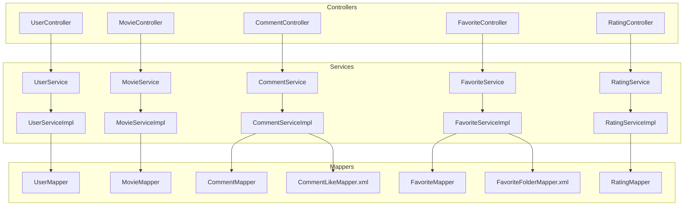
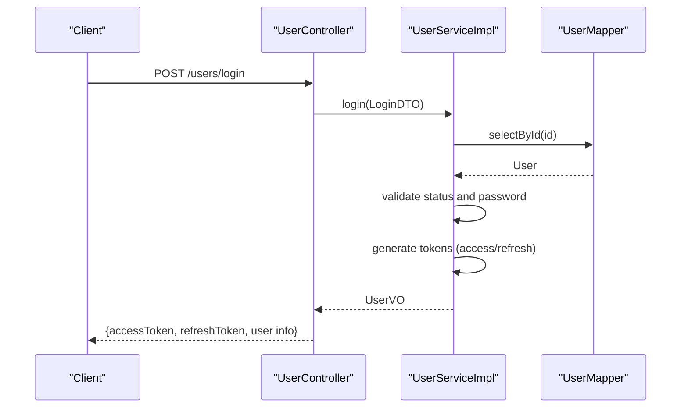
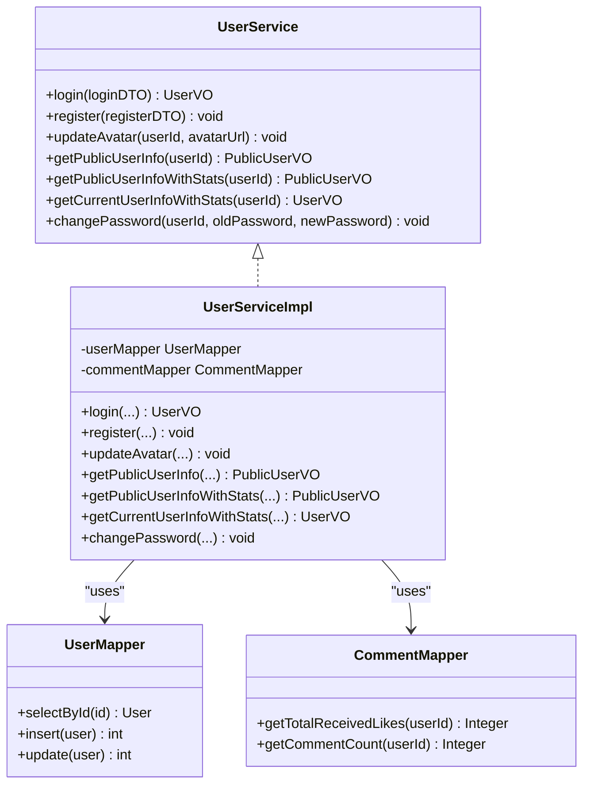
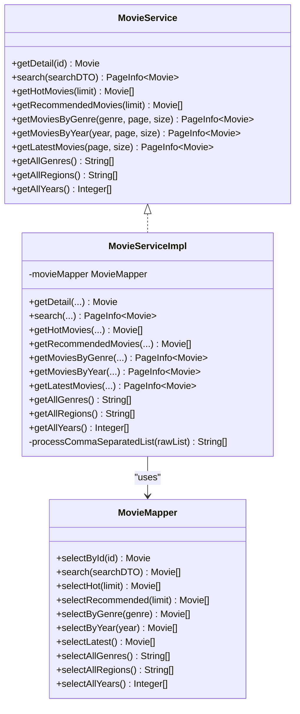
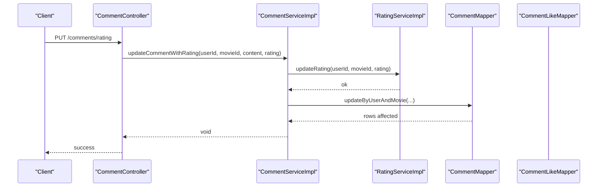
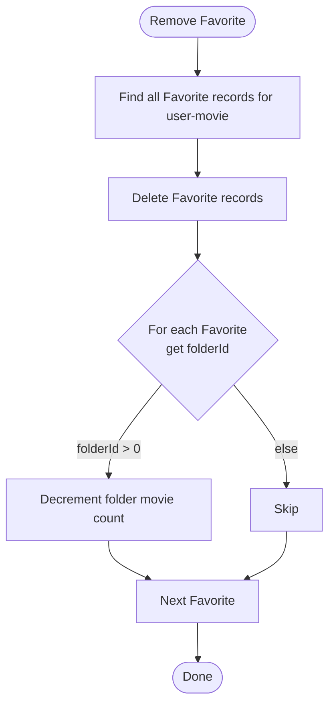
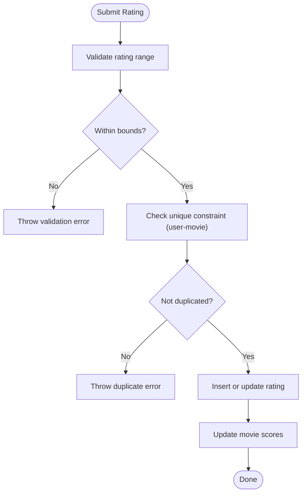
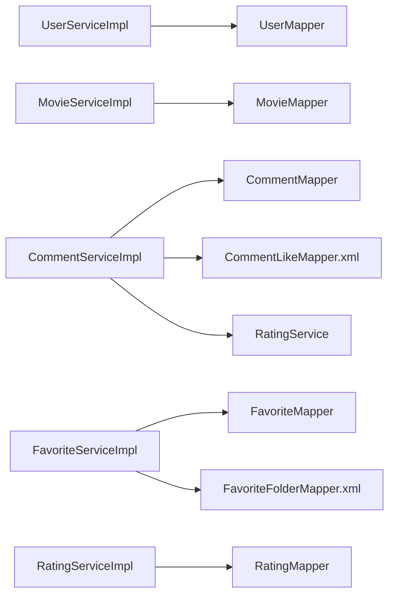

# Business Logic & Services

<cite>
**Referenced Files in This Document**
- [UserService.java](file://backend/src/main/java/com/movie/backend/service/UserService.java)
- [UserServiceImpl.java](file://backend/src/main/java/com/movie/backend/service/impl/UserServiceImpl.java)
- [UserMapper.java](file://backend/src/main/java/com/movie/backend/mapper/UserMapper.java)
- [MovieService.java](file://backend/src/main/java/com/movie/backend/service/MovieService.java)
- [MovieServiceImpl.java](file://backend/src/main/java/com/movie/backend/service/impl/MovieServiceImpl.java)
- [MovieMapper.java](file://backend/src/main/java/com/movie/backend/mapper/MovieMapper.java)
- [CommentService.java](file://backend/src/main/java/com/movie/backend/service/CommentService.java)
- [CommentServiceImpl.java](file://backend/src/main/java/com/movie/backend/service/impl/CommentServiceImpl.java)
- [CommentMapper.java](file://backend/src/main/java/com/movie/backend/mapper/CommentMapper.java)
- [CommentLikeMapper.java](file://backend/src/main/resources/mapper/CommentLikeMapper.xml)
- [FavoriteService.java](file://backend/src/main/java/com/movie/backend/service/FavoriteService.java)
- [FavoriteServiceImpl.java](file://backend/src/main/java/com/movie/backend/service/impl/FavoriteServiceImpl.java)
- [FavoriteMapper.java](file://backend/src/main/java/com/movie/backend/mapper/FavoriteMapper.java)
- [FavoriteFolderMapper.java](file://backend/src/main/java/com/movie/backend/mapper/FavoriteFolderMapper.java)
- [FavoriteFolderMapper.xml](file://backend/src/main/resources/mapper/FavoriteFolderMapper.xml)
- [RatingService.java](file://backend/src/main/java/com/movie/backend/service/RatingService.java)
- [RatingServiceImpl.java](file://backend/src/main/java/com/movie/backend/service/impl/RatingServiceImpl.java)
- [RatingMapper.java](file://backend/src/main/java/com/movie/backend/mapper/RatingMapper.java)
</cite>

## Table of Contents
1. [Introduction](#introduction)
2. [Project Structure](#project-structure)
3. [Core Components](#core-components)
4. [Architecture Overview](#architecture-overview)
5. [Detailed Component Analysis](#detailed-component-analysis)
6. [Dependency Analysis](#dependency-analysis)
7. [Performance Considerations](#performance-considerations)
8. [Troubleshooting Guide](#troubleshooting-guide)
9. [Conclusion](#conclusion)
10. [Appendices](#appendices)

## Introduction
This document explains the business logic layer and service implementations of the movie system backend. It focuses on the service layer architecture, business rule enforcement, and transaction management. Covered services include User Service, Movie Service, Comment Service, Favorite Service, and Rating Service. For each service, we describe interfaces, implementations, method responsibilities, business logic flows, error handling, and integration with the data access layer. We also provide practical usage patterns, validation rules, composition strategies, dependency injection via Spring, and testing approaches for business logic components.

## Project Structure
The business logic resides primarily under the service package with clear separation of concerns:
- Interfaces define contracts for each domain capability.
- Implementations encapsulate business rules and orchestrate data access.
- Data access layer consists of Mapper interfaces annotated for MyBatis.
- Controllers depend on services to expose REST endpoints.

**Diagram sources**
- [UserService.java](file://backend/src/main/java/com/movie/backend/service/UserService.java#L8-L28)
- [UserServiceImpl.java](file://backend/src/main/java/com/movie/backend/service/impl/UserServiceImpl.java#L19-L176)
- [MovieService.java](file://backend/src/main/java/com/movie/backend/service/MovieService.java#L9-L59)
- [MovieServiceImpl.java](file://backend/src/main/java/com/movie/backend/service/impl/MovieServiceImpl.java#L18-L116)
- [CommentService.java](file://backend/src/main/java/com/movie/backend/service/CommentService.java#L7-L53)
- [CommentServiceImpl.java](file://backend/src/main/java/com/movie/backend/service/impl/CommentServiceImpl.java#L18-L125)
- [FavoriteService.java](file://backend/src/main/java/com/movie/backend/service/FavoriteService.java#L7-L35)
- [FavoriteServiceImpl.java](file://backend/src/main/java/com/movie/backend/service/impl/FavoriteServiceImpl.java#L19-L155)
- [RatingService.java](file://backend/src/main/java/com/movie/backend/service/RatingService.java#L8-L43)
- [RatingServiceImpl.java](file://backend/src/main/java/com/movie/backend/service/impl/RatingServiceImpl.java#L16-L95)
- [UserMapper.java](file://backend/src/main/java/com/movie/backend/mapper/UserMapper.java#L10-L40)
- [MovieMapper.java](file://backend/src/main/java/com/movie/backend/mapper/MovieMapper.java#L10-L91)
- [CommentMapper.java](file://backend/src/main/java/com/movie/backend/mapper/CommentMapper.java#L10-L67)
- [CommentLikeMapper.xml](file://backend/src/main/resources/mapper/CommentLikeMapper.xml)
- [FavoriteMapper.java](file://backend/src/main/java/com/movie/backend/mapper/FavoriteMapper.java#L10-L49)
- [FavoriteFolderMapper.xml](file://backend/src/main/resources/mapper/FavoriteFolderMapper.xml)
- [RatingMapper.java](file://backend/src/main/java/com/movie/backend/mapper/RatingMapper.java#L10-L52)

**Section sources**
- [UserService.java](file://backend/src/main/java/com/movie/backend/service/UserService.java#L1-L29)
- [MovieService.java](file://backend/src/main/java/com/movie/backend/service/MovieService.java#L1-L60)
- [CommentService.java](file://backend/src/main/java/com/movie/backend/service/CommentService.java#L1-L54)
- [FavoriteService.java](file://backend/src/main/java/com/movie/backend/service/FavoriteService.java#L1-L35)
- [RatingService.java](file://backend/src/main/java/com/movie/backend/service/RatingService.java#L1-L44)

## Core Components
This section outlines the five core services and their responsibilities.

- User Service
  - Handles authentication, registration, avatar updates, public/private profile retrieval, and password changes with token invalidation via password version increments.
- Movie Service
  - Provides movie detail retrieval, paginated search, hot/recommended lists, genre/year filtering, latest movies, and metadata discovery (genres, regions, years).
- Comment Service
  - Manages comment submission, retrieval, updates, likes/toggles, and user-specific comment listings. Integrates with RatingService for combined comment+rating updates.
- Favorite Service
  - Manages adding/removing favorites, folder-based organization, batch operations, counts, and folder movie counts with transactional consistency.
- Rating Service
  - Enforces rating range constraints, uniqueness per user-movie pair, and maintains movie scores via recalculations after changes.

**Section sources**
- [UserService.java](file://backend/src/main/java/com/movie/backend/service/UserService.java#L8-L28)
- [MovieService.java](file://backend/src/main/java/com/movie/backend/service/MovieService.java#L9-L59)
- [CommentService.java](file://backend/src/main/java/com/movie/backend/service/CommentService.java#L7-L53)
- [FavoriteService.java](file://backend/src/main/java/com/movie/backend/service/FavoriteService.java#L7-L35)
- [RatingService.java](file://backend/src/main/java/com/movie/backend/service/RatingService.java#L8-L43)

## Architecture Overview
The service layer follows a clean architecture pattern:
- Controllers depend on service interfaces for business capabilities.
- Services encapsulate business rules and coordinate data access via Mappers.
- Transaction boundaries are explicitly declared where needed (e.g., CommentService, FavoriteService).
- Validation occurs in services before invoking data access.

**Diagram sources**
- [UserController.java](file://backend/src/main/java/com/movie/backend/controller/UserController.java)
- [UserService.java](file://backend/src/main/java/com/movie/backend/service/UserService.java#L8-L28)
- [UserServiceImpl.java](file://backend/src/main/java/com/movie/backend/service/impl/UserServiceImpl.java#L28-L56)
- [UserMapper.java](file://backend/src/main/java/com/movie/backend/mapper/UserMapper.java#L14-L14)

## Detailed Component Analysis

### User Service
- Responsibilities
  - Authentication with status checks and password verification.
  - Registration with role/status defaults and password hashing.
  - Avatar updates and profile retrieval (public vs. current user with stats).
  - Password change with version increment to invalidate sessions.
- Business Rules
  - Disabled accounts cannot log in.
  - Passwords are hashed and verified using BCrypt.
  - Token generation includes passwordVersion to enforce re-authentication on password changes.
  - Stats aggregation includes received likes and comment counts.
- Error Handling
  - Throws runtime exceptions for missing users, disabled accounts, invalid credentials, and missing records during updates.
- Integration
  - Uses UserMapper for persistence and CommentMapper for stats.
- Practical Usage Patterns
  - Login flow validates credentials and returns tokens.
  - Registration sets default role/status and initial passwordVersion.
  - Change password increments version to force token invalidation.

**Diagram sources**
- [UserService.java](file://backend/src/main/java/com/movie/backend/service/UserService.java#L8-L28)
- [UserServiceImpl.java](file://backend/src/main/java/com/movie/backend/service/impl/UserServiceImpl.java#L19-L176)
- [UserMapper.java](file://backend/src/main/java/com/movie/backend/mapper/UserMapper.java#L10-L40)
- [CommentMapper.java](file://backend/src/main/java/com/movie/backend/mapper/CommentMapper.java#L59-L66)

**Section sources**
- [UserService.java](file://backend/src/main/java/com/movie/backend/service/UserService.java#L8-L28)
- [UserServiceImpl.java](file://backend/src/main/java/com/movie/backend/service/impl/UserServiceImpl.java#L28-L174)
- [UserMapper.java](file://backend/src/main/java/com/movie/backend/mapper/UserMapper.java#L14-L39)
- [CommentMapper.java](file://backend/src/main/java/com/movie/backend/mapper/CommentMapper.java#L59-L66)

### Movie Service
- Responsibilities
  - Retrieve movie details, paginated search, hot/recommended lists, genre/year filters, latest movies, and metadata discovery.
- Business Rules
  - Pagination handled via PageHelper; genres/regions normalized from comma/slash-separated strings.
- Error Handling
  - Throws runtime exception when a requested movie is not found.
- Integration
  - Uses MovieMapper for queries and aggregations.

**Diagram sources**
- [MovieService.java](file://backend/src/main/java/com/movie/backend/service/MovieService.java#L9-L59)
- [MovieServiceImpl.java](file://backend/src/main/java/com/movie/backend/service/impl/MovieServiceImpl.java#L18-L116)
- [MovieMapper.java](file://backend/src/main/java/com/movie/backend/mapper/MovieMapper.java#L10-L91)

**Section sources**
- [MovieService.java](file://backend/src/main/java/com/movie/backend/service/MovieService.java#L9-L59)
- [MovieServiceImpl.java](file://backend/src/main/java/com/movie/backend/service/impl/MovieServiceImpl.java#L24-L114)
- [MovieMapper.java](file://backend/src/main/java/com/movie/backend/mapper/MovieMapper.java#L14-L91)

### Comment Service
- Responsibilities
  - Paginated comment retrieval by movie, combined comment+rating listing, single-user comment retrieval, and updates.
  - Like/unlike toggling with vote adjustments and like-state checks.
  - User comment history pagination.
- Business Rules
  - One comment per user per movie enforced on submission.
  - Combined update uses RatingService to maintain consistency.
  - Transactional toggling ensures atomic like/unlike and vote updates.
- Error Handling
  - Throws runtime exceptions for duplicate submissions and failed updates.
- Integration
  - Uses CommentMapper, CommentLikeMapper, and RatingService.

**Diagram sources**
- [CommentService.java](file://backend/src/main/java/com/movie/backend/service/CommentService.java#L7-L53)
- [CommentServiceImpl.java](file://backend/src/main/java/com/movie/backend/service/impl/CommentServiceImpl.java#L70-L81)
- [RatingService.java](file://backend/src/main/java/com/movie/backend/service/RatingService.java#L8-L43)
- [RatingServiceImpl.java](file://backend/src/main/java/com/movie/backend/service/impl/RatingServiceImpl.java#L45-L58)
- [CommentMapper.java](file://backend/src/main/java/com/movie/backend/mapper/CommentMapper.java#L33-L34)
- [CommentLikeMapper.xml](file://backend/src/main/resources/mapper/CommentLikeMapper.xml)

**Section sources**
- [CommentService.java](file://backend/src/main/java/com/movie/backend/service/CommentService.java#L7-L53)
- [CommentServiceImpl.java](file://backend/src/main/java/com/movie/backend/service/impl/CommentServiceImpl.java#L46-L115)
- [CommentMapper.java](file://backend/src/main/java/com/movie/backend/mapper/CommentMapper.java#L18-L66)
- [CommentLikeMapper.xml](file://backend/src/main/resources/mapper/CommentLikeMapper.xml)

### Favorite Service
- Responsibilities
  - Add/remove favorites globally or within folders, check favorited status, paginate user favorites, and list favorites with metadata.
  - Batch deletion and clearing of favorites with folder count updates.
  - Count total favorites per user.
- Business Rules
  - Default folder ID 0 represents global favorites; non-zero indicates a folder.
  - Removing favorites decrements folder movie counts for each affected folder.
  - Batch operations compute folder deltas and apply count adjustments.
- Error Handling
  - Validates non-empty batch lists for batch operations.
- Integration
  - Uses FavoriteMapper and FavoriteFolderMapper.

**Diagram sources**
- [FavoriteServiceImpl.java](file://backend/src/main/java/com/movie/backend/service/impl/FavoriteServiceImpl.java#L55-L83)
- [FavoriteMapper.java](file://backend/src/main/java/com/movie/backend/mapper/FavoriteMapper.java#L15-L31)
- [FavoriteFolderMapper.xml](file://backend/src/main/resources/mapper/FavoriteFolderMapper.xml)

**Section sources**
- [FavoriteService.java](file://backend/src/main/java/com/movie/backend/service/FavoriteService.java#L7-L35)
- [FavoriteServiceImpl.java](file://backend/src/main/java/com/movie/backend/service/impl/FavoriteServiceImpl.java#L27-L153)
- [FavoriteMapper.java](file://backend/src/main/java/com/movie/backend/mapper/FavoriteMapper.java#L12-L49)
- [FavoriteFolderMapper.xml](file://backend/src/main/resources/mapper/FavoriteFolderMapper.xml)

### Rating Service
- Responsibilities
  - Submit/update user ratings with validation, retrieve user ratings and VO lists, clear ratings, and batch deletions.
  - Recompute movie scores after rating changes.
- Business Rules
  - Ratings must be within a fixed numeric range and unique per user-movie pair.
  - Movie score recomputation triggered after insert/update/clear/batch-delete.
- Error Handling
  - Throws runtime exceptions for out-of-range ratings, duplicates, and failed updates.
- Integration
  - Uses RatingMapper.

**Diagram sources**
- [RatingServiceImpl.java](file://backend/src/main/java/com/movie/backend/service/impl/RatingServiceImpl.java#L22-L43)
- [RatingMapper.java](file://backend/src/main/java/com/movie/backend/mapper/RatingMapper.java#L13-L51)

**Section sources**
- [RatingService.java](file://backend/src/main/java/com/movie/backend/service/RatingService.java#L8-L43)
- [RatingServiceImpl.java](file://backend/src/main/java/com/movie/backend/service/impl/RatingServiceImpl.java#L22-L93)
- [RatingMapper.java](file://backend/src/main/java/com/movie/backend/mapper/RatingMapper.java#L12-L52)

## Dependency Analysis
- Service-to-Mapper Coupling
  - Each service depends on one or more Mappers for persistence and queries.
  - CommentService additionally depends on RatingService for combined operations.
- Transaction Boundaries
  - CommentServiceImpl uses explicit transactional boundaries for like toggling and combined comment+rating updates.
  - FavoriteServiceImpl uses transactions for add/remove/folder operations and batch deletions.
- External Dependencies
  - PageHelper for pagination across Movie, Comment, Favorite, and Rating services.
  - JWT utilities and password utilities for security-related operations in UserService.

**Diagram sources**
- [UserServiceImpl.java](file://backend/src/main/java/com/movie/backend/service/impl/UserServiceImpl.java#L22-L26)
- [MovieServiceImpl.java](file://backend/src/main/java/com/movie/backend/service/impl/MovieServiceImpl.java#L21-L22)
- [CommentServiceImpl.java](file://backend/src/main/java/com/movie/backend/service/impl/CommentServiceImpl.java#L21-L28)
- [FavoriteServiceImpl.java](file://backend/src/main/java/com/movie/backend/service/impl/FavoriteServiceImpl.java#L21-L25)
- [RatingServiceImpl.java](file://backend/src/main/java/com/movie/backend/service/impl/RatingServiceImpl.java#L19-L20)

**Section sources**
- [UserServiceImpl.java](file://backend/src/main/java/com/movie/backend/service/impl/UserServiceImpl.java#L22-L26)
- [MovieServiceImpl.java](file://backend/src/main/java/com/movie/backend/service/impl/MovieServiceImpl.java#L21-L22)
- [CommentServiceImpl.java](file://backend/src/main/java/com/movie/backend/service/impl/CommentServiceImpl.java#L21-L28)
- [FavoriteServiceImpl.java](file://backend/src/main/java/com/movie/backend/service/impl/FavoriteServiceImpl.java#L21-L25)
- [RatingServiceImpl.java](file://backend/src/main/java/com/movie/backend/service/impl/RatingServiceImpl.java#L19-L20)

## Performance Considerations
- Pagination
  - PageHelper is used consistently across services to avoid loading large datasets. Ensure page and size parameters are validated to prevent excessive memory usage.
- Indexing
  - Queries rely on user-id, movie-id, and composite keys. Ensure database indexes exist on frequently queried columns (e.g., user_id, movie_id, folder_id).
- Aggregation
  - Stats retrieval (likes, comment counts) uses dedicated mapper methods; cache or precompute where appropriate to reduce repeated scans.
- Transaction Scope
  - Keep transactional methods small and focused to minimize lock contention. Batch operations should be optimized to reduce repeated updates.

## Troubleshooting Guide
- Authentication Failures
  - Verify account status and password hash matching. Confirm passwordVersion increments after password changes to invalidate stale tokens.
- Duplicate Operations
  - Comment submission and rating submission enforce uniqueness; ensure clients handle duplicate errors gracefully.
- Transaction Rollback
  - For like toggles and favorite operations, confirm that rollback scenarios are covered by transactional boundaries.
- Pagination Issues
  - Validate page and size parameters; ensure PageHelper is invoked before queries.

**Section sources**
- [UserServiceImpl.java](file://backend/src/main/java/com/movie/backend/service/impl/UserServiceImpl.java#L35-L43)
- [CommentServiceImpl.java](file://backend/src/main/java/com/movie/backend/service/impl/CommentServiceImpl.java#L48-L51)
- [RatingServiceImpl.java](file://backend/src/main/java/com/movie/backend/service/impl/RatingServiceImpl.java#L29-L32)
- [FavoriteServiceImpl.java](file://backend/src/main/java/com/movie/backend/service/impl/FavoriteServiceImpl.java#L115-L118)

## Conclusion
The service layer cleanly separates business logic from data access, with explicit validation, transaction management, and pagination. Each service enforces domain-specific rules while composing with others (e.g., CommentService with RatingService) to maintain consistency. Dependency injection via Spring enables modular testing and maintainable code.

## Appendices

### Testing Strategies for Business Logic Components
- Unit Tests
  - Mock Mappers and external utilities (JWT, PasswordUtil) to isolate service logic.
  - Test boundary conditions (rating range, uniqueness constraints, pagination limits).
- Integration Tests
  - Use test containers or embedded databases to validate end-to-end flows (e.g., submit rating, verify movie score recalculation).
- Transactional Scenarios
  - Write tests covering like toggling, batch favorite deletions, and combined comment+rating updates to ensure ACID guarantees.
- Controller-Level Tests
  - Validate that controllers delegate to services and propagate business exceptions appropriately.

[No sources needed since this section provides general guidance]