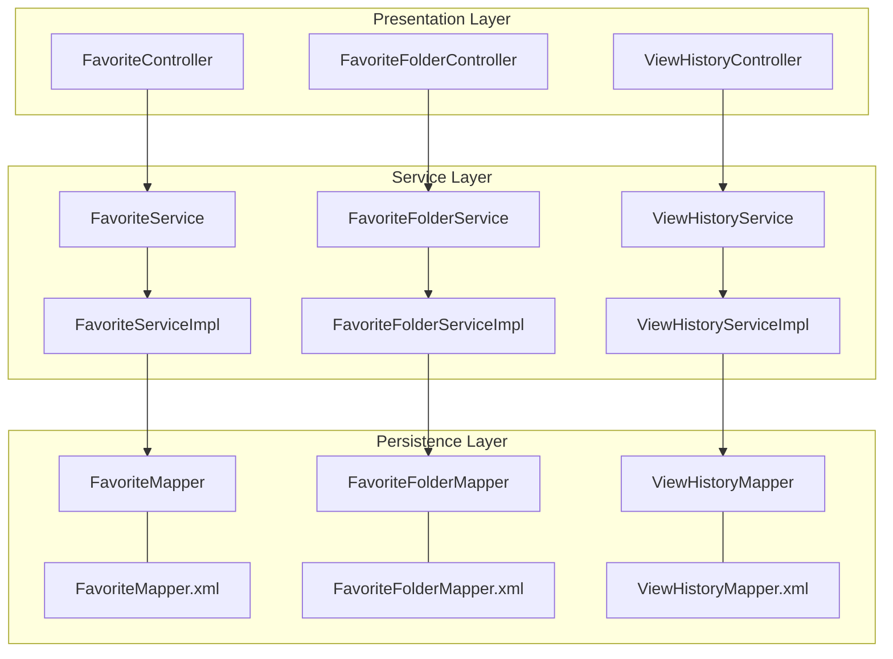
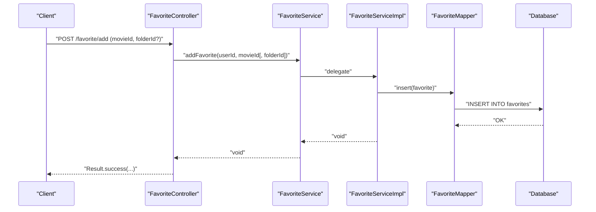
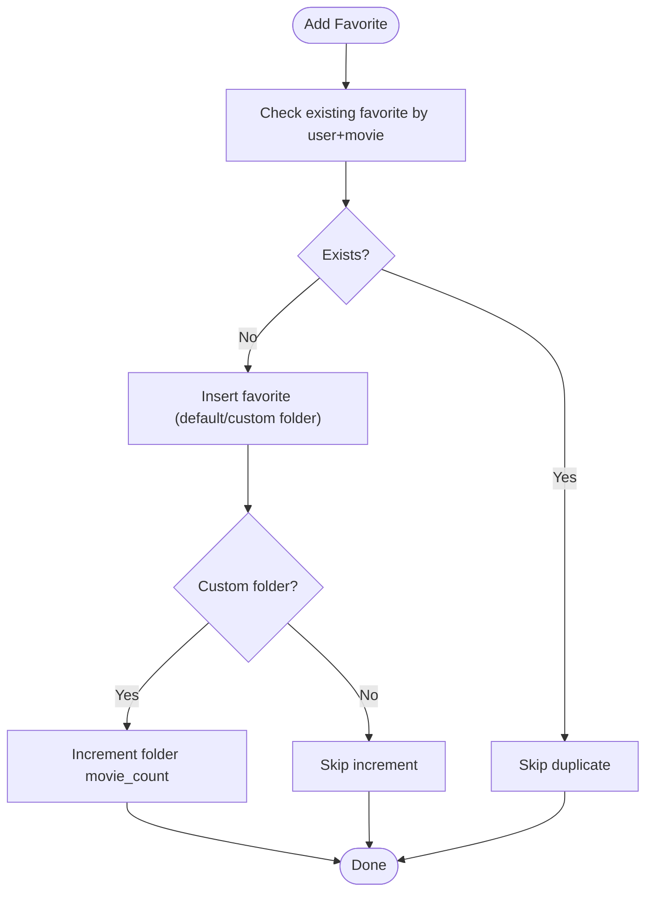
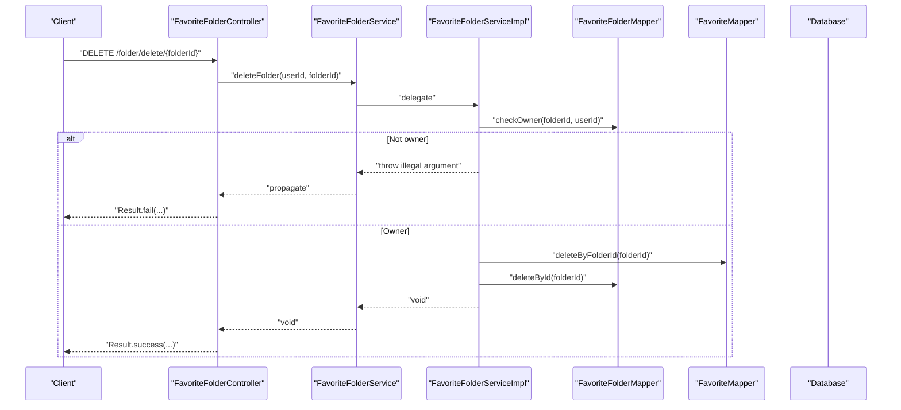
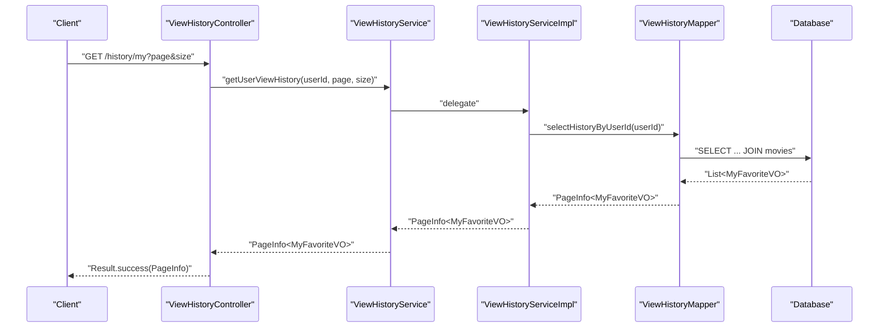
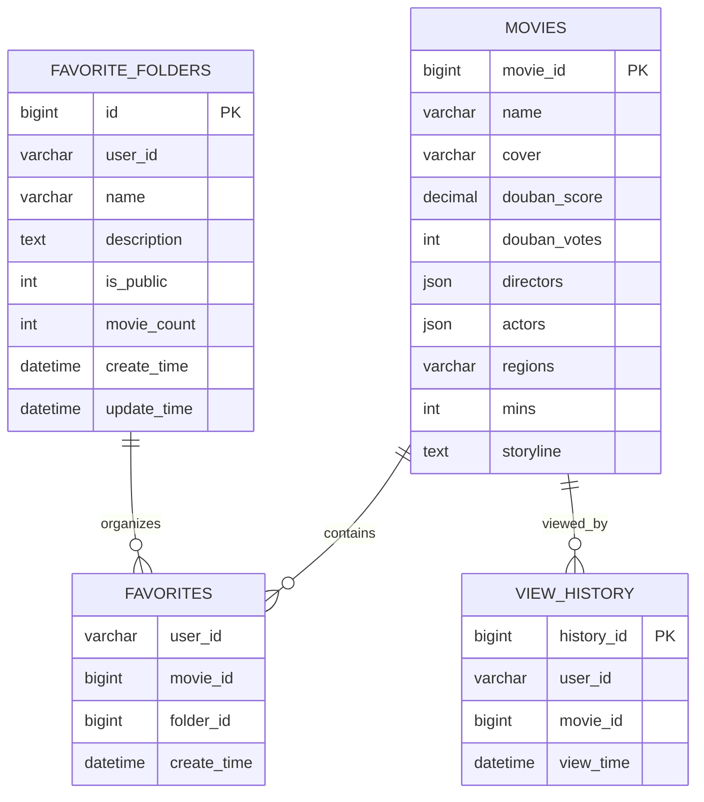
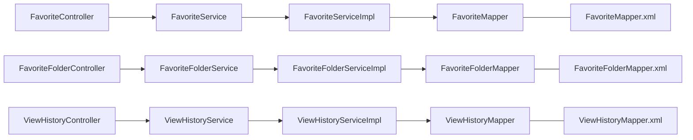

# Favorites & History Services

<cite>
**Referenced Files in This Document**
- [FavoriteController.java](file://backend/src/main/java/com/movie/backend/controller/FavoriteController.java)
- [FavoriteFolderController.java](file://backend/src/main/java/com/movie/backend/controller/FavoriteFolderController.java)
- [ViewHistoryController.java](file://backend/src/main/java/com/movie/backend/controller/ViewHistoryController.java)
- [FavoriteService.java](file://backend/src/main/java/com/movie/backend/service/FavoriteService.java)
- [FavoriteFolderService.java](file://backend/src/main/java/com/movie/backend/service/FavoriteFolderService.java)
- [ViewHistoryService.java](file://backend/src/main/java/com/movie/backend/service/ViewHistoryService.java)
- [FavoriteServiceImpl.java](file://backend/src/main/java/com/movie/backend/service/impl/FavoriteServiceImpl.java)
- [FavoriteFolderServiceImpl.java](file://backend/src/main/java/com/movie/backend/service/impl/FavoriteFolderServiceImpl.java)
- [ViewHistoryServiceImpl.java](file://backend/src/main/java/com/movie/backend/service/impl/ViewHistoryServiceImpl.java)
- [Favorite.java](file://backend/src/main/java/com/movie/backend/entity/Favorite.java)
- [FavoriteFolder.java](file://backend/src/main/java/com/movie/backend/entity/FavoriteFolder.java)
- [ViewHistory.java](file://backend/src/main/java/com/movie/backend/entity/ViewHistory.java)
- [FavoriteMapper.java](file://backend/src/main/java/com/movie/backend/mapper/FavoriteMapper.java)
- [FavoriteFolderMapper.java](file://backend/src/main/java/com/movie/backend/mapper/FavoriteFolderMapper.java)
- [ViewHistoryMapper.java](file://backend/src/main/java/com/movie/backend/mapper/ViewHistoryMapper.java)
- [FavoriteMapper.xml](file://backend/src/main/resources/mapper/FavoriteMapper.xml)
- [FavoriteFolderMapper.xml](file://backend/src/main/resources/mapper/FavoriteFolderMapper.xml)
- [ViewHistoryMapper.xml](file://backend/src/main/resources/mapper/ViewHistoryMapper.xml)
</cite>

## Table of Contents
1. [Introduction](#introduction)
2. [Project Structure](#project-structure)
3. [Core Components](#core-components)
4. [Architecture Overview](#architecture-overview)
5. [Detailed Component Analysis](#detailed-component-analysis)
6. [Dependency Analysis](#dependency-analysis)
7. [Performance Considerations](#performance-considerations)
8. [Troubleshooting Guide](#troubleshooting-guide)
9. [Conclusion](#conclusion)
10. [Appendices](#appendices)

## Introduction
This document explains the Favorites and History Services in the movie system. It covers how users bookmark movies, organize favorites into custom folders, maintain collections, track view history with watch time recording, persist and clean up history data, and integrate with the movie catalog and user preferences. It also documents business rules for organization, duplicate prevention, storage limits, and personalization via viewing patterns. Guidance on performance optimization for large datasets is included.

## Project Structure
The Favorites and History subsystem follows a layered architecture:
- Controllers expose REST endpoints for client interaction
- Services define business operations for favorites and history
- Implementations handle transactions, pagination, and data updates
- Mappers map domain entities to/from the database
- Entities represent persisted models

**Diagram sources**
- [FavoriteController.java](file://backend/src/main/java/com/movie/backend/controller/FavoriteController.java#L20-L109)
- [FavoriteFolderController.java](file://backend/src/main/java/com/movie/backend/controller/FavoriteFolderController.java#L21-L84)
- [ViewHistoryController.java](file://backend/src/main/java/com/movie/backend/controller/ViewHistoryController.java#L19-L70)
- [FavoriteService.java](file://backend/src/main/java/com/movie/backend/service/FavoriteService.java#L7-L35)
- [FavoriteFolderService.java](file://backend/src/main/java/com/movie/backend/service/FavoriteFolderService.java#L9-L46)
- [ViewHistoryService.java](file://backend/src/main/java/com/movie/backend/service/ViewHistoryService.java#L8-L39)
- [FavoriteServiceImpl.java](file://backend/src/main/java/com/movie/backend/service/impl/FavoriteServiceImpl.java#L19-L155)
- [FavoriteFolderServiceImpl.java](file://backend/src/main/java/com/movie/backend/service/impl/FavoriteFolderServiceImpl.java#L16-L95)
- [ViewHistoryServiceImpl.java](file://backend/src/main/java/com/movie/backend/service/impl/ViewHistoryServiceImpl.java#L16-L73)
- [FavoriteMapper.java](file://backend/src/main/java/com/movie/backend/mapper/FavoriteMapper.java#L10-L50)
- [FavoriteFolderMapper.java](file://backend/src/main/java/com/movie/backend/mapper/FavoriteFolderMapper.java#L10-L43)
- [ViewHistoryMapper.java](file://backend/src/main/java/com/movie/backend/mapper/ViewHistoryMapper.java#L9-L51)
- [FavoriteMapper.xml](file://backend/src/main/resources/mapper/FavoriteMapper.xml#L1-L128)
- [FavoriteFolderMapper.xml](file://backend/src/main/resources/mapper/FavoriteFolderMapper.xml#L1-L92)
- [ViewHistoryMapper.xml](file://backend/src/main/resources/mapper/ViewHistoryMapper.xml#L1-L81)

**Section sources**
- [FavoriteController.java](file://backend/src/main/java/com/movie/backend/controller/FavoriteController.java#L20-L109)
- [FavoriteFolderController.java](file://backend/src/main/java/com/movie/backend/controller/FavoriteFolderController.java#L21-L84)
- [ViewHistoryController.java](file://backend/src/main/java/com/movie/backend/controller/ViewHistoryController.java#L19-L70)

## Core Components
- Favorites Management
  - Bookmarking movies to default or custom folders
  - Duplicate prevention via existence checks
  - Folder-aware counts and batch operations
- Favorite Folder Functionality
  - Creation, updates, deletion with ownership checks
  - Public/private visibility and movie count maintenance
- View History Tracking
  - Watch time recording and updates
  - Pagination, batch deletion, and clearing
- Integration
  - Seamless joins with the movie catalog for rich metadata display
  - User preference alignment via viewing patterns

**Section sources**
- [FavoriteService.java](file://backend/src/main/java/com/movie/backend/service/FavoriteService.java#L7-L35)
- [FavoriteFolderService.java](file://backend/src/main/java/com/movie/backend/service/FavoriteFolderService.java#L9-L46)
- [ViewHistoryService.java](file://backend/src/main/java/com/movie/backend/service/ViewHistoryService.java#L8-L39)

## Architecture Overview
The system separates concerns across controllers, services, and persistence layers. Favorites and History share a common pattern: controllers extract user identity, delegate to services, and return paginated results via a unified response wrapper. Services encapsulate transactional logic and data retrieval, while mappers translate queries into SQL.

**Diagram sources**
- [FavoriteController.java](file://backend/src/main/java/com/movie/backend/controller/FavoriteController.java#L27-L40)
- [FavoriteService.java](file://backend/src/main/java/com/movie/backend/service/FavoriteService.java#L8-L10)
- [FavoriteServiceImpl.java](file://backend/src/main/java/com/movie/backend/service/impl/FavoriteServiceImpl.java#L27-L36)
- [FavoriteMapper.java](file://backend/src/main/java/com/movie/backend/mapper/FavoriteMapper.java#L12-L13)
- [FavoriteMapper.xml](file://backend/src/main/resources/mapper/FavoriteMapper.xml#L5-L8)

## Detailed Component Analysis

### Favorites Management
- Bookmarking
  - Default folder: stored with a sentinel folder identifier
  - Custom folder: associates a movie to a specific folder with immediate count increment
- Removal
  - Whole-user removal deletes all records
  - Per-folder removal decrements folder count
  - Batch removal computes per-folder deltas and updates counts efficiently
- Queries
  - Paginated lists by user and by folder
  - Existence checks prevent duplicates
- Business rules
  - Duplicate prevention: existence check before insert
  - Organization: default vs custom folder semantics
  - Storage limits: enforced by database constraints and application-side checks

**Diagram sources**
- [FavoriteServiceImpl.java](file://backend/src/main/java/com/movie/backend/service/impl/FavoriteServiceImpl.java#L27-L53)
- [FavoriteMapper.java](file://backend/src/main/java/com/movie/backend/mapper/FavoriteMapper.java#L27-L28)
- [FavoriteFolderMapper.java](file://backend/src/main/java/com/movie/backend/mapper/FavoriteFolderMapper.java#L34-L35)

**Section sources**
- [FavoriteServiceImpl.java](file://backend/src/main/java/com/movie/backend/service/impl/FavoriteServiceImpl.java#L27-L155)
- [FavoriteMapper.java](file://backend/src/main/java/com/movie/backend/mapper/FavoriteMapper.java#L12-L50)
- [FavoriteMapper.xml](file://backend/src/main/resources/mapper/FavoriteMapper.xml#L5-L128)
- [FavoriteFolderMapper.java](file://backend/src/main/java/com/movie/backend/mapper/FavoriteFolderMapper.java#L31-L42)
- [FavoriteFolderMapper.xml](file://backend/src/main/resources/mapper/FavoriteFolderMapper.xml#L75-L85)

### Favorite Folder Functionality
- Creation
  - Initializes with zero movie count and timestamps
  - Optional public flag defaults to private if unspecified
- Updates
  - Ownership verification prevents unauthorized edits
  - Partial updates supported via selective field setters
- Deletion
  - Deletes all associated favorites before removing the folder
  - Ensures referential integrity
- Visibility and counts
  - Public/private toggled via integer flag
  - Movie counts maintained via increments/decrements

**Diagram sources**
- [FavoriteFolderController.java](file://backend/src/main/java/com/movie/backend/controller/FavoriteFolderController.java#L47-L55)
- [FavoriteFolderService.java](file://backend/src/main/java/com/movie/backend/service/FavoriteFolderService.java#L21-L24)
- [FavoriteFolderServiceImpl.java](file://backend/src/main/java/com/movie/backend/service/impl/FavoriteFolderServiceImpl.java#L60-L73)
- [FavoriteFolderMapper.java](file://backend/src/main/java/com/movie/backend/mapper/FavoriteFolderMapper.java#L40-L41)
- [FavoriteFolderMapper.xml](file://backend/src/main/resources/mapper/FavoriteFolderMapper.xml#L87-L89)
- [FavoriteMapper.java](file://backend/src/main/java/com/movie/backend/mapper/FavoriteMapper.java#L24-L25)

**Section sources**
- [FavoriteFolderController.java](file://backend/src/main/java/com/movie/backend/controller/FavoriteFolderController.java#L27-L82)
- [FavoriteFolderService.java](file://backend/src/main/java/com/movie/backend/service/FavoriteFolderService.java#L9-L46)
- [FavoriteFolderServiceImpl.java](file://backend/src/main/java/com/movie/backend/service/impl/FavoriteFolderServiceImpl.java#L25-L95)
- [FavoriteFolderMapper.java](file://backend/src/main/java/com/movie/backend/mapper/FavoriteFolderMapper.java#L10-L43)
- [FavoriteFolderMapper.xml](file://backend/src/main/resources/mapper/FavoriteFolderMapper.xml#L26-L89)

### View History Tracking
- Recording
  - Inserts a new record if absent; otherwise updates the view time
- Retrieval
  - Paginated history ordered by most recent view time
- Cleanup
  - Single, batch, and full-clear operations supported
- Persistence
  - Uses a dedicated table with user and movie identifiers

**Diagram sources**
- [ViewHistoryController.java](file://backend/src/main/java/com/movie/backend/controller/ViewHistoryController.java#L25-L33)
- [ViewHistoryService.java](file://backend/src/main/java/com/movie/backend/service/ViewHistoryService.java#L15-L17)
- [ViewHistoryServiceImpl.java](file://backend/src/main/java/com/movie/backend/service/impl/ViewHistoryServiceImpl.java#L41-L47)
- [ViewHistoryMapper.java](file://backend/src/main/java/com/movie/backend/mapper/ViewHistoryMapper.java#L17-L19)
- [ViewHistoryMapper.xml](file://backend/src/main/resources/mapper/ViewHistoryMapper.xml#L10-L29)

**Section sources**
- [ViewHistoryController.java](file://backend/src/main/java/com/movie/backend/controller/ViewHistoryController.java#L25-L68)
- [ViewHistoryService.java](file://backend/src/main/java/com/movie/backend/service/ViewHistoryService.java#L8-L39)
- [ViewHistoryServiceImpl.java](file://backend/src/main/java/com/movie/backend/service/impl/ViewHistoryServiceImpl.java#L22-L72)
- [ViewHistoryMapper.java](file://backend/src/main/java/com/movie/backend/mapper/ViewHistoryMapper.java#L11-L50)
- [ViewHistoryMapper.xml](file://backend/src/main/resources/mapper/ViewHistoryMapper.xml#L5-L80)

### Data Models

**Diagram sources**
- [Favorite.java](file://backend/src/main/java/com/movie/backend/entity/Favorite.java#L9-L21)
- [FavoriteFolder.java](file://backend/src/main/java/com/movie/backend/entity/FavoriteFolder.java#L10-L36)
- [ViewHistory.java](file://backend/src/main/java/com/movie/backend/entity/ViewHistory.java#L9-L22)
- [FavoriteMapper.xml](file://backend/src/main/resources/mapper/FavoriteMapper.xml#L52-L94)
- [ViewHistoryMapper.xml](file://backend/src/main/resources/mapper/ViewHistoryMapper.xml#L10-L29)

## Dependency Analysis
- Controllers depend on services for business logic
- Services depend on mappers for persistence
- Mappers map to SQL via XML configurations
- Entities define persisted attributes and relationships

**Diagram sources**
- [FavoriteController.java](file://backend/src/main/java/com/movie/backend/controller/FavoriteController.java#L24-L25)
- [FavoriteFolderController.java](file://backend/src/main/java/com/movie/backend/controller/FavoriteFolderController.java#L25-L26)
- [ViewHistoryController.java](file://backend/src/main/java/com/movie/backend/controller/ViewHistoryController.java#L23-L24)
- [FavoriteServiceImpl.java](file://backend/src/main/java/com/movie/backend/service/impl/FavoriteServiceImpl.java#L21-L25)
- [FavoriteFolderServiceImpl.java](file://backend/src/main/java/com/movie/backend/service/impl/FavoriteFolderServiceImpl.java#L19-L23)
- [ViewHistoryServiceImpl.java](file://backend/src/main/java/com/movie/backend/service/impl/ViewHistoryServiceImpl.java#L19-L21)
- [FavoriteMapper.xml](file://backend/src/main/resources/mapper/FavoriteMapper.xml#L1-L128)
- [FavoriteFolderMapper.xml](file://backend/src/main/resources/mapper/FavoriteFolderMapper.xml#L1-L92)
- [ViewHistoryMapper.xml](file://backend/src/main/resources/mapper/ViewHistoryMapper.xml#L1-L81)

**Section sources**
- [FavoriteController.java](file://backend/src/main/java/com/movie/backend/controller/FavoriteController.java#L24-L25)
- [FavoriteFolderController.java](file://backend/src/main/java/com/movie/backend/controller/FavoriteFolderController.java#L25-L26)
- [ViewHistoryController.java](file://backend/src/main/java/com/movie/backend/controller/ViewHistoryController.java#L23-L24)

## Performance Considerations
- Pagination
  - Use page and size parameters to avoid loading entire collections
  - Favor server-side pagination via the provided page helpers
- Batch operations
  - Prefer batch APIs for bulk deletions to reduce round trips
- Indexing
  - Ensure database indexes on frequently queried columns:
    - favorites(user_id, movie_id)
    - favorites(folder_id)
    - view_history(user_id, movie_id)
- Count maintenance
  - Keep folder movie counts updated to avoid expensive COUNT queries
- Caching
  - Consider caching small, static folder lists per user
- Query efficiency
  - Leverage JOINs in mappers to fetch enriched metadata in a single pass

[No sources needed since this section provides general guidance]

## Troubleshooting Guide
- Unauthorized operations
  - Folder ownership checks must pass before updates or deletions
- Empty input validation
  - Batch operations reject empty ID lists
- Duplicate bookmarks
  - Existence checks prevent duplicate entries; verify logic before insert
- Cleanup policies
  - Clearing history removes all records; confirm with users before enabling

**Section sources**
- [FavoriteFolderServiceImpl.java](file://backend/src/main/java/com/movie/backend/service/impl/FavoriteFolderServiceImpl.java#L46-L49)
- [FavoriteServiceImpl.java](file://backend/src/main/java/com/movie/backend/service/impl/FavoriteServiceImpl.java#L114-L118)
- [ViewHistoryServiceImpl.java](file://backend/src/main/java/com/movie/backend/service/impl/ViewHistoryServiceImpl.java#L55-L59)

## Conclusion
The Favorites and History Services provide robust, scalable mechanisms for organizing and recalling user preferences. They enforce business rules, maintain accurate counts, and integrate seamlessly with the movie catalog. With proper indexing, pagination, and batch operations, the system remains performant as collections grow.

[No sources needed since this section summarizes without analyzing specific files]

## Appendices

### API Definitions
- Favorites
  - Add to default or custom folder
  - Remove from default or specific folder
  - Get favorites with pagination
  - Get folder contents with pagination
  - Batch remove and clear
  - Count favorites
- Favorite Folders
  - Create/update/delete with ownership checks
  - Get folder details and user folder list
  - Count folders
- View History
  - Record view events (updates existing records)
  - Get paginated history
  - Delete single/batch/history
  - Count history

**Section sources**
- [FavoriteController.java](file://backend/src/main/java/com/movie/backend/controller/FavoriteController.java#L27-L108)
- [FavoriteFolderController.java](file://backend/src/main/java/com/movie/backend/controller/FavoriteFolderController.java#L28-L82)
- [ViewHistoryController.java](file://backend/src/main/java/com/movie/backend/controller/ViewHistoryController.java#L25-L68)