# Movie Service

<cite>
**Referenced Files in This Document**
- [MovieController.java](file://backend/src/main/java/com/movie/backend/controller/MovieController.java)
- [MovieService.java](file://backend/src/main/java/com/movie/backend/service/MovieService.java)
- [MovieServiceImpl.java](file://backend/src/main/java/com/movie/backend/service/impl/MovieServiceImpl.java)
- [MovieMapper.java](file://backend/src/main/java/com/movie/backend/mapper/MovieMapper.java)
- [MovieMapper.xml](file://backend/src/main/resources/mapper/MovieMapper.xml)
- [Movie.java](file://backend/src/main/java/com/movie/backend/entity/Movie.java)
- [MovieSearchDTO.java](file://backend/src/main/java/com/movie/backend/dto/MovieSearchDTO.java)
- [PageRequest.java](file://backend/src/main/java/com/movie/backend/dto/PageRequest.java)
- [Result.java](file://backend/src/main/java/com/movie/backend/common/Result.java)
- [JsonTypeHandler.java](file://backend/src/main/java/com/movie/backend/config/JsonTypeHandler.java)
- [DataSourceConfig.java](file://backend/src/main/java/com/movie/backend/config/DataSourceConfig.java)
- [RedisConfig.java](file://backend/src/main/java/com/movie/backend/config/RedisConfig.java)
- [application-dev.yml](file://backend/src/main/resources/application-dev.yml)
- [MovieControllerTest.java](file://backend/src/test/java/com/movie/backend/controller/MovieControllerTest.java)
- [MovieControllerIntegrationTest.java](file://backend/src/test/java/com/movie/backend/controller/MovieControllerIntegrationTest.java)
</cite>

## Table of Contents
1. [Introduction](#introduction)
2. [Project Structure](#project-structure)
3. [Core Components](#core-components)
4. [Architecture Overview](#architecture-overview)
5. [Detailed Component Analysis](#detailed-component-analysis)
6. [Dependency Analysis](#dependency-analysis)
7. [Performance Considerations](#performance-considerations)
8. [Troubleshooting Guide](#troubleshooting-guide)
9. [Conclusion](#conclusion)
10. [Appendices](#appendices)

## Introduction
This document describes the Movie Service implementation, focusing on movie catalog operations, search and filtering, data management, pagination, and integration points. It explains how movies are retrieved, searched, filtered, and browsed, along with validation rules, DTO-to-entity transformations, and performance considerations. It also covers recommendation logic, metadata generation for filters, and error handling.

## Project Structure
The Movie Service resides in the backend module under the Java package com.movie.backend. The primary layers are:
- Controller: exposes REST endpoints for movie operations
- Service: orchestrates business logic and pagination
- Mapper/MyBatis: maps SQL queries to Java objects
- Entity/DTO: models movie data and request parameters
- Configuration: data source, MyBatis, Redis, and response wrapper

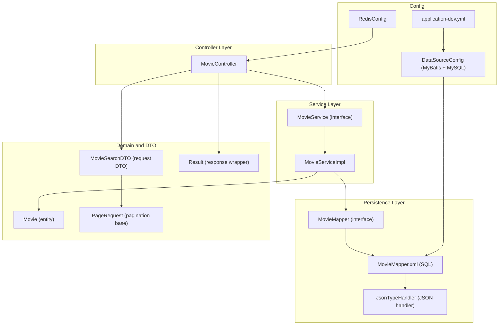

**Diagram sources**
- [MovieController.java](file://backend/src/main/java/com/movie/backend/controller/MovieController.java#L1-L209)
- [MovieService.java](file://backend/src/main/java/com/movie/backend/service/MovieService.java#L1-L60)
- [MovieServiceImpl.java](file://backend/src/main/java/com/movie/backend/service/impl/MovieServiceImpl.java#L1-L116)
- [MovieMapper.java](file://backend/src/main/java/com/movie/backend/mapper/MovieMapper.java#L1-L92)
- [MovieMapper.xml](file://backend/src/main/resources/mapper/MovieMapper.xml#L1-L193)
- [Movie.java](file://backend/src/main/java/com/movie/backend/entity/Movie.java#L1-L65)
- [MovieSearchDTO.java](file://backend/src/main/java/com/movie/backend/dto/MovieSearchDTO.java#L1-L60)
- [PageRequest.java](file://backend/src/main/java/com/movie/backend/dto/PageRequest.java#L1-L25)
- [Result.java](file://backend/src/main/java/com/movie/backend/common/Result.java#L1-L43)
- [JsonTypeHandler.java](file://backend/src/main/java/com/movie/backend/config/JsonTypeHandler.java#L1-L61)
- [DataSourceConfig.java](file://backend/src/main/java/com/movie/backend/config/DataSourceConfig.java#L1-L62)
- [RedisConfig.java](file://backend/src/main/java/com/movie/backend/config/RedisConfig.java#L1-L42)
- [application-dev.yml](file://backend/src/main/resources/application-dev.yml#L1-L67)

**Section sources**
- [MovieController.java](file://backend/src/main/java/com/movie/backend/controller/MovieController.java#L1-L209)
- [MovieService.java](file://backend/src/main/java/com/movie/backend/service/MovieService.java#L1-L60)
- [MovieServiceImpl.java](file://backend/src/main/java/com/movie/backend/service/impl/MovieServiceImpl.java#L1-L116)
- [MovieMapper.java](file://backend/src/main/java/com/movie/backend/mapper/MovieMapper.java#L1-L92)
- [MovieMapper.xml](file://backend/src/main/resources/mapper/MovieMapper.xml#L1-L193)
- [Movie.java](file://backend/src/main/java/com/movie/backend/entity/Movie.java#L1-L65)
- [MovieSearchDTO.java](file://backend/src/main/java/com/movie/backend/dto/MovieSearchDTO.java#L1-L60)
- [PageRequest.java](file://backend/src/main/java/com/movie/backend/dto/PageRequest.java#L1-L25)
- [Result.java](file://backend/src/main/java/com/movie/backend/common/Result.java#L1-L43)
- [JsonTypeHandler.java](file://backend/src/main/java/com/movie/backend/config/JsonTypeHandler.java#L1-L61)
- [DataSourceConfig.java](file://backend/src/main/java/com/movie/backend/config/DataSourceConfig.java#L1-L62)
- [RedisConfig.java](file://backend/src/main/java/com/movie/backend/config/RedisConfig.java#L1-L42)
- [application-dev.yml](file://backend/src/main/resources/application-dev.yml#L1-L67)

## Core Components
- MovieController: Exposes endpoints for movie detail, search, hot/recommended lists, genre/year filters, latest, and filter metadata. It validates inputs and wraps responses via Result.
- MovieService: Defines the contract for retrieving details, searching, filtering, and listing metadata.
- MovieServiceImpl: Implements pagination using PageHelper, delegates queries to MovieMapper, and normalizes comma-separated genre/region lists.
- MovieMapper + MovieMapper.xml: SQL queries for search, filters, hot/recommended/latest, and metadata discovery. Uses JsonTypeHandler for JSON fields.
- Movie entity: Represents movie data with JSON arrays for actors/directors/writers and typed fields for scores/votes.
- MovieSearchDTO: Request DTO with validation for keyword, genre, score range, year, region, sort field, and direction.
- PageRequest: Shared pagination parameters with min/max constraints.
- Result: Standardized response envelope with code/message/data.
- JsonTypeHandler: MyBatis type handler for JSON conversion.
- DataSourceConfig and RedisConfig: MyBatis session factory and Redis template configuration.
- application-dev.yml: Database, Redis, file, JWT, and logging configuration.

**Section sources**
- [MovieController.java](file://backend/src/main/java/com/movie/backend/controller/MovieController.java#L1-L209)
- [MovieService.java](file://backend/src/main/java/com/movie/backend/service/MovieService.java#L1-L60)
- [MovieServiceImpl.java](file://backend/src/main/java/com/movie/backend/service/impl/MovieServiceImpl.java#L1-L116)
- [MovieMapper.java](file://backend/src/main/java/com/movie/backend/mapper/MovieMapper.java#L1-L92)
- [MovieMapper.xml](file://backend/src/main/resources/mapper/MovieMapper.xml#L1-L193)
- [Movie.java](file://backend/src/main/java/com/movie/backend/entity/Movie.java#L1-L65)
- [MovieSearchDTO.java](file://backend/src/main/java/com/movie/backend/dto/MovieSearchDTO.java#L1-L60)
- [PageRequest.java](file://backend/src/main/java/com/movie/backend/dto/PageRequest.java#L1-L25)
- [Result.java](file://backend/src/main/java/com/movie/backend/common/Result.java#L1-L43)
- [JsonTypeHandler.java](file://backend/src/main/java/com/movie/backend/config/JsonTypeHandler.java#L1-L61)
- [DataSourceConfig.java](file://backend/src/main/java/com/movie/backend/config/DataSourceConfig.java#L1-L62)
- [RedisConfig.java](file://backend/src/main/java/com/movie/backend/config/RedisConfig.java#L1-L42)
- [application-dev.yml](file://backend/src/main/resources/application-dev.yml#L1-L67)

## Architecture Overview
The Movie Service follows a layered architecture:
- REST endpoints in MovieController delegate to MovieService
- MovieService uses MovieMapper (MyBatis) to execute SQL
- MovieMapper.xml defines SQL with dynamic conditions and ordering
- JSON fields are handled by JsonTypeHandler
- Pagination is managed by PageHelper in MovieServiceImpl
- Responses are wrapped by Result

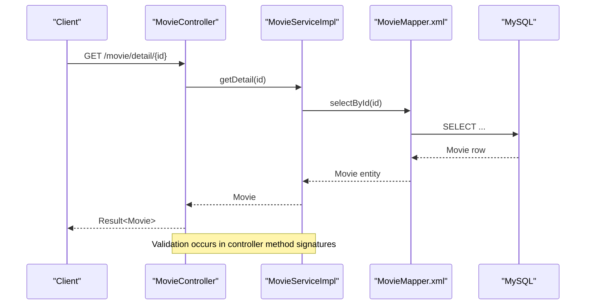

**Diagram sources**
- [MovieController.java](file://backend/src/main/java/com/movie/backend/controller/MovieController.java#L46-L66)
- [MovieServiceImpl.java](file://backend/src/main/java/com/movie/backend/service/impl/MovieServiceImpl.java#L24-L31)
- [MovieMapper.xml](file://backend/src/main/resources/mapper/MovieMapper.xml#L31-L33)

## Detailed Component Analysis

### Movie Catalog Operations
- Movie detail by ID: Validates path variable, retrieves movie, records view history for logged-in users, and returns Result<Movie>.
- Advanced search (paged): Accepts MovieSearchDTO, starts pagination, executes dynamic query, and returns PageInfo<Movie>.
- Popular and recommended: Returns top N movies sorted by votes and score respectively.
- Filter by genre/year: Applies pagination and sorts by score/year.
- Latest movies: Sorts by year desc, then score desc.
- Metadata endpoints: Provides genres, regions, years, and filter segments for UI rendering.

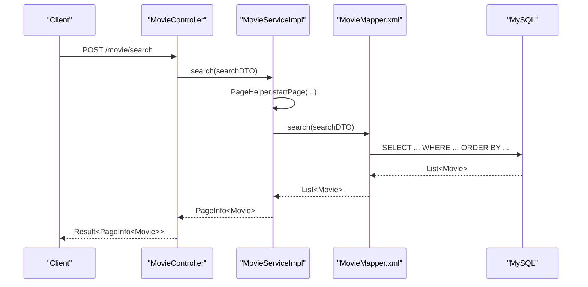

**Diagram sources**
- [MovieController.java](file://backend/src/main/java/com/movie/backend/controller/MovieController.java#L72-L75)
- [MovieServiceImpl.java](file://backend/src/main/java/com/movie/backend/service/impl/MovieServiceImpl.java#L34-L44)
- [MovieMapper.xml](file://backend/src/main/resources/mapper/MovieMapper.xml#L35-L80)

**Section sources**
- [MovieController.java](file://backend/src/main/java/com/movie/backend/controller/MovieController.java#L46-L171)
- [MovieServiceImpl.java](file://backend/src/main/java/com/movie/backend/service/impl/MovieServiceImpl.java#L24-L95)
- [MovieMapper.xml](file://backend/src/main/resources/mapper/MovieMapper.xml#L35-L80)

### Search Functionality and Filtering
- Dynamic WHERE clause supports keyword matching across name, alias, and storyline; genre, region, and year filters; and score range.
- Sorting supports score, year, votes with configurable order direction.
- Pagination is enforced via PageHelper with page/size from MovieSearchDTO.

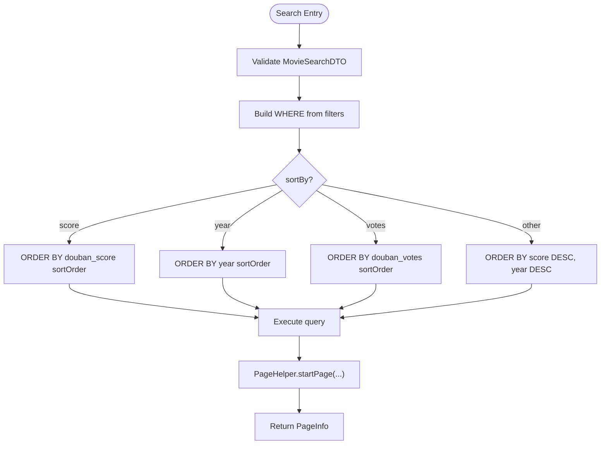

**Diagram sources**
- [MovieMapper.xml](file://backend/src/main/resources/mapper/MovieMapper.xml#L35-L80)
- [MovieServiceImpl.java](file://backend/src/main/java/com/movie/backend/service/impl/MovieServiceImpl.java#L34-L44)
- [MovieSearchDTO.java](file://backend/src/main/java/com/movie/backend/dto/MovieSearchDTO.java#L18-L59)

**Section sources**
- [MovieMapper.xml](file://backend/src/main/resources/mapper/MovieMapper.xml#L35-L80)
- [MovieSearchDTO.java](file://backend/src/main/java/com/movie/backend/dto/MovieSearchDTO.java#L18-L59)

### Movie Retrieval by ID
- Retrieves a single movie by ID, throws runtime error if not found.
- Records view history for authenticated users.

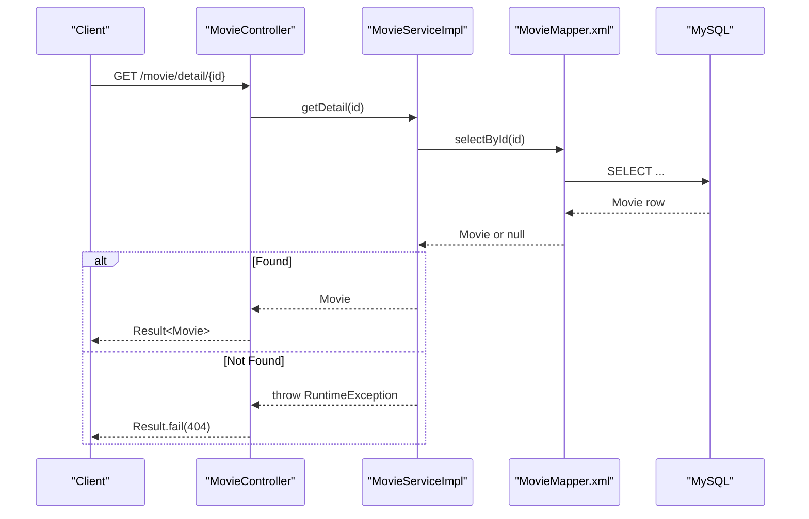

**Diagram sources**
- [MovieController.java](file://backend/src/main/java/com/movie/backend/controller/MovieController.java#L46-L66)
- [MovieServiceImpl.java](file://backend/src/main/java/com/movie/backend/service/impl/MovieServiceImpl.java#L24-L31)
- [MovieMapper.xml](file://backend/src/main/resources/mapper/MovieMapper.xml#L31-L33)

**Section sources**
- [MovieController.java](file://backend/src/main/java/com/movie/backend/controller/MovieController.java#L46-L66)
- [MovieServiceImpl.java](file://backend/src/main/java/com/movie/backend/service/impl/MovieServiceImpl.java#L24-L31)

### Advanced Filtering Capabilities
- Keyword: name, alias, storyline
- Genre: substring match on genres
- Score range: minScore and maxScore
- Year: exact year, or inclusive start/end year range
- Region: substring match on regions
- Sort: score, year, votes with asc/desc
- Pagination: page and size validated and applied

```mermaid
flowchart TD
A["Filters Provided?"] --> |keyword| KW["LIKE name/alias/storyline"]
A --> |genre| G["LIKE genres"]
A --> |minScore|maxScore| S["douban_score >= min AND <= max"]
A --> |year| Y1["year = exact"]
A --> |startYear/endYear| Y2["year BETWEEN start..end"]
A --> |region| R["LIKE regions"]
KW --> W["WHERE assembled"]
G --> W
S --> W
Y1 --> W
Y2 --> W
R --> W
W --> O["Choose ORDER BY by sortBy and sortOrder"]
O --> P["Apply PageHelper"]
P --> L["Return List<Movie>"]
```

**Diagram sources**
- [MovieMapper.xml](file://backend/src/main/resources/mapper/MovieMapper.xml#L35-L80)
- [MovieSearchDTO.java](file://backend/src/main/java/com/movie/backend/dto/MovieSearchDTO.java#L18-L59)

**Section sources**
- [MovieMapper.xml](file://backend/src/main/resources/mapper/MovieMapper.xml#L35-L80)
- [MovieSearchDTO.java](file://backend/src/main/java/com/movie/backend/dto/MovieSearchDTO.java#L18-L59)

### Data Management: CRUD and Transformations
- CRUD operations exposed via MovieMapper: insert, update, deleteById.
- Data transformation:
  - JSON fields (actors, directors, writers) stored as JSON and mapped via JsonTypeHandler.
  - Comma-separated lists (genres, regions) normalized to deduplicated, trimmed, sorted lists in service layer.
- Validation:
  - MovieSearchDTO enforces length/numeric/range/format constraints.
  - PageRequest enforces page/size bounds.

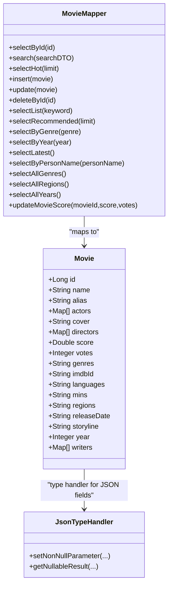

**Diagram sources**
- [Movie.java](file://backend/src/main/java/com/movie/backend/entity/Movie.java#L1-L65)
- [JsonTypeHandler.java](file://backend/src/main/java/com/movie/backend/config/JsonTypeHandler.java#L1-L61)
- [MovieMapper.java](file://backend/src/main/java/com/movie/backend/mapper/MovieMapper.java#L1-L92)

**Section sources**
- [MovieMapper.java](file://backend/src/main/java/com/movie/backend/mapper/MovieMapper.java#L29-L91)
- [MovieMapper.xml](file://backend/src/main/resources/mapper/MovieMapper.xml#L89-L123)
- [Movie.java](file://backend/src/main/java/com/movie/backend/entity/Movie.java#L1-L65)
- [JsonTypeHandler.java](file://backend/src/main/java/com/movie/backend/config/JsonTypeHandler.java#L1-L61)
- [MovieServiceImpl.java](file://backend/src/main/java/com/movie/backend/service/impl/MovieServiceImpl.java#L97-L114)

### Pagination Handling
- PageHelper.startPage(page, size) is invoked before each paginated query.
- PageRequest provides default page=1, size=10 with min/max bounds.
- Controller enforces additional constraints for each endpoint (e.g., min 1 for page, max 100 for size).

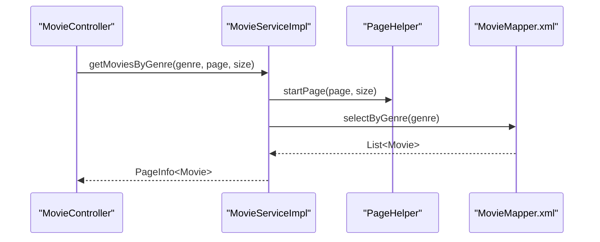

**Diagram sources**
- [MovieController.java](file://backend/src/main/java/com/movie/backend/controller/MovieController.java#L107-L119)
- [MovieServiceImpl.java](file://backend/src/main/java/com/movie/backend/service/impl/MovieServiceImpl.java#L56-L62)
- [PageRequest.java](file://backend/src/main/java/com/movie/backend/dto/PageRequest.java#L14-L24)

**Section sources**
- [MovieController.java](file://backend/src/main/java/com/movie/backend/controller/MovieController.java#L107-L153)
- [MovieServiceImpl.java](file://backend/src/main/java/com/movie/backend/service/impl/MovieServiceImpl.java#L56-L78)
- [PageRequest.java](file://backend/src/main/java/com/movie/backend/dto/PageRequest.java#L14-L24)

### Recommendation Logic and Popular Calculations
- Popular (hot): Sorted by douban_votes descending, limited by N.
- Recommended: Sorted by douban_score and douban_votes descending, limited by N.
- Latest: Filtered by presence of year, ordered by year desc, then score desc.

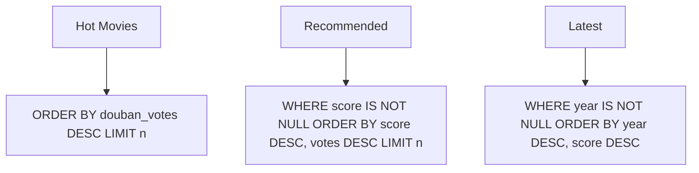

**Diagram sources**
- [MovieMapper.xml](file://backend/src/main/resources/mapper/MovieMapper.xml#L82-L87)
- [MovieMapper.xml](file://backend/src/main/resources/mapper/MovieMapper.xml#L138-L144)
- [MovieMapper.xml](file://backend/src/main/resources/mapper/MovieMapper.xml#L160-L165)

**Section sources**
- [MovieServiceImpl.java](file://backend/src/main/java/com/movie/backend/service/impl/MovieServiceImpl.java#L47-L54)
- [MovieMapper.xml](file://backend/src/main/resources/mapper/MovieMapper.xml#L82-L87)
- [MovieMapper.xml](file://backend/src/main/resources/mapper/MovieMapper.xml#L138-L144)
- [MovieMapper.xml](file://backend/src/main/resources/mapper/MovieMapper.xml#L160-L165)

### Integration with External Data Sources and Caching
- External data source integration:
  - MySQL is configured as primary data source for movie data.
  - A secondary Hive data source is configured for analytics queries.
- Caching:
  - Redis is configured for caching; however, current MovieServiceImpl does not use Redis. It relies on database queries and pagination.

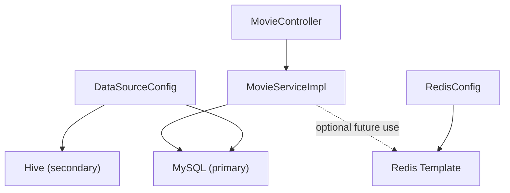

**Diagram sources**
- [DataSourceConfig.java](file://backend/src/main/java/com/movie/backend/config/DataSourceConfig.java#L18-L62)
- [RedisConfig.java](file://backend/src/main/java/com/movie/backend/config/RedisConfig.java#L14-L42)
- [MovieController.java](file://backend/src/main/java/com/movie/backend/controller/MovieController.java#L1-L209)
- [MovieServiceImpl.java](file://backend/src/main/java/com/movie/backend/service/impl/MovieServiceImpl.java#L1-L116)

**Section sources**
- [DataSourceConfig.java](file://backend/src/main/java/com/movie/backend/config/DataSourceConfig.java#L18-L62)
- [RedisConfig.java](file://backend/src/main/java/com/movie/backend/config/RedisConfig.java#L14-L42)
- [application-dev.yml](file://backend/src/main/resources/application-dev.yml#L11-L45)

### Error Handling and Validation Failures
- Parameter validation:
  - Path variables and request params enforce min/max values and formats.
  - MovieSearchDTO validates keyword length, score ranges, year format, and sort parameters.
- Error responses:
  - Controller returns Result.fail with appropriate HTTP status semantics.
  - getDetail throws runtime error if movie not found; controller converts to 404.

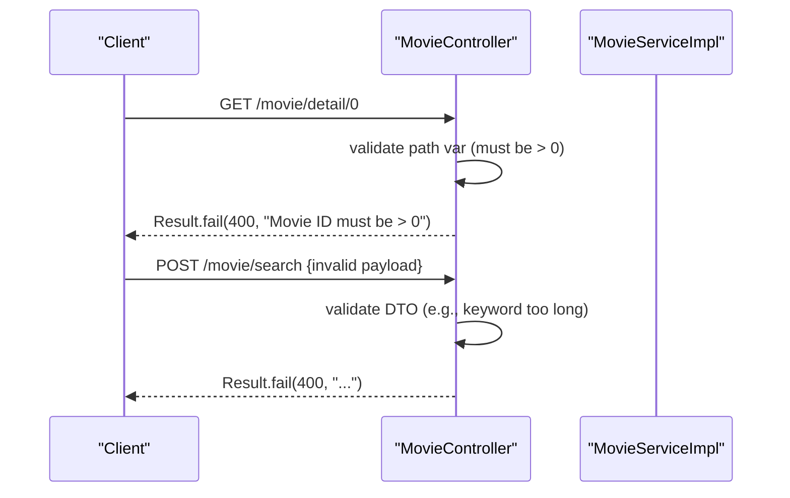

**Diagram sources**
- [MovieController.java](file://backend/src/main/java/com/movie/backend/controller/MovieController.java#L48-L50)
- [MovieController.java](file://backend/src/main/java/com/movie/backend/controller/MovieController.java#L72-L75)
- [MovieSearchDTO.java](file://backend/src/main/java/com/movie/backend/dto/MovieSearchDTO.java#L21-L22)
- [MovieSearchDTO.java](file://backend/src/main/java/com/movie/backend/dto/MovieSearchDTO.java#L29-L36)
- [MovieSearchDTO.java](file://backend/src/main/java/com/movie/backend/dto/MovieSearchDTO.java#L39-L40)
- [MovieSearchDTO.java](file://backend/src/main/java/com/movie/backend/dto/MovieSearchDTO.java#L53-L58)

**Section sources**
- [MovieController.java](file://backend/src/main/java/com/movie/backend/controller/MovieController.java#L48-L50)
- [MovieController.java](file://backend/src/main/java/com/movie/backend/controller/MovieController.java#L72-L75)
- [MovieSearchDTO.java](file://backend/src/main/java/com/movie/backend/dto/MovieSearchDTO.java#L21-L22)
- [MovieSearchDTO.java](file://backend/src/main/java/com/movie/backend/dto/MovieSearchDTO.java#L29-L36)
- [MovieSearchDTO.java](file://backend/src/main/java/com/movie/backend/dto/MovieSearchDTO.java#L39-L40)
- [MovieSearchDTO.java](file://backend/src/main/java/com/movie/backend/dto/MovieSearchDTO.java#L53-L58)

### Examples of Movie Browsing Workflows
- Browse hot movies:
  - GET /movie/hot?limit=10 → returns top 10 by votes
- Browse recommended movies:
  - GET /movie/recommended?limit=10 → returns top 10 by score and votes
- Search movies:
  - POST /movie/search with MovieSearchDTO → returns paginated results
- Filter by genre:
  - GET /movie/genre/{genre}?page=1&size=10 → paginated genre list
- Filter by year:
  - GET /movie/year/{year}?page=1&size=10 → paginated yearly list
- Latest movies:
  - GET /movie/latest?page=1&size=10 → newest first

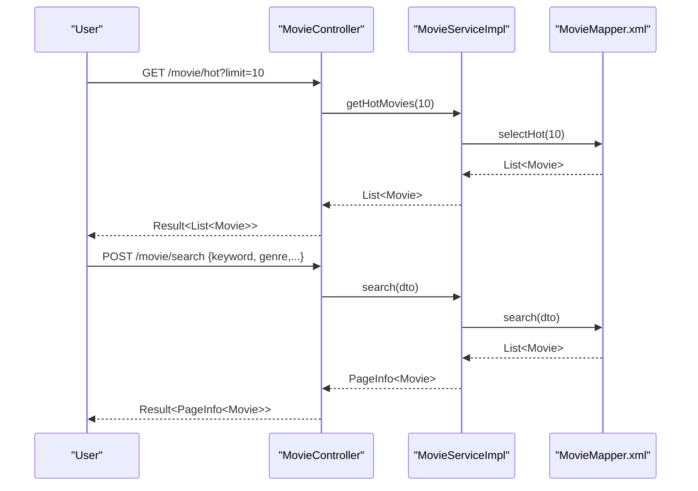

**Diagram sources**
- [MovieController.java](file://backend/src/main/java/com/movie/backend/controller/MovieController.java#L82-L88)
- [MovieController.java](file://backend/src/main/java/com/movie/backend/controller/MovieController.java#L72-L75)
- [MovieServiceImpl.java](file://backend/src/main/java/com/movie/backend/service/impl/MovieServiceImpl.java#L47-L54)
- [MovieMapper.xml](file://backend/src/main/resources/mapper/MovieMapper.xml#L82-L87)
- [MovieMapper.xml](file://backend/src/main/resources/mapper/MovieMapper.xml#L35-L80)

**Section sources**
- [MovieController.java](file://backend/src/main/java/com/movie/backend/controller/MovieController.java#L82-L153)
- [MovieServiceImpl.java](file://backend/src/main/java/com/movie/backend/service/impl/MovieServiceImpl.java#L47-L78)

## Dependency Analysis
- Controller depends on MovieService and wraps results with Result.
- Service depends on MovieMapper and PageHelper for pagination.
- Mapper XML depends on Movie entity and JsonTypeHandler for JSON fields.
- DataSourceConfig wires MyBatis and MySQL; RedisConfig prepares RedisTemplate.
- Tests validate controller behavior and parameter validation.

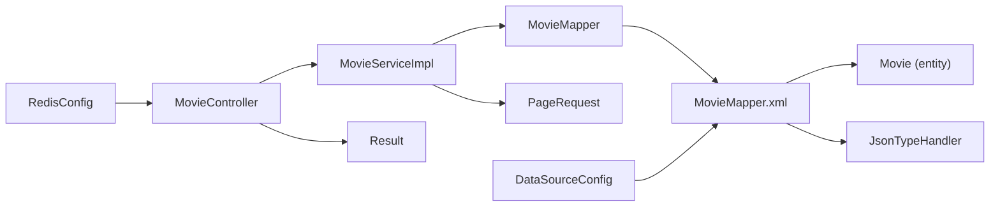

**Diagram sources**
- [MovieController.java](file://backend/src/main/java/com/movie/backend/controller/MovieController.java#L1-L209)
- [MovieServiceImpl.java](file://backend/src/main/java/com/movie/backend/service/impl/MovieServiceImpl.java#L1-L116)
- [MovieMapper.java](file://backend/src/main/java/com/movie/backend/mapper/MovieMapper.java#L1-L92)
- [MovieMapper.xml](file://backend/src/main/resources/mapper/MovieMapper.xml#L1-L193)
- [Movie.java](file://backend/src/main/java/com/movie/backend/entity/Movie.java#L1-L65)
- [JsonTypeHandler.java](file://backend/src/main/java/com/movie/backend/config/JsonTypeHandler.java#L1-L61)
- [PageRequest.java](file://backend/src/main/java/com/movie/backend/dto/PageRequest.java#L1-L25)
- [Result.java](file://backend/src/main/java/com/movie/backend/common/Result.java#L1-L43)
- [DataSourceConfig.java](file://backend/src/main/java/com/movie/backend/config/DataSourceConfig.java#L18-L48)
- [RedisConfig.java](file://backend/src/main/java/com/movie/backend/config/RedisConfig.java#L14-L42)

**Section sources**
- [MovieController.java](file://backend/src/main/java/com/movie/backend/controller/MovieController.java#L1-L209)
- [MovieServiceImpl.java](file://backend/src/main/java/com/movie/backend/service/impl/MovieServiceImpl.java#L1-L116)
- [MovieMapper.java](file://backend/src/main/java/com/movie/backend/mapper/MovieMapper.java#L1-L92)
- [MovieMapper.xml](file://backend/src/main/resources/mapper/MovieMapper.xml#L1-L193)
- [Movie.java](file://backend/src/main/java/com/movie/backend/entity/Movie.java#L1-L65)
- [JsonTypeHandler.java](file://backend/src/main/java/com/movie/backend/config/JsonTypeHandler.java#L1-L61)
- [PageRequest.java](file://backend/src/main/java/com/movie/backend/dto/PageRequest.java#L1-L25)
- [Result.java](file://backend/src/main/java/com/movie/backend/common/Result.java#L1-L43)
- [DataSourceConfig.java](file://backend/src/main/java/com/movie/backend/config/DataSourceConfig.java#L18-L48)
- [RedisConfig.java](file://backend/src/main/java/com/movie/backend/config/RedisConfig.java#L14-L42)

## Performance Considerations
- Pagination: PageHelper ensures bounded result sets; keep page size within limits to avoid heavy queries.
- Indexes: Ensure indexes exist on frequently filtered/sorted columns (e.g., year, douban_score, douban_votes).
- JSON fields: JsonTypeHandler adds CPU overhead; minimize writes or batch updates when possible.
- Recommendations: Queries are simple ORDER BY with LIMIT; ensure appropriate indexes for score/votes.
- External data: Hive is configured but not used in MovieServiceImpl; consider offloading analytics workloads to Hive while keeping OLTP on MySQL.

[No sources needed since this section provides general guidance]

## Troubleshooting Guide
- 400 errors on invalid parameters:
  - Movie ID ≤ 0, page ≤ 0, size > 100, keyword length > 100, score out of range, year format invalid.
- 404 for movie not found:
  - getDetail returns null; controller responds with failure.
- Validation failures:
  - DTO validation messages indicate exact constraint violations.
- Testing:
  - Unit/integration tests demonstrate expected behavior for success and failure cases.

**Section sources**
- [MovieController.java](file://backend/src/main/java/com/movie/backend/controller/MovieController.java#L48-L50)
- [MovieController.java](file://backend/src/main/java/com/movie/backend/controller/MovieController.java#L72-L75)
- [MovieControllerIntegrationTest.java](file://backend/src/test/java/com/movie/backend/controller/MovieControllerIntegrationTest.java#L82-L111)
- [MovieControllerIntegrationTest.java](file://backend/src/test/java/com/movie/backend/controller/MovieControllerIntegrationTest.java#L137-L187)
- [MovieControllerIntegrationTest.java](file://backend/src/test/java/com/movie/backend/controller/MovieControllerIntegrationTest.java#L253-L274)
- [MovieControllerIntegrationTest.java](file://backend/src/test/java/com/movie/backend/controller/MovieControllerIntegrationTest.java#L295-L306)
- [MovieControllerIntegrationTest.java](file://backend/src/test/java/com/movie/backend/controller/MovieControllerIntegrationTest.java#L327-L338)

## Conclusion
The Movie Service provides a robust, validated, and paginated interface for movie catalog operations. It supports advanced search and filtering, recommendation and popularity calculations, and integrates with MySQL and Redis. The design leverages MyBatis for SQL flexibility, DTO validation for safety, and standardized Result envelopes for consistent responses. Future enhancements could include Redis caching for hot/recommended endpoints and analytics offloading to Hive.

[No sources needed since this section summarizes without analyzing specific files]

## Appendices

### API Endpoints Summary
- GET /movie/detail/{id}: Retrieve movie by ID
- POST /movie/search: Advanced search with pagination
- GET /movie/hot?limit=N: Popular movies by votes
- GET /movie/recommended?limit=N: Top-rated movies
- GET /movie/genre/{genre}: Filter by genre (paginated)
- GET /movie/year/{year}: Filter by year (paginated)
- GET /movie/latest: Latest movies (paginated)
- GET /movie/genres: Distinct genres list
- GET /movie/regions: Distinct regions list
- GET /movie/years: Distinct years list
- GET /movie/filter/metadata: Filter segments for UI

**Section sources**
- [MovieController.java](file://backend/src/main/java/com/movie/backend/controller/MovieController.java#L46-L171)

### Data Model Notes
- JSON fields (actors, directors, writers) are persisted as JSON and mapped via JsonTypeHandler.
- Comma-separated fields (genres, regions) are normalized to deduplicated, trimmed, sorted lists.

**Section sources**
- [MovieMapper.xml](file://backend/src/main/resources/mapper/MovieMapper.xml#L10-L24)
- [JsonTypeHandler.java](file://backend/src/main/java/com/movie/backend/config/JsonTypeHandler.java#L1-L61)
- [MovieServiceImpl.java](file://backend/src/main/java/com/movie/backend/service/impl/MovieServiceImpl.java#L97-L114)