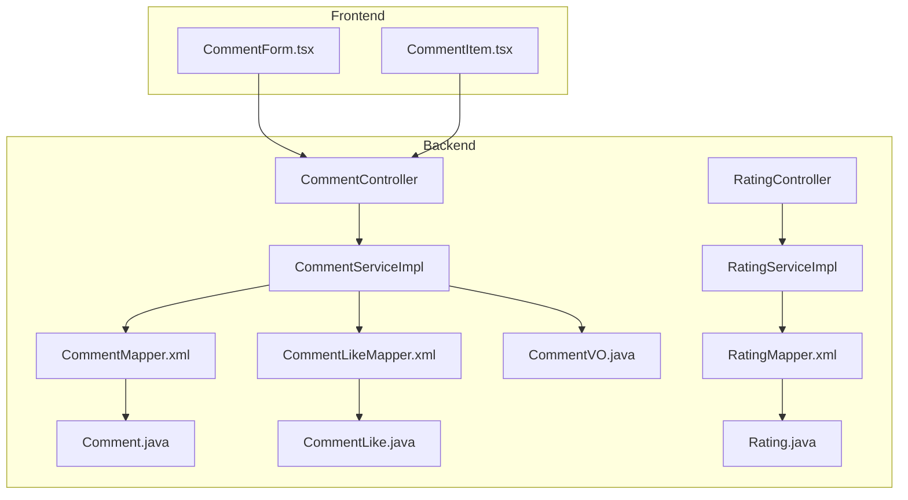
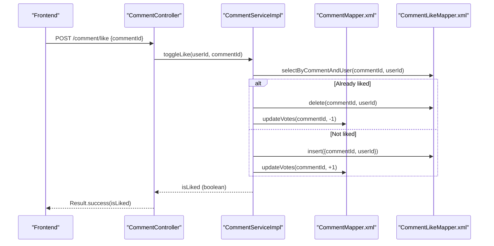
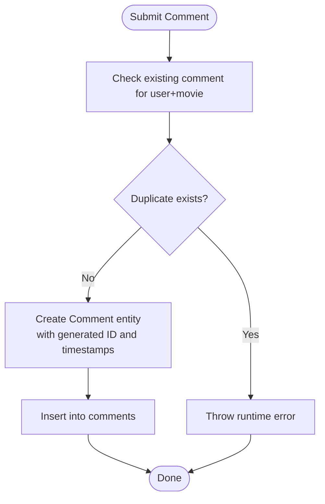
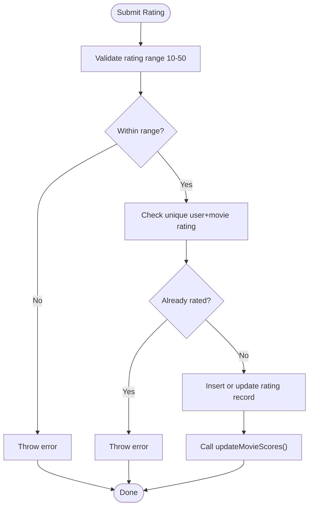
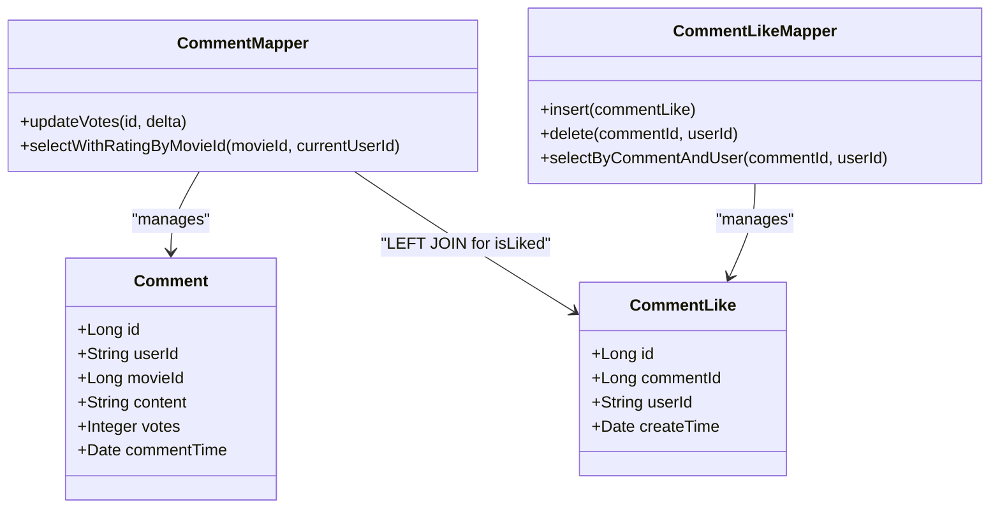
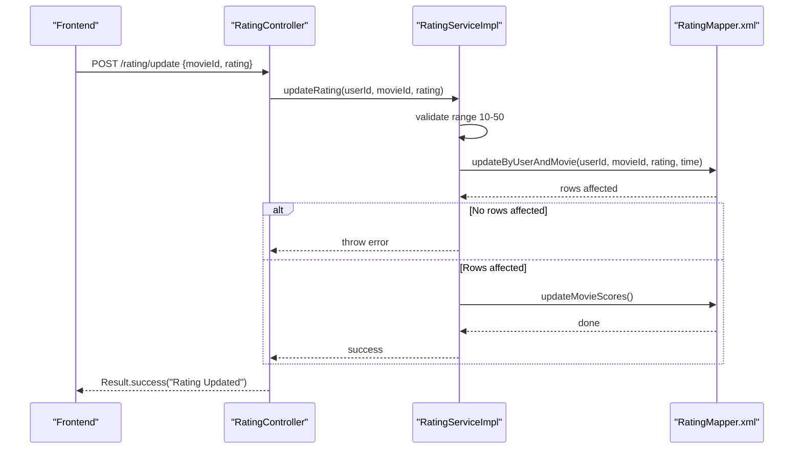
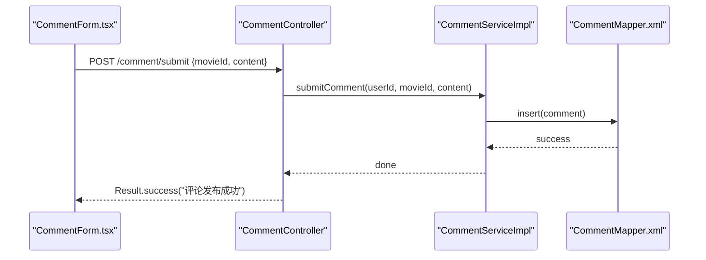
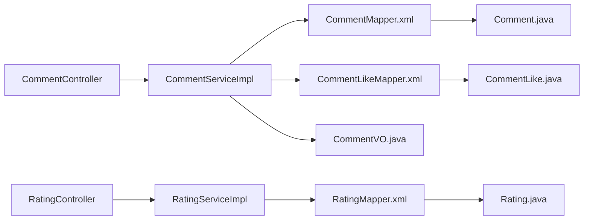

# Review & Rating Services

<cite>
**Referenced Files in This Document**
- [CommentController.java](file://backend/src/main/java/com/movie/backend/controller/CommentController.java)
- [RatingController.java](file://backend/src/main/java/com/movie/backend/controller/RatingController.java)
- [CommentServiceImpl.java](file://backend/src/main/java/com/movie/backend/service/impl/CommentServiceImpl.java)
- [RatingServiceImpl.java](file://backend/src/main/java/com/movie/backend/service/impl/RatingServiceImpl.java)
- [Comment.java](file://backend/src/main/java/com/movie/backend/entity/Comment.java)
- [Rating.java](file://backend/src/main/java/com/movie/backend/entity/Rating.java)
- [CommentLike.java](file://backend/src/main/java/com/movie/backend/entity/CommentLike.java)
- [CommentMapper.java](file://backend/src/main/java/com/movie/backend/mapper/CommentMapper.java)
- [RatingMapper.java](file://backend/src/main/java/com/movie/backend/mapper/RatingMapper.java)
- [CommentLikeMapper.java](file://backend/src/main/java/com/movie/backend/mapper/CommentLikeMapper.java)
- [CommentMapper.xml](file://backend/src/main/resources/mapper/CommentMapper.xml)
- [RatingMapper.xml](file://backend/src/main/resources/mapper/RatingMapper.xml)
- [CommentLikeMapper.xml](file://backend/src/main/resources/mapper/CommentLikeMapper.xml)
- [CommentVO.java](file://backend/src/main/java/com/movie/backend/dto/CommentVO.java)
- [JwtUtil.java](file://backend/src/main/java/com/movie/backend/utils/JwtUtil.java)
- [TokenBlacklistServiceImpl.java](file://backend/src/main/java/com/movie/backend/service/impl/TokenBlacklistServiceImpl.java)
- [CommentForm.tsx](file://movie-review-web/src/components/CommentForm.tsx)
- [CommentItem.tsx](file://movie-review-web/src/components/CommentItem.tsx)
</cite>

## Table of Contents
1. [Introduction](#introduction)
2. [Project Structure](#project-structure)
3. [Core Components](#core-components)
4. [Architecture Overview](#architecture-overview)
5. [Detailed Component Analysis](#detailed-component-analysis)
6. [Dependency Analysis](#dependency-analysis)
7. [Performance Considerations](#performance-considerations)
8. [Troubleshooting Guide](#troubleshooting-guide)
9. [Conclusion](#conclusion)

## Introduction
This document provides comprehensive documentation for the Review and Rating Services, covering:
- Comment system: creation, editing, deletion, and moderation workflows
- Rating system: score validation, average calculation, and user rating management
- Comment liking functionality: vote tracking and social interaction
- Business rules: review submission, duplicate detection, and content moderation
- Examples: review workflows, rating aggregation algorithms, and comment threading
- Integrations: user authentication, permission checking, and content approval
- Security and performance: spam prevention, rate limiting, and optimization strategies

## Project Structure
The review and rating subsystem spans backend controllers, services, mappers, entities, and frontend components:
- Controllers expose REST endpoints for comments and ratings
- Services encapsulate business logic and orchestrate transactions
- Mappers define SQL operations for persistence
- Entities represent domain data
- DTOs carry enriched data for presentation
- Frontend components integrate with APIs for user interactions

**Diagram sources**
- [CommentController.java](file://backend/src/main/java/com/movie/backend/controller/CommentController.java#L1-L113)
- [RatingController.java](file://backend/src/main/java/com/movie/backend/controller/RatingController.java#L1-L82)
- [CommentServiceImpl.java](file://backend/src/main/java/com/movie/backend/service/impl/CommentServiceImpl.java#L1-L125)
- [RatingServiceImpl.java](file://backend/src/main/java/com/movie/backend/service/impl/RatingServiceImpl.java#L1-L95)
- [CommentMapper.xml](file://backend/src/main/resources/mapper/CommentMapper.xml#L1-L104)
- [RatingMapper.xml](file://backend/src/main/resources/mapper/RatingMapper.xml#L1-L112)
- [CommentLikeMapper.xml](file://backend/src/main/resources/mapper/CommentLikeMapper.xml#L1-L22)
- [Comment.java](file://backend/src/main/java/com/movie/backend/entity/Comment.java#L1-L28)
- [Rating.java](file://backend/src/main/java/com/movie/backend/entity/Rating.java#L1-L24)
- [CommentLike.java](file://backend/src/main/java/com/movie/backend/entity/CommentLike.java#L1-L22)
- [CommentVO.java](file://backend/src/main/java/com/movie/backend/dto/CommentVO.java#L1-L31)
- [CommentForm.tsx](file://movie-review-web/src/components/CommentForm.tsx#L198-L222)
- [CommentItem.tsx](file://movie-review-web/src/components/CommentItem.tsx#L60-L97)

**Section sources**
- [CommentController.java](file://backend/src/main/java/com/movie/backend/controller/CommentController.java#L1-L113)
- [RatingController.java](file://backend/src/main/java/com/movie/backend/controller/RatingController.java#L1-L82)
- [CommentServiceImpl.java](file://backend/src/main/java/com/movie/backend/service/impl/CommentServiceImpl.java#L1-L125)
- [RatingServiceImpl.java](file://backend/src/main/java/com/movie/backend/service/impl/RatingServiceImpl.java#L1-L95)
- [CommentMapper.xml](file://backend/src/main/resources/mapper/CommentMapper.xml#L1-L104)
- [RatingMapper.xml](file://backend/src/main/resources/mapper/RatingMapper.xml#L1-L112)
- [CommentLikeMapper.xml](file://backend/src/main/resources/mapper/CommentLikeMapper.xml#L1-L22)
- [Comment.java](file://backend/src/main/java/com/movie/backend/entity/Comment.java#L1-L28)
- [Rating.java](file://backend/src/main/java/com/movie/backend/entity/Rating.java#L1-L24)
- [CommentLike.java](file://backend/src/main/java/com/movie/backend/entity/CommentLike.java#L1-L22)
- [CommentVO.java](file://backend/src/main/java/com/movie/backend/dto/CommentVO.java#L1-L31)
- [CommentForm.tsx](file://movie-review-web/src/components/CommentForm.tsx#L198-L222)
- [CommentItem.tsx](file://movie-review-web/src/components/CommentItem.tsx#L60-L97)

## Core Components
- CommentController: Exposes endpoints for listing comments, submitting/updating comments, toggling likes, and retrieving user comments.
- RatingController: Exposes endpoints for submitting/updating ratings, fetching user ratings, clearing ratings, and batch deletions.
- CommentServiceImpl: Implements comment CRUD, duplicate detection, and like/unlike logic with transactional updates.
- RatingServiceImpl: Implements rating validation, uniqueness checks, and movie score recalculation via weighted averages.
- CommentMapper/RatingMapper/CommentLikeMapper: Define SQL operations for comments, ratings, and likes.
- CommentVO: Enriched DTO combining comment data with user info, rating, and like status.
- JWT integration: Extracts user identity from requests for authentication and permissions.

**Section sources**
- [CommentController.java](file://backend/src/main/java/com/movie/backend/controller/CommentController.java#L1-L113)
- [RatingController.java](file://backend/src/main/java/com/movie/backend/controller/RatingController.java#L1-L82)
- [CommentServiceImpl.java](file://backend/src/main/java/com/movie/backend/service/impl/CommentServiceImpl.java#L1-L125)
- [RatingServiceImpl.java](file://backend/src/main/java/com/movie/backend/service/impl/RatingServiceImpl.java#L1-L95)
- [CommentMapper.java](file://backend/src/main/java/com/movie/backend/mapper/CommentMapper.java#L1-L68)
- [RatingMapper.java](file://backend/src/main/java/com/movie/backend/mapper/RatingMapper.java#L1-L53)
- [CommentLikeMapper.java](file://backend/src/main/java/com/movie/backend/mapper/CommentLikeMapper.java#L1-L24)
- [CommentVO.java](file://backend/src/main/java/com/movie/backend/dto/CommentVO.java#L1-L31)
- [JwtUtil.java](file://backend/src/main/java/com/movie/backend/utils/JwtUtil.java)

## Architecture Overview
The system follows a layered architecture:
- Presentation: Controllers accept requests and return standardized Result responses
- Application: Services enforce business rules and coordinate transactions
- Persistence: MyBatis mappers map Java methods to SQL queries and updates
- Data Transfer: DTOs enrich entities for UI consumption

**Diagram sources**
- [CommentController.java](file://backend/src/main/java/com/movie/backend/controller/CommentController.java#L94-L102)
- [CommentServiceImpl.java](file://backend/src/main/java/com/movie/backend/service/impl/CommentServiceImpl.java#L91-L110)
- [CommentLikeMapper.xml](file://backend/src/main/resources/mapper/CommentLikeMapper.xml#L10-L19)
- [CommentMapper.xml](file://backend/src/main/resources/mapper/CommentMapper.xml#L86-L90)

## Detailed Component Analysis

### Comment System
- Submission: One comment per user per movie enforced by counting existing records before insertion.
- Editing: Supports updating content only or content plus rating (rating updated via RatingService).
- Deletion: Endpoint exists for administrators; client-side deletion is not exposed in the provided controller.
- Moderation: Admin endpoint for deleting comments; content approval can be integrated by extending the admin service.

**Diagram sources**
- [CommentServiceImpl.java](file://backend/src/main/java/com/movie/backend/service/impl/CommentServiceImpl.java#L46-L63)
- [CommentMapper.java](file://backend/src/main/java/com/movie/backend/mapper/CommentMapper.java#L44-L49)
- [CommentMapper.xml](file://backend/src/main/resources/mapper/CommentMapper.xml#L76-L84)

**Section sources**
- [CommentController.java](file://backend/src/main/java/com/movie/backend/controller/CommentController.java#L50-L92)
- [CommentServiceImpl.java](file://backend/src/main/java/com/movie/backend/service/impl/CommentServiceImpl.java#L46-L89)
- [CommentMapper.java](file://backend/src/main/java/com/movie/backend/mapper/CommentMapper.java#L44-L49)
- [CommentMapper.xml](file://backend/src/main/resources/mapper/CommentMapper.xml#L76-L84)

### Rating System
- Validation: Ratings must be within the range 10–50.
- Uniqueness: Each user can rate a movie only once; attempts trigger errors.
- Aggregation: Movie scores updated using a weighted average formula that combines existing douban_score and user ratings.

**Diagram sources**
- [RatingServiceImpl.java](file://backend/src/main/java/com/movie/backend/service/impl/RatingServiceImpl.java#L23-L43)
- [RatingMapper.xml](file://backend/src/main/resources/mapper/RatingMapper.xml#L82-L110)

**Section sources**
- [RatingController.java](file://backend/src/main/java/com/movie/backend/controller/RatingController.java#L24-L54)
- [RatingServiceImpl.java](file://backend/src/main/java/com/movie/backend/service/impl/RatingServiceImpl.java#L23-L58)
- [RatingMapper.java](file://backend/src/main/java/com/movie/backend/mapper/RatingMapper.java#L12-L51)
- [RatingMapper.xml](file://backend/src/main/resources/mapper/RatingMapper.xml#L14-L26)

### Comment Liking and Social Interactions
- Toggle Like: Checks existing like, inserts or deletes accordingly, and updates comment votes atomically.
- Presentation: CommentVO includes user avatar, nickname, rating, and isLiked flag for efficient rendering.

**Diagram sources**
- [Comment.java](file://backend/src/main/java/com/movie/backend/entity/Comment.java#L1-L28)
- [CommentLike.java](file://backend/src/main/java/com/movie/backend/entity/CommentLike.java#L1-L22)
- [CommentMapper.java](file://backend/src/main/java/com/movie/backend/mapper/CommentMapper.java#L56-L61)
- [CommentLikeMapper.java](file://backend/src/main/java/com/movie/backend/mapper/CommentLikeMapper.java#L12-L22)
- [CommentMapper.xml](file://backend/src/main/resources/mapper/CommentMapper.xml#L39-L57)
- [CommentLikeMapper.xml](file://backend/src/main/resources/mapper/CommentLikeMapper.xml#L5-L19)

**Section sources**
- [CommentServiceImpl.java](file://backend/src/main/java/com/movie/backend/service/impl/CommentServiceImpl.java#L91-L110)
- [CommentMapper.java](file://backend/src/main/java/com/movie/backend/mapper/CommentMapper.java#L56-L61)
- [CommentLikeMapper.java](file://backend/src/main/java/com/movie/backend/mapper/CommentLikeMapper.java#L12-L22)
- [CommentMapper.xml](file://backend/src/main/resources/mapper/CommentMapper.xml#L39-L57)
- [CommentLikeMapper.xml](file://backend/src/main/resources/mapper/CommentLikeMapper.xml#L5-L19)
- [CommentVO.java](file://backend/src/main/java/com/movie/backend/dto/CommentVO.java#L13-L30)

### Business Rules and Workflows
- Review submission: One comment per user per movie; submission endpoint enforces this.
- Duplicate detection: Both comment and rating systems prevent duplicates.
- Content moderation: Admin endpoint for comment deletion; extendable for broader moderation actions.
- Rating aggregation: Weighted average combining existing douban_score and user ratings.

**Diagram sources**
- [RatingController.java](file://backend/src/main/java/com/movie/backend/controller/RatingController.java#L35-L44)
- [RatingServiceImpl.java](file://backend/src/main/java/com/movie/backend/service/impl/RatingServiceImpl.java#L45-L58)
- [RatingMapper.xml](file://backend/src/main/resources/mapper/RatingMapper.xml#L82-L110)

**Section sources**
- [CommentController.java](file://backend/src/main/java/com/movie/backend/controller/CommentController.java#L50-L92)
- [CommentServiceImpl.java](file://backend/src/main/java/com/movie/backend/service/impl/CommentServiceImpl.java#L46-L89)
- [RatingController.java](file://backend/src/main/java/com/movie/backend/controller/RatingController.java#L24-L54)
- [RatingServiceImpl.java](file://backend/src/main/java/com/movie/backend/service/impl/RatingServiceImpl.java#L23-L58)
- [RatingMapper.xml](file://backend/src/main/resources/mapper/RatingMapper.xml#L69-L110)

### Frontend Integration Examples
- Comment submission: Uses authenticated user context to submit or update comments.
- Like toggling: Updates local UI state optimistically, then syncs with backend; handles rollback on failure.

**Diagram sources**
- [CommentForm.tsx](file://movie-review-web/src/components/CommentForm.tsx#L198-L222)
- [CommentController.java](file://backend/src/main/java/com/movie/backend/controller/CommentController.java#L50-L59)
- [CommentServiceImpl.java](file://backend/src/main/java/com/movie/backend/service/impl/CommentServiceImpl.java#L46-L63)
- [CommentMapper.xml](file://backend/src/main/resources/mapper/CommentMapper.xml#L59-L62)

**Section sources**
- [CommentForm.tsx](file://movie-review-web/src/components/CommentForm.tsx#L198-L222)
- [CommentItem.tsx](file://movie-review-web/src/components/CommentItem.tsx#L60-L97)
- [CommentController.java](file://backend/src/main/java/com/movie/backend/controller/CommentController.java#L50-L102)

## Dependency Analysis
The services depend on mappers for persistence, and controllers depend on services for business logic. DTOs bridge entities for presentation.

**Diagram sources**
- [CommentController.java](file://backend/src/main/java/com/movie/backend/controller/CommentController.java#L1-L113)
- [RatingController.java](file://backend/src/main/java/com/movie/backend/controller/RatingController.java#L1-L82)
- [CommentServiceImpl.java](file://backend/src/main/java/com/movie/backend/service/impl/CommentServiceImpl.java#L1-L125)
- [RatingServiceImpl.java](file://backend/src/main/java/com/movie/backend/service/impl/RatingServiceImpl.java#L1-L95)
- [CommentMapper.xml](file://backend/src/main/resources/mapper/CommentMapper.xml#L1-L104)
- [RatingMapper.xml](file://backend/src/main/resources/mapper/RatingMapper.xml#L1-L112)
- [CommentLikeMapper.xml](file://backend/src/main/resources/mapper/CommentLikeMapper.xml#L1-L22)
- [Comment.java](file://backend/src/main/java/com/movie/backend/entity/Comment.java#L1-L28)
- [Rating.java](file://backend/src/main/java/com/movie/backend/entity/Rating.java#L1-L24)
- [CommentLike.java](file://backend/src/main/java/com/movie/backend/entity/CommentLike.java#L1-L22)
- [CommentVO.java](file://backend/src/main/java/com/movie/backend/dto/CommentVO.java#L1-L31)

**Section sources**
- [CommentServiceImpl.java](file://backend/src/main/java/com/movie/backend/service/impl/CommentServiceImpl.java#L18-L28)
- [RatingServiceImpl.java](file://backend/src/main/java/com/movie/backend/service/impl/RatingServiceImpl.java#L16-L21)
- [CommentMapper.java](file://backend/src/main/java/com/movie/backend/mapper/CommentMapper.java#L1-L68)
- [RatingMapper.java](file://backend/src/main/java/com/movie/backend/mapper/RatingMapper.java#L1-L53)
- [CommentLikeMapper.java](file://backend/src/main/java/com/movie/backend/mapper/CommentLikeMapper.java#L1-L24)

## Performance Considerations
- Pagination: Controllers use PageHelper to avoid loading entire datasets; keep page sizes reasonable.
- Efficient queries: CommentMapper and RatingMapper provide targeted SQL with joins and aggregations.
- Atomic updates: Vote increments/decrements and rating updates occur in single statements.
- DTO enrichment: CommentVO reduces round trips by embedding user info and like status in a single query.
- Indexing recommendations: Ensure indices on comments(user_id, movie_id), ratings(user_id, movie_id), and comment_likes(comment_id, user_id).

[No sources needed since this section provides general guidance]

## Troubleshooting Guide
- Authentication failures: Ensure JWT is present and valid; extract user ID via JwtUtil.
- Duplicate submission errors: Verify per-user-per-movie uniqueness before attempting submission.
- Rating validation errors: Confirm rating value is within 10–50.
- Like toggle inconsistencies: UI optimistically updates state; if server response differs, revert UI and log the discrepancy.
- Token invalidation: Use TokenBlacklistServiceImpl to manage revoked tokens and prevent reuse.

**Section sources**
- [JwtUtil.java](file://backend/src/main/java/com/movie/backend/utils/JwtUtil.java)
- [TokenBlacklistServiceImpl.java](file://backend/src/main/java/com/movie/backend/service/impl/TokenBlacklistServiceImpl.java#L1-L80)
- [CommentServiceImpl.java](file://backend/src/main/java/com/movie/backend/service/impl/CommentServiceImpl.java#L48-L51)
- [RatingServiceImpl.java](file://backend/src/main/java/com/movie/backend/service/impl/RatingServiceImpl.java#L25-L27)
- [CommentItem.tsx](file://movie-review-web/src/components/CommentItem.tsx#L80-L96)

## Conclusion
The Review and Rating Services implement a robust, transactional system for comments and ratings with strong business rule enforcement, efficient data retrieval, and social interaction features. The architecture cleanly separates concerns across controllers, services, and mappers, while DTOs optimize presentation-layer performance. Administrators can moderate content, and the system’s design supports future enhancements such as advanced moderation workflows, spam detection, and rate limiting.