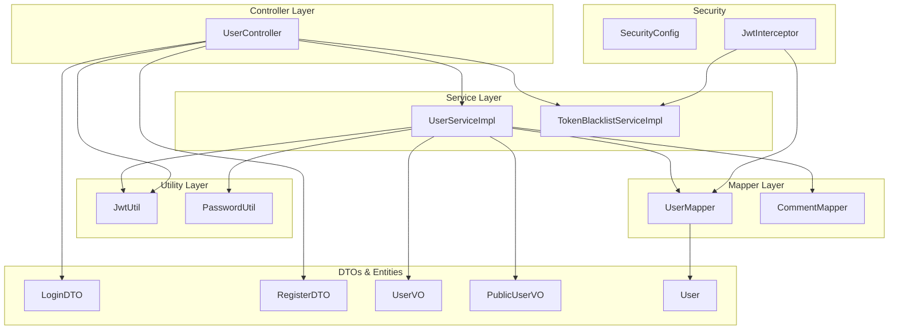
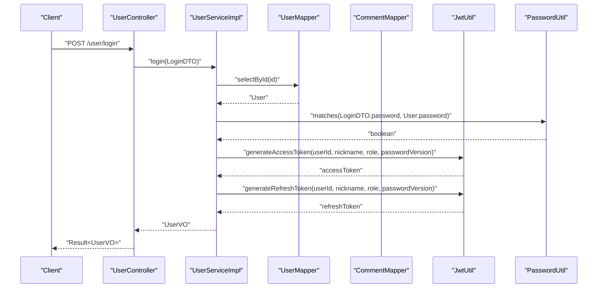
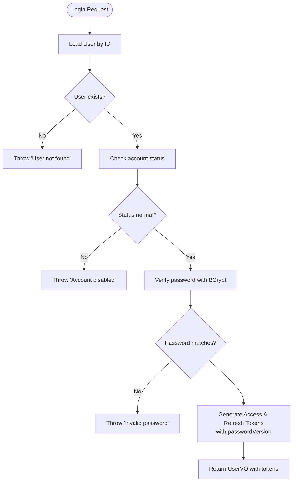
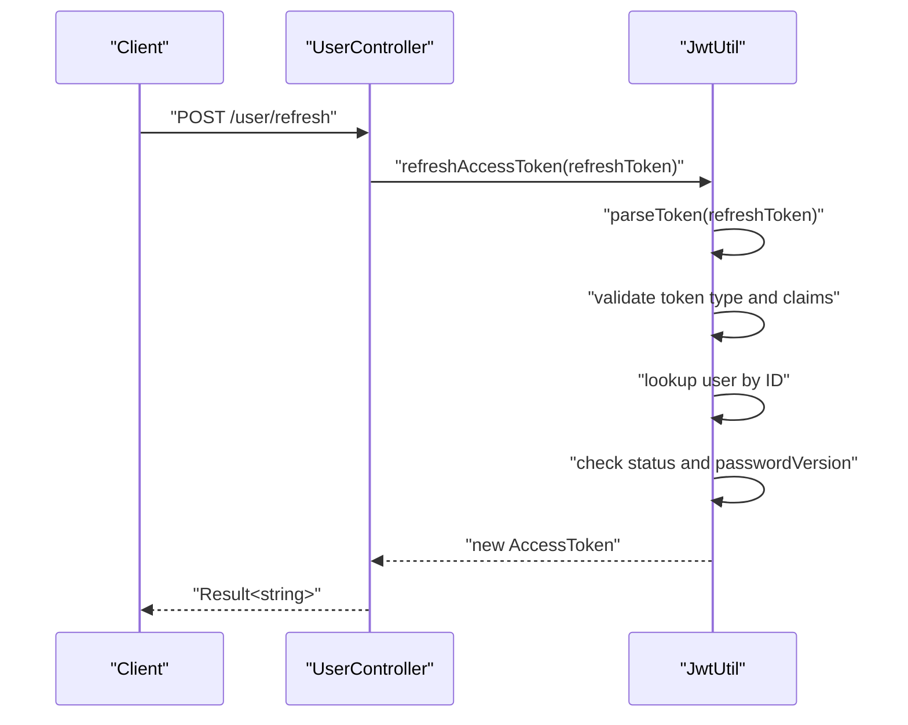
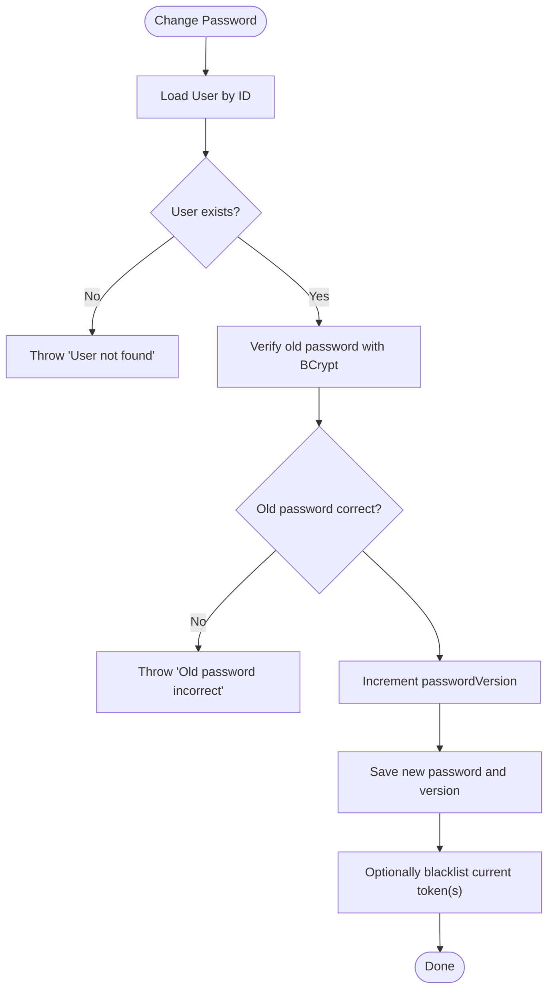
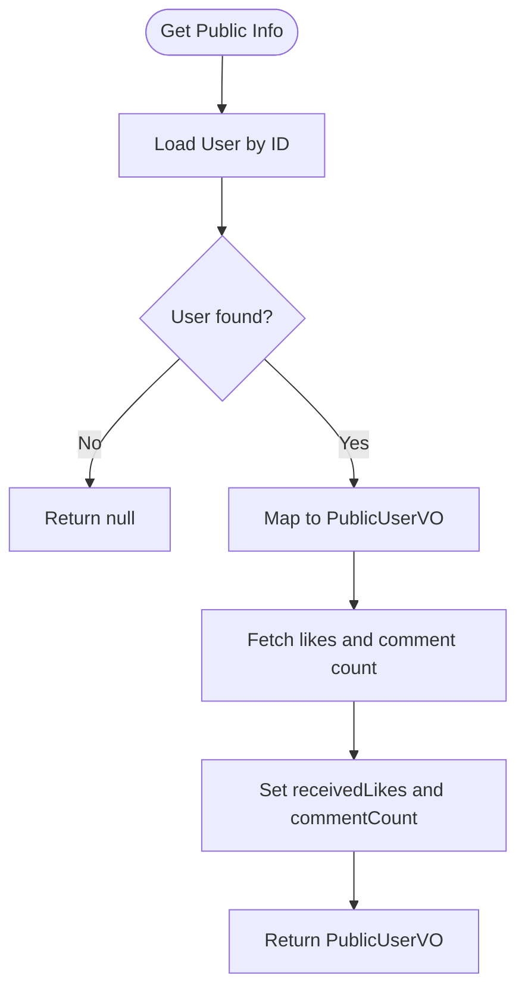
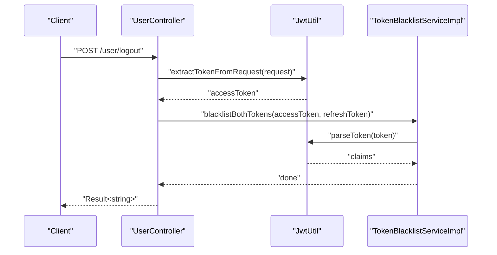
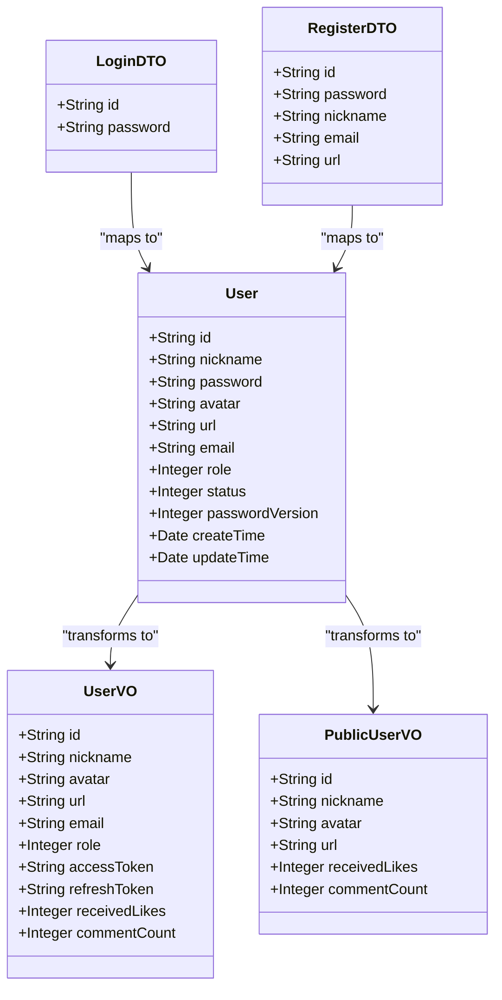
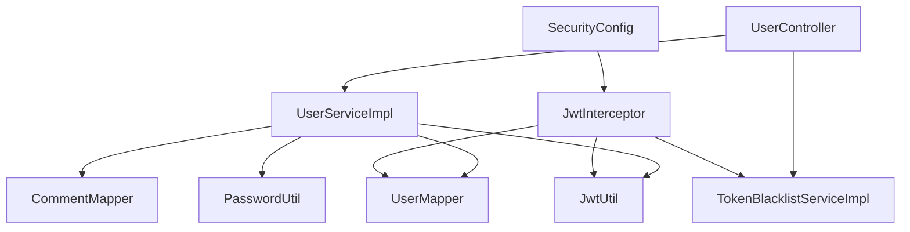

# User Service

<cite>
**Referenced Files in This Document**
- [UserService.java](file://backend/src/main/java/com/movie/backend/service/UserService.java)
- [UserServiceImpl.java](file://backend/src/main/java/com/movie/backend/service/impl/UserServiceImpl.java)
- [UserController.java](file://backend/src/main/java/com/movie/backend/controller/UserController.java)
- [LoginDTO.java](file://backend/src/main/java/com/movie/backend/dto/LoginDTO.java)
- [RegisterDTO.java](file://backend/src/main/java/com/movie/backend/dto/RegisterDTO.java)
- [UserVO.java](file://backend/src/main/java/com/movie/backend/dto/UserVO.java)
- [PublicUserVO.java](file://backend/src/main/java/com/movie/backend/dto/PublicUserVO.java)
- [User.java](file://backend/src/main/java/com/movie/backend/entity/User.java)
- [JwtUtil.java](file://backend/src/main/java/com/movie/backend/utils/JwtUtil.java)
- [PasswordUtil.java](file://backend/src/main/java/com/movie/backend/utils/PasswordUtil.java)
- [UserMapper.java](file://backend/src/main/java/com/movie/backend/mapper/UserMapper.java)
- [CommentMapper.java](file://backend/src/main/java/com/movie/backend/mapper/CommentMapper.java)
- [TokenBlacklistService.java](file://backend/src/main/java/com/movie/backend/service/TokenBlacklistService.java)
- [TokenBlacklistServiceImpl.java](file://backend/src/main/java/com/movie/backend/service/impl/TokenBlacklistServiceImpl.java)
- [SecurityConfig.java](file://backend/src/main/java/com/movie/backend/config/SecurityConfig.java)
- [JwtInterceptor.java](file://backend/src/main/java/com/movie/backend/config/JwtInterceptor.java)
- [application.yml](file://backend/src/main/resources/application.yml)
</cite>

## Table of Contents
1. [Introduction](#introduction)
2. [Project Structure](#project-structure)
3. [Core Components](#core-components)
4. [Architecture Overview](#architecture-overview)
5. [Detailed Component Analysis](#detailed-component-analysis)
6. [Dependency Analysis](#dependency-analysis)
7. [Performance Considerations](#performance-considerations)
8. [Troubleshooting Guide](#troubleshooting-guide)
9. [Conclusion](#conclusion)
10. [Appendices](#appendices)

## Introduction
This document provides comprehensive documentation for the User Service implementation in the movie system backend. It covers user authentication and registration workflows, JWT token generation and refresh, password change mechanisms with version incrementing and token invalidation, user profile management (including avatar updates and statistics calculation), and integration with authentication components. Practical examples of service method usage, DTO transformations, and error handling strategies are included, along with security considerations and validation rules.

## Project Structure
The User Service spans several layers:
- Controller layer: HTTP endpoints for login, registration, profile management, token refresh, logout, and password change.
- Service layer: Business logic for authentication, registration, profile updates, statistics aggregation, and password changes.
- Utility layer: JWT utilities for token generation, parsing, validation, and refresh; password utilities for BCrypt encoding and matching.
- Mapper layer: Data access for users and comments used for statistics.
- Security configuration: Stateless JWT interceptor and Spring Security configuration.
- DTOs and Entities: Data transfer objects and persistence entities for user information.

**Diagram sources**
- [UserController.java](file://backend/src/main/java/com/movie/backend/controller/UserController.java#L24-L129)
- [UserServiceImpl.java](file://backend/src/main/java/com/movie/backend/service/impl/UserServiceImpl.java#L20-L175)
- [TokenBlacklistServiceImpl.java](file://backend/src/main/java/com/movie/backend/service/impl/TokenBlacklistServiceImpl.java#L18-L80)
- [JwtUtil.java](file://backend/src/main/java/com/movie/backend/utils/JwtUtil.java#L21-L179)
- [PasswordUtil.java](file://backend/src/main/java/com/movie/backend/utils/PasswordUtil.java#L9-L31)
- [UserMapper.java](file://backend/src/main/java/com/movie/backend/mapper/UserMapper.java#L10-L40)
- [CommentMapper.java](file://backend/src/main/java/com/movie/backend/mapper/CommentMapper.java#L10-L67)
- [SecurityConfig.java](file://backend/src/main/java/com/movie/backend/config/SecurityConfig.java#L19-L49)
- [JwtInterceptor.java](file://backend/src/main/java/com/movie/backend/config/JwtInterceptor.java#L25-L104)
- [LoginDTO.java](file://backend/src/main/java/com/movie/backend/dto/LoginDTO.java#L10-L19)
- [RegisterDTO.java](file://backend/src/main/java/com/movie/backend/dto/RegisterDTO.java#L12-L34)
- [UserVO.java](file://backend/src/main/java/com/movie/backend/dto/UserVO.java#L10-L42)
- [PublicUserVO.java](file://backend/src/main/java/com/movie/backend/dto/PublicUserVO.java#L10-L30)
- [User.java](file://backend/src/main/java/com/movie/backend/entity/User.java#L11-L45)

**Section sources**
- [UserController.java](file://backend/src/main/java/com/movie/backend/controller/UserController.java#L24-L129)
- [UserServiceImpl.java](file://backend/src/main/java/com/movie/backend/service/impl/UserServiceImpl.java#L20-L175)
- [JwtUtil.java](file://backend/src/main/java/com/movie/backend/utils/JwtUtil.java#L21-L179)
- [PasswordUtil.java](file://backend/src/main/java/com/movie/backend/utils/PasswordUtil.java#L9-L31)
- [UserMapper.java](file://backend/src/main/java/com/movie/backend/mapper/UserMapper.java#L10-L40)
- [CommentMapper.java](file://backend/src/main/java/com/movie/backend/mapper/CommentMapper.java#L10-L67)
- [SecurityConfig.java](file://backend/src/main/java/com/movie/backend/config/SecurityConfig.java#L19-L49)
- [JwtInterceptor.java](file://backend/src/main/java/com/movie/backend/config/JwtInterceptor.java#L25-L104)
- [LoginDTO.java](file://backend/src/main/java/com/movie/backend/dto/LoginDTO.java#L10-L19)
- [RegisterDTO.java](file://backend/src/main/java/com/movie/backend/dto/RegisterDTO.java#L12-L34)
- [UserVO.java](file://backend/src/main/java/com/movie/backend/dto/UserVO.java#L10-L42)
- [PublicUserVO.java](file://backend/src/main/java/com/movie/backend/dto/PublicUserVO.java#L10-L30)
- [User.java](file://backend/src/main/java/com/movie/backend/entity/User.java#L11-L45)

## Core Components
- UserService interface defines the contract for authentication, registration, avatar updates, public/private info retrieval, statistics calculation, and password change.
- UserServiceImpl implements the business logic, including password verification via BCrypt, JWT token generation, statistics aggregation, and password version incrementing.
- UserController exposes REST endpoints for login, registration, profile management, token refresh, logout, and password change, returning standardized Result responses.
- DTOs encapsulate request/response payloads for login, registration, and user information views.
- JwtUtil handles JWT lifecycle: generation, parsing, validation, refresh, and extraction from requests.
- PasswordUtil provides BCrypt-based password encoding and matching.
- TokenBlacklistService and TokenBlacklistServiceImpl manage revoked tokens using Redis for short-term blacklisting.
- SecurityConfig and JwtInterceptor configure stateless JWT authentication and set up Spring Security context and thread-local user context.

**Section sources**
- [UserService.java](file://backend/src/main/java/com/movie/backend/service/UserService.java#L8-L28)
- [UserServiceImpl.java](file://backend/src/main/java/com/movie/backend/service/impl/UserServiceImpl.java#L20-L175)
- [UserController.java](file://backend/src/main/java/com/movie/backend/controller/UserController.java#L24-L129)
- [UserVO.java](file://backend/src/main/java/com/movie/backend/dto/UserVO.java#L10-L42)
- [PublicUserVO.java](file://backend/src/main/java/com/movie/backend/dto/PublicUserVO.java#L10-L30)
- [JwtUtil.java](file://backend/src/main/java/com/movie/backend/utils/JwtUtil.java#L21-L179)
- [PasswordUtil.java](file://backend/src/main/java/com/movie/backend/utils/PasswordUtil.java#L9-L31)
- [TokenBlacklistService.java](file://backend/src/main/java/com/movie/backend/service/TokenBlacklistService.java#L7-L29)
- [TokenBlacklistServiceImpl.java](file://backend/src/main/java/com/movie/backend/service/impl/TokenBlacklistServiceImpl.java#L18-L80)
- [SecurityConfig.java](file://backend/src/main/java/com/movie/backend/config/SecurityConfig.java#L19-L49)
- [JwtInterceptor.java](file://backend/src/main/java/com/movie/backend/config/JwtInterceptor.java#L25-L104)

## Architecture Overview
The User Service follows a layered architecture with clear separation of concerns:
- Controllers handle HTTP requests and responses.
- Services encapsulate business logic and coordinate with mappers and utilities.
- Utilities provide cross-cutting concerns like JWT and password handling.
- Mappers abstract database operations.
- Security components enforce stateless authentication and authorization.

**Diagram sources**
- [UserController.java](file://backend/src/main/java/com/movie/backend/controller/UserController.java#L34-L36)
- [UserServiceImpl.java](file://backend/src/main/java/com/movie/backend/service/impl/UserServiceImpl.java#L29-L56)
- [UserMapper.java](file://backend/src/main/java/com/movie/backend/mapper/UserMapper.java#L14)
- [JwtUtil.java](file://backend/src/main/java/com/movie/backend/utils/JwtUtil.java#L52-L61)
- [PasswordUtil.java](file://backend/src/main/java/com/movie/backend/utils/PasswordUtil.java#L28)

## Detailed Component Analysis

### Authentication and Registration Workflow
- Login validation:
  - Fetch user by ID and check account status.
  - Verify password using BCrypt.
  - Generate access and refresh tokens with passwordVersion embedded in claims.
- Registration:
  - Validate uniqueness of ID.
  - Copy DTO to entity, encode password with BCrypt, set defaults (role, status, passwordVersion), timestamps, and persist.

**Diagram sources**
- [UserServiceImpl.java](file://backend/src/main/java/com/movie/backend/service/impl/UserServiceImpl.java#L29-L56)
- [PasswordUtil.java](file://backend/src/main/java/com/movie/backend/utils/PasswordUtil.java#L28)
- [JwtUtil.java](file://backend/src/main/java/com/movie/backend/utils/JwtUtil.java#L66-L81)

**Section sources**
- [UserServiceImpl.java](file://backend/src/main/java/com/movie/backend/service/impl/UserServiceImpl.java#L29-L76)
- [LoginDTO.java](file://backend/src/main/java/com/movie/backend/dto/LoginDTO.java#L10-L19)
- [RegisterDTO.java](file://backend/src/main/java/com/movie/backend/dto/RegisterDTO.java#L12-L34)
- [UserMapper.java](file://backend/src/main/java/com/movie/backend/mapper/UserMapper.java#L14)

### JWT Token Generation and Refresh
- Access tokens are short-lived; refresh tokens are long-lived.
- Tokens embed user identity, role, nickname, and passwordVersion.
- Refresh endpoint validates refresh token, checks user existence and status, ensures passwordVersion consistency, and issues a new access token.

**Diagram sources**
- [UserController.java](file://backend/src/main/java/com/movie/backend/controller/UserController.java#L78-L86)
- [JwtUtil.java](file://backend/src/main/java/com/movie/backend/utils/JwtUtil.java#L123-L155)

**Section sources**
- [JwtUtil.java](file://backend/src/main/java/com/movie/backend/utils/JwtUtil.java#L52-L81)
- [JwtUtil.java](file://backend/src/main/java/com/movie/backend/utils/JwtUtil.java#L123-L155)
- [UserController.java](file://backend/src/main/java/com/movie/backend/controller/UserController.java#L78-L86)

### Password Change Mechanism
- Validates old password using BCrypt.
- Updates password with BCrypt encoding and increments passwordVersion.
- Invalidates old tokens by requiring clients to re-authenticate; optional blacklist of current access token.

**Diagram sources**
- [UserServiceImpl.java](file://backend/src/main/java/com/movie/backend/service/impl/UserServiceImpl.java#L152-L174)
- [PasswordUtil.java](file://backend/src/main/java/com/movie/backend/utils/PasswordUtil.java#L28)
- [TokenBlacklistServiceImpl.java](file://backend/src/main/java/com/movie/backend/service/impl/TokenBlacklistServiceImpl.java#L47-L79)

**Section sources**
- [UserServiceImpl.java](file://backend/src/main/java/com/movie/backend/service/impl/UserServiceImpl.java#L152-L174)
- [TokenBlacklistServiceImpl.java](file://backend/src/main/java/com/movie/backend/service/impl/TokenBlacklistServiceImpl.java#L47-L79)

### User Profile Management
- Avatar updates: Controller endpoint updates avatar URL and timestamp.
- Public info retrieval: Returns PublicUserVO with basic info and statistics.
- Private info retrieval: Returns UserVO with full info and statistics for current user.
- Statistics calculation: Aggregates total received likes and comment count via CommentMapper.

**Diagram sources**
- [UserServiceImpl.java](file://backend/src/main/java/com/movie/backend/service/impl/UserServiceImpl.java#L105-L127)
- [CommentMapper.java](file://backend/src/main/java/com/movie/backend/mapper/CommentMapper.java#L61-L66)

**Section sources**
- [UserController.java](file://backend/src/main/java/com/movie/backend/controller/UserController.java#L68-L75)
- [UserServiceImpl.java](file://backend/src/main/java/com/movie/backend/service/impl/UserServiceImpl.java#L79-L85)
- [UserServiceImpl.java](file://backend/src/main/java/com/movie/backend/service/impl/UserServiceImpl.java#L88-L127)
- [UserServiceImpl.java](file://backend/src/main/java/com/movie/backend/service/impl/UserServiceImpl.java#L130-L149)
- [PublicUserVO.java](file://backend/src/main/java/com/movie/backend/dto/PublicUserVO.java#L10-L30)
- [UserVO.java](file://backend/src/main/java/com/movie/backend/dto/UserVO.java#L10-L42)
- [CommentMapper.java](file://backend/src/main/java/com/movie/backend/mapper/CommentMapper.java#L61-L66)

### Logout and Token Blacklisting
- Extracts access token from Authorization header.
- Adds both access and refresh tokens to blacklist based on remaining TTL.
- Returns standardized success/failure responses.

**Diagram sources**
- [UserController.java](file://backend/src/main/java/com/movie/backend/controller/UserController.java#L89-L104)
- [JwtUtil.java](file://backend/src/main/java/com/movie/backend/utils/JwtUtil.java#L172-L178)
- [TokenBlacklistServiceImpl.java](file://backend/src/main/java/com/movie/backend/service/impl/TokenBlacklistServiceImpl.java#L47-L79)

**Section sources**
- [UserController.java](file://backend/src/main/java/com/movie/backend/controller/UserController.java#L89-L104)
- [JwtUtil.java](file://backend/src/main/java/com/movie/backend/utils/JwtUtil.java#L172-L178)
- [TokenBlacklistServiceImpl.java](file://backend/src/main/java/com/movie/backend/service/impl/TokenBlacklistServiceImpl.java#L47-L79)

### DTO Transformations
- LoginDTO: Validates non-blank ID and password.
- RegisterDTO: Validates ID length, password length, non-blank nickname, and optional email format.
- UserVO: Includes user info plus access/refresh tokens and statistics.
- PublicUserVO: Exposes public info without sensitive fields.

**Diagram sources**
- [LoginDTO.java](file://backend/src/main/java/com/movie/backend/dto/LoginDTO.java#L10-L19)
- [RegisterDTO.java](file://backend/src/main/java/com/movie/backend/dto/RegisterDTO.java#L12-L34)
- [UserVO.java](file://backend/src/main/java/com/movie/backend/dto/UserVO.java#L10-L42)
- [PublicUserVO.java](file://backend/src/main/java/com/movie/backend/dto/PublicUserVO.java#L10-L30)
- [User.java](file://backend/src/main/java/com/movie/backend/entity/User.java#L11-L45)

**Section sources**
- [LoginDTO.java](file://backend/src/main/java/com/movie/backend/dto/LoginDTO.java#L10-L19)
- [RegisterDTO.java](file://backend/src/main/java/com/movie/backend/dto/RegisterDTO.java#L12-L34)
- [UserVO.java](file://backend/src/main/java/com/movie/backend/dto/UserVO.java#L10-L42)
- [PublicUserVO.java](file://backend/src/main/java/com/movie/backend/dto/PublicUserVO.java#L10-L30)
- [User.java](file://backend/src/main/java/com/movie/backend/entity/User.java#L11-L45)

## Dependency Analysis
The User Service exhibits low coupling and high cohesion:
- Controller depends on UserService and TokenBlacklistService.
- UserServiceImpl depends on UserMapper, CommentMapper, JwtUtil, and PasswordUtil.
- JwtInterceptor integrates with JwtUtil and TokenBlacklistService to enforce authentication.
- SecurityConfig enables stateless session management and permits-all requests for custom handling.

**Diagram sources**
- [UserController.java](file://backend/src/main/java/com/movie/backend/controller/UserController.java#L26-L30)
- [UserServiceImpl.java](file://backend/src/main/java/com/movie/backend/service/impl/UserServiceImpl.java#L22-L26)
- [JwtInterceptor.java](file://backend/src/main/java/com/movie/backend/config/JwtInterceptor.java#L27-L31)
- [SecurityConfig.java](file://backend/src/main/java/com/movie/backend/config/SecurityConfig.java#L25-L46)

**Section sources**
- [UserController.java](file://backend/src/main/java/com/movie/backend/controller/UserController.java#L26-L30)
- [UserServiceImpl.java](file://backend/src/main/java/com/movie/backend/service/impl/UserServiceImpl.java#L22-L26)
- [JwtInterceptor.java](file://backend/src/main/java/com/movie/backend/config/JwtInterceptor.java#L27-L31)
- [SecurityConfig.java](file://backend/src/main/java/com/movie/backend/config/SecurityConfig.java#L25-L46)

## Performance Considerations
- Token refresh avoids repeated database lookups by validating claims and user status; ensure userMapper queries are efficient.
- Statistics retrieval uses dedicated mapper methods; cache frequently accessed user stats if needed.
- BCrypt hashing is computationally intensive; avoid unnecessary re-hashing and batch operations where possible.
- Redis-based token blacklisting provides O(1) lookup and automatic TTL eviction.

## Troubleshooting Guide
Common issues and resolutions:
- Unauthorized errors during protected requests:
  - Ensure Authorization header is present and starts with "Bearer ".
  - Verify token validity and non-blacklisted status.
- Token refresh failures:
  - Confirm token type is "refresh".
  - Check user existence, status, and passwordVersion consistency.
- Password change not invalidating sessions:
  - Ensure passwordVersion is incremented and clients re-authenticate.
  - Optionally blacklist current tokens post-change.
- Validation errors on login/register:
  - Check DTO constraints (non-blank, size limits, email format).
- Account disabled:
  - Confirm user status is normal before login.

**Section sources**
- [JwtInterceptor.java](file://backend/src/main/java/com/movie/backend/config/JwtInterceptor.java#L47-L60)
- [JwtUtil.java](file://backend/src/main/java/com/movie/backend/utils/JwtUtil.java#L123-L155)
- [UserServiceImpl.java](file://backend/src/main/java/com/movie/backend/service/impl/UserServiceImpl.java#L36-L43)
- [LoginDTO.java](file://backend/src/main/java/com/movie/backend/dto/LoginDTO.java#L13-L18)
- [RegisterDTO.java](file://backend/src/main/java/com/movie/backend/dto/RegisterDTO.java#L16-L22)
- [RegisterDTO.java](file://backend/src/main/java/com/movie/backend/dto/RegisterDTO.java#L29)

## Conclusion
The User Service provides a robust, secure, and scalable foundation for user management in the movie system. It leverages JWT for stateless authentication, BCrypt for password security, and Redis for token revocation. The service supports essential workflows: login, registration, profile management, statistics computation, and secure password changes with token invalidation. Clear separation of concerns and standardized DTOs facilitate maintainability and extensibility.

## Appendices

### Security Considerations
- Stateless JWT authentication with explicit token validation and blacklist checks.
- Passwords are hashed with BCrypt; plain-text passwords are never stored.
- Token refresh requires user status validation and passwordVersion consistency.
- Logout invalidates both access and refresh tokens by adding them to the blacklist.

**Section sources**
- [SecurityConfig.java](file://backend/src/main/java/com/movie/backend/config/SecurityConfig.java#L25-L46)
- [JwtInterceptor.java](file://backend/src/main/java/com/movie/backend/config/JwtInterceptor.java#L34-L95)
- [JwtUtil.java](file://backend/src/main/java/com/movie/backend/utils/JwtUtil.java#L99-L107)
- [TokenBlacklistServiceImpl.java](file://backend/src/main/java/com/movie/backend/service/impl/TokenBlacklistServiceImpl.java#L37-L44)

### Validation Rules
- LoginDTO: id and password are required.
- RegisterDTO: id length 4–20, password minimum 6 characters, nickname required, email optional but must be valid if provided.

**Section sources**
- [LoginDTO.java](file://backend/src/main/java/com/movie/backend/dto/LoginDTO.java#L13-L18)
- [RegisterDTO.java](file://backend/src/main/java/com/movie/backend/dto/RegisterDTO.java#L16-L22)
- [RegisterDTO.java](file://backend/src/main/java/com/movie/backend/dto/RegisterDTO.java#L29)

### Practical Usage Examples
- Login:
  - Endpoint: POST /user/login
  - Request body: LoginDTO
  - Response: Result<UserVO> containing accessToken and refreshToken
- Register:
  - Endpoint: POST /user/register
  - Request body: RegisterDTO
  - Response: Result success message
- Get current user info:
  - Endpoint: GET /user/info
  - Response: Result<UserVO> with statistics
- Get public user info:
  - Endpoint: GET /user/public/{userId}
  - Response: Result<PublicUserVO> with statistics
- Update avatar:
  - Endpoint: PUT /user/avatar
  - Request parameters: avatarUrl
  - Response: Result success message
- Refresh token:
  - Endpoint: POST /user/refresh
  - Request parameters: refreshToken
  - Response: Result<string> new access token
- Logout:
  - Endpoint: POST /user/logout
  - Request parameters: refreshToken (optional)
  - Response: Result success message
- Change password:
  - Endpoint: POST /user/change-password
  - Request parameters: oldPassword, newPassword, refreshToken (optional)
  - Response: Result success message

**Section sources**
- [UserController.java](file://backend/src/main/java/com/movie/backend/controller/UserController.java#L34-L128)