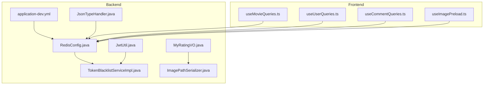
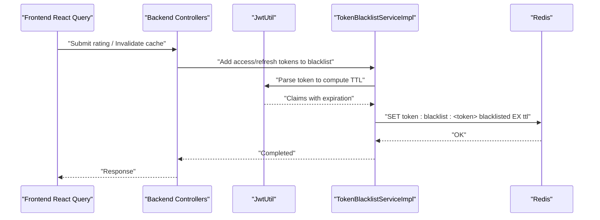
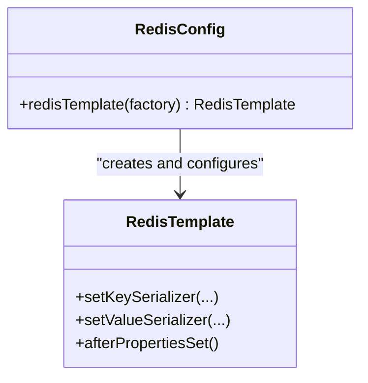
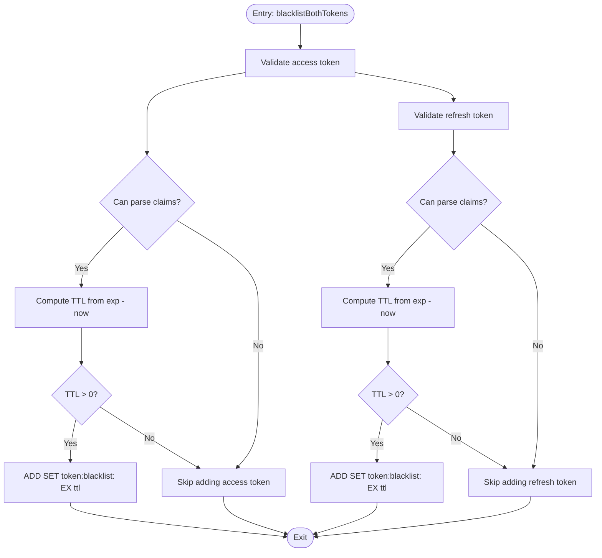
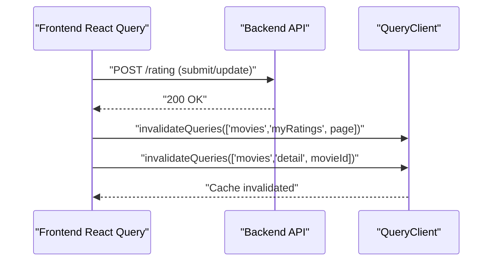
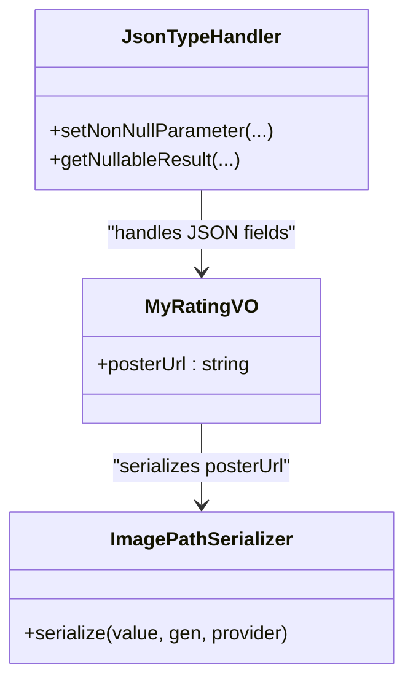
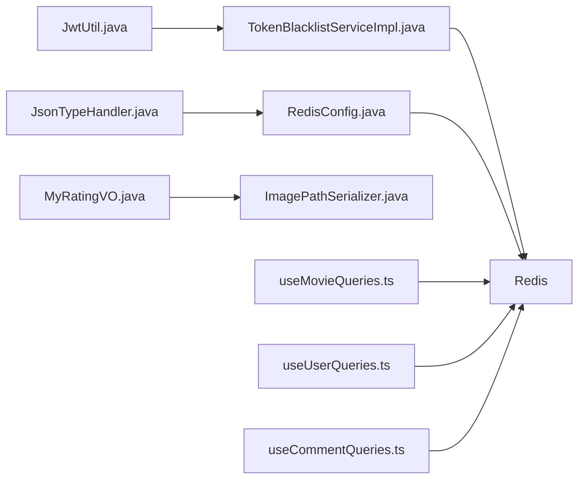

# Caching Strategy

<cite>
**Referenced Files in This Document**
- [RedisConfig.java](file://backend/src/main/java/com/movie/backend/config/RedisConfig.java)
- [TokenBlacklistService.java](file://backend/src/main/java/com/movie/backend/service/TokenBlacklistService.java)
- [TokenBlacklistServiceImpl.java](file://backend/src/main/java/com/movie/backend/service/impl/TokenBlacklistServiceImpl.java)
- [JwtUtil.java](file://backend/src/main/java/com/movie/backend/utils/JwtUtil.java)
- [application-dev.yml](file://backend/src/main/resources/application-dev.yml)
- [useMovieQueries.ts](file://movie-review-web/src/hooks/useMovieQueries.ts)
- [useUserQueries.ts](file://movie-review-web/src/hooks/useUserQueries.ts)
- [useCommentQueries.ts](file://movie-review-web/src/hooks/useCommentQueries.ts)
- [useImagePreload.ts](file://movie-review-web/src/utils/useImagePreload.ts)
- [MyRatingVO.java](file://backend/src/main/java/com/movie/backend/dto/MyRatingVO.java)
- [ImagePathSerializer.java](file://backend/src/main/java/com/movie/backend/config/ImagePathSerializer.java)
- [JsonTypeHandler.java](file://backend/src/main/java/com/movie/backend/config/JsonTypeHandler.java)
- [BackendApplication.java](file://backend/src/main/java/com/movie/backend/BackendApplication.java)
</cite>

## Table of Contents
1. [Introduction](#introduction)
2. [Project Structure](#project-structure)
3. [Core Components](#core-components)
4. [Architecture Overview](#architecture-overview)
5. [Detailed Component Analysis](#detailed-component-analysis)
6. [Dependency Analysis](#dependency-analysis)
7. [Performance Considerations](#performance-considerations)
8. [Troubleshooting Guide](#troubleshooting-guide)
9. [Conclusion](#conclusion)
10. [Appendices](#appendices)

## Introduction
This document details the caching strategy and implementation across the backend and frontend systems. It covers Redis configuration, cache key patterns, expiration policies, cache invalidation strategies, distributed cache considerations, performance optimization, token blacklist caching, JSON serialization handling, and cache warming strategies. It also includes examples of cache implementation, performance monitoring, troubleshooting, consistency, failure handling, and scaling considerations for high-traffic scenarios.

## Project Structure
The caching strategy spans three primary areas:
- Backend Redis configuration and token blacklist service
- Frontend React Query cache keys and invalidation patterns
- JSON serialization and deserialization for cache-friendly payloads

**Diagram sources**
- [RedisConfig.java](file://backend/src/main/java/com/movie/backend/config/RedisConfig.java#L1-L41)
- [TokenBlacklistServiceImpl.java](file://backend/src/main/java/com/movie/backend/service/impl/TokenBlacklistServiceImpl.java#L1-L81)
- [JwtUtil.java](file://backend/src/main/java/com/movie/backend/utils/JwtUtil.java#L1-L179)
- [application-dev.yml](file://backend/src/main/resources/application-dev.yml#L1-L67)
- [MyRatingVO.java](file://backend/src/main/java/com/movie/backend/dto/MyRatingVO.java#L1-L33)
- [ImagePathSerializer.java](file://backend/src/main/java/com/movie/backend/config/ImagePathSerializer.java#L1-L18)
- [JsonTypeHandler.java](file://backend/src/main/java/com/movie/backend/config/JsonTypeHandler.java#L1-L60)
- [useMovieQueries.ts](file://movie-review-web/src/hooks/useMovieQueries.ts#L1-L95)
- [useUserQueries.ts](file://movie-review-web/src/hooks/useUserQueries.ts#L1-L36)
- [useCommentQueries.ts](file://movie-review-web/src/hooks/useCommentQueries.ts#L79-L101)
- [useImagePreload.ts](file://movie-review-web/src/utils/useImagePreload.ts#L1-L49)

**Section sources**
- [RedisConfig.java](file://backend/src/main/java/com/movie/backend/config/RedisConfig.java#L1-L41)
- [application-dev.yml](file://backend/src/main/resources/application-dev.yml#L1-L67)
- [useMovieQueries.ts](file://movie-review-web/src/hooks/useMovieQueries.ts#L1-L95)
- [useUserQueries.ts](file://movie-review-web/src/hooks/useUserQueries.ts#L1-L36)
- [useCommentQueries.ts](file://movie-review-web/src/hooks/useCommentQueries.ts#L79-L101)
- [useImagePreload.ts](file://movie-review-web/src/utils/useImagePreload.ts#L1-L49)

## Core Components
- Redis configuration defines key/value serialization and connection settings.
- Token blacklist service stores revoked tokens with TTL aligned to remaining token validity.
- Frontend uses React Query to manage cache keys and invalidation patterns.
- JSON serialization and MyBatis JSON type handler ensure consistent payload handling.

**Section sources**
- [RedisConfig.java](file://backend/src/main/java/com/movie/backend/config/RedisConfig.java#L17-L40)
- [TokenBlacklistServiceImpl.java](file://backend/src/main/java/com/movie/backend/service/impl/TokenBlacklistServiceImpl.java#L20-L44)
- [useMovieQueries.ts](file://movie-review-web/src/hooks/useMovieQueries.ts#L5-L12)
- [useUserQueries.ts](file://movie-review-web/src/hooks/useUserQueries.ts#L5-L10)
- [useCommentQueries.ts](file://movie-review-web/src/hooks/useCommentQueries.ts#L79-L101)
- [JsonTypeHandler.java](file://backend/src/main/java/com/movie/backend/config/JsonTypeHandler.java#L18-L60)

## Architecture Overview
The caching architecture integrates backend Redis with frontend React Query. Backend services and utilities leverage Redis for short-lived token blacklisting. Frontend queries use deterministic cache keys and explicit invalidation to maintain consistency.

**Diagram sources**
- [TokenBlacklistServiceImpl.java](file://backend/src/main/java/com/movie/backend/service/impl/TokenBlacklistServiceImpl.java#L47-L79)
- [JwtUtil.java](file://backend/src/main/java/com/movie/backend/utils/JwtUtil.java#L87-L93)
- [RedisConfig.java](file://backend/src/main/java/com/movie/backend/config/RedisConfig.java#L18-L40)

## Detailed Component Analysis

### Redis Configuration and Serialization
- Key serializer: StringRedisSerializer for string keys.
- Value serializer: Jackson2JsonRedisSerializer for JSON payloads with polymorphic typing enabled.
- Template is initialized and returned for use across services.

**Diagram sources**
- [RedisConfig.java](file://backend/src/main/java/com/movie/backend/config/RedisConfig.java#L17-L40)

**Section sources**
- [RedisConfig.java](file://backend/src/main/java/com/movie/backend/config/RedisConfig.java#L17-L40)

### Token Blacklist Caching
- Key pattern: token:blacklist:<token>.
- Expiration policy: matches the token’s remaining validity (seconds).
- Operations:
  - addToBlacklist(token, ttl): stores token with TTL.
  - isBlacklisted(token): checks presence of key.
  - blacklistBothTokens(accessToken, refreshToken): computes TTL from claims and invokes addToBlacklist.

**Diagram sources**
- [TokenBlacklistServiceImpl.java](file://backend/src/main/java/com/movie/backend/service/impl/TokenBlacklistServiceImpl.java#L47-L79)
- [JwtUtil.java](file://backend/src/main/java/com/movie/backend/utils/JwtUtil.java#L87-L93)

**Section sources**
- [TokenBlacklistService.java](file://backend/src/main/java/com/movie/backend/service/TokenBlacklistService.java#L7-L29)
- [TokenBlacklistServiceImpl.java](file://backend/src/main/java/com/movie/backend/service/impl/TokenBlacklistServiceImpl.java#L20-L79)
- [JwtUtil.java](file://backend/src/main/java/com/movie/backend/utils/JwtUtil.java#L87-L93)

### Frontend Cache Keys and Invalidation
- Deterministic cache keys for movies, ratings, and user info.
- Explicit invalidation on mutations to ensure consistency.

**Diagram sources**
- [useMovieQueries.ts](file://movie-review-web/src/hooks/useMovieQueries.ts#L54-L68)

**Section sources**
- [useMovieQueries.ts](file://movie-review-web/src/hooks/useMovieQueries.ts#L5-L12)
- [useMovieQueries.ts](file://movie-review-web/src/hooks/useMovieQueries.ts#L54-L68)
- [useUserQueries.ts](file://movie-review-web/src/hooks/useUserQueries.ts#L5-L22)
- [useCommentQueries.ts](file://movie-review-web/src/hooks/useCommentQueries.ts#L79-L101)

### JSON Serialization Handling
- MyRatingVO uses a custom ImagePathSerializer to normalize image URLs.
- MyBatis JsonTypeHandler serializes/deserializes JSON fields for database storage.

**Diagram sources**
- [MyRatingVO.java](file://backend/src/main/java/com/movie/backend/dto/MyRatingVO.java#L21-L23)
- [ImagePathSerializer.java](file://backend/src/main/java/com/movie/backend/config/ImagePathSerializer.java#L13-L17)
- [JsonTypeHandler.java](file://backend/src/main/java/com/movie/backend/config/JsonTypeHandler.java#L18-L60)

**Section sources**
- [MyRatingVO.java](file://backend/src/main/java/com/movie/backend/dto/MyRatingVO.java#L21-L23)
- [ImagePathSerializer.java](file://backend/src/main/java/com/movie/backend/config/ImagePathSerializer.java#L10-L18)
- [JsonTypeHandler.java](file://backend/src/main/java/com/movie/backend/config/JsonTypeHandler.java#L18-L60)

### Cache Warming Strategies
- Frontend image preloading improves perceived performance and leverages browser caching.
- Recommendations:
  - Preload critical images for movie detail and user profile views.
  - Warm frequently accessed lists (latest, top-rated) via initial fetch on app load.

**Section sources**
- [useImagePreload.ts](file://movie-review-web/src/utils/useImagePreload.ts#L34-L39)

## Dependency Analysis
- Backend depends on Redis for token blacklist persistence.
- Frontend depends on backend APIs and React Query cache keys.
- Serialization utilities depend on Jackson and MyBatis type handlers.

**Diagram sources**
- [JwtUtil.java](file://backend/src/main/java/com/movie/backend/utils/JwtUtil.java#L87-L93)
- [TokenBlacklistServiceImpl.java](file://backend/src/main/java/com/movie/backend/service/impl/TokenBlacklistServiceImpl.java#L47-L79)
- [RedisConfig.java](file://backend/src/main/java/com/movie/backend/config/RedisConfig.java#L17-L40)
- [MyRatingVO.java](file://backend/src/main/java/com/movie/backend/dto/MyRatingVO.java#L21-L23)
- [ImagePathSerializer.java](file://backend/src/main/java/com/movie/backend/config/ImagePathSerializer.java#L13-L17)
- [JsonTypeHandler.java](file://backend/src/main/java/com/movie/backend/config/JsonTypeHandler.java#L18-L60)
- [useMovieQueries.ts](file://movie-review-web/src/hooks/useMovieQueries.ts#L1-L95)
- [useUserQueries.ts](file://movie-review-web/src/hooks/useUserQueries.ts#L1-L36)
- [useCommentQueries.ts](file://movie-review-web/src/hooks/useCommentQueries.ts#L79-L101)

**Section sources**
- [BackendApplication.java](file://backend/src/main/java/com/movie/backend/BackendApplication.java#L8-L16)

## Performance Considerations
- Redis serialization: Using JSON with polymorphic typing enables flexible payloads but increases CPU overhead; consider compact DTOs for hot paths.
- Token blacklist TTL: Aligns with token expiry; avoids manual cleanup and reduces maintenance overhead.
- Frontend cache freshness: Use staleTime and refetch intervals judiciously to balance freshness and network usage.
- Image caching: Preload critical images to reduce render-blocking requests and improve LCP.

[No sources needed since this section provides general guidance]

## Troubleshooting Guide
- Token validation failures:
  - Verify JWT secret and expiration settings in configuration.
  - Ensure blacklist key exists and TTL is sufficient.
- Cache invalidation not working:
  - Confirm frontend query keys match backend endpoints and parameters.
  - Check mutation-side effects invalidate correct query keys.
- Serialization errors:
  - Validate JSON fields handled by JsonTypeHandler.
  - Ensure ImagePathSerializer normalizes URLs consistently.

**Section sources**
- [application-dev.yml](file://backend/src/main/resources/application-dev.yml#L62-L67)
- [TokenBlacklistServiceImpl.java](file://backend/src/main/java/com/movie/backend/service/impl/TokenBlacklistServiceImpl.java#L47-L79)
- [useMovieQueries.ts](file://movie-review-web/src/hooks/useMovieQueries.ts#L54-L68)
- [JsonTypeHandler.java](file://backend/src/main/java/com/movie/backend/config/JsonTypeHandler.java#L18-L60)
- [ImagePathSerializer.java](file://backend/src/main/java/com/movie/backend/config/ImagePathSerializer.java#L13-L17)

## Conclusion
The system employs Redis for short-lived token blacklisting and React Query for frontend cache management. Serialization utilities ensure consistent JSON handling across the stack. By aligning TTLs with token lifetimes, using deterministic cache keys, and invalidating on mutations, the system maintains consistency and performance. Scaling considerations include Redis clustering, read replicas, and judicious cache warming strategies.

[No sources needed since this section summarizes without analyzing specific files]

## Appendices

### Redis Configuration Reference
- Host and port configured in environment-specific YAML.
- RedisTemplate configured with string keys and JSON values.

**Section sources**
- [application-dev.yml](file://backend/src/main/resources/application-dev.yml#L26-L32)
- [RedisConfig.java](file://backend/src/main/java/com/movie/backend/config/RedisConfig.java#L17-L40)

### Cache Key Patterns
- Token blacklist: token:blacklist:<token>
- Frontend query keys:
  - Movies: ['movies', ...]
  - Ratings: ['movies','myRatings', page]
  - Details: ['movies','detail', id]
  - Users: ['users','current' | 'public', ...]

**Section sources**
- [TokenBlacklistServiceImpl.java](file://backend/src/main/java/com/movie/backend/service/impl/TokenBlacklistServiceImpl.java#L20-L44)
- [useMovieQueries.ts](file://movie-review-web/src/hooks/useMovieQueries.ts#L5-L12)
- [useUserQueries.ts](file://movie-review-web/src/hooks/useUserQueries.ts#L5-L10)

### Expiration Policies
- Token blacklist TTL equals remaining token validity.
- Frontend staleTime configured for current user info.

**Section sources**
- [TokenBlacklistServiceImpl.java](file://backend/src/main/java/com/movie/backend/service/impl/TokenBlacklistServiceImpl.java#L54-L70)
- [useUserQueries.ts](file://movie-review-web/src/hooks/useUserQueries.ts#L19-L21)