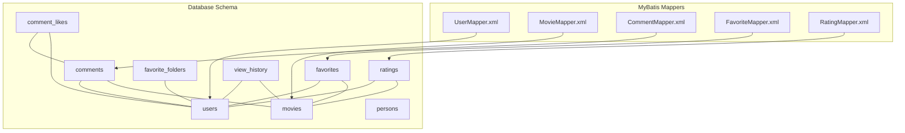
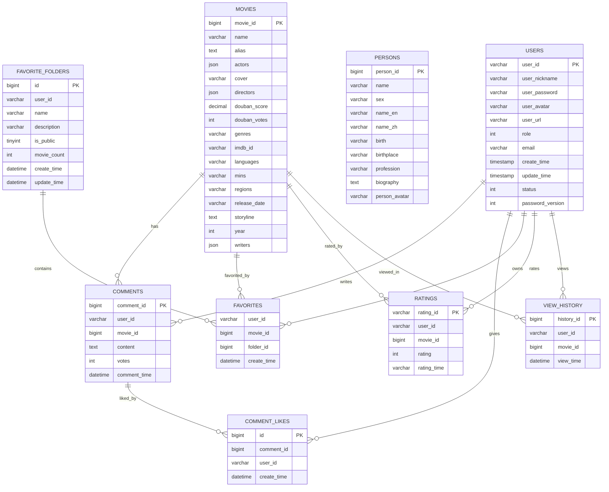
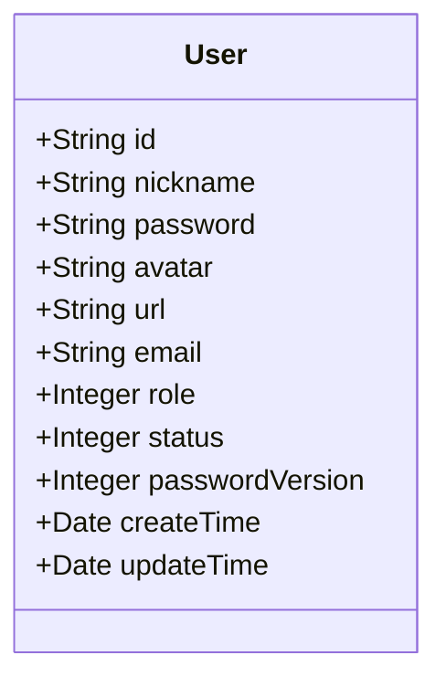
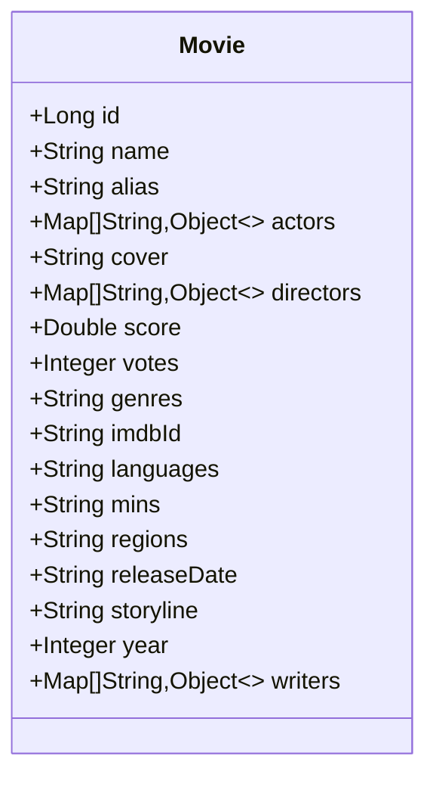
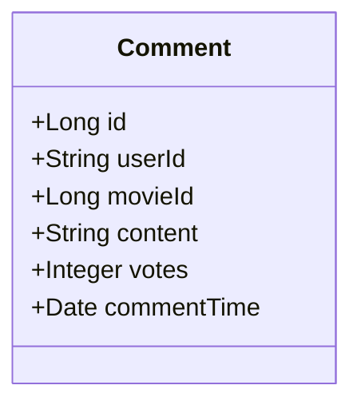
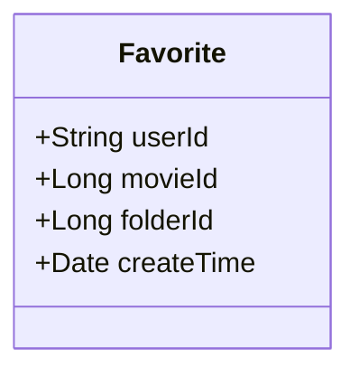
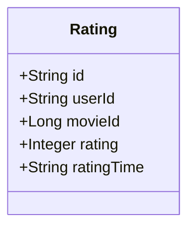
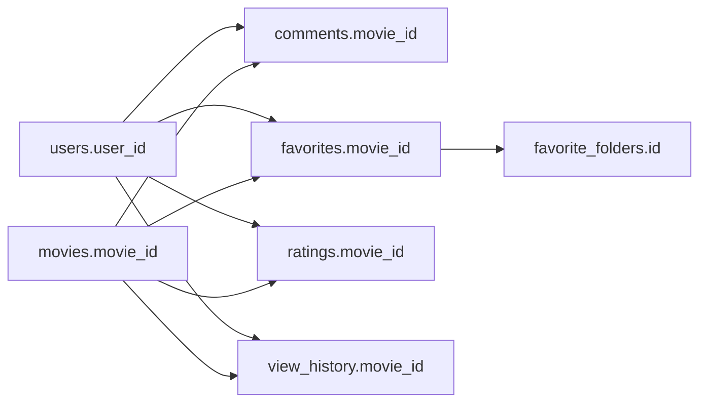

# Data Models & Database

<cite>
**Referenced Files in This Document**
- [movie_db.sql](file://backend/sql/movie_db.sql)
- [add_user_status_and_password_version.sql](file://backend/sql/add_user_status_and_password_version.sql)
- [migrate_favorites_table.sql](file://backend/sql/migrate_favorites_table.sql)
- [fix_favorites_schema.sql](file://backend/sql/fix_favorites_schema.sql)
- [README_FAVORITES_FIX.md](file://backend/sql/README_FAVORITES_FIX.md)
- [UserMapper.xml](file://backend/src/main/resources/mapper/UserMapper.xml)
- [MovieMapper.xml](file://backend/src/main/resources/mapper/MovieMapper.xml)
- [CommentMapper.xml](file://backend/src/main/resources/mapper/CommentMapper.xml)
- [FavoriteMapper.xml](file://backend/src/main/resources/mapper/FavoriteMapper.xml)
- [RatingMapper.xml](file://backend/src/main/resources/mapper/RatingMapper.xml)
- [User.java](file://backend/src/main/java/com/movie/backend/entity/User.java)
- [Movie.java](file://backend/src/main/java/com/movie/backend/entity/Movie.java)
- [Comment.java](file://backend/src/main/java/com/movie/backend/entity/Comment.java)
- [Favorite.java](file://backend/src/main/java/com/movie/backend/entity/Favorite.java)
- [Rating.java](file://backend/src/main/java/com/movie/backend/entity/Rating.java)
</cite>

## Table of Contents
1. [Introduction](#introduction)
2. [Project Structure](#project-structure)
3. [Core Components](#core-components)
4. [Architecture Overview](#architecture-overview)
5. [Detailed Component Analysis](#detailed-component-analysis)
6. [Dependency Analysis](#dependency-analysis)
7. [Performance Considerations](#performance-considerations)
8. [Troubleshooting Guide](#troubleshooting-guide)
9. [Conclusion](#conclusion)
10. [Appendices](#appendices)

## Introduction
This document provides comprehensive data model documentation for the Movie System database schema. It details entity relationships, field definitions, data types, primary/foreign keys, indexes, constraints, and validation rules for core models: User, Movie, Comment, Favorite, Rating, Person, and ViewHistory. It also explains data access patterns via MyBatis mappers, query optimization strategies, transaction management considerations, database schema diagrams, sample data examples, data lifecycle considerations, migration strategies, version management, backup procedures, and data security and privacy requirements at the database level.

## Project Structure
The database schema is defined in SQL DDL scripts and accessed through MyBatis mappers in the backend. Entities are represented as Java POJOs and mapped to relational tables. The key files are:
- DDL schema: [movie_db.sql](file://backend/sql/movie_db.sql)
- User enhancements: [add_user_status_and_password_version.sql](file://backend/sql/add_user_status_and_password_version.sql)
- Favorites migration and fixes: [migrate_favorites_table.sql](file://backend/sql/migrate_favorites_table.sql), [fix_favorites_schema.sql](file://backend/sql/fix_favorites_schema.sql), [README_FAVORITES_FIX.md](file://backend/sql/README_FAVORITES_FIX.md)
- MyBatis mappers: [UserMapper.xml](file://backend/src/main/resources/mapper/UserMapper.xml), [MovieMapper.xml](file://backend/src/main/resources/mapper/MovieMapper.xml), [CommentMapper.xml](file://backend/src/main/resources/mapper/CommentMapper.xml), [FavoriteMapper.xml](file://backend/src/main/resources/mapper/FavoriteMapper.xml), [RatingMapper.xml](file://backend/src/main/resources/mapper/RatingMapper.xml)
- Entities: [User.java](file://backend/src/main/java/com/movie/backend/entity/User.java), [Movie.java](file://backend/src/main/java/com/movie/backend/entity/Movie.java), [Comment.java](file://backend/src/main/java/com/movie/backend/entity/Comment.java), [Favorite.java](file://backend/src/main/java/com/movie/backend/entity/Favorite.java), [Rating.java](file://backend/src/main/java/com/movie/backend/entity/Rating.java)

**Diagram sources**
- [movie_db.sql](file://backend/sql/movie_db.sql#L135-L164)
- [UserMapper.xml](file://backend/src/main/resources/mapper/UserMapper.xml#L1-L62)
- [MovieMapper.xml](file://backend/src/main/resources/mapper/MovieMapper.xml#L1-L193)
- [CommentMapper.xml](file://backend/src/main/resources/mapper/CommentMapper.xml#L1-L104)
- [FavoriteMapper.xml](file://backend/src/main/resources/mapper/FavoriteMapper.xml#L1-L128)
- [RatingMapper.xml](file://backend/src/main/resources/mapper/RatingMapper.xml#L1-L112)

**Section sources**
- [movie_db.sql](file://backend/sql/movie_db.sql#L1-L164)
- [UserMapper.xml](file://backend/src/main/resources/mapper/UserMapper.xml#L1-L62)
- [MovieMapper.xml](file://backend/src/main/resources/mapper/MovieMapper.xml#L1-L193)
- [CommentMapper.xml](file://backend/src/main/resources/mapper/CommentMapper.xml#L1-L104)
- [FavoriteMapper.xml](file://backend/src/main/resources/mapper/FavoriteMapper.xml#L1-L128)
- [RatingMapper.xml](file://backend/src/main/resources/mapper/RatingMapper.xml#L1-L112)

## Core Components
This section documents each core entity, including fields, data types, constraints, and relationships.

- Users
  - Fields: user_id (PK), user_nickname, user_password, user_avatar, user_url, role, email, create_time, update_time, status, password_version
  - Data types: user_id (varchar), timestamps (timestamp), role/status/password_version (int)
  - Constraints: PK on user_id; indexes on status and password_version
  - Notes: status and password_version were added later for account state and token invalidation

- Movies
  - Fields: movie_id (PK), name, alias, actors (JSON), cover, directors (JSON), douban_score (decimal), douban_votes (int), genres, imdb_id, languages, mins, regions, release_date, storyline, year, writers (JSON)
  - Data types: JSON for actors/directors/writers; numeric for score/votes/year
  - Constraints: PK on movie_id

- Persons
  - Fields: person_id (PK), name, sex, name_en, name_zh, birth, birthplace, profession, biography, person_avatar
  - Data types: varchar/text for names/biography; varchar for others
  - Constraints: PK on person_id

- Comments
  - Fields: comment_id (PK), user_id, movie_id, content (text), votes (int), comment_time (datetime)
  - Data types: bigint for IDs; text for content; datetime for timestamps
  - Constraints: PK on comment_id; foreign keys implied by application logic (referenced below)

- Comment Likes
  - Fields: id (PK), comment_id, user_id, create_time (datetime)
  - Data types: bigint for IDs; datetime
  - Constraints: PK on id; unique index on (comment_id, user_id)

- Favorites
  - Fields: user_id, movie_id, folder_id, create_time (datetime)
  - Data types: varchar for user_id; bigint for movie_id/folder_id; datetime
  - Constraints: composite PK on (user_id, movie_id); unique index on (user_id, movie_id, folder_id); indexes on folder_id
  - Notes: Schema was migrated to support multiple folders per movie; folder_id defaults to 0 representing default folder

- Favorite Folders
  - Fields: id (PK), user_id, name, description, is_public (tinyint), movie_count, create_time, update_time
  - Data types: bigint for id; tinyint for is_public; ints for counts
  - Constraints: PK on id; index on user_id

- Ratings
  - Fields: rating_id (PK), user_id, movie_id, rating (int), rating_time (varchar)
  - Data types: varchar for rating_id; int for rating; varchar for timestamp
  - Constraints: PK on rating_id

- View History
  - Fields: history_id (PK), user_id, movie_id, view_time (datetime)
  - Data types: bigint for IDs; datetime
  - Constraints: PK on history_id

**Section sources**
- [movie_db.sql](file://backend/sql/movie_db.sql#L135-L164)
- [add_user_status_and_password_version.sql](file://backend/sql/add_user_status_and_password_version.sql#L1-L16)
- [fix_favorites_schema.sql](file://backend/sql/fix_favorites_schema.sql#L1-L60)
- [README_FAVORITES_FIX.md](file://backend/sql/README_FAVORITES_FIX.md#L1-L225)

## Architecture Overview
The data model follows a star-like schema centered around movies and users, with supporting entities for comments, ratings, favorites, and view history. MyBatis mappers define CRUD operations and queries, while entities encapsulate domain data.

**Diagram sources**
- [movie_db.sql](file://backend/sql/movie_db.sql#L135-L164)

## Detailed Component Analysis

### Users
- Purpose: Store user profiles, roles, authentication credentials, and metadata.
- Key fields: user_id (PK), role, email, status, password_version.
- Access patterns: select by id/email, insert/update/delete, list with keyword filter.
- Validation: role/status/password_version provide access control and token invalidation signals.

**Diagram sources**
- [User.java](file://backend/src/main/java/com/movie/backend/entity/User.java#L1-L46)

**Section sources**
- [User.java](file://backend/src/main/java/com/movie/backend/entity/User.java#L1-L46)
- [UserMapper.xml](file://backend/src/main/resources/mapper/UserMapper.xml#L1-L62)
- [add_user_status_and_password_version.sql](file://backend/sql/add_user_status_and_password_version.sql#L1-L16)

### Movies
- Purpose: Store movie metadata, including cast/crew as JSON, ratings, and auxiliary info.
- Key fields: movie_id (PK), actors/directors/writers (JSON), douban_score/votes, year, genres.
- Access patterns: search by keyword/genre/score/year/region; hot/recommended/latest queries; update score.

**Diagram sources**
- [Movie.java](file://backend/src/main/java/com/movie/backend/entity/Movie.java#L1-L65)

**Section sources**
- [Movie.java](file://backend/src/main/java/com/movie/backend/entity/Movie.java#L1-L65)
- [MovieMapper.xml](file://backend/src/main/resources/mapper/MovieMapper.xml#L1-L193)

### Comments
- Purpose: Store user-generated reviews and likes.
- Key fields: comment_id (PK), user_id, movie_id, content, votes, comment_time.
- Access patterns: list by movie/user, update by user+movie, increment votes, fetch enriched view with user/rating/like status.

**Diagram sources**
- [Comment.java](file://backend/src/main/java/com/movie/backend/entity/Comment.java#L1-L28)

**Section sources**
- [Comment.java](file://backend/src/main/java/com/movie/backend/entity/Comment.java#L1-L28)
- [CommentMapper.xml](file://backend/src/main/resources/mapper/CommentMapper.xml#L1-L104)

### Favorites
- Purpose: Track user movie collections across optional folders.
- Key fields: user_id, movie_id, folder_id, create_time.
- Schema evolution: migrated to composite PK (user_id, movie_id, folder_id) and default folder_id 0 for “default” folder.
- Access patterns: insert/delete by user+movie, batch delete, list by user/folder, join with movies for VO.

**Diagram sources**
- [Favorite.java](file://backend/src/main/java/com/movie/backend/entity/Favorite.java#L1-L21)

**Section sources**
- [Favorite.java](file://backend/src/main/java/com/movie/backend/entity/Favorite.java#L1-L21)
- [FavoriteMapper.xml](file://backend/src/main/resources/mapper/FavoriteMapper.xml#L1-L128)
- [fix_favorites_schema.sql](file://backend/sql/fix_favorites_schema.sql#L1-L60)
- [README_FAVORITES_FIX.md](file://backend/sql/README_FAVORITES_FIX.md#L1-L225)

### Ratings
- Purpose: Store user ratings per movie with composite key rating_id = user_id_movie_id.
- Key fields: rating_id (PK), user_id, movie_id, rating (10–50), rating_time.
- Access patterns: upsert by user+movie, list by user, batch delete, compute movie scores via weighted average.

**Diagram sources**
- [Rating.java](file://backend/src/main/java/com/movie/backend/entity/Rating.java#L1-L24)

**Section sources**
- [Rating.java](file://backend/src/main/java/com/movie/backend/entity/Rating.java#L1-L24)
- [RatingMapper.xml](file://backend/src/main/resources/mapper/RatingMapper.xml#L1-L112)

### Persons
- Purpose: Store biographical details for cast/crew.
- Key fields: person_id (PK), name, sex, name_en/name_zh, birth, birthplace, profession, biography, person_avatar.
- Access patterns: lookup by name, integrate with movies’ JSON arrays.

**Section sources**
- [movie_db.sql](file://backend/sql/movie_db.sql#L104-L119)

### ViewHistory
- Purpose: Track user browsing history for analytics and recommendations.
- Key fields: history_id (PK), user_id, movie_id, view_time.
- Access patterns: insert on view, list by user/date.

**Section sources**
- [movie_db.sql](file://backend/sql/movie_db.sql#L151-L161)

## Dependency Analysis
- Primary keys: users.user_id, movies.movie_id, persons.person_id, comments.comment_id, comment_likes.id, ratings.rating_id, view_history.history_id.
- Composite keys: favorites(user_id, movie_id, folder_id).
- Unique constraints: favorites.uk_user_movie_folder; comment_likes.uk_comment_user.
- Indexes: users.idx_status, users.idx_password_version; favorites.idx_folder_id; favorite_folders.idx_user_id.
- Relationships: comments.user_id→users.user_id; comments.movie_id→movies.movie_id; favorites.user_id→users.user_id; favorites.movie_id→movies.movie_id; ratings.user_id→users.user_id; ratings.movie_id→movies.movie_id; view_history.user_id→users.user_id; view_history.movie_id→movies.movie_id.

**Diagram sources**
- [movie_db.sql](file://backend/sql/movie_db.sql#L135-L164)

**Section sources**
- [movie_db.sql](file://backend/sql/movie_db.sql#L135-L164)

## Performance Considerations
- Indexes: Ensure efficient filtering and joins on frequently queried columns (e.g., users.status, users.password_version, favorites.folder_id, favorite_folders.user_id).
- JSON fields: Actors/directors/writers are stored as JSON; avoid excessive parsing in hot paths; consider denormalization if needed.
- Batch operations: Favor batch deletes/inserts for favorites and ratings to reduce round trips.
- Sorting: Use appropriate ORDER BY clauses with indexed columns (e.g., movies by douban_votes, year).
- Upserts: Ratings use ON DUPLICATE KEY UPDATE; ensure unique constraints are respected to avoid unnecessary updates.
- Query optimization: Prefer selective projections and limit clauses for recommendation and pagination-heavy queries.

[No sources needed since this section provides general guidance]

## Troubleshooting Guide
- Favorites duplicates or incorrect moves:
  - Symptom: Adding a movie to another folder appears to move it instead of copying.
  - Cause: Original schema used (user_id, movie_id) as PK; ON DUPLICATE KEY UPDATE altered records.
  - Fix: Apply [fix_favorites_schema.sql](file://backend/sql/fix_favorites_schema.sql#L1-L60) and update application logic to use folder_id=0 for default folder.
  - Verification: Compare record counts and folder_id conversions post-migration.

- Favorites batch operations:
  - Use [FavoriteMapper.xml](file://backend/src/main/resources/mapper/FavoriteMapper.xml#L14-L21) batch delete operations to remove multiple entries efficiently.

- Ratings score recalculation:
  - Use [RatingMapper.xml](file://backend/src/main/resources/mapper/RatingMapper.xml#L82-L110) to recompute movie scores after user rating changes.

- User status/token invalidation:
  - Add status/password_version to users via [add_user_status_and_password_version.sql](file://backend/sql/add_user_status_and_password_version.sql#L1-L16) and index them for fast lookup.

**Section sources**
- [README_FAVORITES_FIX.md](file://backend/sql/README_FAVORITES_FIX.md#L1-L225)
- [fix_favorites_schema.sql](file://backend/sql/fix_favorites_schema.sql#L1-L60)
- [FavoriteMapper.xml](file://backend/src/main/resources/mapper/FavoriteMapper.xml#L14-L21)
- [RatingMapper.xml](file://backend/src/main/resources/mapper/RatingMapper.xml#L82-L110)
- [add_user_status_and_password_version.sql](file://backend/sql/add_user_status_and_password_version.sql#L1-L16)

## Conclusion
The Movie System database schema supports a rich movie-centric platform with robust user interactions. The schema emphasizes flexibility (JSON fields), scalability (indexes and batch operations), and correctness (composite keys and unique constraints). MyBatis mappers encapsulate CRUD and analytical queries, enabling efficient data access patterns. Recent migrations (notably favorites) demonstrate proactive schema evolution to meet functional requirements. Adhering to indexing, upsert strategies, and batch operations ensures optimal performance. Security and privacy are addressed at the application level (password hashing, JWT, role-based access), while database-level controls (indexes, constraints) maintain data integrity.

[No sources needed since this section summarizes without analyzing specific files]

## Appendices

### Sample Data Examples
- Users
  - Example row: user_id, user_nickname, user_password, user_avatar, user_url, role, email, create_time, update_time, status, password_version
- Movies
  - Example row: movie_id, name, alias, actors JSON, cover, directors JSON, douban_score, douban_votes, genres, imdb_id, languages, mins, regions, release_date, storyline, year, writers JSON
- Comments
  - Example row: comment_id, user_id, movie_id, content, votes, comment_time
- Favorites
  - Example rows: (user_id, movie_id, folder_id=0, create_time) for default folder; (user_id, movie_id, folder_id=N, create_time) for custom folder
- Ratings
  - Example row: rating_id=user_id_movie_id, user_id, movie_id, rating, rating_time
- Persons
  - Example row: person_id, name, sex, name_en, name_zh, birth, birthplace, profession, biography, person_avatar
- ViewHistory
  - Example row: history_id, user_id, movie_id, view_time

**Section sources**
- [movie_db.sql](file://backend/sql/movie_db.sql#L135-L164)
- [User.java](file://backend/src/main/java/com/movie/backend/entity/User.java#L1-L46)
- [Movie.java](file://backend/src/main/java/com/movie/backend/entity/Movie.java#L1-L65)
- [Comment.java](file://backend/src/main/java/com/movie/backend/entity/Comment.java#L1-L28)
- [Favorite.java](file://backend/src/main/java/com/movie/backend/entity/Favorite.java#L1-L21)
- [Rating.java](file://backend/src/main/java/com/movie/backend/entity/Rating.java#L1-L24)

### Data Lifecycle Considerations
- Creation: Insert users, movies, persons; create comments and ratings; add favorites to default or custom folders.
- Updates: Update user profile, movie metadata, comment content, rating value; refresh movie scores via ratings aggregation.
- Deletion: Remove comments, ratings, favorites (single or batch), user data; manage orphaned records carefully.
- Archival/Retention: Consider purging old view history and inactive user data per policy.

[No sources needed since this section provides general guidance]

### Migration Strategies and Version Management
- Favorites migration:
  - Backup original table, drop and recreate with composite PK and default folder_id=0, restore data, validate counts, and deploy application changes.
  - Reference: [migrate_favorites_table.sql](file://backend/sql/migrate_favorites_table.sql#L1-L52), [fix_favorites_schema.sql](file://backend/sql/fix_favorites_schema.sql#L1-L60), [README_FAVORITES_FIX.md](file://backend/sql/README_FAVORITES_FIX.md#L1-L225)
- User enhancements:
  - Add status and password_version columns, set defaults, and create indexes.
  - Reference: [add_user_status_and_password_version.sql](file://backend/sql/add_user_status_and_password_version.sql#L1-L16)
- Version control:
  - Keep migration scripts under source control; document steps, verification checks, and rollback plans.

**Section sources**
- [migrate_favorites_table.sql](file://backend/sql/migrate_favorites_table.sql#L1-L52)
- [fix_favorites_schema.sql](file://backend/sql/fix_favorites_schema.sql#L1-L60)
- [README_FAVORITES_FIX.md](file://backend/sql/README_FAVORITES_FIX.md#L1-L225)
- [add_user_status_and_password_version.sql](file://backend/sql/add_user_status_and_password_version.sql#L1-L16)

### Backup Procedures
- Pre-migration backups:
  - Use logical dumps (mysqldump) before applying schema changes.
  - Reference: [README_FAVORITES_FIX.md](file://backend/sql/README_FAVORITES_FIX.md#L130-L138)
- Post-verification:
  - Confirm record counts and folder_id conversions; keep backup tables until verified.

**Section sources**
- [README_FAVORITES_FIX.md](file://backend/sql/README_FAVORITES_FIX.md#L130-L156)

### Data Security and Privacy
- Authentication and authorization:
  - Password hashing and JWT-based session management are handled at the application layer; database stores hashed passwords and enforces role-based access via user roles.
- Data exposure:
  - Sensitive fields (passwords) are annotated as hidden in entity schemas; ensure mappers exclude sensitive fields in public APIs.
- Access control:
  - Enforce row-level access control in queries (e.g., restrict comments/ratings by user_id) and leverage user roles for administrative actions.

**Section sources**
- [User.java](file://backend/src/main/java/com/movie/backend/entity/User.java#L18-L19)
- [UserMapper.xml](file://backend/src/main/resources/mapper/UserMapper.xml#L26-L28)