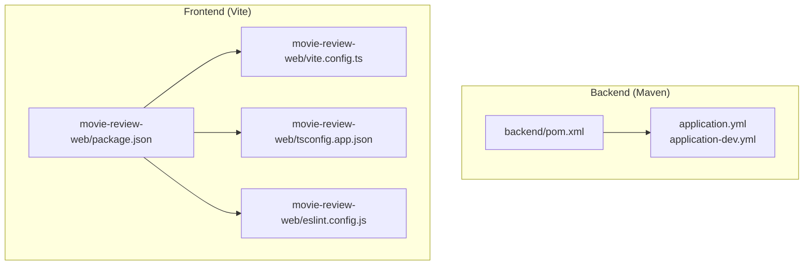
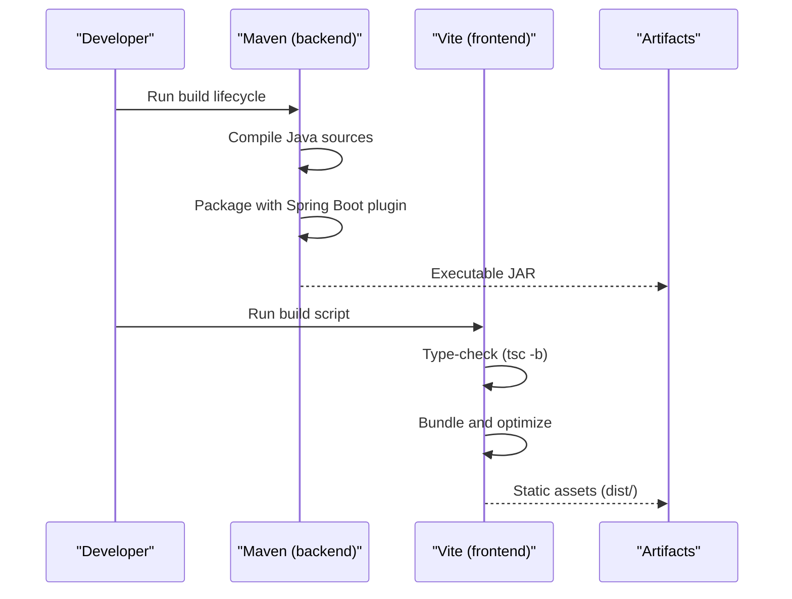
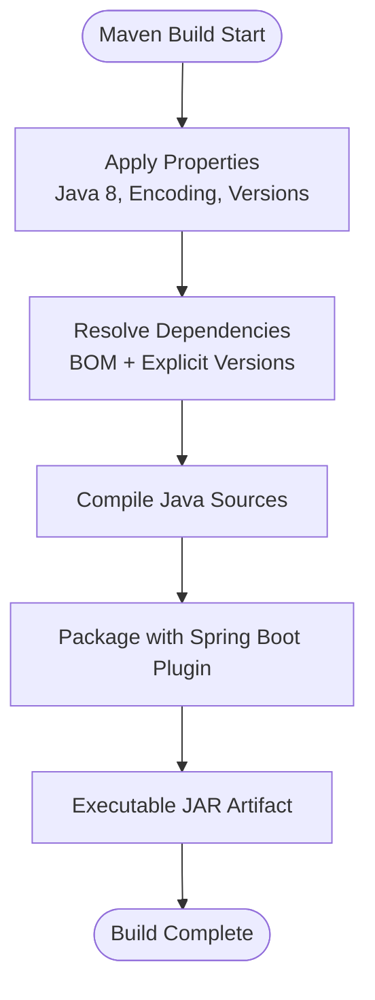
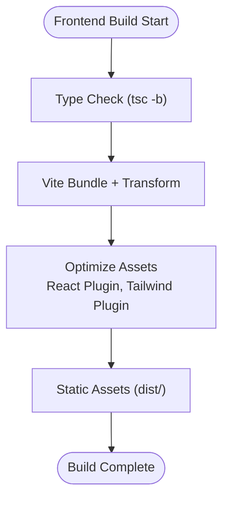
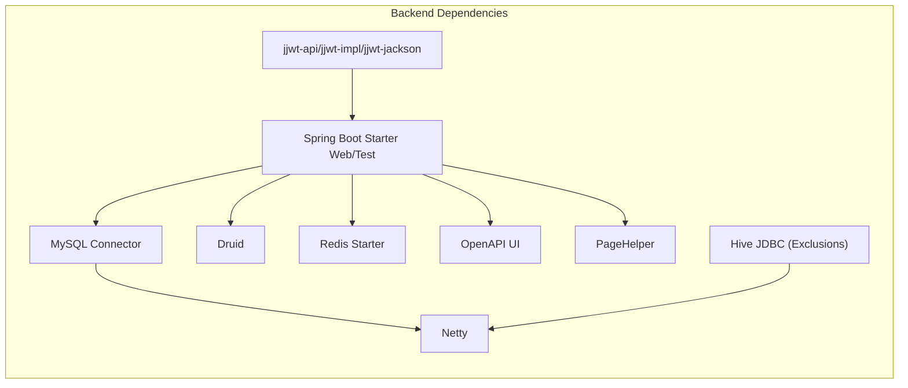

# Build Configuration

<cite>
**Referenced Files in This Document**
- [pom.xml](file://backend/pom.xml)
- [HELP.md](file://backend/HELP.md)
- [application.yml](file://backend/src/main/resources/application.yml)
- [application-dev.yml](file://backend/src/main/resources/application-dev.yml)
- [vite.config.ts](file://movie-review-web/vite.config.ts)
- [package.json](file://movie-review-web/package.json)
- [tsconfig.app.json](file://movie-review-web/tsconfig.app.json)
- [tsconfig.json](file://movie-review-web/tsconfig.json)
- [eslint.config.js](file://movie-review-web/eslint.config.js)
- [README.md](file://movie-review-web/README.md)
</cite>

## Table of Contents
1. [Introduction](#introduction)
2. [Project Structure](#project-structure)
3. [Core Components](#core-components)
4. [Architecture Overview](#architecture-overview)
5. [Detailed Component Analysis](#detailed-component-analysis)
6. [Dependency Analysis](#dependency-analysis)
7. [Performance Considerations](#performance-considerations)
8. [Troubleshooting Guide](#troubleshooting-guide)
9. [Conclusion](#conclusion)
10. [Appendices](#appendices)

## Introduction
This document explains the build configuration for both the backend Java/Spring Boot application and the frontend React/Vite application. It covers Maven dependencies and plugins, environment-specific configuration, Vite bundling and optimization, TypeScript configuration, linting, and practical build commands. It also provides guidance on build caching, incremental builds, and continuous integration setup.

## Project Structure
The repository contains two distinct build systems:
- Backend: Maven-based build with Spring Boot plugin and dependency management.
- Frontend: Vite-based build with React and TypeScript, plus Tailwind CSS integration.

**Diagram sources**
- [pom.xml](file://backend/pom.xml#L1-L300)
- [application.yml](file://backend/src/main/resources/application.yml#L1-L4)
- [application-dev.yml](file://backend/src/main/resources/application-dev.yml#L1-L67)
- [package.json](file://movie-review-web/package.json#L1-L42)
- [vite.config.ts](file://movie-review-web/vite.config.ts#L1-L11)
- [tsconfig.app.json](file://movie-review-web/tsconfig.app.json#L1-L29)
- [eslint.config.js](file://movie-review-web/eslint.config.js#L1-L24)

**Section sources**
- [pom.xml](file://backend/pom.xml#L1-L300)
- [application.yml](file://backend/src/main/resources/application.yml#L1-L4)
- [application-dev.yml](file://backend/src/main/resources/application-dev.yml#L1-L67)
- [package.json](file://movie-review-web/package.json#L1-L42)
- [vite.config.ts](file://movie-review-web/vite.config.ts#L1-L11)
- [tsconfig.app.json](file://movie-review-web/tsconfig.app.json#L1-L29)
- [eslint.config.js](file://movie-review-web/eslint.config.js#L1-L24)

## Core Components
- Backend Maven build
  - Properties: Java version, encoding, Spring Boot version, JWT version.
  - Dependencies: Spring Boot starters, MyBatis, MySQL driver, Druid, Redis, OpenAPI/Swagger, Hive JDBC, JWT, validation, PageHelper, Netty.
  - Dependency management: Spring Boot BOM and explicit Netty version alignment.
  - Plugins: maven-compiler-plugin and spring-boot-maven-plugin (configured with main class and disabled by default).
- Frontend Vite build
  - Scripts: dev, build, lint, preview.
  - Plugins: @vitejs/plugin-react and @tailwindcss/vite.
  - TypeScript: tsconfig.app.json with bundler mode and strict checks; tsconfig.json aggregates app and node configs.
  - Linting: ESLint flat config with recommended rulesets and React-specific plugins.

**Section sources**
- [pom.xml](file://backend/pom.xml#L10-L297)
- [package.json](file://movie-review-web/package.json#L6-L11)
- [vite.config.ts](file://movie-review-web/vite.config.ts#L6-L11)
- [tsconfig.app.json](file://movie-review-web/tsconfig.app.json#L1-L29)
- [tsconfig.json](file://movie-review-web/tsconfig.json#L1-L8)
- [eslint.config.js](file://movie-review-web/eslint.config.js#L8-L23)

## Architecture Overview
The build pipeline separates concerns between backend and frontend:
- Backend compiles Java sources, packages dependencies via Spring Boot plugin, and produces an executable artifact.
- Frontend compiles TypeScript/JSX, bundles with Vite, optimizes assets, and generates static assets for deployment.

**Diagram sources**
- [pom.xml](file://backend/pom.xml#L267-L297)
- [package.json](file://movie-review-web/package.json#L8-L8)
- [tsconfig.app.json](file://movie-review-web/tsconfig.app.json#L3-L3)

## Detailed Component Analysis

### Backend Maven Build Configuration
- Properties and versions
  - Java 8 source/target and UTF-8 encoding.
  - Spring Boot 2.7.6 managed via BOM.
  - JWT library version 0.11.5.
- Dependencies
  - Web, Test, Lombok, MyBatis, MySQL driver, Validation, Druid, Redis, OpenAPI/Swagger, Hive JDBC (with extensive exclusions), JWT, PageHelper, Netty.
  - Exclusions resolve conflicts with logging frameworks, servlet/Jetty, vulnerable transitive dependencies, and Netty variants.
- Dependency management
  - Spring Boot BOM imported for version alignment.
  - Netty explicitly pinned to a specific version to avoid conflicts.
- Plugins
  - maven-compiler-plugin configured for Java 8 and UTF-8.
  - spring-boot-maven-plugin configured with main class and disabled by default; repackage goal is defined but skip is true.

Environment-specific configuration
- Active profile set to dev.
- Dev profile defines server port, Tomcat tuning, MySQL datasource, Redis, multipart limits, custom Hive datasource, MyBatis mapper locations, logging levels, file upload path and domain, and JWT settings.

Build commands and artifacts
- Typical Maven lifecycle goals: compile, package, verify, install, deploy.
- Spring Boot plugin repackage goal produces an executable JAR artifact.
- See plugin reference guide for advanced options.

**Section sources**
- [pom.xml](file://backend/pom.xml#L10-L265)
- [pom.xml](file://backend/pom.xml#L267-L297)
- [application.yml](file://backend/src/main/resources/application.yml#L1-L4)
- [application-dev.yml](file://backend/src/main/resources/application-dev.yml#L1-L67)
- [HELP.md](file://backend/HELP.md#L7-L9)

#### Backend Build Flow

**Diagram sources**
- [pom.xml](file://backend/pom.xml#L10-L297)

### Frontend Vite Build Configuration
- Scripts
  - dev: starts Vite dev server.
  - build: runs type-check in build mode then Vite build.
  - lint: runs ESLint.
  - preview: serves built assets locally.
- Plugins
  - @vitejs/plugin-react enables JSX transform and fast refresh.
  - @tailwindcss/vite integrates Tailwind utilities during build.
- TypeScript configuration
  - tsconfig.app.json sets bundler mode, module resolution, JSX transform, strictness, and tsBuildInfoFile for incremental builds.
  - tsconfig.json references app and node configs.
- Linting
  - ESLint flat config extends recommended sets for JS/TS, React Hooks, and React Refresh, with browser globals.

Build commands and artifacts
- npm/yarn/pnpm run build produces optimized static assets under the Vite default output directory.
- Preview command serves the dist folder for local testing.

**Section sources**
- [package.json](file://movie-review-web/package.json#L6-L11)
- [vite.config.ts](file://movie-review-web/vite.config.ts#L6-L11)
- [tsconfig.app.json](file://movie-review-web/tsconfig.app.json#L1-L29)
- [tsconfig.json](file://movie-review-web/tsconfig.json#L1-L8)
- [eslint.config.js](file://movie-review-web/eslint.config.js#L8-L23)
- [README.md](file://movie-review-web/README.md#L10-L12)

#### Frontend Build Flow

**Diagram sources**
- [package.json](file://movie-review-web/package.json#L8-L8)
- [vite.config.ts](file://movie-review-web/vite.config.ts#L7-L10)
- [tsconfig.app.json](file://movie-review-web/tsconfig.app.json#L3-L3)

### Environment-Specific Configuration
- Backend
  - Active profile: dev.
  - Dev profile includes server tuning, MySQL datasource, Redis, multipart limits, custom Hive datasource, MyBatis mapper locations, logging levels, file upload path/domain, and JWT configuration.
- Frontend
  - No environment files are present in the provided configuration; environment variables can be injected via Vite’s env prefix and .env files if added.

**Section sources**
- [application.yml](file://backend/src/main/resources/application.yml#L1-L4)
- [application-dev.yml](file://backend/src/main/resources/application-dev.yml#L1-L67)

## Dependency Analysis
Backend dependency relationships and management:
- Spring Boot BOM centralizes versions for Spring ecosystem libraries.
- Explicit versions override BOM for selected libraries (e.g., Netty).
- Hive JDBC requires extensive exclusions to avoid conflicting transitive dependencies.

Frontend dependency relationships:
- package.json lists runtime and dev dependencies, including React, Vite, TypeScript, Tailwind CSS, and ESLint tooling.
- Vite config composes React and Tailwind plugins.

**Diagram sources**
- [pom.xml](file://backend/pom.xml#L17-L248)

**Section sources**
- [pom.xml](file://backend/pom.xml#L249-L265)
- [pom.xml](file://backend/pom.xml#L77-L175)

## Performance Considerations
- Backend
  - Incremental compilation: Maven uses bytecode reuse by default; ensure consistent Java version across environments.
  - Spring Boot plugin disabled by default: enable repackage only when building distribution artifacts.
  - Netty version pinning avoids runtime conflicts and ensures predictable performance.
- Frontend
  - tsconfig.app.json uses bundler mode and tsBuildInfoFile for incremental TS builds.
  - Vite’s dev server leverages native ES modules and fast refresh; production build performs tree-shaking and minification.
  - Tailwind plugin processes styles during build; ensure purge/content globs are tuned to avoid unnecessary CSS in production.

[No sources needed since this section provides general guidance]

## Troubleshooting Guide
- Backend
  - Java version mismatch: ensure JDK 8 matches project properties.
  - Conflicting dependencies: review Hive JDBC exclusions and Netty overrides.
  - Spring Boot plugin not running: note that skip is true; adjust configuration or pass appropriate Maven arguments when needed.
- Frontend
  - Vite dev server fails to start: verify Node.js and package installation; check plugin compatibility.
  - Tailwind utilities missing: confirm Tailwind plugin is included and content paths match source files.
  - ESLint errors: align lint configuration with project’s TS/React setup and resolve type-aware rule mismatches.

**Section sources**
- [pom.xml](file://backend/pom.xml#L273-L286)
- [pom.xml](file://backend/pom.xml#L258-L263)
- [vite.config.ts](file://movie-review-web/vite.config.ts#L7-L10)
- [eslint.config.js](file://movie-review-web/eslint.config.js#L8-L23)

## Conclusion
The backend relies on Maven with Spring Boot plugin and explicit dependency management to produce a reproducible JAR artifact. The frontend uses Vite with React and TypeScript for efficient bundling and development. Environment-specific configuration is centralized in YAML for the backend and can be extended for the frontend via Vite env handling. Following the build commands and optimization tips outlined here will streamline local development and CI pipelines.

[No sources needed since this section summarizes without analyzing specific files]

## Appendices

### Practical Build Commands
- Backend (Maven)
  - Compile: mvn compile
  - Package: mvn package
  - Install: mvn install
  - Rebuild (clean): mvn clean package
  - Spring Boot repackage: mvn spring-boot:repackage
- Frontend (Vite)
  - Develop: npm run dev
  - Build: npm run build
  - Preview: npm run preview
  - Lint: npm run lint

**Section sources**
- [pom.xml](file://backend/pom.xml#L287-L294)
- [package.json](file://movie-review-web/package.json#L6-L11)

### Build Caching and Incremental Builds
- Backend
  - Maven default incremental behavior; consistent JDK and dependency versions improve cache hits.
- Frontend
  - tsconfig.app.json includes tsBuildInfoFile for incremental TS builds.
  - Vite caches transformed modules in dev mode and optimizes assets in production.

**Section sources**
- [tsconfig.app.json](file://movie-review-web/tsconfig.app.json#L3-L3)

### Continuous Integration Setup
- Backend
  - Use Maven wrapper or pinned Maven version; run mvn verify in CI to enforce tests and checks.
  - Consider enabling spring-boot:build-image for containerized deployments.
- Frontend
  - Use Node.js LTS; run npm ci, npm run build, and npm run lint in CI.
  - Cache node_modules and Vite/TypeScript build caches for faster pipelines.

**Section sources**
- [HELP.md](file://backend/HELP.md#L9-L9)
- [README.md](file://movie-review-web/README.md#L10-L12)