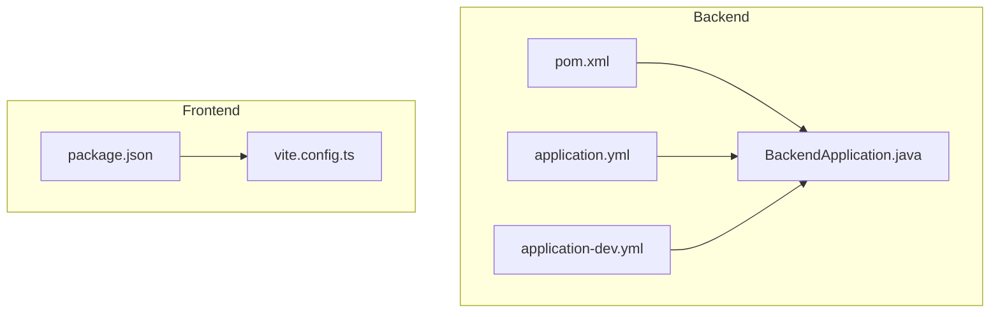
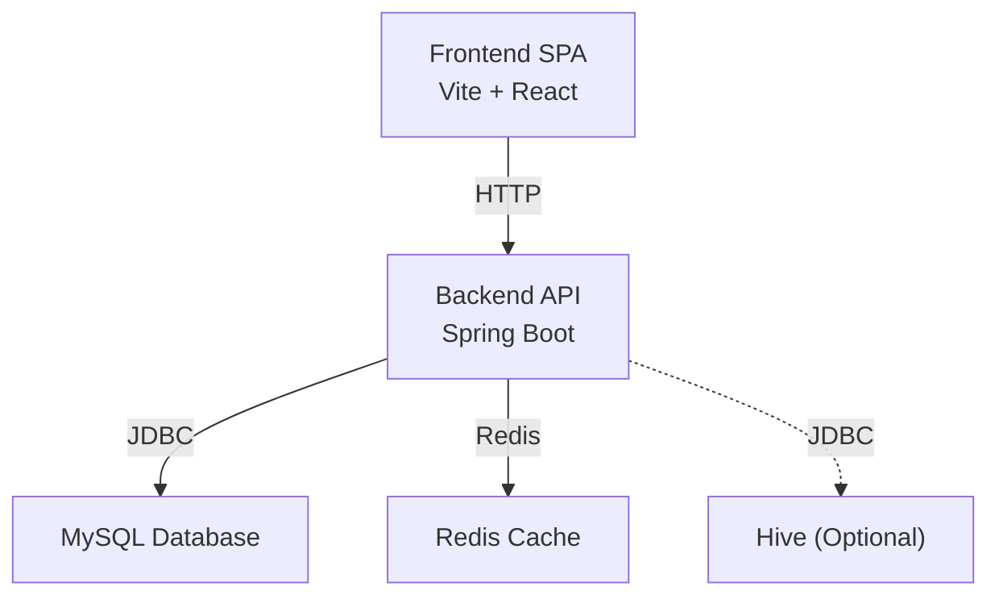
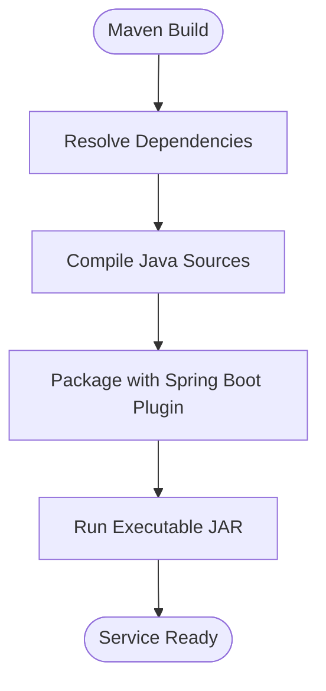
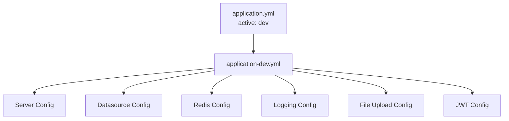
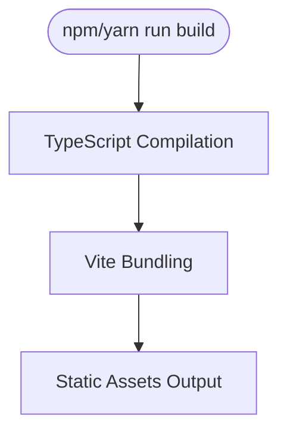
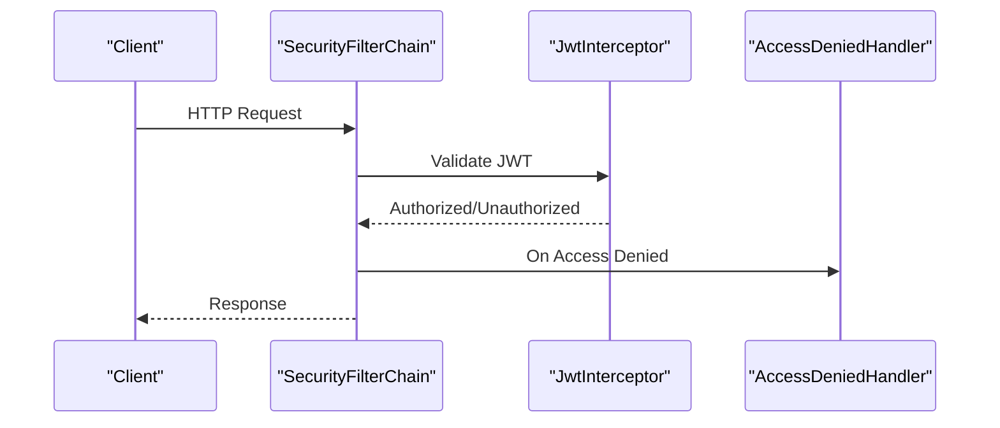
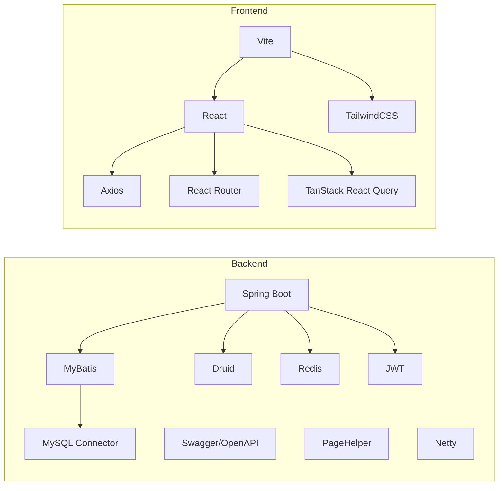

# Deployment & DevOps

<cite>
**Referenced Files in This Document**
- [pom.xml](file://backend/pom.xml)
- [application.yml](file://backend/src/main/resources/application.yml)
- [application-dev.yml](file://backend/src/main/resources/application-dev.yml)
- [BackendApplication.java](file://backend/src/main/java/com/movie/backend/BackendApplication.java)
- [SecurityConfig.java](file://backend/src/main/java/com/movie/backend/config/SecurityConfig.java)
- [package.json](file://movie-review-web/package.json)
- [vite.config.ts](file://movie-review-web/vite.config.ts)
</cite>

## Table of Contents
1. [Introduction](#introduction)
2. [Project Structure](#project-structure)
3. [Core Components](#core-components)
4. [Architecture Overview](#architecture-overview)
5. [Detailed Component Analysis](#detailed-component-analysis)
6. [Dependency Analysis](#dependency-analysis)
7. [Performance Considerations](#performance-considerations)
8. [Troubleshooting Guide](#troubleshooting-guide)
9. [Conclusion](#conclusion)
10. [Appendices](#appendices)

## Introduction
This document provides comprehensive deployment and DevOps guidance for the Movie System project. It covers build configuration for both backend and frontend, environment variable management, deployment pipeline setup, production deployment strategies, containerization options, infrastructure requirements, CI/CD pipeline configuration, automated testing integration, release management, monitoring, rollback procedures, performance monitoring, troubleshooting, security considerations, and scaling strategies.

## Project Structure
The project consists of two primary components:
- Backend: A Spring Boot application built with Maven, configured via YAML profiles.
- Frontend: A React application built with Vite and TypeScript.

**Diagram sources**
- [BackendApplication.java](file://backend/src/main/java/com/movie/backend/BackendApplication.java#L1-L17)
- [pom.xml](file://backend/pom.xml#L1-L300)
- [application.yml](file://backend/src/main/resources/application.yml#L1-L4)
- [application-dev.yml](file://backend/src/main/resources/application-dev.yml#L1-L67)
- [package.json](file://movie-review-web/package.json#L1-L42)
- [vite.config.ts](file://movie-review-web/vite.config.ts#L1-L11)

**Section sources**
- [pom.xml](file://backend/pom.xml#L1-L300)
- [application.yml](file://backend/src/main/resources/application.yml#L1-L4)
- [application-dev.yml](file://backend/src/main/resources/application-dev.yml#L1-L67)
- [package.json](file://movie-review-web/package.json#L1-L42)
- [vite.config.ts](file://movie-review-web/vite.config.ts#L1-L11)

## Core Components
- Backend build and packaging:
  - Maven POM defines dependencies, Java version, and Spring Boot plugin configuration.
  - The Spring Boot Maven Plugin is configured with a main class and repackage goal.
- Environment profiles:
  - Active profile is set to development by default.
  - Development profile includes server, datasource, Redis, logging, file upload, and JWT configurations.
- Frontend build and bundling:
  - Vite with React and TailwindCSS plugins drives development and production builds.
  - Scripts include dev, build, lint, and preview commands.

**Section sources**
- [pom.xml](file://backend/pom.xml#L10-L295)
- [application.yml](file://backend/src/main/resources/application.yml#L1-L4)
- [application-dev.yml](file://backend/src/main/resources/application-dev.yml#L1-L67)
- [package.json](file://movie-review-web/package.json#L6-L11)
- [vite.config.ts](file://movie-review-web/vite.config.ts#L1-L11)

## Architecture Overview
The runtime architecture comprises:
- Backend service exposing REST APIs and serving static assets.
- Frontend single-page application served by the backend or an external CDN/static hosting.
- Data persistence via MySQL and caching via Redis.
- Optional Hive integration for analytics.

[No sources needed since this diagram shows conceptual workflow, not actual code structure]

## Detailed Component Analysis

### Backend Build and Packaging
- Dependencies include Spring Web, MyBatis, MySQL Connector, Druid, Redis, Swagger/OpenAPI, JWT, PageHelper, and Netty.
- Dependency management pins Spring Boot and Netty versions.
- Compiler plugin targets Java 8; Spring Boot plugin configured with main class and repackage goal.

**Diagram sources**
- [pom.xml](file://backend/pom.xml#L267-L295)

**Section sources**
- [pom.xml](file://backend/pom.xml#L17-L248)
- [pom.xml](file://backend/pom.xml#L267-L295)

### Environment Profiles and Configuration
- Active profile selection is controlled via application.yml.
- Development profile sets server port, Tomcat thread pool, datasource URL, credentials, Redis host/port, multipart limits, MyBatis mapper locations, logging levels, file upload path/domain, and JWT expiration and secret.

**Diagram sources**
- [application.yml](file://backend/src/main/resources/application.yml#L1-L4)
- [application-dev.yml](file://backend/src/main/resources/application-dev.yml#L1-L67)

**Section sources**
- [application.yml](file://backend/src/main/resources/application.yml#L1-L4)
- [application-dev.yml](file://backend/src/main/resources/application-dev.yml#L1-L67)

### Frontend Build Pipeline
- Scripts:
  - dev: starts Vite dev server.
  - build: compiles TypeScript and bundles with Vite.
  - lint: runs ESLint.
  - preview: serves built assets locally.
- Plugins:
  - React and TailwindCSS integrations.

**Diagram sources**
- [package.json](file://movie-review-web/package.json#L6-L11)
- [vite.config.ts](file://movie-review-web/vite.config.ts#L1-L11)

**Section sources**
- [package.json](file://movie-review-web/package.json#L6-L11)
- [vite.config.ts](file://movie-review-web/vite.config.ts#L1-L11)

### Security Configuration
- Stateless session policy with JWT-based authentication.
- CSRF disabled; form login and HTTP Basic disabled.
- Access denied handled centrally.

**Diagram sources**
- [SecurityConfig.java](file://backend/src/main/java/com/movie/backend/config/SecurityConfig.java#L24-L46)

**Section sources**
- [SecurityConfig.java](file://backend/src/main/java/com/movie/backend/config/SecurityConfig.java#L1-L51)

## Dependency Analysis
- Backend depends on Spring Boot starters, MyBatis, MySQL, Druid, Redis, Swagger, JWT, PageHelper, and Netty.
- Frontend depends on React, React DOM, React Router, TanStack React Query, Axios, TailwindCSS, and Vite toolchain.

**Diagram sources**
- [pom.xml](file://backend/pom.xml#L17-L248)
- [package.json](file://movie-review-web/package.json#L12-L40)

**Section sources**
- [pom.xml](file://backend/pom.xml#L17-L248)
- [package.json](file://movie-review-web/package.json#L12-L40)

## Performance Considerations
- Backend:
  - Tune Tomcat thread pool sizes and timeouts per workload.
  - Configure Druid connection pool sizing and validation.
  - Enable Redis caching for hot data and offload computation where possible.
  - Monitor MyBatis SQL performance and enable slow query logging.
- Frontend:
  - Bundle splitting and lazy loading via React Router.
  - Optimize asset sizes and leverage CDN delivery.
  - Minimize re-renders with React.memo and proper key usage.

[No sources needed since this section provides general guidance]

## Troubleshooting Guide
- Build failures:
  - Verify Java version compatibility and Maven plugin versions.
  - Ensure dependencies resolve without conflicts.
- Runtime errors:
  - Check datasource connectivity and credentials.
  - Confirm Redis availability and network policies.
  - Review logging levels and error handlers.
- Frontend build issues:
  - Validate Node.js and npm/yarn versions.
  - Inspect Vite plugin configurations and port conflicts.

**Section sources**
- [pom.xml](file://backend/pom.xml#L267-L295)
- [application-dev.yml](file://backend/src/main/resources/application-dev.yml#L12-L36)
- [package.json](file://movie-review-web/package.json#L6-L11)

## Conclusion
This guide outlines a practical path to deploy and operate the Movie System. By leveraging Maven for backend builds, Vite for frontend bundling, environment profiles for configuration, and standard Spring Boot practices, teams can achieve reliable CI/CD pipelines, robust monitoring, and scalable deployments.

[No sources needed since this section summarizes without analyzing specific files]

## Appendices

### A. Environment Variable Management
- Backend:
  - Externalize sensitive values (database passwords, Redis credentials, JWT secret) via environment variables or Spring Cloud Config.
  - Use Spring profiles to select appropriate configurations (dev, prod).
- Frontend:
  - Use environment-specific .env files or build-time substitutions for base URLs and feature flags.

[No sources needed since this section provides general guidance]

### B. Production Deployment Strategies
- Backend:
  - Package as executable JAR; run with JVM tuning flags.
  - Place behind a reverse proxy (nginx) or API gateway.
  - Scale horizontally with load balancers.
- Frontend:
  - Serve static assets via CDN or nginx with long cache headers.
  - Consider micro-frontend patterns if the app grows.

[No sources needed since this section provides general guidance]

### C. Containerization Options
- Backend:
  - Multi-stage Dockerfile: build with Maven, copy artifact to lightweight runtime image.
  - Health checks for readiness/liveness probes.
- Frontend:
  - Nginx image to serve static assets with gzip compression.

[No sources needed since this section provides general guidance]

### D. Infrastructure Requirements
- Backend:
  - Application server capable of running Java 8+.
  - MySQL 5.7+ and Redis 6+.
  - Reverse proxy for SSL termination and static asset serving.
- Frontend:
  - Static hosting or CDN with HTTPS support.

[No sources needed since this section provides general guidance]

### E. CI/CD Pipeline Configuration
- Backend:
  - Build with Maven, run tests, publish artifacts, and containerize.
- Frontend:
  - Install dependencies, lint, build, and publish artifacts.
- Release Management:
  - Tag releases, promote artifacts, and roll out with blue/green or rolling updates.

[No sources needed since this section provides general guidance]

### F. Automated Testing Integration
- Backend:
  - Execute unit and integration tests during CI stages.
- Frontend:
  - Run ESLint and build verification in CI.

[No sources needed since this section provides general guidance]

### G. Monitoring Setup
- Backend:
  - Expose metrics via Micrometer and scrape with Prometheus.
  - Centralize logs with ELK/Fluentd.
- Frontend:
  - Monitor bundle sizes and error reporting via Sentry or similar.

[No sources needed since this section provides general guidance]

### H. Rollback Procedures
- Backend:
  - Maintain multiple artifact versions; revert to previous container tag or JAR.
- Frontend:
  - Keep previous static asset versions; switch CDN origin or route.

[No sources needed since this section provides general guidance]

### I. Security Considerations
- Backend:
  - Enforce TLS everywhere; rotate secrets regularly; restrict permissions.
  - Harden database and Redis with authentication and firewalls.
- Frontend:
  - Enforce Content Security Policy; use secure cookies and HSTS.

[No sources needed since this section provides general guidance]

### J. Scaling Strategies
- Horizontal scaling for both backend and frontend.
- Use Redis for session sharing and caching; scale MySQL with read replicas.
- CDN for global distribution of frontend assets.

[No sources needed since this section provides general guidance]