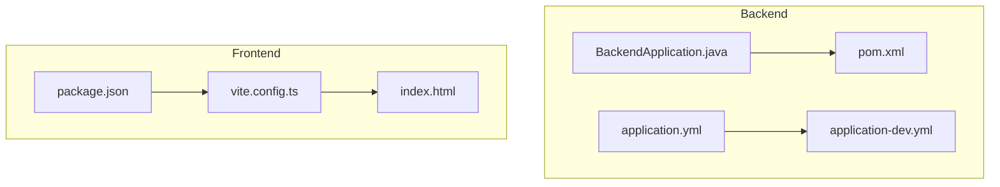
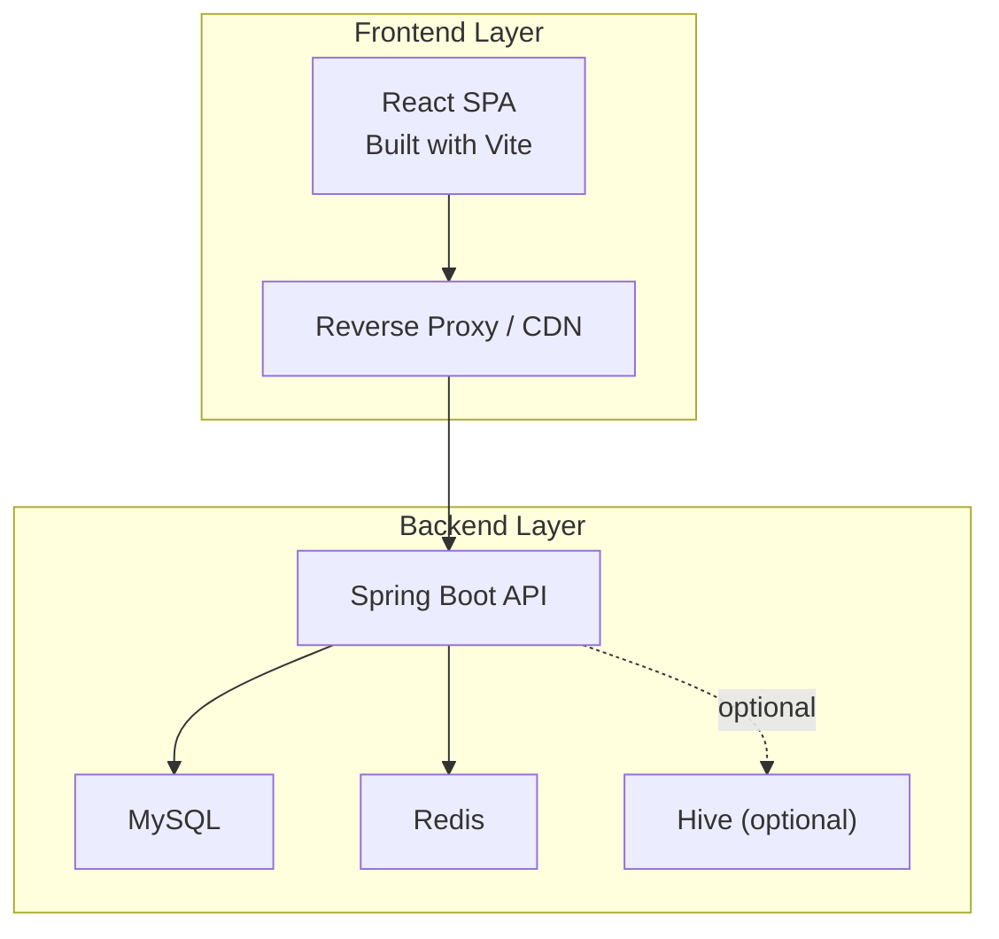
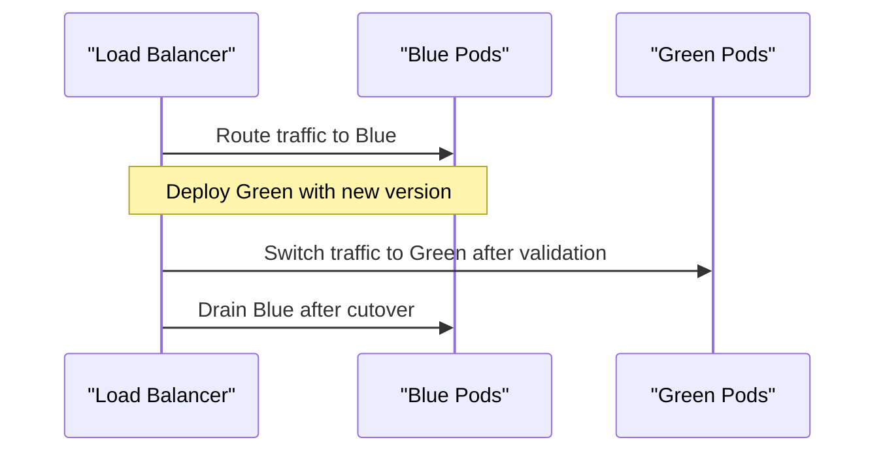
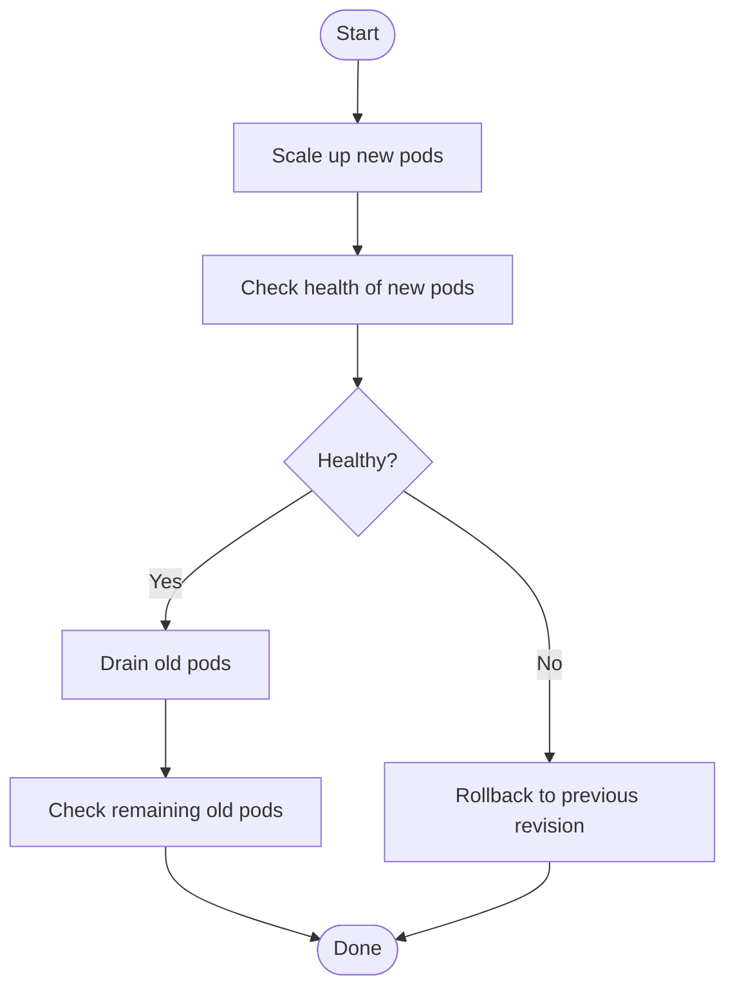
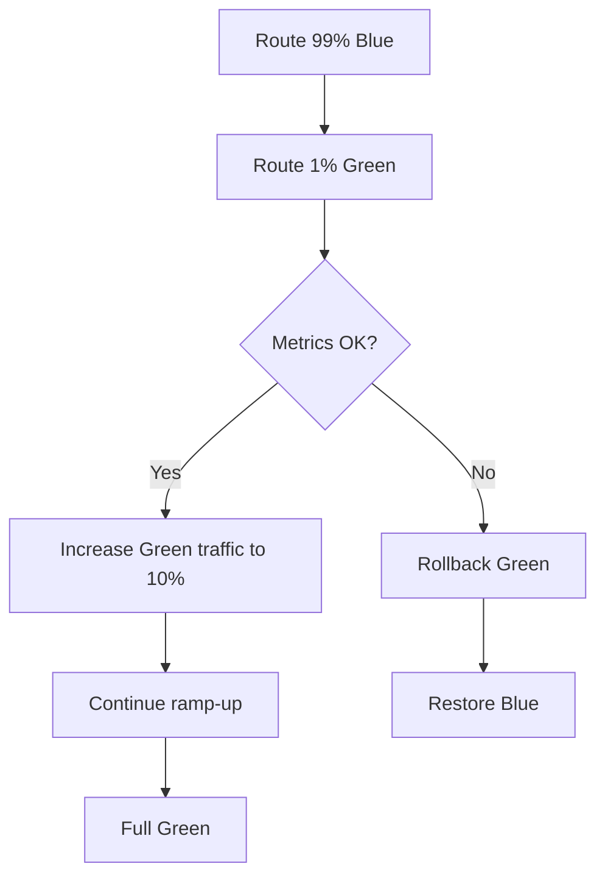
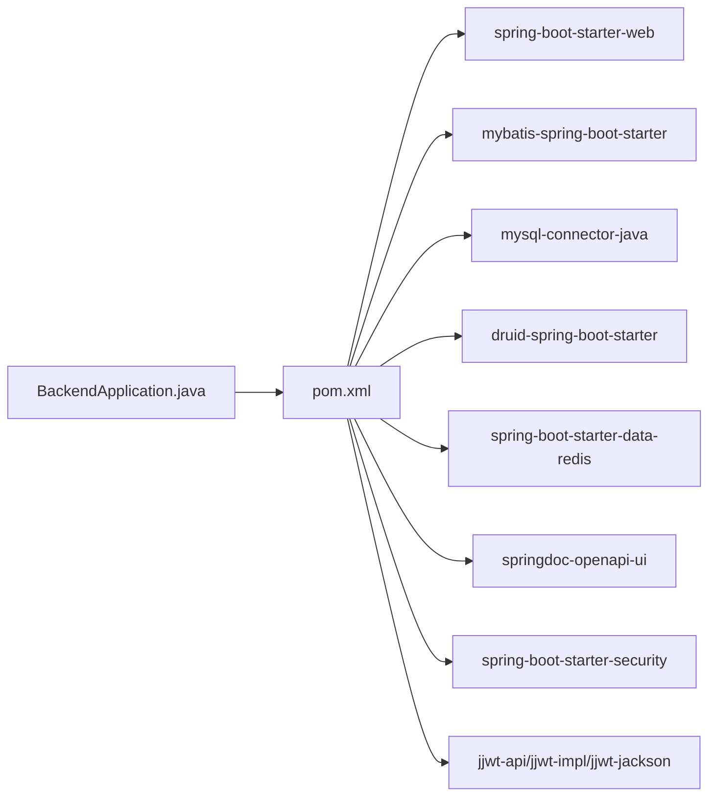

# Deployment Strategies

<cite>
**Referenced Files in This Document**
- [BackendApplication.java](file://backend/src/main/java/com/movie/backend/BackendApplication.java)
- [pom.xml](file://backend/pom.xml)
- [application.yml](file://backend/src/main/resources/application.yml)
- [application-dev.yml](file://backend/src/main/resources/application-dev.yml)
- [package.json](file://movie-review-web/package.json)
- [vite.config.ts](file://movie-review-web/vite.config.ts)
- [index.html](file://movie-review-web/index.html)
</cite>

## Table of Contents
1. [Introduction](#introduction)
2. [Project Structure](#project-structure)
3. [Core Components](#core-components)
4. [Architecture Overview](#architecture-overview)
5. [Detailed Component Analysis](#detailed-component-analysis)
6. [Dependency Analysis](#dependency-analysis)
7. [Performance Considerations](#performance-considerations)
8. [Troubleshooting Guide](#troubleshooting-guide)
9. [Conclusion](#conclusion)
10. [Appendices](#appendices)

## Introduction
This document provides a comprehensive deployment strategy guide for the Movie System, covering traditional server deployment, containerized deployment with Docker, and cloud platform deployment options. It also explains CI/CD pipeline setup, automated deployment processes, deployment automation scripts, and rollout strategies such as blue-green deployments, rolling updates, and canary releases. Guidance is included for deployment validation, health checks, rollback procedures, security, access control, monitoring, troubleshooting, and post-deployment verification.

## Project Structure
The Movie System consists of:
- A Java/Spring Boot backend service packaged as a Spring Boot application.
- A React-based frontend built with Vite and TypeScript.

Key deployment-relevant files:
- Backend: Spring Boot application entry point, Maven build configuration, and environment-specific configuration files.
- Frontend: Build scripts, Vite configuration, and HTML template.

**Diagram sources**
- [BackendApplication.java](file://backend/src/main/java/com/movie/backend/BackendApplication.java#L1-L17)
- [pom.xml](file://backend/pom.xml#L1-L300)
- [application.yml](file://backend/src/main/resources/application.yml#L1-L4)
- [application-dev.yml](file://backend/src/main/resources/application-dev.yml#L1-L67)
- [package.json](file://movie-review-web/package.json#L1-L42)
- [vite.config.ts](file://movie-review-web/vite.config.ts#L1-L11)
- [index.html](file://movie-review-web/index.html#L1-L15)

**Section sources**
- [BackendApplication.java](file://backend/src/main/java/com/movie/backend/BackendApplication.java#L1-L17)
- [pom.xml](file://backend/pom.xml#L1-L300)
- [application.yml](file://backend/src/main/resources/application.yml#L1-L4)
- [application-dev.yml](file://backend/src/main/resources/application-dev.yml#L1-L67)
- [package.json](file://movie-review-web/package.json#L1-L42)
- [vite.config.ts](file://movie-review-web/vite.config.ts#L1-L11)
- [index.html](file://movie-review-web/index.html#L1-L15)

## Core Components
- Backend service
  - Spring Boot application entry point and packaging via Maven.
  - Environment-specific configuration via Spring profiles.
- Frontend application
  - Build pipeline using Vite and TypeScript.
  - Static asset serving via a simple HTML template.

Deployment implications:
- Backend can be deployed as a traditional WAR/ZIP distribution or containerized.
- Frontend artifacts can be served by a reverse proxy or CDN.

**Section sources**
- [BackendApplication.java](file://backend/src/main/java/com/movie/backend/BackendApplication.java#L1-L17)
- [pom.xml](file://backend/pom.xml#L267-L297)
- [application.yml](file://backend/src/main/resources/application.yml#L1-L4)
- [application-dev.yml](file://backend/src/main/resources/application-dev.yml#L1-L67)
- [package.json](file://movie-review-web/package.json#L6-L11)
- [vite.config.ts](file://movie-review-web/vite.config.ts#L6-L11)

## Architecture Overview
The system comprises a backend API and a frontend web application. The frontend builds static assets and is typically served behind a reverse proxy or CDN. The backend exposes REST endpoints and integrates with MySQL, Redis, and optional Hive.

[No sources needed since this diagram shows conceptual workflow, not actual code structure]

## Detailed Component Analysis

### Backend Deployment Options

#### Traditional Server Deployment
- Package the backend using Maven to produce a Spring Boot executable JAR.
- Configure environment-specific properties via Spring profiles.
- Run the application on a Java 8+ compatible server.

Key configuration touchpoints:
- Application entry point and packaging: [BackendApplication.java](file://backend/src/main/java/com/movie/backend/BackendApplication.java#L10-L14), [pom.xml](file://backend/pom.xml#L267-L297)
- Active profile selection: [application.yml](file://backend/src/main/resources/application.yml#L2-L3)
- Dev profile settings (port, datasource, Redis, logging): [application-dev.yml](file://backend/src/main/resources/application-dev.yml#L1-L67)

Operational steps:
- Build artifact: [pom.xml](file://backend/pom.xml#L267-L297)
- Set active profile: [application.yml](file://backend/src/main/resources/application.yml#L2-L3)
- Start service: [BackendApplication.java](file://backend/src/main/java/com/movie/backend/BackendApplication.java#L12-L14)

Health and readiness:
- Expose health endpoints via Spring Boot Actuator (add dependency and configure endpoints).
- Implement readiness probes pointing to the health endpoint.

Rollout strategies:
- Blue-green: Deploy new version alongside current, switch traffic after validation.
- Rolling update: Gradually replace instances with minimal downtime.
- Canary: Route a small percentage of traffic to the new version.

Validation and rollback:
- Pre-deploy validation: Verify connectivity to MySQL, Redis, and optional Hive.
- Post-deploy validation: Smoke tests against health and key endpoints.
- Rollback: Revert to previous image/tag or redeploy previous version.

Security and access control:
- Enforce HTTPS/TLS termination at the load balancer or ingress.
- Restrict inbound ports to necessary ranges only.
- Apply network policies and firewall rules.

Monitoring:
- Enable metrics and logs export.
- Integrate with APM and log aggregation systems.

**Section sources**
- [BackendApplication.java](file://backend/src/main/java/com/movie/backend/BackendApplication.java#L10-L14)
- [pom.xml](file://backend/pom.xml#L267-L297)
- [application.yml](file://backend/src/main/resources/application.yml#L2-L3)
- [application-dev.yml](file://backend/src/main/resources/application-dev.yml#L1-L67)

#### Containerized Deployment with Docker
- Build a multi-stage Docker image for the backend using the Maven plugin output.
- Define a lightweight runtime image and copy the built JAR.
- Expose the configured port and set JVM memory options via environment variables.
- Mount volumes for logs and configuration overrides if needed.

Example deployment flow:
- Build image: Use the Maven Spring Boot plugin to produce the fat JAR, then build the Docker image.
- Run container: Map exposed port to host, pass environment variables for profile and secrets, mount volumes for logs.
- Orchestrate: Use Docker Compose or Kubernetes for multi-service orchestration.

Manifests and commands (conceptual):
- Dockerfile: Multi-stage build copying the Spring Boot JAR into a runtime base image.
- docker-compose.yml: Services for backend, MySQL, Redis, and optional Hive.
- k8s manifests: Deployment, Service, ConfigMap/Secrets, PersistentVolumeClaims.

Validation and rollback:
- Health checks: Use liveness/readiness probes aligned with backend health endpoints.
- Rollback: Change image tag to previous version and re-deploy.

Security:
- Run as non-root user.
- Limit capabilities and mount only necessary volumes.
- Store secrets in Kubernetes Secrets or Docker secrets.

**Section sources**
- [pom.xml](file://backend/pom.xml#L267-L297)
- [application-dev.yml](file://backend/src/main/resources/application-dev.yml#L1-L67)

#### Cloud Platform Deployment
- AWS: Deploy to ECS with Fargate or EKS. Use CodeDeploy for blue-green or rolling updates.
- Azure: Deploy to AKS or App Service. Use Azure DevOps pipelines for CI/CD.
- GCP: Deploy to GKE or Cloud Run. Use Cloud Build and Anthos for managed rollouts.
- Generic: Use Terraform/Helm to provision infrastructure and deploy Helm charts.

Patterns:
- Infrastructure as Code: Provision VPC, RDS, Redis, and cluster resources.
- CI/CD: Automated testing, building images, and deploying to staging/production.
- Observability: Enable CloudWatch/Azure Monitor/GCP Monitoring and distributed tracing.

**Section sources**
- [pom.xml](file://backend/pom.xml#L267-L297)
- [application-dev.yml](file://backend/src/main/resources/application-dev.yml#L1-L67)

### Frontend Deployment Options

#### Static Hosting
- Build production bundle: [package.json](file://movie-review-web/package.json#L8)
- Serve via Nginx/Apache behind a reverse proxy or CDN.
- Configure base URL and API gateway routing.

#### Containerized Frontend
- Build image with Nginx or serve static files via a minimal container.
- Deploy alongside backend or independently.

**Section sources**
- [package.json](file://movie-review-web/package.json#L8)
- [vite.config.ts](file://movie-review-web/vite.config.ts#L6-L11)
- [index.html](file://movie-review-web/index.html#L10-L12)

### CI/CD Pipeline Setup and Automation
Recommended stages:
- Build: Compile backend and build frontend.
- Test: Unit, integration, and contract tests.
- Package: Produce backend JAR and frontend artifacts.
- Scan: SCA and SAST scans.
- Release: Push container images to registry.
- Deploy: Apply manifests or run deployment scripts.
- Validate: Smoke tests and health checks.
- Monitor: Alerting and dashboards.

Automation scripts:
- Backend: Maven wrapper or script invoking Maven lifecycle.
- Frontend: NPM/Yarn scripts for build and preview.
- Orchestration: Shell/Python scripts orchestrating Docker/Kubernetes deployments.

**Section sources**
- [pom.xml](file://backend/pom.xml#L267-L297)
- [package.json](file://movie-review-web/package.json#L6-L11)

### Deployment Manifests and Commands (Examples)
Note: These are conceptual examples. Replace placeholders with real values for your environment.

- Docker
  - Build: docker build -t movie-backend:<tag> .
  - Run: docker run -d -p 9090:9090 --env SPRING_PROFILES_ACTIVE=prod movie-backend:<tag>
- Docker Compose
  - services: backend, mysql, redis
  - networks: app-network
  - volumes: logs, mysql-data
- Kubernetes
  - kind: Deployment, Service, ConfigMap, Secret
  - autoscaling: HPA (optional)
  - ingress: expose API and optionally frontend

**Section sources**
- [application-dev.yml](file://backend/src/main/resources/application-dev.yml#L1-L67)
- [pom.xml](file://backend/pom.xml#L267-L297)

### Rollout Strategies

#### Blue-Green Deployment

[No sources needed since this diagram shows conceptual workflow, not actual code structure]

#### Rolling Updates

[No sources needed since this diagram shows conceptual workflow, not actual code structure]

#### Canary Releases

[No sources needed since this diagram shows conceptual workflow, not actual code structure]

## Dependency Analysis
Backend dependencies relevant to deployment:
- Spring Boot starter web for HTTP server and REST.
- MyBatis starter for database access.
- MySQL connector and Druid connection pool.
- Redis starter for caching.
- OpenAPI/Swagger UI for API docs.
- Spring Security for method-level authorization.
- JWT libraries for authentication.

These influence deployment choices:
- Packaging: Spring Boot plugin produces an executable JAR.
- Runtime: Requires Java 8+.
- External services: MySQL, Redis, optional Hive.

**Diagram sources**
- [BackendApplication.java](file://backend/src/main/java/com/movie/backend/BackendApplication.java#L1-L17)
- [pom.xml](file://backend/pom.xml#L17-L248)

**Section sources**
- [pom.xml](file://backend/pom.xml#L17-L248)
- [BackendApplication.java](file://backend/src/main/java/com/movie/backend/BackendApplication.java#L1-L17)

## Performance Considerations
- JVM tuning: Set heap and GC options appropriate for workload.
- Connection pooling: Tune Druid pool sizes for MySQL.
- Async processing: Offload long tasks to background jobs.
- Caching: Use Redis for hot data and reduce DB load.
- CDN: Serve frontend assets via CDN to reduce origin load.

[No sources needed since this section provides general guidance]

## Troubleshooting Guide
Common deployment issues and remedies:
- Port conflicts: Ensure the configured port is free and open in the environment.
- Database connectivity: Verify credentials and network reachability to MySQL and Redis.
- Health failures: Confirm health endpoints are enabled and accessible.
- CORS errors: Configure allowed origins for the frontend origin.
- File uploads: Validate upload path permissions and size limits.
- JWT secrets: Ensure secret length and rotation policy are followed.

Validation checklist:
- Pre-deploy: Connectivity tests to MySQL, Redis, and optional Hive.
- Post-deploy: Health probe, smoke tests, and basic API tests.
- Rollback: Tagged images and stored manifests for quick restoration.

**Section sources**
- [application-dev.yml](file://backend/src/main/resources/application-dev.yml#L1-L67)

## Conclusion
The Movie System can be deployed across traditional servers, containers, or cloud platforms. The backend’s Spring Boot architecture simplifies packaging and deployment, while the frontend’s static build enables flexible hosting. Adopting CI/CD, structured rollout strategies, robust health checks, and strong security practices ensures reliable, repeatable deployments with minimal risk.

[No sources needed since this section summarizes without analyzing specific files]

## Appendices

### Appendix A: Backend Configuration Reference
- Active profile selection: [application.yml](file://backend/src/main/resources/application.yml#L2-L3)
- Dev profile settings (port, datasource, Redis, logging): [application-dev.yml](file://backend/src/main/resources/application-dev.yml#L1-L67)

**Section sources**
- [application.yml](file://backend/src/main/resources/application.yml#L2-L3)
- [application-dev.yml](file://backend/src/main/resources/application-dev.yml#L1-L67)

### Appendix B: Frontend Build Reference
- Build script: [package.json](file://movie-review-web/package.json#L8)
- Vite configuration: [vite.config.ts](file://movie-review-web/vite.config.ts#L6-L11)
- HTML template: [index.html](file://movie-review-web/index.html#L10-L12)

**Section sources**
- [package.json](file://movie-review-web/package.json#L8)
- [vite.config.ts](file://movie-review-web/vite.config.ts#L6-L11)
- [index.html](file://movie-review-web/index.html#L10-L12)