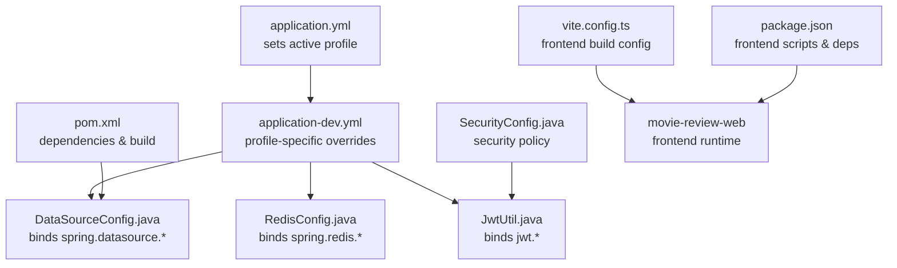
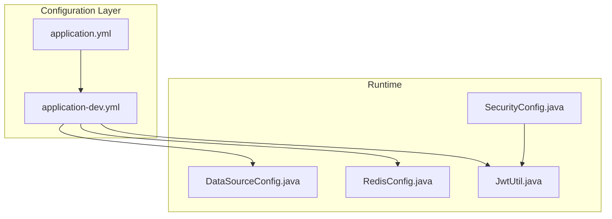
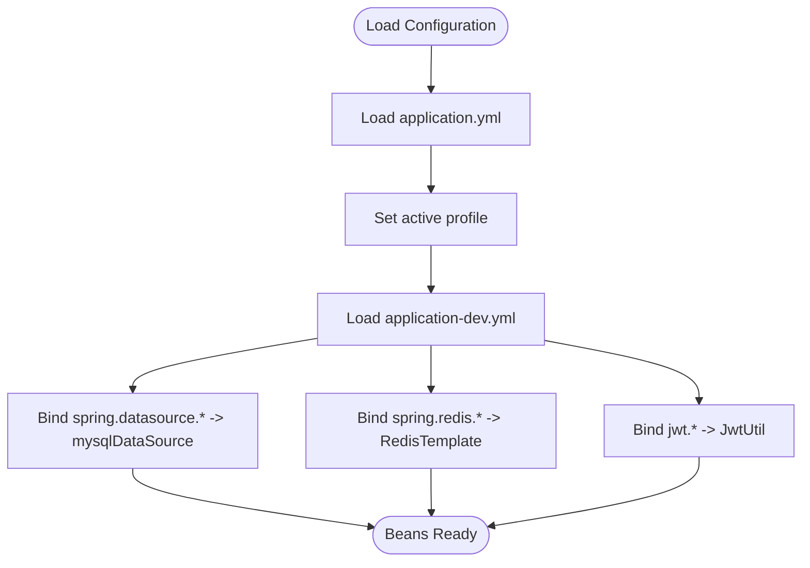
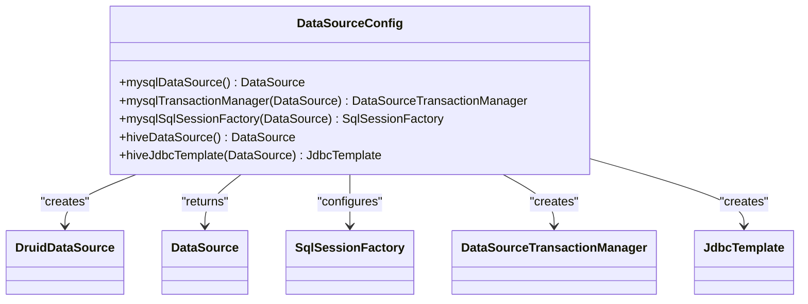
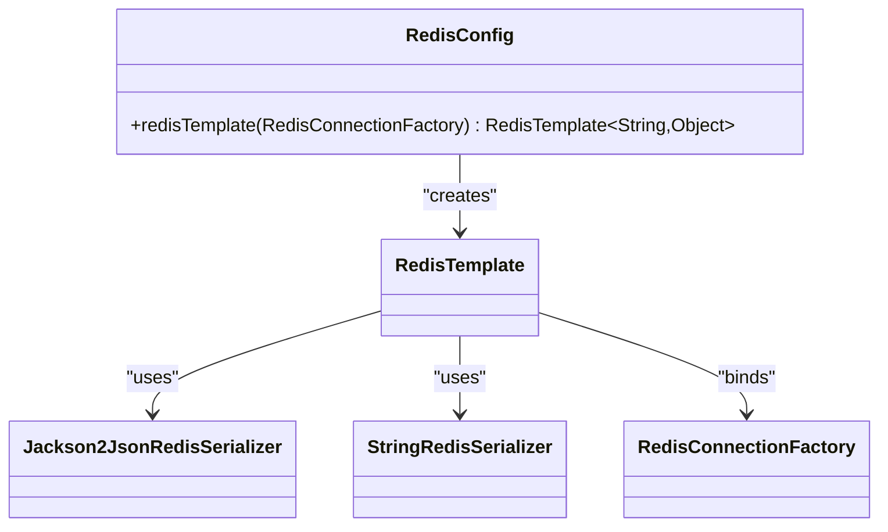
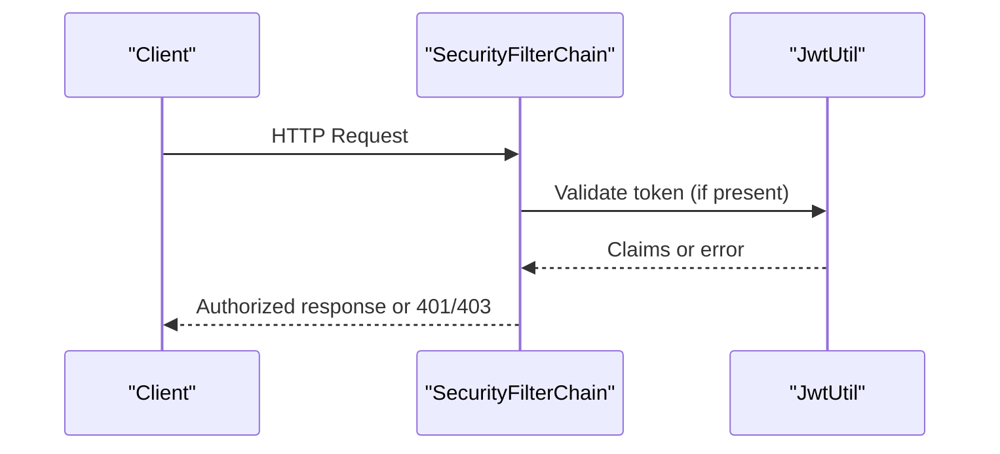
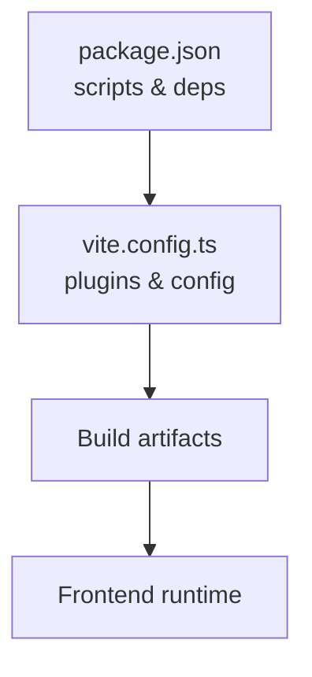
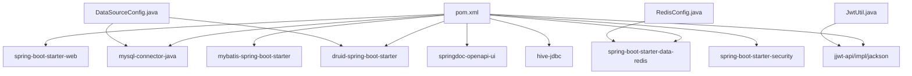

# Environment Management

<cite>
**Referenced Files in This Document**
- [application.yml](file://backend/src/main/resources/application.yml)
- [application-dev.yml](file://backend/src/main/resources/application-dev.yml)
- [DataSourceConfig.java](file://backend/src/main/java/com/movie/backend/config/DataSourceConfig.java)
- [RedisConfig.java](file://backend/src/main/java/com/movie/backend/config/RedisConfig.java)
- [SecurityConfig.java](file://backend/src/main/java/com/movie/backend/config/SecurityConfig.java)
- [JwtUtil.java](file://backend/src/main/java/com/movie/backend/utils/JwtUtil.java)
- [pom.xml](file://backend/pom.xml)
- [vite.config.ts](file://movie-review-web/vite.config.ts)
- [package.json](file://movie-review-web/package.json)
</cite>

## Table of Contents
1. [Introduction](#introduction)
2. [Project Structure](#project-structure)
3. [Core Components](#core-components)
4. [Architecture Overview](#architecture-overview)
5. [Detailed Component Analysis](#detailed-component-analysis)
6. [Dependency Analysis](#dependency-analysis)
7. [Performance Considerations](#performance-considerations)
8. [Troubleshooting Guide](#troubleshooting-guide)
9. [Conclusion](#conclusion)
10. [Appendices](#appendices)

## Introduction
This document provides comprehensive environment management guidance for the movie system. It covers configuration files, environment variables, deployment environments, and Docker setup. It explains how application configuration is organized across development, staging, and production environments, including database connections, Redis, security settings, and external service integrations. It also documents environment variable usage, property file management, configuration precedence, secrets management, configuration validation, hot-reloading, environment switching, and troubleshooting.

## Project Structure
The environment configuration is primarily managed via Spring Boot YAML property files and Java configuration classes. The backend uses a profile-driven configuration model with an active profile set to development by default. Frontend configuration is handled by Vite and TypeScript configuration files.

**Diagram sources**
- [application.yml](file://backend/src/main/resources/application.yml#L1-L3)
- [application-dev.yml](file://backend/src/main/resources/application-dev.yml#L1-L67)
- [DataSourceConfig.java](file://backend/src/main/java/com/movie/backend/config/DataSourceConfig.java#L18-L61)
- [RedisConfig.java](file://backend/src/main/java/com/movie/backend/config/RedisConfig.java#L14-L41)
- [JwtUtil.java](file://backend/src/main/java/com/movie/backend/utils/JwtUtil.java#L20-L45)
- [SecurityConfig.java](file://backend/src/main/java/com/movie/backend/config/SecurityConfig.java#L16-L49)
- [pom.xml](file://backend/pom.xml#L1-L300)
- [vite.config.ts](file://movie-review-web/vite.config.ts#L1-L11)
- [package.json](file://movie-review-web/package.json#L1-L42)

**Section sources**
- [application.yml](file://backend/src/main/resources/application.yml#L1-L3)
- [application-dev.yml](file://backend/src/main/resources/application-dev.yml#L1-L67)
- [pom.xml](file://backend/pom.xml#L1-L300)
- [vite.config.ts](file://movie-review-web/vite.config.ts#L1-L11)
- [package.json](file://movie-review-web/package.json#L1-L42)

## Core Components
- Active profile selection: The active profile is controlled by the root application YAML file.
- Profile-specific overrides: The development profile YAML defines server, datasource, Redis, logging, file upload, MyBatis, and JWT settings.
- Java configuration binding: DataSourceConfig binds the primary MySQL and secondary Hive datasources using Spring Boot’s @ConfigurationProperties. RedisConfig configures RedisTemplate serialization. SecurityConfig defines stateless JWT-based security. JwtUtil reads JWT configuration values via @Value.
- Frontend build configuration: Vite and TypeScript configuration files manage frontend bundling and plugin setup.

**Section sources**
- [application.yml](file://backend/src/main/resources/application.yml#L1-L3)
- [application-dev.yml](file://backend/src/main/resources/application-dev.yml#L1-L67)
- [DataSourceConfig.java](file://backend/src/main/java/com/movie/backend/config/DataSourceConfig.java#L18-L61)
- [RedisConfig.java](file://backend/src/main/java/com/movie/backend/config/RedisConfig.java#L14-L41)
- [SecurityConfig.java](file://backend/src/main/java/com/movie/backend/config/SecurityConfig.java#L16-L49)
- [JwtUtil.java](file://backend/src/main/java/com/movie/backend/utils/JwtUtil.java#L20-L45)
- [vite.config.ts](file://movie-review-web/vite.config.ts#L1-L11)

## Architecture Overview
The environment management architecture centers on Spring Boot’s profile-based configuration and Java configuration classes. The active profile determines which YAML properties are loaded. Java configuration classes bind these properties to application beans. Security and JWT utilities consume these properties for runtime behavior.

**Diagram sources**
- [application.yml](file://backend/src/main/resources/application.yml#L1-L3)
- [application-dev.yml](file://backend/src/main/resources/application-dev.yml#L1-L67)
- [DataSourceConfig.java](file://backend/src/main/java/com/movie/backend/config/DataSourceConfig.java#L18-L61)
- [RedisConfig.java](file://backend/src/main/java/com/movie/backend/config/RedisConfig.java#L14-L41)
- [SecurityConfig.java](file://backend/src/main/java/com/movie/backend/config/SecurityConfig.java#L16-L49)
- [JwtUtil.java](file://backend/src/main/java/com/movie/backend/utils/JwtUtil.java#L20-L45)

## Detailed Component Analysis

### Configuration Precedence and Property Binding
- Precedence: application.yml sets the active profile; application-dev.yml provides profile-specific overrides. Properties from the active profile take precedence over defaults.
- Binding: DataSourceConfig binds spring.datasource.* to a primary MySQL datasource and hive.datasource.* to a secondary Hive datasource. RedisConfig binds spring.redis.* to RedisTemplate. JwtUtil binds jwt.* values via @Value.

**Diagram sources**
- [application.yml](file://backend/src/main/resources/application.yml#L1-L3)
- [application-dev.yml](file://backend/src/main/resources/application-dev.yml#L1-L67)
- [DataSourceConfig.java](file://backend/src/main/java/com/movie/backend/config/DataSourceConfig.java#L22-L28)
- [RedisConfig.java](file://backend/src/main/java/com/movie/backend/config/RedisConfig.java#L17-L40)
- [JwtUtil.java](file://backend/src/main/java/com/movie/backend/utils/JwtUtil.java#L23-L32)

**Section sources**
- [application.yml](file://backend/src/main/resources/application.yml#L1-L3)
- [application-dev.yml](file://backend/src/main/resources/application-dev.yml#L1-L67)
- [DataSourceConfig.java](file://backend/src/main/java/com/movie/backend/config/DataSourceConfig.java#L22-L28)
- [RedisConfig.java](file://backend/src/main/java/com/movie/backend/config/RedisConfig.java#L17-L40)
- [JwtUtil.java](file://backend/src/main/java/com/movie/backend/utils/JwtUtil.java#L23-L32)

### Environment Variables and Secrets Management
- Environment variables: Not currently used in the backend configuration. Properties are sourced from YAML files.
- Secrets management: The development configuration includes credentials in application-dev.yml. For production, externalize secrets using environment variables or secure secret stores and override sensitive properties at runtime.

Recommendations:
- Externalize sensitive properties (database passwords, Redis password, JWT secret) via environment variables.
- Use Spring Cloud Config or Kubernetes Secrets for centralized secret management in staging and production.
- Avoid committing secrets to version control.

**Section sources**
- [application-dev.yml](file://backend/src/main/resources/application-dev.yml#L12-L44)
- [JwtUtil.java](file://backend/src/main/java/com/movie/backend/utils/JwtUtil.java#L23-L32)

### Database Connections and Multi-DataSource Setup
- Primary MySQL datasource: Bound via spring.datasource.* and configured as the primary data source. Druid pool settings are applied.
- Secondary Hive datasource: Bound via hive.datasource.* and exposed as a separate JdbcTemplate for analytics queries.
- Transaction manager and MyBatis: The primary datasource is wired with a transaction manager and MyBatis SqlSessionFactory.

**Diagram sources**
- [DataSourceConfig.java](file://backend/src/main/java/com/movie/backend/config/DataSourceConfig.java#L18-L61)

**Section sources**
- [DataSourceConfig.java](file://backend/src/main/java/com/movie/backend/config/DataSourceConfig.java#L18-L61)
- [application-dev.yml](file://backend/src/main/resources/application-dev.yml#L11-L50)

### Redis Configuration
- Redis host, port, and database are configured via spring.redis.*.
- RedisTemplate is configured with JSON serialization for values and string serialization for keys.

**Diagram sources**
- [RedisConfig.java](file://backend/src/main/java/com/movie/backend/config/RedisConfig.java#L14-L41)

**Section sources**
- [RedisConfig.java](file://backend/src/main/java/com/movie/backend/config/RedisConfig.java#L14-L41)
- [application-dev.yml](file://backend/src/main/resources/application-dev.yml#L26-L31)

### Security Settings and JWT
- Stateless JWT-based security: CSRF is disabled, form login and HTTP Basic are disabled, session policy is stateless, and access denied is handled by a custom handler.
- JWT configuration: Secret key, access token expiration, and refresh token expiration are loaded via @Value from jwt.* properties.

**Diagram sources**
- [SecurityConfig.java](file://backend/src/main/java/com/movie/backend/config/SecurityConfig.java#L24-L49)
- [JwtUtil.java](file://backend/src/main/java/com/movie/backend/utils/JwtUtil.java#L23-L45)

**Section sources**
- [SecurityConfig.java](file://backend/src/main/java/com/movie/backend/config/SecurityConfig.java#L16-L49)
- [JwtUtil.java](file://backend/src/main/java/com/movie/backend/utils/JwtUtil.java#L23-L45)
- [application-dev.yml](file://backend/src/main/resources/application-dev.yml#L62-L67)

### Frontend Environment and Build Configuration
- Frontend build tooling is configured via Vite and TypeScript. Scripts and dependencies are defined in package.json.
- Environment variables for the frontend are typically injected at build time or via runtime configuration depending on the deployment strategy.

**Diagram sources**
- [package.json](file://movie-review-web/package.json#L1-L42)
- [vite.config.ts](file://movie-review-web/vite.config.ts#L1-L11)

**Section sources**
- [package.json](file://movie-review-web/package.json#L1-L42)
- [vite.config.ts](file://movie-review-web/vite.config.ts#L1-L11)

## Dependency Analysis
- Spring Boot dependencies: The backend declares web, MyBatis, MySQL driver, Druid, Redis, Swagger, Hive JDBC, JWT, validation, and security dependencies.
- Configuration binding: Java configuration classes depend on YAML properties to create and wire beans.
- Frontend dependencies: The frontend depends on React, Vite, TailwindCSS, and related tooling.

**Diagram sources**
- [pom.xml](file://backend/pom.xml#L17-L248)
- [DataSourceConfig.java](file://backend/src/main/java/com/movie/backend/config/DataSourceConfig.java#L18-L61)
- [RedisConfig.java](file://backend/src/main/java/com/movie/backend/config/RedisConfig.java#L14-L41)
- [JwtUtil.java](file://backend/src/main/java/com/movie/backend/utils/JwtUtil.java#L20-L45)

**Section sources**
- [pom.xml](file://backend/pom.xml#L17-L248)

## Performance Considerations
- Connection pooling: Druid pool settings in the development configuration should be tuned per environment to match traffic patterns.
- Redis serialization: JSON serialization for values enables flexible storage but may impact performance; consider optimizing payload sizes and caching strategies.
- Logging levels: Adjust logging levels per environment to reduce overhead in production.
- File uploads: Limit max file sizes and request sizes to prevent resource exhaustion.

[No sources needed since this section provides general guidance]

## Troubleshooting Guide
Common environment-related issues and resolutions:
- Profile not activating: Verify the active profile in the root YAML file and ensure the corresponding application-*.yml exists.
- Database connectivity: Confirm datasource URL, username, and password in the active profile YAML. Check network access to the database host.
- Redis connectivity: Verify Redis host, port, and optional password in the active profile YAML.
- JWT errors: Ensure jwt.secret is present and sufficiently strong. Validate token expiration settings.
- Multi-datasource mismatches: Confirm that hive.datasource.* properties are correctly set if analytics queries are used.
- Frontend build/runtime errors: Check Vite configuration and ensure environment variables are properly injected.

**Section sources**
- [application.yml](file://backend/src/main/resources/application.yml#L1-L3)
- [application-dev.yml](file://backend/src/main/resources/application-dev.yml#L11-L67)
- [JwtUtil.java](file://backend/src/main/java/com/movie/backend/utils/JwtUtil.java#L23-L32)

## Conclusion
The movie system uses a clear, profile-driven configuration model with YAML files and Java configuration classes. The development profile is active by default and includes comprehensive settings for databases, Redis, logging, file handling, MyBatis, and JWT. For production, externalize secrets, adjust performance-related settings, and adopt robust environment switching and validation practices. The frontend build is managed via Vite and TypeScript, supporting modern development workflows.

[No sources needed since this section summarizes without analyzing specific files]

## Appendices

### Environment Profiles and Switching
- Default active profile: development.
- Switching profiles: Modify the active profile in the root YAML file to select staging or production configurations.

**Section sources**
- [application.yml](file://backend/src/main/resources/application.yml#L1-L3)

### Configuration Validation Checklist
- Datasource connectivity verified for both primary and secondary databases.
- Redis connectivity and credentials validated.
- JWT secret and expiration values are present and reasonable.
- Logging levels appropriate for the environment.
- File upload limits and paths configured correctly.
- Security filters permit expected endpoints and deny unauthorized access.

**Section sources**
- [application-dev.yml](file://backend/src/main/resources/application-dev.yml#L11-L67)
- [SecurityConfig.java](file://backend/src/main/java/com/movie/backend/config/SecurityConfig.java#L24-L49)