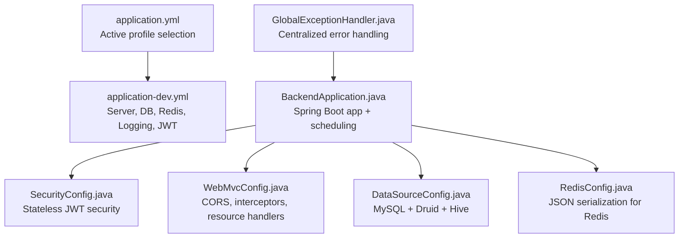
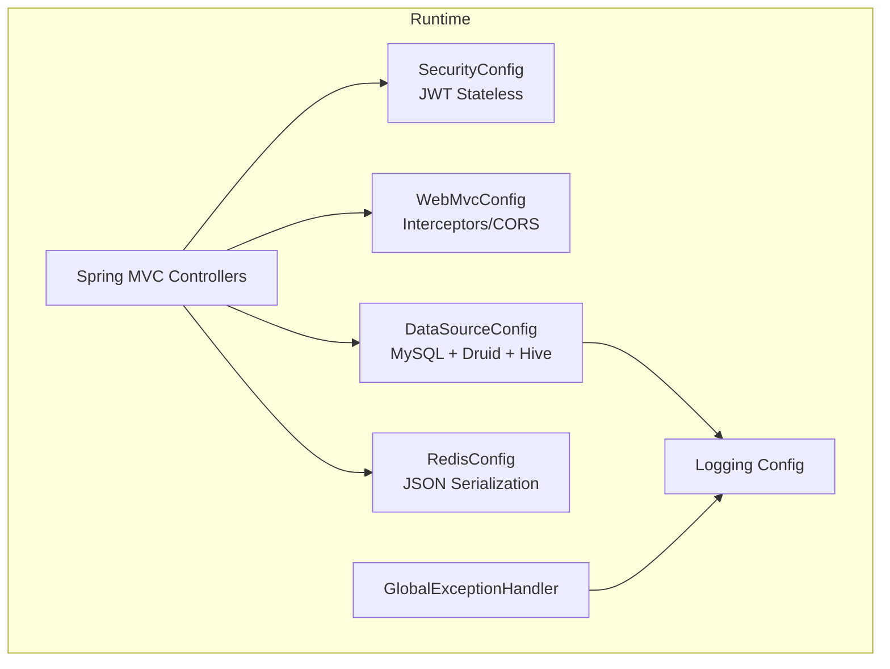
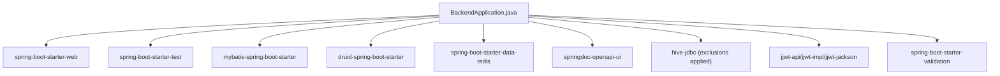

# Monitoring & Maintenance

<cite>
**Referenced Files in This Document**
- [application.yml](file://backend/src/main/resources/application.yml)
- [application-dev.yml](file://backend/src/main/resources/application-dev.yml)
- [pom.xml](file://backend/pom.xml)
- [BackendApplication.java](file://backend/src/main/java/com/movie/backend/BackendApplication.java)
- [SecurityConfig.java](file://backend/src/main/java/com/movie/backend/config/SecurityConfig.java)
- [WebMvcConfig.java](file://backend/src/main/java/com/movie/backend/config/WebMvcConfig.java)
- [RedisConfig.java](file://backend/src/main/java/com/movie/backend/config/RedisConfig.java)
- [DataSourceConfig.java](file://backend/src/main/java/com/movie/backend/config/DataSourceConfig.java)
- [GlobalExceptionHandler.java](file://backend/src/main/java/com/movie/backend/exception/GlobalExceptionHandler.java)
- [README_FAVORITES_FIX.md](file://backend/sql/README_FAVORITES_FIX.md)
</cite>

## Table of Contents
1. [Introduction](#introduction)
2. [Project Structure](#project-structure)
3. [Core Components](#core-components)
4. [Architecture Overview](#architecture-overview)
5. [Detailed Component Analysis](#detailed-component-analysis)
6. [Dependency Analysis](#dependency-analysis)
7. [Performance Considerations](#performance-considerations)
8. [Troubleshooting Guide](#troubleshooting-guide)
9. [Conclusion](#conclusion)
10. [Appendices](#appendices)

## Introduction
This document provides comprehensive monitoring and maintenance guidance for the movie system backend. It covers application health monitoring, logging configuration, operational procedures, maintenance and update processes, backup and disaster recovery, troubleshooting, performance optimization, and operational runbooks. The content is grounded in the repository’s configuration and code to ensure accuracy and practical applicability.

## Project Structure
The backend is a Spring Boot application with layered configuration and modular components:
- Application configuration is split across a base profile and an active development profile.
- Database connectivity is configured for MySQL via Druid and includes a secondary Hive data source.
- Redis is configured for caching and session-like operations.
- Logging is configured at package and framework levels.
- Security is configured for stateless JWT-based access.
- Scheduling is enabled at the application level.

**Diagram sources**
- [application.yml](file://backend/src/main/resources/application.yml#L1-L4)
- [application-dev.yml](file://backend/src/main/resources/application-dev.yml#L1-L67)
- [BackendApplication.java](file://backend/src/main/java/com/movie/backend/BackendApplication.java#L1-L16)
- [SecurityConfig.java](file://backend/src/main/java/com/movie/backend/config/SecurityConfig.java#L1-L51)
- [WebMvcConfig.java](file://backend/src/main/java/com/movie/backend/config/WebMvcConfig.java#L1-L65)
- [DataSourceConfig.java](file://backend/src/main/java/com/movie/backend/config/DataSourceConfig.java#L1-L62)
- [RedisConfig.java](file://backend/src/main/java/com/movie/backend/config/RedisConfig.java#L1-L42)
- [GlobalExceptionHandler.java](file://backend/src/main/java/com/movie/backend/exception/GlobalExceptionHandler.java#L37-L101)

**Section sources**
- [application.yml](file://backend/src/main/resources/application.yml#L1-L4)
- [application-dev.yml](file://backend/src/main/resources/application-dev.yml#L1-L67)
- [BackendApplication.java](file://backend/src/main/java/com/movie/backend/BackendApplication.java#L1-L16)

## Core Components
- Health and readiness: No explicit health endpoint is defined in the provided configuration. Consider adding a dedicated health endpoint for monitoring and alerting.
- Logging: Logging levels are set for the application package and the Spring framework. Centralized exception handling logs warnings and errors.
- Metrics and observability: No Micrometer or Actuator dependencies are present in the provided POM. Add Spring Boot Actuator and expose health, info, and metrics endpoints.
- Alerting: Not configured in the repository. Define alert rules for health, latency, error rates, and resource thresholds.
- Backup and recovery: Migration and backup steps are documented in the favorites fix guide.

**Section sources**
- [application-dev.yml](file://backend/src/main/resources/application-dev.yml#L52-L57)
- [GlobalExceptionHandler.java](file://backend/src/main/java/com/movie/backend/exception/GlobalExceptionHandler.java#L37-L101)
- [pom.xml](file://backend/pom.xml#L17-L248)
- [README_FAVORITES_FIX.md](file://backend/sql/README_FAVORITES_FIX.md#L130-L170)

## Architecture Overview
The runtime architecture integrates Spring MVC, MyBatis, Druid, Redis, and optional Hive. Security is enforced via JWT interception and method-level authorization. Logging and centralized exception handling support operational visibility.

**Diagram sources**
- [SecurityConfig.java](file://backend/src/main/java/com/movie/backend/config/SecurityConfig.java#L1-L51)
- [WebMvcConfig.java](file://backend/src/main/java/com/movie/backend/config/WebMvcConfig.java#L1-L65)
- [DataSourceConfig.java](file://backend/src/main/java/com/movie/backend/config/DataSourceConfig.java#L1-L62)
- [RedisConfig.java](file://backend/src/main/java/com/movie/backend/config/RedisConfig.java#L1-L42)
- [application-dev.yml](file://backend/src/main/resources/application-dev.yml#L52-L57)
- [GlobalExceptionHandler.java](file://backend/src/main/java/com/movie/backend/exception/GlobalExceptionHandler.java#L37-L101)

## Detailed Component Analysis

### Logging Configuration
- Package-level logging is configured for the application package and Spring framework.
- Centralized exception handling logs warnings for client-side interruptions and errors for server-side failures.
- Recommendations:
  - Introduce structured logging (JSON) for log aggregation.
  - Set distinct levels per component (controllers, services, data access).
  - Configure rolling file appenders and external log forwarding.

**Section sources**
- [application-dev.yml](file://backend/src/main/resources/application-dev.yml#L52-L57)
- [GlobalExceptionHandler.java](file://backend/src/main/java/com/movie/backend/exception/GlobalExceptionHandler.java#L71-L81)

### Security and Access Control
- Stateless JWT-based security with method-level authorization enabled.
- Interceptor excludes for public endpoints and Swagger docs.
- Recommendations:
  - Add CSRF protection for stateful flows if introduced later.
  - Enforce CORS policies consistently across environments.
  - Monitor unauthorized access attempts via logs.

**Section sources**
- [SecurityConfig.java](file://backend/src/main/java/com/movie/backend/config/SecurityConfig.java#L24-L49)
- [WebMvcConfig.java](file://backend/src/main/java/com/movie/backend/config/WebMvcConfig.java#L35-L40)

### Data Sources and Persistence
- MySQL configured via Druid with tunable pool sizes and validation.
- Secondary Hive data source configured for analytics queries.
- Recommendations:
  - Enable connection pool metrics and slow SQL logging.
  - Use separate credentials and network policies for Hive.
  - Monitor pool utilization and timeouts.

**Section sources**
- [application-dev.yml](file://backend/src/main/resources/application-dev.yml#L11-L25)
- [application-dev.yml](file://backend/src/main/resources/application-dev.yml#L38-L45)
- [DataSourceConfig.java](file://backend/src/main/java/com/movie/backend/config/DataSourceConfig.java#L22-L48)
- [DataSourceConfig.java](file://backend/src/main/java/com/movie/backend/config/DataSourceConfig.java#L50-L61)

### Redis Integration
- JSON serialization for keys and values to support heterogeneous cache entries.
- Recommendations:
  - Add Redis metrics and sentinel/cluster for HA.
  - Implement cache warming and TTL strategies.
  - Monitor eviction and miss ratios.

**Section sources**
- [RedisConfig.java](file://backend/src/main/java/com/movie/backend/config/RedisConfig.java#L17-L40)
- [application-dev.yml](file://backend/src/main/resources/application-dev.yml#L26-L32)

### Application Startup and Scheduling
- Application enables scheduling for future periodic tasks.
- Recommendations:
  - Use scheduled jobs for cleanup, cache refresh, and reporting.
  - Monitor job execution duration and failures.

**Section sources**
- [BackendApplication.java](file://backend/src/main/java/com/movie/backend/BackendApplication.java#L6-L9)

### Error Handling and Observability
- Centralized exception handler returns standardized results and logs at appropriate levels.
- Recommendations:
  - Add correlation IDs to requests for end-to-end tracing.
  - Expose health and info endpoints via Actuator.
  - Integrate with a metrics library (Micrometer) for latency and error rate metrics.

**Section sources**
- [GlobalExceptionHandler.java](file://backend/src/main/java/com/movie/backend/exception/GlobalExceptionHandler.java#L37-L101)
- [pom.xml](file://backend/pom.xml#L17-L248)

### Monitoring and Alerting (Operational Guidance)
- No built-in health endpoint or metrics exposure is present in the repository.
- Recommended implementation:
  - Add Spring Boot Actuator and expose health, info, and metrics.
  - Define alerts for:
    - Health down
    - High error rate (>1% over 5 minutes)
    - Latency p95 > threshold
    - Database pool exhaustion
    - Redis connectivity issues
- Example alert rule (conceptual):
  - Name: "High Error Rate"
  - Expression: rate(http_server_requests_seconds_count{status=~"5.."}[5m]) / rate(http_server_requests_seconds_count[5m]) > 0.01
  - Labels: severity=warning
  - Annotations: summary="High error rate detected"

[No sources needed since this section provides general guidance]

### Backup and Disaster Recovery
- The favorites migration document outlines a backup-and-restore process:
  - Backup database before applying schema changes.
  - Apply migration scripts.
  - Verify counts and transformations.
  - Redeploy backend and frontend after successful verification.
- Recommendations:
  - Automate backups with retention policies.
  - Test restore procedures regularly.
  - Version control all migration scripts and maintain rollback plans.

**Section sources**
- [README_FAVORITES_FIX.md](file://backend/sql/README_FAVORITES_FIX.md#L130-L170)

### Maintenance Procedures and Update Processes
- Build and deployment:
  - Clean package the backend with Maven.
  - Restart the application after deployment.
- Frontend deployment:
  - Build static assets and deploy to the web server.
- Patch management:
  - Review dependency exclusions and replacements in the POM.
  - Apply security patches to dependencies and retest.

**Section sources**
- [pom.xml](file://backend/pom.xml#L267-L297)
- [README_FAVORITES_FIX.md](file://backend/sql/README_FAVORITES_FIX.md#L158-L170)

### Operational Runbooks
- Daily:
  - Monitor health endpoint and error logs.
  - Review database pool and Redis connectivity.
- Weekly:
  - Rotate secrets and reconfigure JWT if needed.
  - Audit access logs for anomalies.
- Monthly:
  - Validate backup integrity and restore drills.
  - Reassess alert thresholds and dashboard coverage.

[No sources needed since this section provides general guidance]

## Dependency Analysis
The backend depends on Spring Boot starters, MyBatis, Druid, Redis, Swagger/OpenAPI, Hive JDBC, and JWT libraries. Dependency exclusions address known conflicts and vulnerabilities.

**Diagram sources**
- [pom.xml](file://backend/pom.xml#L17-L248)

**Section sources**
- [pom.xml](file://backend/pom.xml#L17-L248)

## Performance Considerations
- Database:
  - Tune Druid pool sizes and validation settings based on load.
  - Use prepared statements and pagination for large datasets.
- Caching:
  - Leverage Redis for hot data and reduce database load.
  - Monitor hit ratio and evictions.
- Network and I/O:
  - Limit multipart sizes and enforce request timeouts.
  - Optimize image serving via static resource handlers.
- Observability:
  - Add metrics for request latency, throughput, and error rates.
  - Use profiling tools during performance investigations.

**Section sources**
- [application-dev.yml](file://backend/src/main/resources/application-dev.yml#L3-L9)
- [application-dev.yml](file://backend/src/main/resources/application-dev.yml#L33-L36)
- [WebMvcConfig.java](file://backend/src/main/java/com/movie/backend/config/WebMvcConfig.java#L55-L63)

## Troubleshooting Guide
- Common symptoms and actions:
  - High error rate: Inspect centralized exceptions and logs; verify upstream dependencies.
  - Slow response times: Check database pool saturation and Redis connectivity; review request logs.
  - Authentication failures: Validate JWT configuration and interceptor exclusions.
  - Upload failures: Confirm static resource mapping and disk permissions.
- Diagnostic steps:
  - Verify health endpoint availability.
  - Check database and Redis connectivity.
  - Review recent changes and redeploy if necessary.
- Escalation:
  - Collect logs for the last hour and correlate with incident timestamps.
  - Validate migrations and schema changes.

**Section sources**
- [GlobalExceptionHandler.java](file://backend/src/main/java/com/movie/backend/exception/GlobalExceptionHandler.java#L37-L101)
- [WebMvcConfig.java](file://backend/src/main/java/com/movie/backend/config/WebMvcConfig.java#L55-L63)
- [application-dev.yml](file://backend/src/main/resources/application-dev.yml#L52-L57)

## Conclusion
The backend provides a solid foundation for monitoring and maintenance with configurable logging, centralized exception handling, and modular infrastructure components. To achieve production-grade observability, integrate health endpoints, metrics, and alerting; formalize backup and recovery procedures; and establish standardized operational runbooks. These enhancements will improve reliability, accelerate incident response, and streamline maintenance.

## Appendices

### Monitoring Dashboards (Conceptual)
- Overview panel:
  - Requests per second, error rate, latency p50/p95/p99.
  - Database pool usage and active connections.
  - Redis memory usage and hit ratio.
- Details panel:
  - Top endpoints by error rate and latency.
  - Database slow queries and lock waits.
  - JVM heap and GC metrics.

[No sources needed since this section provides general guidance]

### Alert Configurations (Conceptual)
- Health Down: Trigger when health endpoint fails for N minutes.
- High Error Rate: Trigger when error rate exceeds threshold over window.
- Latency Spike: Trigger when p95 latency exceeds threshold.
- Resource Exhaustion: Trigger on database pool exhaustion or Redis evictions.

[No sources needed since this section provides general guidance]

### Performance Benchmarks (Conceptual)
- Target latency: p95 < X ms for 95th percentile under sustained load.
- Throughput: Y requests/second with Z% error rate.
- Resource utilization: CPU < 80%, heap < 70%, DB pool < 85%.

[No sources needed since this section provides general guidance]