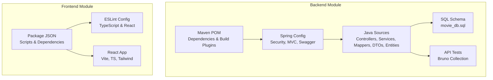
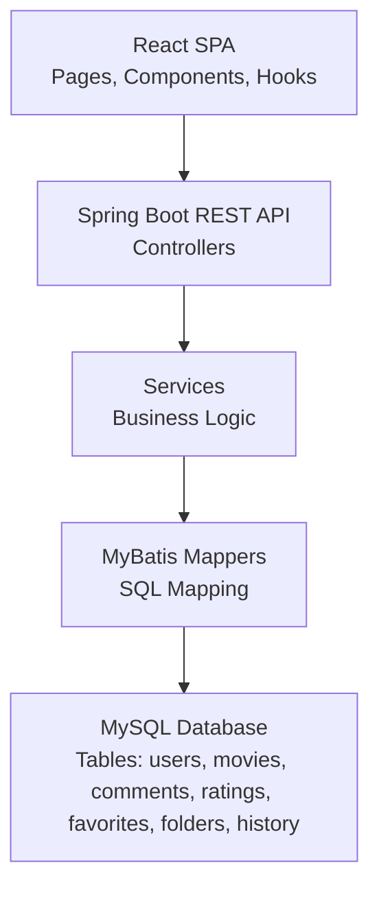
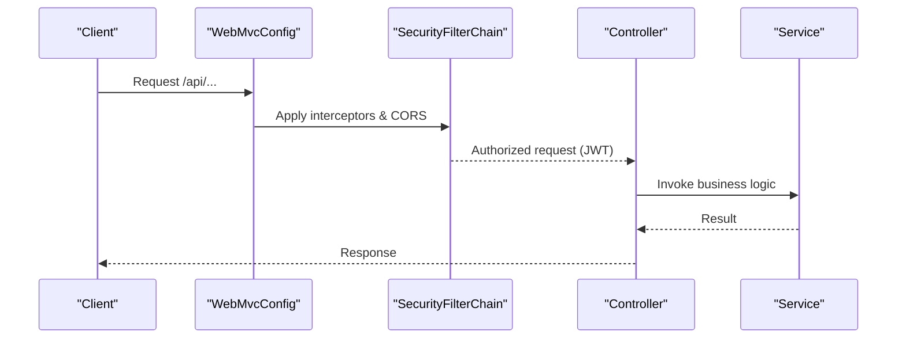
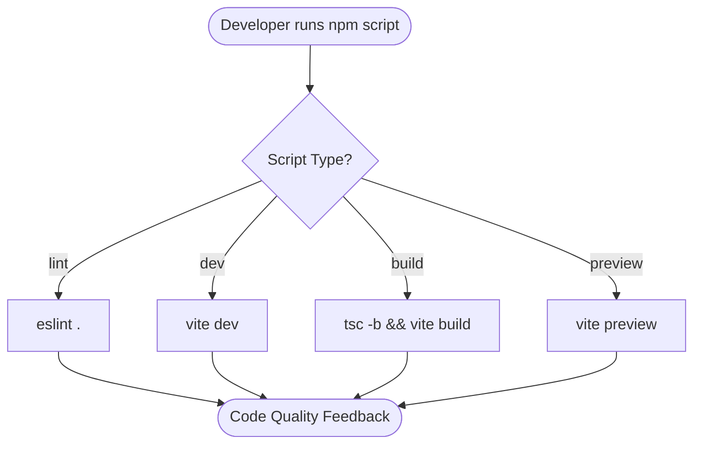
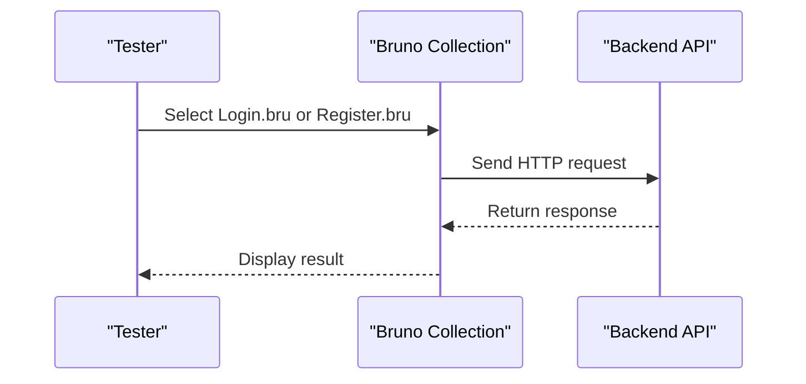

# Development Guidelines

<cite>
**Referenced Files in This Document**
- [pom.xml](file://backend/pom.xml)
- [HELP.md](file://backend/HELP.md)
- [backend .gitignore](file://backend/.gitignore)
- [web .gitignore](file://movie-review-web/.gitignore)
- [application.yml](file://backend/src/main/resources/application.yml)
- [SecurityConfig.java](file://backend/src/main/java/com/movie/backend/config/SecurityConfig.java)
- [WebMvcConfig.java](file://backend/src/main/java/com/movie/backend/config/WebMvcConfig.java)
- [SwaggerConfig.java](file://backend/src/main/java/com/movie/backend/config/SwaggerConfig.java)
- [package.json](file://movie-review-web/package.json)
- [eslint.config.js](file://movie-review-web/eslint.config.js)
- [movie_db.sql](file://backend/sql/movie_db.sql)
- [bruno.json](file://backend/movie_test/bruno.json)
- [Login.bru](file://backend/movie_test/Login.bru)
- [Register.bru](file://backend/movie_test/Register.bru)
</cite>

## Table of Contents
1. [Introduction](#introduction)
2. [Project Structure](#project-structure)
3. [Core Components](#core-components)
4. [Architecture Overview](#architecture-overview)
5. [Detailed Component Analysis](#detailed-component-analysis)
6. [Dependency Analysis](#dependency-analysis)
7. [Performance Considerations](#performance-considerations)
8. [Troubleshooting Guide](#troubleshooting-guide)
9. [Conclusion](#conclusion)
10. [Appendices](#appendices)

## Introduction
This document provides comprehensive development guidelines and best practices for contributing to the Movie Review System project. It covers code style standards, Git workflow, pull request processes, code review guidelines, architectural decisions, Qoder AI-assisted development tools, agent configurations, skill implementations, development environment setup, debugging approaches, contribution guidelines, code quality metrics, testing requirements, and maintenance procedures. The goal is to ensure consistent, maintainable, and collaborative development across both the backend (Java/Spring Boot) and frontend (React/Vite) components.

## Project Structure
The repository is organized into two primary modules:
- Backend: Java-based Spring Boot application with Maven build configuration, configuration classes, controllers, services, mappers, DTOs, entities, and tests.
- Frontend: React application using Vite, TypeScript, ESLint, and Tailwind CSS.

Key characteristics:
- Backend uses Maven for dependency management and packaging.
- Frontend uses npm scripts for development, building, linting, and previewing.
- Both modules include .gitignore files to exclude IDE-specific and build artifacts.
- The backend includes database schema SQL dump and Bruno collection for API testing.

**Diagram sources**
- [pom.xml](file://backend/pom.xml#L1-L300)
- [application.yml](file://backend/src/main/resources/application.yml#L1-L4)
- [SecurityConfig.java](file://backend/src/main/java/com/movie/backend/config/SecurityConfig.java#L1-L51)
- [WebMvcConfig.java](file://backend/src/main/java/com/movie/backend/config/WebMvcConfig.java#L1-L65)
- [SwaggerConfig.java](file://backend/src/main/java/com/movie/backend/config/SwaggerConfig.java#L1-L19)
- [movie_db.sql](file://backend/sql/movie_db.sql#L1-L164)
- [bruno.json](file://backend/movie_test/bruno.json#L1-L9)
- [package.json](file://movie-review-web/package.json#L1-L42)
- [eslint.config.js](file://movie-review-web/eslint.config.js#L1-L24)

**Section sources**
- [pom.xml](file://backend/pom.xml#L1-L300)
- [backend .gitignore](file://backend/.gitignore#L1-L34)
- [web .gitignore](file://movie-review-web/.gitignore#L1-L25)
- [application.yml](file://backend/src/main/resources/application.yml#L1-L4)
- [package.json](file://movie-review-web/package.json#L1-L42)

## Core Components
This section outlines the foundational components that define the system’s behavior and development practices.

- Backend configuration and security
  - SecurityConfig disables CSRF and form/basic authentication, enabling stateless JWT-based sessions and method-level authorization via @PreAuthorize.
  - WebMvcConfig sets up CORS, interceptors (JWT), custom argument resolver (@CurrentUser), and static resource mapping for uploaded images.
  - SwaggerConfig exposes OpenAPI documentation.

- Frontend toolchain
  - package.json defines scripts for dev, build, lint, and preview, along with runtime and dev dependencies.
  - eslint.config.js configures ESLint with TypeScript, React Hooks, and React Refresh plugins.

- Database schema
  - movie_db.sql provides the complete schema for users, movies, comments, ratings, favorites, favorite folders, and view history.

- API testing
  - bruno.json defines a Bruno collection for API testing.
  - Login.bru and Register.bru demonstrate HTTP requests and JSON bodies for authentication endpoints.

**Section sources**
- [SecurityConfig.java](file://backend/src/main/java/com/movie/backend/config/SecurityConfig.java#L1-L51)
- [WebMvcConfig.java](file://backend/src/main/java/com/movie/backend/config/WebMvcConfig.java#L1-L65)
- [SwaggerConfig.java](file://backend/src/main/java/com/movie/backend/config/SwaggerConfig.java#L1-L19)
- [package.json](file://movie-review-web/package.json#L1-L42)
- [eslint.config.js](file://movie-review-web/eslint.config.js#L1-L24)
- [movie_db.sql](file://backend/sql/movie_db.sql#L1-L164)
- [bruno.json](file://backend/movie_test/bruno.json#L1-L9)
- [Login.bru](file://backend/movie_test/Login.bru#L1-L16)
- [Register.bru](file://backend/movie_test/Register.bru#L1-L26)

## Architecture Overview
The system follows a layered architecture:
- Presentation layer: React SPA (frontend) communicates with REST APIs exposed by the Spring Boot backend.
- Business logic: Controllers delegate to services; services coordinate domain operations.
- Data access: MyBatis mappers map SQL queries to Java objects.
- Infrastructure: Security (JWT), CORS, static resources, and OpenAPI documentation.

**Diagram sources**
- [WebMvcConfig.java](file://backend/src/main/java/com/movie/backend/config/WebMvcConfig.java#L1-L65)
- [SecurityConfig.java](file://backend/src/main/java/com/movie/backend/config/SecurityConfig.java#L1-L51)
- [SwaggerConfig.java](file://backend/src/main/java/com/movie/backend/config/SwaggerConfig.java#L1-L19)
- [movie_db.sql](file://backend/sql/movie_db.sql#L1-L164)

## Detailed Component Analysis

### Backend Configuration and Security
- Stateless JWT session policy and method-level authorization enable secure, scalable API access.
- Interceptor excludes public endpoints (/user/login, /user/register, Swagger UI) while enforcing JWT checks elsewhere.
- Static resource handler maps /images/** to a configurable upload path for serving media.

**Diagram sources**
- [WebMvcConfig.java](file://backend/src/main/java/com/movie/backend/config/WebMvcConfig.java#L36-L40)
- [SecurityConfig.java](file://backend/src/main/java/com/movie/backend/config/SecurityConfig.java#L25-L46)

**Section sources**
- [SecurityConfig.java](file://backend/src/main/java/com/movie/backend/config/SecurityConfig.java#L1-L51)
- [WebMvcConfig.java](file://backend/src/main/java/com/movie/backend/config/WebMvcConfig.java#L1-L65)

### Frontend Tooling and Code Quality
- ESLint configuration enforces recommended rules for TypeScript and React, including hooks and refresh plugins.
- Vite script orchestration supports development, production builds, and previews.

**Diagram sources**
- [package.json](file://movie-review-web/package.json#L6-L11)
- [eslint.config.js](file://movie-review-web/eslint.config.js#L8-L23)

**Section sources**
- [package.json](file://movie-review-web/package.json#L1-L42)
- [eslint.config.js](file://movie-review-web/eslint.config.js#L1-L24)

### API Testing with Bruno
- bruno.json defines a collection with ignored directories.
- Login.bru and Register.bru demonstrate HTTP requests and JSON bodies for authentication endpoints.

**Diagram sources**
- [bruno.json](file://backend/movie_test/bruno.json#L1-L9)
- [Login.bru](file://backend/movie_test/Login.bru#L7-L11)
- [Register.bru](file://backend/movie_test/Register.bru#L7-L20)

**Section sources**
- [bruno.json](file://backend/movie_test/bruno.json#L1-L9)
- [Login.bru](file://backend/movie_test/Login.bru#L1-L16)
- [Register.bru](file://backend/movie_test/Register.bru#L1-L26)

## Dependency Analysis
Backend dependencies include Spring Boot starters, MyBatis, MySQL driver, Redis, Swagger/OpenAPI, JWT, PageHelper, and Hive JDBC with exclusions and replacements for compatibility. The Maven build configures compiler encoding and Spring Boot plugin settings.

```mermaid
graph TB
POM["pom.xml"]
SB["spring-boot-starter-web"]
TEST["spring-boot-starter-test"]
LOMBOK["lombok"]
MB["mybatis-spring-boot-starter"]
MYSQL["mysql-connector-java"]
VALID["spring-boot-starter-validation"]
DRUID["druid-spring-boot-starter"]
REDIS["spring-boot-starter-data-redis"]
SWAGGER["springdoc-openapi-ui"]
JWT["jjwt-api/jjwt-impl/jjwt-jackson"]
HV["hive-jdbc (exclusions & safe deps)"]
PH["pagehelper-spring-boot-starter"]
NETTY["netty-all"]
POM --> SB
POM --> TEST
POM --> LOMBOK
POM --> MB
POM --> MYSQL
POM --> VALID
POM --> DRUID
POM --> REDIS
POM --> SWAGGER
POM --> JWT
POM --> HV
POM --> PH
POM --> NETTY
```

**Diagram sources**
- [pom.xml](file://backend/pom.xml#L17-L248)

**Section sources**
- [pom.xml](file://backend/pom.xml#L1-L300)

## Performance Considerations
- Stateless JWT reduces server-side session overhead.
- CORS is configured broadly but credentials are allowed; ensure appropriate origin patterns in production.
- Static resource mapping for images should point to optimized storage in production environments.
- Use PageHelper for pagination to avoid large result sets.
- Monitor and tune database queries using the provided schema and mapper XML files.

[No sources needed since this section provides general guidance]

## Troubleshooting Guide
- Development environment setup
  - Backend: Use Maven wrapper and Spring Boot plugin as referenced in HELP.md.
  - Frontend: Install dependencies and run scripts defined in package.json.
- CORS and interceptors
  - Verify interceptor paths and excluded routes in WebMvcConfig.
- Database initialization
  - Apply movie_db.sql to initialize schema and seed defaults.
- API testing
  - Use Bruno collection to validate endpoints; check request URLs and JSON bodies.

**Section sources**
- [HELP.md](file://backend/HELP.md#L1-L11)
- [WebMvcConfig.java](file://backend/src/main/java/com/movie/backend/config/WebMvcConfig.java#L25-L40)
- [movie_db.sql](file://backend/sql/movie_db.sql#L1-L164)
- [bruno.json](file://backend/movie_test/bruno.json#L1-L9)
- [Login.bru](file://backend/movie_test/Login.bru#L7-L11)
- [Register.bru](file://backend/movie_test/Register.bru#L13-L20)

## Conclusion
These guidelines establish a consistent foundation for developing, testing, and maintaining the Movie Review System. By adhering to the outlined conventions, workflows, and best practices—covering code style, Git processes, pull requests, code reviews, architecture, Qoder AI tools, and quality metrics—contributors can collaborate effectively and sustain long-term project health.

[No sources needed since this section summarizes without analyzing specific files]

## Appendices

### A. Code Style Standards
- Backend (Java)
  - Naming conventions: PascalCase for classes, camelCase for fields/methods, UPPER_SNAKE_CASE for constants.
  - Annotations: Prefer @PreAuthorize for method-level authorization; use @RestController, @Service, @Repository consistently.
  - Logging: Use structured logging; avoid System.out; leverage SLF4J.
  - DTOs: Keep DTOs separate from entities; validate inputs with @Valid and DTOs.
  - Exceptions: Centralize error handling via GlobalExceptionHandler.
- Frontend (TypeScript/React)
  - Naming conventions: PascalCase for components, camelCase for hooks/functions, kebab-case for CSS modules.
  - ESLint: Enforce recommended rules; disable only when justified.
  - React: Favor functional components and hooks; keep JSX readable.
  - Styling: Use Tailwind utilities; avoid inline styles.

[No sources needed since this section provides general guidance]

### B. Git Workflow and Pull Request Process
- Branching model
  - Feature branches per task; prefix with feature/, fix/, chore/.
- Commit messages
  - Use imperative mood; concise subject line; optional body with rationale and links.
- Pull requests
  - Include summary, changes, testing notes, and screenshots if UI-related.
  - Assign reviewers; address comments promptly; rebase if necessary.

[No sources needed since this section provides general guidance]

### C. Code Review Guidelines
- Focus areas: correctness, readability, performance, security, maintainability.
- Checklist: tests included, documentation updated, no commented-out code, minimal diffs.

[No sources needed since this section provides general guidance]

### D. Architectural Decision-Making
- Layered architecture with clear separation of concerns.
- JWT for stateless authentication; method-level authorization for fine-grained control.
- OpenAPI/Swagger for API documentation.
- MyBatis for SQL mapping; PageHelper for pagination.

**Section sources**
- [SecurityConfig.java](file://backend/src/main/java/com/movie/backend/config/SecurityConfig.java#L12-L19)
- [WebMvcConfig.java](file://backend/src/main/java/com/movie/backend/config/WebMvcConfig.java#L13-L14)
- [SwaggerConfig.java](file://backend/src/main/java/com/movie/backend/config/SwaggerConfig.java#L11-L17)

### E. Qoder AI-Assisted Development Tools
- Agent configurations and skills
  - Agents and skills are located under .qoder directories in both backend and frontend modules.
  - Use these configurations to automate tasks, enforce rules, and assist in development workflows.
- Collaboration workflows
  - Integrate Qoder agents into CI/CD pipelines for automated linting, formatting, and rule enforcement.
  - Maintain agent logs and adjust skill implementations iteratively.

[No sources needed since this section provides general guidance]

### F. Development Environment Setup
- Backend
  - Ensure Java 8+ and Maven are installed; import project and resolve dependencies.
  - Configure application.yml profile and environment variables.
- Frontend
  - Install Node.js; run npm install; use npm scripts for dev/build/lint/preview.

**Section sources**
- [application.yml](file://backend/src/main/resources/application.yml#L1-L4)
- [package.json](file://movie-review-web/package.json#L6-L11)

### G. Debugging Approaches
- Backend
  - Enable debug logging; inspect SecurityFilterChain and WebMvcConfig mappings.
  - Use Swagger UI to test endpoints; validate JWT tokens and interceptor behavior.
- Frontend
  - Use React DevTools; enable ESLint errors during development; inspect network tab for API calls.

[No sources needed since this section provides general guidance]

### H. Contribution Guidelines
- Fork and branch; implement feature/fix; open PR with description and tests.
- Respect code style and review feedback; keep commits atomic.

[No sources needed since this section provides general guidance]

### I. Code Quality Metrics and Testing Requirements
- Backend
  - Unit/integration tests under src/test; ensure coverage for critical services and controllers.
  - API tests via Bruno collection; validate endpoints and error scenarios.
- Frontend
  - Run ESLint; write unit tests with React Testing Library; ensure component snapshots and user interactions covered.
- Database
  - Apply movie_db.sql to set up schema; verify migrations and constraints.

**Section sources**
- [movie_db.sql](file://backend/sql/movie_db.sql#L1-L164)
- [bruno.json](file://backend/movie_test/bruno.json#L1-L9)
- [Login.bru](file://backend/movie_test/Login.bru#L7-L11)
- [Register.bru](file://backend/movie_test/Register.bru#L13-L20)

### J. Maintenance Procedures
- Dependency updates: Review pom.xml and package.json regularly; test after updates.
- Database maintenance: Monitor schema changes; keep migration scripts and SQL dumps current.
- Security: Rotate secrets; update JWT and security configurations; audit access denied handlers.

[No sources needed since this section provides general guidance]