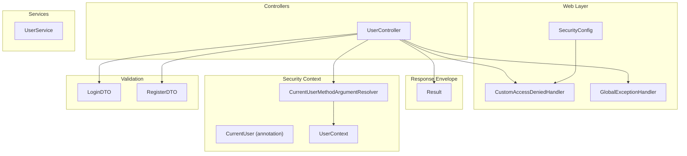
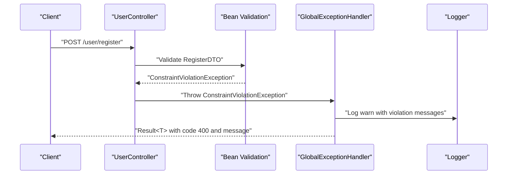
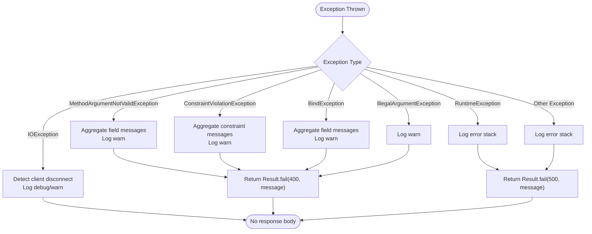
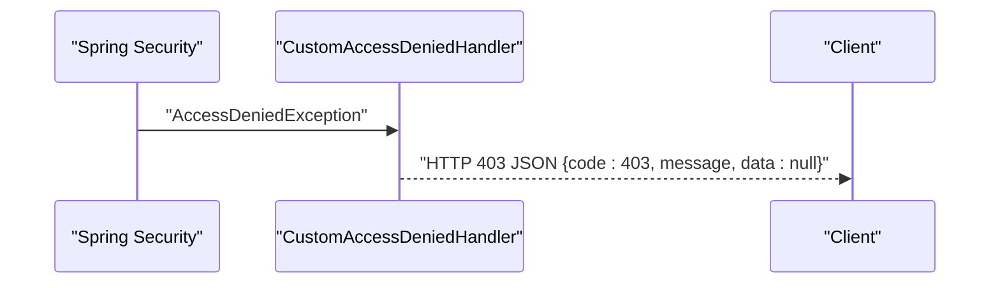
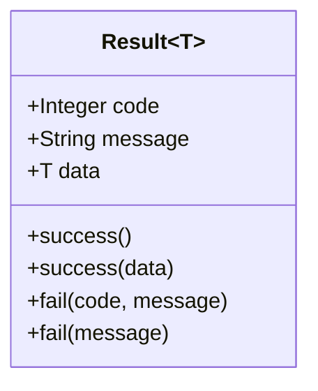
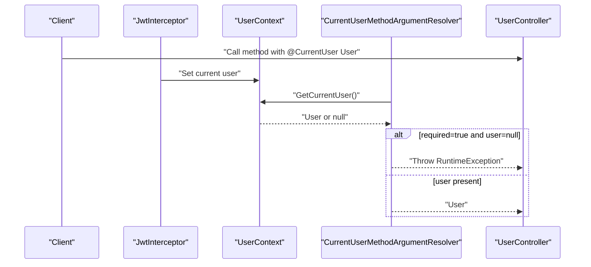
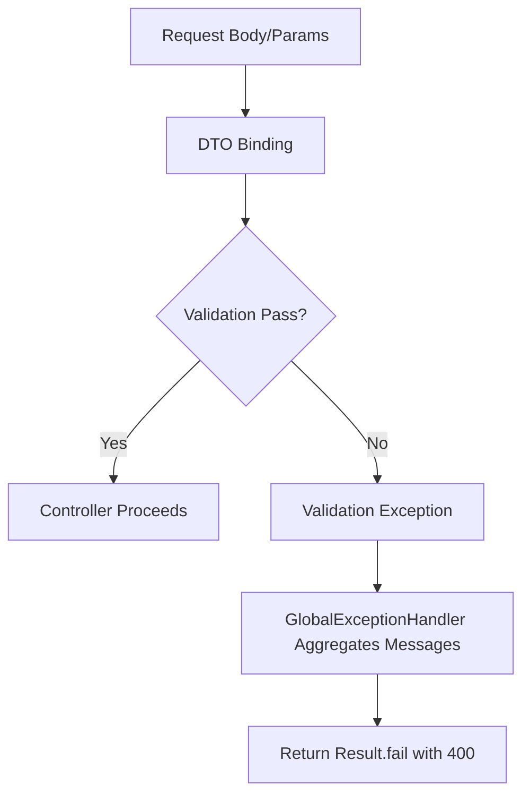
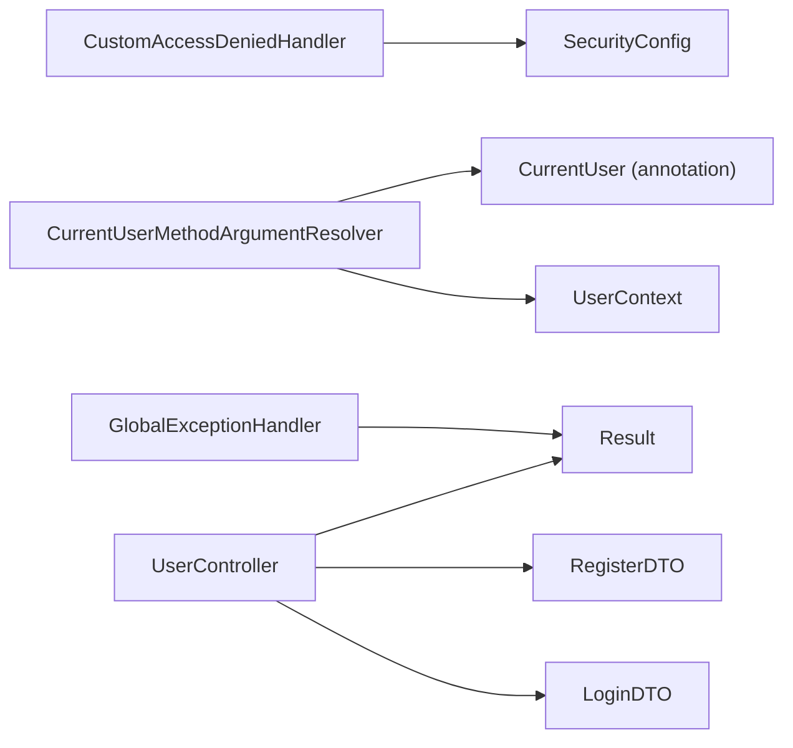

# Error Handling & Logging

<cite>
**Referenced Files in This Document**
- [GlobalExceptionHandler.java](file://backend/src/main/java/com/movie/backend/exception/GlobalExceptionHandler.java)
- [CustomAccessDeniedHandler.java](file://backend/src/main/java/com/movie/backend/config/CustomAccessDeniedHandler.java)
- [SecurityConfig.java](file://backend/src/main/java/com/movie/backend/config/SecurityConfig.java)
- [Result.java](file://backend/src/main/java/com/movie/backend/common/Result.java)
- [CurrentUserMethodArgumentResolver.java](file://backend/src/main/java/com/movie/backend/config/CurrentUserMethodArgumentResolver.java)
- [CurrentUser.java](file://backend/src/main/java/com/movie/backend/annotation/CurrentUser.java)
- [UserContext.java](file://backend/src/main/java/com/movie/backend/context/UserContext.java)
- [UserController.java](file://backend/src/main/java/com/movie/backend/controller/UserController.java)
- [LoginDTO.java](file://backend/src/main/java/com/movie/backend/dto/LoginDTO.java)
- [RegisterDTO.java](file://backend/src/main/java/com/movie/backend/dto/RegisterDTO.java)
- [application-dev.yml](file://backend/src/main/resources/application-dev.yml)
- [application.yml](file://backend/src/main/resources/application.yml)
</cite>

## Table of Contents
1. [Introduction](#introduction)
2. [Project Structure](#project-structure)
3. [Core Components](#core-components)
4. [Architecture Overview](#architecture-overview)
5. [Detailed Component Analysis](#detailed-component-analysis)
6. [Dependency Analysis](#dependency-analysis)
7. [Performance Considerations](#performance-considerations)
8. [Troubleshooting Guide](#troubleshooting-guide)
9. [Conclusion](#conclusion)
10. [Appendices](#appendices)

## Introduction
This document explains the error handling and logging implementation in the backend. It covers the global exception handler configuration, custom error responses, access denied handling, logging configuration, error tracking, debugging strategies, the current user argument resolver, parameter validation, and input sanitization. It also provides examples of error response formats, log levels, monitoring setup, error reporting mechanisms, user-friendly error messages, troubleshooting workflows, and security considerations for production monitoring.

## Project Structure
The error handling and logging features are implemented across several modules:
- Global exception handling via a centralized advice component
- Security configuration with a custom access denied handler
- Unified API response envelope
- Parameter injection for the current user
- DTOs with Bean Validation annotations
- Logging configuration in the development profile

**Diagram sources**
- [UserController.java](file://backend/src/main/java/com/movie/backend/controller/UserController.java#L1-L130)
- [GlobalExceptionHandler.java](file://backend/src/main/java/com/movie/backend/exception/GlobalExceptionHandler.java#L1-L102)
- [CustomAccessDeniedHandler.java](file://backend/src/main/java/com/movie/backend/config/CustomAccessDeniedHandler.java#L1-L27)
- [SecurityConfig.java](file://backend/src/main/java/com/movie/backend/config/SecurityConfig.java#L1-L51)
- [Result.java](file://backend/src/main/java/com/movie/backend/common/Result.java#L1-L43)
- [CurrentUserMethodArgumentResolver.java](file://backend/src/main/java/com/movie/backend/config/CurrentUserMethodArgumentResolver.java#L1-L51)
- [CurrentUser.java](file://backend/src/main/java/com/movie/backend/annotation/CurrentUser.java#L1-L29)
- [UserContext.java](file://backend/src/main/java/com/movie/backend/context/UserContext.java#L1-L44)
- [LoginDTO.java](file://backend/src/main/java/com/movie/backend/dto/LoginDTO.java#L1-L19)
- [RegisterDTO.java](file://backend/src/main/java/com/movie/backend/dto/RegisterDTO.java#L1-L34)

**Section sources**
- [application.yml](file://backend/src/main/resources/application.yml#L1-L4)
- [application-dev.yml](file://backend/src/main/resources/application-dev.yml#L52-L57)

## Core Components
- GlobalExceptionHandler: Centralized exception handling for validation errors, binding errors, illegal arguments, IO interruptions, runtime exceptions, and uncaught exceptions. Returns unified Result envelopes with appropriate HTTP semantics.
- CustomAccessDeniedHandler: Converts insufficient privilege scenarios into JSON responses with 403 status.
- SecurityConfig: Integrates the custom access denied handler and disables CSRF/form login for stateless JWT.
- Result<T>: Standardized response envelope with code, message, and data fields.
- CurrentUserMethodArgumentResolver: Injects the current user into controller method parameters annotated with @CurrentUser.
- DTOs with validation: LoginDTO and RegisterDTO define validation constraints for request parameters.
- Logging configuration: Development profile sets package-specific log levels.

**Section sources**
- [GlobalExceptionHandler.java](file://backend/src/main/java/com/movie/backend/exception/GlobalExceptionHandler.java#L1-L102)
- [CustomAccessDeniedHandler.java](file://backend/src/main/java/com/movie/backend/config/CustomAccessDeniedHandler.java#L1-L27)
- [SecurityConfig.java](file://backend/src/main/java/com/movie/backend/config/SecurityConfig.java#L1-L51)
- [Result.java](file://backend/src/main/java/com/movie/backend/common/Result.java#L1-L43)
- [CurrentUserMethodArgumentResolver.java](file://backend/src/main/java/com/movie/backend/config/CurrentUserMethodArgumentResolver.java#L1-L51)
- [CurrentUser.java](file://backend/src/main/java/com/movie/backend/annotation/CurrentUser.java#L1-L29)
- [UserContext.java](file://backend/src/main/java/com/movie/backend/context/UserContext.java#L1-L44)
- [LoginDTO.java](file://backend/src/main/java/com/movie/backend/dto/LoginDTO.java#L1-L19)
- [RegisterDTO.java](file://backend/src/main/java/com/movie/backend/dto/RegisterDTO.java#L1-L34)
- [application-dev.yml](file://backend/src/main/resources/application-dev.yml#L52-L57)

## Architecture Overview
The error handling pipeline integrates with Spring MVC and Spring Security:
- Controllers return Result<T> for successful outcomes.
- Validation constraints on DTOs trigger binding/validation exceptions handled centrally.
- Security denies access via a custom handler returning JSON 403.
- GlobalExceptionHandler standardizes error responses and logs at appropriate levels.

**Diagram sources**
- [UserController.java](file://backend/src/main/java/com/movie/backend/controller/UserController.java#L39-L43)
- [RegisterDTO.java](file://backend/src/main/java/com/movie/backend/dto/RegisterDTO.java#L1-L34)
- [GlobalExceptionHandler.java](file://backend/src/main/java/com/movie/backend/exception/GlobalExceptionHandler.java#L38-L45)

## Detailed Component Analysis

### Global Exception Handler
- Handles MethodArgumentNotValidException for @RequestBody validation failures, aggregating field-level messages and returning a 400 Result.
- Handles ConstraintViolationException for @RequestParam/@PathVariable validations, returning a 400 Result.
- Handles BindException for form binding failures, returning a 400 Result.
- Handles IllegalArgumentException for business/illegal argument errors, returning a 400 Result.
- Handles IOException with special handling for client-initiated disconnects (logs at debug or warn depending on message pattern) and does not send a response body.
- Handles RuntimeException with 500 Result and logs error stack traces.
- Handles generic Exception with 500 Result and logs error stack traces.

**Diagram sources**
- [GlobalExceptionHandler.java](file://backend/src/main/java/com/movie/backend/exception/GlobalExceptionHandler.java#L26-L99)

**Section sources**
- [GlobalExceptionHandler.java](file://backend/src/main/java/com/movie/backend/exception/GlobalExceptionHandler.java#L26-L99)

### Custom Access Denied Handler
- Intercepts AccessDeniedException during authorization checks.
- Writes a JSON payload with code 403, a fixed message indicating insufficient privileges, and null data.
- Sets HTTP status to 403 and content type to application/json.

**Diagram sources**
- [CustomAccessDeniedHandler.java](file://backend/src/main/java/com/movie/backend/config/CustomAccessDeniedHandler.java#L19-L25)
- [SecurityConfig.java](file://backend/src/main/java/com/movie/backend/config/SecurityConfig.java#L44-L46)

**Section sources**
- [CustomAccessDeniedHandler.java](file://backend/src/main/java/com/movie/backend/config/CustomAccessDeniedHandler.java#L19-L25)
- [SecurityConfig.java](file://backend/src/main/java/com/movie/backend/config/SecurityConfig.java#L44-L46)

### Security Configuration
- Disables CSRF and form/basic authentication.
- Sets session policy to stateless.
- Permits all requests at the HTTP level; authorization enforced via JWT interceptor and method-level annotations.
- Configures the custom access denied handler.

**Section sources**
- [SecurityConfig.java](file://backend/src/main/java/com/movie/backend/config/SecurityConfig.java#L24-L49)

### Unified Response Envelope
- Result<T> encapsulates code, message, and data.
- Provides convenience constructors for success and failure responses.
- Used by controllers and exception handlers to maintain consistent API responses.

**Diagram sources**
- [Result.java](file://backend/src/main/java/com/movie/backend/common/Result.java#L8-L42)

**Section sources**
- [Result.java](file://backend/src/main/java/com/movie/backend/common/Result.java#L8-L42)

### Current User Argument Resolver
- Supports parameters annotated with @CurrentUser and typed as User.
- Retrieves the current user from UserContext.
- Throws a runtime exception if the user is required but missing (e.g., invalid/expired token).

**Diagram sources**
- [CurrentUserMethodArgumentResolver.java](file://backend/src/main/java/com/movie/backend/config/CurrentUserMethodArgumentResolver.java#L34-L49)
- [UserContext.java](file://backend/src/main/java/com/movie/backend/context/UserContext.java#L24-L26)
- [CurrentUser.java](file://backend/src/main/java/com/movie/backend/annotation/CurrentUser.java#L22-L27)

**Section sources**
- [CurrentUserMethodArgumentResolver.java](file://backend/src/main/java/com/movie/backend/config/CurrentUserMethodArgumentResolver.java#L24-L49)
- [CurrentUser.java](file://backend/src/main/java/com/movie/backend/annotation/CurrentUser.java#L22-L27)
- [UserContext.java](file://backend/src/main/java/com/movie/backend/context/UserContext.java#L17-L26)

### Parameter Validation and DTOs
- LoginDTO enforces non-blank constraints for id and password.
- RegisterDTO enforces non-blank, size, and email constraints for id, password, nickname, and optional email validation.
- Validation triggers ConstraintViolationException or MethodArgumentNotValidException, which are handled centrally.

**Diagram sources**
- [LoginDTO.java](file://backend/src/main/java/com/movie/backend/dto/LoginDTO.java#L13-L18)
- [RegisterDTO.java](file://backend/src/main/java/com/movie/backend/dto/RegisterDTO.java#L15-L30)
- [GlobalExceptionHandler.java](file://backend/src/main/java/com/movie/backend/exception/GlobalExceptionHandler.java#L26-L45)

**Section sources**
- [LoginDTO.java](file://backend/src/main/java/com/movie/backend/dto/LoginDTO.java#L13-L18)
- [RegisterDTO.java](file://backend/src/main/java/com/movie/backend/dto/RegisterDTO.java#L15-L30)
- [GlobalExceptionHandler.java](file://backend/src/main/java/com/movie/backend/exception/GlobalExceptionHandler.java#L26-L45)

### Logging Configuration and Debugging Strategies
- Logging levels configured in the development profile set the backend package to DEBUG and Spring packages to INFO.
- GlobalExceptionHandler logs at warn for validation/binding/illegal argument errors and at error for runtime/uncaught exceptions.
- IO exceptions are logged at debug when detected as client-initiated disconnects; otherwise at warn.

Recommended debugging steps:
- Enable DEBUG logs for the backend package during local testing.
- Reproduce validation failures to confirm aggregated messages in 400 responses.
- Simulate client disconnects to verify debug-level IO logs.
- Use consistent error messages returned by Result.fail for frontend UX.

**Section sources**
- [application-dev.yml](file://backend/src/main/resources/application-dev.yml#L52-L57)
- [GlobalExceptionHandler.java](file://backend/src/main/java/com/movie/backend/exception/GlobalExceptionHandler.java#L31-L32)
- [GlobalExceptionHandler.java](file://backend/src/main/java/com/movie/backend/exception/GlobalExceptionHandler.java#L43-L44)
- [GlobalExceptionHandler.java](file://backend/src/main/java/com/movie/backend/exception/GlobalExceptionHandler.java#L55-L56)
- [GlobalExceptionHandler.java](file://backend/src/main/java/com/movie/backend/exception/GlobalExceptionHandler.java#L64-L65)
- [GlobalExceptionHandler.java](file://backend/src/main/java/com/movie/backend/exception/GlobalExceptionHandler.java#L75-L78)

## Dependency Analysis
- GlobalExceptionHandler depends on Result<T> for response formatting and uses SLF4J for logging.
- CustomAccessDeniedHandler is wired by SecurityConfig to handle authorization failures.
- CurrentUserMethodArgumentResolver depends on UserContext and @CurrentUser annotation.
- Controllers depend on DTOs for validation and on Result<T> for responses.

**Diagram sources**
- [GlobalExceptionHandler.java](file://backend/src/main/java/com/movie/backend/exception/GlobalExceptionHandler.java#L3-L4)
- [Result.java](file://backend/src/main/java/com/movie/backend/common/Result.java#L1-L43)
- [CustomAccessDeniedHandler.java](file://backend/src/main/java/com/movie/backend/config/CustomAccessDeniedHandler.java#L1-L27)
- [SecurityConfig.java](file://backend/src/main/java/com/movie/backend/config/SecurityConfig.java#L22-L22)
- [CurrentUserMethodArgumentResolver.java](file://backend/src/main/java/com/movie/backend/config/CurrentUserMethodArgumentResolver.java#L3-L11)
- [UserContext.java](file://backend/src/main/java/com/movie/backend/context/UserContext.java#L1-L44)
- [CurrentUser.java](file://backend/src/main/java/com/movie/backend/annotation/CurrentUser.java#L1-L29)
- [UserController.java](file://backend/src/main/java/com/movie/backend/controller/UserController.java#L1-L130)
- [LoginDTO.java](file://backend/src/main/java/com/movie/backend/dto/LoginDTO.java#L1-L19)
- [RegisterDTO.java](file://backend/src/main/java/com/movie/backend/dto/RegisterDTO.java#L1-L34)

**Section sources**
- [GlobalExceptionHandler.java](file://backend/src/main/java/com/movie/backend/exception/GlobalExceptionHandler.java#L3-L4)
- [CustomAccessDeniedHandler.java](file://backend/src/main/java/com/movie/backend/config/CustomAccessDeniedHandler.java#L1-L27)
- [SecurityConfig.java](file://backend/src/main/java/com/movie/backend/config/SecurityConfig.java#L22-L22)
- [CurrentUserMethodArgumentResolver.java](file://backend/src/main/java/com/movie/backend/config/CurrentUserMethodArgumentResolver.java#L3-L11)
- [UserContext.java](file://backend/src/main/java/com/movie/backend/context/UserContext.java#L1-L44)
- [CurrentUser.java](file://backend/src/main/java/com/movie/backend/annotation/CurrentUser.java#L1-L29)
- [UserController.java](file://backend/src/main/java/com/movie/backend/controller/UserController.java#L1-L130)
- [LoginDTO.java](file://backend/src/main/java/com/movie/backend/dto/LoginDTO.java#L1-L19)
- [RegisterDTO.java](file://backend/src/main/java/com/movie/backend/dto/RegisterDTO.java#L1-L34)

## Performance Considerations
- Centralized exception handling avoids repetitive try/catch blocks and ensures consistent error responses.
- Logging at warn/error levels helps identify hotspots without overwhelming logs.
- Avoid returning sensitive information in error messages to prevent information leakage.
- Keep IO exception handling lightweight; avoid heavy computations in error branches.

## Troubleshooting Guide
Common scenarios and resolutions:
- Validation errors on registration/login:
  - Confirm DTO constraints and ensure clients send required fields.
  - Review aggregated messages in 400 responses.
- Access denied errors:
  - Verify JWT presence and validity; ensure method-level authorization is configured as intended.
- Client disconnects:
  - Expect debug logs for client-initiated cancellations; no response body is sent intentionally.
- Runtime errors:
  - Inspect error logs for stack traces; ensure controllers do not swallow exceptions unnecessarily.

Operational tips:
- Increase log verbosity locally to capture detailed warnings and errors.
- Use curl or Postman to simulate malformed requests and verify 400 responses.
- Test authorization paths to confirm 403 responses with JSON bodies.

**Section sources**
- [GlobalExceptionHandler.java](file://backend/src/main/java/com/movie/backend/exception/GlobalExceptionHandler.java#L31-L32)
- [GlobalExceptionHandler.java](file://backend/src/main/java/com/movie/backend/exception/GlobalExceptionHandler.java#L43-L44)
- [GlobalExceptionHandler.java](file://backend/src/main/java/com/movie/backend/exception/GlobalExceptionHandler.java#L55-L56)
- [GlobalExceptionHandler.java](file://backend/src/main/java/com/movie/backend/exception/GlobalExceptionHandler.java#L64-L65)
- [GlobalExceptionHandler.java](file://backend/src/main/java/com/movie/backend/exception/GlobalExceptionHandler.java#L75-L78)
- [CustomAccessDeniedHandler.java](file://backend/src/main/java/com/movie/backend/config/CustomAccessDeniedHandler.java#L22-L25)

## Conclusion
The backend implements a robust, centralized error handling and logging strategy. Validation constraints on DTOs produce consistent 400 responses, security denials yield 403 JSON payloads, and unexpected errors are uniformly reported with 500 responses. Logging is tuned for development while remaining secure and informative. The current user argument resolver simplifies controller logic and improves security posture by centralizing user retrieval and enforcement.

## Appendices

### Error Response Formats
- Successful response envelope:
  - Fields: code, message, data
  - Example: code 200, message "Success", data as per endpoint
- Validation error response:
  - Code: 400
  - Message: aggregated validation messages
  - Data: null
- Access denied response:
  - Code: 403
  - Message: fixed message indicating insufficient privileges
  - Data: null
- Runtime/system error response:
  - Code: 500
  - Message: error description or system error
  - Data: null

**Section sources**
- [Result.java](file://backend/src/main/java/com/movie/backend/common/Result.java#L27-L41)
- [GlobalExceptionHandler.java](file://backend/src/main/java/com/movie/backend/exception/GlobalExceptionHandler.java#L31-L32)
- [GlobalExceptionHandler.java](file://backend/src/main/java/com/movie/backend/exception/GlobalExceptionHandler.java#L43-L44)
- [GlobalExceptionHandler.java](file://backend/src/main/java/com/movie/backend/exception/GlobalExceptionHandler.java#L55-L56)
- [GlobalExceptionHandler.java](file://backend/src/main/java/com/movie/backend/exception/GlobalExceptionHandler.java#L64-L65)
- [GlobalExceptionHandler.java](file://backend/src/main/java/com/movie/backend/exception/GlobalExceptionHandler.java#L88-L89)
- [GlobalExceptionHandler.java](file://backend/src/main/java/com/movie/backend/exception/GlobalExceptionHandler.java#L97-L98)
- [CustomAccessDeniedHandler.java](file://backend/src/main/java/com/movie/backend/config/CustomAccessDeniedHandler.java#L22-L25)

### Log Levels and Monitoring Setup
- Development profile:
  - Package-level logging for the backend module set to DEBUG
  - Spring framework packages set to INFO
- Monitoring recommendations:
  - Integrate structured logging (JSON) for production environments
  - Ship logs to a centralized log collector (e.g., ELK/Fluentd/Loki)
  - Set up alerts for warn/error spikes and repeated 500 errors
  - Correlate client request IDs across logs for end-to-end tracing

**Section sources**
- [application-dev.yml](file://backend/src/main/resources/application-dev.yml#L52-L57)

### Security Considerations for Error Handling
- Do not expose internal stack traces or sensitive data in error messages.
- Treat client disconnects as normal events; avoid logging sensitive context.
- Ensure access denied messages are generic to avoid leaking authorization details.
- Validate and sanitize all inputs; rely on DTO constraints to reduce risk.