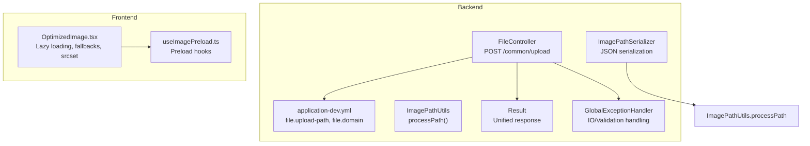
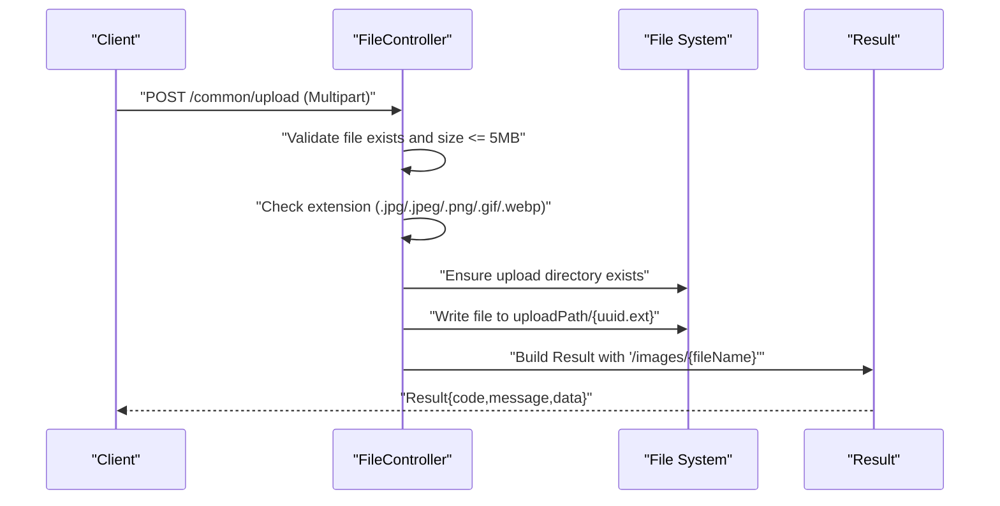
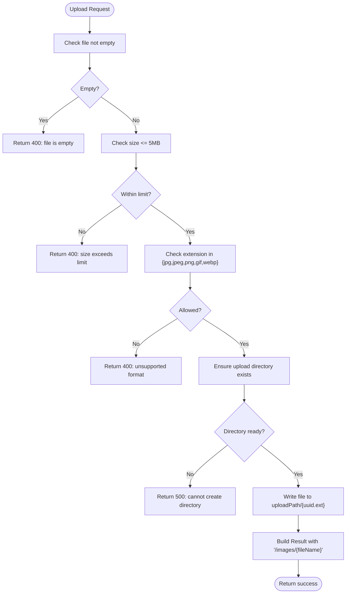
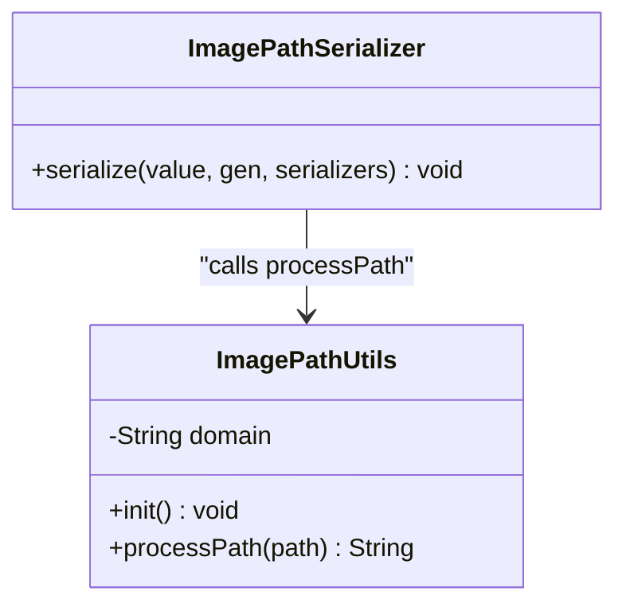
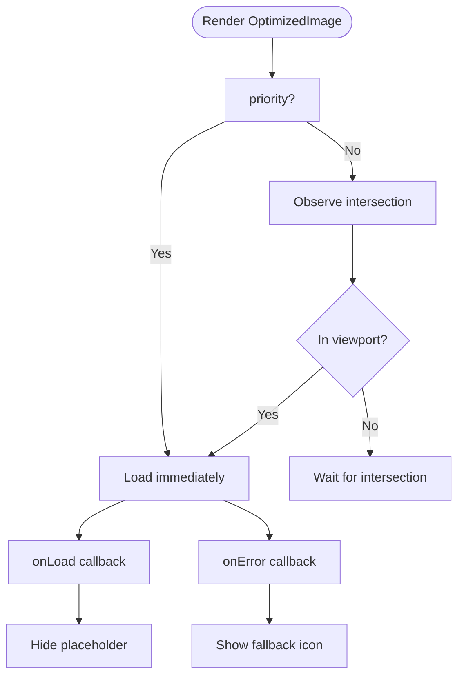
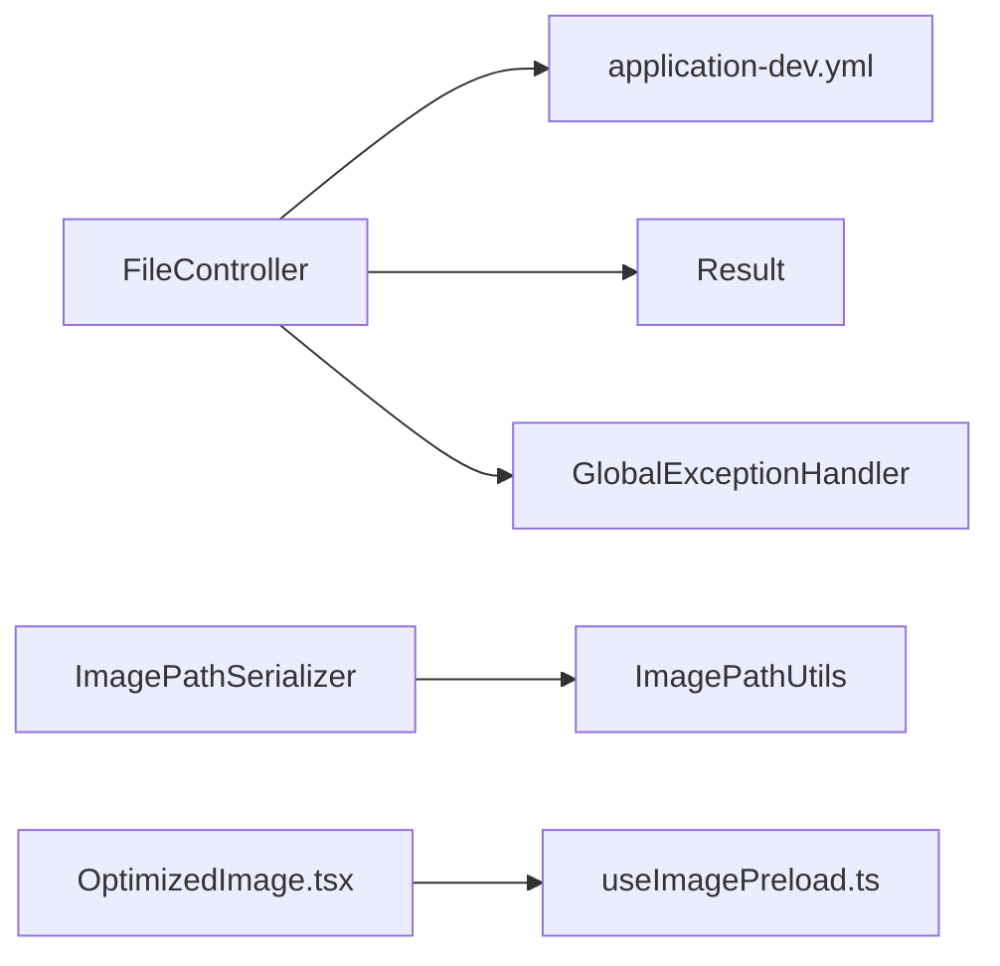

# File Upload & Media Management

<cite>
**Referenced Files in This Document**
- [FileController.java](file://backend/src/main/java/com/movie/backend/controller/FileController.java)
- [ImagePathUtils.java](file://backend/src/main/java/com/movie/backend/utils/ImagePathUtils.java)
- [ImagePathSerializer.java](file://backend/src/main/java/com/movie/backend/config/ImagePathSerializer.java)
- [application-dev.yml](file://backend/src/main/resources/application-dev.yml)
- [application.yml](file://backend/src/main/resources/application.yml)
- [Result.java](file://backend/src/main/java/com/movie/backend/common/Result.java)
- [GlobalExceptionHandler.java](file://backend/src/main/java/com/movie/backend/exception/GlobalExceptionHandler.java)
- [OptimizedImage.tsx](file://movie-review-web/src/components/OptimizedImage.tsx)
- [useImagePreload.ts](file://movie-review-web/src/utils/useImagePreload.ts)
- [api-docs.json](file://movie-review-web/backend_api_doc/api-docs.json)
</cite>

## Table of Contents
1. [Introduction](#introduction)
2. [Project Structure](#project-structure)
3. [Core Components](#core-components)
4. [Architecture Overview](#architecture-overview)
5. [Detailed Component Analysis](#detailed-component-analysis)
6. [Dependency Analysis](#dependency-analysis)
7. [Performance Considerations](#performance-considerations)
8. [Troubleshooting Guide](#troubleshooting-guide)
9. [Conclusion](#conclusion)
10. [Appendices](#appendices)

## Introduction
This document explains the file upload and media management functionality in the project. It covers the backend file upload endpoint, storage configuration, image path utilities, and the frontend image optimization components. It also documents supported file types, size limits, validation rules, error handling, and security considerations. Finally, it outlines current media optimization capabilities, CDN integration options, and performance optimization strategies.

## Project Structure
The file upload and media management features span the backend Spring Boot application and the frontend React application:
- Backend: REST endpoint for uploading images, configuration for storage and domain, and utilities for image path processing.
- Frontend: React components and utilities for optimized image loading and responsive image support.

**Diagram sources**
- [FileController.java](file://backend/src/main/java/com/movie/backend/controller/FileController.java#L23-L71)
- [application-dev.yml](file://backend/src/main/resources/application-dev.yml#L58-L60)
- [ImagePathUtils.java](file://backend/src/main/java/com/movie/backend/utils/ImagePathUtils.java#L27-L37)
- [ImagePathSerializer.java](file://backend/src/main/java/com/movie/backend/config/ImagePathSerializer.java#L13-L18)
- [Result.java](file://backend/src/main/java/com/movie/backend/common/Result.java#L8-L42)
- [GlobalExceptionHandler.java](file://backend/src/main/java/com/movie/backend/exception/GlobalExceptionHandler.java#L21-L101)
- [OptimizedImage.tsx](file://movie-review-web/src/components/OptimizedImage.tsx#L17-L126)
- [useImagePreload.ts](file://movie-review-web/src/utils/useImagePreload.ts#L7-L28)

**Section sources**
- [FileController.java](file://backend/src/main/java/com/movie/backend/controller/FileController.java#L23-L71)
- [application-dev.yml](file://backend/src/main/resources/application-dev.yml#L58-L60)
- [application.yml](file://backend/src/main/resources/application.yml#L1-L4)
- [OptimizedImage.tsx](file://movie-review-web/src/components/OptimizedImage.tsx#L17-L126)
- [useImagePreload.ts](file://movie-review-web/src/utils/useImagePreload.ts#L7-L28)

## Core Components
- File upload endpoint: Accepts multipart form data, validates file type and size, persists the file to disk, and returns a relative URL path.
- Storage configuration: Defines upload directory and domain used to build absolute image URLs.
- Image path utilities: Ensures consistent image URLs by prepending configured domain when needed.
- Unified response: Standardizes API responses for upload and other operations.
- Frontend image optimization: Provides lazy loading, fallback icons, aspect ratio control, and placeholders.

**Section sources**
- [FileController.java](file://backend/src/main/java/com/movie/backend/controller/FileController.java#L25-L71)
- [application-dev.yml](file://backend/src/main/resources/application-dev.yml#L58-L60)
- [ImagePathUtils.java](file://backend/src/main/java/com/movie/backend/utils/ImagePathUtils.java#L11-L37)
- [Result.java](file://backend/src/main/java/com/movie/backend/common/Result.java#L27-L41)
- [OptimizedImage.tsx](file://movie-review-web/src/components/OptimizedImage.tsx#L17-L126)

## Architecture Overview
The upload flow integrates backend validation and persistence with frontend image optimization. The backend stores files under a configurable path and returns a relative URL. The frontend receives the URL and renders images with lazy loading and responsive attributes.

**Diagram sources**
- [FileController.java](file://backend/src/main/java/com/movie/backend/controller/FileController.java#L33-L71)
- [Result.java](file://backend/src/main/java/com/movie/backend/common/Result.java#L27-L37)
- [application-dev.yml](file://backend/src/main/resources/application-dev.yml#L58-L60)

## Detailed Component Analysis

### Backend File Upload Endpoint
- Endpoint: POST /common/upload
- Supported media types: multipart/form-data
- Validation rules:
  - Rejects empty files.
  - Enforces maximum file size of 5 MB.
  - Restricts file extensions to JPG, JPEG, PNG, GIF, WEBP.
- Storage:
  - Uses configuration property file.upload-path for the base directory.
  - Creates the directory if missing.
  - Writes uploaded files with a UUID-based filename preserving the original extension.
- Response:
  - Returns a unified Result with a relative URL path under /images/.

**Diagram sources**
- [FileController.java](file://backend/src/main/java/com/movie/backend/controller/FileController.java#L37-L70)
- [application-dev.yml](file://backend/src/main/resources/application-dev.yml#L58-L60)

**Section sources**
- [FileController.java](file://backend/src/main/java/com/movie/backend/controller/FileController.java#L25-L71)
- [application-dev.yml](file://backend/src/main/resources/application-dev.yml#L33-L36)
- [Result.java](file://backend/src/main/java/com/movie/backend/common/Result.java#L27-L37)

### Storage Configuration
- file.upload-path: Base directory for storing uploaded files. Defaults to ./uploaded/ if not configured.
- file.domain: Domain used to construct absolute image URLs. Combined with relative paths returned by the upload endpoint.
- Spring Boot multipart limits: Max file size and request size are set to 5 MB.

**Section sources**
- [application-dev.yml](file://backend/src/main/resources/application-dev.yml#L58-L60)
- [application-dev.yml](file://backend/src/main/resources/application-dev.yml#L33-L36)

### Image Path Utilities
- ImagePathUtils.processPath:
  - Returns null for null/empty input.
  - Returns input unchanged if it starts with http.
  - Otherwise, concatenates configured domain with a leading slash.
- ImagePathSerializer:
  - JSON serializer that automatically applies processPath to image path fields during serialization.

**Diagram sources**
- [ImagePathUtils.java](file://backend/src/main/java/com/movie/backend/utils/ImagePathUtils.java#L11-L37)
- [ImagePathSerializer.java](file://backend/src/main/java/com/movie/backend/config/ImagePathSerializer.java#L13-L18)

**Section sources**
- [ImagePathUtils.java](file://backend/src/main/java/com/movie/backend/utils/ImagePathUtils.java#L11-L37)
- [ImagePathSerializer.java](file://backend/src/main/java/com/movie/backend/config/ImagePathSerializer.java#L13-L18)

### Frontend Image Optimization
- OptimizedImage:
  - Lazy loads images using IntersectionObserver with a root margin for early loading.
  - Supports aspect ratio control via CSS aspect-ratio.
  - Provides fallback icon on error and a spinner placeholder while loading.
  - Generates srcset and sizes attributes (placeholder; backend does not yet implement resizing).
  - Priority prop disables lazy loading for above-the-fold images.
- useImagePreload:
  - Preloads single or multiple images and tracks loading completion.
  - Background preload utility to cache images without blocking rendering.

**Diagram sources**
- [OptimizedImage.tsx](file://movie-review-web/src/components/OptimizedImage.tsx#L35-L68)
- [OptimizedImage.tsx](file://movie-review-web/src/components/OptimizedImage.tsx#L105-L123)

**Section sources**
- [OptimizedImage.tsx](file://movie-review-web/src/components/OptimizedImage.tsx#L17-L126)
- [useImagePreload.ts](file://movie-review-web/src/utils/useImagePreload.ts#L7-L28)

### API Documentation Reference
- OpenAPI/Swagger describes the upload endpoint, including request body schema and response model.

**Section sources**
- [api-docs.json](file://movie-review-web/backend_api_doc/api-docs.json#L464-L495)

## Dependency Analysis
- FileController depends on:
  - Configuration properties for upload path and domain.
  - Result for standardized responses.
  - GlobalExceptionHandler for IO-related client disconnects.
- ImagePathUtils and ImagePathSerializer integrate with JSON serialization to normalize image URLs across the API.
- Frontend components depend on backend-provided relative URLs and optional responsive attributes.

**Diagram sources**
- [FileController.java](file://backend/src/main/java/com/movie/backend/controller/FileController.java#L25-L26)
- [application-dev.yml](file://backend/src/main/resources/application-dev.yml#L58-L60)
- [Result.java](file://backend/src/main/java/com/movie/backend/common/Result.java#L27-L37)
- [GlobalExceptionHandler.java](file://backend/src/main/java/com/movie/backend/exception/GlobalExceptionHandler.java#L71-L81)
- [ImagePathSerializer.java](file://backend/src/main/java/com/movie/backend/config/ImagePathSerializer.java#L13-L18)
- [ImagePathUtils.java](file://backend/src/main/java/com/movie/backend/utils/ImagePathUtils.java#L11-L18)
- [OptimizedImage.tsx](file://movie-review-web/src/components/OptimizedImage.tsx#L17-L126)
- [useImagePreload.ts](file://movie-review-web/src/utils/useImagePreload.ts#L7-L28)

**Section sources**
- [FileController.java](file://backend/src/main/java/com/movie/backend/controller/FileController.java#L25-L71)
- [application-dev.yml](file://backend/src/main/resources/application-dev.yml#L58-L60)
- [Result.java](file://backend/src/main/java/com/movie/backend/common/Result.java#L27-L41)
- [GlobalExceptionHandler.java](file://backend/src/main/java/com/movie/backend/exception/GlobalExceptionHandler.java#L71-L81)
- [ImagePathSerializer.java](file://backend/src/main/java/com/movie/backend/config/ImagePathSerializer.java#L13-L18)
- [ImagePathUtils.java](file://backend/src/main/java/com/movie/backend/utils/ImagePathUtils.java#L11-L37)
- [OptimizedImage.tsx](file://movie-review-web/src/components/OptimizedImage.tsx#L17-L126)
- [useImagePreload.ts](file://movie-review-web/src/utils/useImagePreload.ts#L7-L28)

## Performance Considerations
- Backend:
  - Limit file size to reduce memory pressure and disk I/O.
  - Store files under a dedicated directory to simplify cleanup and monitoring.
  - Consider asynchronous write operations for high-throughput scenarios.
- Frontend:
  - Lazy loading reduces initial payload and improves perceived performance.
  - Aspect ratio containers prevent layout shifts.
  - Preload critical images to avoid perceived latency.
  - Responsive srcset and sizes enable efficient delivery at appropriate resolutions.

[No sources needed since this section provides general guidance]

## Troubleshooting Guide
- Common errors:
  - Empty file: Returned when no file is provided.
  - Size exceeded: Returned when file exceeds 5 MB.
  - Unsupported format: Returned when extension is not among JPG/JPEG/PNG/GIF/WEBP.
  - Directory creation failure: Returned when upload directory cannot be created.
  - IO exceptions: Client disconnections are logged at debug level and suppressed from responses.
- Validation failures:
  - Parameter validation and binding errors are captured and returned with a 400 status.

**Section sources**
- [FileController.java](file://backend/src/main/java/com/movie/backend/controller/FileController.java#L37-L70)
- [GlobalExceptionHandler.java](file://backend/src/main/java/com/movie/backend/exception/GlobalExceptionHandler.java#L26-L81)
- [application-dev.yml](file://backend/src/main/resources/application-dev.yml#L33-L36)

## Conclusion
The system provides a straightforward, secure, and scalable file upload pipeline for images with clear validation and consistent URL handling. The frontend components offer robust image optimization and user experience enhancements. Future enhancements can include backend-side image resizing, CDN integration, and storage quotas to further improve performance and manageability.

[No sources needed since this section summarizes without analyzing specific files]

## Appendices

### Supported File Types and Size Limits
- Supported formats: JPG, JPEG, PNG, GIF, WEBP.
- Maximum file size: 5 MB.

**Section sources**
- [FileController.java](file://backend/src/main/java/com/movie/backend/controller/FileController.java#L28-L29)
- [application-dev.yml](file://backend/src/main/resources/application-dev.yml#L33-L36)

### File Naming Strategy and Storage Location
- Naming: UUID-based filename preserving original extension.
- Storage: Configurable upload directory via file.upload-path; defaults to ./uploaded/ if unspecified.

**Section sources**
- [FileController.java](file://backend/src/main/java/com/movie/backend/controller/FileController.java#L56-L60)
- [application-dev.yml](file://backend/src/main/resources/application-dev.yml#L58-L60)

### Image Path Construction
- Relative paths returned by the upload endpoint are combined with the configured domain to produce absolute URLs.

**Section sources**
- [FileController.java](file://backend/src/main/java/com/movie/backend/controller/FileController.java#L64-L66)
- [ImagePathUtils.java](file://backend/src/main/java/com/movie/backend/utils/ImagePathUtils.java#L27-L37)

### CDN Integration Options
- Current state: Backend returns relative paths; frontend renders images directly from the configured domain.
- Recommended approach: Configure a CDN origin to the backend domain and apply CDN caching policies for static images. Update file.domain to point to the CDN hostname for global distribution.

[No sources needed since this section provides general guidance]

### Media Optimization Techniques
- Backend: Implement image resizing and format conversion endpoints (e.g., query parameters w, h, q, f).
- Frontend: Enable srcset generation and responsive image delivery when backend supports it.

[No sources needed since this section provides general guidance]

### Cleanup, Quotas, and Monitoring
- Cleanup: Periodic scans of the upload directory to remove orphaned files and expired temporary uploads.
- Quotas: Track total disk usage per user or globally and reject uploads exceeding limits.
- Monitoring: Log upload metrics, storage utilization, and error rates.

[No sources needed since this section provides general guidance]