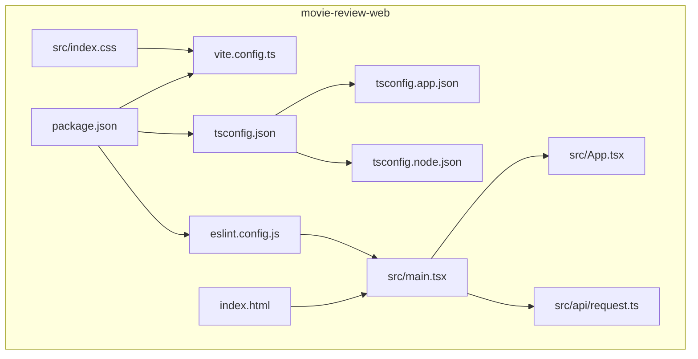
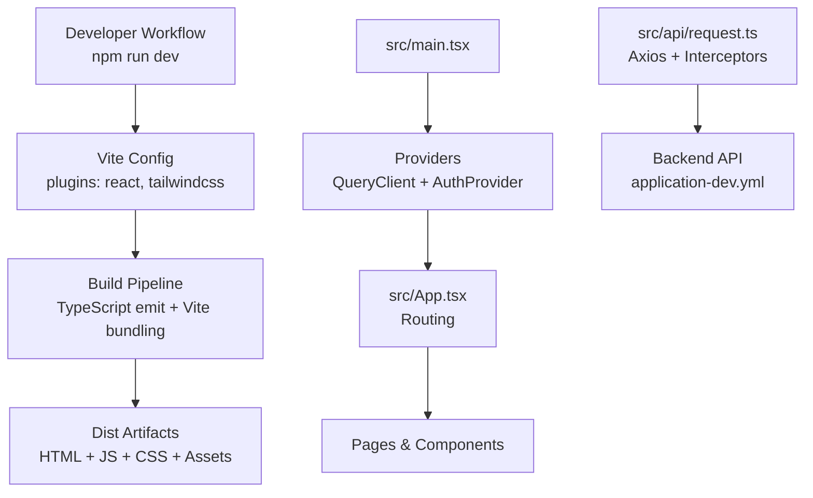
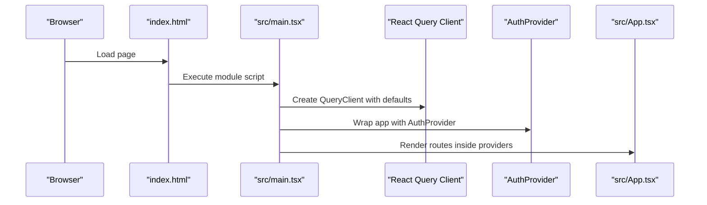
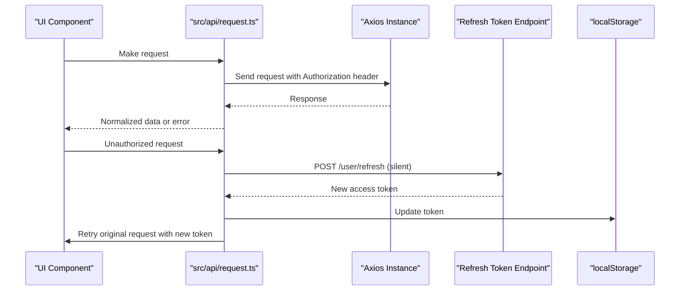
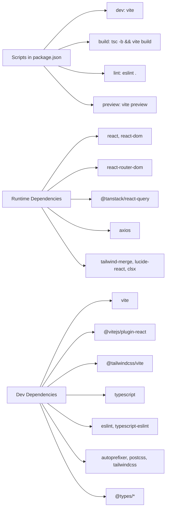

# Build Configuration & Development Setup

<cite>
**Referenced Files in This Document**
- [package.json](file://movie-review-web/package.json)
- [vite.config.ts](file://movie-review-web/vite.config.ts)
- [tsconfig.json](file://movie-review-web/tsconfig.json)
- [tsconfig.app.json](file://movie-review-web/tsconfig.app.json)
- [tsconfig.node.json](file://movie-review-web/tsconfig.node.json)
- [eslint.config.js](file://movie-review-web/eslint.config.js)
- [index.html](file://movie-review-web/index.html)
- [src/main.tsx](file://movie-review-web/src/main.tsx)
- [src/App.tsx](file://movie-review-web/src/App.tsx)
- [src/index.css](file://movie-review-web/src/index.css)
- [src/api/request.ts](file://movie-review-web/src/api/request.ts)
- [backend/src/main/resources/application-dev.yml](file://backend/src/main/resources/application-dev.yml)
</cite>

## Table of Contents
1. [Introduction](#introduction)
2. [Project Structure](#project-structure)
3. [Core Components](#core-components)
4. [Architecture Overview](#architecture-overview)
5. [Detailed Component Analysis](#detailed-component-analysis)
6. [Dependency Analysis](#dependency-analysis)
7. [Performance Considerations](#performance-considerations)
8. [Troubleshooting Guide](#troubleshooting-guide)
9. [Conclusion](#conclusion)
10. [Appendices](#appendices)

## Introduction
This document explains the frontend build configuration and development environment setup for the movie review web application. It covers Vite configuration, TypeScript and ESLint settings, asset and HTML template handling, development server behavior, and production build preparation. It also provides guidance for environment configuration, dependency management, and best practices for reliable builds and smooth development workflows.

## Project Structure
The frontend is organized under the movie-review-web directory with the following key areas:
- Configuration: Vite, TypeScript, ESLint, and Tailwind CSS integrations
- Source code: React application entry, routing, context providers, and page components
- Assets and styles: Static assets and CSS with Tailwind layers
- API client: Axios-based HTTP client with interceptors and token refresh logic
- Backend integration: Environment-specific configuration for local development

**Diagram sources**
- [package.json](file://movie-review-web/package.json#L1-L42)
- [vite.config.ts](file://movie-review-web/vite.config.ts#L1-L11)
- [tsconfig.json](file://movie-review-web/tsconfig.json#L1-L8)
- [tsconfig.app.json](file://movie-review-web/tsconfig.app.json#L1-L29)
- [tsconfig.node.json](file://movie-review-web/tsconfig.node.json#L1-L27)
- [eslint.config.js](file://movie-review-web/eslint.config.js#L1-L24)
- [index.html](file://movie-review-web/index.html#L1-L15)
- [src/main.tsx](file://movie-review-web/src/main.tsx#L1-L41)
- [src/App.tsx](file://movie-review-web/src/App.tsx#L1-L50)
- [src/index.css](file://movie-review-web/src/index.css#L1-L187)
- [src/api/request.ts](file://movie-review-web/src/api/request.ts#L1-L108)

**Section sources**
- [package.json](file://movie-review-web/package.json#L1-L42)
- [vite.config.ts](file://movie-review-web/vite.config.ts#L1-L11)
- [tsconfig.json](file://movie-review-web/tsconfig.json#L1-L8)
- [tsconfig.app.json](file://movie-review-web/tsconfig.app.json#L1-L29)
- [tsconfig.node.json](file://movie-review-web/tsconfig.node.json#L1-L27)
- [eslint.config.js](file://movie-review-web/eslint.config.js#L1-L24)
- [index.html](file://movie-review-web/index.html#L1-L15)
- [src/main.tsx](file://movie-review-web/src/main.tsx#L1-L41)
- [src/App.tsx](file://movie-review-web/src/App.tsx#L1-L50)
- [src/index.css](file://movie-review-web/src/index.css#L1-L187)
- [src/api/request.ts](file://movie-review-web/src/api/request.ts#L1-L108)

## Core Components
- Vite configuration integrates React Fast Refresh and Tailwind CSS via dedicated plugins. It defines the plugin pipeline and enables modern bundler features.
- TypeScript configuration splits app and node environments into separate tsconfig files, enabling strictness and bundler-aware module resolution.
- ESLint flat config enforces recommended rules for TypeScript, React Hooks, React Refresh, and browser globals.
- HTML template provides a minimal root container and script entry for the React application.
- Application bootstrap initializes React Query with caching and retry policies, wraps the app in providers, and mounts the root element.
- Styling leverages Tailwind layers and a custom dark theme with CSS variables for consistent design tokens.

**Section sources**
- [vite.config.ts](file://movie-review-web/vite.config.ts#L1-L11)
- [tsconfig.app.json](file://movie-review-web/tsconfig.app.json#L1-L29)
- [tsconfig.node.json](file://movie-review-web/tsconfig.node.json#L1-L27)
- [eslint.config.js](file://movie-review-web/eslint.config.js#L1-L24)
- [index.html](file://movie-review-web/index.html#L1-L15)
- [src/main.tsx](file://movie-review-web/src/main.tsx#L1-L41)
- [src/index.css](file://movie-review-web/src/index.css#L1-L187)

## Architecture Overview
The build and runtime architecture connects configuration files to the application entry and routing layer. Vite compiles TypeScript/JSX with React Fast Refresh, injects Tailwind CSS, and serves assets. The app initializes React Query and authentication context, while the API client handles base URL, auth headers, and token refresh logic.

**Diagram sources**
- [vite.config.ts](file://movie-review-web/vite.config.ts#L1-L11)
- [src/main.tsx](file://movie-review-web/src/main.tsx#L1-L41)
- [src/App.tsx](file://movie-review-web/src/App.tsx#L1-L50)
- [src/api/request.ts](file://movie-review-web/src/api/request.ts#L1-L108)
- [backend/src/main/resources/application-dev.yml](file://backend/src/main/resources/application-dev.yml#L49-L66)

## Detailed Component Analysis

### Vite Configuration
- Plugins: React Fast Refresh and Tailwind CSS are registered to enable JSX transformations and CSS processing.
- Purpose: Streamline development with HMR and ensure Tailwind utilities are processed during dev and build.
- Impact: Reduces boilerplate and aligns with modern React tooling expectations.

**Section sources**
- [vite.config.ts](file://movie-review-web/vite.config.ts#L1-L11)

### TypeScript Configuration
- Root tsconfig aggregates app and node configurations for efficient incremental builds.
- App configuration:
  - Targets modern JS environments and DOM APIs
  - Uses bundler module resolution and verbatim module syntax
  - Enforces strict linting flags and JSX transform for React
- Node configuration:
  - Targets Node runtime and restricts to Vite config file inclusion
  - Enables bundler-aware settings for tooling

**Section sources**
- [tsconfig.json](file://movie-review-web/tsconfig.json#L1-L8)
- [tsconfig.app.json](file://movie-review-web/tsconfig.app.json#L1-L29)
- [tsconfig.node.json](file://movie-review-web/tsconfig.node.json#L1-L27)

### ESLint Configuration
- Flat config extends recommended sets for TypeScript, React Hooks, React Refresh, and browser globals.
- Scopes linting to TS/TSX files and ignores dist artifacts.
- Ensures consistent code quality and safe React Refresh usage in development.

**Section sources**
- [eslint.config.js](file://movie-review-web/eslint.config.js#L1-L24)

### HTML Template
- Minimal template with a root container and a module script pointing to the application entry.
- Includes viewport meta and a site title/description for SEO and developer clarity.

**Section sources**
- [index.html](file://movie-review-web/index.html#L1-L15)

### Application Bootstrap and Providers
- Initializes a React Query client with cache and stale timing, retries, and window focus reconnect behavior.
- Wraps the app in providers for query state and authentication context.
- Mounts the root element and renders the router-driven layout.

**Diagram sources**
- [index.html](file://movie-review-web/index.html#L10-L12)
- [src/main.tsx](file://movie-review-web/src/main.tsx#L1-L41)
- [src/App.tsx](file://movie-review-web/src/App.tsx#L1-L50)

**Section sources**
- [src/main.tsx](file://movie-review-web/src/main.tsx#L1-L41)
- [src/App.tsx](file://movie-review-web/src/App.tsx#L1-L50)

### Styling and Tailwind Integration
- Tailwind is imported via the Vite plugin and configured through CSS layers.
- Dark theme tokens are centralized using CSS variables for consistent UI.
- Utility animations and transitions are defined for interactive feedback.

**Section sources**
- [vite.config.ts](file://movie-review-web/vite.config.ts#L3-L10)
- [src/index.css](file://movie-review-web/src/index.css#L1-L187)

### API Client and Authentication Flow
- Axios instance configured with a base URL aligned to the backend profile and a short timeout.
- Request interceptor attaches Authorization headers from local storage.
- Response interceptor normalizes successful responses and centralizes error logging.
- Advanced 401 handling attempts silent token refresh using a refresh token, queues pending requests, and triggers global logout on failure.

**Diagram sources**
- [src/api/request.ts](file://movie-review-web/src/api/request.ts#L1-L108)
- [backend/src/main/resources/application-dev.yml](file://backend/src/main/resources/application-dev.yml#L49-L66)

**Section sources**
- [src/api/request.ts](file://movie-review-web/src/api/request.ts#L1-L108)
- [backend/src/main/resources/application-dev.yml](file://backend/src/main/resources/application-dev.yml#L49-L66)

## Dependency Analysis
- Scripts orchestrate development, build, linting, and preview tasks using Vite and TypeScript compiler.
- Dependencies include React, React Router, TanStack React Query, Axios, and Tailwind-related packages.
- Dev dependencies include Vite, React plugin, Tailwind Vite plugin, TypeScript, ESLint, PostCSS/Tailwind toolchain, and related type definitions.

**Diagram sources**
- [package.json](file://movie-review-web/package.json#L6-L11)
- [package.json](file://movie-review-web/package.json#L12-L40)

**Section sources**
- [package.json](file://movie-review-web/package.json#L1-L42)

## Performance Considerations
- Prefer lazy loading for heavy routes and images to reduce initial bundle size.
- Keep React Query stale and garbage collection settings aligned with data volatility to balance freshness and memory usage.
- Minimize unnecessary re-renders by memoizing props and using stable callbacks.
- Use CSS variables and Tailwind utilities consistently to avoid bloated CSS.
- During development, rely on React Refresh to preserve state and speed up iteration.
- For production builds, leverage Vite’s built-in minification and asset optimization; consider adding external CDN-hosted fonts only when necessary.

[No sources needed since this section provides general guidance]

## Troubleshooting Guide
Common build and runtime issues and resolutions:
- Missing Tailwind utilities in development:
  - Ensure the Tailwind Vite plugin is enabled in the Vite configuration and Tailwind is imported in CSS.
- React Refresh conflicts:
  - Verify ESLint flat config includes the React Refresh recommended set and that the React plugin is active.
- TypeScript errors in Vite:
  - Confirm bundler module resolution and verbatim module syntax are set in tsconfig; keep tsconfig references intact.
- Axios network errors:
  - Check the base URL matches the backend profile and CORS settings; confirm Authorization headers are attached.
- Silent token refresh loops:
  - Validate refresh token presence and that pending requests are properly queued and retried after a successful refresh.
- Production preview differs from dev:
  - Re-run the build and preview command to ensure assets are emitted and served correctly.

**Section sources**
- [vite.config.ts](file://movie-review-web/vite.config.ts#L1-L11)
- [eslint.config.js](file://movie-review-web/eslint.config.js#L1-L24)
- [tsconfig.app.json](file://movie-review-web/tsconfig.app.json#L1-L29)
- [src/api/request.ts](file://movie-review-web/src/api/request.ts#L1-L108)

## Conclusion
The frontend build system combines Vite, React, TypeScript, and Tailwind to deliver a fast, maintainable development experience. The configuration emphasizes modern module resolution, strict linting, and robust provider initialization. By following the best practices and troubleshooting steps outlined here, teams can maintain a reliable development workflow and produce optimized production builds.

[No sources needed since this section summarizes without analyzing specific files]

## Appendices

### Development Workflow
- Run the development server using the configured script to enable HMR and Fast Refresh.
- Lint the codebase regularly to catch issues early.
- Use the preview script to validate production-like behavior locally.

**Section sources**
- [package.json](file://movie-review-web/package.json#L6-L11)

### Environment Configuration
- Backend base URL and file domain are defined in the development profile; ensure the frontend base URL in the API client aligns with this configuration.
- Adjust timeouts and retry policies in the API client according to network conditions.

**Section sources**
- [backend/src/main/resources/application-dev.yml](file://backend/src/main/resources/application-dev.yml#L49-L66)
- [src/api/request.ts](file://movie-review-web/src/api/request.ts#L8-L11)