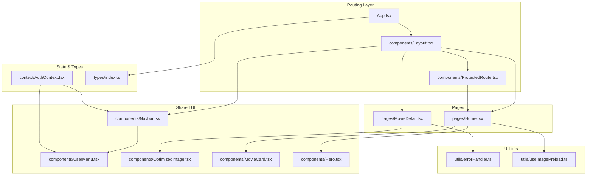
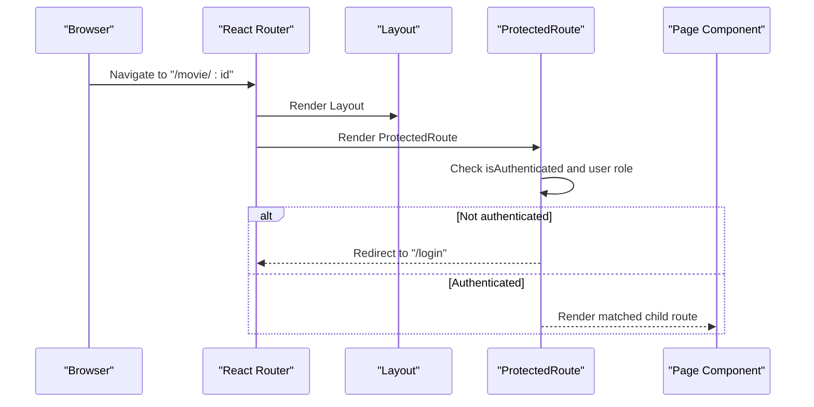
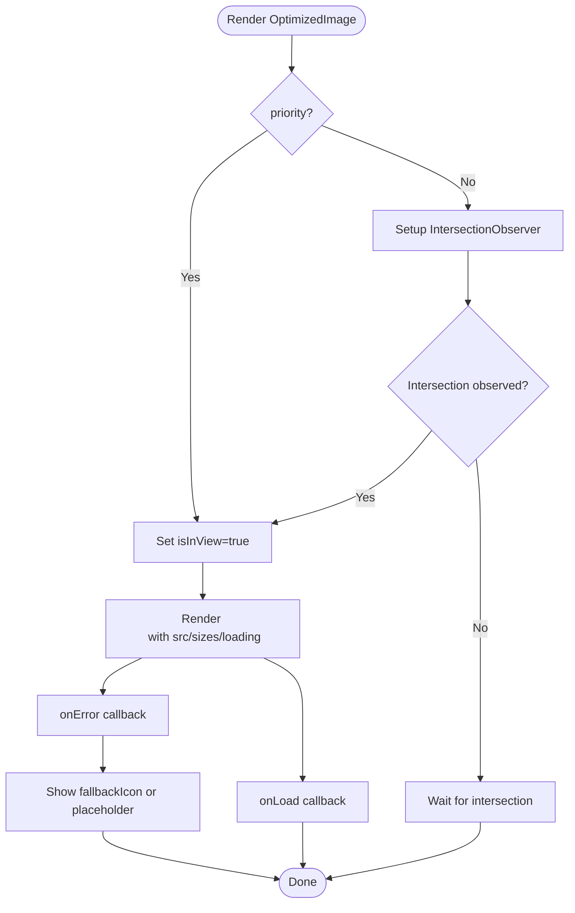
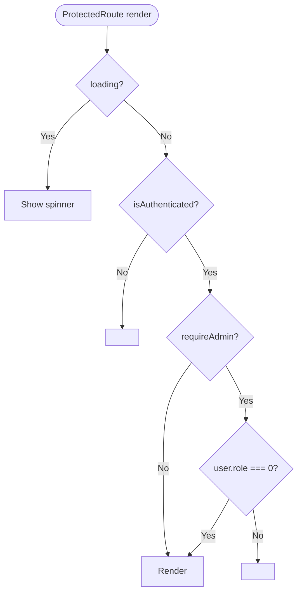
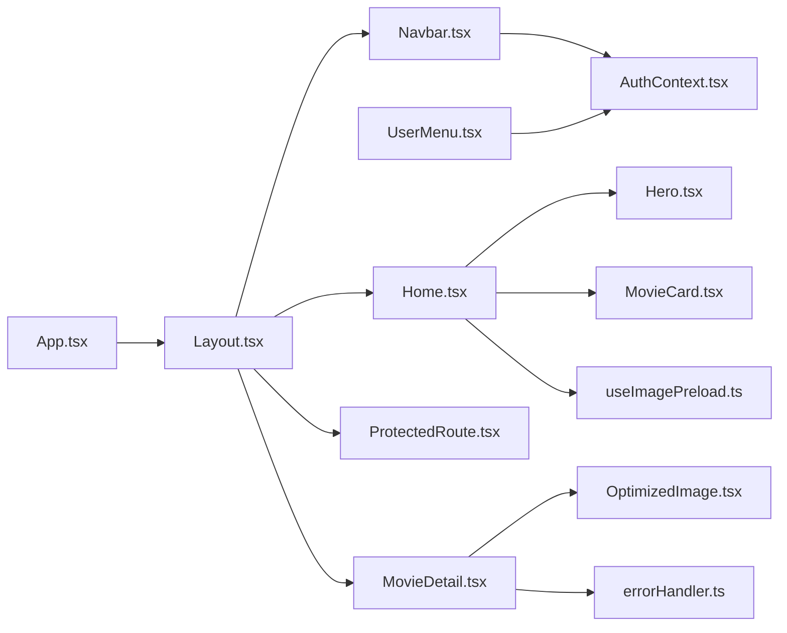

# Component Structure & Hierarchy

<cite>
**Referenced Files in This Document**
- [Layout.tsx](file://movie-review-web/src/components/Layout.tsx)
- [Navbar.tsx](file://movie-review-web/src/components/Navbar.tsx)
- [UserMenu.tsx](file://movie-review-web/src/components/UserMenu.tsx)
- [OptimizedImage.tsx](file://movie-review-web/src/components/OptimizedImage.tsx)
- [MovieCard.tsx](file://movie-review-web/src/components/MovieCard.tsx)
- [ProtectedRoute.tsx](file://movie-review-web/src/components/ProtectedRoute.tsx)
- [App.tsx](file://movie-review-web/src/App.tsx)
- [AuthContext.tsx](file://movie-review-web/src/context/AuthContext.tsx)
- [index.ts](file://movie-review-web/src/types/index.ts)
- [Home.tsx](file://movie-review-web/src/pages/Home.tsx)
- [MovieDetail.tsx](file://movie-review-web/src/pages/MovieDetail.tsx)
- [Hero.tsx](file://movie-review-web/src/components/Hero.tsx)
- [errorHandler.ts](file://movie-review-web/src/utils/errorHandler.ts)
- [useImagePreload.ts](file://movie-review-web/src/utils/useImagePreload.ts)
- [package.json](file://movie-review-web/package.json)
</cite>

## Table of Contents
1. [Introduction](#introduction)
2. [Project Structure](#project-structure)
3. [Core Components](#core-components)
4. [Architecture Overview](#architecture-overview)
5. [Detailed Component Analysis](#detailed-component-analysis)
6. [Dependency Analysis](#dependency-analysis)
7. [Performance Considerations](#performance-considerations)
8. [Troubleshooting Guide](#troubleshooting-guide)
9. [Conclusion](#conclusion)
10. [Appendices](#appendices)

## Introduction
This document explains the React component structure and hierarchy of the movie review web application. It focuses on how layout components (Layout, Navbar, UserMenu) organize the UI, how reusable components (OptimizedImage, MovieCard) are designed and composed, how route protection is implemented via ProtectedRoute, and how lifecycle, error handling, and performance are managed. It also provides guidelines for development, testing, and maintenance.

## Project Structure
The frontend is organized around a routing-driven layout with shared components and typed models. Key areas:
- Components: Shared UI building blocks under src/components
- Pages: Route-level views under src/pages
- Context: Authentication state under src/context
- Types: Shared TypeScript interfaces under src/types
- Utils: Reusable helpers under src/utils
- App bootstrap and routes under src/App.tsx

**Diagram sources**
- [App.tsx](file://movie-review-web/src/App.tsx#L1-L50)
- [Layout.tsx](file://movie-review-web/src/components/Layout.tsx#L1-L68)
- [Navbar.tsx](file://movie-review-web/src/components/Navbar.tsx#L1-L88)
- [UserMenu.tsx](file://movie-review-web/src/components/UserMenu.tsx#L1-L120)
- [OptimizedImage.tsx](file://movie-review-web/src/components/OptimizedImage.tsx#L1-L179)
- [MovieCard.tsx](file://movie-review-web/src/components/MovieCard.tsx#L1-L38)
- [Hero.tsx](file://movie-review-web/src/components/Hero.tsx#L1-L68)
- [ProtectedRoute.tsx](file://movie-review-web/src/components/ProtectedRoute.tsx#L1-L36)
- [AuthContext.tsx](file://movie-review-web/src/context/AuthContext.tsx#L1-L123)
- [index.ts](file://movie-review-web/src/types/index.ts#L1-L204)
- [Home.tsx](file://movie-review-web/src/pages/Home.tsx#L1-L65)
- [MovieDetail.tsx](file://movie-review-web/src/pages/MovieDetail.tsx#L1-L343)
- [errorHandler.ts](file://movie-review-web/src/utils/errorHandler.ts#L1-L60)
- [useImagePreload.ts](file://movie-review-web/src/utils/useImagePreload.ts#L1-L75)

**Section sources**
- [App.tsx](file://movie-review-web/src/App.tsx#L1-L50)
- [Layout.tsx](file://movie-review-web/src/components/Layout.tsx#L1-L68)

## Core Components
- Layout: Provides the global scaffold with Navbar, Outlet for nested routes, and a footer.
- Navbar: Implements top navigation, responsive search, and conditional user actions.
- UserMenu: Dropdown menu for authenticated users with profile and account actions.
- OptimizedImage: A robust image component with lazy loading, aspect ratio support, fallbacks, and specialized variants (MoviePoster, BackdropImage).
- MovieCard: A linkable card representing a movie with poster, score badge, and metadata.
- ProtectedRoute: Guards protected routes, supports optional admin-only gating, and renders nested outlets.

**Section sources**
- [Layout.tsx](file://movie-review-web/src/components/Layout.tsx#L1-L68)
- [Navbar.tsx](file://movie-review-web/src/components/Navbar.tsx#L1-L88)
- [UserMenu.tsx](file://movie-review-web/src/components/UserMenu.tsx#L1-L120)
- [OptimizedImage.tsx](file://movie-review-web/src/components/OptimizedImage.tsx#L1-L179)
- [MovieCard.tsx](file://movie-review-web/src/components/MovieCard.tsx#L1-L38)
- [ProtectedRoute.tsx](file://movie-review-web/src/components/ProtectedRoute.tsx#L1-L36)

## Architecture Overview
The app uses React Router v6 with nested routes inside a root Layout. ProtectedRoute wraps protected child routes. Authentication state is centralized via a Context provider. Pages consume typed models and shared components.

**Diagram sources**
- [App.tsx](file://movie-review-web/src/App.tsx#L22-L44)
- [ProtectedRoute.tsx](file://movie-review-web/src/components/ProtectedRoute.tsx#L11-L36)
- [Layout.tsx](file://movie-review-web/src/components/Layout.tsx#L6-L15)

## Detailed Component Analysis

### Layout.tsx
- Purpose: Root layout container with fixed header, scrollable main content, and footer.
- Composition: Renders Navbar and Outlet; footer contains branding, links, and social icons.
- Styling: Uses Tailwind utilities for responsive grids and color schemes.

**Section sources**
- [Layout.tsx](file://movie-review-web/src/components/Layout.tsx#L1-L68)

### Navbar.tsx
- Purpose: Top navigation bar with logo, desktop search, nav links, and user area.
- Behavior: Maintains local search state, navigates on Enter or click, and conditionally renders UserMenu or login prompt.
- Integration: Consumes AuthContext to determine visibility of user menu.

**Section sources**
- [Navbar.tsx](file://movie-review-web/src/components/Navbar.tsx#L1-L88)
- [AuthContext.tsx](file://movie-review-web/src/context/AuthContext.tsx#L1-L123)

### UserMenu.tsx
- Purpose: Drop-down menu for authenticated users.
- Behavior: Controlled open state, click-outside detection, and logout action.
- Navigation: Links to profile, ratings, favorites, browsing history, and settings.

**Section sources**
- [UserMenu.tsx](file://movie-review-web/src/components/UserMenu.tsx#L1-L120)
- [AuthContext.tsx](file://movie-review-web/src/context/AuthContext.tsx#L1-L123)

### OptimizedImage.tsx
- Purpose: High-performance image component with lazy loading, aspect ratio, fallbacks, and responsive sizing.
- Props: src, alt, className, fallbackIcon, aspectRatio, priority, onLoad, onError, width, height.
- Variants:
  - MoviePoster: Fixed 2/3 aspect ratio and movie-specific fallback.
  - BackdropImage: Priority loading and optional blur effect.
- Lazy loading: IntersectionObserver triggers load when near viewport; priority disables lazy loading for above-the-fold images.
- Fallbacks: Loading spinner while pending; fallback icon on error; placeholder image for missing poster URLs.

**Diagram sources**
- [OptimizedImage.tsx](file://movie-review-web/src/components/OptimizedImage.tsx#L35-L68)

**Section sources**
- [OptimizedImage.tsx](file://movie-review-web/src/components/OptimizedImage.tsx#L1-L179)

### MovieCard.tsx
- Purpose: Card for browsing movies with poster, score badge, and metadata.
- Props: movie (typed via Movie interface).
- Composition: Wraps OptimizedImage.MoviePoster for the poster; renders name/year/genres; links to movie detail page.

**Section sources**
- [MovieCard.tsx](file://movie-review-web/src/components/MovieCard.tsx#L1-L38)
- [index.ts](file://movie-review-web/src/types/index.ts#L34-L51)

### ProtectedRoute.tsx
- Purpose: Route guard for authenticated access and optional admin-only access.
- Behavior: Renders a loading spinner while auth state resolves; redirects unauthenticated users to login with state; redirects non-admin users away when requireAdmin is true; otherwise renders nested outlet.

**Diagram sources**
- [ProtectedRoute.tsx](file://movie-review-web/src/components/ProtectedRoute.tsx#L11-L36)

**Section sources**
- [ProtectedRoute.tsx](file://movie-review-web/src/components/ProtectedRoute.tsx#L1-L36)
- [AuthContext.tsx](file://movie-review-web/src/context/AuthContext.tsx#L1-L123)

### Page Components Integration
- Home: Uses Hero and MovieCard to display trending and recommended movies. Fetches data concurrently and renders sections.
- MovieDetail: Uses OptimizedImage variants for poster/backdrop, integrates with React Query hooks for movie and favorites data, and handles user interactions (write review, add to favorites).

**Section sources**
- [Home.tsx](file://movie-review-web/src/pages/Home.tsx#L1-L65)
- [MovieDetail.tsx](file://movie-review-web/src/pages/MovieDetail.tsx#L1-L343)
- [Hero.tsx](file://movie-review-web/src/components/Hero.tsx#L1-L68)

## Dependency Analysis
- Routing and layout: App defines nested routes; Layout hosts Navbar and Outlet; ProtectedRoute guards child routes.
- State: AuthContext provides user/token/state to Navbar and UserMenu.
- Components: MovieDetail composes OptimizedImage variants; Home composes Hero and MovieCard.
- Utilities: errorHandler centralizes error messaging; useImagePreload preloads critical images.

**Diagram sources**
- [App.tsx](file://movie-review-web/src/App.tsx#L1-L50)
- [Layout.tsx](file://movie-review-web/src/components/Layout.tsx#L1-L68)
- [Navbar.tsx](file://movie-review-web/src/components/Navbar.tsx#L1-L88)
- [UserMenu.tsx](file://movie-review-web/src/components/UserMenu.tsx#L1-L120)
- [OptimizedImage.tsx](file://movie-review-web/src/components/OptimizedImage.tsx#L1-L179)
- [MovieCard.tsx](file://movie-review-web/src/components/MovieCard.tsx#L1-L38)
- [Hero.tsx](file://movie-review-web/src/components/Hero.tsx#L1-L68)
- [ProtectedRoute.tsx](file://movie-review-web/src/components/ProtectedRoute.tsx#L1-L36)
- [AuthContext.tsx](file://movie-review-web/src/context/AuthContext.tsx#L1-L123)
- [errorHandler.ts](file://movie-review-web/src/utils/errorHandler.ts#L1-L60)
- [useImagePreload.ts](file://movie-review-web/src/utils/useImagePreload.ts#L1-L75)

**Section sources**
- [App.tsx](file://movie-review-web/src/App.tsx#L1-L50)
- [AuthContext.tsx](file://movie-review-web/src/context/AuthContext.tsx#L1-L123)
- [index.ts](file://movie-review-web/src/types/index.ts#L1-L204)

## Performance Considerations
- Lazy image loading: OptimizedImage defers loading until near viewport; priority prop forces eager loading for above-the-fold images.
- Aspect ratio control: Maintains CLS-friendly layouts via aspectRatio containers.
- Concurrent data fetching: Home uses Promise.all to parallelize hot/recommended requests.
- Minimal re-renders: ProtectedRoute relies on Outlet for nested rendering; AuthContext avoids unnecessary updates by initializing state from localStorage synchronously.
- Preloading: useImagePreload can preload critical images to reduce perceived latency.

**Section sources**
- [OptimizedImage.tsx](file://movie-review-web/src/components/OptimizedImage.tsx#L35-L68)
- [Home.tsx](file://movie-review-web/src/pages/Home.tsx#L30-L44)
- [AuthContext.tsx](file://movie-review-web/src/context/AuthContext.tsx#L20-L42)
- [useImagePreload.ts](file://movie-review-web/src/utils/useImagePreload.ts#L7-L28)

## Troubleshooting Guide
- Authentication errors: AuthContext listens for global unauthorized and token-refreshed events to keep state consistent.
- API error messages: errorHandler extracts user-friendly messages from Axios errors and falls back to defaults.
- Route protection: ProtectedRoute displays a spinner while loading and redirects appropriately; ensure requireAdmin aligns with user role semantics.
- Image fallbacks: OptimizedImage shows a fallback icon when images fail to load; verify alt text and src presence.

**Section sources**
- [AuthContext.tsx](file://movie-review-web/src/context/AuthContext.tsx#L88-L110)
- [errorHandler.ts](file://movie-review-web/src/utils/errorHandler.ts#L17-L60)
- [ProtectedRoute.tsx](file://movie-review-web/src/components/ProtectedRoute.tsx#L15-L31)
- [OptimizedImage.tsx](file://movie-review-web/src/components/OptimizedImage.tsx#L98-L123)

## Conclusion
The application’s component architecture emphasizes a clean layout with shared UI components, strong typing, and guarded routing. OptimizedImage and MovieCard demonstrate reusable composition patterns, while ProtectedRoute enforces access control. Centralized authentication and utility modules streamline error handling and performance. Following the guidelines below will help maintain consistency and scalability.

## Appendices

### Naming Conventions and Composition Patterns
- File naming: PascalCase for components (e.g., Layout.tsx, Navbar.tsx), kebab-case for pages (e.g., movie-detail.tsx).
- Props: Strongly typed via index.ts interfaces; optional props use union types where appropriate.
- Composition: Presentational components (OptimizedImage, MovieCard) accept data via props; container components (pages) orchestrate data fetching and state.

**Section sources**
- [index.ts](file://movie-review-web/src/types/index.ts#L34-L88)
- [OptimizedImage.tsx](file://movie-review-web/src/components/OptimizedImage.tsx#L4-L15)
- [MovieCard.tsx](file://movie-review-web/src/components/MovieCard.tsx#L7-L9)

### Component Lifecycle Management
- Initialization: AuthContext initializes token/user from localStorage synchronously to avoid flicker.
- Side effects: OptimizedImage sets up IntersectionObserver; UserMenu registers click-outside listeners; Navbar manages local search state.
- Cleanup: Observers and event listeners are cleaned up in useEffect return functions.

**Section sources**
- [AuthContext.tsx](file://movie-review-web/src/context/AuthContext.tsx#L20-L42)
- [OptimizedImage.tsx](file://movie-review-web/src/components/OptimizedImage.tsx#L35-L57)
- [UserMenu.tsx](file://movie-review-web/src/components/UserMenu.tsx#L12-L23)
- [Navbar.tsx](file://movie-review-web/src/components/Navbar.tsx#L10-L18)

### Prop Validation and Type Safety
- Interfaces: Movie, User, Comment, PageInfo, and others define strict shapes for runtime safety.
- Optional fields: Many backend-derived fields are optional; components handle absence gracefully.
- Enums/roles: Role semantics (admin vs user) are enforced in ProtectedRoute.

**Section sources**
- [index.ts](file://movie-review-web/src/types/index.ts#L34-L88)
- [ProtectedRoute.tsx](file://movie-review-web/src/components/ProtectedRoute.tsx#L28-L30)

### Error Boundaries and Graceful Degradation
- No explicit React error boundaries are present; components handle loading and error states locally.
- OptimizedImage provides fallback visuals; MovieDetail shows a friendly error screen with navigation back to home.
- errorHandler centralizes error extraction for user feedback.

**Section sources**
- [OptimizedImage.tsx](file://movie-review-web/src/components/OptimizedImage.tsx#L98-L123)
- [MovieDetail.tsx](file://movie-review-web/src/pages/MovieDetail.tsx#L103-L118)
- [errorHandler.ts](file://movie-review-web/src/utils/errorHandler.ts#L17-L60)

### Performance Optimization Techniques
- Lazy loading: OptimizedImage with IntersectionObserver and priority flag.
- Responsive images: sizes and srcSet placeholders for future backend integration.
- Preloading: useImagePreload for critical images.
- Parallel queries: Home fetches multiple datasets concurrently.

**Section sources**
- [OptimizedImage.tsx](file://movie-review-web/src/components/OptimizedImage.tsx#L70-L83)
- [useImagePreload.ts](file://movie-review-web/src/utils/useImagePreload.ts#L45-L74)
- [Home.tsx](file://movie-review-web/src/pages/Home.tsx#L30-L44)

### Guidelines for Component Development
- Keep presentational components pure and props-driven.
- Encapsulate side effects in hooks or components; expose minimal APIs.
- Use shared types to prevent drift between backend and frontend.
- Prefer lazy loading for non-critical images; mark above-the-fold images as priority.
- Centralize error handling with a single utility and consistent UX patterns.

### Testing Strategies
- Unit tests: Mock AuthContext for Navbar/UserMenu; mock image loading for OptimizedImage; snapshot pages like Home/MovieDetail.
- Integration tests: Verify ProtectedRoute redirect behavior and nested outlet rendering.
- E2E tests: Validate search flow, login/logout, and movie detail interactions.

### Maintenance Best Practices
- Keep shared styles consistent via Tailwind utilities and minimal overrides.
- Centralize constants and icons in a single place.
- Monitor bundle size and defer non-critical assets.
- Regularly audit lazy-loading thresholds and image optimization settings.