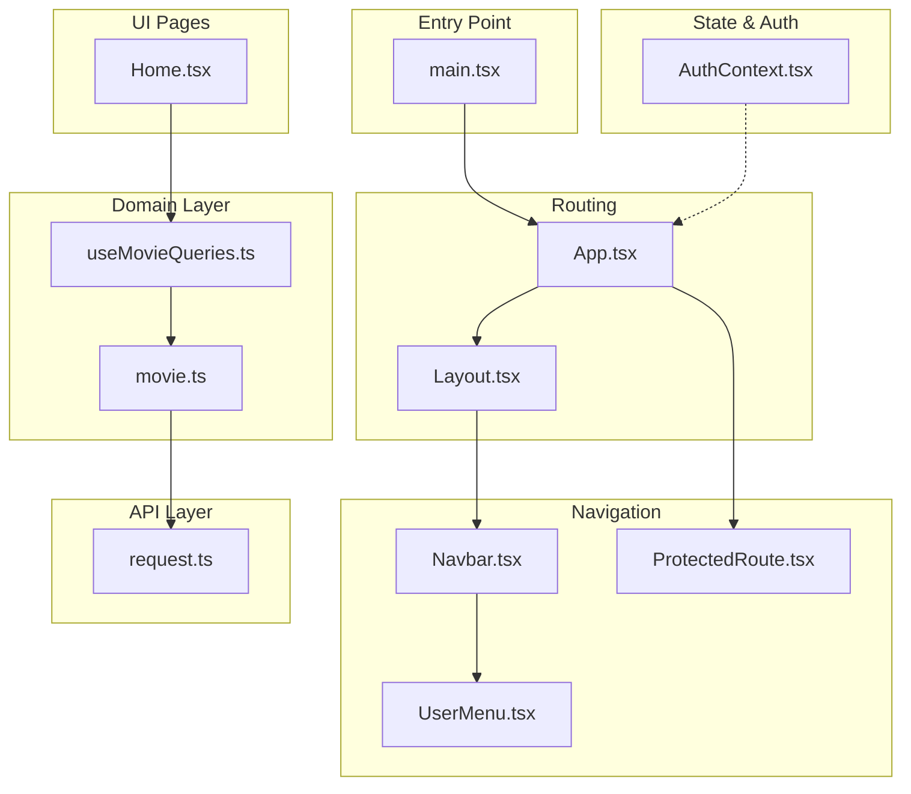
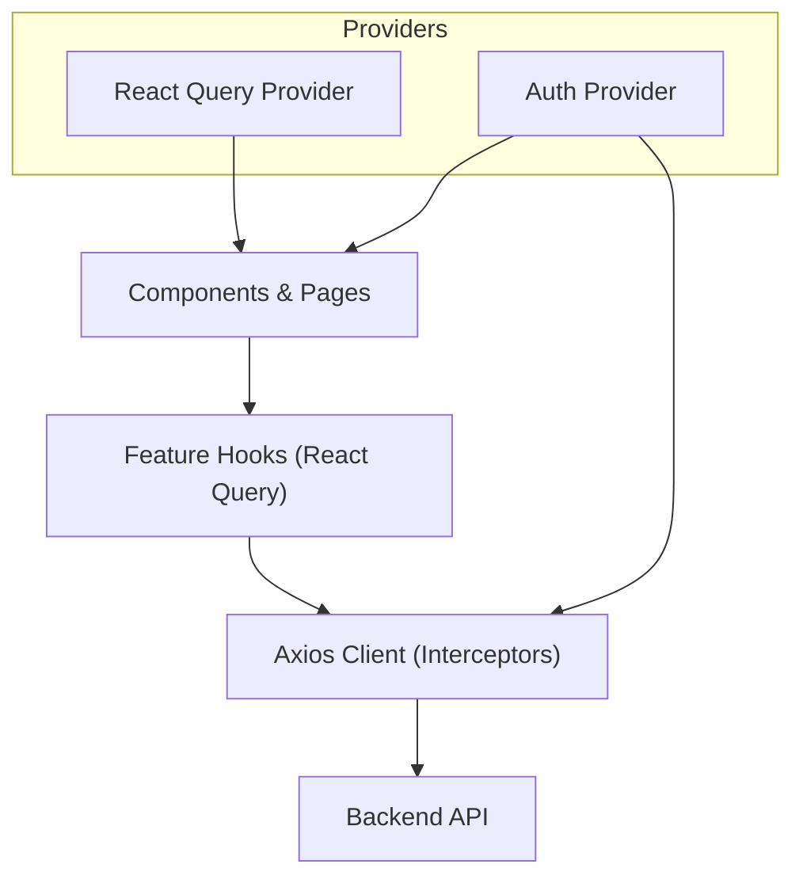
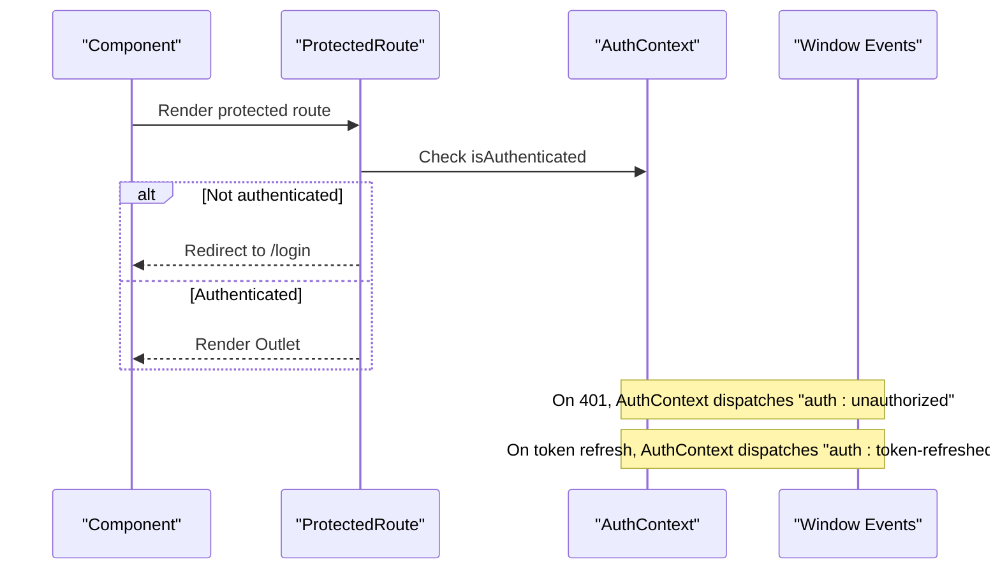
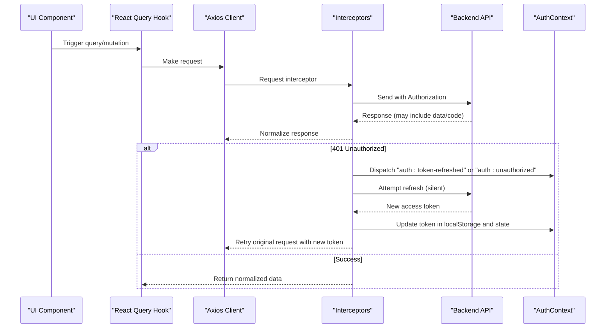
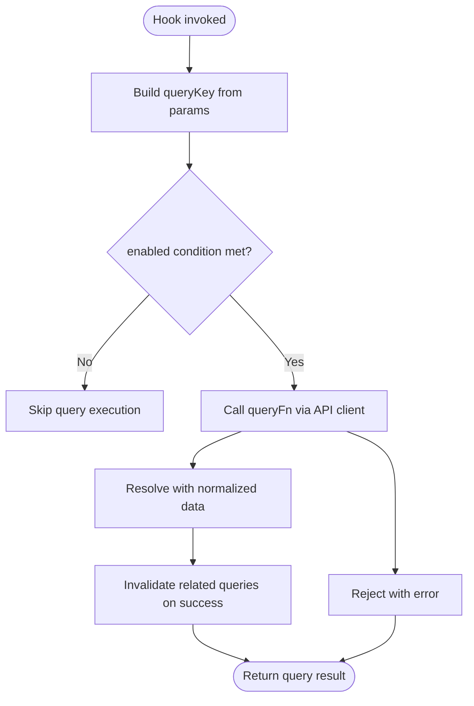
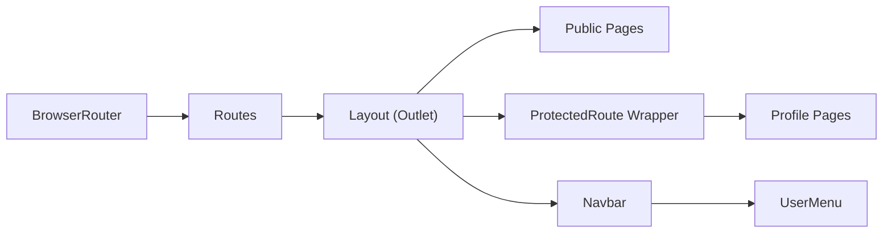
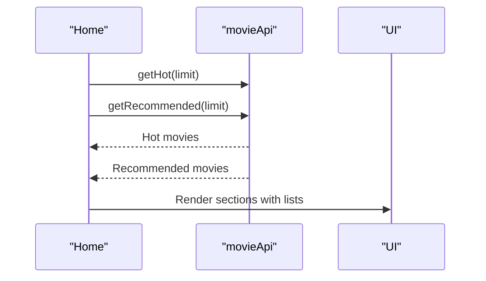
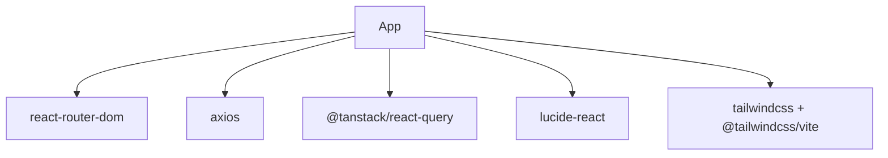
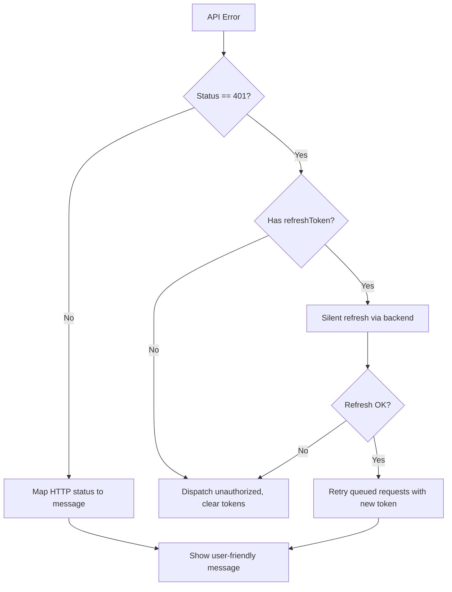

# Frontend Architecture

<cite>
**Referenced Files in This Document**
- [main.tsx](file://movie-review-web/src/main.tsx)
- [App.tsx](file://movie-review-web/src/App.tsx)
- [Layout.tsx](file://movie-review-web/src/components/Layout.tsx)
- [Navbar.tsx](file://movie-review-web/src/components/Navbar.tsx)
- [UserMenu.tsx](file://movie-review-web/src/components/UserMenu.tsx)
- [ProtectedRoute.tsx](file://movie-review-web/src/components/ProtectedRoute.tsx)
- [AuthContext.tsx](file://movie-review-web/src/context/AuthContext.tsx)
- [request.ts](file://movie-review-web/src/api/request.ts)
- [movie.ts](file://movie-review-web/src/api/movie.ts)
- [useMovieQueries.ts](file://movie-review-web/src/hooks/useMovieQueries.ts)
- [Home.tsx](file://movie-review-web/src/pages/Home.tsx)
- [errorHandler.ts](file://movie-review-web/src/utils/errorHandler.ts)
- [vite.config.ts](file://movie-review-web/vite.config.ts)
- [package.json](file://movie-review-web/package.json)
- [index.tsx](file://movie-review-web/src/index.css)
- [App.css](file://movie-review-web/src/App.css)
</cite>

## Table of Contents
1. [Introduction](#introduction)
2. [Project Structure](#project-structure)
3. [Core Components](#core-components)
4. [Architecture Overview](#architecture-overview)
5. [Detailed Component Analysis](#detailed-component-analysis)
6. [Dependency Analysis](#dependency-analysis)
7. [Performance Considerations](#performance-considerations)
8. [Troubleshooting Guide](#troubleshooting-guide)
9. [Conclusion](#conclusion)
10. [Appendices](#appendices)

## Introduction
This document describes the frontend architecture of the React application for the movie review platform. It covers the component hierarchy, routing structure, state management using React Query, authentication flow, API integration, error handling, layout and navigation, and build/deployment configuration. The goal is to provide a clear understanding of how the system is organized and how developers can extend or maintain it effectively.

## Project Structure
The frontend is a Vite-powered React application with TypeScript. It follows a feature-based organization:
- Entry point initializes providers and React Query.
- Routing is configured in the main App component with nested layouts.
- Components are grouped under src/components and pages under src/pages.
- API clients live under src/api, with shared types under src/types.
- Hooks encapsulate React Query logic for domain-specific features.
- Utilities provide shared helpers like error handling.
- Tailwind CSS is integrated via a Vite plugin.

**Diagram sources**
- [main.tsx](file://movie-review-web/src/main.tsx#L1-L41)
- [App.tsx](file://movie-review-web/src/App.tsx#L1-L50)
- [Layout.tsx](file://movie-review-web/src/components/Layout.tsx#L1-L68)
- [Navbar.tsx](file://movie-review-web/src/components/Navbar.tsx#L1-L88)
- [UserMenu.tsx](file://movie-review-web/src/components/UserMenu.tsx#L1-L120)
- [ProtectedRoute.tsx](file://movie-review-web/src/components/ProtectedRoute.tsx#L1-L36)
- [AuthContext.tsx](file://movie-review-web/src/context/AuthContext.tsx#L1-L123)
- [useMovieQueries.ts](file://movie-review-web/src/hooks/useMovieQueries.ts#L1-L95)
- [movie.ts](file://movie-review-web/src/api/movie.ts#L1-L65)
- [request.ts](file://movie-review-web/src/api/request.ts#L1-L108)
- [Home.tsx](file://movie-review-web/src/pages/Home.tsx#L1-L65)

**Section sources**
- [main.tsx](file://movie-review-web/src/main.tsx#L1-L41)
- [App.tsx](file://movie-review-web/src/App.tsx#L1-L50)
- [vite.config.ts](file://movie-review-web/vite.config.ts#L1-L11)
- [package.json](file://movie-review-web/package.json#L1-L42)

## Core Components
- Application entry initializes providers:
  - React Query provider with default caching and retry policies.
  - Auth provider wrapping the entire app.
  - Devtools for debugging.
- Root App sets up routing with a nested layout and protected routes.
- Layout composes Navbar and footer, rendering child routes via Outlet.
- Navbar handles site navigation and search submission.
- ProtectedRoute enforces authentication and optional admin checks.
- AuthContext manages tokens, user state, login/register/logout, and global events for token refresh/unauthorized.
- API layer uses Axios with interceptors for auth headers, response normalization, and automatic token refresh.
- Domain hooks centralize React Query keys and operations for movies.
- Error handling utility extracts user-friendly messages from various error sources.

**Section sources**
- [main.tsx](file://movie-review-web/src/main.tsx#L1-L41)
- [App.tsx](file://movie-review-web/src/App.tsx#L1-L50)
- [Layout.tsx](file://movie-review-web/src/components/Layout.tsx#L1-L68)
- [Navbar.tsx](file://movie-review-web/src/components/Navbar.tsx#L1-L88)
- [ProtectedRoute.tsx](file://movie-review-web/src/components/ProtectedRoute.tsx#L1-L36)
- [AuthContext.tsx](file://movie-review-web/src/context/AuthContext.tsx#L1-L123)
- [request.ts](file://movie-review-web/src/api/request.ts#L1-L108)
- [useMovieQueries.ts](file://movie-review-web/src/hooks/useMovieQueries.ts#L1-L95)
- [errorHandler.ts](file://movie-review-web/src/utils/errorHandler.ts#L1-L60)

## Architecture Overview
The frontend follows a layered architecture:
- Presentation layer: React components and pages.
- Domain layer: Feature-specific hooks encapsulating React Query logic.
- API layer: Axios client with interceptors for auth and response normalization.
- Shared layer: Types, utilities, and context providers.

**Diagram sources**
- [main.tsx](file://movie-review-web/src/main.tsx#L1-L41)
- [useMovieQueries.ts](file://movie-review-web/src/hooks/useMovieQueries.ts#L1-L95)
- [request.ts](file://movie-review-web/src/api/request.ts#L1-L108)

## Detailed Component Analysis

### Authentication and Session Management
The AuthContext provides:
- Token and user state initialized from localStorage without unnecessary effects.
- Login, register, and logout functions persisting to localStorage.
- Global event listeners for unauthorized and token-refreshed events to keep state synchronized across tabs/windows.
- ProtectedRoute renders Outlet for authenticated users and redirects unauthenticated users to login.

**Diagram sources**
- [ProtectedRoute.tsx](file://movie-review-web/src/components/ProtectedRoute.tsx#L1-L36)
- [AuthContext.tsx](file://movie-review-web/src/context/AuthContext.tsx#L1-L123)

**Section sources**
- [AuthContext.tsx](file://movie-review-web/src/context/AuthContext.tsx#L1-L123)
- [ProtectedRoute.tsx](file://movie-review-web/src/components/ProtectedRoute.tsx#L1-L36)

### API Integration and Token Refresh
The Axios client:
- Injects Authorization header from localStorage.
- Normalizes responses expecting a wrapper with code/message/data.
- Handles 401 errors by attempting silent refresh using refreshToken.
- Queues pending requests during refresh to avoid redundant attempts.
- Dispatches global events to notify AuthContext and update state.

**Diagram sources**
- [request.ts](file://movie-review-web/src/api/request.ts#L1-L108)
- [AuthContext.tsx](file://movie-review-web/src/context/AuthContext.tsx#L1-L123)

**Section sources**
- [request.ts](file://movie-review-web/src/api/request.ts#L1-L108)
- [AuthContext.tsx](file://movie-review-web/src/context/AuthContext.tsx#L1-L123)

### React Query State Management
React Query is configured with:
- Stale and garbage collection timeouts optimized for a content-heavy app.
- Retry policy tuned for reads and disabled for mutations.
- Window focus and reconnect behaviors configured to balance freshness and cost.

Feature hooks centralize:
- Query keys for movies (detail, search, latest, my ratings).
- Queries for fetching data and mutations for rating operations.
- Cache invalidation after successful mutations to keep views fresh.

**Diagram sources**
- [useMovieQueries.ts](file://movie-review-web/src/hooks/useMovieQueries.ts#L1-L95)
- [movie.ts](file://movie-review-web/src/api/movie.ts#L1-L65)

**Section sources**
- [main.tsx](file://movie-review-web/src/main.tsx#L10-L29)
- [useMovieQueries.ts](file://movie-review-web/src/hooks/useMovieQueries.ts#L1-L95)
- [movie.ts](file://movie-review-web/src/api/movie.ts#L1-L65)

### Routing and Navigation
Routing is structured as:
- Root App wraps all routes in BrowserRouter.
- Layout route mounts Layout, which renders Navbar and footer and exposes Outlet for nested routes.
- Public routes (home, login, register, search, latest, person, movie) are mounted under the layout.
- Protected routes are wrapped in ProtectedRoute and include profile-related pages.
- Navbar provides logo, desktop search, and navigation links; UserMenu appears when authenticated.

**Diagram sources**
- [App.tsx](file://movie-review-web/src/App.tsx#L1-L50)
- [Layout.tsx](file://movie-review-web/src/components/Layout.tsx#L1-L68)
- [Navbar.tsx](file://movie-review-web/src/components/Navbar.tsx#L1-L88)
- [UserMenu.tsx](file://movie-review-web/src/components/UserMenu.tsx#L1-L120)
- [ProtectedRoute.tsx](file://movie-review-web/src/components/ProtectedRoute.tsx#L1-L36)

**Section sources**
- [App.tsx](file://movie-review-web/src/App.tsx#L1-L50)
- [Layout.tsx](file://movie-review-web/src/components/Layout.tsx#L1-L68)
- [Navbar.tsx](file://movie-review-web/src/components/Navbar.tsx#L1-L88)
- [UserMenu.tsx](file://movie-review-web/src/components/UserMenu.tsx#L1-L120)
- [ProtectedRoute.tsx](file://movie-review-web/src/components/ProtectedRoute.tsx#L1-L36)

### Example: Home Page Composition
The Home page demonstrates:
- Composition of reusable components (Hero, MovieCard).
- Parallel data fetching for hot and recommended movies.
- Rendering sections with responsive grids.

**Diagram sources**
- [Home.tsx](file://movie-review-web/src/pages/Home.tsx#L1-L65)
- [movie.ts](file://movie-review-web/src/api/movie.ts#L1-L65)

**Section sources**
- [Home.tsx](file://movie-review-web/src/pages/Home.tsx#L1-L65)
- [movie.ts](file://movie-review-web/src/api/movie.ts#L1-L65)

## Dependency Analysis
External dependencies include:
- React and React Router for UI and routing.
- Axios for HTTP requests.
- React Query for server-state management.
- Tailwind CSS and Vite plugins for styling and build.

**Diagram sources**
- [package.json](file://movie-review-web/package.json#L12-L23)

**Section sources**
- [package.json](file://movie-review-web/package.json#L1-L42)

## Performance Considerations
- React Query defaults:
  - Stale time and GC time reduce unnecessary refetches while keeping data reasonably fresh.
  - Retry disabled for mutations to prevent unintended repeated writes.
  - Window focus refetch disabled to minimize network usage.
- Component-level:
  - Lazy initialization of AuthContext state avoids extra renders.
  - Controlled search input prevents unnecessary navigations until Enter or click.
- Build:
  - Vite with React plugin and Tailwind CSS plugin for fast dev and optimized builds.

**Section sources**
- [main.tsx](file://movie-review-web/src/main.tsx#L10-L29)
- [Navbar.tsx](file://movie-review-web/src/components/Navbar.tsx#L13-L25)
- [vite.config.ts](file://movie-review-web/vite.config.ts#L1-L11)

## Troubleshooting Guide
Common scenarios and strategies:
- Unauthorized responses:
  - Interceptor triggers silent refresh using refreshToken; if successful, updates localStorage and reissues queued requests; otherwise dispatches global logout and clears tokens.
- Error messaging:
  - Centralized extractor handles Axios errors, HTTP status mapping, and fallback messages.
- Token lifecycle:
  - AuthContext listens for global events to keep state consistent across browser tabs.

**Diagram sources**
- [request.ts](file://movie-review-web/src/api/request.ts#L30-L105)
- [errorHandler.ts](file://movie-review-web/src/utils/errorHandler.ts#L1-L60)
- [AuthContext.tsx](file://movie-review-web/src/context/AuthContext.tsx#L88-L110)

**Section sources**
- [request.ts](file://movie-review-web/src/api/request.ts#L1-L108)
- [errorHandler.ts](file://movie-review-web/src/utils/errorHandler.ts#L1-L60)
- [AuthContext.tsx](file://movie-review-web/src/context/AuthContext.tsx#L1-L123)

## Conclusion
The frontend employs a clean separation of concerns with React Router for navigation, React Query for state management, and a robust Axios interceptor pipeline for API communication and token refresh. Authentication is centralized in a context provider with global event-driven synchronization. The build system leverages Vite and Tailwind for a modern developer experience and efficient production builds. Together, these patterns support scalability, maintainability, and a good user experience.

## Appendices

### Build Configuration and Workflow
- Scripts:
  - dev: starts Vite dev server.
  - build: compiles TypeScript then builds with Vite.
  - lint: runs ESLint.
  - preview: serves built assets locally.
- Plugins:
  - @vitejs/plugin-react for JSX transforms.
  - @tailwindcss/vite for Tailwind integration.

**Section sources**
- [package.json](file://movie-review-web/package.json#L6-L11)
- [vite.config.ts](file://movie-review-web/vite.config.ts#L1-L11)

### Styling and Accessibility Notes
- Tailwind utilities are used extensively for responsive layouts and theming.
- Semantic HTML and focus states are considered in interactive components.
- Icons from lucide-react improve affordance and accessibility when paired with proper labeling.

**Section sources**
- [index.tsx](file://movie-review-web/src/index.css#L1-L200)
- [App.css](file://movie-review-web/src/App.css#L1-L200)
- [Navbar.tsx](file://movie-review-web/src/components/Navbar.tsx#L28-L87)