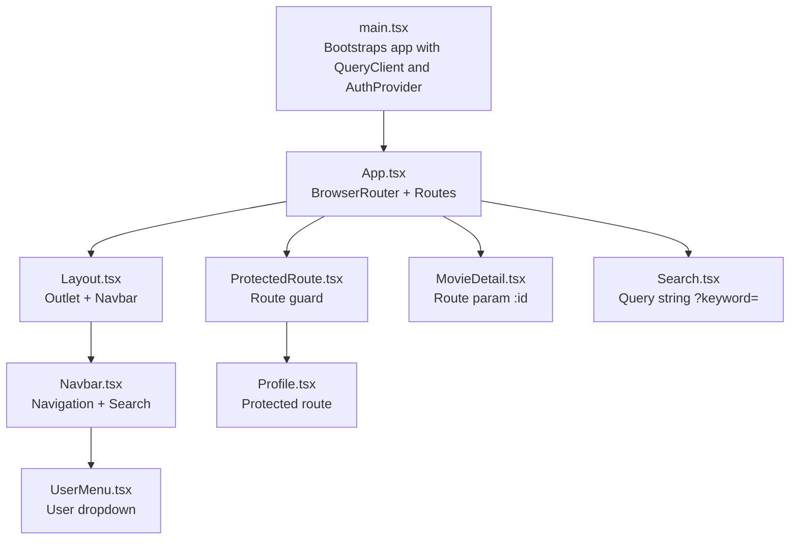
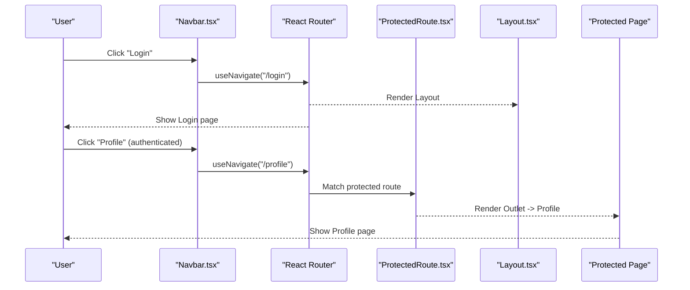
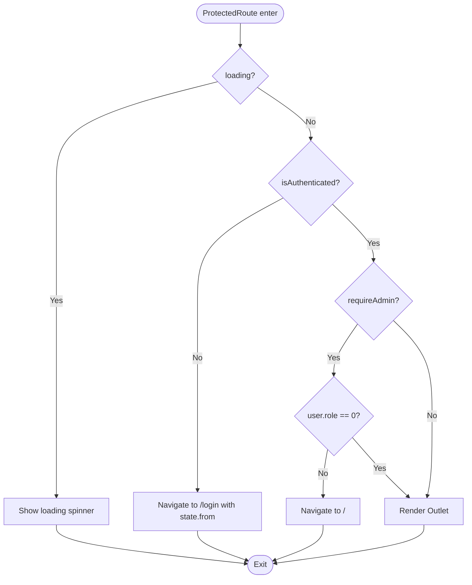
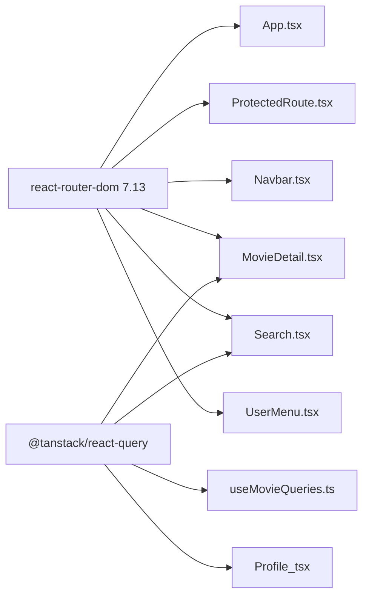

# Routing & Navigation

<cite>
**Referenced Files in This Document**
- [App.tsx](file://movie-review-web/src/App.tsx)
- [main.tsx](file://movie-review-web/src/main.tsx)
- [Layout.tsx](file://movie-review-web/src/components/Layout.tsx)
- [Navbar.tsx](file://movie-review-web/src/components/Navbar.tsx)
- [ProtectedRoute.tsx](file://movie-review-web/src/components/ProtectedRoute.tsx)
- [AuthContext.tsx](file://movie-review-web/src/context/AuthContext.tsx)
- [UserMenu.tsx](file://movie-review-web/src/components/UserMenu.tsx)
- [MovieDetail.tsx](file://movie-review-web/src/pages/MovieDetail.tsx)
- [Search.tsx](file://movie-review-web/src/pages/Search.tsx)
- [Home.tsx](file://movie-review-web/src/pages/Home.tsx)
- [Profile.tsx](file://movie-review-web/src/pages/Profile.tsx)
- [useMovieQueries.ts](file://movie-review-web/src/hooks/useMovieQueries.ts)
- [request.ts](file://movie-review-web/src/api/request.ts)
- [package.json](file://movie-review-web/package.json)
</cite>

## Table of Contents
1. [Introduction](#introduction)
2. [Project Structure](#project-structure)
3. [Core Components](#core-components)
4. [Architecture Overview](#architecture-overview)
5. [Detailed Component Analysis](#detailed-component-analysis)
6. [Dependency Analysis](#dependency-analysis)
7. [Performance Considerations](#performance-considerations)
8. [Troubleshooting Guide](#troubleshooting-guide)
9. [Conclusion](#conclusion)
10. [Appendices](#appendices)

## Introduction
This document explains the routing and navigation system built with React Router 7.13 in the movie review web application. It covers the main App.tsx configuration, route definitions, protected routing, navigation components (Navbar and UserMenu), programmatic navigation, route parameters and query strings, URL management, navigation state handling, and accessibility considerations. It also provides guidance for adding new routes, maintaining consistency, and optimizing performance.

## Project Structure
The routing system centers around a single-page application bootstrapped in main.tsx with React Query for data fetching and caching. App.tsx defines nested routes under a shared Layout that hosts the Navbar and renders matched pages. ProtectedRoute enforces authentication and optional admin checks for private routes.

**Diagram sources**
- [main.tsx](file://movie-review-web/src/main.tsx#L1-L41)
- [App.tsx](file://movie-review-web/src/App.tsx#L1-L50)
- [Layout.tsx](file://movie-review-web/src/components/Layout.tsx#L1-L68)
- [Navbar.tsx](file://movie-review-web/src/components/Navbar.tsx#L1-L88)
- [ProtectedRoute.tsx](file://movie-review-web/src/components/ProtectedRoute.tsx#L1-L36)
- [UserMenu.tsx](file://movie-review-web/src/components/UserMenu.tsx#L1-L120)
- [MovieDetail.tsx](file://movie-review-web/src/pages/MovieDetail.tsx#L1-L343)
- [Search.tsx](file://movie-review-web/src/pages/Search.tsx#L1-L67)
- [Profile.tsx](file://movie-review-web/src/pages/Profile.tsx#L1-L132)

**Section sources**
- [main.tsx](file://movie-review-web/src/main.tsx#L1-L41)
- [App.tsx](file://movie-review-web/src/App.tsx#L1-L50)

## Core Components
- App.tsx: Declares BrowserRouter, nested Routes, and groups public and protected routes under a shared Layout.
- Layout.tsx: Provides a consistent shell with Navbar and Outlet for page rendering.
- ProtectedRoute.tsx: Implements authentication and admin route guards with graceful loading and redirects.
- Navbar.tsx: Offers primary navigation links, responsive layout, and a search bar that navigates with query strings.
- AuthContext.tsx: Centralizes authentication state, login/register/logout, and global 401 handling.

**Section sources**
- [App.tsx](file://movie-review-web/src/App.tsx#L1-L50)
- [Layout.tsx](file://movie-review-web/src/components/Layout.tsx#L1-L68)
- [ProtectedRoute.tsx](file://movie-review-web/src/components/ProtectedRoute.tsx#L1-L36)
- [Navbar.tsx](file://movie-review-web/src/components/Navbar.tsx#L1-L88)
- [AuthContext.tsx](file://movie-review-web/src/context/AuthContext.tsx#L1-L123)

## Architecture Overview
The routing architecture uses nested routes under a shared Layout. Public routes (home, login, register, search, latest, person/:id, movie/:id) are accessible without authentication. Protected routes (/profile, /my-ratings, /favorites, /my-reviews, /browsing-history) are guarded by ProtectedRoute. Programmatic navigation occurs via useNavigate for search and login redirection, while declarative navigation uses Link.

**Diagram sources**
- [Navbar.tsx](file://movie-review-web/src/components/Navbar.tsx#L1-L88)
- [ProtectedRoute.tsx](file://movie-review-web/src/components/ProtectedRoute.tsx#L1-L36)
- [Layout.tsx](file://movie-review-web/src/components/Layout.tsx#L1-L68)
- [Profile.tsx](file://movie-review-web/src/pages/Profile.tsx#L1-L132)

## Detailed Component Analysis

### App.tsx: Routes and Nesting
- Wraps the app with BrowserRouter and defines nested Routes under Layout.
- Public routes include index, login, register, search, latest, person/:id, and movie/:id.
- Protected routes are grouped under ProtectedRoute, enabling access only when authenticated.
- Uses Outlet inside Layout to render matched child routes.

**Section sources**
- [App.tsx](file://movie-review-web/src/App.tsx#L1-L50)

### ProtectedRoute.tsx: Authentication and Admin Guards
- Reads authentication state and loading from AuthContext.
- On loading, renders a spinner placeholder.
- Redirects unauthenticated users to /login with state.from preserving the intended destination.
- Optionally restricts to admin users via requireAdmin flag.
- Renders Outlet to continue rendering the matched protected child route.

**Diagram sources**
- [ProtectedRoute.tsx](file://movie-review-web/src/components/ProtectedRoute.tsx#L1-L36)
- [AuthContext.tsx](file://movie-review-web/src/context/AuthContext.tsx#L1-L123)

**Section sources**
- [ProtectedRoute.tsx](file://movie-review-web/src/components/ProtectedRoute.tsx#L1-L36)
- [AuthContext.tsx](file://movie-review-web/src/context/AuthContext.tsx#L1-L123)

### Layout.tsx and Navbar.tsx: Navigation Shell and Links
- Layout.tsx provides a fixed header area (Navbar) and a flexible main area (Outlet).
- Navbar.tsx:
  - Displays logo and primary links (Home, Latest, Top).
  - Contains a responsive search input with Enter-key support.
  - Handles search submission by navigating to /search?keyword=...
  - Shows UserMenu when authenticated; otherwise shows a login link.
  - Uses Link for declarative navigation and useNavigate for programmatic actions.

**Section sources**
- [Layout.tsx](file://movie-review-web/src/components/Layout.tsx#L1-L68)
- [Navbar.tsx](file://movie-review-web/src/components/Navbar.tsx#L1-L88)

### Programmatic Navigation, Parameters, and Query Strings
- Search:
  - Uses useSearchParams to read ?keyword=.
  - Uses useNavigate to move to /search?keyword=... when the user submits the search form.
- MovieDetail:
  - Uses useParams to extract :id from /movie/:id.
  - Uses useNavigate and useLocation to redirect to /login with state.from when attempting protected actions.
- UserMenu:
  - Uses Link to navigate to protected pages like /profile, /my-ratings, /favorites, /browsing-history, /my-reviews.

**Section sources**
- [Search.tsx](file://movie-review-web/src/pages/Search.tsx#L1-L67)
- [MovieDetail.tsx](file://movie-review-web/src/pages/MovieDetail.tsx#L1-L343)
- [UserMenu.tsx](file://movie-review-web/src/components/UserMenu.tsx#L1-L120)

### URL Management and State
- Redirects preserve intended destinations using state.from in Navigate.
- Search results are driven by query strings (?keyword=...), enabling bookmarkable URLs and deep linking.
- ProtectedRoute leverages location state to guide post-login navigation.

**Section sources**
- [ProtectedRoute.tsx](file://movie-review-web/src/components/ProtectedRoute.tsx#L1-L36)
- [Search.tsx](file://movie-review-web/src/pages/Search.tsx#L1-L67)

### Navigation State Management
- Authentication state is centralized in AuthContext, providing isAuthenticated, user, login, register, logout, and loading.
- Global 401 handling triggers logout and updates context state, ensuring consistent navigation behavior across the app.

**Section sources**
- [AuthContext.tsx](file://movie-review-web/src/context/AuthContext.tsx#L1-L123)
- [request.ts](file://movie-review-web/src/api/request.ts#L1-L108)

### Accessibility Considerations
- Use semantic HTML and proper focus management in Navbar and UserMenu.
- Ensure keyboard navigation works for dropdown menus and search input.
- Provide visible focus indicators and ARIA roles where appropriate.
- Keep link text descriptive and avoid generic “click here” phrasing.

[No sources needed since this section provides general guidance]

### Breadcrumb Implementation
- The current implementation does not include explicit breadcrumbs.
- Recommended approach:
  - Derive breadcrumb segments from the current route path segments.
  - Use a hook to compute breadcrumbs based on location.pathname.
  - Render a small trail above the main content area in Layout or individual pages.
  - Make the last segment non-clickable; previous segments link to parent routes.

[No sources needed since this section provides general guidance]

### Adding New Routes: Guidelines and Consistency
- Place public routes under the root Layout route for consistent header/footer.
- Group protected routes under ProtectedRoute for uniform access control.
- Use descriptive path segments (e.g., /user/:id, /movie/:id) and keep query strings for filters/search.
- Maintain consistent naming and casing for routes and links.
- Add Link targets in Navbar and UserMenu for discoverability.

[No sources needed since this section provides general guidance]

## Dependency Analysis
React Router 7.13 is used for routing. React Query is used for data fetching and caching, indirectly supporting navigation by keeping pages fast and reactive.

**Diagram sources**
- [package.json](file://movie-review-web/package.json#L1-L42)
- [App.tsx](file://movie-review-web/src/App.tsx#L1-L50)
- [ProtectedRoute.tsx](file://movie-review-web/src/components/ProtectedRoute.tsx#L1-L36)
- [Navbar.tsx](file://movie-review-web/src/components/Navbar.tsx#L1-L88)
- [MovieDetail.tsx](file://movie-review-web/src/pages/MovieDetail.tsx#L1-L343)
- [Search.tsx](file://movie-review-web/src/pages/Search.tsx#L1-L67)
- [UserMenu.tsx](file://movie-review-web/src/components/UserMenu.tsx#L1-L120)
- [useMovieQueries.ts](file://movie-review-web/src/hooks/useMovieQueries.ts#L1-L95)

**Section sources**
- [package.json](file://movie-review-web/package.json#L1-L42)

## Performance Considerations
- Route-level data fetching:
  - Use React Query hooks (e.g., useMovie, useMovieSearch) to cache and deduplicate requests automatically.
  - Enable queries only when parameters are valid (e.g., enabled: !!keyword.trim()).
- Parallel data fetching:
  - Use Promise.all to fetch multiple datasets concurrently on Home.
- Minimal re-renders:
  - Keep route components pure and delegate state to React Query where possible.
- Lazy loading:
  - Consider React.lazy for heavy page bundles if needed, combined with Suspense boundaries.
- Preloading:
  - Use useImagePreload for critical images to reduce layout shifts.
- QueryClient defaults:
  - Configure staleTime, gcTime, and refetchOnWindowFocus/refetchOnReconnect to balance freshness and performance.

**Section sources**
- [Home.tsx](file://movie-review-web/src/pages/Home.tsx#L1-L65)
- [useMovieQueries.ts](file://movie-review-web/src/hooks/useMovieQueries.ts#L1-L95)
- [useImagePreload.ts](file://movie-review-web/src/utils/useImagePreload.ts#L1-L75)
- [main.tsx](file://movie-review-web/src/main.tsx#L1-L41)

## Troubleshooting Guide
- Authentication redirects loop:
  - Verify ProtectedRoute is wrapping protected routes correctly and that state.from is passed during redirects.
- Stuck loading state:
  - Ensure ProtectedRoute handles loading properly and that AuthContext loading is set appropriately.
- Search not working:
  - Confirm Navbar uses navigate with encoded keyword and Search reads useSearchParams correctly.
- 401 errors and logout:
  - Check global 401 handling in AuthContext and request interceptor; ensure refresh token flow updates local storage and dispatches events.

**Section sources**
- [ProtectedRoute.tsx](file://movie-review-web/src/components/ProtectedRoute.tsx#L1-L36)
- [AuthContext.tsx](file://movie-review-web/src/context/AuthContext.tsx#L1-L123)
- [request.ts](file://movie-review-web/src/api/request.ts#L1-L108)
- [Navbar.tsx](file://movie-review-web/src/components/Navbar.tsx#L1-L88)
- [Search.tsx](file://movie-review-web/src/pages/Search.tsx#L1-L67)

## Conclusion
The routing and navigation system leverages React Router 7.13 with a clean nested structure, robust authentication guards, and integrated React Query for efficient data management. The Navbar and UserMenu provide intuitive navigation, while programmatic navigation and query strings enable seamless user experiences. Following the guidelines herein will help maintain consistency, improve performance, and simplify future enhancements.

## Appendices

### Route Reference
- Public routes:
  - / (index)
  - /login
  - /register
  - /search?keyword=...
  - /latest
  - /person/:id
  - /movie/:id
- Protected routes (under /):
  - /profile
  - /my-ratings
  - /favorites
  - /my-reviews
  - /browsing-history

**Section sources**
- [App.tsx](file://movie-review-web/src/App.tsx#L1-L50)