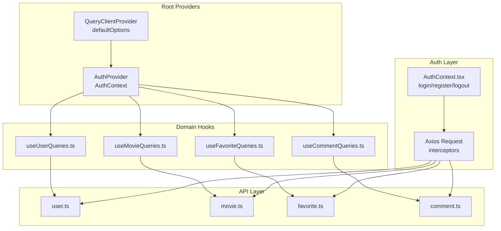
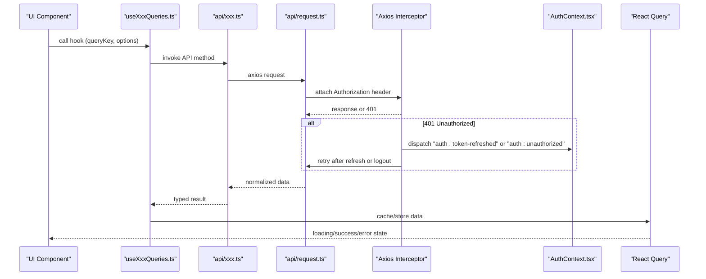
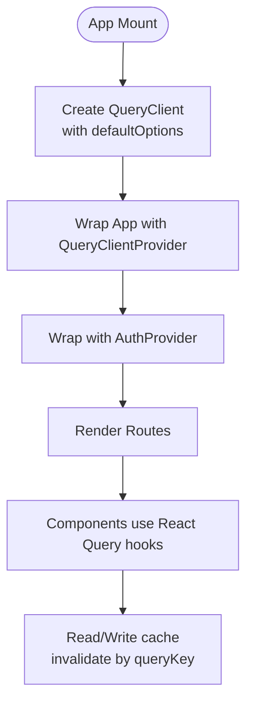
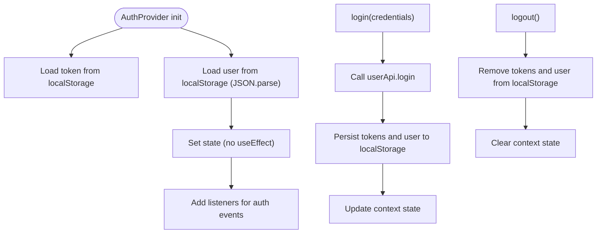
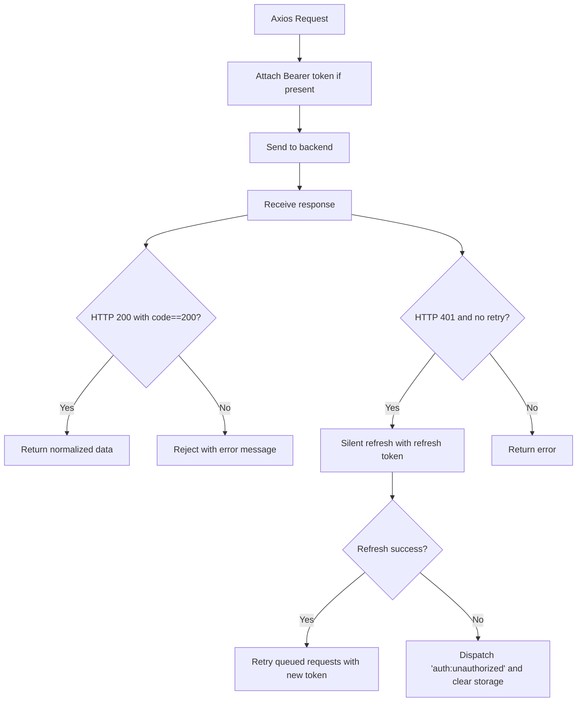
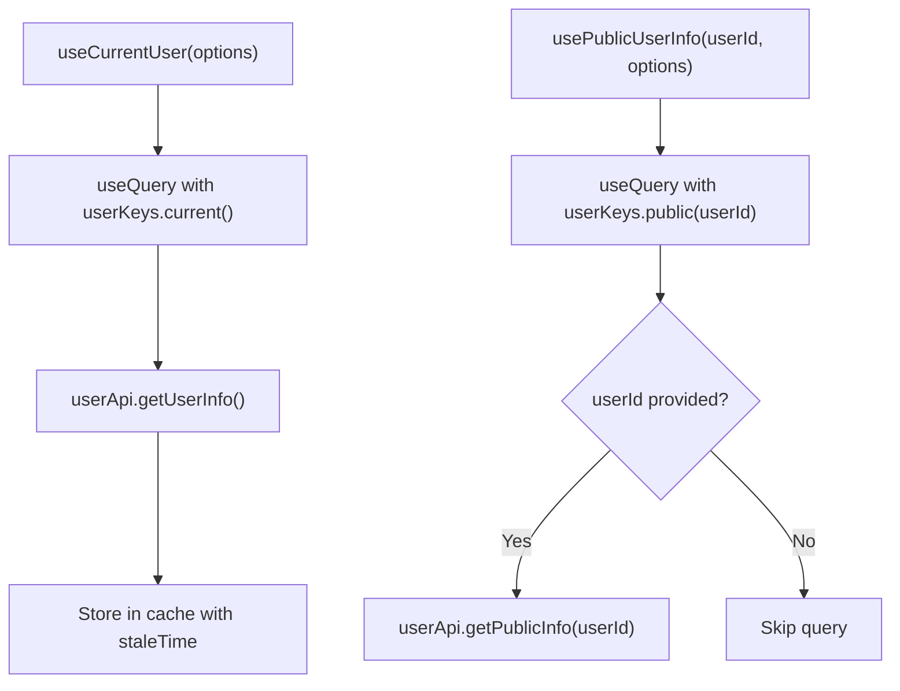
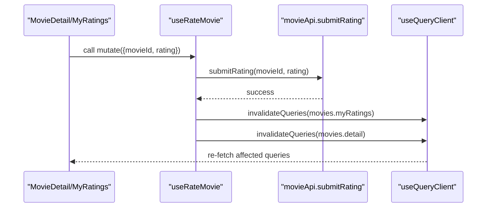
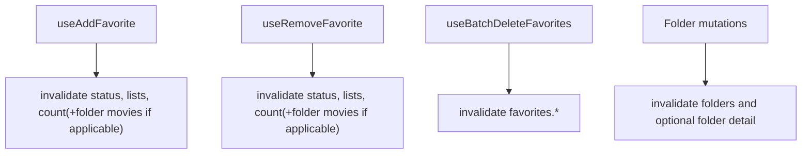
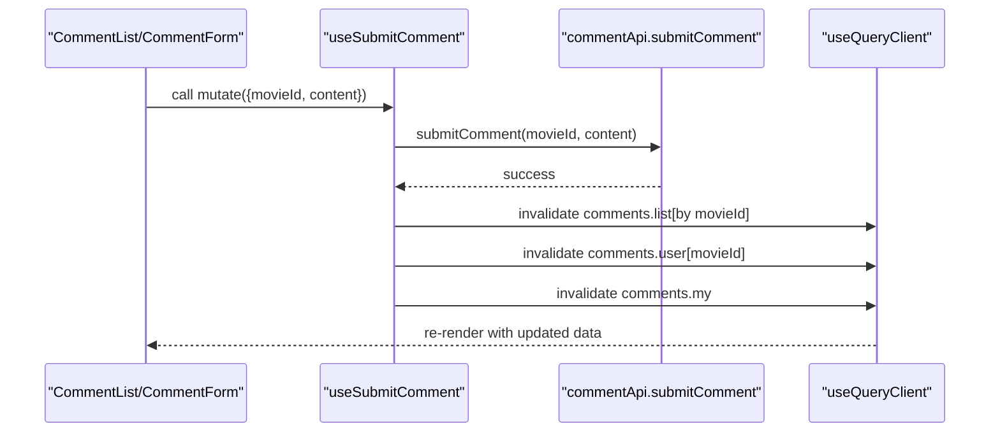
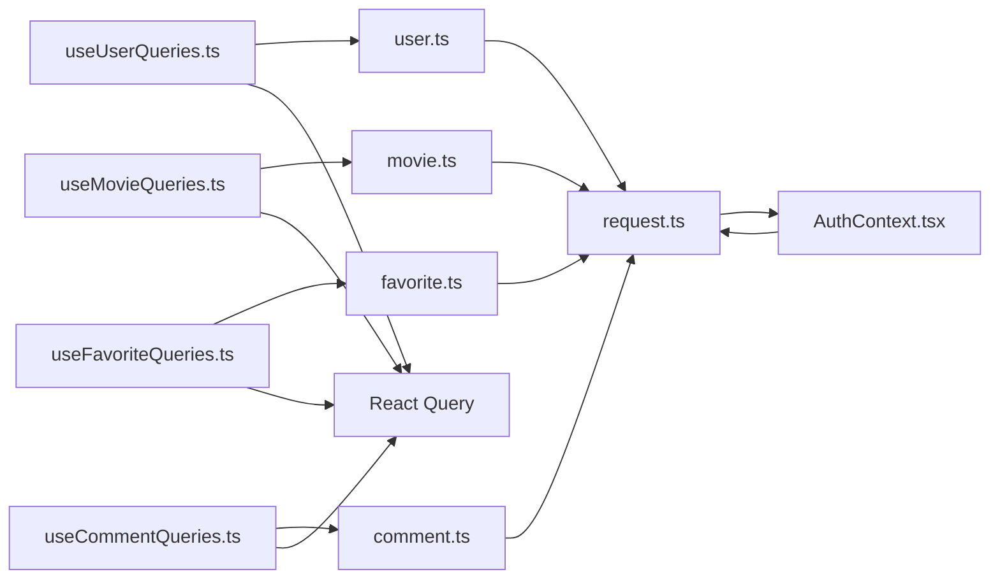

# State Management & React Query

<cite>
**Referenced Files in This Document**
- [main.tsx](file://movie-review-web/src/main.tsx)
- [AuthContext.tsx](file://movie-review-web/src/context/AuthContext.tsx)
- [request.ts](file://movie-review-web/src/api/request.ts)
- [user.ts](file://movie-review-web/src/api/user.ts)
- [movie.ts](file://movie-review-web/src/api/movie.ts)
- [favorite.ts](file://movie-review-web/src/api/favorite.ts)
- [comment.ts](file://movie-review-web/src/api/comment.ts)
- [useUserQueries.ts](file://movie-review-web/src/hooks/useUserQueries.ts)
- [useMovieQueries.ts](file://movie-review-web/src/hooks/useMovieQueries.ts)
- [useFavoriteQueries.ts](file://movie-review-web/src/hooks/useFavoriteQueries.ts)
- [useCommentQueries.ts](file://movie-review-web/src/hooks/useCommentQueries.ts)
- [errorHandler.ts](file://movie-review-web/src/utils/errorHandler.ts)
- [index.ts](file://movie-review-web/src/types/index.ts)
- [App.tsx](file://movie-review-web/src/App.tsx)
- [package.json](file://movie-review-web/package.json)
</cite>

## Table of Contents
1. [Introduction](#introduction)
2. [Project Structure](#project-structure)
3. [Core Components](#core-components)
4. [Architecture Overview](#architecture-overview)
5. [Detailed Component Analysis](#detailed-component-analysis)
6. [Dependency Analysis](#dependency-analysis)
7. [Performance Considerations](#performance-considerations)
8. [Troubleshooting Guide](#troubleshooting-guide)
9. [Conclusion](#conclusion)
10. [Appendices](#appendices)

## Introduction
This document explains the state management architecture built with React Query in the movie review web application. It covers the authentication context, React Query configuration, caching and synchronization strategies, and the custom hooks that encapsulate API calls and local state. It also documents query invalidation, optimistic updates, error handling, performance optimizations, memory management, debugging, persistence, offline handling, and conflict resolution patterns.

## Project Structure
The state management stack is organized around:
- Provider setup: React Query client configured at the root and wrapped with an authentication provider.
- Authentication state: User session and tokens persisted in localStorage and synchronized via events.
- API layer: Axios-based HTTP client with interceptors for token injection and automatic refresh.
- Domain-specific hooks: Query keys and typed hooks for users, movies, favorites, and comments.

**Diagram sources**
- [main.tsx](file://movie-review-web/src/main.tsx#L9-L29)
- [AuthContext.tsx](file://movie-review-web/src/context/AuthContext.tsx#L20-L123)
- [request.ts](file://movie-review-web/src/api/request.ts#L8-L108)
- [useUserQueries.ts](file://movie-review-web/src/hooks/useUserQueries.ts#L1-L36)
- [useMovieQueries.ts](file://movie-review-web/src/hooks/useMovieQueries.ts#L1-L95)
- [useFavoriteQueries.ts](file://movie-review-web/src/hooks/useFavoriteQueries.ts#L1-L174)
- [useCommentQueries.ts](file://movie-review-web/src/hooks/useCommentQueries.ts#L1-L102)
- [user.ts](file://movie-review-web/src/api/user.ts#L1-L36)
- [movie.ts](file://movie-review-web/src/api/movie.ts#L1-L65)
- [favorite.ts](file://movie-review-web/src/api/favorite.ts#L1-L97)
- [comment.ts](file://movie-review-web/src/api/comment.ts#L1-L49)

**Section sources**
- [main.tsx](file://movie-review-web/src/main.tsx#L1-L41)
- [AuthContext.tsx](file://movie-review-web/src/context/AuthContext.tsx#L1-L123)
- [request.ts](file://movie-review-web/src/api/request.ts#L1-L108)
- [useUserQueries.ts](file://movie-review-web/src/hooks/useUserQueries.ts#L1-L36)
- [useMovieQueries.ts](file://movie-review-web/src/hooks/useMovieQueries.ts#L1-L95)
- [useFavoriteQueries.ts](file://movie-review-web/src/hooks/useFavoriteQueries.ts#L1-L174)
- [useCommentQueries.ts](file://movie-review-web/src/hooks/useCommentQueries.ts#L1-L102)
- [user.ts](file://movie-review-web/src/api/user.ts#L1-L36)
- [movie.ts](file://movie-review-web/src/api/movie.ts#L1-L65)
- [favorite.ts](file://movie-review-web/src/api/favorite.ts#L1-L97)
- [comment.ts](file://movie-review-web/src/api/comment.ts#L1-L49)

## Core Components
- Root providers: A single React Query client configured with default caching and retry policies, wrapped with the authentication provider.
- Authentication context: Manages user session, tokens, and global 401 handling via DOM events.
- API client: Centralized Axios instance with request/response interceptors for token injection and silent refresh.
- Domain hooks: Typed React Query hooks for users, movies, favorites, and comments with explicit query keys and invalidation strategies.

Key configuration highlights:
- React Query defaults: staleTime, gcTime, retry, refetchOnReconnect, refetchOnWindowFocus disabled for queries; retry disabled for mutations.
- Auth persistence: localStorage for tokens and user profile; AuthContext initializes synchronously from storage.
- Interceptor-driven refresh: Silent token refresh on 401 with queued retry and global logout fallback.

**Section sources**
- [main.tsx](file://movie-review-web/src/main.tsx#L9-L29)
- [AuthContext.tsx](file://movie-review-web/src/context/AuthContext.tsx#L20-L123)
- [request.ts](file://movie-review-web/src/api/request.ts#L8-L108)
- [user.ts](file://movie-review-web/src/api/user.ts#L1-L36)
- [movie.ts](file://movie-review-web/src/api/movie.ts#L1-L65)
- [favorite.ts](file://movie-review-web/src/api/favorite.ts#L1-L97)
- [comment.ts](file://movie-review-web/src/api/comment.ts#L1-L49)

## Architecture Overview
The architecture integrates React Query with a centralized authentication and API layer. Requests flow through the Axios interceptor chain, which injects Authorization headers and handles token refresh. React Query manages server state, caching, and invalidation. Domain hooks encapsulate API calls and define query keys for precise cache targeting.

**Diagram sources**
- [useUserQueries.ts](file://movie-review-web/src/hooks/useUserQueries.ts#L1-L36)
- [useMovieQueries.ts](file://movie-review-web/src/hooks/useMovieQueries.ts#L1-L95)
- [useFavoriteQueries.ts](file://movie-review-web/src/hooks/useFavoriteQueries.ts#L1-L174)
- [useCommentQueries.ts](file://movie-review-web/src/hooks/useCommentQueries.ts#L1-L102)
- [user.ts](file://movie-review-web/src/api/user.ts#L1-L36)
- [movie.ts](file://movie-review-web/src/api/movie.ts#L1-L65)
- [favorite.ts](file://movie-review-web/src/api/favorite.ts#L1-L97)
- [comment.ts](file://movie-review-web/src/api/comment.ts#L1-L49)
- [request.ts](file://movie-review-web/src/api/request.ts#L21-L106)
- [AuthContext.tsx](file://movie-review-web/src/context/AuthContext.tsx#L88-L110)

## Detailed Component Analysis

### React Query Configuration and Providers
- QueryClient setup defines default caching behavior for queries and mutations, including staleTime, gcTime, retry, and refetch policies.
- Providers wrap the app so hooks can access the query cache and invalidate queries globally or by key.
- Devtools are included for debugging.

**Diagram sources**
- [main.tsx](file://movie-review-web/src/main.tsx#L9-L29)
- [main.tsx](file://movie-review-web/src/main.tsx#L31-L40)

**Section sources**
- [main.tsx](file://movie-review-web/src/main.tsx#L1-L41)

### Authentication Context (AuthContext.tsx)
- Initializes user and token from localStorage synchronously to avoid flicker and race conditions.
- Provides login, register, and logout functions that persist to localStorage and update context state.
- Listens for global “auth:unauthorized” and “auth:token-refreshed” events to keep state in sync.
- Uses lazy initialization for user and token to prevent parsing errors and ensure correctness on first render.

**Diagram sources**
- [AuthContext.tsx](file://movie-review-web/src/context/AuthContext.tsx#L20-L123)

**Section sources**
- [AuthContext.tsx](file://movie-review-web/src/context/AuthContext.tsx#L1-L123)

### API Layer and Interceptors (request.ts)
- Centralized Axios instance with base URL and timeout.
- Request interceptor attaches Authorization header from localStorage.
- Response interceptor normalizes responses and extracts data for successful codes.
- Response interceptor handles 401 by attempting silent refresh using refresh token, queuing pending requests, and dispatching auth events to update UI state.

**Diagram sources**
- [request.ts](file://movie-review-web/src/api/request.ts#L8-L108)

**Section sources**
- [request.ts](file://movie-review-web/src/api/request.ts#L1-L108)

### User Queries (useUserQueries.ts)
- Defines query keys for current user and public user info.
- useCurrentUser fetches authenticated user info with a freshness window (staleTime).
- usePublicUserInfo fetches public profile with enabled guard to avoid unnecessary requests.

**Diagram sources**
- [useUserQueries.ts](file://movie-review-web/src/hooks/useUserQueries.ts#L1-L36)
- [user.ts](file://movie-review-web/src/api/user.ts#L17-L25)

**Section sources**
- [useUserQueries.ts](file://movie-review-web/src/hooks/useUserQueries.ts#L1-L36)
- [user.ts](file://movie-review-web/src/api/user.ts#L1-L36)

### Movie Queries and Mutations (useMovieQueries.ts)
- Query keys for detail, my ratings, search, and latest.
- useMovie fetches detail with enabled guard.
- useMyRatings fetches paginated personal ratings.
- useMovieSearch triggers on non-empty keyword.
- useLatestMovies fetches latest items.
- Mutations:
  - useRateMovie posts rating and invalidates related caches.
  - useDeleteRatingsBatch and useClearMyRatings invalidate rating-related caches.

**Diagram sources**
- [useMovieQueries.ts](file://movie-review-web/src/hooks/useMovieQueries.ts#L54-L68)
- [movie.ts](file://movie-review-web/src/api/movie.ts#L38-L48)

**Section sources**
- [useMovieQueries.ts](file://movie-review-web/src/hooks/useMovieQueries.ts#L1-L95)
- [movie.ts](file://movie-review-web/src/api/movie.ts#L1-L65)

### Favorite Queries and Mutations (useFavoriteQueries.ts)
- Query keys for lists, counts, statuses, folders, and folder movies.
- Queries include pagination and guards to avoid unnecessary requests.
- Mutations:
  - useAddFavorite and useRemoveFavorite invalidate status, lists, count, and optionally folder movies.
  - useBatchDeleteFavorites invalidates all favorites caches.
  - Folder mutations invalidate folders and optional folder detail.

**Diagram sources**
- [useFavoriteQueries.ts](file://movie-review-web/src/hooks/useFavoriteQueries.ts#L79-L133)
- [favorite.ts](file://movie-review-web/src/api/favorite.ts#L4-L93)

**Section sources**
- [useFavoriteQueries.ts](file://movie-review-web/src/hooks/useFavoriteQueries.ts#L1-L174)
- [favorite.ts](file://movie-review-web/src/api/favorite.ts#L1-L97)

### Comment Queries and Mutations (useCommentQueries.ts)
- Query keys for list, my comments, and user comment per movie.
- Queries guard against invalid IDs and support pagination.
- Mutations:
  - useSubmitComment and useUpdateComment invalidate list, user comment, and my comments.
  - useToggleLike invalidates all comment lists to reflect vote changes.

**Diagram sources**
- [useCommentQueries.ts](file://movie-review-web/src/hooks/useCommentQueries.ts#L43-L65)
- [comment.ts](file://movie-review-web/src/api/comment.ts#L17-L32)

**Section sources**
- [useCommentQueries.ts](file://movie-review-web/src/hooks/useCommentQueries.ts#L1-L102)
- [comment.ts](file://movie-review-web/src/api/comment.ts#L1-L49)

### Types and Contracts (types/index.ts)
- Shared types for API responses, entities, pagination, and authentication context.
- Ensures consistent typing across hooks and components.

**Section sources**
- [index.ts](file://movie-review-web/src/types/index.ts#L1-L204)

## Dependency Analysis
The domain hooks depend on the API layer, which depends on the centralized Axios client. The authentication context influences the Axios interceptors and vice versa via DOM events. React Query orchestrates caching and invalidation across all domains.

**Diagram sources**
- [useUserQueries.ts](file://movie-review-web/src/hooks/useUserQueries.ts#L1-L36)
- [useMovieQueries.ts](file://movie-review-web/src/hooks/useMovieQueries.ts#L1-L95)
- [useFavoriteQueries.ts](file://movie-review-web/src/hooks/useFavoriteQueries.ts#L1-L174)
- [useCommentQueries.ts](file://movie-review-web/src/hooks/useCommentQueries.ts#L1-L102)
- [user.ts](file://movie-review-web/src/api/user.ts#L1-L36)
- [movie.ts](file://movie-review-web/src/api/movie.ts#L1-L65)
- [favorite.ts](file://movie-review-web/src/api/favorite.ts#L1-L97)
- [comment.ts](file://movie-review-web/src/api/comment.ts#L1-L49)
- [request.ts](file://movie-review-web/src/api/request.ts#L1-L108)
- [AuthContext.tsx](file://movie-review-web/src/context/AuthContext.tsx#L1-L123)

**Section sources**
- [useUserQueries.ts](file://movie-review-web/src/hooks/useUserQueries.ts#L1-L36)
- [useMovieQueries.ts](file://movie-review-web/src/hooks/useMovieQueries.ts#L1-L95)
- [useFavoriteQueries.ts](file://movie-review-web/src/hooks/useFavoriteQueries.ts#L1-L174)
- [useCommentQueries.ts](file://movie-review-web/src/hooks/useCommentQueries.ts#L1-L102)
- [user.ts](file://movie-review-web/src/api/user.ts#L1-L36)
- [movie.ts](file://movie-review-web/src/api/movie.ts#L1-L65)
- [favorite.ts](file://movie-review-web/src/api/favorite.ts#L1-L97)
- [comment.ts](file://movie-review-web/src/api/comment.ts#L1-L49)
- [request.ts](file://movie-review-web/src/api/request.ts#L1-L108)
- [AuthContext.tsx](file://movie-review-web/src/context/AuthContext.tsx#L1-L123)

## Performance Considerations
- Caching strategy:
  - Queries: staleTime balances freshness vs. network usage; gcTime controls cache retention.
  - Mutations: retry disabled to avoid repeated failures; rely on explicit invalidation.
- Refetch policies:
  - refetchOnWindowFocus disabled to reduce unnecessary network activity.
  - refetchOnReconnect enabled to recover gracefully when connectivity resumes.
- Query granularity:
  - Fine-grained query keys enable targeted invalidation and minimize re-fetch overhead.
- Pagination:
  - Separate query keys per page prevent cache thrashing and allow independent invalidation.
- Memory management:
  - Use gcTime to bound cache lifetime; avoid storing large payloads unnecessarily.
  - Prefer enabled guards to prevent redundant requests.
- Offline handling:
  - Rely on refetchOnReconnect; implement optimistic updates for immediate UI feedback.
- Debugging:
  - ReactQueryDevtools enabled for inspection of cache state and query lifecycle.

**Section sources**
- [main.tsx](file://movie-review-web/src/main.tsx#L9-L29)

## Troubleshooting Guide
- Error extraction:
  - Use a unified error handler to derive user-friendly messages from Axios errors and backend responses.
- 401 handling:
  - Interceptor attempts silent refresh; if it fails, dispatches a global logout event and clears storage.
  - AuthContext listens for logout and clears state; ensure components react to authentication changes.
- Mutation failures:
  - Disable retries for mutations to avoid repeated network calls; surface errors via the error handler.
- Cache inconsistencies:
  - Use targeted invalidation with query keys to refresh affected views.
- Debugging:
  - Inspect cache state and query status via ReactQueryDevtools.
  - Verify query keys match across hooks and invalidations.

**Section sources**
- [errorHandler.ts](file://movie-review-web/src/utils/errorHandler.ts#L1-L60)
- [request.ts](file://movie-review-web/src/api/request.ts#L30-L106)
- [AuthContext.tsx](file://movie-review-web/src/context/AuthContext.tsx#L88-L110)

## Conclusion
The application’s state management leverages React Query for robust caching and synchronization, complemented by a centralized authentication context and Axios interceptors for secure and resilient API communication. Domain-specific hooks encapsulate API concerns and enforce precise cache invalidation, while default query client options balance performance and reliability. Together, these patterns deliver a maintainable, scalable, and user-friendly state layer.

## Appendices

### React Query Configuration Reference
- defaultOptions.queries:
  - staleTime: 5 minutes
  - gcTime: 30 minutes
  - retry: 1
  - refetchOnWindowFocus: false
  - refetchOnReconnect: true
- defaultOptions.mutations:
  - retry: 0

**Section sources**
- [main.tsx](file://movie-review-web/src/main.tsx#L9-L29)

### Dependencies
- React Query and devtools are installed and configured at the root.

**Section sources**
- [package.json](file://movie-review-web/package.json#L12-L28)