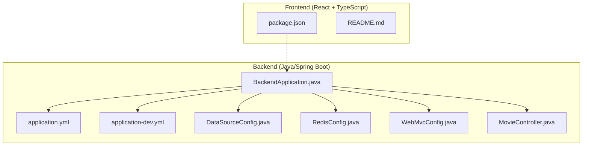
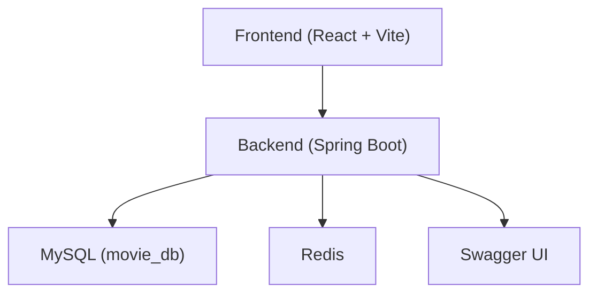
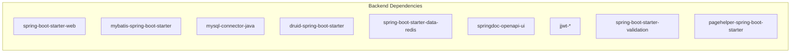

# Getting Started

<cite>
**Referenced Files in This Document**
- [pom.xml](file://backend/pom.xml)
- [application.yml](file://backend/src/main/resources/application.yml)
- [application-dev.yml](file://backend/src/main/resources/application-dev.yml)
- [DataSourceConfig.java](file://backend/src/main/java/com/movie/backend/config/DataSourceConfig.java)
- [RedisConfig.java](file://backend/src/main/java/com/movie/backend/config/RedisConfig.java)
- [WebMvcConfig.java](file://backend/src/main/java/com/movie/backend/config/WebMvcConfig.java)
- [BackendApplication.java](file://backend/src/main/java/com/movie/backend/BackendApplication.java)
- [movie_db.sql](file://backend/sql/movie_db.sql)
- [add_user_status_and_password_version.sql](file://backend/sql/add_user_status_and_password_version.sql)
- [fix_favorites_schema.sql](file://backend/sql/fix_favorites_schema.sql)
- [migrate_favorites_table.sql](file://backend/sql/migrate_favorites_table.sql)
- [HELP.md](file://backend/HELP.md)
- [package.json](file://movie-review-web/package.json)
- [README.md](file://movie-review-web/README.md)
- [MovieController.java](file://backend/src/main/java/com/movie/backend/controller/MovieController.java)
</cite>

## Table of Contents
1. [Introduction](#introduction)
2. [Project Structure](#project-structure)
3. [System Requirements](#system-requirements)
4. [Prerequisites](#prerequisites)
5. [Step-by-Step Installation](#step-by-step-installation)
6. [Environment Setup](#environment-setup)
7. [Database Configuration](#database-configuration)
8. [Local Development Server Startup](#local-development-server-startup)
9. [Initial Project Structure Walkthrough](#initial-project-structure-walkthrough)
10. [Practical Examples](#practical-examples)
11. [Architecture Overview](#architecture-overview)
12. [Dependency Analysis](#dependency-analysis)
13. [Performance Considerations](#performance-considerations)
14. [Troubleshooting Guide](#troubleshooting-guide)
15. [Conclusion](#conclusion)

## Introduction
This guide helps you set up and run the Movie System locally. It covers prerequisites, installation steps, environment configuration, database setup, and how to start both the backend and frontend servers. You will learn how to verify your setup by accessing API endpoints and interacting with the web interface.

## Project Structure
The Movie System consists of:
- A Java/Spring Boot backend under backend/
- A React + TypeScript frontend under movie-review-web/

**Diagram sources**
- [BackendApplication.java](file://backend/src/main/java/com/movie/backend/BackendApplication.java#L1-L17)
- [application.yml](file://backend/src/main/resources/application.yml#L1-L4)
- [application-dev.yml](file://backend/src/main/resources/application-dev.yml#L1-L67)
- [DataSourceConfig.java](file://backend/src/main/java/com/movie/backend/config/DataSourceConfig.java#L1-L62)
- [RedisConfig.java](file://backend/src/main/java/com/movie/backend/config/RedisConfig.java#L1-L42)
- [WebMvcConfig.java](file://backend/src/main/java/com/movie/backend/config/WebMvcConfig.java#L1-L65)
- [MovieController.java](file://backend/src/main/java/com/movie/backend/controller/MovieController.java#L1-L200)
- [package.json](file://movie-review-web/package.json#L1-L42)
- [README.md](file://movie-review-web/README.md#L1-L74)

**Section sources**
- [BackendApplication.java](file://backend/src/main/java/com/movie/backend/BackendApplication.java#L1-L17)
- [application.yml](file://backend/src/main/resources/application.yml#L1-L4)
- [application-dev.yml](file://backend/src/main/resources/application-dev.yml#L1-L67)
- [DataSourceConfig.java](file://backend/src/main/java/com/movie/backend/config/DataSourceConfig.java#L1-L62)
- [RedisConfig.java](file://backend/src/main/java/com/movie/backend/config/RedisConfig.java#L1-L42)
- [WebMvcConfig.java](file://backend/src/main/java/com/movie/backend/config/WebMvcConfig.java#L1-L65)
- [MovieController.java](file://backend/src/main/java/com/movie/backend/controller/MovieController.java#L1-L200)
- [package.json](file://movie-review-web/package.json#L1-L42)
- [README.md](file://movie-review-web/README.md#L1-L74)

## System Requirements
- Java 8 or higher (the project targets Java 8)
- Node.js and npm (for the frontend)
- MySQL database
- Optional: Redis (configured in the backend)
- Optional: Hive JDBC (configured in the backend)

**Section sources**
- [pom.xml](file://backend/pom.xml#L10-L16)
- [application-dev.yml](file://backend/src/main/resources/application-dev.yml#L11-L67)

## Prerequisites
- Install Java 8+ and ensure JAVA_HOME and java are available in PATH
- Install Node.js and npm
- Install MySQL and have credentials ready
- Optionally install Redis and/or prepare a Hive server for JDBC access

**Section sources**
- [pom.xml](file://backend/pom.xml#L10-L16)
- [application-dev.yml](file://backend/src/main/resources/application-dev.yml#L11-L67)

## Step-by-Step Installation
1. Clone or download the repository to your machine.
2. Open a terminal in the backend directory and install backend dependencies via Maven.
3. Open a terminal in the movie-review-web directory and install frontend dependencies via npm.
4. Configure environment variables and database settings as described below.
5. Start the backend server and frontend server as described below.

**Section sources**
- [HELP.md](file://backend/HELP.md#L1-L11)
- [package.json](file://movie-review-web/package.json#L6-L11)

## Environment Setup
- The backend uses Spring Boot profiles. The active profile is configured to dev.
- The dev profile sets the server port, datasource URL, Redis settings, logging, file upload path, and JWT configuration.

Key locations:
- Active profile: [application.yml](file://backend/src/main/resources/application.yml#L1-L4)
- Dev profile settings: [application-dev.yml](file://backend/src/main/resources/application-dev.yml#L1-L67)

Notes:
- Adjust the MySQL URL, username, and password to match your local database.
- Adjust Redis host/port if you run Redis elsewhere.
- Adjust file.upload-path and domain to match your local environment.

**Section sources**
- [application.yml](file://backend/src/main/resources/application.yml#L1-L4)
- [application-dev.yml](file://backend/src/main/resources/application-dev.yml#L1-L67)

## Database Configuration
- The backend expects a MySQL database named movie_db with tables defined in the schema SQL file.
- Apply the schema and any migration scripts as needed.

Schema and migrations:
- Base schema: [movie_db.sql](file://backend/sql/movie_db.sql#L1-L164)
- Add status and password version fields: [add_user_status_and_password_version.sql](file://backend/sql/add_user_status_and_password_version.sql#L1-L16)
- Fix favorites schema to allow multiple folders per movie: [fix_favorites_schema.sql](file://backend/sql/fix_favorites_schema.sql#L1-L60)
- Alternative migration script for favorites table: [migrate_favorites_table.sql](file://backend/sql/migrate_favorites_table.sql#L1-L52)

Steps:
1. Create a MySQL database named movie_db.
2. Run the base schema to create tables.
3. Apply any migration scripts if your current schema differs from the base.

**Section sources**
- [movie_db.sql](file://backend/sql/movie_db.sql#L1-L164)
- [add_user_status_and_password_version.sql](file://backend/sql/add_user_status_and_password_version.sql#L1-L16)
- [fix_favorites_schema.sql](file://backend/sql/fix_favorites_schema.sql#L1-L60)
- [migrate_favorites_table.sql](file://backend/sql/migrate_favorites_table.sql#L1-L52)

## Local Development Server Startup
Backend (Spring Boot):
- From the backend directory, run the Spring Boot application. The main class is BackendApplication.
- The dev profile is active by default, so the server will start using dev settings.

Frontend (Vite + React):
- From the movie-review-web directory, run the dev script to start the frontend development server.
- The frontend reads its scripts from package.json.

Verification:
- Backend runs on the port configured in the dev profile.
- Frontend runs on the port configured by Vite (commonly 5173).

**Section sources**
- [BackendApplication.java](file://backend/src/main/java/com/movie/backend/BackendApplication.java#L10-L16)
- [application-dev.yml](file://backend/src/main/resources/application-dev.yml#L1-L2)
- [package.json](file://movie-review-web/package.json#L6-L11)

## Initial Project Structure Walkthrough
- Backend:
  - Application entry point: BackendApplication.java
  - Configuration:
    - application.yml activates the dev profile
    - application-dev.yml defines server, datasource, Redis, logging, file upload, and JWT settings
    - DataSourceConfig.java wires MySQL and Hive data sources
    - RedisConfig.java configures Redis serialization
    - WebMvcConfig.java registers CORS, interceptors, argument resolvers, and static resource handlers
  - Controllers (example): MovieController.java exposes movie-related endpoints
- Frontend:
  - package.json defines scripts and dependencies
  - README.md provides guidance for the React + TypeScript + Vite template

**Section sources**
- [BackendApplication.java](file://backend/src/main/java/com/movie/backend/BackendApplication.java#L1-L17)
- [application.yml](file://backend/src/main/resources/application.yml#L1-L4)
- [application-dev.yml](file://backend/src/main/resources/application-dev.yml#L1-L67)
- [DataSourceConfig.java](file://backend/src/main/java/com/movie/backend/config/DataSourceConfig.java#L1-L62)
- [RedisConfig.java](file://backend/src/main/java/com/movie/backend/config/RedisConfig.java#L1-L42)
- [WebMvcConfig.java](file://backend/src/main/java/com/movie/backend/config/WebMvcConfig.java#L1-L65)
- [MovieController.java](file://backend/src/main/java/com/movie/backend/controller/MovieController.java#L1-L200)
- [package.json](file://movie-review-web/package.json#L1-L42)
- [README.md](file://movie-review-web/README.md#L1-L74)

## Practical Examples
- Access the backend API docs:
  - Open the Swagger UI endpoint exposed by the dev profile.
  - The endpoint is typically available under the dev profile configuration.
- Call a movie endpoint:
  - Example GET endpoint for movie details is mapped under /movie/detail/{id}.
  - Use a client (browser, curl, or Postman) to request the endpoint with a valid movie ID.
- Upload images:
  - Static image serving is configured to serve files from the upload path.
  - Ensure the upload path exists and is writable.

Note: Replace placeholders with your actual host and port as configured in the dev profile.

**Section sources**
- [application-dev.yml](file://backend/src/main/resources/application-dev.yml#L58-L67)
- [WebMvcConfig.java](file://backend/src/main/java/com/movie/backend/config/WebMvcConfig.java#L55-L63)
- [MovieController.java](file://backend/src/main/java/com/movie/backend/controller/MovieController.java#L46-L66)

## Architecture Overview
High-level runtime architecture:
- The backend exposes REST endpoints and serves static images from a configured upload path.
- The frontend consumes the backend APIs and renders the UI.
- The backend uses:
  - MySQL for primary data persistence
  - Redis for caching/session-like features
  - MyBatis for SQL mapping
  - Spring MVC for web routing and interceptors
  - Swagger/OpenAPI for API documentation

**Diagram sources**
- [application-dev.yml](file://backend/src/main/resources/application-dev.yml#L11-L67)
- [WebMvcConfig.java](file://backend/src/main/java/com/movie/backend/config/WebMvcConfig.java#L1-L65)
- [MovieController.java](file://backend/src/main/java/com/movie/backend/controller/MovieController.java#L1-L200)

## Dependency Analysis
- Backend dependencies include Spring Boot starters, MyBatis, MySQL driver, Druid connection pool, Redis, Swagger/OpenAPI, JWT, validation, PageHelper, and others.
- Frontend dependencies include React, React Router, TanStack React Query, Axios, Tailwind, and Vite tooling.

**Diagram sources**
- [pom.xml](file://backend/pom.xml#L17-L248)

**Section sources**
- [pom.xml](file://backend/pom.xml#L17-L248)

## Performance Considerations
- Tune Tomcat thread pool settings in the dev profile for connection and keep-alive timeouts.
- Monitor MySQL connection pool sizing and validation queries.
- Use Redis for caching frequently accessed data.
- Limit multipart file sizes as configured to avoid memory pressure.

**Section sources**
- [application-dev.yml](file://backend/src/main/resources/application-dev.yml#L1-L10)
- [application-dev.yml](file://backend/src/main/resources/application-dev.yml#L19-L25)
- [application-dev.yml](file://backend/src/main/resources/application-dev.yml#L33-L37)

## Troubleshooting Guide
Common issues and resolutions:
- Java version mismatch:
  - Ensure Java 8+ is installed and the JAVA_HOME points to the correct JDK.
- Maven build errors:
  - Clean and recompile the backend project using Maven commands.
- Node/npm not found:
  - Install Node.js and ensure npm is available in PATH.
- MySQL connectivity:
  - Verify the MySQL URL, username, and password in the dev profile.
  - Confirm the database movie_db exists and the schema is applied.
- Redis connectivity:
  - If Redis is disabled or unreachable, adjust the dev profile accordingly.
- Port conflicts:
  - Change the server.port in the dev profile if 9090 is in use.
- Static image serving:
  - Ensure the upload path exists and is readable/writable by the backend.

**Section sources**
- [HELP.md](file://backend/HELP.md#L1-L11)
- [application-dev.yml](file://backend/src/main/resources/application-dev.yml#L1-L2)
- [application-dev.yml](file://backend/src/main/resources/application-dev.yml#L11-L67)
- [WebMvcConfig.java](file://backend/src/main/java/com/movie/backend/config/WebMvcConfig.java#L55-L63)

## Conclusion
You now have the essentials to install, configure, and run the Movie System locally. Start the backend and frontend servers, apply the database schema, and explore the API endpoints and UI. Use the troubleshooting section to resolve typical setup issues quickly.