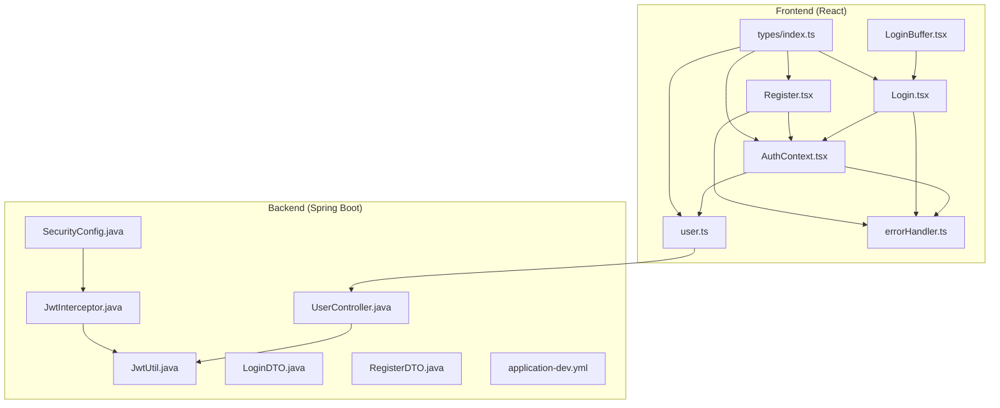
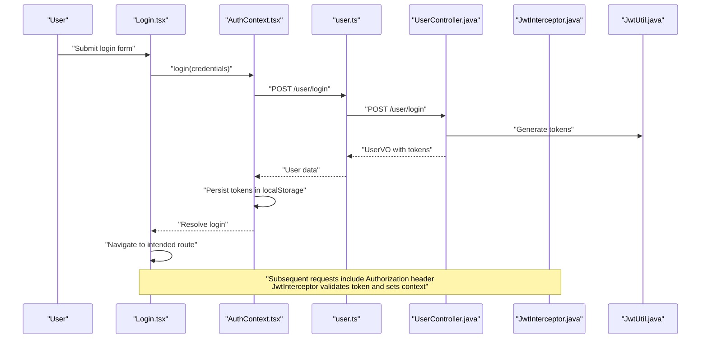
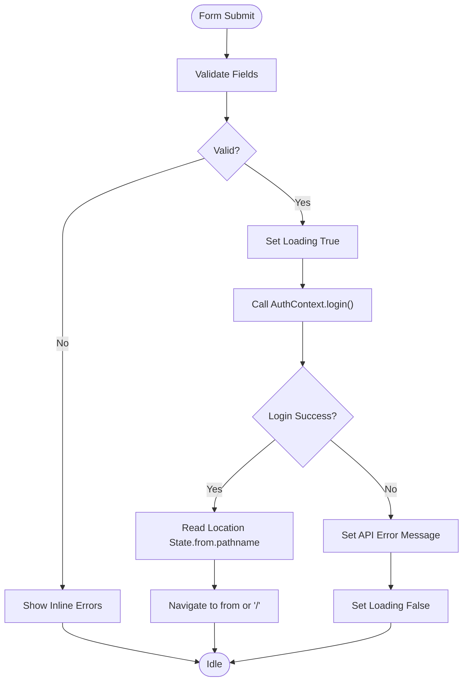
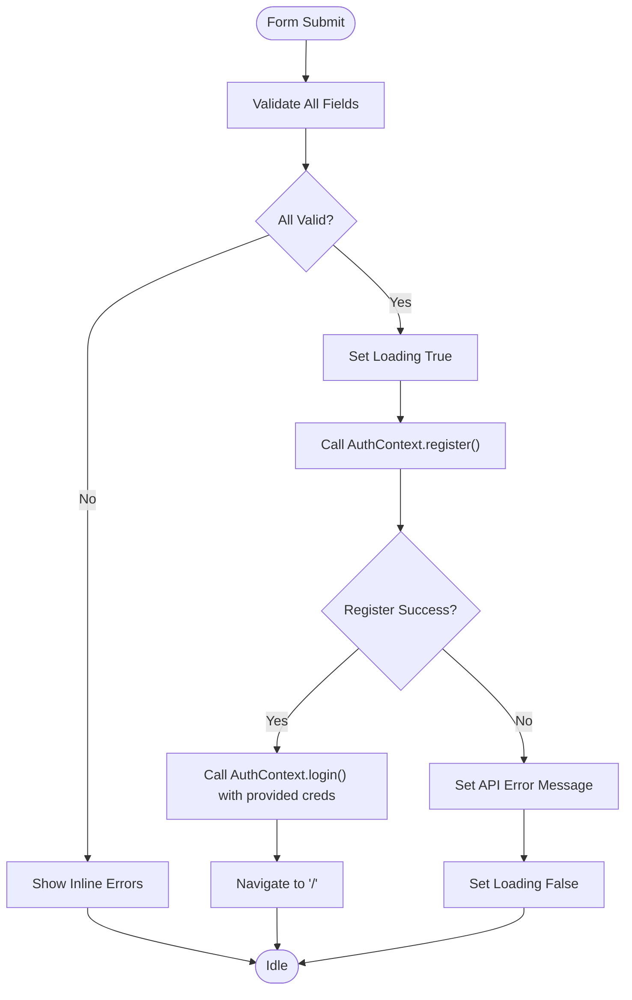
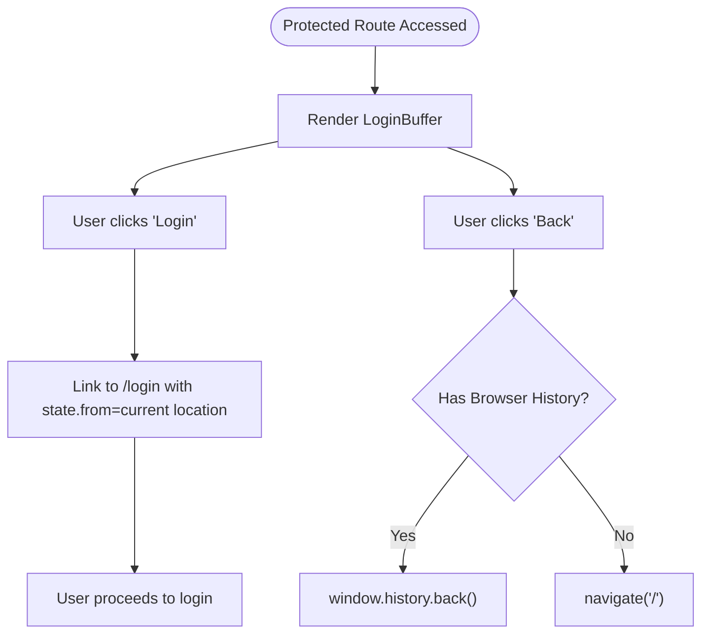
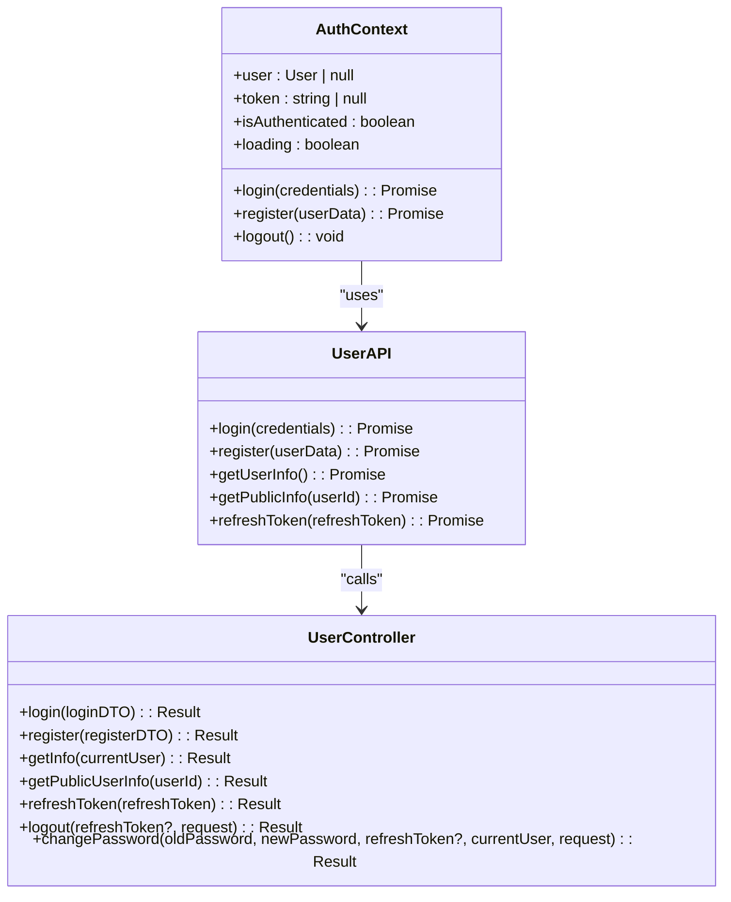
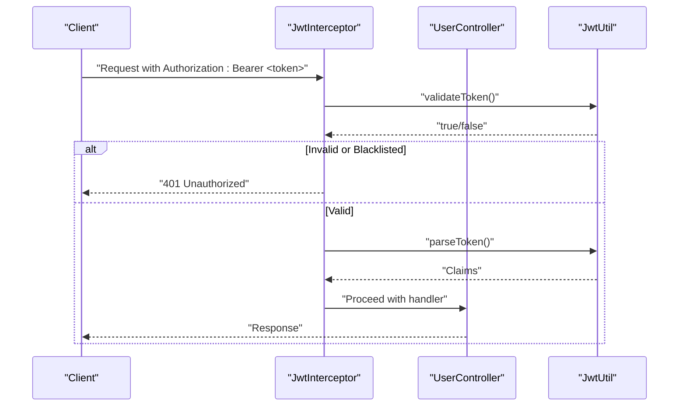
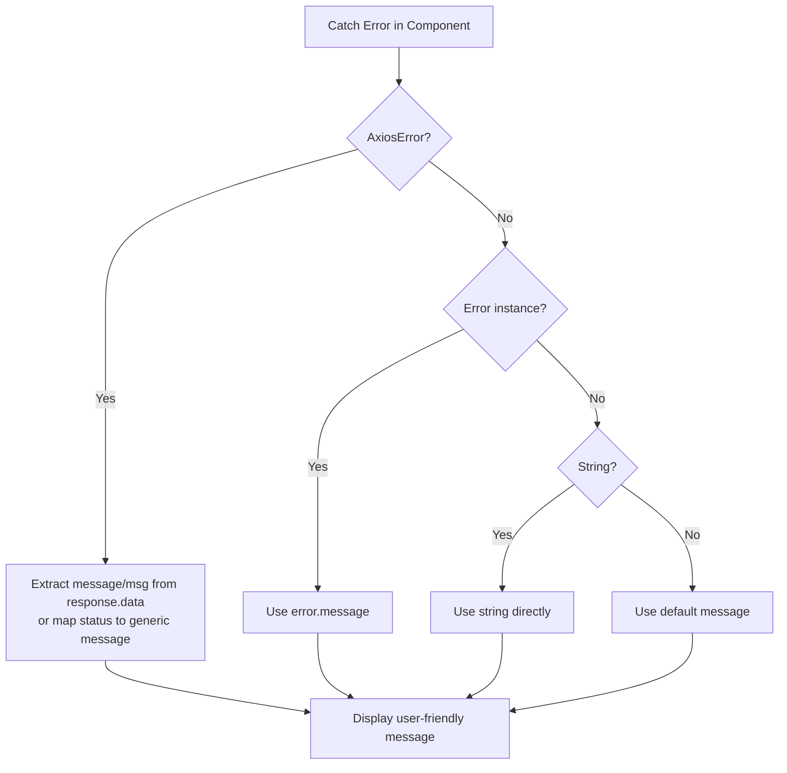
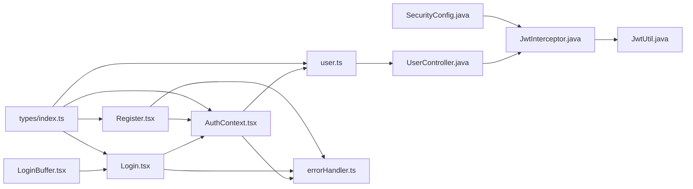

# Authentication Pages

<cite>
**Referenced Files in This Document**
- [Login.tsx](file://movie-review-web/src/pages/Login.tsx)
- [Register.tsx](file://movie-review-web/src/pages/Register.tsx)
- [LoginBuffer.tsx](file://movie-review-web/src/components/LoginBuffer.tsx)
- [AuthContext.tsx](file://movie-review-web/src/context/AuthContext.tsx)
- [user.ts](file://movie-review-web/src/api/user.ts)
- [errorHandler.ts](file://movie-review-web/src/utils/errorHandler.ts)
- [UserController.java](file://backend/src/main/java/com/movie/backend/controller/UserController.java)
- [LoginDTO.java](file://backend/src/main/java/com/movie/backend/dto/LoginDTO.java)
- [RegisterDTO.java](file://backend/src/main/java/com/movie/backend/dto/RegisterDTO.java)
- [SecurityConfig.java](file://backend/src/main/java/com/movie/backend/config/SecurityConfig.java)
- [JwtUtil.java](file://backend/src/main/java/com/movie/backend/utils/JwtUtil.java)
- [JwtInterceptor.java](file://backend/src/main/java/com/movie/backend/config/JwtInterceptor.java)
- [application-dev.yml](file://backend/src/main/resources/application-dev.yml)
- [index.ts](file://movie-review-web/src/types/index.ts)
</cite>

## Table of Contents
1. [Introduction](#introduction)
2. [Project Structure](#project-structure)
3. [Core Components](#core-components)
4. [Architecture Overview](#architecture-overview)
5. [Detailed Component Analysis](#detailed-component-analysis)
6. [Dependency Analysis](#dependency-analysis)
7. [Performance Considerations](#performance-considerations)
8. [Troubleshooting Guide](#troubleshooting-guide)
9. [Conclusion](#conclusion)
10. [Appendices](#appendices)

## Introduction
This document provides comprehensive documentation for the authentication-related pages and login buffer functionality in the movie review web application. It covers the login page implementation, registration form handling, password validation, and user onboarding flow. It also details the login buffer component that manages authentication state during redirects, form validation patterns, and error handling strategies. The document explains component composition, form state management, and integration with the authentication context. Security considerations, CSRF protection, and session management are addressed, along with examples of form submission handling, redirect logic after authentication, and user feedback mechanisms. Accessibility requirements for authentication forms and password security best practices are included.

## Project Structure
The authentication system spans both the frontend React application and the backend Java Spring Boot service. The frontend includes dedicated pages for login and registration, a reusable login buffer component for protected routes, an authentication context provider for global state, API wrappers for user operations, and a centralized error handling utility. The backend exposes REST endpoints for login, registration, user info retrieval, token refresh, logout, and password change, secured by JWT-based stateless authentication with a custom interceptor and security configuration.

**Diagram sources**
- [Login.tsx](file://movie-review-web/src/pages/Login.tsx#L1-L148)
- [Register.tsx](file://movie-review-web/src/pages/Register.tsx#L1-L199)
- [LoginBuffer.tsx](file://movie-review-web/src/components/LoginBuffer.tsx#L1-L74)
- [AuthContext.tsx](file://movie-review-web/src/context/AuthContext.tsx#L1-L123)
- [user.ts](file://movie-review-web/src/api/user.ts#L1-L36)
- [errorHandler.ts](file://movie-review-web/src/utils/errorHandler.ts#L1-L60)
- [UserController.java](file://backend/src/main/java/com/movie/backend/controller/UserController.java#L1-L130)
- [SecurityConfig.java](file://backend/src/main/java/com/movie/backend/config/SecurityConfig.java#L1-L51)
- [JwtInterceptor.java](file://backend/src/main/java/com/movie/backend/config/JwtInterceptor.java#L1-L105)
- [JwtUtil.java](file://backend/src/main/java/com/movie/backend/utils/JwtUtil.java#L1-L179)
- [LoginDTO.java](file://backend/src/main/java/com/movie/backend/dto/LoginDTO.java#L1-L19)
- [RegisterDTO.java](file://backend/src/main/java/com/movie/backend/dto/RegisterDTO.java#L1-L34)
- [application-dev.yml](file://backend/src/main/resources/application-dev.yml#L62-L67)
- [index.ts](file://movie-review-web/src/types/index.ts#L90-L114)

**Section sources**
- [Login.tsx](file://movie-review-web/src/pages/Login.tsx#L1-L148)
- [Register.tsx](file://movie-review-web/src/pages/Register.tsx#L1-L199)
- [LoginBuffer.tsx](file://movie-review-web/src/components/LoginBuffer.tsx#L1-L74)
- [AuthContext.tsx](file://movie-review-web/src/context/AuthContext.tsx#L1-L123)
- [user.ts](file://movie-review-web/src/api/user.ts#L1-L36)
- [errorHandler.ts](file://movie-review-web/src/utils/errorHandler.ts#L1-L60)
- [UserController.java](file://backend/src/main/java/com/movie/backend/controller/UserController.java#L1-L130)
- [SecurityConfig.java](file://backend/src/main/java/com/movie/backend/config/SecurityConfig.java#L1-L51)
- [JwtInterceptor.java](file://backend/src/main/java/com/movie/backend/config/JwtInterceptor.java#L1-L105)
- [JwtUtil.java](file://backend/src/main/java/com/movie/backend/utils/JwtUtil.java#L1-L179)
- [LoginDTO.java](file://backend/src/main/java/com/movie/backend/dto/LoginDTO.java#L1-L19)
- [RegisterDTO.java](file://backend/src/main/java/com/movie/backend/dto/RegisterDTO.java#L1-L34)
- [application-dev.yml](file://backend/src/main/resources/application-dev.yml#L62-L67)
- [index.ts](file://movie-review-web/src/types/index.ts#L90-L114)

## Core Components
- Login Page: Handles credential input, client-side validation, submission to the authentication context, and redirect logic after successful login.
- Registration Page: Manages multi-field form validation, password confirmation, email format validation, and automatic login upon successful registration.
- Login Buffer: Presents a friendly barrier for protected content, prompting users to log in while preserving the intended destination.
- Authentication Context: Centralizes authentication state, persists tokens and user data in local storage, and exposes login/register/logout functions.
- User API Wrapper: Encapsulates HTTP requests to backend endpoints with typed responses.
- Error Handler: Provides unified extraction of user-friendly messages from various error sources (Axios, network, business logic).
- Backend Controllers and Security: Expose REST endpoints for authentication, enforce JWT-based stateless authentication, and manage token lifecycle.

**Section sources**
- [Login.tsx](file://movie-review-web/src/pages/Login.tsx#L14-L61)
- [Register.tsx](file://movie-review-web/src/pages/Register.tsx#L8-L65)
- [LoginBuffer.tsx](file://movie-review-web/src/components/LoginBuffer.tsx#L11-L27)
- [AuthContext.tsx](file://movie-review-web/src/context/AuthContext.tsx#L20-L86)
- [user.ts](file://movie-review-web/src/api/user.ts#L4-L32)
- [errorHandler.ts](file://movie-review-web/src/utils/errorHandler.ts#L17-L60)
- [UserController.java](file://backend/src/main/java/com/movie/backend/controller/UserController.java#L32-L86)
- [SecurityConfig.java](file://backend/src/main/java/com/movie/backend/config/SecurityConfig.java#L24-L46)

## Architecture Overview
The authentication architecture follows a stateless JWT model. On the frontend, users submit credentials or registration data. The authentication context invokes the user API, which communicates with backend controllers. The JWT interceptor validates tokens, sets authorities, and loads user context. Security configuration disables CSRF and form login, enforcing stateless behavior suitable for token-based authentication.

**Diagram sources**
- [Login.tsx](file://movie-review-web/src/pages/Login.tsx#L36-L61)
- [AuthContext.tsx](file://movie-review-web/src/context/AuthContext.tsx#L44-L63)
- [user.ts](file://movie-review-web/src/api/user.ts#L6-L10)
- [UserController.java](file://backend/src/main/java/com/movie/backend/controller/UserController.java#L32-L36)
- [JwtInterceptor.java](file://backend/src/main/java/com/movie/backend/config/JwtInterceptor.java#L34-L95)
- [JwtUtil.java](file://backend/src/main/java/com/movie/backend/utils/JwtUtil.java#L49-L107)

## Detailed Component Analysis

### Login Page Implementation
- State Management: Maintains form data, inline validation errors, loading state, and API error messages.
- Validation: Enforces presence checks for username and password.
- Submission: Prevents default form submission, validates, sets loading, calls context login, and navigates to the intended destination derived from location state.
- Feedback: Displays user-friendly error messages via the shared error handler.

**Diagram sources**
- [Login.tsx](file://movie-review-web/src/pages/Login.tsx#L28-L61)

**Section sources**
- [Login.tsx](file://movie-review-web/src/pages/Login.tsx#L14-L61)

### Registration Form Handling
- State Management: Tracks multi-field form data, validation errors, loading, and API error messages.
- Validation: Enforces minimum length for username and password, confirms password match, requires nickname, and validates email format.
- Submission: Prevents default, validates, sets loading, calls register, and automatically triggers login with provided credentials.
- Redirect: Navigates to home on success.

**Diagram sources**
- [Register.tsx](file://movie-review-web/src/pages/Register.tsx#L25-L65)

**Section sources**
- [Register.tsx](file://movie-review-web/src/pages/Register.tsx#L8-L65)

### Login Buffer Component
- Purpose: Blocks access to protected content and prompts users to log in while preserving the target resource identifier and message.
- Navigation: Links to the login page with state containing the current location for post-authentication redirect.
- Back Navigation: Falls back to home if browser history is unavailable.

**Diagram sources**
- [LoginBuffer.tsx](file://movie-review-web/src/components/LoginBuffer.tsx#L11-L27)

**Section sources**
- [LoginBuffer.tsx](file://movie-review-web/src/components/LoginBuffer.tsx#L11-L74)

### Authentication Context and State Management
- Initialization: Reads tokens and user data from local storage synchronously to avoid flicker and ensure immediate state correctness.
- Login: Calls user API, stores tokens and user data, updates context state.
- Register: Calls user API, then immediately logs in with provided credentials.
- Logout: Removes tokens and user data from local storage and clears context state.
- Global Events: Listens for unauthorized events and token refresh events to maintain consistency across tabs/windows.

**Diagram sources**
- [AuthContext.tsx](file://movie-review-web/src/context/AuthContext.tsx#L20-L120)
- [user.ts](file://movie-review-web/src/api/user.ts#L4-L32)
- [UserController.java](file://backend/src/main/java/com/movie/backend/controller/UserController.java#L32-L104)

**Section sources**
- [AuthContext.tsx](file://movie-review-web/src/context/AuthContext.tsx#L20-L120)
- [user.ts](file://movie-review-web/src/api/user.ts#L4-L32)
- [UserController.java](file://backend/src/main/java/com/movie/backend/controller/UserController.java#L32-L104)

### Backend Authentication Endpoints and Security
- Endpoints: Login, register, user info, public user info, refresh token, logout, change password.
- Security: Stateless JWT authentication via a custom interceptor; CSRF disabled; form login disabled; session policy stateless.
- Token Lifecycle: Access tokens short-lived; refresh tokens long-lived; password changes invalidate tokens via password version checks.

**Diagram sources**
- [JwtInterceptor.java](file://backend/src/main/java/com/movie/backend/config/JwtInterceptor.java#L34-L95)
- [JwtUtil.java](file://backend/src/main/java/com/movie/backend/utils/JwtUtil.java#L99-L107)
- [UserController.java](file://backend/src/main/java/com/movie/backend/controller/UserController.java#L32-L86)

**Section sources**
- [UserController.java](file://backend/src/main/java/com/movie/backend/controller/UserController.java#L32-L104)
- [SecurityConfig.java](file://backend/src/main/java/com/movie/backend/config/SecurityConfig.java#L24-L46)
- [JwtInterceptor.java](file://backend/src/main/java/com/movie/backend/config/JwtInterceptor.java#L34-L95)
- [JwtUtil.java](file://backend/src/main/java/com/movie/backend/utils/JwtUtil.java#L99-L155)

### Form Validation Patterns and Error Handling
- Frontend Validation: Inline validation with immediate feedback for required fields and format-specific checks.
- Backend Validation: DTO-level validation ensures robustness against malformed requests.
- Error Handling: Unified error extraction utility handles Axios HTTP errors, business logic errors, and defaults to a safe message.

**Diagram sources**
- [errorHandler.ts](file://movie-review-web/src/utils/errorHandler.ts#L17-L60)
- [LoginDTO.java](file://backend/src/main/java/com/movie/backend/dto/LoginDTO.java#L12-L18)
- [RegisterDTO.java](file://backend/src/main/java/com/movie/backend/dto/RegisterDTO.java#L14-L30)

**Section sources**
- [errorHandler.ts](file://movie-review-web/src/utils/errorHandler.ts#L17-L60)
- [LoginDTO.java](file://backend/src/main/java/com/movie/backend/dto/LoginDTO.java#L12-L18)
- [RegisterDTO.java](file://backend/src/main/java/com/movie/backend/dto/RegisterDTO.java#L14-L30)

### Redirect Logic After Authentication
- Login: Reads location state to determine the intended destination; navigates there after successful login.
- Registration: Automatically logs in the user after registration and navigates to home.

**Section sources**
- [Login.tsx](file://movie-review-web/src/pages/Login.tsx#L50-L58)
- [Register.tsx](file://movie-review-web/src/pages/Register.tsx#L48-L65)

### User Feedback Mechanisms
- Inline Field Errors: Immediate validation feedback for each field.
- API Error Banner: Displays contextual error messages for server-side failures.
- Loading States: Disables submit buttons and shows loading text to indicate progress.

**Section sources**
- [Login.tsx](file://movie-review-web/src/pages/Login.tsx#L28-L34)
- [Register.tsx](file://movie-review-web/src/pages/Register.tsx#L25-L38)
- [Login.tsx](file://movie-review-web/src/pages/Login.tsx#L77-L82)
- [Register.tsx](file://movie-review-web/src/pages/Register.tsx#L80-L86)

### Accessibility Requirements
- Labels and Inputs: Each input has an associated label element for screen readers.
- Focus Management: Inputs receive focus ring styles for keyboard navigation.
- ARIA: No explicit ARIA attributes are present; ensure adding aria-describedby for dynamic error messages if needed.
- Color Contrast: Sufficient contrast maintained for text and controls.
- Autocomplete: Appropriate autocomplete attributes for username and password.

**Section sources**
- [Login.tsx](file://movie-review-web/src/pages/Login.tsx#L84-L114)
- [Register.tsx](file://movie-review-web/src/pages/Register.tsx#L88-L178)

### Password Security Best Practices
- Minimum Length: Enforced on both frontend and backend.
- Password Confirmation: Ensures consistency on registration.
- Token Expiration: Access tokens short-lived; refresh tokens long-lived.
- Password Change Impact: Changing passwords increments password version, invalidating existing tokens.

**Section sources**
- [Register.tsx](file://movie-review-web/src/pages/Register.tsx#L29-L31)
- [RegisterDTO.java](file://backend/src/main/java/com/movie/backend/dto/RegisterDTO.java#L20-L22)
- [application-dev.yml](file://backend/src/main/resources/application-dev.yml#L63-L67)
- [JwtUtil.java](file://backend/src/main/java/com/movie/backend/utils/JwtUtil.java#L147-L151)

## Dependency Analysis
The frontend authentication stack depends on the authentication context for state and the user API wrapper for backend communication. The backend enforces JWT-based security via a custom interceptor and configuration, with controllers implementing the authentication endpoints.

**Diagram sources**
- [Login.tsx](file://movie-review-web/src/pages/Login.tsx#L1-L148)
- [Register.tsx](file://movie-review-web/src/pages/Register.tsx#L1-L199)
- [LoginBuffer.tsx](file://movie-review-web/src/components/LoginBuffer.tsx#L1-L74)
- [AuthContext.tsx](file://movie-review-web/src/context/AuthContext.tsx#L1-L123)
- [user.ts](file://movie-review-web/src/api/user.ts#L1-L36)
- [errorHandler.ts](file://movie-review-web/src/utils/errorHandler.ts#L1-L60)
- [UserController.java](file://backend/src/main/java/com/movie/backend/controller/UserController.java#L1-L130)
- [SecurityConfig.java](file://backend/src/main/java/com/movie/backend/config/SecurityConfig.java#L1-L51)
- [JwtInterceptor.java](file://backend/src/main/java/com/movie/backend/config/JwtInterceptor.java#L1-L105)
- [JwtUtil.java](file://backend/src/main/java/com/movie/backend/utils/JwtUtil.java#L1-L179)
- [index.ts](file://movie-review-web/src/types/index.ts#L1-L204)

**Section sources**
- [index.ts](file://movie-review-web/src/types/index.ts#L90-L114)
- [user.ts](file://movie-review-web/src/api/user.ts#L1-L36)
- [AuthContext.tsx](file://movie-review-web/src/context/AuthContext.tsx#L1-L123)
- [UserController.java](file://backend/src/main/java/com/movie/backend/controller/UserController.java#L1-L130)
- [SecurityConfig.java](file://backend/src/main/java/com/movie/backend/config/SecurityConfig.java#L1-L51)
- [JwtInterceptor.java](file://backend/src/main/java/com/movie/backend/config/JwtInterceptor.java#L1-L105)
- [JwtUtil.java](file://backend/src/main/java/com/movie/backend/utils/JwtUtil.java#L1-L179)

## Performance Considerations
- Local Storage Usage: Authentication state is persisted locally to avoid repeated network calls on page reloads.
- Minimal Re-renders: Form state is managed per field to reduce unnecessary re-renders.
- Token Expiration: Short-lived access tokens minimize exposure windows; refresh tokens are handled server-side with strict validation.
- Interceptor Efficiency: JWT validation and blacklist checks occur only once per request.

[No sources needed since this section provides general guidance]

## Troubleshooting Guide
- Login Fails with 401: Verify credentials and ensure the Authorization header is correctly attached on subsequent requests. Check for token revocation or password version mismatch.
- Registration Errors: Confirm that username and password meet backend constraints and that email format is valid.
- Redirect Issues: Ensure location state is properly passed when navigating to the login page from protected routes.
- Error Messages: Use the unified error handler to diagnose Axios HTTP errors, network timeouts, or business logic exceptions.

**Section sources**
- [errorHandler.ts](file://movie-review-web/src/utils/errorHandler.ts#L17-L60)
- [JwtInterceptor.java](file://backend/src/main/java/com/movie/backend/config/JwtInterceptor.java#L46-L60)
- [JwtUtil.java](file://backend/src/main/java/com/movie/backend/utils/JwtUtil.java#L134-L151)
- [Login.tsx](file://movie-review-web/src/pages/Login.tsx#L50-L58)
- [Register.tsx](file://movie-review-web/src/pages/Register.tsx#L48-L65)

## Conclusion
The authentication system combines robust frontend form handling with secure backend JWT-based stateless authentication. The login and registration pages provide clear validation and feedback, while the login buffer gracefully handles protected content access. The authentication context centralizes state management and integrates seamlessly with the user API. Security configurations disable CSRF and enforce stateless behavior, and token lifecycle management ensures secure and reliable user sessions.

[No sources needed since this section summarizes without analyzing specific files]

## Appendices
- Token Configuration: Access token expiration and refresh token expiration are defined in the development profile.
- DTO Contracts: Login and registration DTOs define validation constraints enforced by the backend.

**Section sources**
- [application-dev.yml](file://backend/src/main/resources/application-dev.yml#L63-L67)
- [LoginDTO.java](file://backend/src/main/java/com/movie/backend/dto/LoginDTO.java#L12-L18)
- [RegisterDTO.java](file://backend/src/main/java/com/movie/backend/dto/RegisterDTO.java#L14-L30)