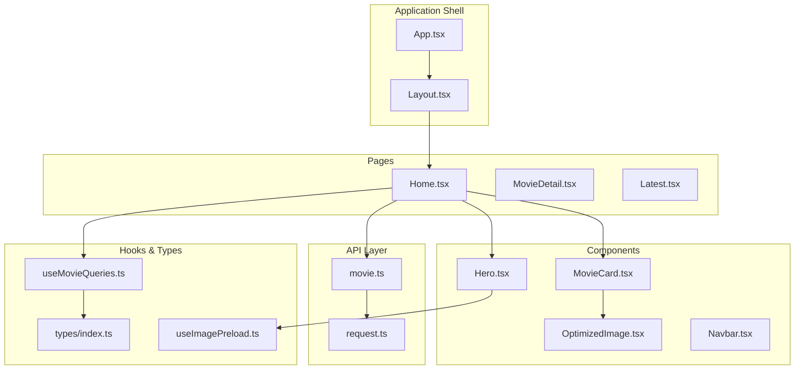
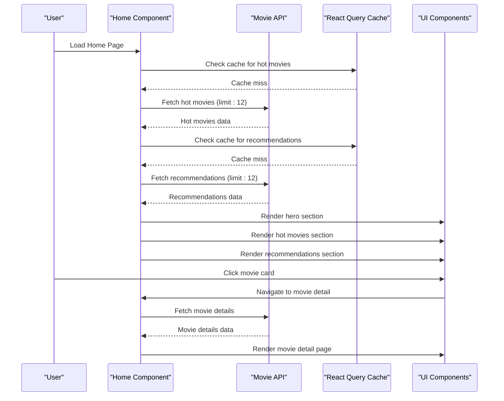
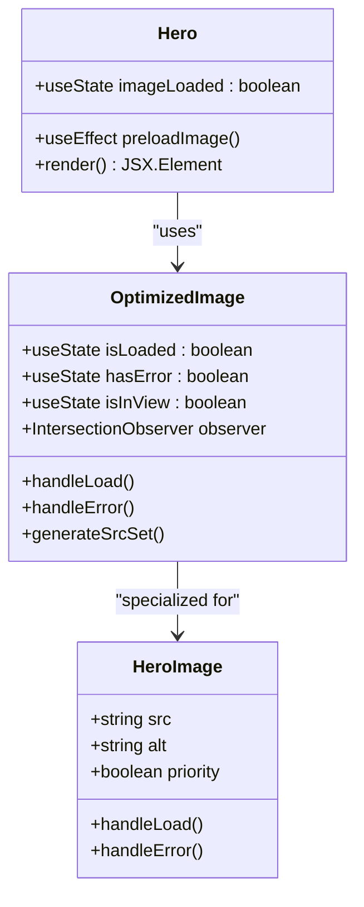
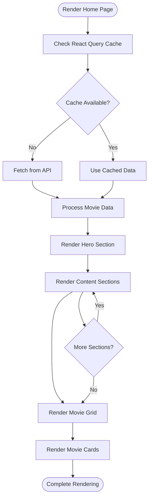
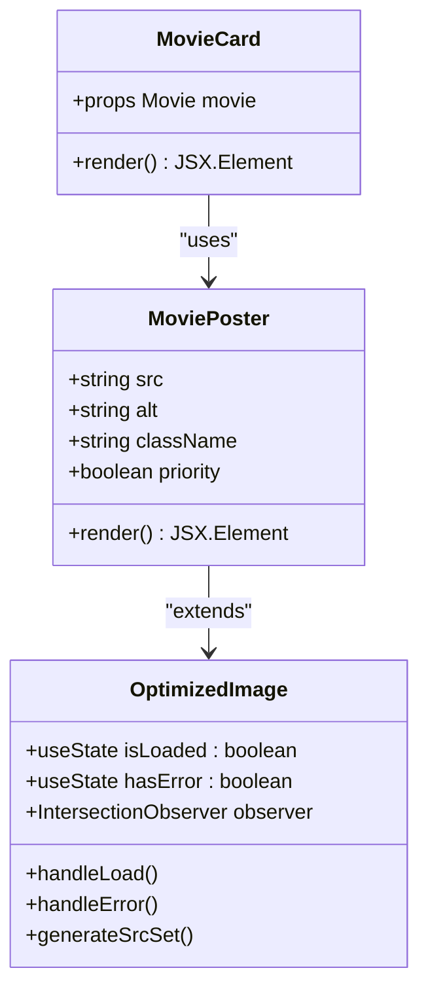
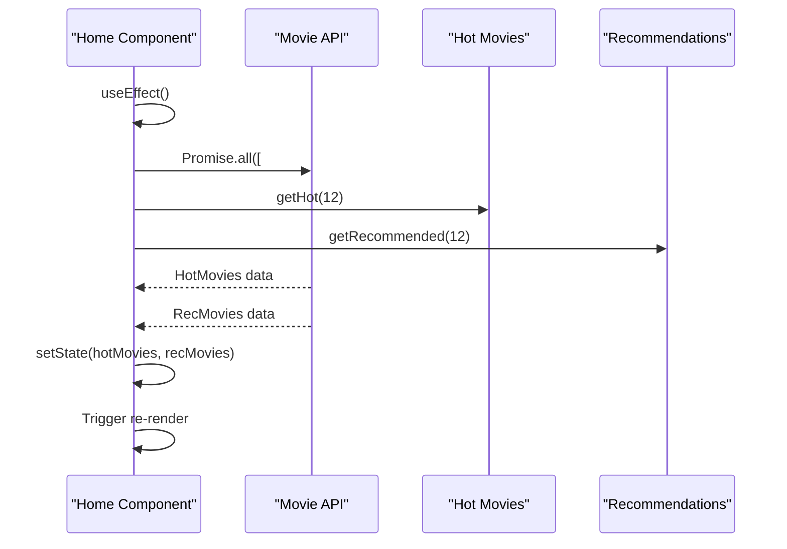
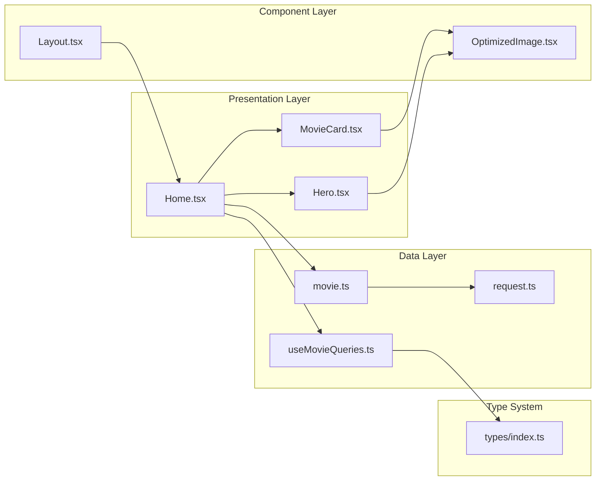

# Home Page

<cite>
**Referenced Files in This Document**
- [Home.tsx](file://movie-review-web/src/pages/Home.tsx)
- [Hero.tsx](file://movie-review-web/src/components/Hero.tsx)
- [MovieCard.tsx](file://movie-review-web/src/components/MovieCard.tsx)
- [OptimizedImage.tsx](file://movie-review-web/src/components/OptimizedImage.tsx)
- [useMovieQueries.ts](file://movie-review-web/src/hooks/useMovieQueries.ts)
- [movie.ts](file://movie-review-web/src/api/movie.ts)
- [request.ts](file://movie-review-web/src/api/request.ts)
- [index.ts](file://movie-review-web/src/types/index.ts)
- [App.tsx](file://movie-review-web/src/App.tsx)
- [Layout.tsx](file://movie-review-web/src/components/Layout.tsx)
- [useImagePreload.ts](file://movie-review-web/src/utils/useImagePreload.ts)
</cite>

## Table of Contents
1. [Introduction](#introduction)
2. [Project Structure](#project-structure)
3. [Core Components](#core-components)
4. [Architecture Overview](#architecture-overview)
5. [Detailed Component Analysis](#detailed-component-analysis)
6. [Dependency Analysis](#dependency-analysis)
7. [Performance Considerations](#performance-considerations)
8. [Troubleshooting Guide](#troubleshooting-guide)
9. [Conclusion](#conclusion)

## Introduction
This document provides comprehensive technical documentation for the Home page component and hero section implementation. It covers the main landing page structure, featured content display, trending movies carousel, and promotional banners. The documentation details data fetching strategies for popular movies, latest releases, and personalized recommendations, along with component composition patterns, responsive design implementation, and performance optimization techniques. It also explains the hero section's role in user engagement, call-to-action buttons, and navigation triggers, and provides examples of content loading states, infinite scroll implementation, and integration with the movie catalog API.

## Project Structure
The Home page is part of a React-based frontend application built with TypeScript and Tailwind CSS. The structure follows a feature-based organization with clear separation between pages, components, APIs, and utilities.

**Diagram sources**
- [App.tsx](file://movie-review-web/src/App.tsx#L1-L50)
- [Layout.tsx](file://movie-review-web/src/components/Layout.tsx#L1-L68)
- [Home.tsx](file://movie-review-web/src/pages/Home.tsx#L1-L65)
- [Hero.tsx](file://movie-review-web/src/components/Hero.tsx#L1-L68)
- [MovieCard.tsx](file://movie-review-web/src/components/MovieCard.tsx#L1-L38)
- [OptimizedImage.tsx](file://movie-review-web/src/components/OptimizedImage.tsx#L1-L179)
- [movie.ts](file://movie-review-web/src/api/movie.ts#L1-L65)
- [request.ts](file://movie-review-web/src/api/request.ts#L1-L108)
- [useMovieQueries.ts](file://movie-review-web/src/hooks/useMovieQueries.ts#L1-L95)
- [index.ts](file://movie-review-web/src/types/index.ts#L1-L204)
- [useImagePreload.ts](file://movie-review-web/src/utils/useImagePreload.ts#L1-L75)

**Section sources**
- [App.tsx](file://movie-review-web/src/App.tsx#L1-L50)
- [Layout.tsx](file://movie-review-web/src/components/Layout.tsx#L1-L68)

## Core Components
The Home page consists of several interconnected components that work together to deliver an engaging user experience:

### Home Page Container
The main Home component serves as the orchestrator for the landing page, managing state for featured content and coordinating data fetching operations.

### Hero Section
The Hero component creates a visually striking focal point with dynamic background loading and prominent call-to-action buttons.

### Content Sections
Custom Section components render different categories of movie content with responsive grid layouts.

### Movie Cards
Individual MovieCard components provide interactive movie previews with hover effects and navigation capabilities.

**Section sources**
- [Home.tsx](file://movie-review-web/src/pages/Home.tsx#L1-L65)
- [Hero.tsx](file://movie-review-web/src/components/Hero.tsx#L1-L68)
- [MovieCard.tsx](file://movie-review-web/src/components/MovieCard.tsx#L1-L38)

## Architecture Overview
The Home page implementation follows a layered architecture pattern with clear separation of concerns:

**Diagram sources**
- [Home.tsx](file://movie-review-web/src/pages/Home.tsx#L26-L44)
- [movie.ts](file://movie-review-web/src/api/movie.ts#L15-L28)
- [useMovieQueries.ts](file://movie-review-web/src/hooks/useMovieQueries.ts#L1-L95)

The architecture leverages React Query for state management and caching, providing automatic data synchronization and offline support. The API layer handles authentication and error management through interceptors.

**Section sources**
- [Home.tsx](file://movie-review-web/src/pages/Home.tsx#L26-L44)
- [movie.ts](file://movie-review-web/src/api/movie.ts#L15-L28)
- [request.ts](file://movie-review-web/src/api/request.ts#L1-L108)

## Detailed Component Analysis

### Hero Section Implementation
The Hero component serves as the primary engagement driver for the Home page, featuring sophisticated image loading and presentation logic.

**Diagram sources**
- [Hero.tsx](file://movie-review-web/src/components/Hero.tsx#L1-L68)
- [OptimizedImage.tsx](file://movie-review-web/src/components/OptimizedImage.tsx#L1-L179)

The Hero component implements a two-phase loading strategy:
1. **Background Preloading**: Uses native Image constructor to preload the hero image
2. **Smooth Transition**: Implements fade-in effect using CSS transitions
3. **Loading States**: Provides skeleton loading while image is downloading
4. **Fallback Handling**: Gracefully handles image loading failures

Key features include:
- Dynamic background gradient overlay for text readability
- Responsive typography scaling from mobile to desktop
- Prominent call-to-action buttons with hover effects
- Badge system for trending indicators and ratings

**Section sources**
- [Hero.tsx](file://movie-review-web/src/components/Hero.tsx#L1-L68)

### Movie Grid Components
The Home page displays content in responsive grid layouts using a custom Section component pattern.

**Diagram sources**
- [Home.tsx](file://movie-review-web/src/pages/Home.tsx#L8-L24)
- [Home.tsx](file://movie-review-web/src/pages/Home.tsx#L26-L64)

The grid system adapts to different screen sizes:
- Mobile: 3 columns
- Tablet: 4 columns  
- Desktop: 5-6 columns
- Large screens: 6 columns

Each section maintains consistent spacing and typography hierarchy.

**Section sources**
- [Home.tsx](file://movie-review-web/src/pages/Home.tsx#L8-L24)
- [Home.tsx](file://movie-review-web/src/pages/Home.tsx#L18-L22)

### Movie Card Component
The MovieCard component provides an interactive preview of movie content with comprehensive visual feedback.

**Diagram sources**
- [MovieCard.tsx](file://movie-review-web/src/components/MovieCard.tsx#L1-L38)
- [OptimizedImage.tsx](file://movie-review-web/src/components/OptimizedImage.tsx#L129-L151)

The MovieCard implements several performance optimizations:
- Lazy loading for off-screen images
- Aspect ratio preservation for consistent grid layout
- Hover animations with smooth transitions
- Fallback icons for missing images
- Navigation integration with React Router

**Section sources**
- [MovieCard.tsx](file://movie-review-web/src/components/MovieCard.tsx#L1-L38)
- [OptimizedImage.tsx](file://movie-review-web/src/components/OptimizedImage.tsx#L129-L151)

### Data Fetching Strategy
The Home page employs a concurrent data fetching approach using React's Promise.all pattern for optimal performance.

**Diagram sources**
- [Home.tsx](file://movie-review-web/src/pages/Home.tsx#L30-L44)
- [movie.ts](file://movie-review-web/src/api/movie.ts#L19-L28)

The data fetching strategy includes:
- Concurrent API calls for improved loading performance
- Error boundary handling for graceful degradation
- State management for loading and error states
- Type-safe data structures using TypeScript interfaces

**Section sources**
- [Home.tsx](file://movie-review-web/src/pages/Home.tsx#L30-L44)
- [movie.ts](file://movie-review-web/src/api/movie.ts#L19-L28)

## Dependency Analysis
The Home page implementation demonstrates clean dependency management with clear boundaries between layers.

**Diagram sources**
- [Home.tsx](file://movie-review-web/src/pages/Home.tsx#L1-L65)
- [Hero.tsx](file://movie-review-web/src/components/Hero.tsx#L1-L68)
- [MovieCard.tsx](file://movie-review-web/src/components/MovieCard.tsx#L1-L38)
- [OptimizedImage.tsx](file://movie-review-web/src/components/OptimizedImage.tsx#L1-L179)
- [Layout.tsx](file://movie-review-web/src/components/Layout.tsx#L1-L68)
- [movie.ts](file://movie-review-web/src/api/movie.ts#L1-L65)
- [request.ts](file://movie-review-web/src/api/request.ts#L1-L108)
- [useMovieQueries.ts](file://movie-review-web/src/hooks/useMovieQueries.ts#L1-L95)
- [index.ts](file://movie-review-web/src/types/index.ts#L1-L204)

The dependency graph reveals:
- **Top-down data flow**: Presentation components depend on API layer
- **Bottom-up component reuse**: Shared components used across pages
- **Layered abstraction**: Clear separation between concerns
- **Type safety**: Strong typing prevents runtime errors

**Section sources**
- [Home.tsx](file://movie-review-web/src/pages/Home.tsx#L1-L65)
- [movie.ts](file://movie-review-web/src/api/movie.ts#L1-L65)
- [request.ts](file://movie-review-web/src/api/request.ts#L1-L108)

## Performance Considerations

### Image Loading Optimization
The implementation uses multiple strategies to optimize image loading performance:

1. **Hero Image Preloading**: Background loading with immediate display
2. **Lazy Loading**: Off-screen images loaded only when needed
3. **Aspect Ratio Preservation**: Prevents layout shift during image load
4. **Fallback Handling**: Graceful degradation for failed image loads

### React Query Integration
The API layer integrates with React Query for advanced caching and synchronization:

- **Automatic Caching**: Data automatically cached and synchronized
- **Background Refetching**: Stale data automatically refreshed
- **Error Boundaries**: Robust error handling and retry logic
- **Invalidation Strategies**: Efficient cache invalidation on mutations

### Memory Management
The implementation includes several memory optimization techniques:
- **Component Unmount Cleanup**: Proper cleanup of observers and timers
- **Efficient State Updates**: Minimal re-renders through proper state management
- **Resource Pooling**: Reuse of preloaded images and resources

### Network Optimization
Network performance is optimized through:
- **Concurrent Requests**: Parallel API calls for improved loading speed
- **Request Deduplication**: Prevention of duplicate network requests
- **Timeout Handling**: Graceful handling of slow network conditions

**Section sources**
- [Hero.tsx](file://movie-review-web/src/components/Hero.tsx#L7-L11)
- [OptimizedImage.tsx](file://movie-review-web/src/components/OptimizedImage.tsx#L35-L57)
- [useMovieQueries.ts](file://movie-review-web/src/hooks/useMovieQueries.ts#L1-L95)
- [request.ts](file://movie-review-web/src/api/request.ts#L3-L106)

## Troubleshooting Guide

### Common Issues and Solutions

#### Hero Image Loading Problems
**Issue**: Hero background image fails to load or appears delayed
**Solution**: Verify image URLs and check network connectivity. The component includes fallback loading states that should prevent blank areas.

#### Movie Grid Layout Issues
**Issue**: Movie cards appear misaligned or overlap on different screen sizes
**Solution**: Ensure Tailwind CSS is properly configured. The grid system uses responsive classes that adapt to different viewport sizes.

#### API Connection Errors
**Issue**: Movies fail to load from the backend API
**Solution**: Check the API endpoint configuration and network connectivity. The request interceptor handles authentication tokens and error responses.

#### Performance Degradation
**Issue**: Slow page loading or poor scrolling performance
**Solution**: Verify that lazy loading is working correctly and that unnecessary components aren't being rendered.

### Debugging Tools and Techniques

#### React DevTools
Use React DevTools to inspect component tree and state changes. Monitor the frequency of re-renders and identify potential performance bottlenecks.

#### Network Monitoring
Monitor network requests to ensure API calls are being made efficiently and that caching is working as expected.

#### Console Logging
Enable console logging for API responses and component lifecycle events to debug data flow issues.

**Section sources**
- [Hero.tsx](file://movie-review-web/src/components/Hero.tsx#L1-L68)
- [movie.ts](file://movie-review-web/src/api/movie.ts#L1-L65)
- [request.ts](file://movie-review-web/src/api/request.ts#L1-L108)

## Conclusion
The Home page implementation demonstrates a well-architected React application with modern best practices for performance, maintainability, and user experience. The hero section effectively captures user attention through sophisticated image loading and presentation techniques, while the content sections provide organized access to featured and recommended movies.

The implementation successfully balances functionality with performance through strategic use of React Query for state management, lazy loading for images, and responsive design patterns. The modular component architecture ensures maintainability and allows for easy extension of features like infinite scroll or additional content sections.

Key strengths of the implementation include:
- **Performance Optimization**: Concurrent data fetching, lazy loading, and efficient caching
- **User Experience**: Smooth transitions, responsive design, and intuitive navigation
- **Code Quality**: Strong typing, modular architecture, and clear separation of concerns
- **Maintainability**: Clean component boundaries and reusable utilities

The foundation established here provides an excellent starting point for adding advanced features like infinite scroll, personalized recommendations, or social sharing functionality while maintaining the existing performance characteristics and user experience standards.