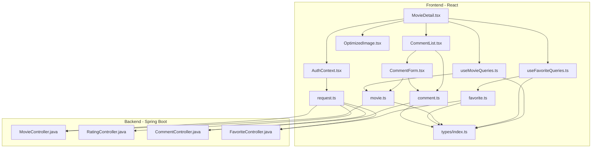
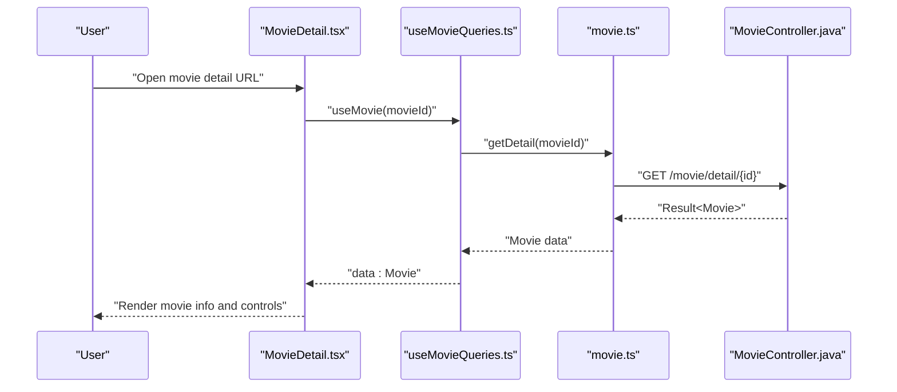
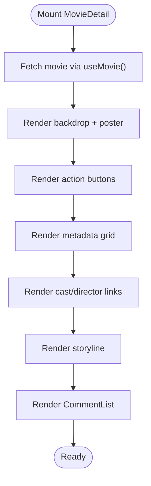
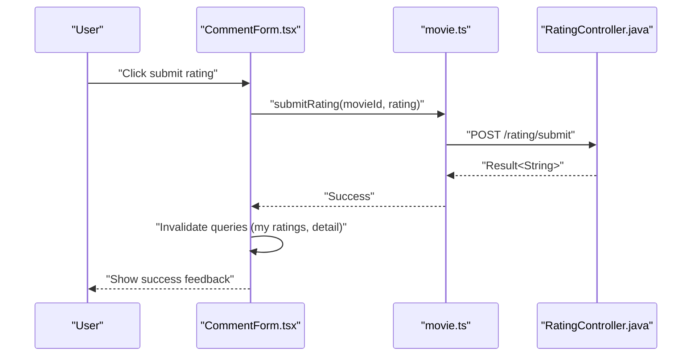
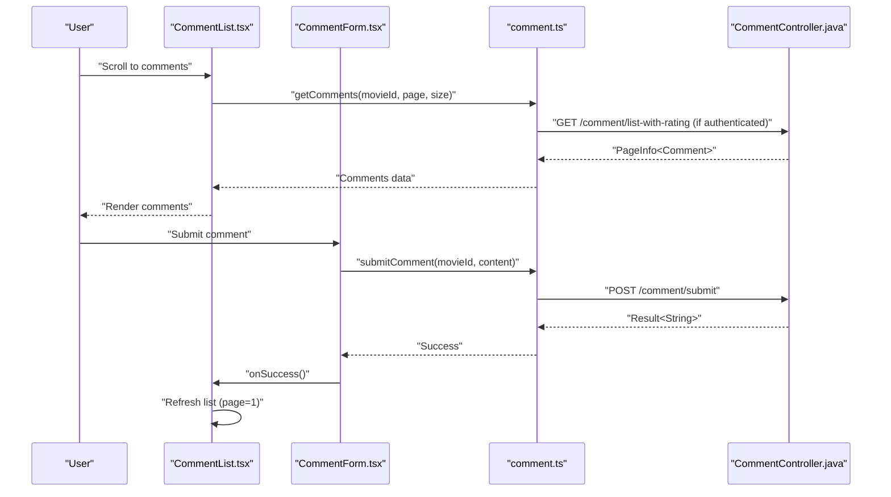
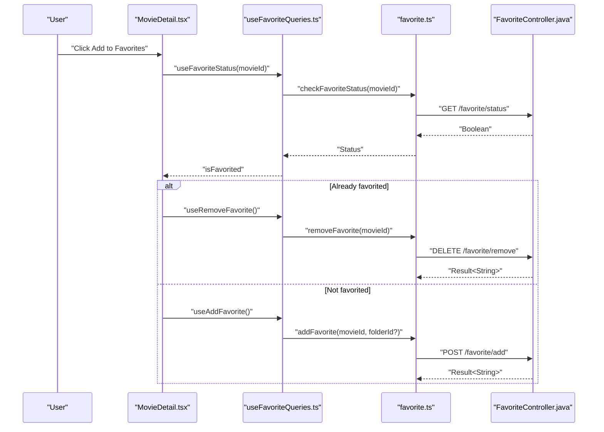
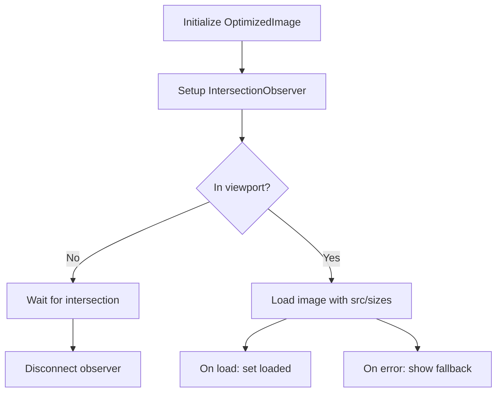
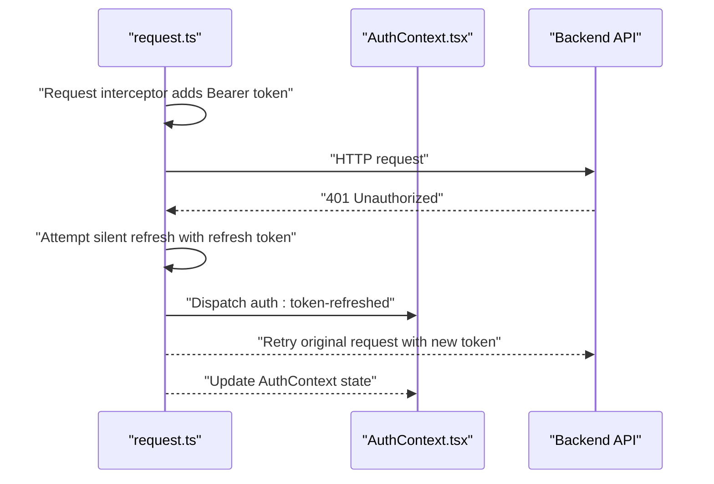
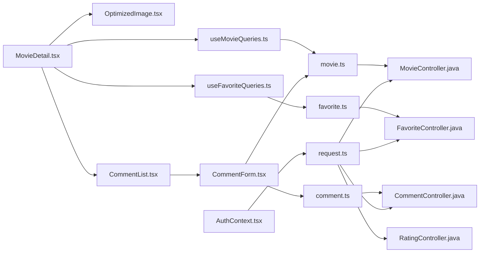

# Movie Detail Page

<cite>
**Referenced Files in This Document**
- [MovieDetail.tsx](file://movie-review-web/src/pages/MovieDetail.tsx)
- [useMovieQueries.ts](file://movie-review-web/src/hooks/useMovieQueries.ts)
- [movie.ts](file://movie-review-web/src/api/movie.ts)
- [CommentList.tsx](file://movie-review-web/src/components/CommentList.tsx)
- [CommentForm.tsx](file://movie-review-web/src/components/CommentForm.tsx)
- [useFavoriteQueries.ts](file://movie-review-web/src/hooks/useFavoriteQueries.ts)
- [favorite.ts](file://movie-review-web/src/api/favorite.ts)
- [comment.ts](file://movie-review-web/src/api/comment.ts)
- [OptimizedImage.tsx](file://movie-review-web/src/components/OptimizedImage.tsx)
- [AuthContext.tsx](file://movie-review-web/src/context/AuthContext.tsx)
- [request.ts](file://movie-review-web/src/api/request.ts)
- [MovieController.java](file://backend/src/main/java/com/movie/backend/controller/MovieController.java)
- [RatingController.java](file://backend/src/main/java/com/movie/backend/controller/RatingController.java)
- [CommentController.java](file://backend/src/main/java/com/movie/backend/controller/CommentController.java)
- [FavoriteController.java](file://backend/src/main/java/com/movie/backend/controller/FavoriteController.java)
- [index.ts](file://movie-review-web/src/types/index.ts)
</cite>

## Table of Contents
1. [Introduction](#introduction)
2. [Project Structure](#project-structure)
3. [Core Components](#core-components)
4. [Architecture Overview](#architecture-overview)
5. [Detailed Component Analysis](#detailed-component-analysis)
6. [Dependency Analysis](#dependency-analysis)
7. [Performance Considerations](#performance-considerations)
8. [Troubleshooting Guide](#troubleshooting-guide)
9. [Conclusion](#conclusion)

## Introduction
This document provides comprehensive documentation for the Movie Detail page component and related functionality. It covers movie information display, cast and crew sections, ratings aggregation, user interaction features, the comment system integration, review submission workflow, and social features such as favorites and watch history. It also documents data fetching patterns for movie metadata, reviews, and related content, component composition, lazy loading strategies, and performance considerations. Examples of dynamic content rendering, user authentication integration, and real-time updates for ratings and comments are included.

## Project Structure
The Movie Detail feature spans the frontend React application and the backend Spring Boot API server. The frontend is organized into pages, components, hooks, APIs, and shared contexts/types. The backend exposes REST endpoints for movies, ratings, comments, and favorites.

**Diagram sources**
- [MovieDetail.tsx](file://movie-review-web/src/pages/MovieDetail.tsx#L1-L343)
- [useMovieQueries.ts](file://movie-review-web/src/hooks/useMovieQueries.ts#L1-L95)
- [useFavoriteQueries.ts](file://movie-review-web/src/hooks/useFavoriteQueries.ts#L1-L174)
- [CommentList.tsx](file://movie-review-web/src/components/CommentList.tsx#L1-L107)
- [CommentForm.tsx](file://movie-review-web/src/components/CommentForm.tsx#L1-L222)
- [OptimizedImage.tsx](file://movie-review-web/src/components/OptimizedImage.tsx#L1-L179)
- [movie.ts](file://movie-review-web/src/api/movie.ts#L1-L65)
- [favorite.ts](file://movie-review-web/src/api/favorite.ts#L1-L97)
- [comment.ts](file://movie-review-web/src/api/comment.ts#L1-L49)
- [AuthContext.tsx](file://movie-review-web/src/context/AuthContext.tsx#L1-L123)
- [request.ts](file://movie-review-web/src/api/request.ts#L1-L108)
- [MovieController.java](file://backend/src/main/java/com/movie/backend/controller/MovieController.java#L1-L209)
- [RatingController.java](file://backend/src/main/java/com/movie/backend/controller/RatingController.java#L1-L82)
- [CommentController.java](file://backend/src/main/java/com/movie/backend/controller/CommentController.java#L1-L113)
- [FavoriteController.java](file://backend/src/main/java/com/movie/backend/controller/FavoriteController.java#L1-L109)
- [index.ts](file://movie-review-web/src/types/index.ts#L1-L204)

**Section sources**
- [MovieDetail.tsx](file://movie-review-web/src/pages/MovieDetail.tsx#L1-L343)
- [useMovieQueries.ts](file://movie-review-web/src/hooks/useMovieQueries.ts#L1-L95)
- [useFavoriteQueries.ts](file://movie-review-web/src/hooks/useFavoriteQueries.ts#L1-L174)
- [CommentList.tsx](file://movie-review-web/src/components/CommentList.tsx#L1-L107)
- [CommentForm.tsx](file://movie-review-web/src/components/CommentForm.tsx#L1-L222)
- [OptimizedImage.tsx](file://movie-review-web/src/components/OptimizedImage.tsx#L1-L179)
- [movie.ts](file://movie-review-web/src/api/movie.ts#L1-L65)
- [favorite.ts](file://movie-review-web/src/api/favorite.ts#L1-L97)
- [comment.ts](file://movie-review-web/src/api/comment.ts#L1-L49)
- [AuthContext.tsx](file://movie-review-web/src/context/AuthContext.tsx#L1-L123)
- [request.ts](file://movie-review-web/src/api/request.ts#L1-L108)
- [MovieController.java](file://backend/src/main/java/com/movie/backend/controller/MovieController.java#L1-L209)
- [RatingController.java](file://backend/src/main/java/com/movie/backend/controller/RatingController.java#L1-L82)
- [CommentController.java](file://backend/src/main/java/com/movie/backend/controller/CommentController.java#L1-L113)
- [FavoriteController.java](file://backend/src/main/java/com/movie/backend/controller/FavoriteController.java#L1-L109)
- [index.ts](file://movie-review-web/src/types/index.ts#L1-L204)

## Core Components
- MovieDetail page: orchestrates movie metadata display, favorite actions, and renders the comment section.
- useMovieQueries: React Query hooks for movie detail, search, latest, and rating mutations.
- useFavoriteQueries: React Query hooks for favorite status, folders, and mutations.
- CommentList and CommentForm: manage comment pagination, submission, and user interactions.
- OptimizedImage: handles lazy loading, responsive images, and fallbacks for posters/backdrops.
- AuthContext and request interceptors: manage authentication state, token refresh, and global 401 handling.

**Section sources**
- [MovieDetail.tsx](file://movie-review-web/src/pages/MovieDetail.tsx#L1-L343)
- [useMovieQueries.ts](file://movie-review-web/src/hooks/useMovieQueries.ts#L1-L95)
- [useFavoriteQueries.ts](file://movie-review-web/src/hooks/useFavoriteQueries.ts#L1-L174)
- [CommentList.tsx](file://movie-review-web/src/components/CommentList.tsx#L1-L107)
- [CommentForm.tsx](file://movie-review-web/src/components/CommentForm.tsx#L1-L222)
- [OptimizedImage.tsx](file://movie-review-web/src/components/OptimizedImage.tsx#L1-L179)
- [AuthContext.tsx](file://movie-review-web/src/context/AuthContext.tsx#L1-L123)
- [request.ts](file://movie-review-web/src/api/request.ts#L1-L108)

## Architecture Overview
The Movie Detail page follows a layered architecture:
- Presentation layer: MovieDetail renders UI and delegates actions to hooks and components.
- Data access layer: API modules encapsulate HTTP calls to backend endpoints.
- State management: React Query manages caching, invalidation, and optimistic updates for movie, ratings, and favorites.
- Authentication: AuthContext and request interceptors handle JWT lifecycle and global error handling.

**Diagram sources**
- [MovieDetail.tsx](file://movie-review-web/src/pages/MovieDetail.tsx#L11-L16)
- [useMovieQueries.ts](file://movie-review-web/src/hooks/useMovieQueries.ts#L15-L25)
- [movie.ts](file://movie-review-web/src/api/movie.ts#L30-L32)
- [MovieController.java](file://backend/src/main/java/com/movie/backend/controller/MovieController.java#L46-L66)

**Section sources**
- [MovieDetail.tsx](file://movie-review-web/src/pages/MovieDetail.tsx#L11-L16)
- [useMovieQueries.ts](file://movie-review-web/src/hooks/useMovieQueries.ts#L15-L25)
- [movie.ts](file://movie-review-web/src/api/movie.ts#L30-L32)
- [MovieController.java](file://backend/src/main/java/com/movie/backend/controller/MovieController.java#L46-L66)

## Detailed Component Analysis

### Movie Detail Page Composition
The MovieDetail component:
- Fetches movie data via React Query hook.
- Displays hero backdrop, poster, and action buttons (write review, add to favorites).
- Renders metadata cards (duration, release date, regions), genres, and cast/director links.
- Shows storyline and integrates the CommentList component for reviews.

**Diagram sources**
- [MovieDetail.tsx](file://movie-review-web/src/pages/MovieDetail.tsx#L11-L343)

**Section sources**
- [MovieDetail.tsx](file://movie-review-web/src/pages/MovieDetail.tsx#L11-L343)

### Ratings Aggregation and Submission
The rating workflow integrates:
- useMovieQueries for rating mutations (submit, update, invalidate caches).
- CommentForm for combined rating and comment submission.
- Backend endpoints for rating CRUD operations.

**Diagram sources**
- [CommentForm.tsx](file://movie-review-web/src/components/CommentForm.tsx#L67-L88)
- [movie.ts](file://movie-review-web/src/api/movie.ts#L38-L40)
- [RatingController.java](file://backend/src/main/java/com/movie/backend/controller/RatingController.java#L24-L33)

**Section sources**
- [useMovieQueries.ts](file://movie-review-web/src/hooks/useMovieQueries.ts#L54-L68)
- [CommentForm.tsx](file://movie-review-web/src/components/CommentForm.tsx#L67-L88)
- [movie.ts](file://movie-review-web/src/api/movie.ts#L38-L40)
- [RatingController.java](file://backend/src/main/java/com/movie/backend/controller/RatingController.java#L24-L33)

### Comment System Integration
CommentList and CommentForm provide:
- Pagination with load-more functionality.
- Real-time refresh after successful submissions.
- Dynamic endpoint selection based on authentication state.

**Diagram sources**
- [CommentList.tsx](file://movie-review-web/src/components/CommentList.tsx#L19-L55)
- [comment.ts](file://movie-review-web/src/api/comment.ts#L5-L15)
- [CommentForm.tsx](file://movie-review-web/src/components/CommentForm.tsx#L91-L112)
- [CommentController.java](file://backend/src/main/java/com/movie/backend/controller/CommentController.java#L50-L59)

**Section sources**
- [CommentList.tsx](file://movie-review-web/src/components/CommentList.tsx#L19-L55)
- [CommentForm.tsx](file://movie-review-web/src/components/CommentForm.tsx#L91-L112)
- [comment.ts](file://movie-review-web/src/api/comment.ts#L5-L15)
- [CommentController.java](file://backend/src/main/java/com/movie/backend/controller/CommentController.java#L50-L59)

### Favorites and Watch History
The favorite workflow includes:
- Checking favorite status via useFavoriteStatus.
- Adding/removing favorites with optional folder selection.
- Managing collections and folders via dedicated hooks and API.

**Diagram sources**
- [MovieDetail.tsx](file://movie-review-web/src/pages/MovieDetail.tsx#L46-L89)
- [useFavoriteQueries.ts](file://movie-review-web/src/hooks/useFavoriteQueries.ts#L39-L46)
- [favorite.ts](file://movie-review-web/src/api/favorite.ts#L19-L24)
- [FavoriteController.java](file://backend/src/main/java/com/movie/backend/controller/FavoriteController.java#L55-L62)

**Section sources**
- [MovieDetail.tsx](file://movie-review-web/src/pages/MovieDetail.tsx#L46-L89)
- [useFavoriteQueries.ts](file://movie-review-web/src/hooks/useFavoriteQueries.ts#L39-L46)
- [favorite.ts](file://movie-review-web/src/api/favorite.ts#L19-L24)
- [FavoriteController.java](file://backend/src/main/java/com/movie/backend/controller/FavoriteController.java#L55-L62)

### Lazy Loading and Performance
OptimizedImage implements:
- IntersectionObserver-based lazy loading with a root margin.
- Priority loading for above-the-fold images.
- Responsive image sizing and fallback icons.
- Smooth transitions and loading placeholders.

**Diagram sources**
- [OptimizedImage.tsx](file://movie-review-web/src/components/OptimizedImage.tsx#L35-L68)

**Section sources**
- [OptimizedImage.tsx](file://movie-review-web/src/components/OptimizedImage.tsx#L35-L68)

### Authentication Integration
AuthContext and request interceptors:
- Persist and synchronize user/token state.
- Intercept requests to attach Authorization header.
- Handle 401 globally: attempt silent refresh using refresh token, queue pending requests, and broadcast token refresh events.

**Diagram sources**
- [request.ts](file://movie-review-web/src/api/request.ts#L13-L19)
- [request.ts](file://movie-review-web/src/api/request.ts#L34-L70)
- [AuthContext.tsx](file://movie-review-web/src/context/AuthContext.tsx#L88-L110)

**Section sources**
- [AuthContext.tsx](file://movie-review-web/src/context/AuthContext.tsx#L20-L42)
- [request.ts](file://movie-review-web/src/api/request.ts#L13-L19)
- [request.ts](file://movie-review-web/src/api/request.ts#L34-L70)
- [AuthContext.tsx](file://movie-review-web/src/context/AuthContext.tsx#L88-L110)

## Dependency Analysis
The Movie Detail feature depends on:
- Frontend hooks and APIs for data fetching and mutations.
- Backend controllers for movie, rating, comment, and favorite operations.
- Shared types for consistent data modeling across layers.

**Diagram sources**
- [MovieDetail.tsx](file://movie-review-web/src/pages/MovieDetail.tsx#L1-L343)
- [useMovieQueries.ts](file://movie-review-web/src/hooks/useMovieQueries.ts#L1-L95)
- [useFavoriteQueries.ts](file://movie-review-web/src/hooks/useFavoriteQueries.ts#L1-L174)
- [OptimizedImage.tsx](file://movie-review-web/src/components/OptimizedImage.tsx#L1-L179)
- [CommentList.tsx](file://movie-review-web/src/components/CommentList.tsx#L1-L107)
- [CommentForm.tsx](file://movie-review-web/src/components/CommentForm.tsx#L1-L222)
- [movie.ts](file://movie-review-web/src/api/movie.ts#L1-L65)
- [favorite.ts](file://movie-review-web/src/api/favorite.ts#L1-L97)
- [comment.ts](file://movie-review-web/src/api/comment.ts#L1-L49)
- [AuthContext.tsx](file://movie-review-web/src/context/AuthContext.tsx#L1-L123)
- [request.ts](file://movie-review-web/src/api/request.ts#L1-L108)
- [MovieController.java](file://backend/src/main/java/com/movie/backend/controller/MovieController.java#L1-L209)
- [RatingController.java](file://backend/src/main/java/com/movie/backend/controller/RatingController.java#L1-L82)
- [CommentController.java](file://backend/src/main/java/com/movie/backend/controller/CommentController.java#L1-L113)
- [FavoriteController.java](file://backend/src/main/java/com/movie/backend/controller/FavoriteController.java#L1-L109)

**Section sources**
- [MovieDetail.tsx](file://movie-review-web/src/pages/MovieDetail.tsx#L1-L343)
- [useMovieQueries.ts](file://movie-review-web/src/hooks/useMovieQueries.ts#L1-L95)
- [useFavoriteQueries.ts](file://movie-review-web/src/hooks/useFavoriteQueries.ts#L1-L174)
- [OptimizedImage.tsx](file://movie-review-web/src/components/OptimizedImage.tsx#L1-L179)
- [CommentList.tsx](file://movie-review-web/src/components/CommentList.tsx#L1-L107)
- [CommentForm.tsx](file://movie-review-web/src/components/CommentForm.tsx#L1-L222)
- [movie.ts](file://movie-review-web/src/api/movie.ts#L1-L65)
- [favorite.ts](file://movie-review-web/src/api/favorite.ts#L1-L97)
- [comment.ts](file://movie-review-web/src/api/comment.ts#L1-L49)
- [AuthContext.tsx](file://movie-review-web/src/context/AuthContext.tsx#L1-L123)
- [request.ts](file://movie-review-web/src/api/request.ts#L1-L108)
- [MovieController.java](file://backend/src/main/java/com/movie/backend/controller/MovieController.java#L1-L209)
- [RatingController.java](file://backend/src/main/java/com/movie/backend/controller/RatingController.java#L1-L82)
- [CommentController.java](file://backend/src/main/java/com/movie/backend/controller/CommentController.java#L1-L113)
- [FavoriteController.java](file://backend/src/main/java/com/movie/backend/controller/FavoriteController.java#L1-L109)

## Performance Considerations
- Parallel data fetching: useMovie automatically optimizes concurrent queries.
- Caching and invalidation: React Query keys enable targeted cache updates for ratings and favorites.
- Lazy loading: OptimizedImage defers offscreen image loading to reduce initial payload.
- Minimal re-renders: Favor pure components and memoization for comment lists.
- Pagination: Incremental loading prevents large payloads and improves perceived performance.

[No sources needed since this section provides general guidance]

## Troubleshooting Guide
Common issues and resolutions:
- Authentication errors: The request interceptor attempts silent refresh on 401. If refresh fails, users are logged out globally. Verify tokens and refresh token availability.
- Comment visibility: When unauthenticated, comment API falls back to public endpoints; authenticated users receive enriched data with user interactions.
- Favorite toggling: Ensure the user is authenticated before invoking add/remove favorite mutations. Handle loading states to prevent double clicks.
- Rating updates: Submit and update endpoints require authenticated users; confirm user context before enabling rating controls.

**Section sources**
- [request.ts](file://movie-review-web/src/api/request.ts#L34-L70)
- [comment.ts](file://movie-review-web/src/api/comment.ts#L6-L10)
- [MovieDetail.tsx](file://movie-review-web/src/pages/MovieDetail.tsx#L46-L71)
- [CommentForm.tsx](file://movie-review-web/src/components/CommentForm.tsx#L67-L88)

## Conclusion
The Movie Detail page integrates robust data fetching, user interactions, and social features through a cohesive frontend-backend architecture. React Query simplifies state management, while optimized components and lazy loading improve performance. Authentication flows are resilient with automatic token refresh and global error handling. The modular design enables maintainability and extensibility for future enhancements.