# Page Components

<cite>
**Referenced Files in This Document**
- [App.tsx](file://movie-review-web/src/App.tsx)
- [Home.tsx](file://movie-review-web/src/pages/Home.tsx)
- [MovieDetail.tsx](file://movie-review-web/src/pages/MovieDetail.tsx)
- [Profile.tsx](file://movie-review-web/src/pages/Profile.tsx)
- [UserProfile.tsx](file://movie-review-web/src/pages/UserProfile.tsx)
- [Search.tsx](file://movie-review-web/src/pages/Search.tsx)
- [Login.tsx](file://movie-review-web/src/pages/Login.tsx)
- [Register.tsx](file://movie-review-web/src/pages/Register.tsx)
- [Favorites.tsx](file://movie-review-web/src/pages/Favorites.tsx)
- [BrowsingHistory.tsx](file://movie-review-web/src/pages/BrowsingHistory.tsx)
- [MyRatings.tsx](file://movie-review-web/src/pages/MyRatings.tsx)
- [MyReviews.tsx](file://movie-review-web/src/pages/MyReviews.tsx)
- [Latest.tsx](file://movie-review-web/src/pages/Latest.tsx)
- [PersonDetail.tsx](file://movie-review-web/src/pages/PersonDetail.tsx)
- [AuthContext.tsx](file://movie-review-web/src/context/AuthContext.tsx)
- [useMovieQueries.ts](file://movie-review-web/src/hooks/useMovieQueries.ts)
- [useUserQueries.ts](file://movie-review-web/src/hooks/useUserQueries.ts)
- [index.ts](file://movie-review-web/src/types/index.ts)
</cite>

## Table of Contents
1. [Introduction](#introduction)
2. [Project Structure](#project-structure)
3. [Core Components](#core-components)
4. [Architecture Overview](#architecture-overview)
5. [Detailed Component Analysis](#detailed-component-analysis)
6. [Dependency Analysis](#dependency-analysis)
7. [Performance Considerations](#performance-considerations)
8. [Troubleshooting Guide](#troubleshooting-guide)
9. [Conclusion](#conclusion)
10. [Appendices](#appendices)

## Introduction
This document provides comprehensive documentation for page-level components and route-based views in the movie review web application. It focuses on major pages including Home, Movie Detail, Profile, User Profile, Search, Login, Registration, Favorites, Browsing History, My Ratings, My Reviews, Latest, and Person Detail. The documentation covers page structure, data fetching strategies, component composition, user workflow patterns, navigation flows, state management at the page level, integration with global state, SEO considerations, performance optimization, and error boundary handling.

## Project Structure
The application uses React Router for routing and organizes pages under the pages directory. The App component defines routes grouped under a shared Layout wrapper. Authentication is managed via a dedicated AuthContext provider, and data fetching is handled through React Query hooks for predictable caching, invalidation, and optimistic updates.

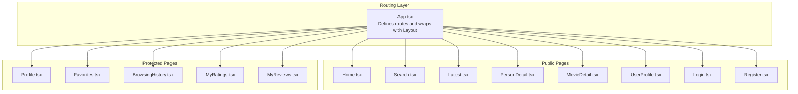

**Diagram sources**
- [App.tsx](file://movie-review-web/src/App.tsx#L18-L48)

**Section sources**
- [App.tsx](file://movie-review-web/src/App.tsx#L1-L50)

## Core Components
- Routing and Layout: The App component sets up nested routes and wraps public and protected routes under a shared Layout.
- Authentication Context: AuthContext manages user session state, login/logout, and integrates with local storage for persistence.
- Data Fetching Hooks: React Query hooks encapsulate queries and mutations for movies, comments, favorites, and users, enabling caching, background refetching, and optimistic updates.
- Types: Shared TypeScript types define entities like Movie, User, Comment, PageInfo, and FavoriteFolder structures.

Key responsibilities:
- App.tsx: Route definitions and protected route gating.
- AuthContext.tsx: Session lifecycle and global state for authentication.
- useMovieQueries.ts: Centralized movie-related queries and mutations.
- useUserQueries.ts: Centralized user-related queries.
- Page components: Orchestrate data fetching, compose UI, manage local page state, and coordinate navigation.

**Section sources**
- [App.tsx](file://movie-review-web/src/App.tsx#L1-L50)
- [AuthContext.tsx](file://movie-review-web/src/context/AuthContext.tsx#L1-L123)
- [useMovieQueries.ts](file://movie-review-web/src/hooks/useMovieQueries.ts#L1-L95)
- [useUserQueries.ts](file://movie-review-web/src/hooks/useUserQueries.ts#L1-L36)
- [index.ts](file://movie-review-web/src/types/index.ts#L1-L204)

## Architecture Overview
The page architecture follows a layered pattern:
- Presentation Layer: Page components render UI and orchestrate data fetching.
- Data Access Layer: React Query handles caching, invalidation, and server synchronization.
- Authentication Layer: AuthContext provides authentication state and actions.
- Navigation Layer: React Router manages routing and protected route enforcement.

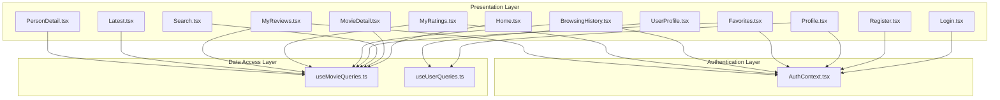

**Diagram sources**
- [Home.tsx](file://movie-review-web/src/pages/Home.tsx#L1-L65)
- [MovieDetail.tsx](file://movie-review-web/src/pages/MovieDetail.tsx#L1-L343)
- [Profile.tsx](file://movie-review-web/src/pages/Profile.tsx#L1-L132)
- [UserProfile.tsx](file://movie-review-web/src/pages/UserProfile.tsx#L1-L124)
- [Search.tsx](file://movie-review-web/src/pages/Search.tsx#L1-L67)
- [Login.tsx](file://movie-review-web/src/pages/Login.tsx#L1-L148)
- [Register.tsx](file://movie-review-web/src/pages/Register.tsx#L1-L199)
- [Favorites.tsx](file://movie-review-web/src/pages/Favorites.tsx#L1-L803)
- [BrowsingHistory.tsx](file://movie-review-web/src/pages/BrowsingHistory.tsx#L1-L309)
- [MyRatings.tsx](file://movie-review-web/src/pages/MyRatings.tsx#L1-L270)
- [MyReviews.tsx](file://movie-review-web/src/pages/MyReviews.tsx#L1-L141)
- [Latest.tsx](file://movie-review-web/src/pages/Latest.tsx#L1-L100)
- [PersonDetail.tsx](file://movie-review-web/src/pages/PersonDetail.tsx#L1-L143)
- [useMovieQueries.ts](file://movie-review-web/src/hooks/useMovieQueries.ts#L1-L95)
- [useUserQueries.ts](file://movie-review-web/src/hooks/useUserQueries.ts#L1-L36)
- [AuthContext.tsx](file://movie-review-web/src/context/AuthContext.tsx#L1-L123)

## Detailed Component Analysis

### Home Page
- Purpose: Display trending and recommended movies in a responsive grid layout.
- Data fetching: Uses React Query to fetch hot and recommended movies concurrently during initial load.
- Composition: Renders a Hero banner and two sections for hot and recommended movies, each composed of MovieCard components.
- State management: Uses local state to store fetched lists and leverages React Query for caching and background refetching.

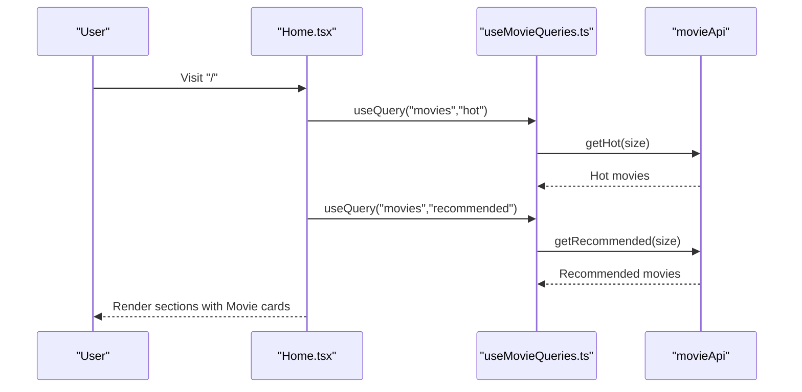

**Diagram sources**
- [Home.tsx](file://movie-review-web/src/pages/Home.tsx#L26-L44)
- [useMovieQueries.ts](file://movie-review-web/src/hooks/useMovieQueries.ts#L14-L25)

**Section sources**
- [Home.tsx](file://movie-review-web/src/pages/Home.tsx#L1-L65)
- [useMovieQueries.ts](file://movie-review-web/src/hooks/useMovieQueries.ts#L1-L95)

### Movie Detail Page
- Purpose: Present detailed movie information, ratings, cast/crew links, and a comment section.
- Data fetching: Uses React Query hooks for movie detail, favorite status, and user folders.
- Workflow:
  - Authentication check for write review and add to watchlist actions.
  - Favorite toggle with optimistic UI and modal selection for folders.
  - Scroll to comment section after login prompt.
- State management: Local state for folder modal visibility and favorite loading states; integrates with AuthContext for authentication checks.

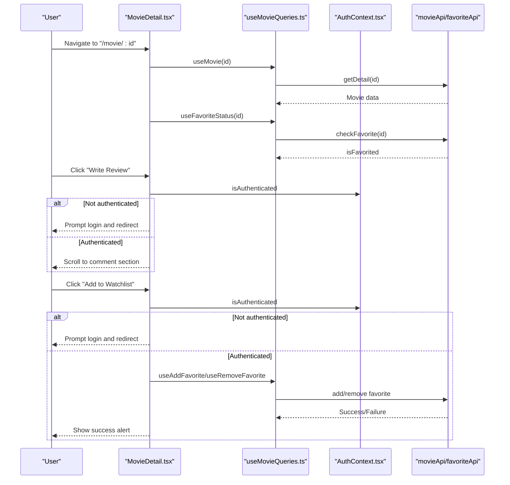

**Diagram sources**
- [MovieDetail.tsx](file://movie-review-web/src/pages/MovieDetail.tsx#L11-L118)
- [useMovieQueries.ts](file://movie-review-web/src/hooks/useMovieQueries.ts#L14-L25)
- [AuthContext.tsx](file://movie-review-web/src/context/AuthContext.tsx#L1-L123)

**Section sources**
- [MovieDetail.tsx](file://movie-review-web/src/pages/MovieDetail.tsx#L1-L343)
- [useMovieQueries.ts](file://movie-review-web/src/hooks/useMovieQueries.ts#L1-L95)
- [AuthContext.tsx](file://movie-review-web/src/context/AuthContext.tsx#L1-L123)

### Profile Page
- Purpose: Display current user’s profile summary, statistics, and quick links.
- Data fetching: Uses React Query hooks to fetch favorite count and current user info.
- Composition: Glass-morphism card layout with user avatar, stats grid, and recent activity placeholder.

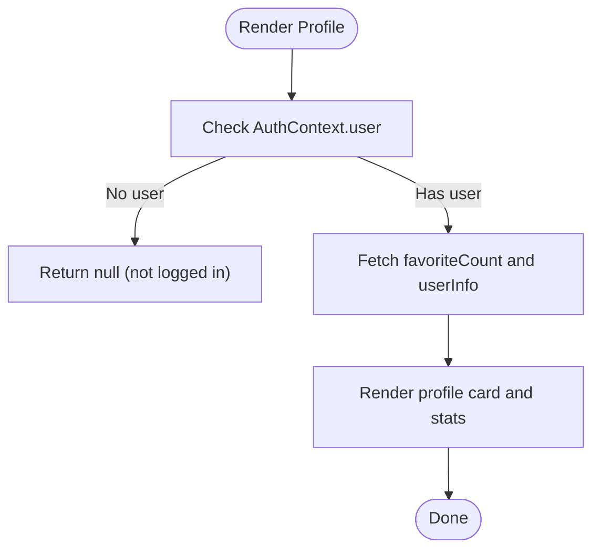

**Diagram sources**
- [Profile.tsx](file://movie-review-web/src/pages/Profile.tsx#L9-L21)
- [useUserQueries.ts](file://movie-review-web/src/hooks/useUserQueries.ts#L12-L22)

**Section sources**
- [Profile.tsx](file://movie-review-web/src/pages/Profile.tsx#L1-L132)
- [useUserQueries.ts](file://movie-review-web/src/hooks/useUserQueries.ts#L1-L36)

### User Profile Page
- Purpose: Display public information for another user with privacy controls.
- Data fetching: Uses React Query to fetch public user info; gated by authentication.
- Workflow: Renders a login buffer when unauthenticated, otherwise shows user profile with stats.

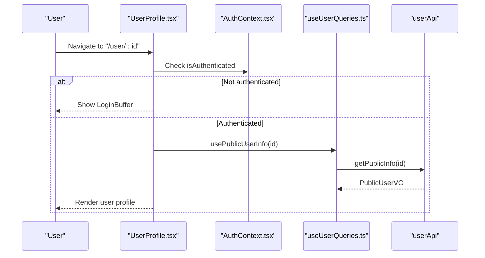

**Diagram sources**
- [UserProfile.tsx](file://movie-review-web/src/pages/UserProfile.tsx#L8-L62)
- [AuthContext.tsx](file://movie-review-web/src/context/AuthContext.tsx#L1-L123)
- [useUserQueries.ts](file://movie-review-web/src/hooks/useUserQueries.ts#L24-L35)

**Section sources**
- [UserProfile.tsx](file://movie-review-web/src/pages/UserProfile.tsx#L1-L124)
- [AuthContext.tsx](file://movie-review-web/src/context/AuthContext.tsx#L1-L123)
- [useUserQueries.ts](file://movie-review-web/src/hooks/useUserQueries.ts#L1-L36)

### Search Page
- Purpose: Show search results for movies based on query parameters.
- Data fetching: Uses React Query to search movies with automatic caching and deduplication.
- Composition: Responsive grid of MovieCard components with empty state handling.

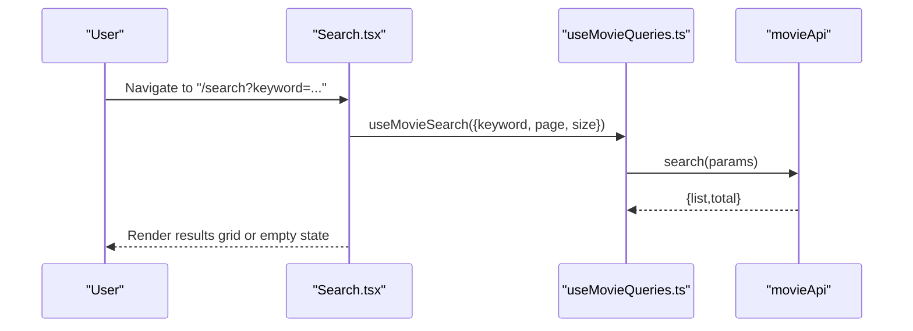

**Diagram sources**
- [Search.tsx](file://movie-review-web/src/pages/Search.tsx#L7-L66)
- [useMovieQueries.ts](file://movie-review-web/src/hooks/useMovieQueries.ts#L35-L42)

**Section sources**
- [Search.tsx](file://movie-review-web/src/pages/Search.tsx#L1-L67)
- [useMovieQueries.ts](file://movie-review-web/src/hooks/useMovieQueries.ts#L1-L95)

### Login Page
- Purpose: Authenticate existing users with form validation and error handling.
- Form handling: Local state for credentials, errors, and submission state; redirects on success using location state.
- Integration: Uses AuthContext.login to authenticate and persist tokens.

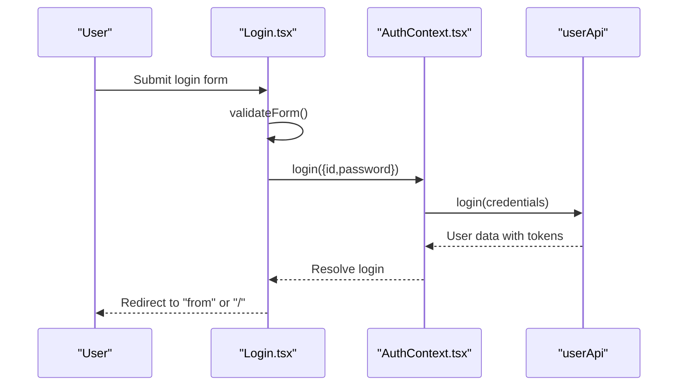

**Diagram sources**
- [Login.tsx](file://movie-review-web/src/pages/Login.tsx#L14-L61)
- [AuthContext.tsx](file://movie-review-web/src/context/AuthContext.tsx#L44-L63)

**Section sources**
- [Login.tsx](file://movie-review-web/src/pages/Login.tsx#L1-L148)
- [AuthContext.tsx](file://movie-review-web/src/context/AuthContext.tsx#L1-L123)

### Registration Page
- Purpose: Allow new users to register and automatically log them in.
- Form handling: Comprehensive client-side validation and controlled inputs; error display via unified handler.
- Integration: Uses AuthContext.register and then logs in programmatically.

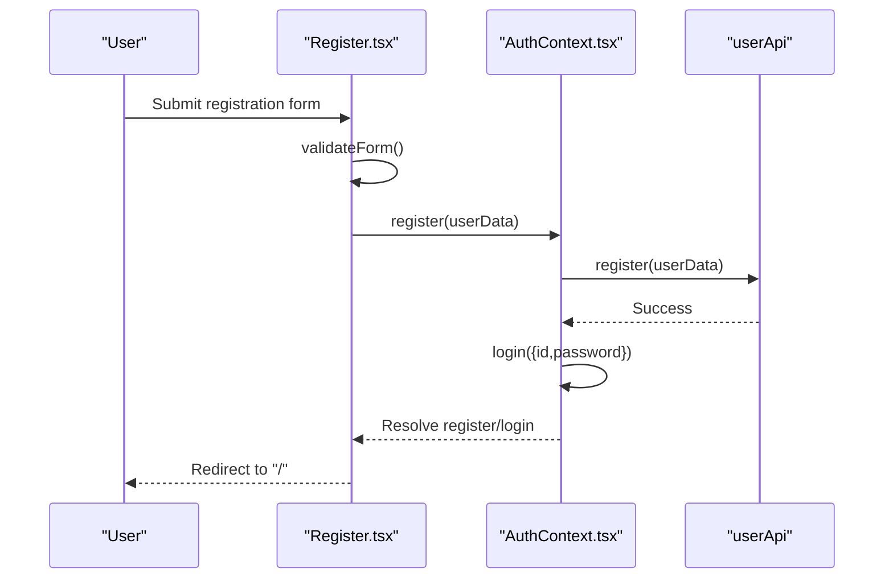

**Diagram sources**
- [Register.tsx](file://movie-review-web/src/pages/Register.tsx#L8-L65)
- [AuthContext.tsx](file://movie-review-web/src/context/AuthContext.tsx#L65-L77)

**Section sources**
- [Register.tsx](file://movie-review-web/src/pages/Register.tsx#L1-L199)
- [AuthContext.tsx](file://movie-review-web/src/context/AuthContext.tsx#L1-L123)

### Favorites Page
- Purpose: Manage personal movie collections across default and custom folders.
- Features: Folder CRUD, bulk operations (delete/copy/move), pagination, and optimistic UI.
- Data fetching: Manual API calls with local state for pagination and selections; integrates with favorite APIs.

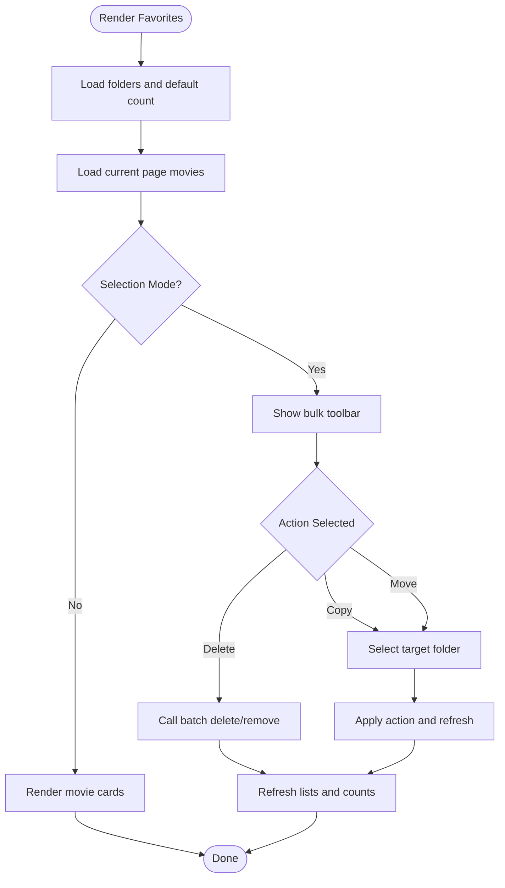

**Diagram sources**
- [Favorites.tsx](file://movie-review-web/src/pages/Favorites.tsx#L8-L803)

**Section sources**
- [Favorites.tsx](file://movie-review-web/src/pages/Favorites.tsx#L1-L803)

### Browsing History Page
- Purpose: Display and manage user browsing history with batch operations.
- Features: Toggle manage mode, select all/current page, batch delete, and clear all.
- Data fetching: Manual API calls with pagination and selection state.

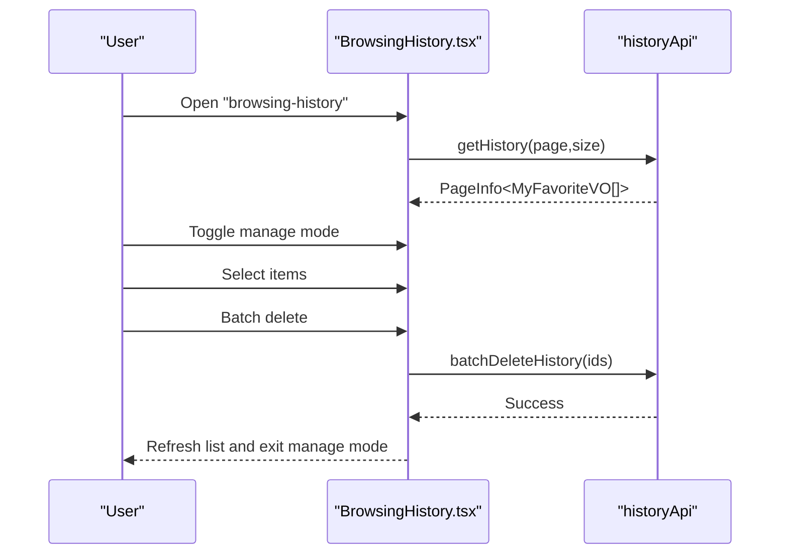

**Diagram sources**
- [BrowsingHistory.tsx](file://movie-review-web/src/pages/BrowsingHistory.tsx#L8-L309)

**Section sources**
- [BrowsingHistory.tsx](file://movie-review-web/src/pages/BrowsingHistory.tsx#L1-L309)

### My Ratings Page
- Purpose: View and manage personal movie ratings with batch operations.
- Data fetching: React Query hooks for ratings list, batch delete, and clear all.
- Composition: Grid of rating cards with star ratings and timestamps.

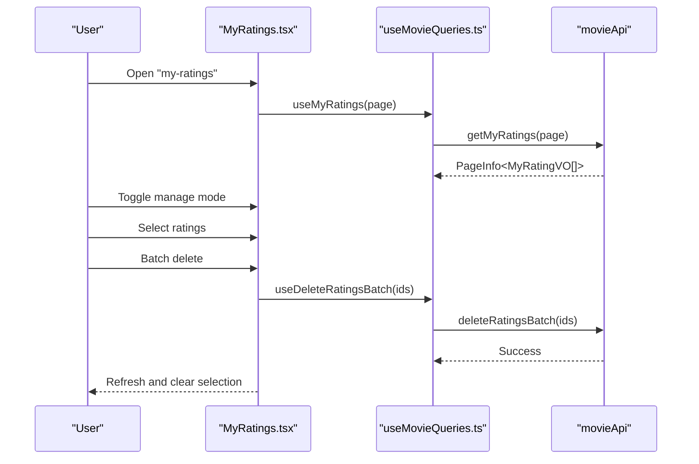

**Diagram sources**
- [MyRatings.tsx](file://movie-review-web/src/pages/MyRatings.tsx#L8-L270)
- [useMovieQueries.ts](file://movie-review-web/src/hooks/useMovieQueries.ts#L70-L81)

**Section sources**
- [MyRatings.tsx](file://movie-review-web/src/pages/MyRatings.tsx#L1-L270)
- [useMovieQueries.ts](file://movie-review-web/src/hooks/useMovieQueries.ts#L1-L95)

### My Reviews Page
- Purpose: Display user’s written reviews with associated movie links and optional ratings.
- Data fetching: React Query hook for paginated comments.
- Composition: Card-based layout with timestamps and vote counts.

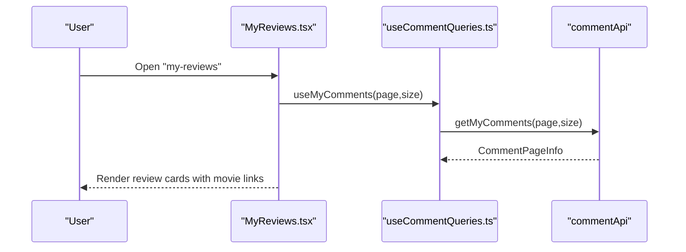

**Diagram sources**
- [MyReviews.tsx](file://movie-review-web/src/pages/MyReviews.tsx#L7-L141)

**Section sources**
- [MyReviews.tsx](file://movie-review-web/src/pages/MyReviews.tsx#L1-L141)

### Latest Page
- Purpose: Browse newly released movies with pagination.
- Data fetching: Manual API calls with page state and scroll to top on page change.
- Composition: Responsive grid with pagination controls.

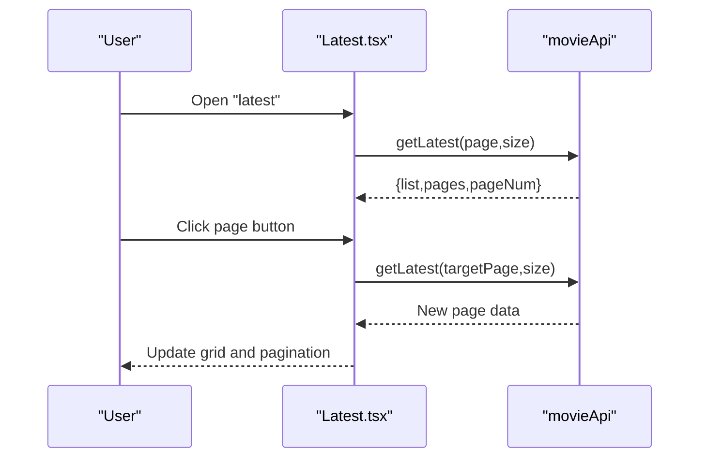

**Diagram sources**
- [Latest.tsx](file://movie-review-web/src/pages/Latest.tsx#L7-L100)

**Section sources**
- [Latest.tsx](file://movie-review-web/src/pages/Latest.tsx#L1-L100)

### Person Detail Page
- Purpose: Show actor/director details and their filmography.
- Data fetching: Parallel fetch for person detail and movies with unified error handling.
- Composition: Skeleton loaders during loading, biography section, and filmography grid.

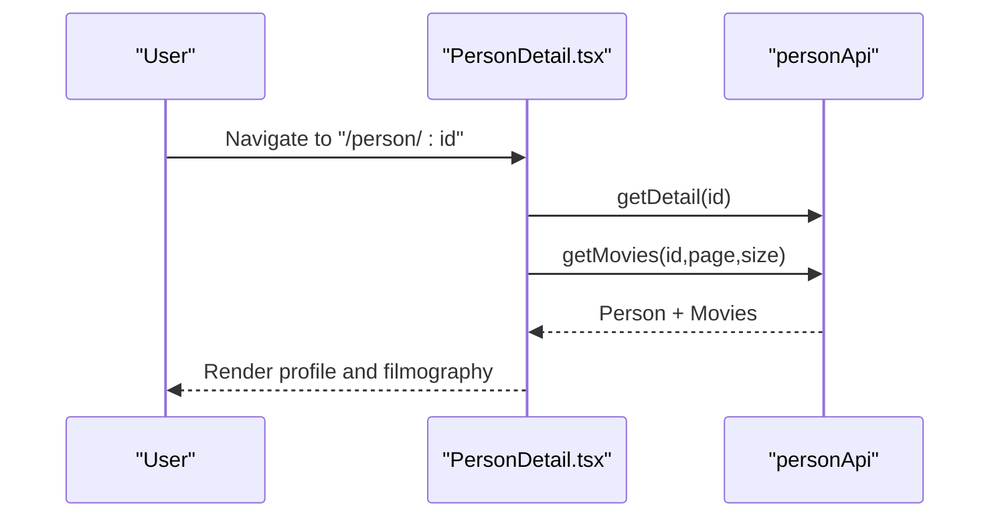

**Diagram sources**
- [PersonDetail.tsx](file://movie-review-web/src/pages/PersonDetail.tsx#L10-L143)

**Section sources**
- [PersonDetail.tsx](file://movie-review-web/src/pages/PersonDetail.tsx#L1-L143)

## Dependency Analysis
- Routing depends on React Router and Layout wrapper.
- Pages depend on React Query hooks for data fetching and AuthContext for authentication.
- Shared types unify data contracts across pages and hooks.
- Protected routes enforce authentication via ProtectedRoute wrapper.

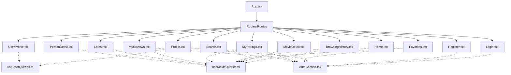

**Diagram sources**
- [App.tsx](file://movie-review-web/src/App.tsx#L1-L50)
- [useMovieQueries.ts](file://movie-review-web/src/hooks/useMovieQueries.ts#L1-L95)
- [useUserQueries.ts](file://movie-review-web/src/hooks/useUserQueries.ts#L1-L36)
- [AuthContext.tsx](file://movie-review-web/src/context/AuthContext.tsx#L1-L123)

**Section sources**
- [App.tsx](file://movie-review-web/src/App.tsx#L1-L50)
- [useMovieQueries.ts](file://movie-review-web/src/hooks/useMovieQueries.ts#L1-L95)
- [useUserQueries.ts](file://movie-review-web/src/hooks/useUserQueries.ts#L1-L36)
- [AuthContext.tsx](file://movie-review-web/src/context/AuthContext.tsx#L1-L123)

## Performance Considerations
- React Query Caching: Queries are cached by keys, reducing redundant network requests and enabling instant UI updates.
- Background Refetching: Stale-time configuration keeps data fresh without blocking UI.
- Concurrent Fetching: Parallel queries (e.g., hot and recommended movies) improve initial load performance.
- Pagination: Lazy loading and manual pagination reduce payload sizes.
- Optimistic Updates: Immediate UI feedback for mutations (e.g., favorites) with cache invalidation ensures consistency.
- Image Optimization: Components like OptimizedImage improve image loading performance.
- Minimal Re-renders: Local state is scoped to UI needs; heavy lifting is delegated to React Query.

[No sources needed since this section provides general guidance]

## Troubleshooting Guide
- Authentication Failures:
  - Login/Register errors are surfaced via unified error messages; verify credentials and network connectivity.
  - AuthContext listens for global unauthorized events and logs out automatically.
- Data Fetching Issues:
  - React Query provides built-in error states; inspect query keys and enabled conditions.
  - For MovieDetail, ensure movieId is valid and authenticated for protected actions.
- Navigation Problems:
  - Protected routes require authentication; use ProtectedRoute wrapper.
  - Login state persists via localStorage; clear browser storage if stuck in an inconsistent state.
- Performance Bottlenecks:
  - Verify cache keys and stale times.
  - Avoid unnecessary re-fetches by leveraging enabled flags and queryClient invalidation.

**Section sources**
- [Login.tsx](file://movie-review-web/src/pages/Login.tsx#L56-L61)
- [Register.tsx](file://movie-review-web/src/pages/Register.tsx#L59-L64)
- [AuthContext.tsx](file://movie-review-web/src/context/AuthContext.tsx#L88-L110)
- [useMovieQueries.ts](file://movie-review-web/src/hooks/useMovieQueries.ts#L54-L94)

## Conclusion
The page components are structured around clear separation of concerns: routing, authentication, data fetching, and presentation. React Query and AuthContext provide robust foundations for state management and data consistency. The pages demonstrate consistent patterns for form handling, navigation, and user workflows, with room for further enhancements in SEO and advanced caching strategies.

[No sources needed since this section summarizes without analyzing specific files]

## Appendices
- SEO Considerations:
  - Add meta tags and structured data for movie and person pages.
  - Use semantic HTML and proper headings for accessibility.
  - Implement canonical URLs and sitemaps for better indexing.
- Error Boundaries:
  - Wrap critical page sections with error boundaries to gracefully handle unexpected errors.
  - Provide actionable error messages and retry mechanisms.

[No sources needed since this section provides general guidance]