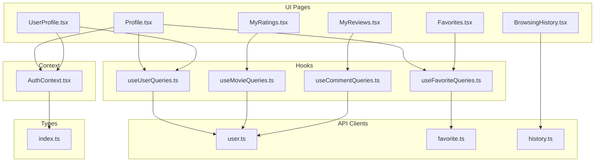
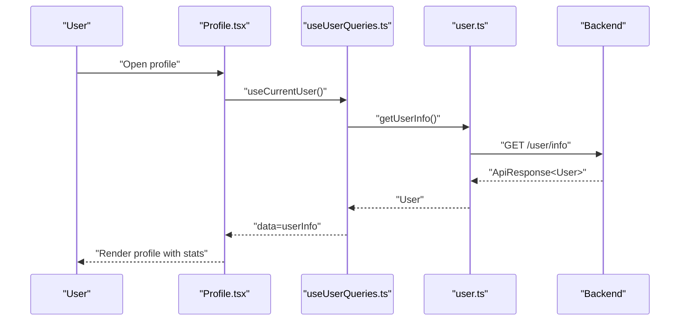
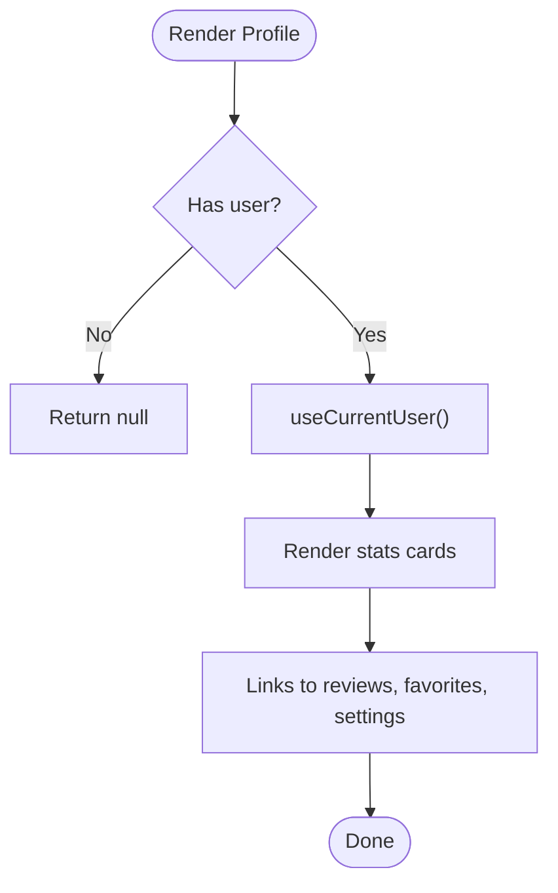
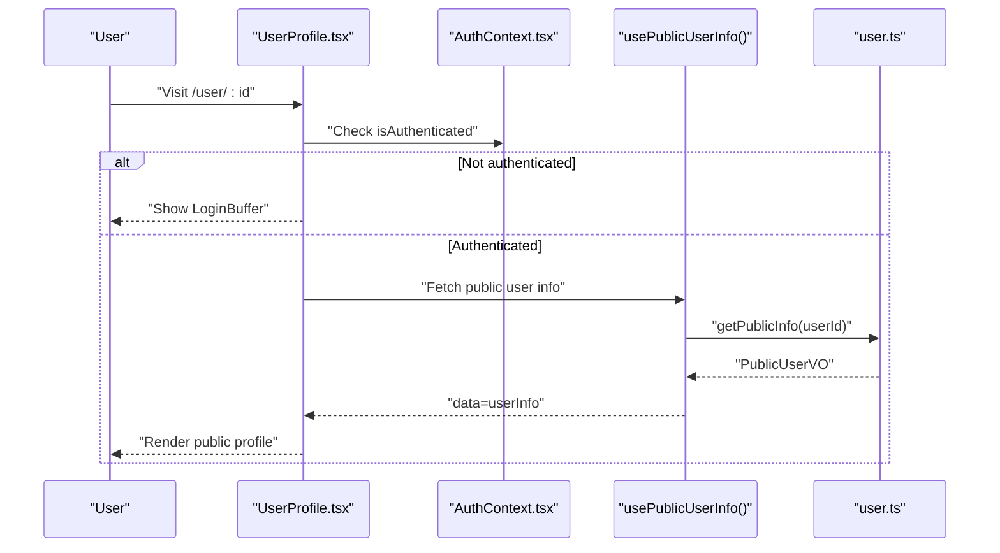
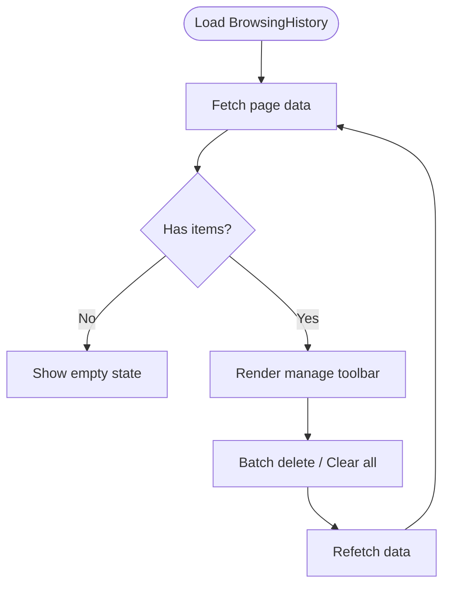
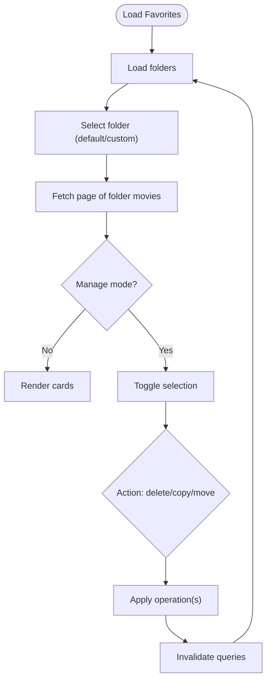
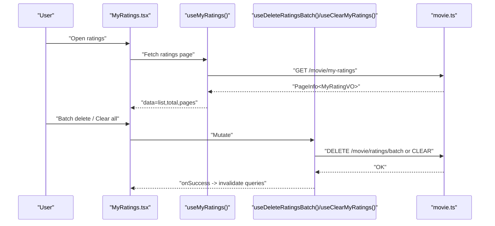
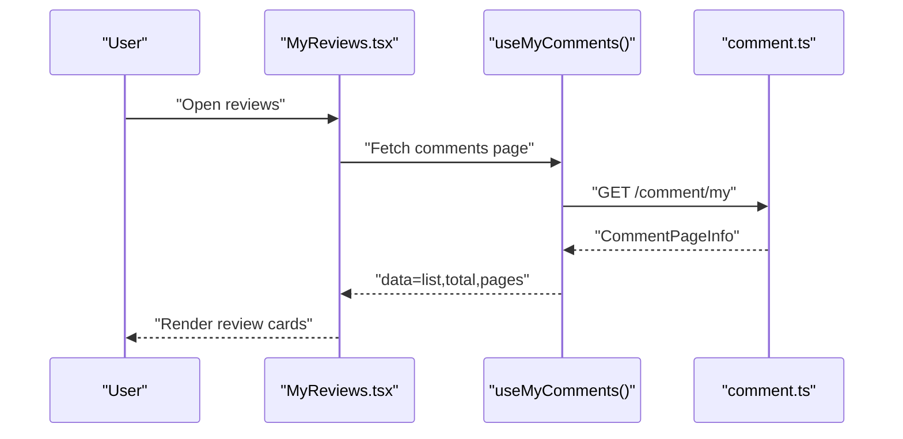
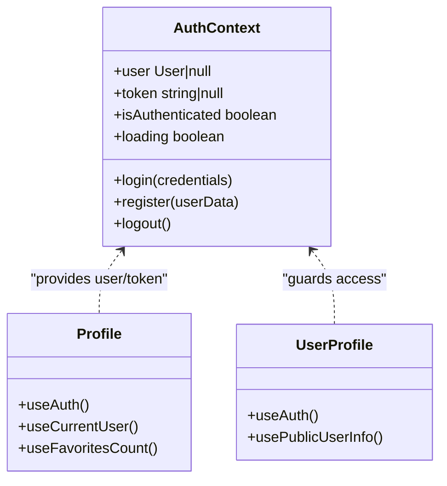
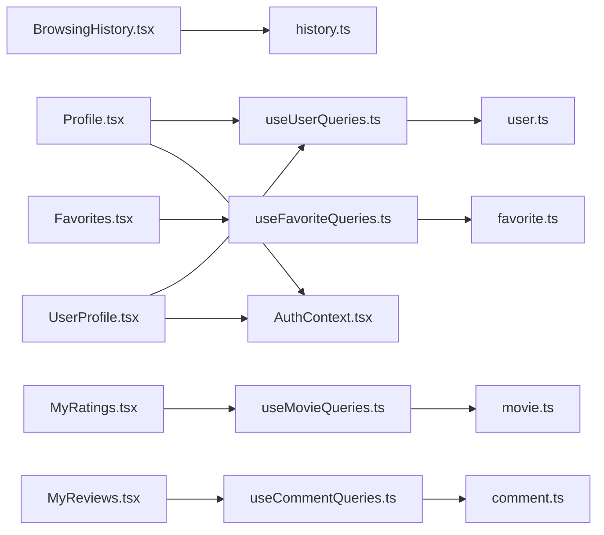

# Profile Pages

<cite>
**Referenced Files in This Document**
- [Profile.tsx](file://movie-review-web/src/pages/Profile.tsx)
- [UserProfile.tsx](file://movie-review-web/src/pages/UserProfile.tsx)
- [AuthContext.tsx](file://movie-review-web/src/context/AuthContext.tsx)
- [useUserQueries.ts](file://movie-review-web/src/hooks/useUserQueries.ts)
- [useFavoriteQueries.ts](file://movie-review-web/src/hooks/useFavoriteQueries.ts)
- [useMovieQueries.ts](file://movie-review-web/src/hooks/useMovieQueries.ts)
- [useCommentQueries.ts](file://movie-review-web/src/hooks/useCommentQueries.ts)
- [user.ts](file://movie-review-web/src/api/user.ts)
- [favorite.ts](file://movie-review-web/src/api/favorite.ts)
- [history.ts](file://movie-review-web/src/api/history.ts)
- [index.ts](file://movie-review-web/src/types/index.ts)
- [BrowsingHistory.tsx](file://movie-review-web/src/pages/BrowsingHistory.tsx)
- [Favorites.tsx](file://movie-review-web/src/pages/Favorites.tsx)
- [MyRatings.tsx](file://movie-review-web/src/pages/MyRatings.tsx)
- [MyReviews.tsx](file://movie-review-web/src/pages/MyReviews.tsx)
</cite>

## Table of Contents
1. [Introduction](#introduction)
2. [Project Structure](#project-structure)
3. [Core Components](#core-components)
4. [Architecture Overview](#architecture-overview)
5. [Detailed Component Analysis](#detailed-component-analysis)
6. [Dependency Analysis](#dependency-analysis)
7. [Performance Considerations](#performance-considerations)
8. [Troubleshooting Guide](#troubleshooting-guide)
9. [Conclusion](#conclusion)

## Introduction
This document describes the user profile pages and personal account management features. It covers:
- The authenticated user’s own profile page
- Public user profile view for others
- Browsing history tracking
- Favorites management (including folders)
- Ratings display
- Review management
- Data fetching strategies, pagination, and filtering
- Component composition patterns, permissions, and privacy
- Navigation between sections, state management, and authentication integration
- Examples of profile editing workflows, content organization, and responsive layout patterns

## Project Structure
The profile-related functionality spans React components, React Query hooks, API clients, and shared types. Authentication state is centralized via a context provider.

**Diagram sources**
- [Profile.tsx](file://movie-review-web/src/pages/Profile.tsx#L1-L132)
- [UserProfile.tsx](file://movie-review-web/src/pages/UserProfile.tsx#L1-L124)
- [useUserQueries.ts](file://movie-review-web/src/hooks/useUserQueries.ts#L1-L36)
- [useFavoriteQueries.ts](file://movie-review-web/src/hooks/useFavoriteQueries.ts#L1-L174)
- [useMovieQueries.ts](file://movie-review-web/src/hooks/useMovieQueries.ts#L1-L95)
- [useCommentQueries.ts](file://movie-review-web/src/hooks/useCommentQueries.ts#L1-L102)
- [user.ts](file://movie-review-web/src/api/user.ts#L1-L36)
- [favorite.ts](file://movie-review-web/src/api/favorite.ts#L1-L97)
- [history.ts](file://movie-review-web/src/api/history.ts#L1-L38)
- [AuthContext.tsx](file://movie-review-web/src/context/AuthContext.tsx#L1-L123)
- [index.ts](file://movie-review-web/src/types/index.ts#L1-L204)

**Section sources**
- [Profile.tsx](file://movie-review-web/src/pages/Profile.tsx#L1-L132)
- [UserProfile.tsx](file://movie-review-web/src/pages/UserProfile.tsx#L1-L124)
- [AuthContext.tsx](file://movie-review-web/src/context/AuthContext.tsx#L1-L123)
- [useUserQueries.ts](file://movie-review-web/src/hooks/useUserQueries.ts#L1-L36)
- [useFavoriteQueries.ts](file://movie-review-web/src/hooks/useFavoriteQueries.ts#L1-L174)
- [useMovieQueries.ts](file://movie-review-web/src/hooks/useMovieQueries.ts#L1-L95)
- [useCommentQueries.ts](file://movie-review-web/src/hooks/useCommentQueries.ts#L1-L102)
- [user.ts](file://movie-review-web/src/api/user.ts#L1-L36)
- [favorite.ts](file://movie-review-web/src/api/favorite.ts#L1-L97)
- [history.ts](file://movie-review-web/src/api/history.ts#L1-L38)
- [index.ts](file://movie-review-web/src/types/index.ts#L1-L204)

## Core Components
- Authenticated user profile page: renders the logged-in user’s info, stats, and quick links; integrates with user info and favorites count queries.
- Public user profile view: displays another user’s public info after authentication; handles loading and error states.
- Browsing history: paginated list of movies viewed by the authenticated user; supports single and batch deletion and clearing.
- Favorites: manages default and custom folders, bulk operations (delete, copy, move), and pagination.
- Ratings: lists the authenticated user’s ratings with batch delete and clear actions.
- Reviews: lists the authenticated user’s comments with pagination.

**Section sources**
- [Profile.tsx](file://movie-review-web/src/pages/Profile.tsx#L1-L132)
- [UserProfile.tsx](file://movie-review-web/src/pages/UserProfile.tsx#L1-L124)
- [BrowsingHistory.tsx](file://movie-review-web/src/pages/BrowsingHistory.tsx#L1-L309)
- [Favorites.tsx](file://movie-review-web/src/pages/Favorites.tsx#L1-L803)
- [MyRatings.tsx](file://movie-review-web/src/pages/MyRatings.tsx#L1-L270)
- [MyReviews.tsx](file://movie-review-web/src/pages/MyReviews.tsx#L1-L141)

## Architecture Overview
The profile system follows a layered pattern:
- UI pages orchestrate data fetching via React Query hooks.
- Hooks encapsulate query keys and cache invalidation strategies.
- API clients abstract HTTP requests and response normalization.
- Authentication context provides global user state and guards protected routes.
- Types define shared data contracts across the app.

**Diagram sources**
- [Profile.tsx](file://movie-review-web/src/pages/Profile.tsx#L1-L132)
- [useUserQueries.ts](file://movie-review-web/src/hooks/useUserQueries.ts#L12-L22)
- [user.ts](file://movie-review-web/src/api/user.ts#L17-L20)

**Section sources**
- [Profile.tsx](file://movie-review-web/src/pages/Profile.tsx#L1-L132)
- [useUserQueries.ts](file://movie-review-web/src/hooks/useUserQueries.ts#L1-L36)
- [user.ts](file://movie-review-web/src/api/user.ts#L1-L36)
- [AuthContext.tsx](file://movie-review-web/src/context/AuthContext.tsx#L1-L123)

## Detailed Component Analysis

### Authenticated User Profile Page
- Purpose: Display current user’s profile card, stats, and quick navigation.
- Data fetching: Uses current user info and favorites count queries; queries are enabled only when a user exists.
- Composition: Integrates with authentication context and image optimization component.
- Navigation: Provides link to settings and profile sections.

**Diagram sources**
- [Profile.tsx](file://movie-review-web/src/pages/Profile.tsx#L9-L21)
- [useUserQueries.ts](file://movie-review-web/src/hooks/useUserQueries.ts#L12-L22)
- [useFavoriteQueries.ts](file://movie-review-web/src/hooks/useFavoriteQueries.ts#L28-L37)

**Section sources**
- [Profile.tsx](file://movie-review-web/src/pages/Profile.tsx#L1-L132)
- [useUserQueries.ts](file://movie-review-web/src/hooks/useUserQueries.ts#L1-L36)
- [useFavoriteQueries.ts](file://movie-review-web/src/hooks/useFavoriteQueries.ts#L1-L174)

### Public User Profile View
- Purpose: Show another user’s public profile after authentication.
- Permissions: Requires authentication; otherwise shows a login buffer with a target user ID.
- Error handling: Handles loading, errors, and missing user states gracefully.
- Privacy: Accessible only to authenticated users; sensitive fields are not shown.

**Diagram sources**
- [UserProfile.tsx](file://movie-review-web/src/pages/UserProfile.tsx#L8-L62)
- [AuthContext.tsx](file://movie-review-web/src/context/AuthContext.tsx#L112-L120)
- [useUserQueries.ts](file://movie-review-web/src/hooks/useUserQueries.ts#L24-L35)
- [user.ts](file://movie-review-web/src/api/user.ts#L22-L25)

**Section sources**
- [UserProfile.tsx](file://movie-review-web/src/pages/UserProfile.tsx#L1-L124)
- [AuthContext.tsx](file://movie-review-web/src/context/AuthContext.tsx#L1-L123)
- [useUserQueries.ts](file://movie-review-web/src/hooks/useUserQueries.ts#L1-L36)
- [user.ts](file://movie-review-web/src/api/user.ts#L1-L36)

### Browsing History Tracking
- Data fetching: Paginated list with explicit page and size parameters.
- Operations: Supports single deletion, batch deletion, and clear all.
- Filtering: None; shows recent viewing records.
- UX: Manage mode with selection, toolbar, and pagination controls.

**Diagram sources**
- [BrowsingHistory.tsx](file://movie-review-web/src/pages/BrowsingHistory.tsx#L8-L35)
- [history.ts](file://movie-review-web/src/api/history.ts#L5-L34)

**Section sources**
- [BrowsingHistory.tsx](file://movie-review-web/src/pages/BrowsingHistory.tsx#L1-L309)
- [history.ts](file://movie-review-web/src/api/history.ts#L1-L38)

### Favorites Management
- Folders: Default and custom folders; CRUD operations supported.
- Bulk operations: Delete, copy, move across folders; selection per page.
- Pagination: Controlled via page state and API parameters.
- State: Local state for selection, modal visibility, and folder form.

**Diagram sources**
- [Favorites.tsx](file://movie-review-web/src/pages/Favorites.tsx#L8-L70)
- [useFavoriteQueries.ts](file://movie-review-web/src/hooks/useFavoriteQueries.ts#L48-L75)
- [favorite.ts](file://movie-review-web/src/api/favorite.ts#L47-L93)

**Section sources**
- [Favorites.tsx](file://movie-review-web/src/pages/Favorites.tsx#L1-L803)
- [useFavoriteQueries.ts](file://movie-review-web/src/hooks/useFavoriteQueries.ts#L1-L174)
- [favorite.ts](file://movie-review-web/src/api/favorite.ts#L1-L97)

### Ratings Display
- Data fetching: Paginated list of the authenticated user’s ratings.
- Operations: Batch delete and clear all via mutations; maintains optimistic updates and cache invalidation.
- Filtering: None; shows all ratings.

**Diagram sources**
- [MyRatings.tsx](file://movie-review-web/src/pages/MyRatings.tsx#L8-L79)
- [useMovieQueries.ts](file://movie-review-web/src/hooks/useMovieQueries.ts#L27-L94)
- [index.ts](file://movie-review-web/src/types/index.ts#L162-L168)

**Section sources**
- [MyRatings.tsx](file://movie-review-web/src/pages/MyRatings.tsx#L1-L270)
- [useMovieQueries.ts](file://movie-review-web/src/hooks/useMovieQueries.ts#L1-L95)
- [index.ts](file://movie-review-web/src/types/index.ts#L1-L204)

### Review Management
- Data fetching: Paginated list of the authenticated user’s comments.
- Display: Shows content, timestamp, likes, and optional rating.
- Pagination: Controlled via page state.

**Diagram sources**
- [MyReviews.tsx](file://movie-review-web/src/pages/MyReviews.tsx#L7-L11)
- [useCommentQueries.ts](file://movie-review-web/src/hooks/useCommentQueries.ts#L24-L30)

**Section sources**
- [MyReviews.tsx](file://movie-review-web/src/pages/MyReviews.tsx#L1-L141)
- [useCommentQueries.ts](file://movie-review-web/src/hooks/useCommentQueries.ts#L1-L102)

### Authentication Integration
- Context: Stores user, token, and authentication state; exposes login, register, logout.
- Guards: Pages check authentication state; public profile view uses a login buffer when unauthenticated.
- Events: Subscribes to global unauthorized and token refresh events to keep state consistent.

**Diagram sources**
- [AuthContext.tsx](file://movie-review-web/src/context/AuthContext.tsx#L20-L122)
- [Profile.tsx](file://movie-review-web/src/pages/Profile.tsx#L9-L19)
- [UserProfile.tsx](file://movie-review-web/src/pages/UserProfile.tsx#L8-L20)

**Section sources**
- [AuthContext.tsx](file://movie-review-web/src/context/AuthContext.tsx#L1-L123)
- [Profile.tsx](file://movie-review-web/src/pages/Profile.tsx#L1-L132)
- [UserProfile.tsx](file://movie-review-web/src/pages/UserProfile.tsx#L1-L124)

## Dependency Analysis
- UI pages depend on React Query hooks for data fetching and mutations.
- Hooks depend on API clients for HTTP communication.
- API clients depend on a shared request client and types for response normalization.
- Authentication context is a singleton provider used across pages.

**Diagram sources**
- [Profile.tsx](file://movie-review-web/src/pages/Profile.tsx#L1-L132)
- [UserProfile.tsx](file://movie-review-web/src/pages/UserProfile.tsx#L1-L124)
- [BrowsingHistory.tsx](file://movie-review-web/src/pages/BrowsingHistory.tsx#L1-L309)
- [Favorites.tsx](file://movie-review-web/src/pages/Favorites.tsx#L1-L803)
- [MyRatings.tsx](file://movie-review-web/src/pages/MyRatings.tsx#L1-L270)
- [MyReviews.tsx](file://movie-review-web/src/pages/MyReviews.tsx#L1-L141)
- [useUserQueries.ts](file://movie-review-web/src/hooks/useUserQueries.ts#L1-L36)
- [useFavoriteQueries.ts](file://movie-review-web/src/hooks/useFavoriteQueries.ts#L1-L174)
- [useMovieQueries.ts](file://movie-review-web/src/hooks/useMovieQueries.ts#L1-L95)
- [useCommentQueries.ts](file://movie-review-web/src/hooks/useCommentQueries.ts#L1-L102)
- [user.ts](file://movie-review-web/src/api/user.ts#L1-L36)
- [favorite.ts](file://movie-review-web/src/api/favorite.ts#L1-L97)
- [history.ts](file://movie-review-web/src/api/history.ts#L1-L38)
- [AuthContext.tsx](file://movie-review-web/src/context/AuthContext.tsx#L1-L123)

**Section sources**
- [Profile.tsx](file://movie-review-web/src/pages/Profile.tsx#L1-L132)
- [UserProfile.tsx](file://movie-review-web/src/pages/UserProfile.tsx#L1-L124)
- [BrowsingHistory.tsx](file://movie-review-web/src/pages/BrowsingHistory.tsx#L1-L309)
- [Favorites.tsx](file://movie-review-web/src/pages/Favorites.tsx#L1-L803)
- [MyRatings.tsx](file://movie-review-web/src/pages/MyRatings.tsx#L1-L270)
- [MyReviews.tsx](file://movie-review-web/src/pages/MyReviews.tsx#L1-L141)
- [useUserQueries.ts](file://movie-review-web/src/hooks/useUserQueries.ts#L1-L36)
- [useFavoriteQueries.ts](file://movie-review-web/src/hooks/useFavoriteQueries.ts#L1-L174)
- [useMovieQueries.ts](file://movie-review-web/src/hooks/useMovieQueries.ts#L1-L95)
- [useCommentQueries.ts](file://movie-review-web/src/hooks/useCommentQueries.ts#L1-L102)
- [user.ts](file://movie-review-web/src/api/user.ts#L1-L36)
- [favorite.ts](file://movie-review-web/src/api/favorite.ts#L1-L97)
- [history.ts](file://movie-review-web/src/api/history.ts#L1-L38)
- [AuthContext.tsx](file://movie-review-web/src/context/AuthContext.tsx#L1-L123)

## Performance Considerations
- Caching: React Query caches queries keyed by parameters; staleTime reduces redundant network calls.
- Invalidation: Mutations invalidate related queries to keep views consistent.
- Pagination: Controlled page sizes prevent large payloads; lazy loading via page increments.
- Images: Optimized image component improves rendering performance.
- Minimal re-renders: Prefer memoization and local state only for UI flags.

[No sources needed since this section provides general guidance]

## Troubleshooting Guide
- Authentication issues: Listen for global unauthorized and token refresh events; ensure context state updates accordingly.
- Query errors: Use enabled flags to avoid unnecessary requests; handle loading and error states in pages.
- Cache inconsistencies: Use queryClient invalidation after mutations; confirm query keys match.
- Permission errors: Public profile requires authentication; redirect or show login buffer.

**Section sources**
- [AuthContext.tsx](file://movie-review-web/src/context/AuthContext.tsx#L88-L110)
- [UserProfile.tsx](file://movie-review-web/src/pages/UserProfile.tsx#L24-L62)
- [useUserQueries.ts](file://movie-review-web/src/hooks/useUserQueries.ts#L12-L22)
- [useFavoriteQueries.ts](file://movie-review-web/src/hooks/useFavoriteQueries.ts#L79-L101)

## Conclusion
The profile system combines React Query for robust data fetching, a centralized authentication context for permissions, and modular hooks for cache management. It supports authenticated self-profile, public user profiles, browsing history, favorites with folders, ratings, and reviews. The architecture emphasizes separation of concerns, responsive UI patterns, and maintainable state management.